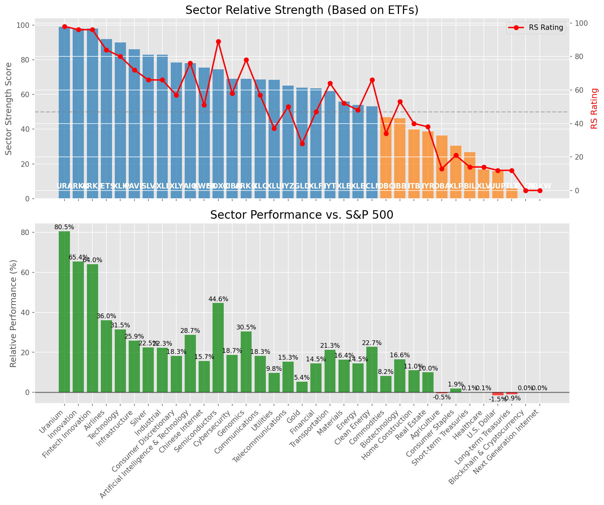

# **Daily Relative Strength Report**

**Date:** 2025-07-14

## **Market Valuation (Buffett Indicator)**

| Metric | Value |
|--------|-------|
| **Market Valuation** | **Overvalued** |
| **Current Ratio** | 10.27 |
| **Historical Mean** | 9.46 |
| **Standard Deviation** | 0.53 |
| **Z-Score (StdDev from Mean)** | 1.49 |
| **Total Market Cap** | $307.73 trillion |
| **GDP** | $29.96 trillion |

## **Market Insights**

### **Market is Overvalued**

The market appears to be trading above historical average valuations. While not at extreme levels, this suggests more modest future returns may be expected. Investors should:

- Focus on companies with reasonable valuations relative to their growth
- Be more selective with new positions
- Look for stocks showing relative strength within their sectors
- Consider trimming positions in extremely overvalued names

Historically, periods of mild overvaluation can persist for extended periods, but returns tend to be below average.

### **Buffett Indicator Overview**

The Buffett Indicator (Total Market Cap / GDP) is a measure of the stock market's valuation relative to the size of the economy. It is named after Warren Buffett, who described it as "probably the best single measure of where valuations stand at any given moment."

- **Values above +2 standard deviations:** Market significantly overvalued
- **Values above +1 standard deviation:** Market overvalued
- **Values between -1 and +1 standard deviations:** Market fairly valued
- **Values below -1 standard deviation:** Market undervalued
- **Values below -2 standard deviations:** Market significantly undervalued

---

## **Sector Relative Strength**

Based on William O'Neil's Relative Strength Methodology

| ETF | Strength | RS Rating | Performance | Above Key MAs | Trend | Sector |
|-----|----------|-----------|-------------|--------------|-------|--------|
| [URA](https://www.tradingview.com/chart/?symbol=URA) | 99.0 | 98.0 | 78.02% | 10d ✓, 50d ✓, 200d ✓ | ↗️ | Uranium |
| [BLOK](https://www.tradingview.com/chart/?symbol=BLOK) | 98.5 | 97.0 | 76.60% | 10d ✓, 50d ✓, 200d ✓ | ↗️ | Blockchain & Cryptocurrency |
| [ARKK](https://www.tradingview.com/chart/?symbol=ARKK) | 98.0 | 96.0 | 64.77% | 10d ✓, 50d ✓, 200d ✓ | ↗️ | Innovation |
| [ARKW](https://www.tradingview.com/chart/?symbol=ARKW) | 98.0 | 96.0 | 68.04% | 10d ✓, 50d ✓, 200d ✓ | ↗️ | Next Generation Internet |
| [ARKF](https://www.tradingview.com/chart/?symbol=ARKF) | 98.0 | 96.0 | 63.56% | 10d ✓, 50d ✓, 200d ✓ | ↗️ | Fintech Innovation |
| [JETS](https://www.tradingview.com/chart/?symbol=JETS) | 92.0 | 84.0 | 35.37% | 10d ✓, 50d ✓, 200d ✓ | ↗️ | Airlines |
| [XLK](https://www.tradingview.com/chart/?symbol=XLK) | 90.0 | 80.0 | 31.76% | 10d ✓, 50d ✓, 200d ✓ | ↗️ | Technology |
| [PAVE](https://www.tradingview.com/chart/?symbol=PAVE) | 86.0 | 72.0 | 25.84% | 10d ✓, 50d ✓, 200d ✓ | ↗️ | Infrastructure |
| [SLV](https://www.tradingview.com/chart/?symbol=SLV) | 84.0 | 68.0 | 23.11% | 10d ✓, 50d ✓, 200d ✓ | ↗️ | Silver |
| [XLI](https://www.tradingview.com/chart/?symbol=XLI) | 83.5 | 67.0 | 22.19% | 10d ✓, 50d ✓, 200d ✓ | ↗️ | Industrial |
| [XLY](https://www.tradingview.com/chart/?symbol=XLY) | 78.5 | 57.0 | 17.92% | 10d ✓, 50d ✓, 200d ✓ | ↗️ | Consumer Discretionary |
| [AIQ](https://www.tradingview.com/chart/?symbol=AIQ) | 78.1 | 76.0 | 28.81% | 10d ✗, 50d ✓, 200d ✓ | ↗️ | Artificial Intelligence & Technology |
| [KWEB](https://www.tradingview.com/chart/?symbol=KWEB) | 76.0 | 52.0 | 15.70% | 10d ✓, 50d ✓, 200d ✓ | ↗️ | Chinese Internet |
| [SOXX](https://www.tradingview.com/chart/?symbol=SOXX) | 75.0 | 90.0 | 44.98% | 10d ✓, 50d ✓, 200d ✓ | ↘️ | Semiconductors |
| [CIBR](https://www.tradingview.com/chart/?symbol=CIBR) | 70.1 | 60.0 | 18.96% | 10d ✗, 50d ✓, 200d ✓ | ↗️ | Cybersecurity |
| [XLC](https://www.tradingview.com/chart/?symbol=XLC) | 69.1 | 58.0 | 18.30% | 10d ✗, 50d ✓, 200d ✓ | ↗️ | Communications |
| [ARKG](https://www.tradingview.com/chart/?symbol=ARKG) | 69.0 | 78.0 | 30.01% | 10d ✓, 50d ✓, 200d ✓ | ↘️ | Genomics |
| [XLU](https://www.tradingview.com/chart/?symbol=XLU) | 69.0 | 38.0 | 9.40% | 10d ✓, 50d ✓, 200d ✓ | ↗️ | Utilities |
| [IYZ](https://www.tradingview.com/chart/?symbol=IYZ) | 65.6 | 51.0 | 15.23% | 10d ✗, 50d ✓, 200d ✓ | ↗️ | Telecommunications |
| [GLD](https://www.tradingview.com/chart/?symbol=GLD) | 65.0 | 30.0 | 5.52% | 10d ✓, 50d ✓, 200d ✓ | ↗️ | Gold |
| [XLF](https://www.tradingview.com/chart/?symbol=XLF) | 64.6 | 49.0 | 14.37% | 10d ✗, 50d ✓, 200d ✓ | ↗️ | Financial |
| [IYT](https://www.tradingview.com/chart/?symbol=IYT) | 62.5 | 65.0 | 21.28% | 10d ✓, 50d ✓, 200d ✓ | ↘️ | Transportation |
| [XLB](https://www.tradingview.com/chart/?symbol=XLB) | 57.0 | 54.0 | 16.44% | 10d ✓, 50d ✓, 200d ✓ | ↘️ | Materials |
| [XLE](https://www.tradingview.com/chart/?symbol=XLE) | 54.5 | 49.0 | 14.52% | 10d ✓, 50d ✓, 200d ✓ | ↘️ | Energy |
| [ICLN](https://www.tradingview.com/chart/?symbol=ICLN) | 53.6 | 67.0 | 22.55% | 10d ✗, 50d ✓, 200d ✓ | ↘️ | Clean Energy |
| [DBC](https://www.tradingview.com/chart/?symbol=DBC) | 47.5 | 35.0 | 8.34% | 10d ✓, 50d ✓, 200d ✓ | ↘️ | Commodities |
| [IBB](https://www.tradingview.com/chart/?symbol=IBB) | 46.8 | 54.0 | 16.75% | 10d ✓, 50d ✓, 200d ✗ | ↘️ | Biotechnology |
| [ITB](https://www.tradingview.com/chart/?symbol=ITB) | 40.3 | 41.0 | 10.78% | 10d ✓, 50d ✓, 200d ✗ | ↘️ | Home Construction |
| [IYR](https://www.tradingview.com/chart/?symbol=IYR) | 38.8 | 38.0 | 9.77% | 10d ✓, 50d ✓, 200d ✗ | ↘️ | Real Estate |
| [XLP](https://www.tradingview.com/chart/?symbol=XLP) | 31.0 | 22.0 | 1.66% | 10d ✗, 50d ✗, 200d ✗ | ↗️ | Consumer Staples |
| [DBA](https://www.tradingview.com/chart/?symbol=DBA) | 31.0 | 22.0 | 1.98% | 10d ✗, 50d ✗, 200d ✗ | ↗️ | Agriculture |
| [BIL](https://www.tradingview.com/chart/?symbol=BIL) | 27.3 | 15.0 | 0.06% | 10d ✓, 50d ✓, 200d ✗ | ↘️ | Short-term Treasuries |
| [XLV](https://www.tradingview.com/chart/?symbol=XLV) | 17.9 | 16.0 | 0.16% | 10d ✗, 50d ✓, 200d ✗ | ↘️ | Healthcare |
| [UUP](https://www.tradingview.com/chart/?symbol=UUP) | 15.9 | 12.0 | -1.50% | 10d ✓, 50d ✗, 200d ✗ | ↘️ | U.S. Dollar |
| [TLT](https://www.tradingview.com/chart/?symbol=TLT) | 6.5 | 13.0 | -0.96% | 10d ✗, 50d ✗, 200d ✗ | ↘️ | Long-term Treasuries |

### **Sector ETF Performance Interpretation**

This table shows the relative strength metrics for different market sectors based on their representative ETFs:

- **ETF**: The ETF used to measure sector performance (click for chart)
- **Strength**: Overall sector strength score (0-100) combining multiple factors
- **RS Rating**: O'Neil RS rating of the sector ETF
- **Performance**: Performance of the sector ETF relative to SPY
- **Above Key MAs**: Whether the ETF is trading above its 10, 50, and 200-day moving averages
- **Trend**: Whether the sector is in an uptrend (↗️) or downtrend (↘️)

### **Current Sector Leadership**

The current market leadership is coming from the following sectors: **Uranium, Blockchain & Cryptocurrency, Innovation**.

The **Uranium** sector (represented by **URA**) is showing particularly strong relative strength with an RS rating of 98.0 and performance of 78.02% vs. the S&P 500. This sector is trading above its 10-day, 50-day, 200-day moving average(s). Investors should consider focusing on high RS stocks within these leading sectors for potential outperformance.

---

## **Buy Recommendations**

The following 51 stocks show exceptional relative strength:

| RS Rating | Buy Score | Current Price | Chart | Name | Ticker |
|-----------|-----------|---------------|-------|------|--------|
| 100 | 100 | $210.62 | [Chart](https://www.tradingview.com/chart/?symbol=LEU) | Centrus Energy Corp. | LEU |
| 100 | 100 | $99.30 | [Chart](https://www.tradingview.com/chart/?symbol=HOOD) | Robinhood Markets, Inc. Class A Common Stock | HOOD |
| 99 | 100 | $47.85 | [Chart](https://www.tradingview.com/chart/?symbol=MP) | MP Materials Corp. | MP |
| 99 | 100 | $104.73 | [Chart](https://www.tradingview.com/chart/?symbol=VRNA) | Verona Pharma plc | VRNA |
| 99 | 100 | $111.17 | [Chart](https://www.tradingview.com/chart/?symbol=RBLX) | Roblox Corporation | RBLX |
| 99 | 100 | $149.42 | [Chart](https://www.tradingview.com/chart/?symbol=LMB) | Limbach Holdings, Inc Common Stock | LMB |
| 99 | 100 | $146.36 | [Chart](https://www.tradingview.com/chart/?symbol=FUTU) | Futu Holdings Limited American Depositary Shares | FUTU |
| 98 | 100 | $554.46 | [Chart](https://www.tradingview.com/chart/?symbol=GEV) | GE Vernova Inc. | GEV |
| 98 | 100 | $38.98 | [Chart](https://www.tradingview.com/chart/?symbol=AS) | Amer Sports, Inc. | AS |
| 97 | 100 | $348.62 | [Chart](https://www.tradingview.com/chart/?symbol=CVNA) | Carvana Co. | CVNA |
| 97 | 100 | $43.95 | [Chart](https://www.tradingview.com/chart/?symbol=FARO) | Faro Technologies Inc | FARO |
| 96 | 100 | $147.48 | [Chart](https://www.tradingview.com/chart/?symbol=PLTR) | Palantir Technologies Inc. Class A Common Stock | PLTR |
| 96 | 100 | $52.03 | [Chart](https://www.tradingview.com/chart/?symbol=ARKF) | ARK Fintech Innovation ETF | ARKF |
| 96 | 100 | $446.31 | [Chart](https://www.tradingview.com/chart/?symbol=MSTR) | MicroStrategy Inc | MSTR |
| 96 | 100 | $52.31 | [Chart](https://www.tradingview.com/chart/?symbol=KTOS) | Kratos Defense & Security Solutions, Inc. | KTOS |
| 96 | 100 | $152.16 | [Chart](https://www.tradingview.com/chart/?symbol=ARKW) | ARK Next Generation Internet ETF | ARKW |
| 95 | 100 | $219.14 | [Chart](https://www.tradingview.com/chart/?symbol=AGX) | Argan, Inc | AGX |
| 95 | 100 | $35.33 | [Chart](https://www.tradingview.com/chart/?symbol=ATRO) | Astronics Corp | ATRO |
| 94 | 100 | $100.89 | [Chart](https://www.tradingview.com/chart/?symbol=TPR) | Tapestry, Inc. Common Stock | TPR |
| 94 | 100 | $22.04 | [Chart](https://www.tradingview.com/chart/?symbol=MAG) | MAG Silver Corp. | MAG |
| 94 | 100 | $35.38 | [Chart](https://www.tradingview.com/chart/?symbol=NNE) | Nano Nuclear Energy Inc. Common Stock | NNE |
| 93 | 100 | $52.81 | [Chart](https://www.tradingview.com/chart/?symbol=AKRO) | Akero Therapeutics, Inc. Common Stock | AKRO |
| 93 | 100 | $35.62 | [Chart](https://www.tradingview.com/chart/?symbol=ATAT) | Atour Lifestyle Holdings Limited American Depositary Shares | ATAT |
| 93 | 100 | $20.77 | [Chart](https://www.tradingview.com/chart/?symbol=MIR) | Mirion Technologies, Inc. | MIR |
| 93 | 100 | $88.22 | [Chart](https://www.tradingview.com/chart/?symbol=RYTM) | Rhythm Pharmaceuticals, Inc. Common Stock | RYTM |
| 92 | 100 | $68.12 | [Chart](https://www.tradingview.com/chart/?symbol=IBIT) | iShares Bitcoin Trust ETF | IBIT |
| 92 | 100 | $53.09 | [Chart](https://www.tradingview.com/chart/?symbol=BTC) | Grayscale Bitcoin Mini Trust ETF | BTC |
| 91 | 100 | $48.33 | [Chart](https://www.tradingview.com/chart/?symbol=BBIO) | BridgeBio Pharma, Inc. Common Stock | BBIO |
| 91 | 100 | $184.07 | [Chart](https://www.tradingview.com/chart/?symbol=HWM) | Howmet Aerospace Inc. | HWM |
| 90 | 100 | $59.65 | [Chart](https://www.tradingview.com/chart/?symbol=IBKR) | Interactive Brokers Group, Inc. Class A Common Stock | IBKR |
| 89 | 100 | $260.58 | [Chart](https://www.tradingview.com/chart/?symbol=GE) | GE Aerospace | GE |
| 88 | 100 | $48.16 | [Chart](https://www.tradingview.com/chart/?symbol=DRS) | Leonardo DRS, Inc. Common Stock | DRS |
| 86 | 99 | $29.81 | [Chart](https://www.tradingview.com/chart/?symbol=DB) | Deutsche Bank Aktiengesellschaft | DB |
| 88 | 98 | $105.36 | [Chart](https://www.tradingview.com/chart/?symbol=SANM) | Sanmina  Corp | SANM |
| 88 | 98 | $87.25 | [Chart](https://www.tradingview.com/chart/?symbol=C) | Citigroup Inc. | C |
| 88 | 98 | $254.64 | [Chart](https://www.tradingview.com/chart/?symbol=WTS) | Watts Water Technologies, Inc. Class A | WTS |
| 86 | 98 | $150.95 | [Chart](https://www.tradingview.com/chart/?symbol=COOP) | Mr. Cooper Group Inc. Common Stock | COOP |
| 85 | 98 | $18.66 | [Chart](https://www.tradingview.com/chart/?symbol=BCS) | Barclays PLC | BCS |
| 84 | 97 | $242.70 | [Chart](https://www.tradingview.com/chart/?symbol=DASH) | DoorDash, Inc. Class A Common Stock | DASH |
| 84 | 96 | $73.72 | [Chart](https://www.tradingview.com/chart/?symbol=TPB) | Turning Point Brands, Inc. | TPB |
| 84 | 95 | $357.43 | [Chart](https://www.tradingview.com/chart/?symbol=APP) | Applovin Corporation Class A Common Stock | APP |
| 84 | 95 | $220.37 | [Chart](https://www.tradingview.com/chart/?symbol=COF) | Capital One Financial | COF |
| 81 | 95 | $29.11 | [Chart](https://www.tradingview.com/chart/?symbol=SRAD) | Sportradar Group AG Class A Ordinary Shares | SRAD |
| 83 | 94 | $282.66 | [Chart](https://www.tradingview.com/chart/?symbol=VEEV) | Veeva Systems Inc. | VEEV |
| 81 | 94 | $29.39 | [Chart](https://www.tradingview.com/chart/?symbol=CAE) | CAE INC | CAE |
| 81 | 94 | $45.66 | [Chart](https://www.tradingview.com/chart/?symbol=EXEL) | Exelixis Inc | EXEL |
| 82 | 93 | $44.56 | [Chart](https://www.tradingview.com/chart/?symbol=TOST) | Toast, Inc. | TOST |
| 81 | 92 | $73.00 | [Chart](https://www.tradingview.com/chart/?symbol=ULS) | UL Solutions Inc. | ULS |
| 81 | 91 | $61.07 | [Chart](https://www.tradingview.com/chart/?symbol=EPR) | EPR Properties | EPR |
| 81 | 91 | $83.33 | [Chart](https://www.tradingview.com/chart/?symbol=WFC) | Wells Fargo & Co. | WFC |
| 81 | 90 | $50.59 | [Chart](https://www.tradingview.com/chart/?symbol=SIL) | Global X Silver Miners ETF (NEW) | SIL |

---

## **Sell Recommendations**

The following 127 stocks show deteriorating relative strength:

| RS Rating | Sell Score | Current Price | Chart | Name | Ticker |
|-----------|------------|---------------|-------|------|--------|
| 1 | 100 | $24.97 | [Chart](https://www.tradingview.com/chart/?symbol=QID) | ProShares UltraShort QQQ | QID |
| 1 | 100 | $25.92 | [Chart](https://www.tradingview.com/chart/?symbol=TECS) | Direxion Daily Technology Bear 3x Shares | TECS |
| 1 | 100 | $34.21 | [Chart](https://www.tradingview.com/chart/?symbol=SARK) | Investment Managers Series Trust II Tradr 1X Short Innovation Daily ETF | SARK |
| 1 | 100 | $219.40 | [Chart](https://www.tradingview.com/chart/?symbol=MOH) | Molina Healthcare, Inc. | MOH |
| 2 | 100 | $40.65 | [Chart](https://www.tradingview.com/chart/?symbol=SDOW) | ProShares UltraPro Short Dow 30 | SDOW |
| 2 | 100 | $10.25 | [Chart](https://www.tradingview.com/chart/?symbol=SNDX) | Syndax Pharmaceuticals, Inc. | SNDX |
| 2 | 100 | $16.36 | [Chart](https://www.tradingview.com/chart/?symbol=SDS) | ProShares UltraShort S&P500 | SDS |
| 2 | 100 | $12.26 | [Chart](https://www.tradingview.com/chart/?symbol=IART) | Integra LifeSciences Holdings | IART |
| 2 | 100 | $21.08 | [Chart](https://www.tradingview.com/chart/?symbol=ERY) | Direxion Daily Energy Bear 2X Shares | ERY |
| 3 | 100 | $23.93 | [Chart](https://www.tradingview.com/chart/?symbol=DXD) | ProShares UltraShort Dow 30 | DXD |
| 3 | 100 | $33.46 | [Chart](https://www.tradingview.com/chart/?symbol=PSQ) | ProShares Short QQQ | PSQ |
| 3 | 100 | $42.01 | [Chart](https://www.tradingview.com/chart/?symbol=LINE) | Lineage, Inc. Common Stock | LINE |
| 3 | 100 | $48.74 | [Chart](https://www.tradingview.com/chart/?symbol=ASGN) | ASGN Incorporated | ASGN |
| 3 | 100 | $23.89 | [Chart](https://www.tradingview.com/chart/?symbol=CRTO) | Criteo S.A. | CRTO |
| 3 | 100 | $10.30 | [Chart](https://www.tradingview.com/chart/?symbol=WNC) | Wabash National Corp. | WNC |
| 3 | 100 | $228.34 | [Chart](https://www.tradingview.com/chart/?symbol=HUM) | Humana Inc. | HUM |
| 3 | 100 | $10.75 | [Chart](https://www.tradingview.com/chart/?symbol=SONO) | Sonos, Inc. Common Stock | SONO |
| 3 | 100 | $37.24 | [Chart](https://www.tradingview.com/chart/?symbol=IBTA) | Ibotta, Inc. | IBTA |
| 4 | 100 | $39.35 | [Chart](https://www.tradingview.com/chart/?symbol=SH) | ProShares Short S&P500 | SH |
| 4 | 100 | $99.37 | [Chart](https://www.tradingview.com/chart/?symbol=ONTO) | Onto Innovation Inc. | ONTO |
| 4 | 100 | $16.34 | [Chart](https://www.tradingview.com/chart/?symbol=COLD) | Americold Realty Trust, Inc. | COLD |
| 4 | 100 | $31.84 | [Chart](https://www.tradingview.com/chart/?symbol=CRI) | Carter's Inc. | CRI |
| 4 | 100 | $10.38 | [Chart](https://www.tradingview.com/chart/?symbol=LBTYK) | Liberty Global Ltd. Class C Common Shares | LBTYK |
| 4 | 100 | $12.07 | [Chart](https://www.tradingview.com/chart/?symbol=CCRN) | Cross Country Healthcare Inc | CCRN |
| 4 | 100 | $60.49 | [Chart](https://www.tradingview.com/chart/?symbol=STC) | Stewart Information Services Corporation | STC |
| 4 | 100 | $50.65 | [Chart](https://www.tradingview.com/chart/?symbol=SLVM) | Sylvamo Corporation | SLVM |
| 5 | 100 | $25.34 | [Chart](https://www.tradingview.com/chart/?symbol=DOG) | ProShares Short Dow30 | DOG |
| 5 | 100 | $27.65 | [Chart](https://www.tradingview.com/chart/?symbol=OMCL) | Omnicell Inc | OMCL |
| 5 | 100 | $132.16 | [Chart](https://www.tradingview.com/chart/?symbol=ICUI) | ICU Medical Inc | ICUI |
| 6 | 100 | $98.31 | [Chart](https://www.tradingview.com/chart/?symbol=DECK) | Deckers Outdoor Corp | DECK |
| 6 | 100 | $68.82 | [Chart](https://www.tradingview.com/chart/?symbol=TNET) | TRINET GROUP, INC. | TNET |
| 6 | 100 | $16.52 | [Chart](https://www.tradingview.com/chart/?symbol=HP) | Helmerich & Payne, Inc. | HP |
| 6 | 100 | $10.74 | [Chart](https://www.tradingview.com/chart/?symbol=SD) | SandRidge Energy, Inc. | SD |
| 6 | 100 | $130.84 | [Chart](https://www.tradingview.com/chart/?symbol=INSP) | Inspire Medical Systems, Inc. | INSP |
| 6 | 100 | $115.97 | [Chart](https://www.tradingview.com/chart/?symbol=TFX) | Teleflex Incorporated | TFX |
| 6 | 100 | $10.06 | [Chart](https://www.tradingview.com/chart/?symbol=LBTYA) | Liberty Global Ltd. Class A Common Shares | LBTYA |
| 7 | 100 | $38.29 | [Chart](https://www.tradingview.com/chart/?symbol=LKQ) | LKQ Corporation | LKQ |
| 7 | 100 | $60.25 | [Chart](https://www.tradingview.com/chart/?symbol=COLM) | Columbia Sportswear Co | COLM |
| 7 | 100 | $15.81 | [Chart](https://www.tradingview.com/chart/?symbol=TNDM) | Tandem Diabetes Care, Inc. | TNDM |
| 7 | 100 | $63.29 | [Chart](https://www.tradingview.com/chart/?symbol=ZROZ) | PIMCO 25+ Year Zero Coupon U.S. Treasury Index Exchange-Traded Fund | ZROZ |
| 7 | 100 | $126.84 | [Chart](https://www.tradingview.com/chart/?symbol=KMB) | Kimberly-Clark Corp. | KMB |
| 8 | 100 | $47.51 | [Chart](https://www.tradingview.com/chart/?symbol=BMY) | Bristol-Myers Squibb Co. | BMY |
| 9 | 100 | $51.08 | [Chart](https://www.tradingview.com/chart/?symbol=LW) | Lamb Weston Holdings, Inc. | LW |
| 10 | 100 | $13.13 | [Chart](https://www.tradingview.com/chart/?symbol=BSM) | Black Stone Minerals, L.P. | BSM |
| 11 | 100 | $14.71 | [Chart](https://www.tradingview.com/chart/?symbol=VRE) | Veris Residential, Inc. | VRE |
| 11 | 100 | $50.48 | [Chart](https://www.tradingview.com/chart/?symbol=CNMD) | CONMED Corporation | CNMD |
| 12 | 100 | $21.66 | [Chart](https://www.tradingview.com/chart/?symbol=TUA) | Simplify Short Term Treasury Futures Strategy ETF | TUA |
| 15 | 100 | $27.68 | [Chart](https://www.tradingview.com/chart/?symbol=GTY) | Getty Realty Corp. | GTY |
| 15 | 100 | $29.14 | [Chart](https://www.tradingview.com/chart/?symbol=SPTS) | SPDR Portfolio Short Term Treasury ETF | SPTS |
| 9 | 99 | $13.51 | [Chart](https://www.tradingview.com/chart/?symbol=GO) | Grocery Outlet Holding Corp. Common Stock | GO |
| 3 | 98 | $65.89 | [Chart](https://www.tradingview.com/chart/?symbol=SKY) | Champion Homes, Inc. | SKY |
| 8 | 98 | $15.46 | [Chart](https://www.tradingview.com/chart/?symbol=PRO) | Pros Holdings, Inc. | PRO |
| 11 | 98 | $88.83 | [Chart](https://www.tradingview.com/chart/?symbol=CL) | Colgate-Palmolive Company | CL |
| 11 | 98 | $19.14 | [Chart](https://www.tradingview.com/chart/?symbol=SPT) | Sprout Social, Inc Class A Common Stock | SPT |
| 14 | 98 | $16.75 | [Chart](https://www.tradingview.com/chart/?symbol=MLN) | VanEck Long Muni ETF | MLN |
| 17 | 98 | $10.30 | [Chart](https://www.tradingview.com/chart/?symbol=NMZ) | Nuveen Municipal High Income Opportunity Fund | NMZ |
| 4 | 97 | $10.22 | [Chart](https://www.tradingview.com/chart/?symbol=SPDN) | Direxion Daily S&P 500 Bear 1X Shares | SPDN |
| 10 | 97 | $46.91 | [Chart](https://www.tradingview.com/chart/?symbol=KBR) | KBR, Inc. | KBR |
| 10 | 97 | $45.90 | [Chart](https://www.tradingview.com/chart/?symbol=CWT) | California Water Service | CWT |
| 13 | 97 | $41.09 | [Chart](https://www.tradingview.com/chart/?symbol=POR) | Portland General Electric Company | POR |
| 13 | 97 | $21.07 | [Chart](https://www.tradingview.com/chart/?symbol=LGOV) | First Trust Long Duration Opportunities ETF | LGOV |
| 14 | 97 | $340.69 | [Chart](https://www.tradingview.com/chart/?symbol=EG) | Everest Group, Ltd. | EG |
| 7 | 96 | $17.30 | [Chart](https://www.tradingview.com/chart/?symbol=NOMD) | Nomad Foods Limited | NOMD |
| 10 | 96 | $13.49 | [Chart](https://www.tradingview.com/chart/?symbol=EIC) | Eagle Point Income Company Inc. | EIC |
| 13 | 96 | $85.59 | [Chart](https://www.tradingview.com/chart/?symbol=TLT) | iShares 20+ Year Treasury Bond ETF | TLT |
| 8 | 95 | $25.10 | [Chart](https://www.tradingview.com/chart/?symbol=DRV) | Direxion Daily Real Estate Bear 3X Shares | DRV |
| 10 | 95 | $38.73 | [Chart](https://www.tradingview.com/chart/?symbol=KSA) | iShares MSCI Saudi Arabia ETF | KSA |
| 14 | 95 | $108.09 | [Chart](https://www.tradingview.com/chart/?symbol=BAH) | Booz Allen Hamilton Holding Corporation | BAH |
| 7 | 94 | $24.46 | [Chart](https://www.tradingview.com/chart/?symbol=TBBB) | BBB Foods Inc. | TBBB |
| 12 | 94 | $48.50 | [Chart](https://www.tradingview.com/chart/?symbol=SNY) | Sanofi American Depositary Shares (Each representing one-half of one ordinary share) | SNY |
| 13 | 94 | $54.56 | [Chart](https://www.tradingview.com/chart/?symbol=VGLT) | Vanguard Long-Term Treasury ETF | VGLT |
| 15 | 94 | $58.48 | [Chart](https://www.tradingview.com/chart/?symbol=VGSH) | Vanguard Short-Term Treasury ETF | VGSH |
| 9 | 93 | $33.14 | [Chart](https://www.tradingview.com/chart/?symbol=KDP) | Keurig Dr Pepper Inc. | KDP |
| 17 | 92 | $34.68 | [Chart](https://www.tradingview.com/chart/?symbol=PECO) | Phillips Edison & Company, Inc. Common Stock | PECO |
| 23 | 92 | $32.31 | [Chart](https://www.tradingview.com/chart/?symbol=INVH) | Invitation Homes Inc. Common Stock | INVH |
| 12 | 91 | $102.13 | [Chart](https://www.tradingview.com/chart/?symbol=AFL) | Aflac Inc. | AFL |
| 14 | 91 | $18.53 | [Chart](https://www.tradingview.com/chart/?symbol=AKR) | Acadia Realty Trust | AKR |
| 15 | 90 | $82.45 | [Chart](https://www.tradingview.com/chart/?symbol=SHY) | iShares 1-3 Year Treasury Bond ETF | SHY |
| 16 | 90 | $49.09 | [Chart](https://www.tradingview.com/chart/?symbol=BNDX) | Vanguard Total International Bond ETF | BNDX |
| 22 | 90 | $61.05 | [Chart](https://www.tradingview.com/chart/?symbol=UL) | Unilever plc | UL |
| 23 | 90 | $40.36 | [Chart](https://www.tradingview.com/chart/?symbol=UDR) | UDR, Inc. | UDR |
| 16 | 89 | $39.66 | [Chart](https://www.tradingview.com/chart/?symbol=TOTL) | SSgA Active ETF Trust SPDR DoubleLine Total Return Tactical ETF | TOTL |
| 16 | 89 | $94.29 | [Chart](https://www.tradingview.com/chart/?symbol=IEF) | iShares 7-10 Year Treasury Bond ETF | IEF |
| 17 | 89 | $165.12 | [Chart](https://www.tradingview.com/chart/?symbol=HSY) | The Hershey Company | HSY |
| 18 | 89 | $562.03 | [Chart](https://www.tradingview.com/chart/?symbol=TYL) | Tyler Technologies, Inc. | TYL |
| 21 | 89 | $54.98 | [Chart](https://www.tradingview.com/chart/?symbol=DAY) | Dayforce, Inc. | DAY |
| 12 | 88 | $37.69 | [Chart](https://www.tradingview.com/chart/?symbol=WTRG) | Essential Utilities, Inc. | WTRG |
| 12 | 88 | $757.58 | [Chart](https://www.tradingview.com/chart/?symbol=EQIX) | Equinix, Inc. Common Stock REIT | EQIX |
| 16 | 88 | $221.43 | [Chart](https://www.tradingview.com/chart/?symbol=LOW) | Lowe's Companies Inc. | LOW |
| 17 | 88 | $11.45 | [Chart](https://www.tradingview.com/chart/?symbol=SITC) | SITE Centers Corp. Common Shares | SITC |
| 17 | 88 | $40.33 | [Chart](https://www.tradingview.com/chart/?symbol=FE) | FirstEnergy Corp. | FE |
| 13 | 87 | $20.14 | [Chart](https://www.tradingview.com/chart/?symbol=CON) | Concentra Group Holdings Parent, Inc. | CON |
| 18 | 87 | $38.68 | [Chart](https://www.tradingview.com/chart/?symbol=LZB) | La-Z-Boy Incorporated | LZB |
| 21 | 87 | $30.64 | [Chart](https://www.tradingview.com/chart/?symbol=AXTA) | Axalta Coating Systems Ltd. | AXTA |
| 15 | 86 | $110.21 | [Chart](https://www.tradingview.com/chart/?symbol=SHV) | iShares Short Treasury Bond ETF | SHV |
| 15 | 86 | $22.86 | [Chart](https://www.tradingview.com/chart/?symbol=IBTG) | iShares iBonds Dec 2026 Term Treasury ETF | IBTG |
| 26 | 86 | $66.70 | [Chart](https://www.tradingview.com/chart/?symbol=EQR) | Equity Residential | EQR |
| 23 | 85 | $17.93 | [Chart](https://www.tradingview.com/chart/?symbol=S) | SentinelOne, Inc. | S |
| 26 | 84 | $13.94 | [Chart](https://www.tradingview.com/chart/?symbol=DOLE) | Dole plc | DOLE |
| 17 | 83 | $26.85 | [Chart](https://www.tradingview.com/chart/?symbol=FCPT) | Four Corners Property Trust, Inc. | FCPT |
| 20 | 83 | $76.52 | [Chart](https://www.tradingview.com/chart/?symbol=AWR) | American States Water Company | AWR |
| 24 | 82 | $25.23 | [Chart](https://www.tradingview.com/chart/?symbol=PNTG) | The Pennant Group, Inc. Common Stock | PNTG |
| 31 | 82 | $122.23 | [Chart](https://www.tradingview.com/chart/?symbol=RGEN) | Repligen Corp | RGEN |
| 33 | 82 | $102.20 | [Chart](https://www.tradingview.com/chart/?symbol=CROX) | Crocs, Inc. | CROX |
| 28 | 81 | $74.86 | [Chart](https://www.tradingview.com/chart/?symbol=IFF) | International Flavors & Fragrances Inc. | IFF |
| 25 | 80 | $119.96 | [Chart](https://www.tradingview.com/chart/?symbol=ITGR) | Integer Holdings Corporation | ITGR |
| 36 | 80 | $20.90 | [Chart](https://www.tradingview.com/chart/?symbol=AMN) | AMN Healthcare Services | AMN |
| 25 | 79 | $27.30 | [Chart](https://www.tradingview.com/chart/?symbol=IVT) | InvenTrust Properties Corp. | IVT |
| 28 | 79 | $345.09 | [Chart](https://www.tradingview.com/chart/?symbol=SHW) | The Sherwin-Williams Company | SHW |
| 28 | 79 | $76.77 | [Chart](https://www.tradingview.com/chart/?symbol=CNS) | Cohen & Steers Inc. | CNS |
| 29 | 79 | $113.88 | [Chart](https://www.tradingview.com/chart/?symbol=CPT) | Camden Property Trust | CPT |
| 24 | 78 | $99.16 | [Chart](https://www.tradingview.com/chart/?symbol=FMX) | FOMENTO ECONOMICO MEXICANO, S.A.B. DE C.V. | FMX |
| 28 | 77 | $35.86 | [Chart](https://www.tradingview.com/chart/?symbol=AMH) | AMERICAN HOMES 4 RENT | AMH |
| 32 | 77 | $297.52 | [Chart](https://www.tradingview.com/chart/?symbol=UTHR) | United Therapeutics Corp | UTHR |
| 26 | 76 | $240.69 | [Chart](https://www.tradingview.com/chart/?symbol=RNR) | RenaissanceRe Holdings Ltd. | RNR |
| 30 | 76 | $37.13 | [Chart](https://www.tradingview.com/chart/?symbol=PBA) | PEMBINA PIPELINE CORPORATION | PBA |
| 33 | 76 | $149.10 | [Chart](https://www.tradingview.com/chart/?symbol=EA) | Electronic Arts Inc | EA |
| 32 | 75 | $94.70 | [Chart](https://www.tradingview.com/chart/?symbol=FRT) | Federal Realty Investment Trust | FRT |
| 36 | 74 | $29.64 | [Chart](https://www.tradingview.com/chart/?symbol=APPN) | Appian Corporation Class A Common Stock | APPN |
| 33 | 73 | $14.34 | [Chart](https://www.tradingview.com/chart/?symbol=BMEZ) | BlackRock Health Sciences Term Trust | BMEZ |
| 33 | 73 | $69.01 | [Chart](https://www.tradingview.com/chart/?symbol=BRC) | Brady Corporation | BRC |
| 37 | 73 | $17.57 | [Chart](https://www.tradingview.com/chart/?symbol=NVCR) | NovoCure Limited Ordinary Shares | NVCR |
| 38 | 73 | $11.61 | [Chart](https://www.tradingview.com/chart/?symbol=SHC) | Sotera Health Company Common Stock | SHC |
| 36 | 72 | $24.88 | [Chart](https://www.tradingview.com/chart/?symbol=HPQ) | HP Inc. | HPQ |
| 29 | 71 | $22.07 | [Chart](https://www.tradingview.com/chart/?symbol=BLFS) | BioLife Solutions Inc. | BLFS |
| 33 | 71 | $54.73 | [Chart](https://www.tradingview.com/chart/?symbol=ALRM) | Alarm.com Holdings, Inc. | ALRM |
| 37 | 66 | $85.74 | [Chart](https://www.tradingview.com/chart/?symbol=BIDU) | Baidu, Inc. | BIDU |

## **Methodology**

This report uses William O'Neil's relative strength methodology from Investors Business Daily:

* **RS Rating**: Percentile rank of stock's performance vs. S&P 500 over the past 63 trading days (1-99 scale)
* **Buy Criteria**: RS Rating >= 80, price above 50-day MA, strong uptrend, increasing volume
* **Sell Criteria**: RS Rating < 40, price below 50-day MA, downtrend, decreasing volume

### **O'Neil's Key Principles**

1. **Focus on relative performance** - stocks outperforming the market
2. **Price trend confirmation** - stock must be in an uptrend
3. **Volume confirmation** - strong volume supports price moves
4. **Moving average validation** - price above key moving averages
5. **Market leaders only** - concentrate on top-performing stocks

*Report generated automatically after market close*