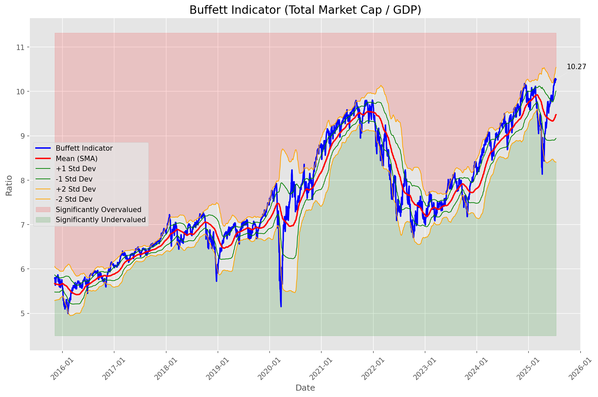
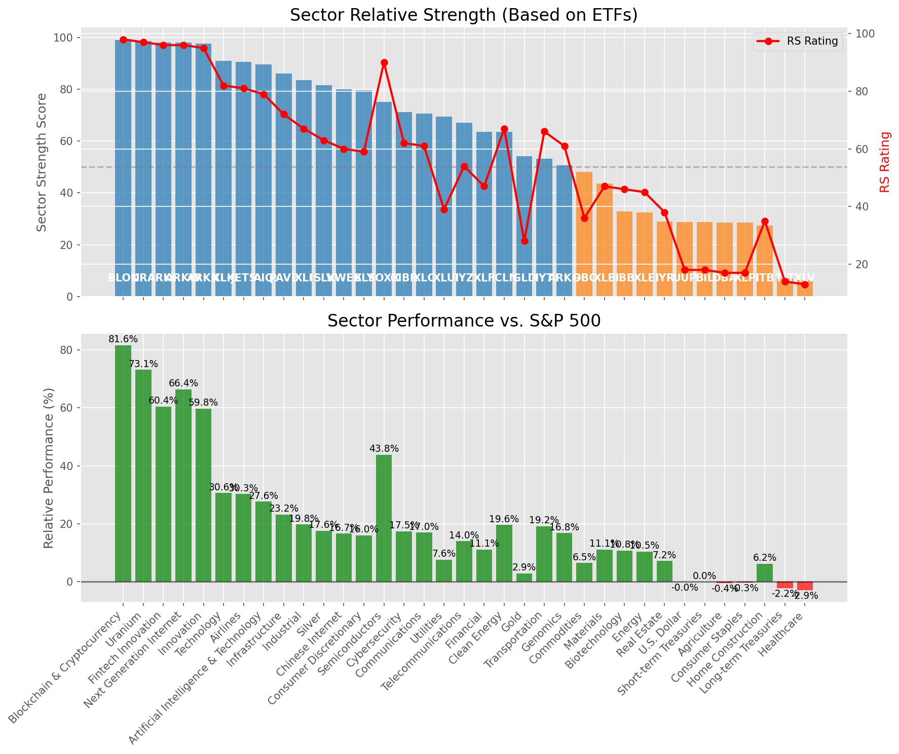

# **Daily Relative Strength Report**

**Date:** 2025-07-15

## **Market Valuation (Buffett Indicator)**

| Metric | Value |
|--------|-------|
| **Market Valuation** | **Overvalued** |
| **Current Ratio** | 10.26 |
| **Historical Mean** | 9.47 |
| **Standard Deviation** | 0.53 |
| **Z-Score (StdDev from Mean)** | 1.49 |
| **Total Market Cap** | $307.38 trillion |
| **GDP** | $29.96 trillion |

## **Market Insights**

### **Market is Overvalued**

The market appears to be trading above historical average valuations. While not at extreme levels, this suggests more modest future returns may be expected. Investors should:

- Focus on companies with reasonable valuations relative to their growth
- Be more selective with new positions
- Look for stocks showing relative strength within their sectors
- Consider trimming positions in extremely overvalued names

Historically, periods of mild overvaluation can persist for extended periods, but returns tend to be below average.

### **Buffett Indicator Overview**

The Buffett Indicator (Total Market Cap / GDP) is a measure of the stock market's valuation relative to the size of the economy. It is named after Warren Buffett, who described it as "probably the best single measure of where valuations stand at any given moment."

- **Values above +2 standard deviations:** Market significantly overvalued
- **Values above +1 standard deviation:** Market overvalued
- **Values between -1 and +1 standard deviations:** Market fairly valued
- **Values below -1 standard deviation:** Market undervalued
- **Values below -2 standard deviations:** Market significantly undervalued

---

## **Sector Relative Strength**

Based on William O'Neil's Relative Strength Methodology

| ETF | Strength | RS Rating | Performance | Above Key MAs | Trend | Sector |
|-----|----------|-----------|-------------|--------------|-------|--------|
| [BLOK](https://www.tradingview.com/chart/?symbol=BLOK) | 99.0 | 98.0 | 81.62% | 10d ✓, 50d ✓, 200d ✓ | ↗️ | Blockchain & Cryptocurrency |
| [URA](https://www.tradingview.com/chart/?symbol=URA) | 98.5 | 97.0 | 73.11% | 10d ✓, 50d ✓, 200d ✓ | ↗️ | Uranium |
| [ARKF](https://www.tradingview.com/chart/?symbol=ARKF) | 98.0 | 96.0 | 60.45% | 10d ✓, 50d ✓, 200d ✓ | ↗️ | Fintech Innovation |
| [ARKW](https://www.tradingview.com/chart/?symbol=ARKW) | 98.0 | 96.0 | 66.38% | 10d ✓, 50d ✓, 200d ✓ | ↗️ | Next Generation Internet |
| [ARKK](https://www.tradingview.com/chart/?symbol=ARKK) | 97.5 | 95.0 | 59.75% | 10d ✓, 50d ✓, 200d ✓ | ↗️ | Innovation |
| [XLK](https://www.tradingview.com/chart/?symbol=XLK) | 91.0 | 82.0 | 30.62% | 10d ✓, 50d ✓, 200d ✓ | ↗️ | Technology |
| [JETS](https://www.tradingview.com/chart/?symbol=JETS) | 90.5 | 81.0 | 30.25% | 10d ✓, 50d ✓, 200d ✓ | ↗️ | Airlines |
| [AIQ](https://www.tradingview.com/chart/?symbol=AIQ) | 89.5 | 79.0 | 27.65% | 10d ✓, 50d ✓, 200d ✓ | ↗️ | Artificial Intelligence & Technology |
| [PAVE](https://www.tradingview.com/chart/?symbol=PAVE) | 86.0 | 72.0 | 23.20% | 10d ✓, 50d ✓, 200d ✓ | ↗️ | Infrastructure |
| [XLI](https://www.tradingview.com/chart/?symbol=XLI) | 83.5 | 67.0 | 19.77% | 10d ✓, 50d ✓, 200d ✓ | ↗️ | Industrial |
| [SLV](https://www.tradingview.com/chart/?symbol=SLV) | 81.5 | 63.0 | 17.57% | 10d ✓, 50d ✓, 200d ✓ | ↗️ | Silver |
| [KWEB](https://www.tradingview.com/chart/?symbol=KWEB) | 80.0 | 60.0 | 16.66% | 10d ✓, 50d ✓, 200d ✓ | ↗️ | Chinese Internet |
| [XLY](https://www.tradingview.com/chart/?symbol=XLY) | 79.5 | 59.0 | 15.99% | 10d ✓, 50d ✓, 200d ✓ | ↗️ | Consumer Discretionary |
| [SOXX](https://www.tradingview.com/chart/?symbol=SOXX) | 75.0 | 90.0 | 43.85% | 10d ✓, 50d ✓, 200d ✓ | ↘️ | Semiconductors |
| [CIBR](https://www.tradingview.com/chart/?symbol=CIBR) | 71.1 | 62.0 | 17.46% | 10d ✗, 50d ✓, 200d ✓ | ↗️ | Cybersecurity |
| [XLC](https://www.tradingview.com/chart/?symbol=XLC) | 70.6 | 61.0 | 17.00% | 10d ✗, 50d ✓, 200d ✓ | ↗️ | Communications |
| [XLU](https://www.tradingview.com/chart/?symbol=XLU) | 69.5 | 39.0 | 7.57% | 10d ✓, 50d ✓, 200d ✓ | ↗️ | Utilities |
| [IYZ](https://www.tradingview.com/chart/?symbol=IYZ) | 67.1 | 54.0 | 14.03% | 10d ✗, 50d ✓, 200d ✓ | ↗️ | Telecommunications |
| [XLF](https://www.tradingview.com/chart/?symbol=XLF) | 63.6 | 47.0 | 11.12% | 10d ✗, 50d ✓, 200d ✓ | ↗️ | Financial |
| [ICLN](https://www.tradingview.com/chart/?symbol=ICLN) | 63.5 | 67.0 | 19.62% | 10d ✓, 50d ✓, 200d ✓ | ↘️ | Clean Energy |
| [GLD](https://www.tradingview.com/chart/?symbol=GLD) | 54.1 | 28.0 | 2.91% | 10d ✗, 50d ✓, 200d ✓ | ↗️ | Gold |
| [IYT](https://www.tradingview.com/chart/?symbol=IYT) | 53.1 | 66.0 | 19.15% | 10d ✗, 50d ✓, 200d ✓ | ↘️ | Transportation |
| [ARKG](https://www.tradingview.com/chart/?symbol=ARKG) | 50.6 | 61.0 | 16.79% | 10d ✗, 50d ✓, 200d ✓ | ↘️ | Genomics |
| [DBC](https://www.tradingview.com/chart/?symbol=DBC) | 48.0 | 36.0 | 6.50% | 10d ✓, 50d ✓, 200d ✓ | ↘️ | Commodities |
| [XLB](https://www.tradingview.com/chart/?symbol=XLB) | 43.6 | 47.0 | 11.14% | 10d ✗, 50d ✓, 200d ✓ | ↘️ | Materials |
| [IBB](https://www.tradingview.com/chart/?symbol=IBB) | 32.9 | 46.0 | 10.79% | 10d ✗, 50d ✓, 200d ✗ | ↘️ | Biotechnology |
| [XLE](https://www.tradingview.com/chart/?symbol=XLE) | 32.4 | 45.0 | 10.47% | 10d ✗, 50d ✓, 200d ✗ | ↘️ | Energy |
| [IYR](https://www.tradingview.com/chart/?symbol=IYR) | 28.9 | 38.0 | 7.20% | 10d ✗, 50d ✓, 200d ✗ | ↘️ | Real Estate |
| [UUP](https://www.tradingview.com/chart/?symbol=UUP) | 28.8 | 18.0 | -0.02% | 10d ✓, 50d ✓, 200d ✗ | ↘️ | U.S. Dollar |
| [BIL](https://www.tradingview.com/chart/?symbol=BIL) | 28.8 | 18.0 | 0.03% | 10d ✓, 50d ✓, 200d ✗ | ↘️ | Short-term Treasuries |
| [DBA](https://www.tradingview.com/chart/?symbol=DBA) | 28.5 | 17.0 | -0.42% | 10d ✗, 50d ✗, 200d ✗ | ↗️ | Agriculture |
| [XLP](https://www.tradingview.com/chart/?symbol=XLP) | 28.5 | 17.0 | -0.26% | 10d ✗, 50d ✗, 200d ✗ | ↗️ | Consumer Staples |
| [ITB](https://www.tradingview.com/chart/?symbol=ITB) | 27.4 | 35.0 | 6.19% | 10d ✗, 50d ✓, 200d ✗ | ↘️ | Home Construction |
| [TLT](https://www.tradingview.com/chart/?symbol=TLT) | 7.0 | 14.0 | -2.18% | 10d ✗, 50d ✗, 200d ✗ | ↘️ | Long-term Treasuries |
| [XLV](https://www.tradingview.com/chart/?symbol=XLV) | 6.5 | 13.0 | -2.92% | 10d ✗, 50d ✗, 200d ✗ | ↘️ | Healthcare |

### **Sector ETF Performance Interpretation**

This table shows the relative strength metrics for different market sectors based on their representative ETFs:

- **ETF**: The ETF used to measure sector performance (click for chart)
- **Strength**: Overall sector strength score (0-100) combining multiple factors
- **RS Rating**: O'Neil RS rating of the sector ETF
- **Performance**: Performance of the sector ETF relative to SPY
- **Above Key MAs**: Whether the ETF is trading above its 10, 50, and 200-day moving averages
- **Trend**: Whether the sector is in an uptrend (↗️) or downtrend (↘️)

### **Current Sector Leadership**

The current market leadership is coming from the following sectors: **Blockchain & Cryptocurrency, Uranium, Fintech Innovation**.

The **Blockchain & Cryptocurrency** sector (represented by **BLOK**) is showing particularly strong relative strength with an RS rating of 98.0 and performance of 81.62% vs. the S&P 500. This sector is trading above its 10-day, 50-day, 200-day moving average(s). Investors should consider focusing on high RS stocks within these leading sectors for potential outperformance.

---

## **Buy Recommendations**

The following 44 stocks show exceptional relative strength:

| RS Rating | Buy Score | Current Price | Chart | Name | Ticker |
|-----------|-----------|---------------|-------|------|--------|
| 100 | 100 | $101.00 | [Chart](https://www.tradingview.com/chart/?symbol=HOOD) | Robinhood Markets, Inc. Class A Common Stock | HOOD |
| 100 | 100 | $217.86 | [Chart](https://www.tradingview.com/chart/?symbol=LEU) | Centrus Energy Corp. | LEU |
| 100 | 100 | $60.81 | [Chart](https://www.tradingview.com/chart/?symbol=MP) | MP Materials Corp. | MP |
| 100 | 100 | $25.04 | [Chart](https://www.tradingview.com/chart/?symbol=EYE) | National Vision Holdings, Inc. Common Stock | EYE |
| 100 | 100 | $46.15 | [Chart](https://www.tradingview.com/chart/?symbol=TTMI) | TTM Technologies Inc | TTMI |
| 99 | 100 | $68.70 | [Chart](https://www.tradingview.com/chart/?symbol=LIF) | Life360, Inc. Common Stock | LIF |
| 99 | 100 | $149.53 | [Chart](https://www.tradingview.com/chart/?symbol=LMB) | Limbach Holdings, Inc Common Stock | LMB |
| 99 | 100 | $112.43 | [Chart](https://www.tradingview.com/chart/?symbol=RBLX) | Roblox Corporation | RBLX |
| 98 | 100 | $104.83 | [Chart](https://www.tradingview.com/chart/?symbol=VRNA) | Verona Pharma plc | VRNA |
| 98 | 100 | $43.98 | [Chart](https://www.tradingview.com/chart/?symbol=FARO) | Faro Technologies Inc | FARO |
| 98 | 100 | $146.65 | [Chart](https://www.tradingview.com/chart/?symbol=FUTU) | Futu Holdings Limited American Depositary Shares | FUTU |
| 98 | 100 | $39.44 | [Chart](https://www.tradingview.com/chart/?symbol=AS) | Amer Sports, Inc. | AS |
| 97 | 100 | $149.13 | [Chart](https://www.tradingview.com/chart/?symbol=PLTR) | Palantir Technologies Inc. Class A Common Stock | PLTR |
| 97 | 100 | $558.62 | [Chart](https://www.tradingview.com/chart/?symbol=GEV) | GE Vernova Inc. | GEV |
| 96 | 100 | $35.83 | [Chart](https://www.tradingview.com/chart/?symbol=ATAT) | Atour Lifestyle Holdings Limited American Depositary Shares | ATAT |
| 96 | 100 | $52.13 | [Chart](https://www.tradingview.com/chart/?symbol=ARKF) | ARK Fintech Innovation ETF | ARKF |
| 96 | 100 | $153.44 | [Chart](https://www.tradingview.com/chart/?symbol=ARKW) | ARK Next Generation Internet ETF | ARKW |
| 95 | 100 | $100.74 | [Chart](https://www.tradingview.com/chart/?symbol=TPR) | Tapestry, Inc. Common Stock | TPR |
| 95 | 100 | $35.53 | [Chart](https://www.tradingview.com/chart/?symbol=ATRO) | Astronics Corp | ATRO |
| 94 | 100 | $51.17 | [Chart](https://www.tradingview.com/chart/?symbol=KTOS) | Kratos Defense & Security Solutions, Inc. | KTOS |
| 94 | 100 | $35.38 | [Chart](https://www.tradingview.com/chart/?symbol=NNE) | Nano Nuclear Energy Inc. Common Stock | NNE |
| 93 | 100 | $449.92 | [Chart](https://www.tradingview.com/chart/?symbol=MSTR) | MicroStrategy Inc | MSTR |
| 93 | 100 | $224.15 | [Chart](https://www.tradingview.com/chart/?symbol=AGX) | Argan, Inc | AGX |
| 93 | 100 | $20.84 | [Chart](https://www.tradingview.com/chart/?symbol=MIR) | Mirion Technologies, Inc. | MIR |
| 93 | 100 | $89.50 | [Chart](https://www.tradingview.com/chart/?symbol=RYTM) | Rhythm Pharmaceuticals, Inc. Common Stock | RYTM |
| 92 | 100 | $127.13 | [Chart](https://www.tradingview.com/chart/?symbol=TWLO) | Twilio Inc. | TWLO |
| 92 | 100 | $184.62 | [Chart](https://www.tradingview.com/chart/?symbol=HWM) | Howmet Aerospace Inc. | HWM |
| 92 | 100 | $21.98 | [Chart](https://www.tradingview.com/chart/?symbol=MAG) | MAG Silver Corp. | MAG |
| 92 | 100 | $90.88 | [Chart](https://www.tradingview.com/chart/?symbol=C) | Citigroup Inc. | C |
| 91 | 100 | $264.36 | [Chart](https://www.tradingview.com/chart/?symbol=GE) | GE Aerospace | GE |
| 91 | 100 | $52.13 | [Chart](https://www.tradingview.com/chart/?symbol=AKRO) | Akero Therapeutics, Inc. Common Stock | AKRO |
| 89 | 100 | $47.40 | [Chart](https://www.tradingview.com/chart/?symbol=BBIO) | BridgeBio Pharma, Inc. Common Stock | BBIO |
| 89 | 100 | $51.97 | [Chart](https://www.tradingview.com/chart/?symbol=BTC) | Grayscale Bitcoin Mini Trust ETF | BTC |
| 89 | 100 | $59.99 | [Chart](https://www.tradingview.com/chart/?symbol=IBKR) | Interactive Brokers Group, Inc. Class A Common Stock | IBKR |
| 88 | 100 | $76.99 | [Chart](https://www.tradingview.com/chart/?symbol=TPB) | Turning Point Brands, Inc. | TPB |
| 89 | 99 | $66.65 | [Chart](https://www.tradingview.com/chart/?symbol=IBIT) | iShares Bitcoin Trust ETF | IBIT |
| 85 | 98 | $157.70 | [Chart](https://www.tradingview.com/chart/?symbol=SE) | Sea Limited American Depositary Shares, each representing one Class A Ordinary Share | SE |
| 84 | 97 | $18.48 | [Chart](https://www.tradingview.com/chart/?symbol=BCS) | Barclays PLC | BCS |
| 83 | 96 | $29.48 | [Chart](https://www.tradingview.com/chart/?symbol=DB) | Deutsche Bank Aktiengesellschaft | DB |
| 82 | 96 | $29.58 | [Chart](https://www.tradingview.com/chart/?symbol=SRAD) | Sportradar Group AG Class A Ordinary Shares | SRAD |
| 84 | 95 | $45.33 | [Chart](https://www.tradingview.com/chart/?symbol=TOST) | Toast, Inc. | TOST |
| 81 | 94 | $29.56 | [Chart](https://www.tradingview.com/chart/?symbol=CAE) | CAE INC | CAE |
| 81 | 92 | $194.02 | [Chart](https://www.tradingview.com/chart/?symbol=ITA) | iShares U.S. Aerospace & Defense ETF | ITA |
| 81 | 92 | $81.53 | [Chart](https://www.tradingview.com/chart/?symbol=USFD) | US Foods Holding Corp. | USFD |

---

## **Sell Recommendations**

The following 187 stocks show deteriorating relative strength:

| RS Rating | Sell Score | Current Price | Chart | Name | Ticker |
|-----------|------------|---------------|-------|------|--------|
| 1 | 100 | $34.21 | [Chart](https://www.tradingview.com/chart/?symbol=SARK) | Investment Managers Series Trust II Tradr 1X Short Innovation Daily ETF | SARK |
| 1 | 100 | $11.08 | [Chart](https://www.tradingview.com/chart/?symbol=TZA) | Direxion Daily Small Cap Bear 3x Shares | TZA |
| 1 | 100 | $24.69 | [Chart](https://www.tradingview.com/chart/?symbol=QID) | ProShares UltraShort QQQ | QID |
| 1 | 100 | $10.09 | [Chart](https://www.tradingview.com/chart/?symbol=HIBS) | Direxion Daily S&P 500 High Beta Bear 3X Shares | HIBS |
| 1 | 100 | $25.01 | [Chart](https://www.tradingview.com/chart/?symbol=TECS) | Direxion Daily Technology Bear 3x Shares | TECS |
| 2 | 100 | $41.50 | [Chart](https://www.tradingview.com/chart/?symbol=LINE) | Lineage, Inc. Common Stock | LINE |
| 2 | 100 | $16.37 | [Chart](https://www.tradingview.com/chart/?symbol=SDS) | ProShares UltraShort S&P500 | SDS |
| 2 | 100 | $10.25 | [Chart](https://www.tradingview.com/chart/?symbol=SNDX) | Syndax Pharmaceuticals, Inc. | SNDX |
| 2 | 100 | $41.37 | [Chart](https://www.tradingview.com/chart/?symbol=SDOW) | ProShares UltraPro Short Dow 30 | SDOW |
| 2 | 100 | $222.22 | [Chart](https://www.tradingview.com/chart/?symbol=HUM) | Humana Inc. | HUM |
| 2 | 100 | $11.83 | [Chart](https://www.tradingview.com/chart/?symbol=IART) | Integra LifeSciences Holdings | IART |
| 3 | 100 | $47.59 | [Chart](https://www.tradingview.com/chart/?symbol=ASGN) | ASGN Incorporated | ASGN |
| 3 | 100 | $110.73 | [Chart](https://www.tradingview.com/chart/?symbol=COKE) | Coca-Cola Consolidated, Inc. Common Stock | COKE |
| 3 | 100 | $10.13 | [Chart](https://www.tradingview.com/chart/?symbol=WNC) | Wabash National Corp. | WNC |
| 3 | 100 | $10.80 | [Chart](https://www.tradingview.com/chart/?symbol=OFIX) | Orthofix Medical Inc. Common Stock (DE) | OFIX |
| 3 | 100 | $21.56 | [Chart](https://www.tradingview.com/chart/?symbol=ERY) | Direxion Daily Energy Bear 2X Shares | ERY |
| 3 | 100 | $33.27 | [Chart](https://www.tradingview.com/chart/?symbol=PSQ) | ProShares Short QQQ | PSQ |
| 3 | 100 | $10.68 | [Chart](https://www.tradingview.com/chart/?symbol=SONO) | Sonos, Inc. Common Stock | SONO |
| 3 | 100 | $37.09 | [Chart](https://www.tradingview.com/chart/?symbol=IBTA) | Ibotta, Inc. | IBTA |
| 3 | 100 | $81.42 | [Chart](https://www.tradingview.com/chart/?symbol=LNTH) | Lantheus Holdings, Inc | LNTH |
| 4 | 100 | $100.56 | [Chart](https://www.tradingview.com/chart/?symbol=ONTO) | Onto Innovation Inc. | ONTO |
| 4 | 100 | $50.26 | [Chart](https://www.tradingview.com/chart/?symbol=SLVM) | Sylvamo Corporation | SLVM |
| 4 | 100 | $24.21 | [Chart](https://www.tradingview.com/chart/?symbol=DXD) | ProShares UltraShort Dow 30 | DXD |
| 4 | 100 | $30.69 | [Chart](https://www.tradingview.com/chart/?symbol=CRI) | Carter's Inc. | CRI |
| 4 | 100 | $40.42 | [Chart](https://www.tradingview.com/chart/?symbol=RHI) | Robert Half Inc. | RHI |
| 4 | 100 | $19.64 | [Chart](https://www.tradingview.com/chart/?symbol=THS) | Treehouse Foods, Inc. | THS |
| 4 | 100 | $12.16 | [Chart](https://www.tradingview.com/chart/?symbol=CCRN) | Cross Country Healthcare Inc | CCRN |
| 4 | 100 | $15.63 | [Chart](https://www.tradingview.com/chart/?symbol=HP) | Helmerich & Payne, Inc. | HP |
| 4 | 100 | $10.23 | [Chart](https://www.tradingview.com/chart/?symbol=LBTYK) | Liberty Global Ltd. Class C Common Shares | LBTYK |
| 4 | 100 | $23.57 | [Chart](https://www.tradingview.com/chart/?symbol=CRTO) | Criteo S.A. | CRTO |
| 4 | 100 | $428.42 | [Chart](https://www.tradingview.com/chart/?symbol=MUSA) | MURPHY USA INC. | MUSA |
| 5 | 100 | $13.05 | [Chart](https://www.tradingview.com/chart/?symbol=AVTR) | Avantor, Inc. | AVTR |
| 5 | 100 | $124.16 | [Chart](https://www.tradingview.com/chart/?symbol=CLX) | Clorox Company | CLX |
| 5 | 100 | $39.36 | [Chart](https://www.tradingview.com/chart/?symbol=SH) | ProShares Short S&P500 | SH |
| 5 | 100 | $27.39 | [Chart](https://www.tradingview.com/chart/?symbol=OMCL) | Omnicell Inc | OMCL |
| 5 | 100 | $113.66 | [Chart](https://www.tradingview.com/chart/?symbol=TFX) | Teleflex Incorporated | TFX |
| 6 | 100 | $129.75 | [Chart](https://www.tradingview.com/chart/?symbol=INSP) | Inspire Medical Systems, Inc. | INSP |
| 6 | 100 | $54.63 | [Chart](https://www.tradingview.com/chart/?symbol=SPB) | Spectrum Brands Holdings, Inc. | SPB |
| 6 | 100 | $15.10 | [Chart](https://www.tradingview.com/chart/?symbol=TNDM) | Tandem Diabetes Care, Inc. | TNDM |
| 6 | 100 | $10.51 | [Chart](https://www.tradingview.com/chart/?symbol=SD) | SandRidge Energy, Inc. | SD |
| 6 | 100 | $10.10 | [Chart](https://www.tradingview.com/chart/?symbol=IMXI) | International Money Express, Inc. | IMXI |
| 6 | 100 | $21.43 | [Chart](https://www.tradingview.com/chart/?symbol=AMPH) | Amphastar Pharmaceuticals, Inc. | AMPH |
| 7 | 100 | $51.31 | [Chart](https://www.tradingview.com/chart/?symbol=LGIH) | LGI Homes, Inc. | LGIH |
| 7 | 100 | $59.10 | [Chart](https://www.tradingview.com/chart/?symbol=COLM) | Columbia Sportswear Co | COLM |
| 7 | 100 | $45.84 | [Chart](https://www.tradingview.com/chart/?symbol=CWT) | California Water Service | CWT |
| 7 | 100 | $37.76 | [Chart](https://www.tradingview.com/chart/?symbol=LKQ) | LKQ Corporation | LKQ |
| 7 | 100 | $126.61 | [Chart](https://www.tradingview.com/chart/?symbol=KMB) | Kimberly-Clark Corp. | KMB |
| 8 | 100 | $46.39 | [Chart](https://www.tradingview.com/chart/?symbol=BMY) | Bristol-Myers Squibb Co. | BMY |
| 8 | 100 | $25.50 | [Chart](https://www.tradingview.com/chart/?symbol=DOG) | ProShares Short Dow30 | DOG |
| 8 | 100 | $50.09 | [Chart](https://www.tradingview.com/chart/?symbol=LW) | Lamb Weston Holdings, Inc. | LW |
| 8 | 100 | $10.13 | [Chart](https://www.tradingview.com/chart/?symbol=LBTYA) | Liberty Global Ltd. Class A Common Shares | LBTYA |
| 9 | 100 | $101.61 | [Chart](https://www.tradingview.com/chart/?symbol=DEO) | Diageo plc | DEO |
| 10 | 100 | $88.43 | [Chart](https://www.tradingview.com/chart/?symbol=CL) | Colgate-Palmolive Company | CL |
| 10 | 100 | $331.57 | [Chart](https://www.tradingview.com/chart/?symbol=EG) | Everest Group, Ltd. | EG |
| 10 | 100 | $100.99 | [Chart](https://www.tradingview.com/chart/?symbol=AFL) | Aflac Inc. | AFL |
| 11 | 100 | $49.54 | [Chart](https://www.tradingview.com/chart/?symbol=CNMD) | CONMED Corporation | CNMD |
| 11 | 100 | $40.49 | [Chart](https://www.tradingview.com/chart/?symbol=POR) | Portland General Electric Company | POR |
| 11 | 100 | $62.65 | [Chart](https://www.tradingview.com/chart/?symbol=ZROZ) | PIMCO 25+ Year Zero Coupon U.S. Treasury Index Exchange-Traded Fund | ZROZ |
| 13 | 100 | $119.44 | [Chart](https://www.tradingview.com/chart/?symbol=RGEN) | Repligen Corp | RGEN |
| 13 | 100 | $27.29 | [Chart](https://www.tradingview.com/chart/?symbol=GTY) | Getty Realty Corp. | GTY |
| 14 | 100 | $20.95 | [Chart](https://www.tradingview.com/chart/?symbol=LGOV) | First Trust Long Duration Opportunities ETF | LGOV |
| 3 | 99 | $17.01 | [Chart](https://www.tradingview.com/chart/?symbol=BTAL) | AGF U.S. Market Neutral Anti-Beta Fund | BTAL |
| 10 | 99 | $13.38 | [Chart](https://www.tradingview.com/chart/?symbol=GO) | Grocery Outlet Holding Corp. Common Stock | GO |
| 12 | 99 | $14.56 | [Chart](https://www.tradingview.com/chart/?symbol=VRE) | Veris Residential, Inc. | VRE |
| 8 | 98 | $301.99 | [Chart](https://www.tradingview.com/chart/?symbol=CI) | The Cigna Group | CI |
| 8 | 98 | $13.48 | [Chart](https://www.tradingview.com/chart/?symbol=EIC) | Eagle Point Income Company Inc. | EIC |
| 9 | 98 | $13.00 | [Chart](https://www.tradingview.com/chart/?symbol=BSM) | Black Stone Minerals, L.P. | BSM |
| 13 | 98 | $19.11 | [Chart](https://www.tradingview.com/chart/?symbol=SPT) | Sprout Social, Inc Class A Common Stock | SPT |
| 13 | 98 | $105.54 | [Chart](https://www.tradingview.com/chart/?symbol=BAH) | Booz Allen Hamilton Holding Corporation | BAH |
| 9 | 97 | $15.39 | [Chart](https://www.tradingview.com/chart/?symbol=PRO) | Pros Holdings, Inc. | PRO |
| 10 | 97 | $294.26 | [Chart](https://www.tradingview.com/chart/?symbol=POOL) | Pool Corporation | POOL |
| 12 | 97 | $22.78 | [Chart](https://www.tradingview.com/chart/?symbol=RPD) | Rapid7, Inc. Common Stock | RPD |
| 13 | 97 | $60.12 | [Chart](https://www.tradingview.com/chart/?symbol=UL) | Unilever plc | UL |
| 14 | 97 | $85.00 | [Chart](https://www.tradingview.com/chart/?symbol=TLT) | iShares 20+ Year Treasury Bond ETF | TLT |
| 15 | 97 | $21.53 | [Chart](https://www.tradingview.com/chart/?symbol=TUA) | Simplify Short Term Treasury Futures Strategy ETF | TUA |
| 5 | 96 | $10.22 | [Chart](https://www.tradingview.com/chart/?symbol=SPDN) | Direxion Daily S&P 500 Bear 1X Shares | SPDN |
| 6 | 96 | $17.11 | [Chart](https://www.tradingview.com/chart/?symbol=NOMD) | Nomad Foods Limited | NOMD |
| 9 | 96 | $48.09 | [Chart](https://www.tradingview.com/chart/?symbol=SNY) | Sanofi American Depositary Shares (Each representing one-half of one ordinary share) | SNY |
| 10 | 96 | $130.85 | [Chart](https://www.tradingview.com/chart/?symbol=ICUI) | ICU Medical Inc | ICUI |
| 13 | 96 | $34.10 | [Chart](https://www.tradingview.com/chart/?symbol=PECO) | Phillips Edison & Company, Inc. Common Stock | PECO |
| 7 | 95 | $139.90 | [Chart](https://www.tradingview.com/chart/?symbol=DVA) | DaVita Inc. | DVA |
| 8 | 95 | $95.80 | [Chart](https://www.tradingview.com/chart/?symbol=CHD) | Church & Dwight Co., Inc. | CHD |
| 9 | 95 | $25.10 | [Chart](https://www.tradingview.com/chart/?symbol=DRV) | Direxion Daily Real Estate Bear 3X Shares | DRV |
| 13 | 95 | $38.22 | [Chart](https://www.tradingview.com/chart/?symbol=KSA) | iShares MSCI Saudi Arabia ETF | KSA |
| 13 | 95 | $74.39 | [Chart](https://www.tradingview.com/chart/?symbol=BG) | Bunge Global SA | BG |
| 14 | 95 | $29.98 | [Chart](https://www.tradingview.com/chart/?symbol=AXTA) | Axalta Coating Systems Ltd. | AXTA |
| 15 | 95 | $30.80 | [Chart](https://www.tradingview.com/chart/?symbol=SCHQ) | Schwab Long-Term U.S. Treasury ETF | SCHQ |
| 17 | 95 | $31.93 | [Chart](https://www.tradingview.com/chart/?symbol=INVH) | Invitation Homes Inc. Common Stock | INVH |
| 8 | 94 | $37.88 | [Chart](https://www.tradingview.com/chart/?symbol=VCEL) | Vericel Corporation | VCEL |
| 9 | 94 | $70.95 | [Chart](https://www.tradingview.com/chart/?symbol=MKC) | McCormick & Company, Incorporated Non-VTG CS | MKC |
| 13 | 94 | $10.25 | [Chart](https://www.tradingview.com/chart/?symbol=MUC) | BLACKROCK MUNIHOLDINGS CALIFORNIA QUALITY FUND, INC | MUC |
| 16 | 94 | $245.34 | [Chart](https://www.tradingview.com/chart/?symbol=VHT) | Vanguard Health Care ETF | VHT |
| 16 | 94 | $77.68 | [Chart](https://www.tradingview.com/chart/?symbol=EMN) | Eastman Chemical Company | EMN |
| 17 | 94 | $54.85 | [Chart](https://www.tradingview.com/chart/?symbol=DAY) | Dayforce, Inc. | DAY |
| 21 | 94 | $24.42 | [Chart](https://www.tradingview.com/chart/?symbol=HYMB) | SPDR Nuveen ICE High Yield Municipal Bond ETF | HYMB |
| 12 | 93 | $14.41 | [Chart](https://www.tradingview.com/chart/?symbol=INMD) | InMode Ltd. Ordinary Shares | INMD |
| 15 | 93 | $25.43 | [Chart](https://www.tradingview.com/chart/?symbol=WY) | Weyerhaeuser Company | WY |
| 15 | 93 | $162.99 | [Chart](https://www.tradingview.com/chart/?symbol=HSY) | The Hershey Company | HSY |
| 16 | 93 | $49.73 | [Chart](https://www.tradingview.com/chart/?symbol=MTBA) | Simplify MBS ETF | MTBA |
| 22 | 93 | $177.25 | [Chart](https://www.tradingview.com/chart/?symbol=UHS) | Universal Health Services, Inc. Class B | UHS |
| 14 | 92 | $18.27 | [Chart](https://www.tradingview.com/chart/?symbol=AKR) | Acadia Realty Trust | AKR |
| 15 | 92 | $54.20 | [Chart](https://www.tradingview.com/chart/?symbol=VGLT) | Vanguard Long-Term Treasury ETF | VGLT |
| 15 | 92 | $11.19 | [Chart](https://www.tradingview.com/chart/?symbol=SITC) | SITE Centers Corp. Common Shares | SITC |
| 17 | 92 | $22.85 | [Chart](https://www.tradingview.com/chart/?symbol=IBTG) | iShares iBonds Dec 2026 Term Treasury ETF | IBTG |
| 17 | 92 | $58.44 | [Chart](https://www.tradingview.com/chart/?symbol=VGSH) | Vanguard Short-Term Treasury ETF | VGSH |
| 9 | 91 | $11.13 | [Chart](https://www.tradingview.com/chart/?symbol=PTLO) | Portillo's Inc. Class A Common Stock | PTLO |
| 12 | 90 | $37.83 | [Chart](https://www.tradingview.com/chart/?symbol=WTRG) | Essential Utilities, Inc. | WTRG |
| 14 | 90 | $215.80 | [Chart](https://www.tradingview.com/chart/?symbol=LOW) | Lowe's Companies Inc. | LOW |
| 14 | 90 | $556.93 | [Chart](https://www.tradingview.com/chart/?symbol=TYL) | Tyler Technologies, Inc. | TYL |
| 17 | 90 | $16.78 | [Chart](https://www.tradingview.com/chart/?symbol=UMH) | UMH Properties, Inc. | UMH |
| 21 | 90 | $43.34 | [Chart](https://www.tradingview.com/chart/?symbol=FIXD) | First Trust Exchange-Traded Fund VIII First Trust Smith Opportunistic Fixed Income ETF | FIXD |
| 23 | 90 | $39.98 | [Chart](https://www.tradingview.com/chart/?symbol=UDR) | UDR, Inc. | UDR |
| 25 | 90 | $10.28 | [Chart](https://www.tradingview.com/chart/?symbol=NMZ) | Nuveen Municipal High Income Opportunity Fund | NMZ |
| 26 | 90 | $48.97 | [Chart](https://www.tradingview.com/chart/?symbol=IGLB) | iShares 10+ Year Investment Grade Corporate Bond ETF | IGLB |
| 13 | 89 | $26.39 | [Chart](https://www.tradingview.com/chart/?symbol=FCPT) | Four Corners Property Trust, Inc. | FCPT |
| 14 | 89 | $37.57 | [Chart](https://www.tradingview.com/chart/?symbol=LZB) | La-Z-Boy Incorporated | LZB |
| 14 | 89 | $217.38 | [Chart](https://www.tradingview.com/chart/?symbol=MKTX) | MarketAxess Holdings Inc. | MKTX |
| 17 | 89 | $82.38 | [Chart](https://www.tradingview.com/chart/?symbol=SHY) | iShares 1-3 Year Treasury Bond ETF | SHY |
| 17 | 89 | $29.12 | [Chart](https://www.tradingview.com/chart/?symbol=SPTS) | SPDR Portfolio Short Term Treasury ETF | SPTS |
| 17 | 89 | $14.01 | [Chart](https://www.tradingview.com/chart/?symbol=BMEZ) | BlackRock Health Sciences Term Trust | BMEZ |
| 18 | 89 | $86.58 | [Chart](https://www.tradingview.com/chart/?symbol=SIGI) | Selective Insurance Group | SIGI |
| 13 | 88 | $21.35 | [Chart](https://www.tradingview.com/chart/?symbol=BLFS) | BioLife Solutions Inc. | BLFS |
| 14 | 88 | $760.00 | [Chart](https://www.tradingview.com/chart/?symbol=EQIX) | Equinix, Inc. Common Stock REIT | EQIX |
| 18 | 88 | $31.75 | [Chart](https://www.tradingview.com/chart/?symbol=ZD) | Ziff Davis, Inc. Common Stock | ZD |
| 19 | 88 | $93.90 | [Chart](https://www.tradingview.com/chart/?symbol=IEF) | iShares 7-10 Year Treasury Bond ETF | IEF |
| 19 | 88 | $39.56 | [Chart](https://www.tradingview.com/chart/?symbol=TOTL) | SSgA Active ETF Trust SPDR DoubleLine Total Return Tactical ETF | TOTL |
| 22 | 88 | $90.82 | [Chart](https://www.tradingview.com/chart/?symbol=BOND) | PIMCO Active Bond Exchange-Traded Fund | BOND |
| 27 | 88 | $11.82 | [Chart](https://www.tradingview.com/chart/?symbol=NVG) | Nuveen AMT-Free Municipal Credit Income Fund | NVG |
| 17 | 87 | $66.83 | [Chart](https://www.tradingview.com/chart/?symbol=MDLZ) | Mondelez International, Inc. Class A | MDLZ |
| 18 | 87 | $110.22 | [Chart](https://www.tradingview.com/chart/?symbol=SHV) | iShares Short Treasury Bond ETF | SHV |
| 22 | 87 | $17.77 | [Chart](https://www.tradingview.com/chart/?symbol=S) | SentinelOne, Inc. | S |
| 23 | 87 | $16.71 | [Chart](https://www.tradingview.com/chart/?symbol=MLN) | VanEck Long Muni ETF | MLN |
| 25 | 87 | $73.95 | [Chart](https://www.tradingview.com/chart/?symbol=VCLT) | Vanguard Long-Term Corporate Bond ETF | VCLT |
| 26 | 87 | $66.13 | [Chart](https://www.tradingview.com/chart/?symbol=EQR) | Equity Residential | EQR |
| 28 | 87 | $11.85 | [Chart](https://www.tradingview.com/chart/?symbol=NZF) | Nuveen Municipal Credit Income Fund | NZF |
| 18 | 86 | $99.25 | [Chart](https://www.tradingview.com/chart/?symbol=BILS) | SPDR Bloomberg 3-12 Month T-Bill ETF | BILS |
| 19 | 86 | $49.11 | [Chart](https://www.tradingview.com/chart/?symbol=BNDX) | Vanguard Total International Bond ETF | BNDX |
| 21 | 86 | $10.87 | [Chart](https://www.tradingview.com/chart/?symbol=FBRT) | Franklin BSP Realty Trust, Inc. | FBRT |
| 24 | 86 | $74.24 | [Chart](https://www.tradingview.com/chart/?symbol=IFF) | International Flavors & Fragrances Inc. | IFF |
| 18 | 84 | $99.97 | [Chart](https://www.tradingview.com/chart/?symbol=GBIL) | Goldman Sachs Access Treasury 0-1 Year ETF | GBIL |
| 19 | 84 | $40.70 | [Chart](https://www.tradingview.com/chart/?symbol=FE) | FirstEnergy Corp. | FE |
| 20 | 84 | $21.20 | [Chart](https://www.tradingview.com/chart/?symbol=FLCB) | Franklin U.S. Core Bond ETF | FLCB |
| 26 | 84 | $13.78 | [Chart](https://www.tradingview.com/chart/?symbol=DOLE) | Dole plc | DOLE |
| 17 | 83 | $98.31 | [Chart](https://www.tradingview.com/chart/?symbol=FMX) | FOMENTO ECONOMICO MEXICANO, S.A.B. DE C.V. | FMX |
| 20 | 83 | $97.73 | [Chart](https://www.tradingview.com/chart/?symbol=AGG) | iShares Core U.S. Aggregate Bond ETF | AGG |
| 22 | 83 | $340.44 | [Chart](https://www.tradingview.com/chart/?symbol=SHW) | The Sherwin-Williams Company | SHW |
| 28 | 83 | $16.98 | [Chart](https://www.tradingview.com/chart/?symbol=NVCR) | NovoCure Limited Ordinary Shares | NVCR |
| 29 | 83 | $34.88 | [Chart](https://www.tradingview.com/chart/?symbol=CMCSA) | Comcast Corp | CMCSA |
| 30 | 83 | $27.89 | [Chart](https://www.tradingview.com/chart/?symbol=QDEL) | QuidelOrtho Corporation Common Stock | QDEL |
| 38 | 83 | $24.21 | [Chart](https://www.tradingview.com/chart/?symbol=HOG) | Harley-Davidson, Inc. | HOG |
| 20 | 82 | $117.64 | [Chart](https://www.tradingview.com/chart/?symbol=IEI) | iShares 3-7 Year Treasury Bond ETF | IEI |
| 22 | 82 | $45.72 | [Chart](https://www.tradingview.com/chart/?symbol=VMBS) | Vanguard Mortgage-Backed Securities ETF | VMBS |
| 24 | 82 | $118.49 | [Chart](https://www.tradingview.com/chart/?symbol=ITGR) | Integer Holdings Corporation | ITGR |
| 26 | 82 | $37.19 | [Chart](https://www.tradingview.com/chart/?symbol=PBA) | PEMBINA PIPELINE CORPORATION | PBA |
| 20 | 81 | $52.82 | [Chart](https://www.tradingview.com/chart/?symbol=JBND) | JPMorgan Active Bond ETF | JBND |
| 22 | 81 | $35.54 | [Chart](https://www.tradingview.com/chart/?symbol=AMH) | AMERICAN HOMES 4 RENT | AMH |
| 28 | 81 | $17.30 | [Chart](https://www.tradingview.com/chart/?symbol=STAA) | Staar Surgical Co | STAA |
| 35 | 81 | $20.20 | [Chart](https://www.tradingview.com/chart/?symbol=AMN) | AMN Healthcare Services | AMN |
| 31 | 80 | $293.55 | [Chart](https://www.tradingview.com/chart/?symbol=UTHR) | United Therapeutics Corp | UTHR |
| 32 | 79 | $112.82 | [Chart](https://www.tradingview.com/chart/?symbol=CPT) | Camden Property Trust | CPT |
| 33 | 79 | $178.23 | [Chart](https://www.tradingview.com/chart/?symbol=AVY) | Avery Dennison Corp. | AVY |
| 23 | 78 | $26.95 | [Chart](https://www.tradingview.com/chart/?symbol=IVT) | InvenTrust Properties Corp. | IVT |
| 30 | 78 | $103.33 | [Chart](https://www.tradingview.com/chart/?symbol=CNI) | Canadian National Railway | CNI |
| 30 | 78 | $25.41 | [Chart](https://www.tradingview.com/chart/?symbol=BRX) | BRIXMOR PROPERTY GROUP INC. | BRX |
| 31 | 78 | $148.97 | [Chart](https://www.tradingview.com/chart/?symbol=EA) | Electronic Arts Inc | EA |
| 31 | 77 | $25.35 | [Chart](https://www.tradingview.com/chart/?symbol=PNTG) | The Pennant Group, Inc. Common Stock | PNTG |
| 33 | 77 | $22.03 | [Chart](https://www.tradingview.com/chart/?symbol=SGRY) | Surgery Partners, Inc. Common Stock | SGRY |
| 38 | 77 | $17.49 | [Chart](https://www.tradingview.com/chart/?symbol=ALEX) | Alexander & Baldwin, Inc. | ALEX |
| 28 | 76 | $88.83 | [Chart](https://www.tradingview.com/chart/?symbol=LPX) | Louisiana-Pacific Corp. | LPX |
| 31 | 76 | $77.12 | [Chart](https://www.tradingview.com/chart/?symbol=AKAM) | Akamai Technologies Inc | AKAM |
| 33 | 76 | $103.72 | [Chart](https://www.tradingview.com/chart/?symbol=PRU) | Prudential Financial, Inc. | PRU |
| 37 | 76 | $56.66 | [Chart](https://www.tradingview.com/chart/?symbol=USRT) | iShares Core U.S. REIT ETF | USRT |
| 29 | 75 | $199.69 | [Chart](https://www.tradingview.com/chart/?symbol=AVB) | AvalonBay Communities, Inc. | AVB |
| 34 | 75 | $15.87 | [Chart](https://www.tradingview.com/chart/?symbol=BNL) | Broadstone Net Lease, Inc. | BNL |
| 36 | 75 | $70.58 | [Chart](https://www.tradingview.com/chart/?symbol=AZN) | AstraZeneca PLC | AZN |
| 38 | 75 | $163.25 | [Chart](https://www.tradingview.com/chart/?symbol=ODFL) | Old Dominion Freight Line | ODFL |
| 36 | 73 | $280.40 | [Chart](https://www.tradingview.com/chart/?symbol=ESS) | Essex Property Trust, Inc | ESS |
| 36 | 72 | $110.89 | [Chart](https://www.tradingview.com/chart/?symbol=RPM) | RPM International, Inc. | RPM |
| 36 | 72 | $122.64 | [Chart](https://www.tradingview.com/chart/?symbol=GPC) | Genuine Parts Company | GPC |
| 39 | 72 | $29.16 | [Chart](https://www.tradingview.com/chart/?symbol=APPN) | Appian Corporation Class A Common Stock | APPN |
| 32 | 71 | $462.29 | [Chart](https://www.tradingview.com/chart/?symbol=LIN) | Linde plc Ordinary Share | LIN |
| 36 | 71 | $20.38 | [Chart](https://www.tradingview.com/chart/?symbol=KRNT) | Kornit Digital Ltd. | KRNT |
| 37 | 70 | $29.91 | [Chart](https://www.tradingview.com/chart/?symbol=MGPI) | MGP Ingredients Inc | MGPI |
| 36 | 69 | $41.40 | [Chart](https://www.tradingview.com/chart/?symbol=XLRE) | Real Estate Select Sector SPDR Fund | XLRE |
| 37 | 68 | $89.25 | [Chart](https://www.tradingview.com/chart/?symbol=VNQ) | Vanguard Real Estate ETF | VNQ |
| 35 | 67 | $54.52 | [Chart](https://www.tradingview.com/chart/?symbol=ALRM) | Alarm.com Holdings, Inc. | ALRM |
| 39 | 66 | $69.23 | [Chart](https://www.tradingview.com/chart/?symbol=BRC) | Brady Corporation | BRC |

## **Methodology**

This report uses William O'Neil's relative strength methodology from Investors Business Daily:

* **RS Rating**: Percentile rank of stock's performance vs. S&P 500 over the past 63 trading days (1-99 scale)
* **Buy Criteria**: RS Rating >= 80, price above 50-day MA, strong uptrend, increasing volume
* **Sell Criteria**: RS Rating < 40, price below 50-day MA, downtrend, decreasing volume

### **O'Neil's Key Principles**

1. **Focus on relative performance** - stocks outperforming the market
2. **Price trend confirmation** - stock must be in an uptrend
3. **Volume confirmation** - strong volume supports price moves
4. **Moving average validation** - price above key moving averages
5. **Market leaders only** - concentrate on top-performing stocks

*Report generated automatically after market close*