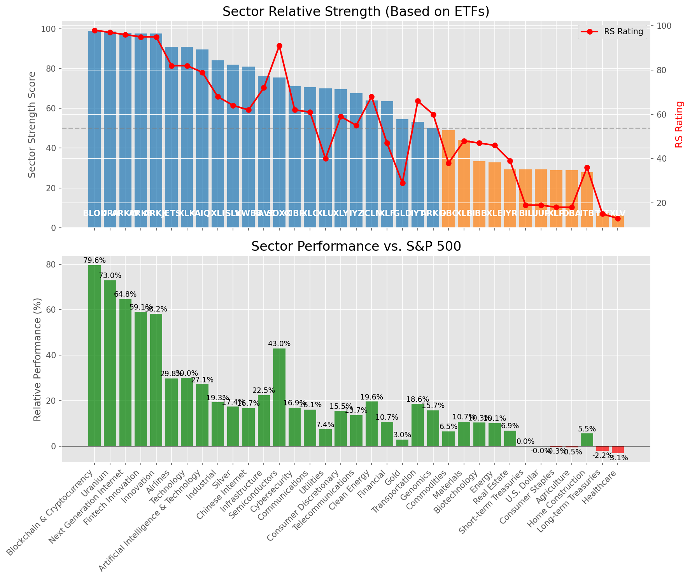

# **Daily Relative Strength Report**

**Date:** 2025-07-15

## **Market Valuation (Buffett Indicator)**

| Metric | Value |
|--------|-------|
| **Market Valuation** | **Overvalued** |
| **Current Ratio** | 10.24 |
| **Historical Mean** | 9.47 |
| **Standard Deviation** | 0.53 |
| **Z-Score (StdDev from Mean)** | 1.49 |
| **Total Market Cap** | $306.83 trillion |
| **GDP** | $29.96 trillion |

## **Market Insights**

### **Market is Overvalued**

The market appears to be trading above historical average valuations. While not at extreme levels, this suggests more modest future returns may be expected. Investors should:

- Focus on companies with reasonable valuations relative to their growth
- Be more selective with new positions
- Look for stocks showing relative strength within their sectors
- Consider trimming positions in extremely overvalued names

Historically, periods of mild overvaluation can persist for extended periods, but returns tend to be below average.

### **Buffett Indicator Overview**

The Buffett Indicator (Total Market Cap / GDP) is a measure of the stock market's valuation relative to the size of the economy. It is named after Warren Buffett, who described it as "probably the best single measure of where valuations stand at any given moment."

- **Values above +2 standard deviations:** Market significantly overvalued
- **Values above +1 standard deviation:** Market overvalued
- **Values between -1 and +1 standard deviations:** Market fairly valued
- **Values below -1 standard deviation:** Market undervalued
- **Values below -2 standard deviations:** Market significantly undervalued

---

## **Sector Relative Strength**

Based on William O'Neil's Relative Strength Methodology

| ETF | Strength | RS Rating | Performance | Above Key MAs | Trend | Sector |
|-----|----------|-----------|-------------|--------------|-------|--------|
| [BLOK](https://www.tradingview.com/chart/?symbol=BLOK) | 99.0 | 98.0 | 81.23% | 10d ✓, 50d ✓, 200d ✓ | ↗️ | Blockchain & Cryptocurrency |
| [URA](https://www.tradingview.com/chart/?symbol=URA) | 98.5 | 97.0 | 72.21% | 10d ✓, 50d ✓, 200d ✓ | ↗️ | Uranium |
| [ARKW](https://www.tradingview.com/chart/?symbol=ARKW) | 98.0 | 96.0 | 66.00% | 10d ✓, 50d ✓, 200d ✓ | ↗️ | Next Generation Internet |
| [ARKK](https://www.tradingview.com/chart/?symbol=ARKK) | 97.5 | 95.0 | 59.29% | 10d ✓, 50d ✓, 200d ✓ | ↗️ | Innovation |
| [ARKF](https://www.tradingview.com/chart/?symbol=ARKF) | 97.5 | 95.0 | 59.97% | 10d ✓, 50d ✓, 200d ✓ | ↗️ | Fintech Innovation |
| [JETS](https://www.tradingview.com/chart/?symbol=JETS) | 90.5 | 81.0 | 29.96% | 10d ✓, 50d ✓, 200d ✓ | ↗️ | Airlines |
| [XLK](https://www.tradingview.com/chart/?symbol=XLK) | 90.5 | 81.0 | 30.04% | 10d ✓, 50d ✓, 200d ✓ | ↗️ | Technology |
| [AIQ](https://www.tradingview.com/chart/?symbol=AIQ) | 89.0 | 78.0 | 27.25% | 10d ✓, 50d ✓, 200d ✓ | ↗️ | Artificial Intelligence & Technology |
| [XLI](https://www.tradingview.com/chart/?symbol=XLI) | 83.5 | 67.0 | 19.28% | 10d ✓, 50d ✓, 200d ✓ | ↗️ | Industrial |
| [SLV](https://www.tradingview.com/chart/?symbol=SLV) | 81.5 | 63.0 | 17.47% | 10d ✓, 50d ✓, 200d ✓ | ↗️ | Silver |
| [KWEB](https://www.tradingview.com/chart/?symbol=KWEB) | 80.0 | 60.0 | 16.46% | 10d ✓, 50d ✓, 200d ✓ | ↗️ | Chinese Internet |
| [PAVE](https://www.tradingview.com/chart/?symbol=PAVE) | 76.1 | 72.0 | 22.71% | 10d ✗, 50d ✓, 200d ✓ | ↗️ | Infrastructure |
| [SOXX](https://www.tradingview.com/chart/?symbol=SOXX) | 75.0 | 90.0 | 42.95% | 10d ✓, 50d ✓, 200d ✓ | ↘️ | Semiconductors |
| [CIBR](https://www.tradingview.com/chart/?symbol=CIBR) | 70.6 | 61.0 | 17.03% | 10d ✗, 50d ✓, 200d ✓ | ↗️ | Cybersecurity |
| [XLC](https://www.tradingview.com/chart/?symbol=XLC) | 70.6 | 61.0 | 16.65% | 10d ✗, 50d ✓, 200d ✓ | ↗️ | Communications |
| [XLY](https://www.tradingview.com/chart/?symbol=XLY) | 69.6 | 59.0 | 15.93% | 10d ✗, 50d ✓, 200d ✓ | ↗️ | Consumer Discretionary |
| [IYZ](https://www.tradingview.com/chart/?symbol=IYZ) | 67.1 | 54.0 | 13.64% | 10d ✗, 50d ✓, 200d ✓ | ↗️ | Telecommunications |
| [XLF](https://www.tradingview.com/chart/?symbol=XLF) | 63.1 | 46.0 | 10.90% | 10d ✗, 50d ✓, 200d ✓ | ↗️ | Financial |
| [XLU](https://www.tradingview.com/chart/?symbol=XLU) | 59.1 | 38.0 | 7.25% | 10d ✗, 50d ✓, 200d ✓ | ↗️ | Utilities |
| [GLD](https://www.tradingview.com/chart/?symbol=GLD) | 54.1 | 28.0 | 2.98% | 10d ✗, 50d ✓, 200d ✓ | ↗️ | Gold |
| [ICLN](https://www.tradingview.com/chart/?symbol=ICLN) | 53.6 | 67.0 | 19.40% | 10d ✗, 50d ✓, 200d ✓ | ↘️ | Clean Energy |
| [IYT](https://www.tradingview.com/chart/?symbol=IYT) | 52.6 | 65.0 | 18.92% | 10d ✗, 50d ✓, 200d ✓ | ↘️ | Transportation |
| [ARKG](https://www.tradingview.com/chart/?symbol=ARKG) | 50.6 | 61.0 | 16.86% | 10d ✗, 50d ✓, 200d ✓ | ↘️ | Genomics |
| [XLB](https://www.tradingview.com/chart/?symbol=XLB) | 43.1 | 46.0 | 10.92% | 10d ✗, 50d ✓, 200d ✓ | ↘️ | Materials |
| [BIL](https://www.tradingview.com/chart/?symbol=BIL) | 39.0 | 18.0 | 0.03% | 10d ✓, 50d ✓, 200d ✓ | ↘️ | Short-term Treasuries |
| [DBC](https://www.tradingview.com/chart/?symbol=DBC) | 38.1 | 36.0 | 6.40% | 10d ✗, 50d ✓, 200d ✓ | ↘️ | Commodities |
| [IBB](https://www.tradingview.com/chart/?symbol=IBB) | 32.9 | 46.0 | 10.66% | 10d ✗, 50d ✓, 200d ✗ | ↘️ | Biotechnology |
| [XLE](https://www.tradingview.com/chart/?symbol=XLE) | 31.9 | 44.0 | 10.03% | 10d ✗, 50d ✓, 200d ✗ | ↘️ | Energy |
| [IYR](https://www.tradingview.com/chart/?symbol=IYR) | 28.9 | 38.0 | 6.90% | 10d ✗, 50d ✓, 200d ✗ | ↘️ | Real Estate |
| [UUP](https://www.tradingview.com/chart/?symbol=UUP) | 28.8 | 18.0 | 0.00% | 10d ✓, 50d ✓, 200d ✗ | ↘️ | U.S. Dollar |
| [DBA](https://www.tradingview.com/chart/?symbol=DBA) | 28.5 | 17.0 | -0.39% | 10d ✗, 50d ✗, 200d ✗ | ↗️ | Agriculture |
| [XLP](https://www.tradingview.com/chart/?symbol=XLP) | 28.5 | 17.0 | -0.16% | 10d ✗, 50d ✗, 200d ✗ | ↗️ | Consumer Staples |
| [ITB](https://www.tradingview.com/chart/?symbol=ITB) | 28.4 | 37.0 | 6.60% | 10d ✗, 50d ✓, 200d ✗ | ↘️ | Home Construction |
| [TLT](https://www.tradingview.com/chart/?symbol=TLT) | 7.0 | 14.0 | -2.19% | 10d ✗, 50d ✗, 200d ✗ | ↘️ | Long-term Treasuries |
| [XLV](https://www.tradingview.com/chart/?symbol=XLV) | 6.5 | 13.0 | -2.91% | 10d ✗, 50d ✗, 200d ✗ | ↘️ | Healthcare |

### **Sector ETF Performance Interpretation**

This table shows the relative strength metrics for different market sectors based on their representative ETFs:

- **ETF**: The ETF used to measure sector performance (click for chart)
- **Strength**: Overall sector strength score (0-100) combining multiple factors
- **RS Rating**: O'Neil RS rating of the sector ETF
- **Performance**: Performance of the sector ETF relative to SPY
- **Above Key MAs**: Whether the ETF is trading above its 10, 50, and 200-day moving averages
- **Trend**: Whether the sector is in an uptrend (↗️) or downtrend (↘️)

### **Current Sector Leadership**

The current market leadership is coming from the following sectors: **Blockchain & Cryptocurrency, Uranium, Next Generation Internet**.

The **Blockchain & Cryptocurrency** sector (represented by **BLOK**) is showing particularly strong relative strength with an RS rating of 98.0 and performance of 81.23% vs. the S&P 500. This sector is trading above its 10-day, 50-day, 200-day moving average(s). Investors should consider focusing on high RS stocks within these leading sectors for potential outperformance.

---

## **Buy Recommendations**

The following 43 stocks show exceptional relative strength:

| RS Rating | Buy Score | Current Price | Chart | Name | Ticker |
|-----------|-----------|---------------|-------|------|--------|
| 100 | 100 | $100.32 | [Chart](https://www.tradingview.com/chart/?symbol=HOOD) | Robinhood Markets, Inc. Class A Common Stock | HOOD |
| 100 | 100 | $213.40 | [Chart](https://www.tradingview.com/chart/?symbol=LEU) | Centrus Energy Corp. | LEU |
| 100 | 100 | $59.73 | [Chart](https://www.tradingview.com/chart/?symbol=MP) | MP Materials Corp. | MP |
| 100 | 100 | $45.58 | [Chart](https://www.tradingview.com/chart/?symbol=TTMI) | TTM Technologies Inc | TTMI |
| 100 | 100 | $25.04 | [Chart](https://www.tradingview.com/chart/?symbol=EYE) | National Vision Holdings, Inc. Common Stock | EYE |
| 99 | 100 | $68.06 | [Chart](https://www.tradingview.com/chart/?symbol=LIF) | Life360, Inc. Common Stock | LIF |
| 99 | 100 | $112.58 | [Chart](https://www.tradingview.com/chart/?symbol=RBLX) | Roblox Corporation | RBLX |
| 99 | 100 | $149.53 | [Chart](https://www.tradingview.com/chart/?symbol=LMB) | Limbach Holdings, Inc Common Stock | LMB |
| 98 | 100 | $145.68 | [Chart](https://www.tradingview.com/chart/?symbol=FUTU) | Futu Holdings Limited American Depositary Shares | FUTU |
| 98 | 100 | $104.84 | [Chart](https://www.tradingview.com/chart/?symbol=VRNA) | Verona Pharma plc | VRNA |
| 98 | 100 | $43.94 | [Chart](https://www.tradingview.com/chart/?symbol=FARO) | Faro Technologies Inc | FARO |
| 98 | 100 | $39.40 | [Chart](https://www.tradingview.com/chart/?symbol=AS) | Amer Sports, Inc. | AS |
| 97 | 100 | $148.25 | [Chart](https://www.tradingview.com/chart/?symbol=PLTR) | Palantir Technologies Inc. Class A Common Stock | PLTR |
| 97 | 100 | $552.30 | [Chart](https://www.tradingview.com/chart/?symbol=GEV) | GE Vernova Inc. | GEV |
| 96 | 100 | $153.09 | [Chart](https://www.tradingview.com/chart/?symbol=ARKW) | ARK Next Generation Internet ETF | ARKW |
| 96 | 100 | $35.78 | [Chart](https://www.tradingview.com/chart/?symbol=ATAT) | Atour Lifestyle Holdings Limited American Depositary Shares | ATAT |
| 95 | 100 | $100.88 | [Chart](https://www.tradingview.com/chart/?symbol=TPR) | Tapestry, Inc. Common Stock | TPR |
| 95 | 100 | $51.98 | [Chart](https://www.tradingview.com/chart/?symbol=ARKF) | ARK Fintech Innovation ETF | ARKF |
| 95 | 100 | $35.43 | [Chart](https://www.tradingview.com/chart/?symbol=ATRO) | Astronics Corp | ATRO |
| 94 | 100 | $50.72 | [Chart](https://www.tradingview.com/chart/?symbol=KTOS) | Kratos Defense & Security Solutions, Inc. | KTOS |
| 94 | 100 | $35.24 | [Chart](https://www.tradingview.com/chart/?symbol=NNE) | Nano Nuclear Energy Inc. Common Stock | NNE |
| 93 | 100 | $447.26 | [Chart](https://www.tradingview.com/chart/?symbol=MSTR) | MicroStrategy Inc | MSTR |
| 93 | 100 | $20.66 | [Chart](https://www.tradingview.com/chart/?symbol=MIR) | Mirion Technologies, Inc. | MIR |
| 93 | 100 | $89.32 | [Chart](https://www.tradingview.com/chart/?symbol=RYTM) | Rhythm Pharmaceuticals, Inc. Common Stock | RYTM |
| 93 | 100 | $221.66 | [Chart](https://www.tradingview.com/chart/?symbol=AGX) | Argan, Inc | AGX |
| 92 | 100 | $21.89 | [Chart](https://www.tradingview.com/chart/?symbol=MAG) | MAG Silver Corp. | MAG |
| 91 | 100 | $183.06 | [Chart](https://www.tradingview.com/chart/?symbol=HWM) | Howmet Aerospace Inc. | HWM |
| 91 | 100 | $126.53 | [Chart](https://www.tradingview.com/chart/?symbol=TWLO) | Twilio Inc. | TWLO |
| 91 | 100 | $262.33 | [Chart](https://www.tradingview.com/chart/?symbol=GE) | GE Aerospace | GE |
| 91 | 100 | $51.66 | [Chart](https://www.tradingview.com/chart/?symbol=AKRO) | Akero Therapeutics, Inc. Common Stock | AKRO |
| 91 | 100 | $89.76 | [Chart](https://www.tradingview.com/chart/?symbol=C) | Citigroup Inc. | C |
| 89 | 100 | $51.98 | [Chart](https://www.tradingview.com/chart/?symbol=BTC) | Grayscale Bitcoin Mini Trust ETF | BTC |
| 89 | 100 | $47.31 | [Chart](https://www.tradingview.com/chart/?symbol=BBIO) | BridgeBio Pharma, Inc. Common Stock | BBIO |
| 88 | 100 | $76.16 | [Chart](https://www.tradingview.com/chart/?symbol=TPB) | Turning Point Brands, Inc. | TPB |
| 89 | 99 | $66.66 | [Chart](https://www.tradingview.com/chart/?symbol=IBIT) | iShares Bitcoin Trust ETF | IBIT |
| 88 | 99 | $59.41 | [Chart](https://www.tradingview.com/chart/?symbol=IBKR) | Interactive Brokers Group, Inc. Class A Common Stock | IBKR |
| 85 | 98 | $157.84 | [Chart](https://www.tradingview.com/chart/?symbol=SE) | Sea Limited American Depositary Shares, each representing one Class A Ordinary Share | SE |
| 84 | 97 | $18.40 | [Chart](https://www.tradingview.com/chart/?symbol=BCS) | Barclays PLC | BCS |
| 86 | 96 | $30.00 | [Chart](https://www.tradingview.com/chart/?symbol=NTGR) | NETGEAR, Inc. | NTGR |
| 85 | 96 | $45.29 | [Chart](https://www.tradingview.com/chart/?symbol=TOST) | Toast, Inc. | TOST |
| 81 | 95 | $29.36 | [Chart](https://www.tradingview.com/chart/?symbol=SRAD) | Sportradar Group AG Class A Ordinary Shares | SRAD |
| 81 | 92 | $192.79 | [Chart](https://www.tradingview.com/chart/?symbol=ITA) | iShares U.S. Aerospace & Defense ETF | ITA |
| 81 | 92 | $81.55 | [Chart](https://www.tradingview.com/chart/?symbol=USFD) | US Foods Holding Corp. | USFD |

---

## **Sell Recommendations**

The following 200 stocks show deteriorating relative strength:

| RS Rating | Sell Score | Current Price | Chart | Name | Ticker |
|-----------|------------|---------------|-------|------|--------|
| 1 | 100 | $24.87 | [Chart](https://www.tradingview.com/chart/?symbol=QID) | ProShares UltraShort QQQ | QID |
| 1 | 100 | $10.09 | [Chart](https://www.tradingview.com/chart/?symbol=HIBS) | Direxion Daily S&P 500 High Beta Bear 3X Shares | HIBS |
| 1 | 100 | $11.21 | [Chart](https://www.tradingview.com/chart/?symbol=TZA) | Direxion Daily Small Cap Bear 3x Shares | TZA |
| 1 | 100 | $25.33 | [Chart](https://www.tradingview.com/chart/?symbol=TECS) | Direxion Daily Technology Bear 3x Shares | TECS |
| 1 | 100 | $34.27 | [Chart](https://www.tradingview.com/chart/?symbol=SARK) | Investment Managers Series Trust II Tradr 1X Short Innovation Daily ETF | SARK |
| 2 | 100 | $41.29 | [Chart](https://www.tradingview.com/chart/?symbol=LINE) | Lineage, Inc. Common Stock | LINE |
| 2 | 100 | $223.22 | [Chart](https://www.tradingview.com/chart/?symbol=HUM) | Humana Inc. | HUM |
| 2 | 100 | $11.82 | [Chart](https://www.tradingview.com/chart/?symbol=IART) | Integra LifeSciences Holdings | IART |
| 2 | 100 | $16.45 | [Chart](https://www.tradingview.com/chart/?symbol=SDS) | ProShares UltraShort S&P500 | SDS |
| 2 | 100 | $10.25 | [Chart](https://www.tradingview.com/chart/?symbol=SNDX) | Syndax Pharmaceuticals, Inc. | SNDX |
| 2 | 100 | $41.61 | [Chart](https://www.tradingview.com/chart/?symbol=SDOW) | ProShares UltraPro Short Dow 30 | SDOW |
| 3 | 100 | $21.70 | [Chart](https://www.tradingview.com/chart/?symbol=ERY) | Direxion Daily Energy Bear 2X Shares | ERY |
| 3 | 100 | $47.51 | [Chart](https://www.tradingview.com/chart/?symbol=ASGN) | ASGN Incorporated | ASGN |
| 3 | 100 | $15.56 | [Chart](https://www.tradingview.com/chart/?symbol=HP) | Helmerich & Payne, Inc. | HP |
| 3 | 100 | $10.08 | [Chart](https://www.tradingview.com/chart/?symbol=WNC) | Wabash National Corp. | WNC |
| 3 | 100 | $10.76 | [Chart](https://www.tradingview.com/chart/?symbol=OFIX) | Orthofix Medical Inc. Common Stock (DE) | OFIX |
| 3 | 100 | $33.39 | [Chart](https://www.tradingview.com/chart/?symbol=PSQ) | ProShares Short QQQ | PSQ |
| 3 | 100 | $10.64 | [Chart](https://www.tradingview.com/chart/?symbol=SONO) | Sonos, Inc. Common Stock | SONO |
| 3 | 100 | $111.05 | [Chart](https://www.tradingview.com/chart/?symbol=COKE) | Coca-Cola Consolidated, Inc. Common Stock | COKE |
| 3 | 100 | $81.38 | [Chart](https://www.tradingview.com/chart/?symbol=LNTH) | Lantheus Holdings, Inc | LNTH |
| 3 | 100 | $37.27 | [Chart](https://www.tradingview.com/chart/?symbol=IBTA) | Ibotta, Inc. | IBTA |
| 4 | 100 | $24.30 | [Chart](https://www.tradingview.com/chart/?symbol=DXD) | ProShares UltraShort Dow 30 | DXD |
| 4 | 100 | $10.19 | [Chart](https://www.tradingview.com/chart/?symbol=LBTYK) | Liberty Global Ltd. Class C Common Shares | LBTYK |
| 4 | 100 | $30.58 | [Chart](https://www.tradingview.com/chart/?symbol=CRI) | Carter's Inc. | CRI |
| 4 | 100 | $428.99 | [Chart](https://www.tradingview.com/chart/?symbol=MUSA) | MURPHY USA INC. | MUSA |
| 4 | 100 | $19.64 | [Chart](https://www.tradingview.com/chart/?symbol=THS) | Treehouse Foods, Inc. | THS |
| 4 | 100 | $23.52 | [Chart](https://www.tradingview.com/chart/?symbol=CRTO) | Criteo S.A. | CRTO |
| 4 | 100 | $40.38 | [Chart](https://www.tradingview.com/chart/?symbol=RHI) | Robert Half Inc. | RHI |
| 4 | 100 | $12.08 | [Chart](https://www.tradingview.com/chart/?symbol=CCRN) | Cross Country Healthcare Inc | CCRN |
| 4 | 100 | $99.61 | [Chart](https://www.tradingview.com/chart/?symbol=ONTO) | Onto Innovation Inc. | ONTO |
| 4 | 100 | $50.30 | [Chart](https://www.tradingview.com/chart/?symbol=SLVM) | Sylvamo Corporation | SLVM |
| 5 | 100 | $13.05 | [Chart](https://www.tradingview.com/chart/?symbol=AVTR) | Avantor, Inc. | AVTR |
| 5 | 100 | $39.47 | [Chart](https://www.tradingview.com/chart/?symbol=SH) | ProShares Short S&P500 | SH |
| 6 | 100 | $114.05 | [Chart](https://www.tradingview.com/chart/?symbol=TFX) | Teleflex Incorporated | TFX |
| 6 | 100 | $54.88 | [Chart](https://www.tradingview.com/chart/?symbol=SPB) | Spectrum Brands Holdings, Inc. | SPB |
| 6 | 100 | $130.27 | [Chart](https://www.tradingview.com/chart/?symbol=INSP) | Inspire Medical Systems, Inc. | INSP |
| 6 | 100 | $15.14 | [Chart](https://www.tradingview.com/chart/?symbol=TNDM) | Tandem Diabetes Care, Inc. | TNDM |
| 6 | 100 | $10.12 | [Chart](https://www.tradingview.com/chart/?symbol=IMXI) | International Money Express, Inc. | IMXI |
| 6 | 100 | $10.52 | [Chart](https://www.tradingview.com/chart/?symbol=SD) | SandRidge Energy, Inc. | SD |
| 6 | 100 | $124.73 | [Chart](https://www.tradingview.com/chart/?symbol=CLX) | Clorox Company | CLX |
| 6 | 100 | $27.41 | [Chart](https://www.tradingview.com/chart/?symbol=OMCL) | Omnicell Inc | OMCL |
| 6 | 100 | $21.51 | [Chart](https://www.tradingview.com/chart/?symbol=AMPH) | Amphastar Pharmaceuticals, Inc. | AMPH |
| 7 | 100 | $126.91 | [Chart](https://www.tradingview.com/chart/?symbol=KMB) | Kimberly-Clark Corp. | KMB |
| 7 | 100 | $37.88 | [Chart](https://www.tradingview.com/chart/?symbol=LKQ) | LKQ Corporation | LKQ |
| 7 | 100 | $10.13 | [Chart](https://www.tradingview.com/chart/?symbol=LBTYA) | Liberty Global Ltd. Class A Common Shares | LBTYA |
| 7 | 100 | $59.32 | [Chart](https://www.tradingview.com/chart/?symbol=COLM) | Columbia Sportswear Co | COLM |
| 8 | 100 | $46.41 | [Chart](https://www.tradingview.com/chart/?symbol=BMY) | Bristol-Myers Squibb Co. | BMY |
| 8 | 100 | $49.92 | [Chart](https://www.tradingview.com/chart/?symbol=LW) | Lamb Weston Holdings, Inc. | LW |
| 8 | 100 | $25.55 | [Chart](https://www.tradingview.com/chart/?symbol=DOG) | ProShares Short Dow30 | DOG |
| 8 | 100 | $51.78 | [Chart](https://www.tradingview.com/chart/?symbol=LGIH) | LGI Homes, Inc. | LGIH |
| 9 | 100 | $101.59 | [Chart](https://www.tradingview.com/chart/?symbol=DEO) | Diageo plc | DEO |
| 10 | 100 | $88.62 | [Chart](https://www.tradingview.com/chart/?symbol=CL) | Colgate-Palmolive Company | CL |
| 10 | 100 | $101.03 | [Chart](https://www.tradingview.com/chart/?symbol=AFL) | Aflac Inc. | AFL |
| 10 | 100 | $13.40 | [Chart](https://www.tradingview.com/chart/?symbol=GO) | Grocery Outlet Holding Corp. Common Stock | GO |
| 11 | 100 | $50.06 | [Chart](https://www.tradingview.com/chart/?symbol=CNMD) | CONMED Corporation | CNMD |
| 11 | 100 | $40.44 | [Chart](https://www.tradingview.com/chart/?symbol=POR) | Portland General Electric Company | POR |
| 11 | 100 | $62.66 | [Chart](https://www.tradingview.com/chart/?symbol=ZROZ) | PIMCO 25+ Year Zero Coupon U.S. Treasury Index Exchange-Traded Fund | ZROZ |
| 11 | 100 | $332.93 | [Chart](https://www.tradingview.com/chart/?symbol=EG) | Everest Group, Ltd. | EG |
| 12 | 100 | $27.17 | [Chart](https://www.tradingview.com/chart/?symbol=GTY) | Getty Realty Corp. | GTY |
| 13 | 100 | $119.46 | [Chart](https://www.tradingview.com/chart/?symbol=RGEN) | Repligen Corp | RGEN |
| 8 | 99 | $301.60 | [Chart](https://www.tradingview.com/chart/?symbol=CI) | The Cigna Group | CI |
| 8 | 99 | $12.95 | [Chart](https://www.tradingview.com/chart/?symbol=BSM) | Black Stone Minerals, L.P. | BSM |
| 12 | 99 | $105.28 | [Chart](https://www.tradingview.com/chart/?symbol=BAH) | Booz Allen Hamilton Holding Corporation | BAH |
| 12 | 99 | $14.47 | [Chart](https://www.tradingview.com/chart/?symbol=VRE) | Veris Residential, Inc. | VRE |
| 12 | 99 | $46.74 | [Chart](https://www.tradingview.com/chart/?symbol=CWT) | California Water Service | CWT |
| 13 | 98 | $60.14 | [Chart](https://www.tradingview.com/chart/?symbol=UL) | Unilever plc | UL |
| 13 | 98 | $19.09 | [Chart](https://www.tradingview.com/chart/?symbol=SPT) | Sprout Social, Inc Class A Common Stock | SPT |
| 14 | 98 | $84.99 | [Chart](https://www.tradingview.com/chart/?symbol=TLT) | iShares 20+ Year Treasury Bond ETF | TLT |
| 3 | 97 | $49.13 | [Chart](https://www.tradingview.com/chart/?symbol=TAP) | Molson Coors Beverage Company Class B | TAP |
| 5 | 97 | $10.25 | [Chart](https://www.tradingview.com/chart/?symbol=SPDN) | Direxion Daily S&P 500 Bear 1X Shares | SPDN |
| 9 | 97 | $15.39 | [Chart](https://www.tradingview.com/chart/?symbol=PRO) | Pros Holdings, Inc. | PRO |
| 10 | 97 | $295.43 | [Chart](https://www.tradingview.com/chart/?symbol=POOL) | Pool Corporation | POOL |
| 12 | 97 | $22.80 | [Chart](https://www.tradingview.com/chart/?symbol=RPD) | Rapid7, Inc. Common Stock | RPD |
| 15 | 97 | $21.53 | [Chart](https://www.tradingview.com/chart/?symbol=TUA) | Simplify Short Term Treasury Futures Strategy ETF | TUA |
| 16 | 97 | $21.07 | [Chart](https://www.tradingview.com/chart/?symbol=LGOV) | First Trust Long Duration Opportunities ETF | LGOV |
| 6 | 96 | $17.17 | [Chart](https://www.tradingview.com/chart/?symbol=NOMD) | Nomad Foods Limited | NOMD |
| 9 | 96 | $47.99 | [Chart](https://www.tradingview.com/chart/?symbol=SNY) | Sanofi American Depositary Shares (Each representing one-half of one ordinary share) | SNY |
| 10 | 96 | $130.85 | [Chart](https://www.tradingview.com/chart/?symbol=ICUI) | ICU Medical Inc | ICUI |
| 13 | 96 | $34.05 | [Chart](https://www.tradingview.com/chart/?symbol=PECO) | Phillips Edison & Company, Inc. Common Stock | PECO |
| 16 | 96 | $31.82 | [Chart](https://www.tradingview.com/chart/?symbol=INVH) | Invitation Homes Inc. Common Stock | INVH |
| 7 | 95 | $140.52 | [Chart](https://www.tradingview.com/chart/?symbol=DVA) | DaVita Inc. | DVA |
| 8 | 95 | $95.96 | [Chart](https://www.tradingview.com/chart/?symbol=CHD) | Church & Dwight Co., Inc. | CHD |
| 8 | 95 | $152.71 | [Chart](https://www.tradingview.com/chart/?symbol=PG) | Procter & Gamble Company | PG |
| 9 | 95 | $25.10 | [Chart](https://www.tradingview.com/chart/?symbol=DRV) | Direxion Daily Real Estate Bear 3X Shares | DRV |
| 13 | 95 | $74.20 | [Chart](https://www.tradingview.com/chart/?symbol=BG) | Bunge Global SA | BG |
| 13 | 95 | $38.17 | [Chart](https://www.tradingview.com/chart/?symbol=KSA) | iShares MSCI Saudi Arabia ETF | KSA |
| 14 | 95 | $30.02 | [Chart](https://www.tradingview.com/chart/?symbol=AXTA) | Axalta Coating Systems Ltd. | AXTA |
| 15 | 95 | $30.80 | [Chart](https://www.tradingview.com/chart/?symbol=SCHQ) | Schwab Long-Term U.S. Treasury ETF | SCHQ |
| 16 | 95 | $54.62 | [Chart](https://www.tradingview.com/chart/?symbol=DAY) | Dayforce, Inc. | DAY |
| 8 | 94 | $37.78 | [Chart](https://www.tradingview.com/chart/?symbol=VCEL) | Vericel Corporation | VCEL |
| 9 | 94 | $71.21 | [Chart](https://www.tradingview.com/chart/?symbol=MKC) | McCormick & Company, Incorporated Non-VTG CS | MKC |
| 13 | 94 | $10.25 | [Chart](https://www.tradingview.com/chart/?symbol=MUC) | BLACKROCK MUNIHOLDINGS CALIFORNIA QUALITY FUND, INC | MUC |
| 14 | 94 | $11.13 | [Chart](https://www.tradingview.com/chart/?symbol=SITC) | SITE Centers Corp. Common Shares | SITC |
| 15 | 94 | $25.48 | [Chart](https://www.tradingview.com/chart/?symbol=WY) | Weyerhaeuser Company | WY |
| 15 | 94 | $163.22 | [Chart](https://www.tradingview.com/chart/?symbol=HSY) | The Hershey Company | HSY |
| 16 | 94 | $245.27 | [Chart](https://www.tradingview.com/chart/?symbol=VHT) | Vanguard Health Care ETF | VHT |
| 16 | 94 | $77.65 | [Chart](https://www.tradingview.com/chart/?symbol=EMN) | Eastman Chemical Company | EMN |
| 12 | 93 | $13.52 | [Chart](https://www.tradingview.com/chart/?symbol=EIC) | Eagle Point Income Company Inc. | EIC |
| 12 | 93 | $14.39 | [Chart](https://www.tradingview.com/chart/?symbol=INMD) | InMode Ltd. Ordinary Shares | INMD |
| 13 | 93 | $18.18 | [Chart](https://www.tradingview.com/chart/?symbol=AKR) | Acadia Realty Trust | AKR |
| 15 | 93 | $469.06 | [Chart](https://www.tradingview.com/chart/?symbol=LMT) | Lockheed Martin Corp. | LMT |
| 21 | 93 | $39.76 | [Chart](https://www.tradingview.com/chart/?symbol=UDR) | UDR, Inc. | UDR |
| 22 | 93 | $24.44 | [Chart](https://www.tradingview.com/chart/?symbol=HYMB) | SPDR Nuveen ICE High Yield Municipal Bond ETF | HYMB |
| 9 | 92 | $17.09 | [Chart](https://www.tradingview.com/chart/?symbol=IRT) | Independence Realty Trust Inc. | IRT |
| 15 | 92 | $54.22 | [Chart](https://www.tradingview.com/chart/?symbol=VGLT) | Vanguard Long-Term Treasury ETF | VGLT |
| 17 | 92 | $22.86 | [Chart](https://www.tradingview.com/chart/?symbol=IBTG) | iShares iBonds Dec 2026 Term Treasury ETF | IBTG |
| 17 | 92 | $58.44 | [Chart](https://www.tradingview.com/chart/?symbol=VGSH) | Vanguard Short-Term Treasury ETF | VGSH |
| 23 | 92 | $177.84 | [Chart](https://www.tradingview.com/chart/?symbol=UHS) | Universal Health Services, Inc. Class B | UHS |
| 9 | 91 | $11.15 | [Chart](https://www.tradingview.com/chart/?symbol=PTLO) | Portillo's Inc. Class A Common Stock | PTLO |
| 17 | 91 | $29.12 | [Chart](https://www.tradingview.com/chart/?symbol=SPTS) | SPDR Portfolio Short Term Treasury ETF | SPTS |
| 17 | 91 | $16.72 | [Chart](https://www.tradingview.com/chart/?symbol=UMH) | UMH Properties, Inc. | UMH |
| 12 | 90 | $37.82 | [Chart](https://www.tradingview.com/chart/?symbol=WTRG) | Essential Utilities, Inc. | WTRG |
| 14 | 90 | $554.97 | [Chart](https://www.tradingview.com/chart/?symbol=TYL) | Tyler Technologies, Inc. | TYL |
| 17 | 90 | $86.41 | [Chart](https://www.tradingview.com/chart/?symbol=SIGI) | Selective Insurance Group | SIGI |
| 21 | 90 | $43.35 | [Chart](https://www.tradingview.com/chart/?symbol=FIXD) | First Trust Exchange-Traded Fund VIII First Trust Smith Opportunistic Fixed Income ETF | FIXD |
| 25 | 90 | $10.28 | [Chart](https://www.tradingview.com/chart/?symbol=NMZ) | Nuveen Municipal High Income Opportunity Fund | NMZ |
| 26 | 90 | $48.96 | [Chart](https://www.tradingview.com/chart/?symbol=IGLB) | iShares 10+ Year Investment Grade Corporate Bond ETF | IGLB |
| 13 | 89 | $26.32 | [Chart](https://www.tradingview.com/chart/?symbol=FCPT) | Four Corners Property Trust, Inc. | FCPT |
| 14 | 89 | $37.56 | [Chart](https://www.tradingview.com/chart/?symbol=LZB) | La-Z-Boy Incorporated | LZB |
| 14 | 89 | $217.14 | [Chart](https://www.tradingview.com/chart/?symbol=MKTX) | MarketAxess Holdings Inc. | MKTX |
| 14 | 89 | $757.13 | [Chart](https://www.tradingview.com/chart/?symbol=EQIX) | Equinix, Inc. Common Stock REIT | EQIX |
| 15 | 89 | $217.31 | [Chart](https://www.tradingview.com/chart/?symbol=LOW) | Lowe's Companies Inc. | LOW |
| 19 | 89 | $93.92 | [Chart](https://www.tradingview.com/chart/?symbol=IEF) | iShares 7-10 Year Treasury Bond ETF | IEF |
| 12 | 88 | $32.40 | [Chart](https://www.tradingview.com/chart/?symbol=GLBE) | Global-E Online Ltd. Ordinary Shares | GLBE |
| 18 | 88 | $110.22 | [Chart](https://www.tradingview.com/chart/?symbol=SHV) | iShares Short Treasury Bond ETF | SHV |
| 18 | 88 | $82.39 | [Chart](https://www.tradingview.com/chart/?symbol=SHY) | iShares 1-3 Year Treasury Bond ETF | SHY |
| 18 | 88 | $14.04 | [Chart](https://www.tradingview.com/chart/?symbol=BMEZ) | BlackRock Health Sciences Term Trust | BMEZ |
| 19 | 88 | $39.57 | [Chart](https://www.tradingview.com/chart/?symbol=TOTL) | SSgA Active ETF Trust SPDR DoubleLine Total Return Tactical ETF | TOTL |
| 21 | 88 | $17.73 | [Chart](https://www.tradingview.com/chart/?symbol=S) | SentinelOne, Inc. | S |
| 22 | 88 | $90.83 | [Chart](https://www.tradingview.com/chart/?symbol=BOND) | PIMCO Active Bond Exchange-Traded Fund | BOND |
| 25 | 88 | $65.90 | [Chart](https://www.tradingview.com/chart/?symbol=EQR) | Equity Residential | EQR |
| 27 | 88 | $11.82 | [Chart](https://www.tradingview.com/chart/?symbol=NVG) | Nuveen AMT-Free Municipal Credit Income Fund | NVG |
| 14 | 87 | $21.46 | [Chart](https://www.tradingview.com/chart/?symbol=BLFS) | BioLife Solutions Inc. | BLFS |
| 17 | 87 | $66.92 | [Chart](https://www.tradingview.com/chart/?symbol=MDLZ) | Mondelez International, Inc. Class A | MDLZ |
| 20 | 87 | $10.84 | [Chart](https://www.tradingview.com/chart/?symbol=FBRT) | Franklin BSP Realty Trust, Inc. | FBRT |
| 23 | 87 | $74.13 | [Chart](https://www.tradingview.com/chart/?symbol=IFF) | International Flavors & Fragrances Inc. | IFF |
| 23 | 87 | $16.70 | [Chart](https://www.tradingview.com/chart/?symbol=MLN) | VanEck Long Muni ETF | MLN |
| 25 | 87 | $73.92 | [Chart](https://www.tradingview.com/chart/?symbol=VCLT) | Vanguard Long-Term Corporate Bond ETF | VCLT |
| 28 | 87 | $11.84 | [Chart](https://www.tradingview.com/chart/?symbol=NZF) | Nuveen Municipal Credit Income Fund | NZF |
| 18 | 86 | $40.65 | [Chart](https://www.tradingview.com/chart/?symbol=FE) | FirstEnergy Corp. | FE |
| 18 | 86 | $99.25 | [Chart](https://www.tradingview.com/chart/?symbol=BILS) | SPDR Bloomberg 3-12 Month T-Bill ETF | BILS |
| 19 | 86 | $49.10 | [Chart](https://www.tradingview.com/chart/?symbol=BNDX) | Vanguard Total International Bond ETF | BNDX |
| 25 | 85 | $13.73 | [Chart](https://www.tradingview.com/chart/?symbol=DOLE) | Dole plc | DOLE |
| 26 | 85 | $16.90 | [Chart](https://www.tradingview.com/chart/?symbol=NVCR) | NovoCure Limited Ordinary Shares | NVCR |
| 18 | 84 | $99.96 | [Chart](https://www.tradingview.com/chart/?symbol=GBIL) | Goldman Sachs Access Treasury 0-1 Year ETF | GBIL |
| 22 | 84 | $32.11 | [Chart](https://www.tradingview.com/chart/?symbol=ZD) | Ziff Davis, Inc. Common Stock | ZD |
| 25 | 84 | $37.04 | [Chart](https://www.tradingview.com/chart/?symbol=PBA) | PEMBINA PIPELINE CORPORATION | PBA |
| 20 | 83 | $52.82 | [Chart](https://www.tradingview.com/chart/?symbol=JBND) | JPMorgan Active Bond ETF | JBND |
| 21 | 83 | $97.75 | [Chart](https://www.tradingview.com/chart/?symbol=AGG) | iShares Core U.S. Aggregate Bond ETF | AGG |
| 21 | 83 | $35.48 | [Chart](https://www.tradingview.com/chart/?symbol=AMH) | AMERICAN HOMES 4 RENT | AMH |
| 21 | 83 | $21.20 | [Chart](https://www.tradingview.com/chart/?symbol=FLCB) | Franklin U.S. Core Bond ETF | FLCB |
| 29 | 83 | $34.83 | [Chart](https://www.tradingview.com/chart/?symbol=CMCSA) | Comcast Corp | CMCSA |
| 18 | 82 | $22.36 | [Chart](https://www.tradingview.com/chart/?symbol=IBTH) | iShares iBonds Dec 2027 Term Treasury ETF | IBTH |
| 19 | 82 | $98.65 | [Chart](https://www.tradingview.com/chart/?symbol=FMX) | FOMENTO ECONOMICO MEXICANO, S.A.B. DE C.V. | FMX |
| 20 | 82 | $117.66 | [Chart](https://www.tradingview.com/chart/?symbol=IEI) | iShares 3-7 Year Treasury Bond ETF | IEI |
| 23 | 82 | $45.73 | [Chart](https://www.tradingview.com/chart/?symbol=VMBS) | Vanguard Mortgage-Backed Securities ETF | VMBS |
| 23 | 82 | $341.28 | [Chart](https://www.tradingview.com/chart/?symbol=SHW) | The Sherwin-Williams Company | SHW |
| 31 | 82 | $28.03 | [Chart](https://www.tradingview.com/chart/?symbol=QDEL) | QuidelOrtho Corporation Common Stock | QDEL |
| 39 | 82 | $24.26 | [Chart](https://www.tradingview.com/chart/?symbol=HOG) | Harley-Davidson, Inc. | HOG |
| 21 | 81 | $72.59 | [Chart](https://www.tradingview.com/chart/?symbol=BND) | Vanguard Total Bond Market | BND |
| 28 | 81 | $17.29 | [Chart](https://www.tradingview.com/chart/?symbol=STAA) | Staar Surgical Co | STAA |
| 35 | 81 | $20.23 | [Chart](https://www.tradingview.com/chart/?symbol=AMN) | AMN Healthcare Services | AMN |
| 29 | 80 | $103.12 | [Chart](https://www.tradingview.com/chart/?symbol=CNI) | Canadian National Railway | CNI |
| 31 | 80 | $112.47 | [Chart](https://www.tradingview.com/chart/?symbol=CPT) | Camden Property Trust | CPT |
| 22 | 79 | $26.87 | [Chart](https://www.tradingview.com/chart/?symbol=IVT) | InvenTrust Properties Corp. | IVT |
| 30 | 79 | $148.19 | [Chart](https://www.tradingview.com/chart/?symbol=EA) | Electronic Arts Inc | EA |
| 31 | 79 | $21.88 | [Chart](https://www.tradingview.com/chart/?symbol=SGRY) | Surgery Partners, Inc. Common Stock | SGRY |
| 32 | 79 | $293.37 | [Chart](https://www.tradingview.com/chart/?symbol=UTHR) | United Therapeutics Corp | UTHR |
| 33 | 79 | $178.17 | [Chart](https://www.tradingview.com/chart/?symbol=AVY) | Avery Dennison Corp. | AVY |
| 31 | 78 | $25.42 | [Chart](https://www.tradingview.com/chart/?symbol=BRX) | BRIXMOR PROPERTY GROUP INC. | BRX |
| 30 | 77 | $76.76 | [Chart](https://www.tradingview.com/chart/?symbol=AKAM) | Akamai Technologies Inc | AKAM |
| 31 | 77 | $25.35 | [Chart](https://www.tradingview.com/chart/?symbol=PNTG) | The Pennant Group, Inc. Common Stock | PNTG |
| 37 | 77 | $56.48 | [Chart](https://www.tradingview.com/chart/?symbol=USRT) | iShares Core U.S. REIT ETF | USRT |
| 38 | 77 | $17.45 | [Chart](https://www.tradingview.com/chart/?symbol=ALEX) | Alexander & Baldwin, Inc. | ALEX |
| 28 | 76 | $89.00 | [Chart](https://www.tradingview.com/chart/?symbol=LPX) | Louisiana-Pacific Corp. | LPX |
| 33 | 76 | $15.80 | [Chart](https://www.tradingview.com/chart/?symbol=BNL) | Broadstone Net Lease, Inc. | BNL |
| 33 | 76 | $103.65 | [Chart](https://www.tradingview.com/chart/?symbol=PRU) | Prudential Financial, Inc. | PRU |
| 36 | 76 | $70.58 | [Chart](https://www.tradingview.com/chart/?symbol=AZN) | AstraZeneca PLC | AZN |
| 38 | 76 | $162.94 | [Chart](https://www.tradingview.com/chart/?symbol=ODFL) | Old Dominion Freight Line | ODFL |
| 38 | 76 | $72.79 | [Chart](https://www.tradingview.com/chart/?symbol=TTC) | Toro Company (The) | TTC |
| 29 | 75 | $199.11 | [Chart](https://www.tradingview.com/chart/?symbol=AVB) | AvalonBay Communities, Inc. | AVB |
| 35 | 75 | $279.48 | [Chart](https://www.tradingview.com/chart/?symbol=ESS) | Essex Property Trust, Inc | ESS |
| 26 | 74 | $362.39 | [Chart](https://www.tradingview.com/chart/?symbol=HD) | Home Depot, Inc. | HD |
| 33 | 74 | $24.55 | [Chart](https://www.tradingview.com/chart/?symbol=HPQ) | HP Inc. | HPQ |
| 30 | 73 | $35.24 | [Chart](https://www.tradingview.com/chart/?symbol=LTC) | LTC Properties, Inc. | LTC |
| 36 | 72 | $110.83 | [Chart](https://www.tradingview.com/chart/?symbol=RPM) | RPM International, Inc. | RPM |
| 32 | 71 | $461.32 | [Chart](https://www.tradingview.com/chart/?symbol=LIN) | Linde plc Ordinary Share | LIN |
| 35 | 71 | $69.02 | [Chart](https://www.tradingview.com/chart/?symbol=HHH) | Howard Hughes Holdings Inc. | HHH |
| 36 | 71 | $20.38 | [Chart](https://www.tradingview.com/chart/?symbol=KRNT) | Kornit Digital Ltd. | KRNT |
| 37 | 71 | $122.92 | [Chart](https://www.tradingview.com/chart/?symbol=GPC) | Genuine Parts Company | GPC |
| 33 | 70 | $119.47 | [Chart](https://www.tradingview.com/chart/?symbol=ITGR) | Integer Holdings Corporation | ITGR |
| 35 | 70 | $41.28 | [Chart](https://www.tradingview.com/chart/?symbol=XLRE) | Real Estate Select Sector SPDR Fund | XLRE |
| 37 | 70 | $29.91 | [Chart](https://www.tradingview.com/chart/?symbol=MGPI) | MGP Ingredients Inc | MGPI |
| 32 | 69 | $33.87 | [Chart](https://www.tradingview.com/chart/?symbol=RDN) | Radian Group Inc. | RDN |
| 33 | 69 | $56.12 | [Chart](https://www.tradingview.com/chart/?symbol=RDNT) | RadNet, Inc. Common Stock | RDNT |
| 36 | 69 | $89.00 | [Chart](https://www.tradingview.com/chart/?symbol=VNQ) | Vanguard Real Estate ETF | VNQ |
| 39 | 69 | $26.63 | [Chart](https://www.tradingview.com/chart/?symbol=DFGR) | Dimensional Global Real Estate ETF | DFGR |
| 39 | 66 | $69.23 | [Chart](https://www.tradingview.com/chart/?symbol=BRC) | Brady Corporation | BRC |
| 37 | 63 | $54.60 | [Chart](https://www.tradingview.com/chart/?symbol=ALRM) | Alarm.com Holdings, Inc. | ALRM |
| 39 | 61 | $159.64 | [Chart](https://www.tradingview.com/chart/?symbol=SPG) | Simon Property Group, Inc. | SPG |

## **Methodology**

This report uses William O'Neil's relative strength methodology from Investors Business Daily:

* **RS Rating**: Percentile rank of stock's performance vs. S&P 500 over the past 63 trading days (1-99 scale)
* **Buy Criteria**: RS Rating >= 80, price above 50-day MA, strong uptrend, increasing volume
* **Sell Criteria**: RS Rating < 40, price below 50-day MA, downtrend, decreasing volume

### **O'Neil's Key Principles**

1. **Focus on relative performance** - stocks outperforming the market
2. **Price trend confirmation** - stock must be in an uptrend
3. **Volume confirmation** - strong volume supports price moves
4. **Moving average validation** - price above key moving averages
5. **Market leaders only** - concentrate on top-performing stocks

*Report generated automatically after market close*