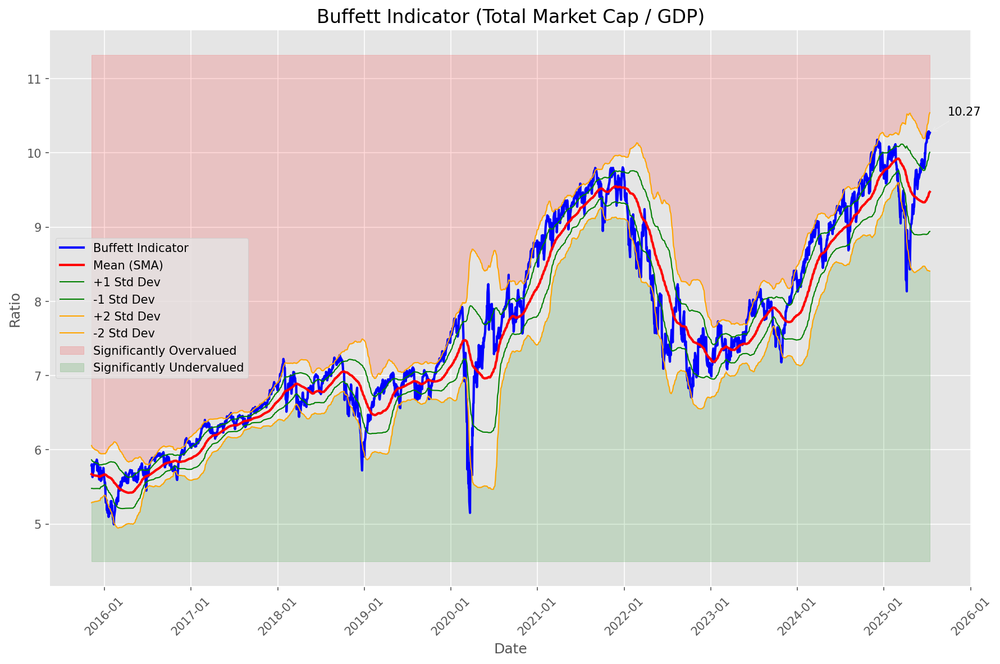
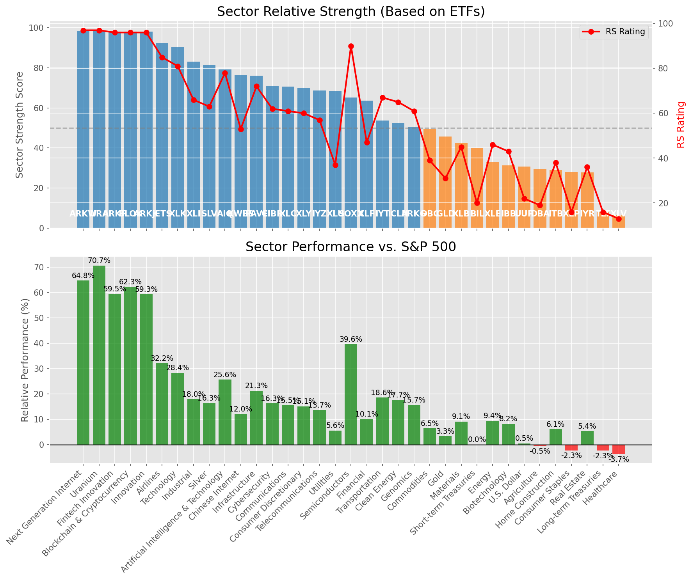

# **Daily Relative Strength Report**

**Date:** 2025-07-16

## **Market Valuation (Buffett Indicator)**

| Metric | Value |
|--------|-------|
| **Market Valuation** | **Overvalued** |
| **Current Ratio** | 10.23 |
| **Historical Mean** | 9.49 |
| **Standard Deviation** | 0.54 |
| **Z-Score (StdDev from Mean)** | 1.35 |
| **Total Market Cap** | $306.48 trillion |
| **GDP** | $29.96 trillion |

## **Market Insights**

### **Market is Overvalued**

The market appears to be trading above historical average valuations. While not at extreme levels, this suggests more modest future returns may be expected. Investors should:

- Focus on companies with reasonable valuations relative to their growth
- Be more selective with new positions
- Look for stocks showing relative strength within their sectors
- Consider trimming positions in extremely overvalued names

Historically, periods of mild overvaluation can persist for extended periods, but returns tend to be below average.

### **Buffett Indicator Overview**

The Buffett Indicator (Total Market Cap / GDP) is a measure of the stock market's valuation relative to the size of the economy. It is named after Warren Buffett, who described it as "probably the best single measure of where valuations stand at any given moment."

- **Values above +2 standard deviations:** Market significantly overvalued
- **Values above +1 standard deviation:** Market overvalued
- **Values between -1 and +1 standard deviations:** Market fairly valued
- **Values below -1 standard deviation:** Market undervalued
- **Values below -2 standard deviations:** Market significantly undervalued

---

## **Sector Relative Strength**

Based on William O'Neil's Relative Strength Methodology

| ETF | Strength | RS Rating | Performance | Above Key MAs | Trend | Sector |
|-----|----------|-----------|-------------|--------------|-------|--------|
| [ARKW](https://www.tradingview.com/chart/?symbol=ARKW) | 98.5 | 97.0 | 64.76% | 10d ✓, 50d ✓, 200d ✓ | ↗️ | Next Generation Internet |
| [URA](https://www.tradingview.com/chart/?symbol=URA) | 98.5 | 97.0 | 70.67% | 10d ✓, 50d ✓, 200d ✓ | ↗️ | Uranium |
| [ARKF](https://www.tradingview.com/chart/?symbol=ARKF) | 98.0 | 96.0 | 59.49% | 10d ✓, 50d ✓, 200d ✓ | ↗️ | Fintech Innovation |
| [BLOK](https://www.tradingview.com/chart/?symbol=BLOK) | 98.0 | 96.0 | 62.34% | 10d ✓, 50d ✓, 200d ✓ | ↗️ | Blockchain & Cryptocurrency |
| [ARKK](https://www.tradingview.com/chart/?symbol=ARKK) | 98.0 | 96.0 | 59.34% | 10d ✓, 50d ✓, 200d ✓ | ↗️ | Innovation |
| [JETS](https://www.tradingview.com/chart/?symbol=JETS) | 92.5 | 85.0 | 32.17% | 10d ✓, 50d ✓, 200d ✓ | ↗️ | Airlines |
| [XLK](https://www.tradingview.com/chart/?symbol=XLK) | 90.5 | 81.0 | 28.37% | 10d ✓, 50d ✓, 200d ✓ | ↗️ | Technology |
| [XLI](https://www.tradingview.com/chart/?symbol=XLI) | 83.0 | 66.0 | 17.96% | 10d ✓, 50d ✓, 200d ✓ | ↗️ | Industrial |
| [SLV](https://www.tradingview.com/chart/?symbol=SLV) | 81.5 | 63.0 | 16.34% | 10d ✓, 50d ✓, 200d ✓ | ↗️ | Silver |
| [AIQ](https://www.tradingview.com/chart/?symbol=AIQ) | 79.1 | 78.0 | 25.63% | 10d ✗, 50d ✓, 200d ✓ | ↗️ | Artificial Intelligence & Technology |
| [KWEB](https://www.tradingview.com/chart/?symbol=KWEB) | 76.5 | 53.0 | 12.02% | 10d ✓, 50d ✓, 200d ✓ | ↗️ | Chinese Internet |
| [PAVE](https://www.tradingview.com/chart/?symbol=PAVE) | 76.1 | 72.0 | 21.28% | 10d ✗, 50d ✓, 200d ✓ | ↗️ | Infrastructure |
| [CIBR](https://www.tradingview.com/chart/?symbol=CIBR) | 71.1 | 62.0 | 16.27% | 10d ✗, 50d ✓, 200d ✓ | ↗️ | Cybersecurity |
| [XLC](https://www.tradingview.com/chart/?symbol=XLC) | 70.6 | 61.0 | 15.55% | 10d ✗, 50d ✓, 200d ✓ | ↗️ | Communications |
| [XLY](https://www.tradingview.com/chart/?symbol=XLY) | 70.1 | 60.0 | 15.15% | 10d ✗, 50d ✓, 200d ✓ | ↗️ | Consumer Discretionary |
| [IYZ](https://www.tradingview.com/chart/?symbol=IYZ) | 68.6 | 57.0 | 13.68% | 10d ✗, 50d ✓, 200d ✓ | ↗️ | Telecommunications |
| [XLU](https://www.tradingview.com/chart/?symbol=XLU) | 68.5 | 37.0 | 5.58% | 10d ✓, 50d ✓, 200d ✓ | ↗️ | Utilities |
| [SOXX](https://www.tradingview.com/chart/?symbol=SOXX) | 65.1 | 90.0 | 39.63% | 10d ✗, 50d ✓, 200d ✓ | ↘️ | Semiconductors |
| [XLF](https://www.tradingview.com/chart/?symbol=XLF) | 63.6 | 47.0 | 10.06% | 10d ✗, 50d ✓, 200d ✓ | ↗️ | Financial |
| [IYT](https://www.tradingview.com/chart/?symbol=IYT) | 53.6 | 67.0 | 18.58% | 10d ✗, 50d ✓, 200d ✓ | ↘️ | Transportation |
| [ICLN](https://www.tradingview.com/chart/?symbol=ICLN) | 52.6 | 65.0 | 17.69% | 10d ✗, 50d ✓, 200d ✓ | ↘️ | Clean Energy |
| [ARKG](https://www.tradingview.com/chart/?symbol=ARKG) | 50.6 | 61.0 | 15.69% | 10d ✗, 50d ✓, 200d ✓ | ↘️ | Genomics |
| [DBC](https://www.tradingview.com/chart/?symbol=DBC) | 49.5 | 39.0 | 6.45% | 10d ✓, 50d ✓, 200d ✓ | ↘️ | Commodities |
| [GLD](https://www.tradingview.com/chart/?symbol=GLD) | 45.7 | 31.0 | 3.35% | 10d ✗, 50d ✗, 200d ✓ | ↗️ | Gold |
| [XLB](https://www.tradingview.com/chart/?symbol=XLB) | 42.6 | 45.0 | 9.12% | 10d ✗, 50d ✓, 200d ✓ | ↘️ | Materials |
| [BIL](https://www.tradingview.com/chart/?symbol=BIL) | 40.0 | 20.0 | 0.04% | 10d ✓, 50d ✓, 200d ✓ | ↘️ | Short-term Treasuries |
| [XLE](https://www.tradingview.com/chart/?symbol=XLE) | 32.9 | 46.0 | 9.42% | 10d ✗, 50d ✓, 200d ✗ | ↘️ | Energy |
| [IBB](https://www.tradingview.com/chart/?symbol=IBB) | 31.4 | 43.0 | 8.23% | 10d ✗, 50d ✓, 200d ✗ | ↘️ | Biotechnology |
| [UUP](https://www.tradingview.com/chart/?symbol=UUP) | 30.8 | 22.0 | 0.49% | 10d ✓, 50d ✓, 200d ✗ | ↘️ | U.S. Dollar |
| [DBA](https://www.tradingview.com/chart/?symbol=DBA) | 29.5 | 19.0 | -0.54% | 10d ✗, 50d ✗, 200d ✗ | ↗️ | Agriculture |
| [ITB](https://www.tradingview.com/chart/?symbol=ITB) | 28.9 | 38.0 | 6.08% | 10d ✗, 50d ✓, 200d ✗ | ↘️ | Home Construction |
| [XLP](https://www.tradingview.com/chart/?symbol=XLP) | 28.0 | 16.0 | -2.28% | 10d ✗, 50d ✗, 200d ✗ | ↗️ | Consumer Staples |
| [IYR](https://www.tradingview.com/chart/?symbol=IYR) | 27.9 | 36.0 | 5.39% | 10d ✗, 50d ✓, 200d ✗ | ↘️ | Real Estate |
| [TLT](https://www.tradingview.com/chart/?symbol=TLT) | 8.0 | 16.0 | -2.33% | 10d ✗, 50d ✗, 200d ✗ | ↘️ | Long-term Treasuries |
| [XLV](https://www.tradingview.com/chart/?symbol=XLV) | 6.5 | 13.0 | -3.70% | 10d ✗, 50d ✗, 200d ✗ | ↘️ | Healthcare |

### **Sector ETF Performance Interpretation**

This table shows the relative strength metrics for different market sectors based on their representative ETFs:

- **ETF**: The ETF used to measure sector performance (click for chart)
- **Strength**: Overall sector strength score (0-100) combining multiple factors
- **RS Rating**: O'Neil RS rating of the sector ETF
- **Performance**: Performance of the sector ETF relative to SPY
- **Above Key MAs**: Whether the ETF is trading above its 10, 50, and 200-day moving averages
- **Trend**: Whether the sector is in an uptrend (↗️) or downtrend (↘️)

### **Current Sector Leadership**

The current market leadership is coming from the following sectors: **Next Generation Internet, Uranium, Fintech Innovation**.

The **Next Generation Internet** sector (represented by **ARKW**) is showing particularly strong relative strength with an RS rating of 97.0 and performance of 64.76% vs. the S&P 500. This sector is trading above its 10-day, 50-day, 200-day moving average(s). Investors should consider focusing on high RS stocks within these leading sectors for potential outperformance.

---

## **Buy Recommendations**

The following 39 stocks show exceptional relative strength:

| RS Rating | Buy Score | Current Price | Chart | Name | Ticker |
|-----------|-----------|---------------|-------|------|--------|
| 100 | 100 | $58.73 | [Chart](https://www.tradingview.com/chart/?symbol=MP) | MP Materials Corp. | MP |
| 100 | 100 | $212.51 | [Chart](https://www.tradingview.com/chart/?symbol=LEU) | Centrus Energy Corp. | LEU |
| 100 | 100 | $25.23 | [Chart](https://www.tradingview.com/chart/?symbol=EYE) | National Vision Holdings, Inc. Common Stock | EYE |
| 100 | 100 | $103.10 | [Chart](https://www.tradingview.com/chart/?symbol=HOOD) | Robinhood Markets, Inc. Class A Common Stock | HOOD |
| 100 | 100 | $46.23 | [Chart](https://www.tradingview.com/chart/?symbol=TTMI) | TTM Technologies Inc | TTMI |
| 99 | 100 | $114.98 | [Chart](https://www.tradingview.com/chart/?symbol=RBLX) | Roblox Corporation | RBLX |
| 99 | 100 | $68.47 | [Chart](https://www.tradingview.com/chart/?symbol=LIF) | Life360, Inc. Common Stock | LIF |
| 98 | 100 | $104.75 | [Chart](https://www.tradingview.com/chart/?symbol=VRNA) | Verona Pharma plc | VRNA |
| 98 | 100 | $564.09 | [Chart](https://www.tradingview.com/chart/?symbol=GEV) | GE Vernova Inc. | GEV |
| 98 | 100 | $354.86 | [Chart](https://www.tradingview.com/chart/?symbol=CVNA) | Carvana Co. | CVNA |
| 97 | 100 | $140.84 | [Chart](https://www.tradingview.com/chart/?symbol=FUTU) | Futu Holdings Limited American Depositary Shares | FUTU |
| 97 | 100 | $39.15 | [Chart](https://www.tradingview.com/chart/?symbol=AS) | Amer Sports, Inc. | AS |
| 96 | 100 | $278.55 | [Chart](https://www.tradingview.com/chart/?symbol=CRS) | Carpenter Technology Corp | CRS |
| 96 | 100 | $148.44 | [Chart](https://www.tradingview.com/chart/?symbol=PLTR) | Palantir Technologies Inc. Class A Common Stock | PLTR |
| 96 | 100 | $101.96 | [Chart](https://www.tradingview.com/chart/?symbol=TPR) | Tapestry, Inc. Common Stock | TPR |
| 96 | 100 | $52.22 | [Chart](https://www.tradingview.com/chart/?symbol=ARKF) | ARK Fintech Innovation ETF | ARKF |
| 96 | 100 | $52.18 | [Chart](https://www.tradingview.com/chart/?symbol=KTOS) | Kratos Defense & Security Solutions, Inc. | KTOS |
| 95 | 100 | $35.29 | [Chart](https://www.tradingview.com/chart/?symbol=ATRO) | Astronics Corp | ATRO |
| 94 | 100 | $222.20 | [Chart](https://www.tradingview.com/chart/?symbol=AGX) | Argan, Inc | AGX |
| 94 | 100 | $89.36 | [Chart](https://www.tradingview.com/chart/?symbol=RYTM) | Rhythm Pharmaceuticals, Inc. Common Stock | RYTM |
| 93 | 100 | $35.35 | [Chart](https://www.tradingview.com/chart/?symbol=ATAT) | Atour Lifestyle Holdings Limited American Depositary Shares | ATAT |
| 92 | 100 | $51.76 | [Chart](https://www.tradingview.com/chart/?symbol=AKRO) | Akero Therapeutics, Inc. Common Stock | AKRO |
| 92 | 100 | $183.71 | [Chart](https://www.tradingview.com/chart/?symbol=HWM) | Howmet Aerospace Inc. | HWM |
| 91 | 100 | $90.45 | [Chart](https://www.tradingview.com/chart/?symbol=C) | Citigroup Inc. | C |
| 91 | 100 | $264.65 | [Chart](https://www.tradingview.com/chart/?symbol=GE) | GE Aerospace | GE |
| 91 | 100 | $447.46 | [Chart](https://www.tradingview.com/chart/?symbol=MSTR) | MicroStrategy Inc | MSTR |
| 90 | 100 | $78.39 | [Chart](https://www.tradingview.com/chart/?symbol=TPB) | Turning Point Brands, Inc. | TPB |
| 89 | 100 | $52.48 | [Chart](https://www.tradingview.com/chart/?symbol=BTC) | Grayscale Bitcoin Mini Trust ETF | BTC |
| 89 | 100 | $59.95 | [Chart](https://www.tradingview.com/chart/?symbol=IBKR) | Interactive Brokers Group, Inc. Class A Common Stock | IBKR |
| 88 | 100 | $47.52 | [Chart](https://www.tradingview.com/chart/?symbol=BBIO) | BridgeBio Pharma, Inc. Common Stock | BBIO |
| 89 | 99 | $67.29 | [Chart](https://www.tradingview.com/chart/?symbol=IBIT) | iShares Bitcoin Trust ETF | IBIT |
| 84 | 97 | $18.68 | [Chart](https://www.tradingview.com/chart/?symbol=BCS) | Barclays PLC | BCS |
| 83 | 96 | $29.51 | [Chart](https://www.tradingview.com/chart/?symbol=CAE) | CAE INC | CAE |
| 82 | 96 | $29.63 | [Chart](https://www.tradingview.com/chart/?symbol=SRAD) | Sportradar Group AG Class A Ordinary Shares | SRAD |
| 82 | 95 | $29.87 | [Chart](https://www.tradingview.com/chart/?symbol=DB) | Deutsche Bank Aktiengesellschaft | DB |
| 82 | 93 | $193.22 | [Chart](https://www.tradingview.com/chart/?symbol=ITA) | iShares U.S. Aerospace & Defense ETF | ITA |
| 80 | 91 | $81.05 | [Chart](https://www.tradingview.com/chart/?symbol=USFD) | US Foods Holding Corp. | USFD |
| 80 | 91 | $44.09 | [Chart](https://www.tradingview.com/chart/?symbol=TOST) | Toast, Inc. | TOST |
| 80 | 90 | $144.46 | [Chart](https://www.tradingview.com/chart/?symbol=PPA) | Invesco Aerospace & Defense ETF | PPA |

---

## **Sell Recommendations**

The following 227 stocks show deteriorating relative strength:

| RS Rating | Sell Score | Current Price | Chart | Name | Ticker |
|-----------|------------|---------------|-------|------|--------|
| 1 | 100 | $17.21 | [Chart](https://www.tradingview.com/chart/?symbol=UVXY) | ProShares Ultra VIX Short-Term Futures ETF | UVXY |
| 1 | 100 | $25.13 | [Chart](https://www.tradingview.com/chart/?symbol=QID) | ProShares UltraShort QQQ | QID |
| 1 | 100 | $11.20 | [Chart](https://www.tradingview.com/chart/?symbol=TZA) | Direxion Daily Small Cap Bear 3x Shares | TZA |
| 1 | 100 | $10.09 | [Chart](https://www.tradingview.com/chart/?symbol=HIBS) | Direxion Daily S&P 500 High Beta Bear 3X Shares | HIBS |
| 1 | 100 | $16.16 | [Chart](https://www.tradingview.com/chart/?symbol=SRTY) | ProShares UltraPro Short Russell2000 | SRTY |
| 1 | 100 | $25.67 | [Chart](https://www.tradingview.com/chart/?symbol=TECS) | Direxion Daily Technology Bear 3x Shares | TECS |
| 1 | 100 | $34.06 | [Chart](https://www.tradingview.com/chart/?symbol=SARK) | Investment Managers Series Trust II Tradr 1X Short Innovation Daily ETF | SARK |
| 2 | 100 | $41.56 | [Chart](https://www.tradingview.com/chart/?symbol=SDOW) | ProShares UltraPro Short Dow 30 | SDOW |
| 2 | 100 | $10.25 | [Chart](https://www.tradingview.com/chart/?symbol=SNDX) | Syndax Pharmaceuticals, Inc. | SNDX |
| 2 | 100 | $41.14 | [Chart](https://www.tradingview.com/chart/?symbol=LINE) | Lineage, Inc. Common Stock | LINE |
| 2 | 100 | $16.50 | [Chart](https://www.tradingview.com/chart/?symbol=SDS) | ProShares UltraShort S&P500 | SDS |
| 2 | 100 | $11.73 | [Chart](https://www.tradingview.com/chart/?symbol=IART) | Integra LifeSciences Holdings | IART |
| 2 | 100 | $72.00 | [Chart](https://www.tradingview.com/chart/?symbol=LNTH) | Lantheus Holdings, Inc | LNTH |
| 3 | 100 | $15.55 | [Chart](https://www.tradingview.com/chart/?symbol=HP) | Helmerich & Payne, Inc. | HP |
| 3 | 100 | $109.55 | [Chart](https://www.tradingview.com/chart/?symbol=COKE) | Coca-Cola Consolidated, Inc. Common Stock | COKE |
| 3 | 100 | $96.51 | [Chart](https://www.tradingview.com/chart/?symbol=ONTO) | Onto Innovation Inc. | ONTO |
| 3 | 100 | $40.32 | [Chart](https://www.tradingview.com/chart/?symbol=RHI) | Robert Half Inc. | RHI |
| 3 | 100 | $47.05 | [Chart](https://www.tradingview.com/chart/?symbol=ASGN) | ASGN Incorporated | ASGN |
| 3 | 100 | $21.72 | [Chart](https://www.tradingview.com/chart/?symbol=ERY) | Direxion Daily Energy Bear 2X Shares | ERY |
| 3 | 100 | $49.21 | [Chart](https://www.tradingview.com/chart/?symbol=TAP) | Molson Coors Beverage Company Class B | TAP |
| 3 | 100 | $223.97 | [Chart](https://www.tradingview.com/chart/?symbol=HUM) | Humana Inc. | HUM |
| 3 | 100 | $10.48 | [Chart](https://www.tradingview.com/chart/?symbol=SONO) | Sonos, Inc. Common Stock | SONO |
| 3 | 100 | $36.72 | [Chart](https://www.tradingview.com/chart/?symbol=IBTA) | Ibotta, Inc. | IBTA |
| 3 | 100 | $10.76 | [Chart](https://www.tradingview.com/chart/?symbol=OFIX) | Orthofix Medical Inc. Common Stock (DE) | OFIX |
| 4 | 100 | $24.30 | [Chart](https://www.tradingview.com/chart/?symbol=DXD) | ProShares UltraShort Dow 30 | DXD |
| 4 | 100 | $17.12 | [Chart](https://www.tradingview.com/chart/?symbol=BTAL) | AGF U.S. Market Neutral Anti-Beta Fund | BTAL |
| 4 | 100 | $33.57 | [Chart](https://www.tradingview.com/chart/?symbol=PSQ) | ProShares Short QQQ | PSQ |
| 4 | 100 | $12.85 | [Chart](https://www.tradingview.com/chart/?symbol=AVTR) | Avantor, Inc. | AVTR |
| 4 | 100 | $23.20 | [Chart](https://www.tradingview.com/chart/?symbol=CRTO) | Criteo S.A. | CRTO |
| 4 | 100 | $10.22 | [Chart](https://www.tradingview.com/chart/?symbol=WNC) | Wabash National Corp. | WNC |
| 4 | 100 | $30.27 | [Chart](https://www.tradingview.com/chart/?symbol=CRI) | Carter's Inc. | CRI |
| 4 | 100 | $10.07 | [Chart](https://www.tradingview.com/chart/?symbol=LBTYK) | Liberty Global Ltd. Class C Common Shares | LBTYK |
| 4 | 100 | $12.06 | [Chart](https://www.tradingview.com/chart/?symbol=CCRN) | Cross Country Healthcare Inc | CCRN |
| 5 | 100 | $43.78 | [Chart](https://www.tradingview.com/chart/?symbol=ACIW) | ACI Worldwide, Inc. | ACIW |
| 5 | 100 | $39.53 | [Chart](https://www.tradingview.com/chart/?symbol=SH) | ProShares Short S&P500 | SH |
| 5 | 100 | $128.00 | [Chart](https://www.tradingview.com/chart/?symbol=INSP) | Inspire Medical Systems, Inc. | INSP |
| 6 | 100 | $10.18 | [Chart](https://www.tradingview.com/chart/?symbol=IMXI) | International Money Express, Inc. | IMXI |
| 6 | 100 | $37.41 | [Chart](https://www.tradingview.com/chart/?symbol=LKQ) | LKQ Corporation | LKQ |
| 6 | 100 | $10.37 | [Chart](https://www.tradingview.com/chart/?symbol=SD) | SandRidge Energy, Inc. | SD |
| 6 | 100 | $49.02 | [Chart](https://www.tradingview.com/chart/?symbol=LW) | Lamb Weston Holdings, Inc. | LW |
| 6 | 100 | $22.10 | [Chart](https://www.tradingview.com/chart/?symbol=GPK) | Graphic Packaging Holding Company | GPK |
| 6 | 100 | $113.47 | [Chart](https://www.tradingview.com/chart/?symbol=TFX) | Teleflex Incorporated | TFX |
| 6 | 100 | $27.24 | [Chart](https://www.tradingview.com/chart/?symbol=OMCL) | Omnicell Inc | OMCL |
| 6 | 100 | $126.49 | [Chart](https://www.tradingview.com/chart/?symbol=ICUI) | ICU Medical Inc | ICUI |
| 7 | 100 | $125.47 | [Chart](https://www.tradingview.com/chart/?symbol=CLX) | Clorox Company | CLX |
| 7 | 100 | $14.60 | [Chart](https://www.tradingview.com/chart/?symbol=SEM) | SELECT MEDICAL HOLDINGS CORP | SEM |
| 7 | 100 | $50.82 | [Chart](https://www.tradingview.com/chart/?symbol=LGIH) | LGI Homes, Inc. | LGIH |
| 7 | 100 | $58.62 | [Chart](https://www.tradingview.com/chart/?symbol=COLM) | Columbia Sportswear Co | COLM |
| 7 | 100 | $15.28 | [Chart](https://www.tradingview.com/chart/?symbol=TNDM) | Tandem Diabetes Care, Inc. | TNDM |
| 7 | 100 | $126.81 | [Chart](https://www.tradingview.com/chart/?symbol=KMB) | Kimberly-Clark Corp. | KMB |
| 8 | 100 | $95.65 | [Chart](https://www.tradingview.com/chart/?symbol=CHD) | Church & Dwight Co., Inc. | CHD |
| 8 | 100 | $10.62 | [Chart](https://www.tradingview.com/chart/?symbol=OEC) | Orion S.A. | OEC |
| 8 | 100 | $35.82 | [Chart](https://www.tradingview.com/chart/?symbol=TMF) | Direxion Daily 20+ Year Treasury Bull 3X Shares (based on the NYSE 20 Year Plus Treasury Bond Index; symbol AXTWEN) | TMF |
| 8 | 100 | $10.13 | [Chart](https://www.tradingview.com/chart/?symbol=LBTYA) | Liberty Global Ltd. Class A Common Shares | LBTYA |
| 8 | 100 | $152.99 | [Chart](https://www.tradingview.com/chart/?symbol=PG) | Procter & Gamble Company | PG |
| 8 | 100 | $45.49 | [Chart](https://www.tradingview.com/chart/?symbol=CWT) | California Water Service | CWT |
| 8 | 100 | $53.23 | [Chart](https://www.tradingview.com/chart/?symbol=AMWD) | American Woodmark Corp | AMWD |
| 9 | 100 | $302.07 | [Chart](https://www.tradingview.com/chart/?symbol=CI) | The Cigna Group | CI |
| 9 | 100 | $25.55 | [Chart](https://www.tradingview.com/chart/?symbol=DOG) | ProShares Short Dow30 | DOG |
| 9 | 100 | $87.39 | [Chart](https://www.tradingview.com/chart/?symbol=CL) | Colgate-Palmolive Company | CL |
| 9 | 100 | $101.61 | [Chart](https://www.tradingview.com/chart/?symbol=DEO) | Diageo plc | DEO |
| 9 | 100 | $100.51 | [Chart](https://www.tradingview.com/chart/?symbol=AFL) | Aflac Inc. | AFL |
| 10 | 100 | $13.39 | [Chart](https://www.tradingview.com/chart/?symbol=GO) | Grocery Outlet Holding Corp. Common Stock | GO |
| 11 | 100 | $169.95 | [Chart](https://www.tradingview.com/chart/?symbol=UHS) | Universal Health Services, Inc. Class B | UHS |
| 11 | 100 | $330.27 | [Chart](https://www.tradingview.com/chart/?symbol=EG) | Everest Group, Ltd. | EG |
| 11 | 100 | $48.80 | [Chart](https://www.tradingview.com/chart/?symbol=CNMD) | CONMED Corporation | CNMD |
| 11 | 100 | $15.79 | [Chart](https://www.tradingview.com/chart/?symbol=BBN) | BlackRock Taxable Municipal Bond Trust | BBN |
| 11 | 100 | $18.58 | [Chart](https://www.tradingview.com/chart/?symbol=SPT) | Sprout Social, Inc Class A Common Stock | SPT |
| 12 | 100 | $162.23 | [Chart](https://www.tradingview.com/chart/?symbol=HSY) | The Hershey Company | HSY |
| 12 | 100 | $10.45 | [Chart](https://www.tradingview.com/chart/?symbol=MYI) | BLACKROCK MUNIYIELD QUALITY FUND III, INC. | MYI |
| 13 | 100 | $11.68 | [Chart](https://www.tradingview.com/chart/?symbol=CLB) | Core Laboratories Inc. | CLB |
| 13 | 100 | $62.72 | [Chart](https://www.tradingview.com/chart/?symbol=ZROZ) | PIMCO 25+ Year Zero Coupon U.S. Treasury Index Exchange-Traded Fund | ZROZ |
| 13 | 100 | $27.00 | [Chart](https://www.tradingview.com/chart/?symbol=GTY) | Getty Realty Corp. | GTY |
| 13 | 100 | $73.86 | [Chart](https://www.tradingview.com/chart/?symbol=BG) | Bunge Global SA | BG |
| 5 | 99 | $10.26 | [Chart](https://www.tradingview.com/chart/?symbol=SPDN) | Direxion Daily S&P 500 Bear 1X Shares | SPDN |
| 13 | 99 | $118.10 | [Chart](https://www.tradingview.com/chart/?symbol=RGEN) | Repligen Corp | RGEN |
| 16 | 99 | $85.47 | [Chart](https://www.tradingview.com/chart/?symbol=TLT) | iShares 20+ Year Treasury Bond ETF | TLT |
| 9 | 98 | $12.95 | [Chart](https://www.tradingview.com/chart/?symbol=BSM) | Black Stone Minerals, L.P. | BSM |
| 10 | 98 | $48.34 | [Chart](https://www.tradingview.com/chart/?symbol=SNY) | Sanofi American Depositary Shares (Each representing one-half of one ordinary share) | SNY |
| 12 | 98 | $22.53 | [Chart](https://www.tradingview.com/chart/?symbol=RPD) | Rapid7, Inc. Common Stock | RPD |
| 17 | 98 | $21.53 | [Chart](https://www.tradingview.com/chart/?symbol=TUA) | Simplify Short Term Treasury Futures Strategy ETF | TUA |
| 9 | 97 | $47.06 | [Chart](https://www.tradingview.com/chart/?symbol=BMY) | Bristol-Myers Squibb Co. | BMY |
| 9 | 97 | $15.11 | [Chart](https://www.tradingview.com/chart/?symbol=PRO) | Pros Holdings, Inc. | PRO |
| 10 | 97 | $104.68 | [Chart](https://www.tradingview.com/chart/?symbol=BAH) | Booz Allen Hamilton Holding Corporation | BAH |
| 12 | 97 | $10.98 | [Chart](https://www.tradingview.com/chart/?symbol=MQY) | Blackrock Muni Yield Quality Fund, Inc | MQY |
| 15 | 97 | $54.58 | [Chart](https://www.tradingview.com/chart/?symbol=DAY) | Dayforce, Inc. | DAY |
| 16 | 97 | $20.98 | [Chart](https://www.tradingview.com/chart/?symbol=LGOV) | First Trust Long Duration Opportunities ETF | LGOV |
| 17 | 97 | $40.24 | [Chart](https://www.tradingview.com/chart/?symbol=UDR) | UDR, Inc. | UDR |
| 8 | 96 | $70.95 | [Chart](https://www.tradingview.com/chart/?symbol=MKC) | McCormick & Company, Incorporated Non-VTG CS | MKC |
| 9 | 96 | $13.53 | [Chart](https://www.tradingview.com/chart/?symbol=EIC) | Eagle Point Income Company Inc. | EIC |
| 9 | 96 | $37.16 | [Chart](https://www.tradingview.com/chart/?symbol=WTRG) | Essential Utilities, Inc. | WTRG |
| 11 | 96 | $25.43 | [Chart](https://www.tradingview.com/chart/?symbol=DRV) | Direxion Daily Real Estate Bear 3X Shares | DRV |
| 12 | 96 | $29.68 | [Chart](https://www.tradingview.com/chart/?symbol=AXTA) | Axalta Coating Systems Ltd. | AXTA |
| 13 | 96 | $63.28 | [Chart](https://www.tradingview.com/chart/?symbol=EDV) | Vanguard World Funds Extended Duration ETF | EDV |
| 14 | 96 | $12.36 | [Chart](https://www.tradingview.com/chart/?symbol=WSR) | Whitestone REIT | WSR |
| 14 | 96 | $10.25 | [Chart](https://www.tradingview.com/chart/?symbol=MUC) | BLACKROCK MUNIHOLDINGS CALIFORNIA QUALITY FUND, INC | MUC |
| 16 | 96 | $54.48 | [Chart](https://www.tradingview.com/chart/?symbol=VGLT) | Vanguard Long-Term Treasury ETF | VGLT |
| 18 | 96 | $32.51 | [Chart](https://www.tradingview.com/chart/?symbol=TENB) | Tenable Holdings, Inc. | TENB |
| 12 | 95 | $213.58 | [Chart](https://www.tradingview.com/chart/?symbol=EXP) | Eagle Materials, Inc. | EXP |
| 13 | 95 | $15.97 | [Chart](https://www.tradingview.com/chart/?symbol=MLNK) | MeridianLink, Inc. | MLNK |
| 14 | 95 | $113.85 | [Chart](https://www.tradingview.com/chart/?symbol=BFAM) | BRIGHT HORIZONS FAMILY SOLUTIONS INC. | BFAM |
| 14 | 95 | $60.01 | [Chart](https://www.tradingview.com/chart/?symbol=UL) | Unilever plc | UL |
| 14 | 95 | $38.09 | [Chart](https://www.tradingview.com/chart/?symbol=KSA) | iShares MSCI Saudi Arabia ETF | KSA |
| 15 | 95 | $34.59 | [Chart](https://www.tradingview.com/chart/?symbol=PECO) | Phillips Edison & Company, Inc. Common Stock | PECO |
| 16 | 95 | $33.47 | [Chart](https://www.tradingview.com/chart/?symbol=HTRB) | Hartford Total Return Bond ETF | HTRB |
| 16 | 95 | $25.50 | [Chart](https://www.tradingview.com/chart/?symbol=WY) | Weyerhaeuser Company | WY |
| 16 | 95 | $32.03 | [Chart](https://www.tradingview.com/chart/?symbol=INVH) | Invitation Homes Inc. Common Stock | INVH |
| 13 | 94 | $40.40 | [Chart](https://www.tradingview.com/chart/?symbol=POR) | Portland General Electric Company | POR |
| 13 | 94 | $14.25 | [Chart](https://www.tradingview.com/chart/?symbol=INMD) | InMode Ltd. Ordinary Shares | INMD |
| 14 | 94 | $14.52 | [Chart](https://www.tradingview.com/chart/?symbol=VRE) | Veris Residential, Inc. | VRE |
| 15 | 94 | $66.55 | [Chart](https://www.tradingview.com/chart/?symbol=MDLZ) | Mondelez International, Inc. Class A | MDLZ |
| 15 | 94 | $22.50 | [Chart](https://www.tradingview.com/chart/?symbol=TLTW) | iShares 20+ Year Treasury Bond BuyWrite Strategy ETF | TLTW |
| 15 | 94 | $11.22 | [Chart](https://www.tradingview.com/chart/?symbol=SITC) | SITE Centers Corp. Common Shares | SITC |
| 7 | 93 | $37.10 | [Chart](https://www.tradingview.com/chart/?symbol=VCEL) | Vericel Corporation | VCEL |
| 8 | 93 | $10.99 | [Chart](https://www.tradingview.com/chart/?symbol=PTLO) | Portillo's Inc. Class A Common Stock | PTLO |
| 9 | 93 | $32.78 | [Chart](https://www.tradingview.com/chart/?symbol=KDP) | Keurig Dr Pepper Inc. | KDP |
| 19 | 93 | $58.47 | [Chart](https://www.tradingview.com/chart/?symbol=VGSH) | Vanguard Short-Term Treasury ETF | VGSH |
| 20 | 93 | $94.14 | [Chart](https://www.tradingview.com/chart/?symbol=IEF) | iShares 7-10 Year Treasury Bond ETF | IEF |
| 9 | 92 | $17.18 | [Chart](https://www.tradingview.com/chart/?symbol=IRT) | Independence Realty Trust Inc. | IRT |
| 12 | 92 | $79.70 | [Chart](https://www.tradingview.com/chart/?symbol=OKE) | Oneok, Inc. | OKE |
| 13 | 92 | $215.31 | [Chart](https://www.tradingview.com/chart/?symbol=LOW) | Lowe's Companies Inc. | LOW |
| 14 | 92 | $214.55 | [Chart](https://www.tradingview.com/chart/?symbol=MKTX) | MarketAxess Holdings Inc. | MKTX |
| 17 | 92 | $30.81 | [Chart](https://www.tradingview.com/chart/?symbol=SCHQ) | Schwab Long-Term U.S. Treasury ETF | SCHQ |
| 17 | 92 | $467.34 | [Chart](https://www.tradingview.com/chart/?symbol=LMT) | Lockheed Martin Corp. | LMT |
| 17 | 92 | $244.58 | [Chart](https://www.tradingview.com/chart/?symbol=VHT) | Vanguard Health Care ETF | VHT |
| 17 | 92 | $49.74 | [Chart](https://www.tradingview.com/chart/?symbol=MTBA) | Simplify MBS ETF | MTBA |
| 18 | 92 | $36.66 | [Chart](https://www.tradingview.com/chart/?symbol=PBA) | PEMBINA PIPELINE CORPORATION | PBA |
| 24 | 92 | $24.41 | [Chart](https://www.tradingview.com/chart/?symbol=HYMB) | SPDR Nuveen ICE High Yield Municipal Bond ETF | HYMB |
| 24 | 92 | $10.21 | [Chart](https://www.tradingview.com/chart/?symbol=NMZ) | Nuveen Municipal High Income Opportunity Fund | NMZ |
| 17 | 91 | $18.60 | [Chart](https://www.tradingview.com/chart/?symbol=AKR) | Acadia Realty Trust | AKR |
| 17 | 91 | $26.15 | [Chart](https://www.tradingview.com/chart/?symbol=BAB) | Invesco Taxable Municipal Bond ETF | BAB |
| 18 | 91 | $16.66 | [Chart](https://www.tradingview.com/chart/?symbol=UMH) | UMH Properties, Inc. | UMH |
| 19 | 91 | $22.85 | [Chart](https://www.tradingview.com/chart/?symbol=IBTG) | iShares iBonds Dec 2026 Term Treasury ETF | IBTG |
| 25 | 91 | $11.79 | [Chart](https://www.tradingview.com/chart/?symbol=NVG) | Nuveen AMT-Free Municipal Credit Income Fund | NVG |
| 15 | 90 | $30.96 | [Chart](https://www.tradingview.com/chart/?symbol=ZD) | Ziff Davis, Inc. Common Stock | ZD |
| 17 | 90 | $77.13 | [Chart](https://www.tradingview.com/chart/?symbol=EMN) | Eastman Chemical Company | EMN |
| 25 | 90 | $102.53 | [Chart](https://www.tradingview.com/chart/?symbol=PRU) | Prudential Financial, Inc. | PRU |
| 12 | 89 | $32.19 | [Chart](https://www.tradingview.com/chart/?symbol=GLBE) | Global-E Online Ltd. Ordinary Shares | GLBE |
| 14 | 89 | $26.25 | [Chart](https://www.tradingview.com/chart/?symbol=FCPT) | Four Corners Property Trust, Inc. | FCPT |
| 16 | 89 | $40.17 | [Chart](https://www.tradingview.com/chart/?symbol=FE) | FirstEnergy Corp. | FE |
| 19 | 89 | $28.32 | [Chart](https://www.tradingview.com/chart/?symbol=BAX) | Baxter International Inc. | BAX |
| 19 | 89 | $82.42 | [Chart](https://www.tradingview.com/chart/?symbol=SHY) | iShares 1-3 Year Treasury Bond ETF | SHY |
| 27 | 89 | $11.80 | [Chart](https://www.tradingview.com/chart/?symbol=NZF) | Nuveen Municipal Credit Income Fund | NZF |
| 15 | 88 | $414.25 | [Chart](https://www.tradingview.com/chart/?symbol=MSI) | Motorola Solutions, Inc. New | MSI |
| 23 | 88 | $11.34 | [Chart](https://www.tradingview.com/chart/?symbol=NFBK) | Northfield Bancorp, Inc. | NFBK |
| 25 | 88 | $34.51 | [Chart](https://www.tradingview.com/chart/?symbol=CMCSA) | Comcast Corp | CMCSA |
| 19 | 87 | $10.75 | [Chart](https://www.tradingview.com/chart/?symbol=FBRT) | Franklin BSP Realty Trust, Inc. | FBRT |
| 19 | 87 | $67.86 | [Chart](https://www.tradingview.com/chart/?symbol=BRC) | Brady Corporation | BRC |
| 21 | 87 | $117.84 | [Chart](https://www.tradingview.com/chart/?symbol=IEI) | iShares 3-7 Year Treasury Bond ETF | IEI |
| 24 | 87 | $43.36 | [Chart](https://www.tradingview.com/chart/?symbol=FIXD) | First Trust Exchange-Traded Fund VIII First Trust Smith Opportunistic Fixed Income ETF | FIXD |
| 27 | 87 | $11.26 | [Chart](https://www.tradingview.com/chart/?symbol=NAD) | Nuveen Quality Municipal Income Fund | NAD |
| 14 | 86 | $37.16 | [Chart](https://www.tradingview.com/chart/?symbol=LZB) | La-Z-Boy Incorporated | LZB |
| 19 | 86 | $13.96 | [Chart](https://www.tradingview.com/chart/?symbol=BMEZ) | BlackRock Health Sciences Term Trust | BMEZ |
| 20 | 86 | $24.73 | [Chart](https://www.tradingview.com/chart/?symbol=SCHR) | Schwab Intermediately-Term U.S. Treasury ETF | SCHR |
| 22 | 86 | $16.86 | [Chart](https://www.tradingview.com/chart/?symbol=STAA) | Staar Surgical Co | STAA |
| 22 | 86 | $24.46 | [Chart](https://www.tradingview.com/chart/?symbol=PNTG) | The Pennant Group, Inc. Common Stock | PNTG |
| 22 | 86 | $49.23 | [Chart](https://www.tradingview.com/chart/?symbol=BNDX) | Vanguard Total International Bond ETF | BNDX |
| 23 | 86 | $73.65 | [Chart](https://www.tradingview.com/chart/?symbol=IFF) | International Flavors & Fragrances Inc. | IFF |
| 19 | 85 | $22.68 | [Chart](https://www.tradingview.com/chart/?symbol=GOVT) | iShares U.S. Treasury Bond ETF | GOVT |
| 21 | 85 | $39.58 | [Chart](https://www.tradingview.com/chart/?symbol=TOTL) | SSgA Active ETF Trust SPDR DoubleLine Total Return Tactical ETF | TOTL |
| 19 | 84 | $24.26 | [Chart](https://www.tradingview.com/chart/?symbol=SCHO) | Schwab Short-Term U.S. Treasury ETF | SCHO |
| 20 | 84 | $29.12 | [Chart](https://www.tradingview.com/chart/?symbol=SPTS) | SPDR Portfolio Short Term Treasury ETF | SPTS |
| 25 | 84 | $90.83 | [Chart](https://www.tradingview.com/chart/?symbol=BOND) | PIMCO Active Bond Exchange-Traded Fund | BOND |
| 26 | 84 | $15.83 | [Chart](https://www.tradingview.com/chart/?symbol=BNL) | Broadstone Net Lease, Inc. | BNL |
| 29 | 84 | $66.13 | [Chart](https://www.tradingview.com/chart/?symbol=EQR) | Equity Residential | EQR |
| 18 | 83 | $86.07 | [Chart](https://www.tradingview.com/chart/?symbol=SIGI) | Selective Insurance Group | SIGI |
| 20 | 83 | $49.91 | [Chart](https://www.tradingview.com/chart/?symbol=TBIL) | US Treasury 3 Month Bill ETF | TBIL |
| 20 | 83 | $99.95 | [Chart](https://www.tradingview.com/chart/?symbol=GBIL) | Goldman Sachs Access Treasury 0-1 Year ETF | GBIL |
| 26 | 83 | $16.69 | [Chart](https://www.tradingview.com/chart/?symbol=MLN) | VanEck Long Muni ETF | MLN |
| 26 | 83 | $17.48 | [Chart](https://www.tradingview.com/chart/?symbol=S) | SentinelOne, Inc. | S |
| 27 | 83 | $25.48 | [Chart](https://www.tradingview.com/chart/?symbol=BRX) | BRIXMOR PROPERTY GROUP INC. | BRX |
| 27 | 83 | $16.79 | [Chart](https://www.tradingview.com/chart/?symbol=NVCR) | NovoCure Limited Ordinary Shares | NVCR |
| 37 | 83 | $17.05 | [Chart](https://www.tradingview.com/chart/?symbol=SVOL) | Simplify Volatility Premium ETF | SVOL |
| 20 | 82 | $59.08 | [Chart](https://www.tradingview.com/chart/?symbol=VGIT) | Vanguard Intermediate-Term Treasury ETF | VGIT |
| 30 | 82 | $10.89 | [Chart](https://www.tradingview.com/chart/?symbol=NEA) | Nuveen AMT-Free Quality Municipal Income Fund | NEA |
| 31 | 82 | $70.06 | [Chart](https://www.tradingview.com/chart/?symbol=AZN) | AstraZeneca PLC | AZN |
| 33 | 82 | $19.88 | [Chart](https://www.tradingview.com/chart/?symbol=AMN) | AMN Healthcare Services | AMN |
| 19 | 81 | $98.22 | [Chart](https://www.tradingview.com/chart/?symbol=FMX) | FOMENTO ECONOMICO MEXICANO, S.A.B. DE C.V. | FMX |
| 20 | 81 | $28.42 | [Chart](https://www.tradingview.com/chart/?symbol=SPTI) | SPDR Portfolio Intermediate Term Treasury ETF | SPTI |
| 21 | 81 | $358.19 | [Chart](https://www.tradingview.com/chart/?symbol=HD) | Home Depot, Inc. | HD |
| 26 | 81 | $24.34 | [Chart](https://www.tradingview.com/chart/?symbol=HPQ) | HP Inc. | HPQ |
| 29 | 81 | $43.86 | [Chart](https://www.tradingview.com/chart/?symbol=CMPR) | Cimpress PLC Ordinary Shares (Ireland) | CMPR |
| 27 | 80 | $28.05 | [Chart](https://www.tradingview.com/chart/?symbol=DOCN) | DigitalOcean Holdings, Inc. | DOCN |
| 29 | 80 | $148.85 | [Chart](https://www.tradingview.com/chart/?symbol=EA) | Electronic Arts Inc | EA |
| 29 | 80 | $62.57 | [Chart](https://www.tradingview.com/chart/?symbol=BLKB) | Blackbaud, Inc. | BLKB |
| 33 | 80 | $161.38 | [Chart](https://www.tradingview.com/chart/?symbol=ODFL) | Old Dominion Freight Line | ODFL |
| 23 | 79 | $339.05 | [Chart](https://www.tradingview.com/chart/?symbol=SHW) | The Sherwin-Williams Company | SHW |
| 24 | 79 | $117.44 | [Chart](https://www.tradingview.com/chart/?symbol=ITGR) | Integer Holdings Corporation | ITGR |
| 28 | 79 | $17.66 | [Chart](https://www.tradingview.com/chart/?symbol=DIV) | Global X SuperDividend U.S. ETF | DIV |
| 28 | 79 | $13.71 | [Chart](https://www.tradingview.com/chart/?symbol=DOLE) | Dole plc | DOLE |
| 33 | 79 | $27.95 | [Chart](https://www.tradingview.com/chart/?symbol=QDEL) | QuidelOrtho Corporation Common Stock | QDEL |
| 25 | 78 | $21.77 | [Chart](https://www.tradingview.com/chart/?symbol=SPMB) | SPDR Portfolio Mortgage Backed Bond ETF | SPMB |
| 25 | 78 | $35.49 | [Chart](https://www.tradingview.com/chart/?symbol=AMH) | AMERICAN HOMES 4 RENT | AMH |
| 31 | 78 | $29.26 | [Chart](https://www.tradingview.com/chart/?symbol=MGPI) | MGP Ingredients Inc | MGPI |
| 34 | 78 | $293.24 | [Chart](https://www.tradingview.com/chart/?symbol=UTHR) | United Therapeutics Corp | UTHR |
| 34 | 78 | $112.48 | [Chart](https://www.tradingview.com/chart/?symbol=CPT) | Camden Property Trust | CPT |
| 39 | 78 | $24.00 | [Chart](https://www.tradingview.com/chart/?symbol=HOG) | Harley-Davidson, Inc. | HOG |
| 24 | 77 | $87.12 | [Chart](https://www.tradingview.com/chart/?symbol=LPX) | Louisiana-Pacific Corp. | LPX |
| 30 | 77 | $458.83 | [Chart](https://www.tradingview.com/chart/?symbol=LIN) | Linde plc Ordinary Share | LIN |
| 31 | 76 | $103.04 | [Chart](https://www.tradingview.com/chart/?symbol=CNI) | Canadian National Railway | CNI |
| 34 | 76 | $177.18 | [Chart](https://www.tradingview.com/chart/?symbol=AVY) | Avery Dennison Corp. | AVY |
| 39 | 76 | $12.78 | [Chart](https://www.tradingview.com/chart/?symbol=NOV) | NOV Inc. | NOV |
| 31 | 74 | $199.48 | [Chart](https://www.tradingview.com/chart/?symbol=AVB) | AvalonBay Communities, Inc. | AVB |
| 32 | 74 | $76.80 | [Chart](https://www.tradingview.com/chart/?symbol=AKAM) | Akamai Technologies Inc | AKAM |
| 38 | 74 | $28.65 | [Chart](https://www.tradingview.com/chart/?symbol=APPN) | Appian Corporation Class A Common Stock | APPN |
| 39 | 74 | $56.45 | [Chart](https://www.tradingview.com/chart/?symbol=USRT) | iShares Core U.S. REIT ETF | USRT |
| 33 | 73 | $73.65 | [Chart](https://www.tradingview.com/chart/?symbol=WFG) | West Fraser Timber Co. Ltd | WFG |
| 35 | 73 | $27.96 | [Chart](https://www.tradingview.com/chart/?symbol=CIVI) | Civitas Resources, Inc. | CIVI |
| 36 | 73 | $14.97 | [Chart](https://www.tradingview.com/chart/?symbol=SAFE) | Safehold Inc. | SAFE |
| 35 | 72 | $41.59 | [Chart](https://www.tradingview.com/chart/?symbol=XLRE) | Real Estate Select Sector SPDR Fund | XLRE |
| 37 | 72 | $22.50 | [Chart](https://www.tradingview.com/chart/?symbol=SGRY) | Surgery Partners, Inc. Common Stock | SGRY |
| 38 | 71 | $111.84 | [Chart](https://www.tradingview.com/chart/?symbol=WMS) | ADVANCED DRAINAGE SYSTEMS, INC. | WMS |
| 32 | 70 | $35.25 | [Chart](https://www.tradingview.com/chart/?symbol=LTC) | LTC Properties, Inc. | LTC |
| 37 | 70 | $56.72 | [Chart](https://www.tradingview.com/chart/?symbol=PRCT) | PROCEPT BioRobotics Corporation Common Stock | PRCT |
| 39 | 70 | $280.43 | [Chart](https://www.tradingview.com/chart/?symbol=ESS) | Essex Property Trust, Inc | ESS |
| 35 | 69 | $11.81 | [Chart](https://www.tradingview.com/chart/?symbol=VFC) | V.F. Corporation | VFC |
| 37 | 69 | $110.07 | [Chart](https://www.tradingview.com/chart/?symbol=RPM) | RPM International, Inc. | RPM |
| 34 | 68 | $18.07 | [Chart](https://www.tradingview.com/chart/?symbol=FLGT) | Fulgent Genetics, Inc. Common Stock | FLGT |
| 36 | 68 | $12.15 | [Chart](https://www.tradingview.com/chart/?symbol=DSL) | DOUBLELINE INCOME SOLUTIONS FUND | DSL |
| 38 | 68 | $122.23 | [Chart](https://www.tradingview.com/chart/?symbol=GPC) | Genuine Parts Company | GPC |
| 36 | 67 | $68.65 | [Chart](https://www.tradingview.com/chart/?symbol=HHH) | Howard Hughes Holdings Inc. | HHH |
| 36 | 66 | $53.98 | [Chart](https://www.tradingview.com/chart/?symbol=ALRM) | Alarm.com Holdings, Inc. | ALRM |
| 37 | 66 | $359.18 | [Chart](https://www.tradingview.com/chart/?symbol=HCA) | HCA Healthcare, Inc. | HCA |
| 39 | 66 | $27.03 | [Chart](https://www.tradingview.com/chart/?symbol=FREL) | Fidelity MSCI Real Estate Index ETF | FREL |
| 39 | 64 | $66.99 | [Chart](https://www.tradingview.com/chart/?symbol=QSR) | Restaurant Brands International Inc. | QSR |
| 39 | 64 | $38.73 | [Chart](https://www.tradingview.com/chart/?symbol=RVMD) | Revolution Medicines, Inc. Common Stock | RVMD |
| 37 | 63 | $13.40 | [Chart](https://www.tradingview.com/chart/?symbol=PDO) | PIMCO Dynamic Income Opportunities Fund | PDO |

## **Methodology**

This report uses William O'Neil's relative strength methodology from Investors Business Daily:

* **RS Rating**: Percentile rank of stock's performance vs. S&P 500 over the past 63 trading days (1-99 scale)
* **Buy Criteria**: RS Rating >= 80, price above 50-day MA, strong uptrend, increasing volume
* **Sell Criteria**: RS Rating < 40, price below 50-day MA, downtrend, decreasing volume

### **O'Neil's Key Principles**

1. **Focus on relative performance** - stocks outperforming the market
2. **Price trend confirmation** - stock must be in an uptrend
3. **Volume confirmation** - strong volume supports price moves
4. **Moving average validation** - price above key moving averages
5. **Market leaders only** - concentrate on top-performing stocks

*Report generated automatically after market close*