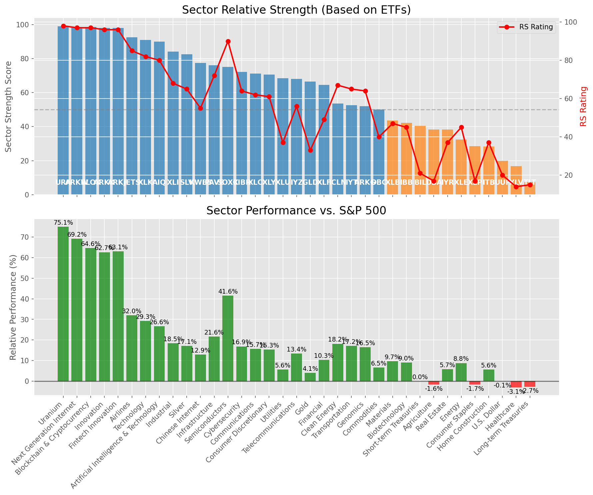

# **Daily Relative Strength Report**

**Date:** 2025-07-16

## **Market Valuation (Buffett Indicator)**

| Metric | Value |
|--------|-------|
| **Market Valuation** | **Overvalued** |
| **Current Ratio** | 10.21 |
| **Historical Mean** | 9.49 |
| **Standard Deviation** | 0.54 |
| **Z-Score (StdDev from Mean)** | 1.35 |
| **Total Market Cap** | $305.78 trillion |
| **GDP** | $29.96 trillion |

## **Market Insights**

### **Market is Overvalued**

The market appears to be trading above historical average valuations. While not at extreme levels, this suggests more modest future returns may be expected. Investors should:

- Focus on companies with reasonable valuations relative to their growth
- Be more selective with new positions
- Look for stocks showing relative strength within their sectors
- Consider trimming positions in extremely overvalued names

Historically, periods of mild overvaluation can persist for extended periods, but returns tend to be below average.

### **Buffett Indicator Overview**

The Buffett Indicator (Total Market Cap / GDP) is a measure of the stock market's valuation relative to the size of the economy. It is named after Warren Buffett, who described it as "probably the best single measure of where valuations stand at any given moment."

- **Values above +2 standard deviations:** Market significantly overvalued
- **Values above +1 standard deviation:** Market overvalued
- **Values between -1 and +1 standard deviations:** Market fairly valued
- **Values below -1 standard deviation:** Market undervalued
- **Values below -2 standard deviations:** Market significantly undervalued

---

## **Sector Relative Strength**

Based on William O'Neil's Relative Strength Methodology

| ETF | Strength | RS Rating | Performance | Above Key MAs | Trend | Sector |
|-----|----------|-----------|-------------|--------------|-------|--------|
| [URA](https://www.tradingview.com/chart/?symbol=URA) | 99.0 | 98.0 | 71.98% | 10d ✓, 50d ✓, 200d ✓ | ↗️ | Uranium |
| [BLOK](https://www.tradingview.com/chart/?symbol=BLOK) | 98.5 | 97.0 | 63.16% | 10d ✓, 50d ✓, 200d ✓ | ↗️ | Blockchain & Cryptocurrency |
| [ARKW](https://www.tradingview.com/chart/?symbol=ARKW) | 98.5 | 97.0 | 67.86% | 10d ✓, 50d ✓, 200d ✓ | ↗️ | Next Generation Internet |
| [ARKF](https://www.tradingview.com/chart/?symbol=ARKF) | 98.0 | 96.0 | 61.24% | 10d ✓, 50d ✓, 200d ✓ | ↗️ | Fintech Innovation |
| [ARKK](https://www.tradingview.com/chart/?symbol=ARKK) | 98.0 | 96.0 | 60.84% | 10d ✓, 50d ✓, 200d ✓ | ↗️ | Innovation |
| [JETS](https://www.tradingview.com/chart/?symbol=JETS) | 92.5 | 85.0 | 30.82% | 10d ✓, 50d ✓, 200d ✓ | ↗️ | Airlines |
| [XLK](https://www.tradingview.com/chart/?symbol=XLK) | 91.0 | 82.0 | 28.26% | 10d ✓, 50d ✓, 200d ✓ | ↗️ | Technology |
| [AIQ](https://www.tradingview.com/chart/?symbol=AIQ) | 89.5 | 79.0 | 25.75% | 10d ✓, 50d ✓, 200d ✓ | ↗️ | Artificial Intelligence & Technology |
| [SLV](https://www.tradingview.com/chart/?symbol=SLV) | 82.5 | 65.0 | 17.02% | 10d ✓, 50d ✓, 200d ✓ | ↗️ | Silver |
| [KWEB](https://www.tradingview.com/chart/?symbol=KWEB) | 77.5 | 55.0 | 12.43% | 10d ✓, 50d ✓, 200d ✓ | ↗️ | Chinese Internet |
| [PAVE](https://www.tradingview.com/chart/?symbol=PAVE) | 76.1 | 72.0 | 20.74% | 10d ✗, 50d ✓, 200d ✓ | ↗️ | Infrastructure |
| [XLI](https://www.tradingview.com/chart/?symbol=XLI) | 73.6 | 67.0 | 17.66% | 10d ✗, 50d ✓, 200d ✓ | ↗️ | Industrial |
| [CIBR](https://www.tradingview.com/chart/?symbol=CIBR) | 72.1 | 64.0 | 16.42% | 10d ✗, 50d ✓, 200d ✓ | ↗️ | Cybersecurity |
| [XLC](https://www.tradingview.com/chart/?symbol=XLC) | 71.6 | 63.0 | 15.71% | 10d ✗, 50d ✓, 200d ✓ | ↗️ | Communications |
| [XLY](https://www.tradingview.com/chart/?symbol=XLY) | 70.6 | 61.0 | 15.00% | 10d ✗, 50d ✓, 200d ✓ | ↗️ | Consumer Discretionary |
| [IYZ](https://www.tradingview.com/chart/?symbol=IYZ) | 68.1 | 56.0 | 12.75% | 10d ✗, 50d ✓, 200d ✓ | ↗️ | Telecommunications |
| [GLD](https://www.tradingview.com/chart/?symbol=GLD) | 67.0 | 34.0 | 4.16% | 10d ✓, 50d ✓, 200d ✓ | ↗️ | Gold |
| [SOXX](https://www.tradingview.com/chart/?symbol=SOXX) | 65.1 | 90.0 | 39.70% | 10d ✗, 50d ✓, 200d ✓ | ↘️ | Semiconductors |
| [XLF](https://www.tradingview.com/chart/?symbol=XLF) | 64.1 | 48.0 | 9.59% | 10d ✗, 50d ✓, 200d ✓ | ↗️ | Financial |
| [XLU](https://www.tradingview.com/chart/?symbol=XLU) | 58.6 | 37.0 | 5.16% | 10d ✗, 50d ✓, 200d ✓ | ↗️ | Utilities |
| [ICLN](https://www.tradingview.com/chart/?symbol=ICLN) | 54.1 | 68.0 | 17.95% | 10d ✗, 50d ✓, 200d ✓ | ↘️ | Clean Energy |
| [IYT](https://www.tradingview.com/chart/?symbol=IYT) | 52.1 | 64.0 | 16.47% | 10d ✗, 50d ✓, 200d ✓ | ↘️ | Transportation |
| [ARKG](https://www.tradingview.com/chart/?symbol=ARKG) | 51.1 | 62.0 | 15.27% | 10d ✗, 50d ✓, 200d ✓ | ↘️ | Genomics |
| [XLB](https://www.tradingview.com/chart/?symbol=XLB) | 43.1 | 46.0 | 8.89% | 10d ✗, 50d ✓, 200d ✓ | ↘️ | Materials |
| [BIL](https://www.tradingview.com/chart/?symbol=BIL) | 41.0 | 22.0 | 0.04% | 10d ✓, 50d ✓, 200d ✓ | ↘️ | Short-term Treasuries |
| [DBC](https://www.tradingview.com/chart/?symbol=DBC) | 40.1 | 40.0 | 6.26% | 10d ✗, 50d ✓, 200d ✓ | ↘️ | Commodities |
| [XLE](https://www.tradingview.com/chart/?symbol=XLE) | 32.9 | 46.0 | 8.96% | 10d ✗, 50d ✓, 200d ✗ | ↘️ | Energy |
| [IBB](https://www.tradingview.com/chart/?symbol=IBB) | 32.4 | 45.0 | 8.55% | 10d ✗, 50d ✓, 200d ✗ | ↘️ | Biotechnology |
| [DBA](https://www.tradingview.com/chart/?symbol=DBA) | 30.0 | 20.0 | -0.54% | 10d ✗, 50d ✗, 200d ✗ | ↗️ | Agriculture |
| [XLP](https://www.tradingview.com/chart/?symbol=XLP) | 28.5 | 17.0 | -2.20% | 10d ✗, 50d ✗, 200d ✗ | ↗️ | Consumer Staples |
| [IYR](https://www.tradingview.com/chart/?symbol=IYR) | 28.4 | 37.0 | 5.23% | 10d ✗, 50d ✓, 200d ✗ | ↘️ | Real Estate |
| [ITB](https://www.tradingview.com/chart/?symbol=ITB) | 27.9 | 36.0 | 4.70% | 10d ✗, 50d ✓, 200d ✗ | ↘️ | Home Construction |
| [UUP](https://www.tradingview.com/chart/?symbol=UUP) | 20.4 | 21.0 | -0.09% | 10d ✓, 50d ✗, 200d ✗ | ↘️ | U.S. Dollar |
| [TLT](https://www.tradingview.com/chart/?symbol=TLT) | 7.5 | 15.0 | -3.22% | 10d ✗, 50d ✗, 200d ✗ | ↘️ | Long-term Treasuries |
| [XLV](https://www.tradingview.com/chart/?symbol=XLV) | 7.5 | 15.0 | -3.38% | 10d ✗, 50d ✗, 200d ✗ | ↘️ | Healthcare |

### **Sector ETF Performance Interpretation**

This table shows the relative strength metrics for different market sectors based on their representative ETFs:

- **ETF**: The ETF used to measure sector performance (click for chart)
- **Strength**: Overall sector strength score (0-100) combining multiple factors
- **RS Rating**: O'Neil RS rating of the sector ETF
- **Performance**: Performance of the sector ETF relative to SPY
- **Above Key MAs**: Whether the ETF is trading above its 10, 50, and 200-day moving averages
- **Trend**: Whether the sector is in an uptrend (↗️) or downtrend (↘️)

### **Current Sector Leadership**

The current market leadership is coming from the following sectors: **Uranium, Blockchain & Cryptocurrency, Next Generation Internet**.

The **Uranium** sector (represented by **URA**) is showing particularly strong relative strength with an RS rating of 98.0 and performance of 71.98% vs. the S&P 500. This sector is trading above its 10-day, 50-day, 200-day moving average(s). Investors should consider focusing on high RS stocks within these leading sectors for potential outperformance.

---

## **Buy Recommendations**

The following 41 stocks show exceptional relative strength:

| RS Rating | Buy Score | Current Price | Chart | Name | Ticker |
|-----------|-----------|---------------|-------|------|--------|
| 100 | 100 | $219.76 | [Chart](https://www.tradingview.com/chart/?symbol=LEU) | Centrus Energy Corp. | LEU |
| 100 | 100 | $102.94 | [Chart](https://www.tradingview.com/chart/?symbol=HOOD) | Robinhood Markets, Inc. Class A Common Stock | HOOD |
| 100 | 100 | $25.25 | [Chart](https://www.tradingview.com/chart/?symbol=EYE) | National Vision Holdings, Inc. Common Stock | EYE |
| 100 | 100 | $119.22 | [Chart](https://www.tradingview.com/chart/?symbol=RBLX) | Roblox Corporation | RBLX |
| 100 | 100 | $57.72 | [Chart](https://www.tradingview.com/chart/?symbol=MP) | MP Materials Corp. | MP |
| 100 | 100 | $45.70 | [Chart](https://www.tradingview.com/chart/?symbol=TTMI) | TTM Technologies Inc | TTMI |
| 99 | 100 | $69.23 | [Chart](https://www.tradingview.com/chart/?symbol=LIF) | Life360, Inc. Common Stock | LIF |
| 98 | 100 | $104.78 | [Chart](https://www.tradingview.com/chart/?symbol=VRNA) | Verona Pharma plc | VRNA |
| 98 | 100 | $560.79 | [Chart](https://www.tradingview.com/chart/?symbol=GEV) | GE Vernova Inc. | GEV |
| 98 | 100 | $39.13 | [Chart](https://www.tradingview.com/chart/?symbol=AS) | Amer Sports, Inc. | AS |
| 98 | 100 | $356.65 | [Chart](https://www.tradingview.com/chart/?symbol=CVNA) | Carvana Co. | CVNA |
| 97 | 100 | $155.79 | [Chart](https://www.tradingview.com/chart/?symbol=ARKW) | ARK Next Generation Internet ETF | ARKW |
| 97 | 100 | $141.40 | [Chart](https://www.tradingview.com/chart/?symbol=FUTU) | Futu Holdings Limited American Depositary Shares | FUTU |
| 96 | 100 | $101.04 | [Chart](https://www.tradingview.com/chart/?symbol=TPR) | Tapestry, Inc. Common Stock | TPR |
| 96 | 100 | $52.79 | [Chart](https://www.tradingview.com/chart/?symbol=ARKF) | ARK Fintech Innovation ETF | ARKF |
| 96 | 100 | $36.72 | [Chart](https://www.tradingview.com/chart/?symbol=NNE) | Nano Nuclear Energy Inc. Common Stock | NNE |
| 96 | 100 | $53.54 | [Chart](https://www.tradingview.com/chart/?symbol=KTOS) | Kratos Defense & Security Solutions, Inc. | KTOS |
| 96 | 100 | $150.16 | [Chart](https://www.tradingview.com/chart/?symbol=PLTR) | Palantir Technologies Inc. Class A Common Stock | PLTR |
| 95 | 100 | $91.42 | [Chart](https://www.tradingview.com/chart/?symbol=RYTM) | Rhythm Pharmaceuticals, Inc. Common Stock | RYTM |
| 95 | 100 | $34.71 | [Chart](https://www.tradingview.com/chart/?symbol=ATRO) | Astronics Corp | ATRO |
| 94 | 100 | $35.64 | [Chart](https://www.tradingview.com/chart/?symbol=ATAT) | Atour Lifestyle Holdings Limited American Depositary Shares | ATAT |
| 93 | 100 | $88.17 | [Chart](https://www.tradingview.com/chart/?symbol=RBRK) | Rubrik, Inc. | RBRK |
| 93 | 100 | $453.82 | [Chart](https://www.tradingview.com/chart/?symbol=MSTR) | MicroStrategy Inc | MSTR |
| 93 | 100 | $218.70 | [Chart](https://www.tradingview.com/chart/?symbol=AGX) | Argan, Inc | AGX |
| 92 | 100 | $183.39 | [Chart](https://www.tradingview.com/chart/?symbol=HWM) | Howmet Aerospace Inc. | HWM |
| 92 | 100 | $78.92 | [Chart](https://www.tradingview.com/chart/?symbol=TPB) | Turning Point Brands, Inc. | TPB |
| 91 | 100 | $53.11 | [Chart](https://www.tradingview.com/chart/?symbol=AKRO) | Akero Therapeutics, Inc. Common Stock | AKRO |
| 91 | 100 | $265.02 | [Chart](https://www.tradingview.com/chart/?symbol=GE) | GE Aerospace | GE |
| 91 | 100 | $89.10 | [Chart](https://www.tradingview.com/chart/?symbol=C) | Citigroup Inc. | C |
| 90 | 100 | $67.53 | [Chart](https://www.tradingview.com/chart/?symbol=IBIT) | iShares Bitcoin Trust ETF | IBIT |
| 89 | 100 | $52.65 | [Chart](https://www.tradingview.com/chart/?symbol=BTC) | Grayscale Bitcoin Mini Trust ETF | BTC |
| 88 | 100 | $161.54 | [Chart](https://www.tradingview.com/chart/?symbol=SE) | Sea Limited American Depositary Shares, each representing one Class A Ordinary Share | SE |
| 88 | 99 | $58.74 | [Chart](https://www.tradingview.com/chart/?symbol=IBKR) | Interactive Brokers Group, Inc. Class A Common Stock | IBKR |
| 87 | 98 | $47.05 | [Chart](https://www.tradingview.com/chart/?symbol=BBIO) | BridgeBio Pharma, Inc. Common Stock | BBIO |
| 84 | 98 | $29.93 | [Chart](https://www.tradingview.com/chart/?symbol=SRAD) | Sportradar Group AG Class A Ordinary Shares | SRAD |
| 84 | 97 | $18.59 | [Chart](https://www.tradingview.com/chart/?symbol=BCS) | Barclays PLC | BCS |
| 83 | 96 | $29.97 | [Chart](https://www.tradingview.com/chart/?symbol=DB) | Deutsche Bank Aktiengesellschaft | DB |
| 82 | 93 | $81.54 | [Chart](https://www.tradingview.com/chart/?symbol=USFD) | US Foods Holding Corp. | USFD |
| 82 | 93 | $193.44 | [Chart](https://www.tradingview.com/chart/?symbol=ITA) | iShares U.S. Aerospace & Defense ETF | ITA |
| 81 | 92 | $44.03 | [Chart](https://www.tradingview.com/chart/?symbol=TOST) | Toast, Inc. | TOST |
| 81 | 91 | $144.46 | [Chart](https://www.tradingview.com/chart/?symbol=PPA) | Invesco Aerospace & Defense ETF | PPA |

---

## **Sell Recommendations**

The following 246 stocks show deteriorating relative strength:

| RS Rating | Sell Score | Current Price | Chart | Name | Ticker |
|-----------|------------|---------------|-------|------|--------|
| 1 | 100 | $25.11 | [Chart](https://www.tradingview.com/chart/?symbol=QID) | ProShares UltraShort QQQ | QID |
| 1 | 100 | $11.30 | [Chart](https://www.tradingview.com/chart/?symbol=TZA) | Direxion Daily Small Cap Bear 3x Shares | TZA |
| 1 | 100 | $33.71 | [Chart](https://www.tradingview.com/chart/?symbol=SARK) | Investment Managers Series Trust II Tradr 1X Short Innovation Daily ETF | SARK |
| 1 | 100 | $25.72 | [Chart](https://www.tradingview.com/chart/?symbol=TECS) | Direxion Daily Technology Bear 3x Shares | TECS |
| 1 | 100 | $10.09 | [Chart](https://www.tradingview.com/chart/?symbol=HIBS) | Direxion Daily S&P 500 High Beta Bear 3X Shares | HIBS |
| 2 | 100 | $16.54 | [Chart](https://www.tradingview.com/chart/?symbol=SDS) | ProShares UltraShort S&P500 | SDS |
| 2 | 100 | $10.25 | [Chart](https://www.tradingview.com/chart/?symbol=SNDX) | Syndax Pharmaceuticals, Inc. | SNDX |
| 2 | 100 | $41.77 | [Chart](https://www.tradingview.com/chart/?symbol=SDOW) | ProShares UltraPro Short Dow 30 | SDOW |
| 2 | 100 | $11.79 | [Chart](https://www.tradingview.com/chart/?symbol=IART) | Integra LifeSciences Holdings | IART |
| 2 | 100 | $74.80 | [Chart](https://www.tradingview.com/chart/?symbol=LNTH) | Lantheus Holdings, Inc | LNTH |
| 2 | 100 | $40.84 | [Chart](https://www.tradingview.com/chart/?symbol=LINE) | Lineage, Inc. Common Stock | LINE |
| 3 | 100 | $15.44 | [Chart](https://www.tradingview.com/chart/?symbol=HP) | Helmerich & Payne, Inc. | HP |
| 3 | 100 | $10.38 | [Chart](https://www.tradingview.com/chart/?symbol=SONO) | Sonos, Inc. Common Stock | SONO |
| 3 | 100 | $47.03 | [Chart](https://www.tradingview.com/chart/?symbol=ASGN) | ASGN Incorporated | ASGN |
| 3 | 100 | $223.99 | [Chart](https://www.tradingview.com/chart/?symbol=HUM) | Humana Inc. | HUM |
| 3 | 100 | $10.56 | [Chart](https://www.tradingview.com/chart/?symbol=OFIX) | Orthofix Medical Inc. Common Stock (DE) | OFIX |
| 3 | 100 | $111.16 | [Chart](https://www.tradingview.com/chart/?symbol=COKE) | Coca-Cola Consolidated, Inc. Common Stock | COKE |
| 3 | 100 | $36.72 | [Chart](https://www.tradingview.com/chart/?symbol=IBTA) | Ibotta, Inc. | IBTA |
| 3 | 100 | $96.06 | [Chart](https://www.tradingview.com/chart/?symbol=ONTO) | Onto Innovation Inc. | ONTO |
| 4 | 100 | $17.12 | [Chart](https://www.tradingview.com/chart/?symbol=BTAL) | AGF U.S. Market Neutral Anti-Beta Fund | BTAL |
| 4 | 100 | $10.22 | [Chart](https://www.tradingview.com/chart/?symbol=WNC) | Wabash National Corp. | WNC |
| 4 | 100 | $29.82 | [Chart](https://www.tradingview.com/chart/?symbol=CRI) | Carter's Inc. | CRI |
| 4 | 100 | $33.56 | [Chart](https://www.tradingview.com/chart/?symbol=PSQ) | ProShares Short QQQ | PSQ |
| 4 | 100 | $21.99 | [Chart](https://www.tradingview.com/chart/?symbol=ERY) | Direxion Daily Energy Bear 2X Shares | ERY |
| 4 | 100 | $12.79 | [Chart](https://www.tradingview.com/chart/?symbol=AVTR) | Avantor, Inc. | AVTR |
| 4 | 100 | $10.00 | [Chart](https://www.tradingview.com/chart/?symbol=LBTYK) | Liberty Global Ltd. Class C Common Shares | LBTYK |
| 4 | 100 | $19.24 | [Chart](https://www.tradingview.com/chart/?symbol=THS) | Treehouse Foods, Inc. | THS |
| 4 | 100 | $65.32 | [Chart](https://www.tradingview.com/chart/?symbol=TNET) | TRINET GROUP, INC. | TNET |
| 4 | 100 | $40.10 | [Chart](https://www.tradingview.com/chart/?symbol=RHI) | Robert Half Inc. | RHI |
| 4 | 100 | $12.06 | [Chart](https://www.tradingview.com/chart/?symbol=CCRN) | Cross Country Healthcare Inc | CCRN |
| 5 | 100 | $24.37 | [Chart](https://www.tradingview.com/chart/?symbol=DXD) | ProShares UltraShort Dow 30 | DXD |
| 5 | 100 | $22.45 | [Chart](https://www.tradingview.com/chart/?symbol=ACHC) | Acadia Healthcare Company, Inc. | ACHC |
| 5 | 100 | $112.39 | [Chart](https://www.tradingview.com/chart/?symbol=TFX) | Teleflex Incorporated | TFX |
| 5 | 100 | $21.13 | [Chart](https://www.tradingview.com/chart/?symbol=AMPH) | Amphastar Pharmaceuticals, Inc. | AMPH |
| 5 | 100 | $44.31 | [Chart](https://www.tradingview.com/chart/?symbol=ACIW) | ACI Worldwide, Inc. | ACIW |
| 5 | 100 | $10.59 | [Chart](https://www.tradingview.com/chart/?symbol=LOCO) | El Pollo Loco Holdings, Inc. | LOCO |
| 5 | 100 | $127.20 | [Chart](https://www.tradingview.com/chart/?symbol=INSP) | Inspire Medical Systems, Inc. | INSP |
| 5 | 100 | $23.70 | [Chart](https://www.tradingview.com/chart/?symbol=CRTO) | Criteo S.A. | CRTO |
| 6 | 100 | $14.48 | [Chart](https://www.tradingview.com/chart/?symbol=SEM) | SELECT MEDICAL HOLDINGS CORP | SEM |
| 6 | 100 | $27.52 | [Chart](https://www.tradingview.com/chart/?symbol=OMCL) | Omnicell Inc | OMCL |
| 6 | 100 | $21.85 | [Chart](https://www.tradingview.com/chart/?symbol=GPK) | Graphic Packaging Holding Company | GPK |
| 6 | 100 | $49.00 | [Chart](https://www.tradingview.com/chart/?symbol=LW) | Lamb Weston Holdings, Inc. | LW |
| 6 | 100 | $39.58 | [Chart](https://www.tradingview.com/chart/?symbol=SH) | ProShares Short S&P500 | SH |
| 6 | 100 | $10.22 | [Chart](https://www.tradingview.com/chart/?symbol=SD) | SandRidge Energy, Inc. | SD |
| 6 | 100 | $58.75 | [Chart](https://www.tradingview.com/chart/?symbol=COLM) | Columbia Sportswear Co | COLM |
| 6 | 100 | $10.18 | [Chart](https://www.tradingview.com/chart/?symbol=IMXI) | International Money Express, Inc. | IMXI |
| 7 | 100 | $54.47 | [Chart](https://www.tradingview.com/chart/?symbol=SPB) | Spectrum Brands Holdings, Inc. | SPB |
| 7 | 100 | $10.45 | [Chart](https://www.tradingview.com/chart/?symbol=OEC) | Orion S.A. | OEC |
| 7 | 100 | $34.86 | [Chart](https://www.tradingview.com/chart/?symbol=TMF) | Direxion Daily 20+ Year Treasury Bull 3X Shares (based on the NYSE 20 Year Plus Treasury Bond Index; symbol AXTWEN) | TMF |
| 7 | 100 | $126.64 | [Chart](https://www.tradingview.com/chart/?symbol=KMB) | Kimberly-Clark Corp. | KMB |
| 7 | 100 | $126.49 | [Chart](https://www.tradingview.com/chart/?symbol=ICUI) | ICU Medical Inc | ICUI |
| 7 | 100 | $125.42 | [Chart](https://www.tradingview.com/chart/?symbol=CLX) | Clorox Company | CLX |
| 7 | 100 | $50.82 | [Chart](https://www.tradingview.com/chart/?symbol=LGIH) | LGI Homes, Inc. | LGIH |
| 8 | 100 | $95.47 | [Chart](https://www.tradingview.com/chart/?symbol=CHD) | Church & Dwight Co., Inc. | CHD |
| 8 | 100 | $15.53 | [Chart](https://www.tradingview.com/chart/?symbol=TNDM) | Tandem Diabetes Care, Inc. | TNDM |
| 8 | 100 | $152.63 | [Chart](https://www.tradingview.com/chart/?symbol=PG) | Procter & Gamble Company | PG |
| 8 | 100 | $10.13 | [Chart](https://www.tradingview.com/chart/?symbol=LBTYA) | Liberty Global Ltd. Class A Common Shares | LBTYA |
| 8 | 100 | $45.49 | [Chart](https://www.tradingview.com/chart/?symbol=CWT) | California Water Service | CWT |
| 8 | 100 | $53.23 | [Chart](https://www.tradingview.com/chart/?symbol=AMWD) | American Woodmark Corp | AMWD |
| 9 | 100 | $87.43 | [Chart](https://www.tradingview.com/chart/?symbol=CL) | Colgate-Palmolive Company | CL |
| 9 | 100 | $302.21 | [Chart](https://www.tradingview.com/chart/?symbol=CI) | The Cigna Group | CI |
| 9 | 100 | $25.57 | [Chart](https://www.tradingview.com/chart/?symbol=DOG) | ProShares Short Dow30 | DOG |
| 10 | 100 | $118.00 | [Chart](https://www.tradingview.com/chart/?symbol=RGEN) | Repligen Corp | RGEN |
| 10 | 100 | $100.59 | [Chart](https://www.tradingview.com/chart/?symbol=AFL) | Aflac Inc. | AFL |
| 10 | 100 | $62.09 | [Chart](https://www.tradingview.com/chart/?symbol=ZROZ) | PIMCO 25+ Year Zero Coupon U.S. Treasury Index Exchange-Traded Fund | ZROZ |
| 10 | 100 | $102.72 | [Chart](https://www.tradingview.com/chart/?symbol=DEO) | Diageo plc | DEO |
| 11 | 100 | $40.64 | [Chart](https://www.tradingview.com/chart/?symbol=POR) | Portland General Electric Company | POR |
| 11 | 100 | $22.36 | [Chart](https://www.tradingview.com/chart/?symbol=RPD) | Rapid7, Inc. Common Stock | RPD |
| 11 | 100 | $330.27 | [Chart](https://www.tradingview.com/chart/?symbol=EG) | Everest Group, Ltd. | EG |
| 12 | 100 | $15.79 | [Chart](https://www.tradingview.com/chart/?symbol=BBN) | BlackRock Taxable Municipal Bond Trust | BBN |
| 13 | 100 | $11.68 | [Chart](https://www.tradingview.com/chart/?symbol=CLB) | Core Laboratories Inc. | CLB |
| 13 | 100 | $170.41 | [Chart](https://www.tradingview.com/chart/?symbol=UHS) | Universal Health Services, Inc. Class B | UHS |
| 13 | 100 | $10.45 | [Chart](https://www.tradingview.com/chart/?symbol=MYI) | BLACKROCK MUNIYIELD QUALITY FUND III, INC. | MYI |
| 13 | 100 | $18.46 | [Chart](https://www.tradingview.com/chart/?symbol=SPT) | Sprout Social, Inc Class A Common Stock | SPT |
| 13 | 100 | $162.39 | [Chart](https://www.tradingview.com/chart/?symbol=HSY) | The Hershey Company | HSY |
| 14 | 100 | $49.07 | [Chart](https://www.tradingview.com/chart/?symbol=CNMD) | CONMED Corporation | CNMD |
| 14 | 100 | $27.00 | [Chart](https://www.tradingview.com/chart/?symbol=GTY) | Getty Realty Corp. | GTY |
| 1 | 99 | $17.74 | [Chart](https://www.tradingview.com/chart/?symbol=UVXY) | ProShares Ultra VIX Short-Term Futures ETF | UVXY |
| 1 | 99 | $16.32 | [Chart](https://www.tradingview.com/chart/?symbol=SRTY) | ProShares UltraPro Short Russell2000 | SRTY |
| 6 | 99 | $37.17 | [Chart](https://www.tradingview.com/chart/?symbol=LKQ) | LKQ Corporation | LKQ |
| 9 | 99 | $14.86 | [Chart](https://www.tradingview.com/chart/?symbol=PRO) | Pros Holdings, Inc. | PRO |
| 9 | 99 | $12.86 | [Chart](https://www.tradingview.com/chart/?symbol=BSM) | Black Stone Minerals, L.P. | BSM |
| 10 | 99 | $210.70 | [Chart](https://www.tradingview.com/chart/?symbol=EXP) | Eagle Materials, Inc. | EXP |
| 11 | 99 | $13.42 | [Chart](https://www.tradingview.com/chart/?symbol=GO) | Grocery Outlet Holding Corp. Common Stock | GO |
| 13 | 99 | $73.35 | [Chart](https://www.tradingview.com/chart/?symbol=BG) | Bunge Global SA | BG |
| 16 | 99 | $20.96 | [Chart](https://www.tradingview.com/chart/?symbol=LGOV) | First Trust Long Duration Opportunities ETF | LGOV |
| 18 | 99 | $32.56 | [Chart](https://www.tradingview.com/chart/?symbol=TENB) | Tenable Holdings, Inc. | TENB |
| 3 | 98 | $25.13 | [Chart](https://www.tradingview.com/chart/?symbol=VCYT) | Veracyte, Inc. | VCYT |
| 4 | 98 | $49.31 | [Chart](https://www.tradingview.com/chart/?symbol=TAP) | Molson Coors Beverage Company Class B | TAP |
| 13 | 98 | $14.54 | [Chart](https://www.tradingview.com/chart/?symbol=VRE) | Veris Residential, Inc. | VRE |
| 15 | 98 | $94.77 | [Chart](https://www.tradingview.com/chart/?symbol=RVTY) | Revvity, Inc. | RVTY |
| 9 | 97 | $47.03 | [Chart](https://www.tradingview.com/chart/?symbol=BMY) | Bristol-Myers Squibb Co. | BMY |
| 10 | 97 | $48.47 | [Chart](https://www.tradingview.com/chart/?symbol=SNY) | Sanofi American Depositary Shares (Each representing one-half of one ordinary share) | SNY |
| 10 | 97 | $25.17 | [Chart](https://www.tradingview.com/chart/?symbol=DRV) | Direxion Daily Real Estate Bear 3X Shares | DRV |
| 12 | 97 | $14.30 | [Chart](https://www.tradingview.com/chart/?symbol=INMD) | InMode Ltd. Ordinary Shares | INMD |
| 14 | 97 | $38.06 | [Chart](https://www.tradingview.com/chart/?symbol=KSA) | iShares MSCI Saudi Arabia ETF | KSA |
| 15 | 97 | $84.69 | [Chart](https://www.tradingview.com/chart/?symbol=TLT) | iShares 20+ Year Treasury Bond ETF | TLT |
| 18 | 97 | $21.65 | [Chart](https://www.tradingview.com/chart/?symbol=TUA) | Simplify Short Term Treasury Futures Strategy ETF | TUA |
| 10 | 96 | $288.46 | [Chart](https://www.tradingview.com/chart/?symbol=POOL) | Pool Corporation | POOL |
| 10 | 96 | $104.43 | [Chart](https://www.tradingview.com/chart/?symbol=BAH) | Booz Allen Hamilton Holding Corporation | BAH |
| 11 | 96 | $62.77 | [Chart](https://www.tradingview.com/chart/?symbol=EDV) | Vanguard World Funds Extended Duration ETF | EDV |
| 13 | 96 | $10.98 | [Chart](https://www.tradingview.com/chart/?symbol=MQY) | Blackrock Muni Yield Quality Fund, Inc | MQY |
| 14 | 96 | $12.36 | [Chart](https://www.tradingview.com/chart/?symbol=WSR) | Whitestone REIT | WSR |
| 16 | 96 | $54.63 | [Chart](https://www.tradingview.com/chart/?symbol=DAY) | Dayforce, Inc. | DAY |
| 6 | 95 | $104.81 | [Chart](https://www.tradingview.com/chart/?symbol=POST) | POST HOLDINGS, INC. | POST |
| 13 | 95 | $24.00 | [Chart](https://www.tradingview.com/chart/?symbol=PNTG) | The Pennant Group, Inc. Common Stock | PNTG |
| 15 | 95 | $76.78 | [Chart](https://www.tradingview.com/chart/?symbol=EMN) | Eastman Chemical Company | EMN |
| 15 | 95 | $10.25 | [Chart](https://www.tradingview.com/chart/?symbol=MUC) | BLACKROCK MUNIHOLDINGS CALIFORNIA QUALITY FUND, INC | MUC |
| 17 | 95 | $16.76 | [Chart](https://www.tradingview.com/chart/?symbol=UMH) | UMH Properties, Inc. | UMH |
| 19 | 95 | $40.38 | [Chart](https://www.tradingview.com/chart/?symbol=UDR) | UDR, Inc. | UDR |
| 20 | 95 | $66.55 | [Chart](https://www.tradingview.com/chart/?symbol=EQR) | Equity Residential | EQR |
| 21 | 95 | $19.71 | [Chart](https://www.tradingview.com/chart/?symbol=AMN) | AMN Healthcare Services | AMN |
| 22 | 95 | $24.34 | [Chart](https://www.tradingview.com/chart/?symbol=HYMB) | SPDR Nuveen ICE High Yield Municipal Bond ETF | HYMB |
| 7 | 94 | $36.83 | [Chart](https://www.tradingview.com/chart/?symbol=VCEL) | Vericel Corporation | VCEL |
| 9 | 94 | $70.86 | [Chart](https://www.tradingview.com/chart/?symbol=MKC) | McCormick & Company, Incorporated Non-VTG CS | MKC |
| 10 | 94 | $37.18 | [Chart](https://www.tradingview.com/chart/?symbol=WTRG) | Essential Utilities, Inc. | WTRG |
| 12 | 94 | $29.48 | [Chart](https://www.tradingview.com/chart/?symbol=AXTA) | Axalta Coating Systems Ltd. | AXTA |
| 14 | 94 | $15.97 | [Chart](https://www.tradingview.com/chart/?symbol=MLNK) | MeridianLink, Inc. | MLNK |
| 15 | 94 | $113.85 | [Chart](https://www.tradingview.com/chart/?symbol=BFAM) | BRIGHT HORIZONS FAMILY SOLUTIONS INC. | BFAM |
| 15 | 94 | $34.34 | [Chart](https://www.tradingview.com/chart/?symbol=PECO) | Phillips Edison & Company, Inc. Common Stock | PECO |
| 17 | 94 | $32.00 | [Chart](https://www.tradingview.com/chart/?symbol=INVH) | Invitation Homes Inc. Common Stock | INVH |
| 20 | 94 | $101.20 | [Chart](https://www.tradingview.com/chart/?symbol=PRU) | Prudential Financial, Inc. | PRU |
| 21 | 94 | $10.12 | [Chart](https://www.tradingview.com/chart/?symbol=NMZ) | Nuveen Municipal High Income Opportunity Fund | NMZ |
| 12 | 93 | $17.52 | [Chart](https://www.tradingview.com/chart/?symbol=LOVE) | The Lovesac Company Common Stock | LOVE |
| 15 | 93 | $31.02 | [Chart](https://www.tradingview.com/chart/?symbol=ZD) | Ziff Davis, Inc. Common Stock | ZD |
| 15 | 93 | $60.15 | [Chart](https://www.tradingview.com/chart/?symbol=UL) | Unilever plc | UL |
| 17 | 93 | $25.50 | [Chart](https://www.tradingview.com/chart/?symbol=WY) | Weyerhaeuser Company | WY |
| 18 | 93 | $33.47 | [Chart](https://www.tradingview.com/chart/?symbol=HTRB) | Hartford Total Return Bond ETF | HTRB |
| 18 | 93 | $17.05 | [Chart](https://www.tradingview.com/chart/?symbol=STAA) | Staar Surgical Co | STAA |
| 19 | 93 | $14.94 | [Chart](https://www.tradingview.com/chart/?symbol=SAFE) | Safehold Inc. | SAFE |
| 23 | 93 | $11.72 | [Chart](https://www.tradingview.com/chart/?symbol=NVG) | Nuveen AMT-Free Municipal Credit Income Fund | NVG |
| 8 | 92 | $10.91 | [Chart](https://www.tradingview.com/chart/?symbol=PTLO) | Portillo's Inc. Class A Common Stock | PTLO |
| 9 | 92 | $32.85 | [Chart](https://www.tradingview.com/chart/?symbol=KDP) | Keurig Dr Pepper Inc. | KDP |
| 10 | 92 | $140.07 | [Chart](https://www.tradingview.com/chart/?symbol=DVA) | DaVita Inc. | DVA |
| 12 | 92 | $79.32 | [Chart](https://www.tradingview.com/chart/?symbol=OKE) | Oneok, Inc. | OKE |
| 13 | 92 | $26.36 | [Chart](https://www.tradingview.com/chart/?symbol=FCPT) | Four Corners Property Trust, Inc. | FCPT |
| 17 | 92 | $10.77 | [Chart](https://www.tradingview.com/chart/?symbol=FBRT) | Franklin BSP Realty Trust, Inc. | FBRT |
| 17 | 92 | $66.91 | [Chart](https://www.tradingview.com/chart/?symbol=MDLZ) | Mondelez International, Inc. Class A | MDLZ |
| 20 | 92 | $16.49 | [Chart](https://www.tradingview.com/chart/?symbol=NVCR) | NovoCure Limited Ordinary Shares | NVCR |
| 13 | 91 | $214.31 | [Chart](https://www.tradingview.com/chart/?symbol=LOW) | Lowe's Companies Inc. | LOW |
| 15 | 91 | $214.55 | [Chart](https://www.tradingview.com/chart/?symbol=MKTX) | MarketAxess Holdings Inc. | MKTX |
| 18 | 91 | $469.35 | [Chart](https://www.tradingview.com/chart/?symbol=LMT) | Lockheed Martin Corp. | LMT |
| 12 | 90 | $17.98 | [Chart](https://www.tradingview.com/chart/?symbol=FLGT) | Fulgent Genetics, Inc. Common Stock | FLGT |
| 17 | 90 | $18.52 | [Chart](https://www.tradingview.com/chart/?symbol=AKR) | Acadia Realty Trust | AKR |
| 17 | 90 | $11.23 | [Chart](https://www.tradingview.com/chart/?symbol=SITC) | SITE Centers Corp. Common Shares | SITC |
| 18 | 90 | $26.15 | [Chart](https://www.tradingview.com/chart/?symbol=BAB) | Invesco Taxable Municipal Bond ETF | BAB |
| 18 | 90 | $13.69 | [Chart](https://www.tradingview.com/chart/?symbol=DOLE) | Dole plc | DOLE |
| 19 | 90 | $49.74 | [Chart](https://www.tradingview.com/chart/?symbol=MTBA) | Simplify MBS ETF | MTBA |
| 20 | 90 | $94.01 | [Chart](https://www.tradingview.com/chart/?symbol=IEF) | iShares 7-10 Year Treasury Bond ETF | IEF |
| 21 | 90 | $58.49 | [Chart](https://www.tradingview.com/chart/?symbol=VGSH) | Vanguard Short-Term Treasury ETF | VGSH |
| 22 | 90 | $73.52 | [Chart](https://www.tradingview.com/chart/?symbol=IFF) | International Flavors & Fragrances Inc. | IFF |
| 23 | 90 | $43.37 | [Chart](https://www.tradingview.com/chart/?symbol=FIXD) | First Trust Exchange-Traded Fund VIII First Trust Smith Opportunistic Fixed Income ETF | FIXD |
| 23 | 90 | $98.91 | [Chart](https://www.tradingview.com/chart/?symbol=UPS) | United Parcel Service, Inc. Class B | UPS |
| 27 | 90 | $48.83 | [Chart](https://www.tradingview.com/chart/?symbol=IGLB) | iShares 10+ Year Investment Grade Corporate Bond ETF | IGLB |
| 12 | 89 | $20.96 | [Chart](https://www.tradingview.com/chart/?symbol=BLFS) | BioLife Solutions Inc. | BLFS |
| 18 | 89 | $337.12 | [Chart](https://www.tradingview.com/chart/?symbol=SHW) | The Sherwin-Williams Company | SHW |
| 24 | 89 | $10.81 | [Chart](https://www.tradingview.com/chart/?symbol=NEA) | Nuveen AMT-Free Quality Municipal Income Fund | NEA |
| 25 | 89 | $27.50 | [Chart](https://www.tradingview.com/chart/?symbol=QDEL) | QuidelOrtho Corporation Common Stock | QDEL |
| 14 | 88 | $411.87 | [Chart](https://www.tradingview.com/chart/?symbol=MSI) | Motorola Solutions, Inc. New | MSI |
| 15 | 88 | $37.31 | [Chart](https://www.tradingview.com/chart/?symbol=LZB) | La-Z-Boy Incorporated | LZB |
| 20 | 88 | $20.79 | [Chart](https://www.tradingview.com/chart/?symbol=HI) | Hillenbrand, Inc. | HI |
| 21 | 88 | $200.62 | [Chart](https://www.tradingview.com/chart/?symbol=AVB) | AvalonBay Communities, Inc. | AVB |
| 23 | 88 | $90.83 | [Chart](https://www.tradingview.com/chart/?symbol=BOND) | PIMCO Active Bond Exchange-Traded Fund | BOND |
| 30 | 88 | $14.60 | [Chart](https://www.tradingview.com/chart/?symbol=MNRO) | Monro, Inc. Common Stock | MNRO |
| 17 | 87 | $40.15 | [Chart](https://www.tradingview.com/chart/?symbol=FE) | FirstEnergy Corp. | FE |
| 20 | 87 | $28.27 | [Chart](https://www.tradingview.com/chart/?symbol=BAX) | Baxter International Inc. | BAX |
| 20 | 87 | $35.75 | [Chart](https://www.tradingview.com/chart/?symbol=AMH) | AMERICAN HOMES 4 RENT | AMH |
| 21 | 87 | $39.58 | [Chart](https://www.tradingview.com/chart/?symbol=TOTL) | SSgA Active ETF Trust SPDR DoubleLine Total Return Tactical ETF | TOTL |
| 24 | 87 | $11.34 | [Chart](https://www.tradingview.com/chart/?symbol=NFBK) | Northfield Bancorp, Inc. | NFBK |
| 25 | 87 | $34.40 | [Chart](https://www.tradingview.com/chart/?symbol=CMCSA) | Comcast Corp | CMCSA |
| 26 | 87 | $11.20 | [Chart](https://www.tradingview.com/chart/?symbol=NAD) | Nuveen Quality Municipal Income Fund | NAD |
| 28 | 87 | $11.80 | [Chart](https://www.tradingview.com/chart/?symbol=NZF) | Nuveen Municipal Credit Income Fund | NZF |
| 15 | 86 | $759.10 | [Chart](https://www.tradingview.com/chart/?symbol=EQIX) | Equinix, Inc. Common Stock REIT | EQIX |
| 18 | 86 | $283.98 | [Chart](https://www.tradingview.com/chart/?symbol=PSA) | Public Storage | PSA |
| 20 | 86 | $67.86 | [Chart](https://www.tradingview.com/chart/?symbol=BRC) | Brady Corporation | BRC |
| 21 | 86 | $82.47 | [Chart](https://www.tradingview.com/chart/?symbol=SHY) | iShares 1-3 Year Treasury Bond ETF | SHY |
| 23 | 86 | $37.05 | [Chart](https://www.tradingview.com/chart/?symbol=PBA) | PEMBINA PIPELINE CORPORATION | PBA |
| 26 | 86 | $73.72 | [Chart](https://www.tradingview.com/chart/?symbol=VCLT) | Vanguard Long-Term Corporate Bond ETF | VCLT |
| 16 | 85 | $66.76 | [Chart](https://www.tradingview.com/chart/?symbol=WK) | Workiva Inc. | WK |
| 18 | 85 | $86.64 | [Chart](https://www.tradingview.com/chart/?symbol=SIGI) | Selective Insurance Group | SIGI |
| 18 | 85 | $98.70 | [Chart](https://www.tradingview.com/chart/?symbol=FMX) | FOMENTO ECONOMICO MEXICANO, S.A.B. DE C.V. | FMX |
| 22 | 84 | $21.20 | [Chart](https://www.tradingview.com/chart/?symbol=FLCB) | Franklin U.S. Core Bond ETF | FLCB |
| 23 | 84 | $49.20 | [Chart](https://www.tradingview.com/chart/?symbol=BNDX) | Vanguard Total International Bond ETF | BNDX |
| 29 | 84 | $113.22 | [Chart](https://www.tradingview.com/chart/?symbol=CPT) | Camden Property Trust | CPT |
| 36 | 84 | $20.16 | [Chart](https://www.tradingview.com/chart/?symbol=VECO) | Veeco Instruments Inc | VECO |
| 20 | 83 | $29.15 | [Chart](https://www.tradingview.com/chart/?symbol=SPTS) | SPDR Portfolio Short Term Treasury ETF | SPTS |
| 22 | 83 | $97.76 | [Chart](https://www.tradingview.com/chart/?symbol=AGG) | iShares Core U.S. Aggregate Bond ETF | AGG |
| 22 | 83 | $21.77 | [Chart](https://www.tradingview.com/chart/?symbol=SPMB) | SPDR Portfolio Mortgage Backed Bond ETF | SPMB |
| 26 | 83 | $15.77 | [Chart](https://www.tradingview.com/chart/?symbol=BNL) | Broadstone Net Lease, Inc. | BNL |
| 28 | 83 | $93.76 | [Chart](https://www.tradingview.com/chart/?symbol=FRT) | Federal Realty Investment Trust | FRT |
| 30 | 83 | $176.36 | [Chart](https://www.tradingview.com/chart/?symbol=AVY) | Avery Dennison Corp. | AVY |
| 36 | 83 | $16.95 | [Chart](https://www.tradingview.com/chart/?symbol=SVOL) | Simplify Volatility Premium ETF | SVOL |
| 21 | 82 | $24.72 | [Chart](https://www.tradingview.com/chart/?symbol=SCHR) | Schwab Intermediately-Term U.S. Treasury ETF | SCHR |
| 27 | 82 | $25.35 | [Chart](https://www.tradingview.com/chart/?symbol=BRX) | BRIXMOR PROPERTY GROUP INC. | BRX |
| 37 | 82 | $23.77 | [Chart](https://www.tradingview.com/chart/?symbol=HOG) | Harley-Davidson, Inc. | HOG |
| 20 | 81 | $355.95 | [Chart](https://www.tradingview.com/chart/?symbol=HD) | Home Depot, Inc. | HD |
| 21 | 81 | $49.90 | [Chart](https://www.tradingview.com/chart/?symbol=TBIL) | US Treasury 3 Month Bill ETF | TBIL |
| 26 | 81 | $17.45 | [Chart](https://www.tradingview.com/chart/?symbol=S) | SentinelOne, Inc. | S |
| 26 | 81 | $49.66 | [Chart](https://www.tradingview.com/chart/?symbol=FMB) | First Trust Managed Municipal ETF | FMB |
| 28 | 81 | $48.07 | [Chart](https://www.tradingview.com/chart/?symbol=JBBB) | Janus Henderson B-BBB CLO ETF | JBBB |
| 22 | 80 | $117.86 | [Chart](https://www.tradingview.com/chart/?symbol=IEI) | iShares 3-7 Year Treasury Bond ETF | IEI |
| 23 | 80 | $72.59 | [Chart](https://www.tradingview.com/chart/?symbol=BND) | Vanguard Total Bond Market | BND |
| 25 | 80 | $32.55 | [Chart](https://www.tradingview.com/chart/?symbol=GLBE) | Global-E Online Ltd. Ordinary Shares | GLBE |
| 25 | 80 | $27.83 | [Chart](https://www.tradingview.com/chart/?symbol=DOCN) | DigitalOcean Holdings, Inc. | DOCN |
| 30 | 80 | $43.86 | [Chart](https://www.tradingview.com/chart/?symbol=CMPR) | Cimpress PLC Ordinary Shares (Ireland) | CMPR |
| 32 | 80 | $160.34 | [Chart](https://www.tradingview.com/chart/?symbol=ODFL) | Old Dominion Freight Line | ODFL |
| 32 | 80 | $70.21 | [Chart](https://www.tradingview.com/chart/?symbol=AZN) | AstraZeneca PLC | AZN |
| 33 | 80 | $26.68 | [Chart](https://www.tradingview.com/chart/?symbol=CLOZ) | Eldridge BBB-B CLO ETF | CLOZ |
| 21 | 79 | $59.06 | [Chart](https://www.tradingview.com/chart/?symbol=VGIT) | Vanguard Intermediate-Term Treasury ETF | VGIT |
| 24 | 79 | $87.30 | [Chart](https://www.tradingview.com/chart/?symbol=LPX) | Louisiana-Pacific Corp. | LPX |
| 27 | 79 | $33.83 | [Chart](https://www.tradingview.com/chart/?symbol=HUBG) | HUB Group Inc | HUBG |
| 30 | 79 | $62.57 | [Chart](https://www.tradingview.com/chart/?symbol=BLKB) | Blackbaud, Inc. | BLKB |
| 24 | 78 | $45.60 | [Chart](https://www.tradingview.com/chart/?symbol=IUSB) | iShares Core Total USD Bond Market ETF | IUSB |
| 25 | 78 | $117.44 | [Chart](https://www.tradingview.com/chart/?symbol=ITGR) | Integer Holdings Corporation | ITGR |
| 25 | 78 | $45.28 | [Chart](https://www.tradingview.com/chart/?symbol=FBND) | Fidelity Total Bond ETF | FBND |
| 29 | 78 | $17.66 | [Chart](https://www.tradingview.com/chart/?symbol=DIV) | Global X SuperDividend U.S. ETF | DIV |
| 30 | 78 | $149.19 | [Chart](https://www.tradingview.com/chart/?symbol=EA) | Electronic Arts Inc | EA |
| 30 | 78 | $102.63 | [Chart](https://www.tradingview.com/chart/?symbol=CNI) | Canadian National Railway | CNI |
| 31 | 78 | $76.41 | [Chart](https://www.tradingview.com/chart/?symbol=AKAM) | Akamai Technologies Inc | AKAM |
| 28 | 77 | $107.63 | [Chart](https://www.tradingview.com/chart/?symbol=LQD) | iShares iBoxx $ Investment Grade Corporate Bond ETF | LQD |
| 32 | 77 | $29.26 | [Chart](https://www.tradingview.com/chart/?symbol=MGPI) | MGP Ingredients Inc | MGPI |
| 35 | 77 | $293.24 | [Chart](https://www.tradingview.com/chart/?symbol=UTHR) | United Therapeutics Corp | UTHR |
| 38 | 77 | $12.68 | [Chart](https://www.tradingview.com/chart/?symbol=NOV) | NOV Inc. | NOV |
| 30 | 76 | $457.20 | [Chart](https://www.tradingview.com/chart/?symbol=LIN) | Linde plc Ordinary Share | LIN |
| 37 | 76 | $28.58 | [Chart](https://www.tradingview.com/chart/?symbol=APPN) | Appian Corporation Class A Common Stock | APPN |
| 39 | 76 | $11.26 | [Chart](https://www.tradingview.com/chart/?symbol=SHC) | Sotera Health Company Common Stock | SHC |
| 32 | 75 | $14.01 | [Chart](https://www.tradingview.com/chart/?symbol=BMEZ) | BlackRock Health Sciences Term Trust | BMEZ |
| 33 | 75 | $109.68 | [Chart](https://www.tradingview.com/chart/?symbol=RPM) | RPM International, Inc. | RPM |
| 35 | 74 | $121.22 | [Chart](https://www.tradingview.com/chart/?symbol=GPC) | Genuine Parts Company | GPC |
| 38 | 73 | $18.88 | [Chart](https://www.tradingview.com/chart/?symbol=PLAB) | Photronics Inc | PLAB |
| 39 | 73 | $12.31 | [Chart](https://www.tradingview.com/chart/?symbol=RQI) | COHEN & STEERS QUALITY INCOME REALTY FUND, INC. COMMON SHARES | RQI |
| 34 | 72 | $73.65 | [Chart](https://www.tradingview.com/chart/?symbol=WFG) | West Fraser Timber Co. Ltd | WFG |
| 35 | 72 | $22.31 | [Chart](https://www.tradingview.com/chart/?symbol=SGRY) | Surgery Partners, Inc. Common Stock | SGRY |
| 36 | 72 | $110.66 | [Chart](https://www.tradingview.com/chart/?symbol=WMS) | ADVANCED DRAINAGE SYSTEMS, INC. | WMS |
| 37 | 72 | $17.48 | [Chart](https://www.tradingview.com/chart/?symbol=ALEX) | Alexander & Baldwin, Inc. | ALEX |
| 31 | 71 | $33.56 | [Chart](https://www.tradingview.com/chart/?symbol=RDN) | Radian Group Inc. | RDN |
| 34 | 71 | $68.64 | [Chart](https://www.tradingview.com/chart/?symbol=HHH) | Howard Hughes Holdings Inc. | HHH |
| 34 | 71 | $12.05 | [Chart](https://www.tradingview.com/chart/?symbol=DSL) | DOUBLELINE INCOME SOLUTIONS FUND | DSL |
| 30 | 70 | $563.32 | [Chart](https://www.tradingview.com/chart/?symbol=MSCI) | MSCI, Inc. | MSCI |
| 33 | 70 | $13.35 | [Chart](https://www.tradingview.com/chart/?symbol=PDO) | PIMCO Dynamic Income Opportunities Fund | PDO |
| 33 | 70 | $11.69 | [Chart](https://www.tradingview.com/chart/?symbol=VFC) | V.F. Corporation | VFC |
| 35 | 70 | $41.55 | [Chart](https://www.tradingview.com/chart/?symbol=XLRE) | Real Estate Select Sector SPDR Fund | XLRE |
| 38 | 68 | $56.63 | [Chart](https://www.tradingview.com/chart/?symbol=PRCT) | PROCEPT BioRobotics Corporation Common Stock | PRCT |
| 37 | 65 | $53.98 | [Chart](https://www.tradingview.com/chart/?symbol=ALRM) | Alarm.com Holdings, Inc. | ALRM |
| 38 | 65 | $56.24 | [Chart](https://www.tradingview.com/chart/?symbol=RDNT) | RadNet, Inc. Common Stock | RDNT |
| 39 | 64 | $38.65 | [Chart](https://www.tradingview.com/chart/?symbol=RVMD) | Revolution Medicines, Inc. Common Stock | RVMD |

## **Methodology**

This report uses William O'Neil's relative strength methodology from Investors Business Daily:

* **RS Rating**: Percentile rank of stock's performance vs. S&P 500 over the past 63 trading days (1-99 scale)
* **Buy Criteria**: RS Rating >= 80, price above 50-day MA, strong uptrend, increasing volume
* **Sell Criteria**: RS Rating < 40, price below 50-day MA, downtrend, decreasing volume

### **O'Neil's Key Principles**

1. **Focus on relative performance** - stocks outperforming the market
2. **Price trend confirmation** - stock must be in an uptrend
3. **Volume confirmation** - strong volume supports price moves
4. **Moving average validation** - price above key moving averages
5. **Market leaders only** - concentrate on top-performing stocks

*Report generated automatically after market close*