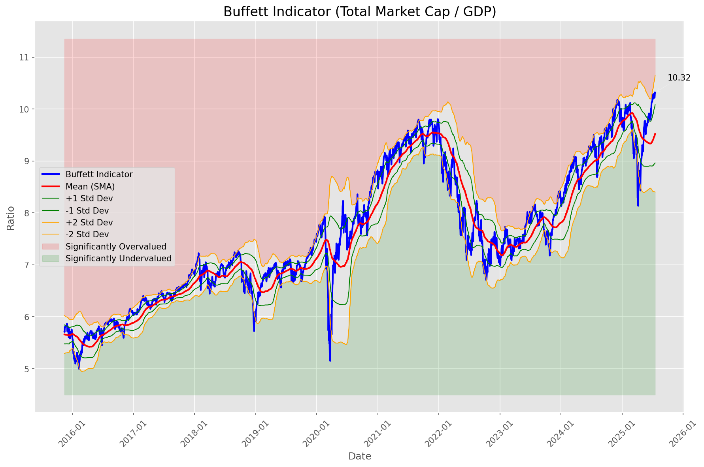
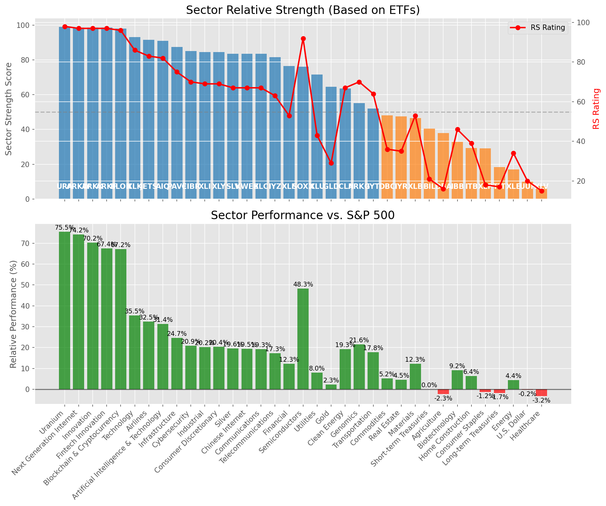

# **Daily Relative Strength Report**

**Date:** 2025-07-22

## **Market Valuation (Buffett Indicator)**

| Metric | Value |
|--------|-------|
| **Market Valuation** | **Overvalued** |
| **Current Ratio** | 10.33 |
| **Historical Mean** | 9.53 |
| **Standard Deviation** | 0.57 |
| **Z-Score (StdDev from Mean)** | 1.40 |
| **Total Market Cap** | $309.48 trillion |
| **GDP** | $29.96 trillion |

## **Market Insights**

### **Market is Overvalued**

The market appears to be trading above historical average valuations. While not at extreme levels, this suggests more modest future returns may be expected. Investors should:

- Focus on companies with reasonable valuations relative to their growth
- Be more selective with new positions
- Look for stocks showing relative strength within their sectors
- Consider trimming positions in extremely overvalued names

Historically, periods of mild overvaluation can persist for extended periods, but returns tend to be below average.

### **Buffett Indicator Overview**

The Buffett Indicator (Total Market Cap / GDP) is a measure of the stock market's valuation relative to the size of the economy. It is named after Warren Buffett, who described it as "probably the best single measure of where valuations stand at any given moment."

- **Values above +2 standard deviations:** Market significantly overvalued
- **Values above +1 standard deviation:** Market overvalued
- **Values between -1 and +1 standard deviations:** Market fairly valued
- **Values below -1 standard deviation:** Market undervalued
- **Values below -2 standard deviations:** Market significantly undervalued

---

## **Sector Relative Strength**

Based on William O'Neil's Relative Strength Methodology

| ETF | Strength | RS Rating | Performance | Above Key MAs | Trend | Sector |
|-----|----------|-----------|-------------|--------------|-------|--------|
| [ARKW](https://www.tradingview.com/chart/?symbol=ARKW) | 98.5 | 97.0 | 74.82% | 10d ✓, 50d ✓, 200d ✓ | ↗️ | Next Generation Internet |
| [URA](https://www.tradingview.com/chart/?symbol=URA) | 98.5 | 97.0 | 77.46% | 10d ✓, 50d ✓, 200d ✓ | ↗️ | Uranium |
| [ARKK](https://www.tradingview.com/chart/?symbol=ARKK) | 98.0 | 96.0 | 70.67% | 10d ✓, 50d ✓, 200d ✓ | ↗️ | Innovation |
| [ARKF](https://www.tradingview.com/chart/?symbol=ARKF) | 98.0 | 96.0 | 67.74% | 10d ✓, 50d ✓, 200d ✓ | ↗️ | Fintech Innovation |
| [BLOK](https://www.tradingview.com/chart/?symbol=BLOK) | 98.0 | 96.0 | 67.74% | 10d ✓, 50d ✓, 200d ✓ | ↗️ | Blockchain & Cryptocurrency |
| [XLK](https://www.tradingview.com/chart/?symbol=XLK) | 92.5 | 85.0 | 37.70% | 10d ✓, 50d ✓, 200d ✓ | ↗️ | Technology |
| [JETS](https://www.tradingview.com/chart/?symbol=JETS) | 92.0 | 84.0 | 36.25% | 10d ✓, 50d ✓, 200d ✓ | ↗️ | Airlines |
| [AIQ](https://www.tradingview.com/chart/?symbol=AIQ) | 90.5 | 81.0 | 32.88% | 10d ✓, 50d ✓, 200d ✓ | ↗️ | Artificial Intelligence & Technology |
| [PAVE](https://www.tradingview.com/chart/?symbol=PAVE) | 88.5 | 77.0 | 28.67% | 10d ✓, 50d ✓, 200d ✓ | ↗️ | Infrastructure |
| [XLY](https://www.tradingview.com/chart/?symbol=XLY) | 85.5 | 71.0 | 24.39% | 10d ✓, 50d ✓, 200d ✓ | ↗️ | Consumer Discretionary |
| [CIBR](https://www.tradingview.com/chart/?symbol=CIBR) | 84.5 | 69.0 | 23.12% | 10d ✓, 50d ✓, 200d ✓ | ↗️ | Cybersecurity |
| [XLI](https://www.tradingview.com/chart/?symbol=XLI) | 84.5 | 69.0 | 23.08% | 10d ✓, 50d ✓, 200d ✓ | ↗️ | Industrial |
| [XLC](https://www.tradingview.com/chart/?symbol=XLC) | 83.5 | 67.0 | 22.16% | 10d ✓, 50d ✓, 200d ✓ | ↗️ | Communications |
| [IYZ](https://www.tradingview.com/chart/?symbol=IYZ) | 81.5 | 63.0 | 19.79% | 10d ✓, 50d ✓, 200d ✓ | ↗️ | Telecommunications |
| [KWEB](https://www.tradingview.com/chart/?symbol=KWEB) | 81.5 | 63.0 | 20.08% | 10d ✓, 50d ✓, 200d ✓ | ↗️ | Chinese Internet |
| [SLV](https://www.tradingview.com/chart/?symbol=SLV) | 81.0 | 62.0 | 19.50% | 10d ✓, 50d ✓, 200d ✓ | ↗️ | Silver |
| [XLF](https://www.tradingview.com/chart/?symbol=XLF) | 77.0 | 54.0 | 15.35% | 10d ✓, 50d ✓, 200d ✓ | ↗️ | Financial |
| [XLU](https://www.tradingview.com/chart/?symbol=XLU) | 73.0 | 46.0 | 11.52% | 10d ✓, 50d ✓, 200d ✓ | ↗️ | Utilities |
| [SOXX](https://www.tradingview.com/chart/?symbol=SOXX) | 65.6 | 91.0 | 48.51% | 10d ✗, 50d ✓, 200d ✓ | ↘️ | Semiconductors |
| [ARKG](https://www.tradingview.com/chart/?symbol=ARKG) | 65.5 | 71.0 | 24.65% | 10d ✓, 50d ✓, 200d ✓ | ↘️ | Genomics |
| [ICLN](https://www.tradingview.com/chart/?symbol=ICLN) | 63.0 | 66.0 | 21.58% | 10d ✓, 50d ✓, 200d ✓ | ↘️ | Clean Energy |
| [IYT](https://www.tradingview.com/chart/?symbol=IYT) | 63.0 | 66.0 | 21.51% | 10d ✓, 50d ✓, 200d ✓ | ↘️ | Transportation |
| [GLD](https://www.tradingview.com/chart/?symbol=GLD) | 58.0 | 16.0 | 0.03% | 10d ✓, 50d ✓, 200d ✓ | ↗️ | Gold |
| [XLB](https://www.tradingview.com/chart/?symbol=XLB) | 56.5 | 53.0 | 15.08% | 10d ✓, 50d ✓, 200d ✓ | ↘️ | Materials |
| [IYR](https://www.tradingview.com/chart/?symbol=IYR) | 48.5 | 37.0 | 7.79% | 10d ✓, 50d ✓, 200d ✓ | ↘️ | Real Estate |
| [ITB](https://www.tradingview.com/chart/?symbol=ITB) | 47.3 | 55.0 | 15.74% | 10d ✓, 50d ✓, 200d ✗ | ↘️ | Home Construction |
| [IBB](https://www.tradingview.com/chart/?symbol=IBB) | 43.8 | 48.0 | 12.75% | 10d ✓, 50d ✓, 200d ✗ | ↘️ | Biotechnology |
| [XLP](https://www.tradingview.com/chart/?symbol=XLP) | 39.0 | 18.0 | 0.39% | 10d ✓, 50d ✓, 200d ✓ | ↘️ | Consumer Staples |
| [BIL](https://www.tradingview.com/chart/?symbol=BIL) | 38.0 | 16.0 | 0.02% | 10d ✓, 50d ✓, 200d ✓ | ↘️ | Short-term Treasuries |
| [DBC](https://www.tradingview.com/chart/?symbol=DBC) | 36.6 | 33.0 | 5.62% | 10d ✗, 50d ✓, 200d ✓ | ↘️ | Commodities |
| [DBA](https://www.tradingview.com/chart/?symbol=DBA) | 35.9 | 12.0 | -2.44% | 10d ✓, 50d ✗, 200d ✗ | ↗️ | Agriculture |
| [TLT](https://www.tradingview.com/chart/?symbol=TLT) | 29.8 | 20.0 | 0.76% | 10d ✓, 50d ✓, 200d ✗ | ↘️ | Long-term Treasuries |
| [XLE](https://www.tradingview.com/chart/?symbol=XLE) | 28.4 | 37.0 | 7.64% | 10d ✗, 50d ✓, 200d ✗ | ↘️ | Energy |
| [XLV](https://www.tradingview.com/chart/?symbol=XLV) | 9.0 | 18.0 | 0.35% | 10d ✗, 50d ✗, 200d ✗ | ↘️ | Healthcare |
| [UUP](https://www.tradingview.com/chart/?symbol=UUP) | 9.0 | 18.0 | 0.24% | 10d ✗, 50d ✗, 200d ✗ | ↘️ | U.S. Dollar |

### **Sector ETF Performance Interpretation**

This table shows the relative strength metrics for different market sectors based on their representative ETFs:

- **ETF**: The ETF used to measure sector performance (click for chart)
- **Strength**: Overall sector strength score (0-100) combining multiple factors
- **RS Rating**: O'Neil RS rating of the sector ETF
- **Performance**: Performance of the sector ETF relative to SPY
- **Above Key MAs**: Whether the ETF is trading above its 10, 50, and 200-day moving averages
- **Trend**: Whether the sector is in an uptrend (↗️) or downtrend (↘️)

### **Current Sector Leadership**

The current market leadership is coming from the following sectors: **Next Generation Internet, Uranium, Innovation**.

The **Next Generation Internet** sector (represented by **ARKW**) is showing particularly strong relative strength with an RS rating of 97.0 and performance of 74.82% vs. the S&P 500. This sector is trading above its 10-day, 50-day, 200-day moving average(s). Investors should consider focusing on high RS stocks within these leading sectors for potential outperformance.

---

## **Buy Recommendations**

The following 28 stocks show exceptional relative strength:

| RS Rating | Buy Score | Current Price | Chart | Name | Ticker |
|-----------|-----------|---------------|-------|------|--------|
| 100 | 100 | $58.66 | [Chart](https://www.tradingview.com/chart/?symbol=MP) | MP Materials Corp. | MP |
| 100 | 100 | $102.33 | [Chart](https://www.tradingview.com/chart/?symbol=HOOD) | Robinhood Markets, Inc. Class A Common Stock | HOOD |
| 99 | 100 | $73.45 | [Chart](https://www.tradingview.com/chart/?symbol=LIF) | Life360, Inc. Common Stock | LIF |
| 99 | 100 | $162.72 | [Chart](https://www.tradingview.com/chart/?symbol=FUTU) | Futu Holdings Limited American Depositary Shares | FUTU |
| 99 | 100 | $120.68 | [Chart](https://www.tradingview.com/chart/?symbol=RBLX) | Roblox Corporation | RBLX |
| 97 | 100 | $104.94 | [Chart](https://www.tradingview.com/chart/?symbol=VRNA) | Verona Pharma plc | VRNA |
| 97 | 100 | $21.23 | [Chart](https://www.tradingview.com/chart/?symbol=TME) | Tencent Music Entertainment Group American Depositary Shares, each representing two Class A Ordinary Shares | TME |
| 97 | 100 | $43.99 | [Chart](https://www.tradingview.com/chart/?symbol=FARO) | Faro Technologies Inc | FARO |
| 97 | 100 | $156.85 | [Chart](https://www.tradingview.com/chart/?symbol=ARKW) | ARK Next Generation Internet ETF | ARKW |
| 96 | 100 | $105.65 | [Chart](https://www.tradingview.com/chart/?symbol=TPR) | Tapestry, Inc. Common Stock | TPR |
| 96 | 100 | $53.61 | [Chart](https://www.tradingview.com/chart/?symbol=ARKF) | ARK Fintech Innovation ETF | ARKF |
| 96 | 100 | $54.56 | [Chart](https://www.tradingview.com/chart/?symbol=KTOS) | Kratos Defense & Security Solutions, Inc. | KTOS |
| 95 | 100 | $311.43 | [Chart](https://www.tradingview.com/chart/?symbol=TLN) | Talen Energy Corporation Common Stock | TLN |
| 95 | 100 | $61.91 | [Chart](https://www.tradingview.com/chart/?symbol=IBKR) | Interactive Brokers Group, Inc. Class A Common Stock | IBKR |
| 94 | 100 | $21.25 | [Chart](https://www.tradingview.com/chart/?symbol=MIR) | Mirion Technologies, Inc. | MIR |
| 94 | 100 | $169.00 | [Chart](https://www.tradingview.com/chart/?symbol=COOP) | Mr. Cooper Group Inc. Common Stock | COOP |
| 93 | 100 | $36.18 | [Chart](https://www.tradingview.com/chart/?symbol=ATAT) | Atour Lifestyle Holdings Limited American Depositary Shares | ATAT |
| 92 | 100 | $94.24 | [Chart](https://www.tradingview.com/chart/?symbol=C) | Citigroup Inc. | C |
| 92 | 100 | $57.30 | [Chart](https://www.tradingview.com/chart/?symbol=VIK) | Viking Holdings Ltd | VIK |
| 87 | 100 | $239.32 | [Chart](https://www.tradingview.com/chart/?symbol=DASH) | DoorDash, Inc. Class A Common Stock | DASH |
| 89 | 99 | $22.20 | [Chart](https://www.tradingview.com/chart/?symbol=MAG) | MAG Silver Corp. | MAG |
| 89 | 99 | $54.03 | [Chart](https://www.tradingview.com/chart/?symbol=BBW) | Build-A-Bear Workshop, Inc. | BBW |
| 88 | 98 | $33.00 | [Chart](https://www.tradingview.com/chart/?symbol=BRRR) | Coinshares Bitcoin ETF Common Shares of Beneficial Interest | BRRR |
| 85 | 96 | $287.00 | [Chart](https://www.tradingview.com/chart/?symbol=VEEV) | Veeva Systems Inc. | VEEV |
| 84 | 96 | $78.08 | [Chart](https://www.tradingview.com/chart/?symbol=TPB) | Turning Point Brands, Inc. | TPB |
| 84 | 95 | $52.58 | [Chart](https://www.tradingview.com/chart/?symbol=BTC) | Grayscale Bitcoin Mini Trust ETF | BTC |
| 82 | 94 | $65.61 | [Chart](https://www.tradingview.com/chart/?symbol=CAKE) | Cheesecake Factory (The) | CAKE |
| 80 | 90 | $47.87 | [Chart](https://www.tradingview.com/chart/?symbol=FHI) | Federated Hermes, Inc. | FHI |

---

## **Sell Recommendations**

The following 162 stocks show deteriorating relative strength:

| RS Rating | Sell Score | Current Price | Chart | Name | Ticker |
|-----------|------------|---------------|-------|------|--------|
| 1 | 100 | $16.22 | [Chart](https://www.tradingview.com/chart/?symbol=SDS) | ProShares UltraShort S&P500 | SDS |
| 1 | 100 | $10.09 | [Chart](https://www.tradingview.com/chart/?symbol=HIBS) | Direxion Daily S&P 500 High Beta Bear 3X Shares | HIBS |
| 1 | 100 | $25.21 | [Chart](https://www.tradingview.com/chart/?symbol=TECS) | Direxion Daily Technology Bear 3x Shares | TECS |
| 1 | 100 | $13.13 | [Chart](https://www.tradingview.com/chart/?symbol=NVDS) | Investment Managers Series Trust II Tradr 1.5X Short NVDA Daily ETF | NVDS |
| 1 | 100 | $24.63 | [Chart](https://www.tradingview.com/chart/?symbol=QID) | ProShares UltraShort QQQ | QID |
| 1 | 100 | $40.72 | [Chart](https://www.tradingview.com/chart/?symbol=SDOW) | ProShares UltraPro Short Dow 30 | SDOW |
| 1 | 100 | $10.79 | [Chart](https://www.tradingview.com/chart/?symbol=TZA) | Direxion Daily Small Cap Bear 3x Shares | TZA |
| 1 | 100 | $16.77 | [Chart](https://www.tradingview.com/chart/?symbol=UVXY) | ProShares Ultra VIX Short-Term Futures ETF | UVXY |
| 2 | 100 | $23.26 | [Chart](https://www.tradingview.com/chart/?symbol=VCYT) | Veracyte, Inc. | VCYT |
| 2 | 100 | $33.25 | [Chart](https://www.tradingview.com/chart/?symbol=PSQ) | ProShares Short QQQ | PSQ |
| 2 | 100 | $23.99 | [Chart](https://www.tradingview.com/chart/?symbol=DXD) | ProShares UltraShort Dow 30 | DXD |
| 2 | 100 | $11.84 | [Chart](https://www.tradingview.com/chart/?symbol=IART) | Integra LifeSciences Holdings | IART |
| 2 | 100 | $16.48 | [Chart](https://www.tradingview.com/chart/?symbol=CSTL) | Castle Biosciences, Inc. Common Stock | CSTL |
| 3 | 100 | $10.46 | [Chart](https://www.tradingview.com/chart/?symbol=GDYN) | Grid Dynamics Holdings, Inc. Class A Common Stock | GDYN |
| 3 | 100 | $39.20 | [Chart](https://www.tradingview.com/chart/?symbol=SH) | ProShares Short S&P500 | SH |
| 3 | 100 | $10.18 | [Chart](https://www.tradingview.com/chart/?symbol=SPDN) | Direxion Daily S&P 500 Bear 1X Shares | SPDN |
| 3 | 100 | $10.13 | [Chart](https://www.tradingview.com/chart/?symbol=WNC) | Wabash National Corp. | WNC |
| 3 | 100 | $10.67 | [Chart](https://www.tradingview.com/chart/?symbol=OFIX) | Orthofix Medical Inc. Common Stock (DE) | OFIX |
| 3 | 100 | $16.93 | [Chart](https://www.tradingview.com/chart/?symbol=BTAL) | AGF U.S. Market Neutral Anti-Beta Fund | BTAL |
| 3 | 100 | $11.23 | [Chart](https://www.tradingview.com/chart/?symbol=NRIX) | Nurix Therapeutics, Inc. Common stock | NRIX |
| 3 | 100 | $43.42 | [Chart](https://www.tradingview.com/chart/?symbol=LINE) | Lineage, Inc. Common Stock | LINE |
| 3 | 100 | $23.40 | [Chart](https://www.tradingview.com/chart/?symbol=CRTO) | Criteo S.A. | CRTO |
| 3 | 100 | $66.72 | [Chart](https://www.tradingview.com/chart/?symbol=SKY) | Champion Homes, Inc. | SKY |
| 4 | 100 | $25.39 | [Chart](https://www.tradingview.com/chart/?symbol=DOG) | ProShares Short Dow30 | DOG |
| 4 | 100 | $16.82 | [Chart](https://www.tradingview.com/chart/?symbol=COLD) | Americold Realty Trust, Inc. | COLD |
| 4 | 100 | $95.50 | [Chart](https://www.tradingview.com/chart/?symbol=ONTO) | Onto Innovation Inc. | ONTO |
| 4 | 100 | $52.29 | [Chart](https://www.tradingview.com/chart/?symbol=AMWD) | American Woodmark Corp | AMWD |
| 5 | 100 | $51.35 | [Chart](https://www.tradingview.com/chart/?symbol=TAP) | Molson Coors Beverage Company Class B | TAP |
| 5 | 100 | $54.18 | [Chart](https://www.tradingview.com/chart/?symbol=TSN) | Tyson Foods, Inc. | TSN |
| 5 | 100 | $10.18 | [Chart](https://www.tradingview.com/chart/?symbol=IMXI) | International Money Express, Inc. | IMXI |
| 5 | 100 | $121.66 | [Chart](https://www.tradingview.com/chart/?symbol=ICUI) | ICU Medical Inc | ICUI |
| 5 | 100 | $113.27 | [Chart](https://www.tradingview.com/chart/?symbol=TFX) | Teleflex Incorporated | TFX |
| 5 | 100 | $128.50 | [Chart](https://www.tradingview.com/chart/?symbol=INSP) | Inspire Medical Systems, Inc. | INSP |
| 6 | 100 | $22.65 | [Chart](https://www.tradingview.com/chart/?symbol=ERY) | Direxion Daily Energy Bear 2X Shares | ERY |
| 6 | 100 | $31.90 | [Chart](https://www.tradingview.com/chart/?symbol=NSA) | National Storage Affiliates Trust | NSA |
| 6 | 100 | $45.65 | [Chart](https://www.tradingview.com/chart/?symbol=ACIW) | ACI Worldwide, Inc. | ACIW |
| 6 | 100 | $21.42 | [Chart](https://www.tradingview.com/chart/?symbol=AMPH) | Amphastar Pharmaceuticals, Inc. | AMPH |
| 7 | 100 | $35.15 | [Chart](https://www.tradingview.com/chart/?symbol=VERX) | Vertex, Inc. Class A Common Stock | VERX |
| 7 | 100 | $10.24 | [Chart](https://www.tradingview.com/chart/?symbol=LBTYA) | Liberty Global Ltd. Class A Common Shares | LBTYA |
| 7 | 100 | $20.73 | [Chart](https://www.tradingview.com/chart/?symbol=THS) | Treehouse Foods, Inc. | THS |
| 8 | 100 | $37.45 | [Chart](https://www.tradingview.com/chart/?symbol=KSA) | iShares MSCI Saudi Arabia ETF | KSA |
| 8 | 100 | $14.53 | [Chart](https://www.tradingview.com/chart/?symbol=VRE) | Veris Residential, Inc. | VRE |
| 8 | 100 | $15.40 | [Chart](https://www.tradingview.com/chart/?symbol=TNDM) | Tandem Diabetes Care, Inc. | TNDM |
| 8 | 100 | $26.95 | [Chart](https://www.tradingview.com/chart/?symbol=GTY) | Getty Realty Corp. | GTY |
| 8 | 100 | $14.47 | [Chart](https://www.tradingview.com/chart/?symbol=SEM) | SELECT MEDICAL HOLDINGS CORP | SEM |
| 8 | 100 | $88.16 | [Chart](https://www.tradingview.com/chart/?symbol=CL) | Colgate-Palmolive Company | CL |
| 9 | 100 | $60.40 | [Chart](https://www.tradingview.com/chart/?symbol=UL) | Unilever plc | UL |
| 9 | 100 | $48.92 | [Chart](https://www.tradingview.com/chart/?symbol=LW) | Lamb Weston Holdings, Inc. | LW |
| 9 | 100 | $10.58 | [Chart](https://www.tradingview.com/chart/?symbol=NMFC) | NEW MOUNTAIN FINANCE CORPORATION | NMFC |
| 9 | 100 | $209.99 | [Chart](https://www.tradingview.com/chart/?symbol=MKTX) | MarketAxess Holdings Inc. | MKTX |
| 10 | 100 | $75.03 | [Chart](https://www.tradingview.com/chart/?symbol=CBT) | Cabot Corporation | CBT |
| 10 | 100 | $28.45 | [Chart](https://www.tradingview.com/chart/?symbol=OMCL) | Omnicell Inc | OMCL |
| 10 | 100 | $86.90 | [Chart](https://www.tradingview.com/chart/?symbol=BCC) | Boise Cascade Company | BCC |
| 11 | 100 | $27.60 | [Chart](https://www.tradingview.com/chart/?symbol=BAX) | Baxter International Inc. | BAX |
| 12 | 100 | $64.48 | [Chart](https://www.tradingview.com/chart/?symbol=ZROZ) | PIMCO 25+ Year Zero Coupon U.S. Treasury Index Exchange-Traded Fund | ZROZ |
| 13 | 100 | $336.87 | [Chart](https://www.tradingview.com/chart/?symbol=EG) | Everest Group, Ltd. | EG |
| 14 | 100 | $10.07 | [Chart](https://www.tradingview.com/chart/?symbol=NMZ) | Nuveen Municipal High Income Opportunity Fund | NMZ |
| 18 | 100 | $14.13 | [Chart](https://www.tradingview.com/chart/?symbol=OCSL) | Oaktree Specialty Lending Corporation | OCSL |
| 7 | 99 | $300.61 | [Chart](https://www.tradingview.com/chart/?symbol=CI) | The Cigna Group | CI |
| 11 | 99 | $10.21 | [Chart](https://www.tradingview.com/chart/?symbol=MYI) | BLACKROCK MUNIYIELD QUALITY FUND III, INC. | MYI |
| 7 | 98 | $10.15 | [Chart](https://www.tradingview.com/chart/?symbol=SD) | SandRidge Energy, Inc. | SD |
| 8 | 98 | $12.47 | [Chart](https://www.tradingview.com/chart/?symbol=WSR) | Whitestone REIT | WSR |
| 8 | 98 | $55.59 | [Chart](https://www.tradingview.com/chart/?symbol=HRB) | H&R Block, Inc. | HRB |
| 9 | 98 | $157.06 | [Chart](https://www.tradingview.com/chart/?symbol=PG) | Procter & Gamble Company | PG |
| 9 | 98 | $47.14 | [Chart](https://www.tradingview.com/chart/?symbol=VVX) | V2X, Inc. | VVX |
| 12 | 98 | $14.35 | [Chart](https://www.tradingview.com/chart/?symbol=INMD) | InMode Ltd. Ordinary Shares | INMD |
| 5 | 97 | $14.97 | [Chart](https://www.tradingview.com/chart/?symbol=PLSE) | Pulse Biosciences, Inc Common Stock (DE) | PLSE |
| 9 | 97 | $26.77 | [Chart](https://www.tradingview.com/chart/?symbol=FCPT) | Four Corners Property Trust, Inc. | FCPT |
| 10 | 97 | $75.64 | [Chart](https://www.tradingview.com/chart/?symbol=BG) | Bunge Global SA | BG |
| 11 | 97 | $71.95 | [Chart](https://www.tradingview.com/chart/?symbol=MKC) | McCormick & Company, Incorporated Non-VTG CS | MKC |
| 13 | 97 | $37.02 | [Chart](https://www.tradingview.com/chart/?symbol=PBA) | PEMBINA PIPELINE CORPORATION | PBA |
| 6 | 96 | $127.89 | [Chart](https://www.tradingview.com/chart/?symbol=KMB) | Kimberly-Clark Corp. | KMB |
| 7 | 96 | $17.41 | [Chart](https://www.tradingview.com/chart/?symbol=IRT) | Independence Realty Trust Inc. | IRT |
| 9 | 96 | $37.52 | [Chart](https://www.tradingview.com/chart/?symbol=VNOM) | Viper Energy, Inc. Class A Common Stock | VNOM |
| 10 | 96 | $48.54 | [Chart](https://www.tradingview.com/chart/?symbol=SNY) | Sanofi American Depositary Shares (Each representing one-half of one ordinary share) | SNY |
| 12 | 96 | $32.45 | [Chart](https://www.tradingview.com/chart/?symbol=INVH) | Invitation Homes Inc. Common Stock | INVH |
| 13 | 96 | $61.78 | [Chart](https://www.tradingview.com/chart/?symbol=COLM) | Columbia Sportswear Co | COLM |
| 15 | 95 | $13.39 | [Chart](https://www.tradingview.com/chart/?symbol=EWTX) | Edgewise Therapeutics, Inc. Common Stock | EWTX |
| 16 | 95 | $73.19 | [Chart](https://www.tradingview.com/chart/?symbol=FRPT) | Freshpet, Inc. | FRPT |
| 19 | 95 | $67.89 | [Chart](https://www.tradingview.com/chart/?symbol=EQR) | Equity Residential | EQR |
| 10 | 94 | $31.36 | [Chart](https://www.tradingview.com/chart/?symbol=FUN) | Six Flags Entertainment Corporation | FUN |
| 15 | 94 | $22.68 | [Chart](https://www.tradingview.com/chart/?symbol=TLTW) | iShares 20+ Year Treasury Bond BuyWrite Strategy ETF | TLTW |
| 7 | 93 | $38.11 | [Chart](https://www.tradingview.com/chart/?symbol=LKQ) | LKQ Corporation | LKQ |
| 13 | 93 | $152.33 | [Chart](https://www.tradingview.com/chart/?symbol=MAA) | Mid-America Apartment Communities, Inc. | MAA |
| 14 | 93 | $16.31 | [Chart](https://www.tradingview.com/chart/?symbol=MLNK) | MeridianLink, Inc. | MLNK |
| 15 | 93 | $24.28 | [Chart](https://www.tradingview.com/chart/?symbol=HYMB) | SPDR Nuveen ICE High Yield Municipal Bond ETF | HYMB |
| 18 | 93 | $15.82 | [Chart](https://www.tradingview.com/chart/?symbol=PRO) | Pros Holdings, Inc. | PRO |
| 19 | 93 | $203.24 | [Chart](https://www.tradingview.com/chart/?symbol=AVB) | AvalonBay Communities, Inc. | AVB |
| 19 | 93 | $11.09 | [Chart](https://www.tradingview.com/chart/?symbol=NAD) | Nuveen Quality Municipal Income Fund | NAD |
| 20 | 93 | $19.04 | [Chart](https://www.tradingview.com/chart/?symbol=SPT) | Sprout Social, Inc Class A Common Stock | SPT |
| 17 | 92 | $70.87 | [Chart](https://www.tradingview.com/chart/?symbol=REG) | Regency Centers Corporation | REG |
| 17 | 92 | $25.05 | [Chart](https://www.tradingview.com/chart/?symbol=VRIG) | Invesco Variable Rate Investment Grade ETF | VRIG |
| 20 | 92 | $114.36 | [Chart](https://www.tradingview.com/chart/?symbol=BFAM) | BRIGHT HORIZONS FAMILY SOLUTIONS INC. | BFAM |
| 22 | 92 | $11.56 | [Chart](https://www.tradingview.com/chart/?symbol=NZF) | Nuveen Municipal Credit Income Fund | NZF |
| 12 | 91 | $102.06 | [Chart](https://www.tradingview.com/chart/?symbol=AFL) | Aflac Inc. | AFL |
| 13 | 91 | $12.63 | [Chart](https://www.tradingview.com/chart/?symbol=PMT) | PennyMac Mortgage Investment Trust | PMT |
| 14 | 91 | $34.86 | [Chart](https://www.tradingview.com/chart/?symbol=PECO) | Phillips Edison & Company, Inc. Common Stock | PECO |
| 17 | 91 | $287.86 | [Chart](https://www.tradingview.com/chart/?symbol=PSA) | Public Storage | PSA |
| 19 | 91 | $55.30 | [Chart](https://www.tradingview.com/chart/?symbol=CMF) | iShares California Muni Bond ETF | CMF |
| 21 | 91 | $10.78 | [Chart](https://www.tradingview.com/chart/?symbol=MQY) | Blackrock Muni Yield Quality Fund, Inc | MQY |
| 12 | 90 | $77.58 | [Chart](https://www.tradingview.com/chart/?symbol=OTTR) | Otter Tail Corp | OTTR |
| 13 | 90 | $80.25 | [Chart](https://www.tradingview.com/chart/?symbol=OKE) | Oneok, Inc. | OKE |
| 18 | 90 | $133.03 | [Chart](https://www.tradingview.com/chart/?symbol=XLV) | Health Care Select Sector SPDR Fund | XLV |
| 18 | 90 | $10.80 | [Chart](https://www.tradingview.com/chart/?symbol=ACIC) | American Coastal Insurance Corporation Common Stock | ACIC |
| 19 | 90 | $36.64 | [Chart](https://www.tradingview.com/chart/?symbol=AMH) | AMERICAN HOMES 4 RENT | AMH |
| 19 | 90 | $44.30 | [Chart](https://www.tradingview.com/chart/?symbol=TFI) | SPDR Nuveen ICE Municipal Bond ETF | TFI |
| 20 | 90 | $10.65 | [Chart](https://www.tradingview.com/chart/?symbol=NEA) | Nuveen AMT-Free Quality Municipal Income Fund | NEA |
| 11 | 89 | $30.80 | [Chart](https://www.tradingview.com/chart/?symbol=EPRT) | Essential Properties Realty Trust, Inc. | EPRT |
| 12 | 89 | $17.75 | [Chart](https://www.tradingview.com/chart/?symbol=FLGT) | Fulgent Genetics, Inc. Common Stock | FLGT |
| 16 | 89 | $23.05 | [Chart](https://www.tradingview.com/chart/?symbol=BSJP) | Invesco BulletShares 2025 High Yield Corporate Bond ETF | BSJP |
| 23 | 89 | $11.55 | [Chart](https://www.tradingview.com/chart/?symbol=NVG) | Nuveen AMT-Free Municipal Credit Income Fund | NVG |
| 15 | 88 | $19.74 | [Chart](https://www.tradingview.com/chart/?symbol=CON) | Concentra Group Holdings Parent, Inc. | CON |
| 18 | 88 | $50.09 | [Chart](https://www.tradingview.com/chart/?symbol=GSY) | Invesco Ultra Short Duration ETF | GSY |
| 19 | 88 | $12.56 | [Chart](https://www.tradingview.com/chart/?symbol=PCN) | PIMCO Corporate & Income Strategy Fund | PCN |
| 21 | 88 | $15.96 | [Chart](https://www.tradingview.com/chart/?symbol=CHCT) | Community Healthcare Trust Incorporated Common Stock, $0.01 par value per share | CHCT |
| 28 | 87 | $15.20 | [Chart](https://www.tradingview.com/chart/?symbol=SAFE) | Safehold Inc. | SAFE |
| 29 | 87 | $29.50 | [Chart](https://www.tradingview.com/chart/?symbol=CIVI) | Civitas Resources, Inc. | CIVI |
| 29 | 87 | $22.81 | [Chart](https://www.tradingview.com/chart/?symbol=RPD) | Rapid7, Inc. Common Stock | RPD |
| 22 | 86 | $15.17 | [Chart](https://www.tradingview.com/chart/?symbol=BCSF) | Bain Capital Specialty Finance, Inc. | BCSF |
| 27 | 86 | $10.96 | [Chart](https://www.tradingview.com/chart/?symbol=NAC) | Nuveen California Quality Municipal Income Fund | NAC |
| 21 | 85 | $45.92 | [Chart](https://www.tradingview.com/chart/?symbol=FTSL) | First Trust Senior Loan Fund ETF | FTSL |
| 22 | 85 | $11.38 | [Chart](https://www.tradingview.com/chart/?symbol=NFBK) | Northfield Bancorp, Inc. | NFBK |
| 24 | 85 | $78.48 | [Chart](https://www.tradingview.com/chart/?symbol=EMN) | Eastman Chemical Company | EMN |
| 28 | 84 | $114.81 | [Chart](https://www.tradingview.com/chart/?symbol=CPT) | Camden Property Trust | CPT |
| 24 | 82 | $67.17 | [Chart](https://www.tradingview.com/chart/?symbol=WK) | Workiva Inc. | WK |
| 28 | 82 | $162.89 | [Chart](https://www.tradingview.com/chart/?symbol=UHS) | Universal Health Services, Inc. Class B | UHS |
| 31 | 82 | $14.73 | [Chart](https://www.tradingview.com/chart/?symbol=RYLD) | Global X Russell 2000 Covered Call ETF | RYLD |
| 27 | 81 | $46.52 | [Chart](https://www.tradingview.com/chart/?symbol=EPI) | WisdomTree India Earnings Fund ETF | EPI |
| 35 | 81 | $23.94 | [Chart](https://www.tradingview.com/chart/?symbol=EWM) | iShares MSCI Malaysia ETF | EWM |
| 35 | 81 | $103.58 | [Chart](https://www.tradingview.com/chart/?symbol=PRU) | Prudential Financial, Inc. | PRU |
| 36 | 81 | $47.60 | [Chart](https://www.tradingview.com/chart/?symbol=EDU) | New Oriental Education and Technology Group, Inc. American Depositary Shares (each representing ten (10) Common Shares) | EDU |
| 24 | 80 | $56.98 | [Chart](https://www.tradingview.com/chart/?symbol=TRNO) | Terreno Realty Corporation | TRNO |
| 26 | 80 | $31.79 | [Chart](https://www.tradingview.com/chart/?symbol=ZD) | Ziff Davis, Inc. Common Stock | ZD |
| 30 | 80 | $297.48 | [Chart](https://www.tradingview.com/chart/?symbol=UTHR) | United Therapeutics Corp | UTHR |
| 23 | 79 | $38.43 | [Chart](https://www.tradingview.com/chart/?symbol=LZB) | La-Z-Boy Incorporated | LZB |
| 30 | 79 | $14.69 | [Chart](https://www.tradingview.com/chart/?symbol=DXC) | DXC Technology Company | DXC |
| 31 | 79 | $70.27 | [Chart](https://www.tradingview.com/chart/?symbol=AZN) | AstraZeneca PLC | AZN |
| 32 | 78 | $11.27 | [Chart](https://www.tradingview.com/chart/?symbol=PBR.A) | Petroleo Brasileiro S.A.-Petrobras | PBR.A |
| 32 | 77 | $71.02 | [Chart](https://www.tradingview.com/chart/?symbol=MMS) | MAXIMUS, Inc. | MMS |
| 27 | 76 | $333.23 | [Chart](https://www.tradingview.com/chart/?symbol=SHW) | The Sherwin-Williams Company | SHW |
| 32 | 76 | $14.40 | [Chart](https://www.tradingview.com/chart/?symbol=RDY) | Dr. Reddy's Laboratories Limited American Depositary Shares | RDY |
| 34 | 76 | $25.23 | [Chart](https://www.tradingview.com/chart/?symbol=HPQ) | HP Inc. | HPQ |
| 38 | 76 | $195.80 | [Chart](https://www.tradingview.com/chart/?symbol=RGA) | Reinsurance Group of America, Incorporated | RGA |
| 38 | 76 | $88.89 | [Chart](https://www.tradingview.com/chart/?symbol=LPX) | Louisiana-Pacific Corp. | LPX |
| 27 | 75 | $16.12 | [Chart](https://www.tradingview.com/chart/?symbol=NVCR) | NovoCure Limited Ordinary Shares | NVCR |
| 31 | 75 | $25.92 | [Chart](https://www.tradingview.com/chart/?symbol=WY) | Weyerhaeuser Company | WY |
| 26 | 74 | $795.21 | [Chart](https://www.tradingview.com/chart/?symbol=EQIX) | Equinix, Inc. Common Stock REIT | EQIX |
| 31 | 74 | $215.92 | [Chart](https://www.tradingview.com/chart/?symbol=WST) | West Pharmaceutical Services, Inc. | WST |
| 32 | 74 | $154.20 | [Chart](https://www.tradingview.com/chart/?symbol=WIX) | WIX.com Ltd. | WIX |
| 34 | 74 | $107.40 | [Chart](https://www.tradingview.com/chart/?symbol=ADUS) | Addus HomeCare Corp. | ADUS |
| 36 | 74 | $88.59 | [Chart](https://www.tradingview.com/chart/?symbol=ENS) | EnerSys, Inc. | ENS |
| 36 | 74 | $158.30 | [Chart](https://www.tradingview.com/chart/?symbol=SSD) | Simpson Manufacturing Co., Inc. | SSD |
| 35 | 71 | $13.03 | [Chart](https://www.tradingview.com/chart/?symbol=TFSL) | TFS Financial Corporation | TFSL |
| 37 | 71 | $30.84 | [Chart](https://www.tradingview.com/chart/?symbol=CNQ) | Canadian Natural Resources Limited | CNQ |
| 39 | 71 | $126.67 | [Chart](https://www.tradingview.com/chart/?symbol=BIIB) | Biogen Inc. Common Stock | BIIB |
| 30 | 70 | $11.37 | [Chart](https://www.tradingview.com/chart/?symbol=PTLO) | Portillo's Inc. Class A Common Stock | PTLO |
| 38 | 70 | $41.45 | [Chart](https://www.tradingview.com/chart/?symbol=CUBE) | CubeSmart | CUBE |
| 36 | 68 | $56.28 | [Chart](https://www.tradingview.com/chart/?symbol=CBU) | Community Financial System, Inc. | CBU |
| 37 | 67 | $25.22 | [Chart](https://www.tradingview.com/chart/?symbol=ILF) | iShares Latin America 40 ETF | ILF |
| 39 | 67 | $33.42 | [Chart](https://www.tradingview.com/chart/?symbol=AVNT) | Avient Corporation | AVNT |
| 37 | 66 | $28.45 | [Chart](https://www.tradingview.com/chart/?symbol=CUZ) | Cousins Properties Inc. | CUZ |
| 37 | 63 | $27.16 | [Chart](https://www.tradingview.com/chart/?symbol=EWZ) | iShares MSCI Brazil ETF | EWZ |

## **Methodology**

This report uses William O'Neil's relative strength methodology from Investors Business Daily:

* **RS Rating**: Percentile rank of stock's performance vs. S&P 500 over the past 63 trading days (1-99 scale)
* **Buy Criteria**: RS Rating >= 80, price above 50-day MA, strong uptrend, increasing volume
* **Sell Criteria**: RS Rating < 40, price below 50-day MA, downtrend, decreasing volume

### **O'Neil's Key Principles**

1. **Focus on relative performance** - stocks outperforming the market
2. **Price trend confirmation** - stock must be in an uptrend
3. **Volume confirmation** - strong volume supports price moves
4. **Moving average validation** - price above key moving averages
5. **Market leaders only** - concentrate on top-performing stocks

*Report generated automatically after market close*