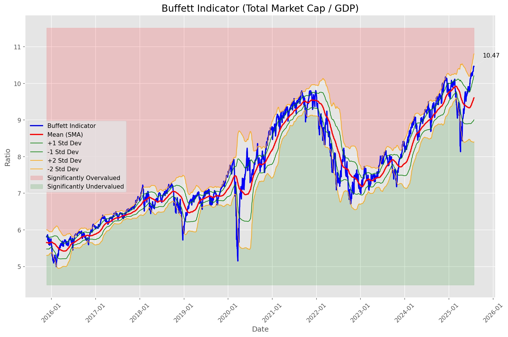

# **Daily Relative Strength Report**

**Date:** 2025-07-29

## **Market Valuation (Buffett Indicator)**

| Metric | Value |
|--------|-------|
| **Market Valuation** | **Overvalued** |
| **Current Ratio** | 10.44 |
| **Historical Mean** | 9.61 |
| **Standard Deviation** | 0.60 |
| **Z-Score (StdDev from Mean)** | 1.43 |
| **Total Market Cap** | $312.74 trillion |
| **GDP** | $29.96 trillion |

## **Market Insights**

### **Market is Overvalued**

The market appears to be trading above historical average valuations. While not at extreme levels, this suggests more modest future returns may be expected. Investors should:

- Focus on companies with reasonable valuations relative to their growth
- Be more selective with new positions
- Look for stocks showing relative strength within their sectors
- Consider trimming positions in extremely overvalued names

Historically, periods of mild overvaluation can persist for extended periods, but returns tend to be below average.

### **Buffett Indicator Overview**

The Buffett Indicator (Total Market Cap / GDP) is a measure of the stock market's valuation relative to the size of the economy. It is named after Warren Buffett, who described it as "probably the best single measure of where valuations stand at any given moment."

- **Values above +2 standard deviations:** Market significantly overvalued
- **Values above +1 standard deviation:** Market overvalued
- **Values between -1 and +1 standard deviations:** Market fairly valued
- **Values below -1 standard deviation:** Market undervalued
- **Values below -2 standard deviations:** Market significantly undervalued

---

## **Sector Relative Strength**

Based on William O'Neil's Relative Strength Methodology

| ETF | Strength | RS Rating | Performance | Above Key MAs | Trend | Sector |
|-----|----------|-----------|-------------|--------------|-------|--------|
| [XLK](https://www.tradingview.com/chart/?symbol=XLK) | 91.5 | 83.0 | 27.06% | 10d ✓, 50d ✓, 200d ✓ | ↗️ | Technology |
| [PAVE](https://www.tradingview.com/chart/?symbol=PAVE) | 89.0 | 78.0 | 22.29% | 10d ✓, 50d ✓, 200d ✓ | ↗️ | Infrastructure |
| [URA](https://www.tradingview.com/chart/?symbol=URA) | 88.6 | 97.0 | 62.00% | 10d ✗, 50d ✓, 200d ✓ | ↗️ | Uranium |
| [AIQ](https://www.tradingview.com/chart/?symbol=AIQ) | 88.5 | 77.0 | 22.15% | 10d ✓, 50d ✓, 200d ✓ | ↗️ | Artificial Intelligence & Technology |
| [ARKW](https://www.tradingview.com/chart/?symbol=ARKW) | 87.6 | 95.0 | 51.34% | 10d ✗, 50d ✓, 200d ✓ | ↗️ | Next Generation Internet |
| [BLOK](https://www.tradingview.com/chart/?symbol=BLOK) | 87.6 | 95.0 | 49.29% | 10d ✗, 50d ✓, 200d ✓ | ↗️ | Blockchain & Cryptocurrency |
| [ARKK](https://www.tradingview.com/chart/?symbol=ARKK) | 87.1 | 94.0 | 46.54% | 10d ✗, 50d ✓, 200d ✓ | ↗️ | Innovation |
| [ARKF](https://www.tradingview.com/chart/?symbol=ARKF) | 87.1 | 94.0 | 47.55% | 10d ✗, 50d ✓, 200d ✓ | ↗️ | Fintech Innovation |
| [XLI](https://www.tradingview.com/chart/?symbol=XLI) | 86.0 | 72.0 | 17.88% | 10d ✓, 50d ✓, 200d ✓ | ↗️ | Industrial |
| [CIBR](https://www.tradingview.com/chart/?symbol=CIBR) | 81.5 | 63.0 | 13.66% | 10d ✓, 50d ✓, 200d ✓ | ↗️ | Cybersecurity |
| [XLY](https://www.tradingview.com/chart/?symbol=XLY) | 81.5 | 63.0 | 13.75% | 10d ✓, 50d ✓, 200d ✓ | ↗️ | Consumer Discretionary |
| [JETS](https://www.tradingview.com/chart/?symbol=JETS) | 79.6 | 79.0 | 23.30% | 10d ✗, 50d ✓, 200d ✓ | ↗️ | Airlines |
| [XLF](https://www.tradingview.com/chart/?symbol=XLF) | 76.5 | 53.0 | 9.61% | 10d ✓, 50d ✓, 200d ✓ | ↗️ | Financial |
| [SOXX](https://www.tradingview.com/chart/?symbol=SOXX) | 74.5 | 89.0 | 34.07% | 10d ✓, 50d ✓, 200d ✓ | ↘️ | Semiconductors |
| [SLV](https://www.tradingview.com/chart/?symbol=SLV) | 73.1 | 66.0 | 14.86% | 10d ✗, 50d ✓, 200d ✓ | ↗️ | Silver |
| [XLU](https://www.tradingview.com/chart/?symbol=XLU) | 73.0 | 46.0 | 7.06% | 10d ✓, 50d ✓, 200d ✓ | ↗️ | Utilities |
| [IYZ](https://www.tradingview.com/chart/?symbol=IYZ) | 70.1 | 60.0 | 12.71% | 10d ✗, 50d ✓, 200d ✓ | ↗️ | Telecommunications |
| [XLC](https://www.tradingview.com/chart/?symbol=XLC) | 69.6 | 59.0 | 12.18% | 10d ✗, 50d ✓, 200d ✓ | ↗️ | Communications |
| [KWEB](https://www.tradingview.com/chart/?symbol=KWEB) | 69.1 | 58.0 | 11.82% | 10d ✗, 50d ✓, 200d ✓ | ↗️ | Chinese Internet |
| [IYT](https://www.tradingview.com/chart/?symbol=IYT) | 53.6 | 67.0 | 15.31% | 10d ✗, 50d ✓, 200d ✓ | ↘️ | Transportation |
| [IBB](https://www.tradingview.com/chart/?symbol=IBB) | 53.5 | 47.0 | 7.50% | 10d ✓, 50d ✓, 200d ✓ | ↘️ | Biotechnology |
| [ICLN](https://www.tradingview.com/chart/?symbol=ICLN) | 53.1 | 66.0 | 15.13% | 10d ✗, 50d ✓, 200d ✓ | ↘️ | Clean Energy |
| [DBC](https://www.tradingview.com/chart/?symbol=DBC) | 53.0 | 46.0 | 6.88% | 10d ✓, 50d ✓, 200d ✓ | ↘️ | Commodities |
| [XLE](https://www.tradingview.com/chart/?symbol=XLE) | 53.0 | 46.0 | 6.91% | 10d ✓, 50d ✓, 200d ✓ | ↘️ | Energy |
| [IYR](https://www.tradingview.com/chart/?symbol=IYR) | 51.0 | 42.0 | 5.23% | 10d ✓, 50d ✓, 200d ✓ | ↘️ | Real Estate |
| [ARKG](https://www.tradingview.com/chart/?symbol=ARKG) | 48.1 | 56.0 | 10.94% | 10d ✗, 50d ✓, 200d ✓ | ↘️ | Genomics |
| [ITB](https://www.tradingview.com/chart/?symbol=ITB) | 46.8 | 54.0 | 9.83% | 10d ✓, 50d ✓, 200d ✗ | ↘️ | Home Construction |
| [XLB](https://www.tradingview.com/chart/?symbol=XLB) | 46.1 | 52.0 | 9.29% | 10d ✗, 50d ✓, 200d ✓ | ↘️ | Materials |
| [BIL](https://www.tradingview.com/chart/?symbol=BIL) | 42.5 | 25.0 | 0.02% | 10d ✓, 50d ✓, 200d ✓ | ↘️ | Short-term Treasuries |
| [GLD](https://www.tradingview.com/chart/?symbol=GLD) | 40.7 | 21.0 | -0.90% | 10d ✗, 50d ✗, 200d ✓ | ↗️ | Gold |
| [DBA](https://www.tradingview.com/chart/?symbol=DBA) | 36.9 | 14.0 | -4.61% | 10d ✓, 50d ✗, 200d ✗ | ↗️ | Agriculture |
| [UUP](https://www.tradingview.com/chart/?symbol=UUP) | 35.3 | 31.0 | 1.29% | 10d ✓, 50d ✓, 200d ✗ | ↘️ | U.S. Dollar |
| [TLT](https://www.tradingview.com/chart/?symbol=TLT) | 28.3 | 17.0 | -2.58% | 10d ✓, 50d ✓, 200d ✗ | ↘️ | Long-term Treasuries |
| [XLV](https://www.tradingview.com/chart/?symbol=XLV) | 28.3 | 17.0 | -2.91% | 10d ✓, 50d ✓, 200d ✗ | ↘️ | Healthcare |
| [XLP](https://www.tradingview.com/chart/?symbol=XLP) | 24.2 | 28.0 | 0.48% | 10d ✗, 50d ✗, 200d ✓ | ↘️ | Consumer Staples |

### **Sector ETF Performance Interpretation**

This table shows the relative strength metrics for different market sectors based on their representative ETFs:

- **ETF**: The ETF used to measure sector performance (click for chart)
- **Strength**: Overall sector strength score (0-100) combining multiple factors
- **RS Rating**: O'Neil RS rating of the sector ETF
- **Performance**: Performance of the sector ETF relative to SPY
- **Above Key MAs**: Whether the ETF is trading above its 10, 50, and 200-day moving averages
- **Trend**: Whether the sector is in an uptrend (↗️) or downtrend (↘️)

### **Current Sector Leadership**

The current market leadership is coming from the following sectors: **Technology, Infrastructure, Uranium**.

The **Technology** sector (represented by **XLK**) is showing particularly strong relative strength with an RS rating of 83.0 and performance of 27.06% vs. the S&P 500. This sector is trading above its 10-day, 50-day, 200-day moving average(s). Investors should consider focusing on high RS stocks within these leading sectors for potential outperformance.

---

## **Buy Recommendations**

The following 43 stocks show exceptional relative strength:

| RS Rating | Buy Score | Current Price | Chart | Name | Ticker |
|-----------|-----------|---------------|-------|------|--------|
| 100 | 100 | $61.56 | [Chart](https://www.tradingview.com/chart/?symbol=MP) | MP Materials Corp. | MP |
| 100 | 100 | $60.23 | [Chart](https://www.tradingview.com/chart/?symbol=HIMS) | Hims & Hers Health, Inc. | HIMS |
| 100 | 100 | $104.75 | [Chart](https://www.tradingview.com/chart/?symbol=HOOD) | Robinhood Markets, Inc. Class A Common Stock | HOOD |
| 100 | 100 | $201.88 | [Chart](https://www.tradingview.com/chart/?symbol=CLS) | Celestica, Inc. | CLS |
| 100 | 100 | $223.88 | [Chart](https://www.tradingview.com/chart/?symbol=DAVE) | Dave Inc. Class A Common Stock | DAVE |
| 100 | 100 | $144.75 | [Chart](https://www.tradingview.com/chart/?symbol=SEZL) | Sezzle Inc. Common Stock | SEZL |
| 100 | 100 | $49.02 | [Chart](https://www.tradingview.com/chart/?symbol=TTMI) | TTM Technologies Inc | TTMI |
| 99 | 100 | $76.54 | [Chart](https://www.tradingview.com/chart/?symbol=LIF) | Life360, Inc. Common Stock | LIF |
| 98 | 100 | $360.38 | [Chart](https://www.tradingview.com/chart/?symbol=TLN) | Talen Energy Corporation Common Stock | TLN |
| 98 | 100 | $635.44 | [Chart](https://www.tradingview.com/chart/?symbol=GEV) | GE Vernova Inc. | GEV |
| 98 | 100 | $24.86 | [Chart](https://www.tradingview.com/chart/?symbol=CPS) | Cooper-Standard Automotive Inc. | CPS |
| 97 | 100 | $230.87 | [Chart](https://www.tradingview.com/chart/?symbol=JBL) | Jabil Inc. | JBL |
| 97 | 100 | $200.32 | [Chart](https://www.tradingview.com/chart/?symbol=NET) | Cloudflare, Inc. Class A common stock, par value $0.001 per share | NET |
| 97 | 100 | $237.99 | [Chart](https://www.tradingview.com/chart/?symbol=AGX) | Argan, Inc | AGX |
| 96 | 100 | $105.23 | [Chart](https://www.tradingview.com/chart/?symbol=VRNA) | Verona Pharma plc | VRNA |
| 96 | 100 | $34.50 | [Chart](https://www.tradingview.com/chart/?symbol=ATRO) | Astronics Corp | ATRO |
| 96 | 100 | $65.33 | [Chart](https://www.tradingview.com/chart/?symbol=IBKR) | Interactive Brokers Group, Inc. Class A Common Stock | IBKR |
| 95 | 100 | $121.37 | [Chart](https://www.tradingview.com/chart/?symbol=SANM) | Sanmina  Corp | SANM |
| 94 | 100 | $76.86 | [Chart](https://www.tradingview.com/chart/?symbol=URBN) | Urban Outfitters Inc | URBN |
| 93 | 100 | $261.94 | [Chart](https://www.tradingview.com/chart/?symbol=WWD) | Woodward, Inc. | WWD |
| 93 | 100 | $22.31 | [Chart](https://www.tradingview.com/chart/?symbol=MIR) | Mirion Technologies, Inc. | MIR |
| 92 | 100 | $58.46 | [Chart](https://www.tradingview.com/chart/?symbol=VIK) | Viking Holdings Ltd | VIK |
| 91 | 100 | $159.35 | [Chart](https://www.tradingview.com/chart/?symbol=COOP) | Mr. Cooper Group Inc. Common Stock | COOP |
| 91 | 100 | $94.84 | [Chart](https://www.tradingview.com/chart/?symbol=C) | Citigroup Inc. | C |
| 91 | 100 | $189.91 | [Chart](https://www.tradingview.com/chart/?symbol=HWM) | Howmet Aerospace Inc. | HWM |
| 91 | 100 | $42.49 | [Chart](https://www.tradingview.com/chart/?symbol=LTM) | LATAM Airlines Group S.A. American Depositary Shares (each representing two thousand (2,000) shares of Common Stock) | LTM |
| 91 | 100 | $105.62 | [Chart](https://www.tradingview.com/chart/?symbol=APH) | Amphenol Corporation | APH |
| 90 | 100 | $156.27 | [Chart](https://www.tradingview.com/chart/?symbol=PLTR) | Palantir Technologies Inc. Class A Common Stock | PLTR |
| 90 | 100 | $19.29 | [Chart](https://www.tradingview.com/chart/?symbol=LQDA) | Liquidia Corporation Common Stock | LQDA |
| 90 | 100 | $48.74 | [Chart](https://www.tradingview.com/chart/?symbol=TOST) | Toast, Inc. | TOST |
| 89 | 100 | $270.36 | [Chart](https://www.tradingview.com/chart/?symbol=GE) | GE Aerospace | GE |
| 87 | 99 | $48.13 | [Chart](https://www.tradingview.com/chart/?symbol=DRS) | Leonardo DRS, Inc. Common Stock | DRS |
| 85 | 98 | $33.09 | [Chart](https://www.tradingview.com/chart/?symbol=DB) | Deutsche Bank Aktiengesellschaft | DB |
| 85 | 97 | $101.82 | [Chart](https://www.tradingview.com/chart/?symbol=BK) | Bank of New York Mellon Corporation | BK |
| 84 | 97 | $89.64 | [Chart](https://www.tradingview.com/chart/?symbol=RBRK) | Rubrik, Inc. | RBRK |
| 86 | 96 | $181.59 | [Chart](https://www.tradingview.com/chart/?symbol=AWI) | Armstrong World Industries, Inc. | AWI |
| 84 | 95 | $289.27 | [Chart](https://www.tradingview.com/chart/?symbol=VEEV) | Veeva Systems Inc. | VEEV |
| 81 | 95 | $20.02 | [Chart](https://www.tradingview.com/chart/?symbol=BCS) | Barclays PLC | BCS |
| 83 | 94 | $197.10 | [Chart](https://www.tradingview.com/chart/?symbol=ITA) | iShares U.S. Aerospace & Defense ETF | ITA |
| 83 | 93 | $95.64 | [Chart](https://www.tradingview.com/chart/?symbol=NDAQ) | Nasdaq, Inc. Common Stock | NDAQ |
| 81 | 92 | $71.87 | [Chart](https://www.tradingview.com/chart/?symbol=ULS) | UL Solutions Inc. | ULS |
| 80 | 92 | $52.72 | [Chart](https://www.tradingview.com/chart/?symbol=BTI) | British American Tobacco p.l.c. American Depositary Shares, American Depositary Shares, each representing one Ordinary Share | BTI |
| 80 | 91 | $40.33 | [Chart](https://www.tradingview.com/chart/?symbol=ZLAB) | Zai Lab Limited American Depositary Shares | ZLAB |

---

## **Sell Recommendations**

The following 102 stocks show deteriorating relative strength:

| RS Rating | Sell Score | Current Price | Chart | Name | Ticker |
|-----------|------------|---------------|-------|------|--------|
| 1 | 100 | $12.21 | [Chart](https://www.tradingview.com/chart/?symbol=NVDS) | Investment Managers Series Trust II Tradr 1.5X Short NVDA Daily ETF | NVDS |
| 1 | 100 | $23.64 | [Chart](https://www.tradingview.com/chart/?symbol=TECS) | Direxion Daily Technology Bear 3x Shares | TECS |
| 2 | 100 | $14.51 | [Chart](https://www.tradingview.com/chart/?symbol=CLBT) | Cellebrite DI Ltd. Class A Ordinary Shares | CLBT |
| 2 | 100 | $54.30 | [Chart](https://www.tradingview.com/chart/?symbol=GMED) | GLOBUS MEDICAL INC | GMED |
| 2 | 100 | $40.21 | [Chart](https://www.tradingview.com/chart/?symbol=SDOW) | ProShares UltraPro Short Dow 30 | SDOW |
| 2 | 100 | $40.45 | [Chart](https://www.tradingview.com/chart/?symbol=TWM) | ProShares UltraShort Russell2000 | TWM |
| 2 | 100 | $17.86 | [Chart](https://www.tradingview.com/chart/?symbol=GPCR) | Structure Therapeutics Inc. American Depositary Shares | GPCR |
| 2 | 100 | $72.28 | [Chart](https://www.tradingview.com/chart/?symbol=LNTH) | Lantheus Holdings, Inc | LNTH |
| 3 | 100 | $23.33 | [Chart](https://www.tradingview.com/chart/?symbol=DUST) | Direxion Daily Gold Miners Index Bear 2X Shares | DUST |
| 3 | 100 | $64.57 | [Chart](https://www.tradingview.com/chart/?symbol=SKY) | Champion Homes, Inc. | SKY |
| 3 | 100 | $22.93 | [Chart](https://www.tradingview.com/chart/?symbol=HELE) | Helen Of Troy Ltd | HELE |
| 4 | 100 | $16.40 | [Chart](https://www.tradingview.com/chart/?symbol=BTAL) | AGF U.S. Market Neutral Anti-Beta Fund | BTAL |
| 4 | 100 | $130.46 | [Chart](https://www.tradingview.com/chart/?symbol=INSP) | Inspire Medical Systems, Inc. | INSP |
| 4 | 100 | $12.66 | [Chart](https://www.tradingview.com/chart/?symbol=PSFE) | Paysafe Limited | PSFE |
| 4 | 100 | $16.31 | [Chart](https://www.tradingview.com/chart/?symbol=CSTL) | Castle Biosciences, Inc. Common Stock | CSTL |
| 4 | 100 | $48.30 | [Chart](https://www.tradingview.com/chart/?symbol=SLVM) | Sylvamo Corporation | SLVM |
| 5 | 100 | $20.83 | [Chart](https://www.tradingview.com/chart/?symbol=ERY) | Direxion Daily Energy Bear 2X Shares | ERY |
| 5 | 100 | $15.21 | [Chart](https://www.tradingview.com/chart/?symbol=PLSE) | Pulse Biosciences, Inc Common Stock (DE) | PLSE |
| 6 | 100 | $10.18 | [Chart](https://www.tradingview.com/chart/?symbol=IMXI) | International Money Express, Inc. | IMXI |
| 6 | 100 | $38.80 | [Chart](https://www.tradingview.com/chart/?symbol=SH) | ProShares Short S&P500 | SH |
| 6 | 100 | $769.29 | [Chart](https://www.tradingview.com/chart/?symbol=LLY) | Eli Lilly & Co. | LLY |
| 7 | 100 | $47.21 | [Chart](https://www.tradingview.com/chart/?symbol=CCOI) | Cogent Communications Holdings, Inc. | CCOI |
| 7 | 100 | $29.36 | [Chart](https://www.tradingview.com/chart/?symbol=CRNX) | Crinetics Pharmaceuticals, Inc. | CRNX |
| 7 | 100 | $53.54 | [Chart](https://www.tradingview.com/chart/?symbol=TSN) | Tyson Foods, Inc. | TSN |
| 9 | 100 | $14.18 | [Chart](https://www.tradingview.com/chart/?symbol=DXC) | DXC Technology Company | DXC |
| 9 | 100 | $14.14 | [Chart](https://www.tradingview.com/chart/?symbol=EWTX) | Edgewise Therapeutics, Inc. Common Stock | EWTX |
| 11 | 100 | $28.65 | [Chart](https://www.tradingview.com/chart/?symbol=DOCN) | DigitalOcean Holdings, Inc. | DOCN |
| 11 | 100 | $15.12 | [Chart](https://www.tradingview.com/chart/?symbol=FIHL) | Fidelis Insurance Holdings Limited | FIHL |
| 11 | 100 | $69.95 | [Chart](https://www.tradingview.com/chart/?symbol=NHI) | National Health Investors | NHI |
| 12 | 100 | $127.50 | [Chart](https://www.tradingview.com/chart/?symbol=ICUI) | ICU Medical Inc | ICUI |
| 13 | 100 | $16.76 | [Chart](https://www.tradingview.com/chart/?symbol=UMH) | UMH Properties, Inc. | UMH |
| 13 | 99 | $50.43 | [Chart](https://www.tradingview.com/chart/?symbol=ASH) | Ashland Inc. | ASH |
| 9 | 98 | $54.73 | [Chart](https://www.tradingview.com/chart/?symbol=HRB) | H&R Block, Inc. | HRB |
| 11 | 98 | $10.75 | [Chart](https://www.tradingview.com/chart/?symbol=SD) | SandRidge Energy, Inc. | SD |
| 12 | 98 | $332.08 | [Chart](https://www.tradingview.com/chart/?symbol=EG) | Everest Group, Ltd. | EG |
| 12 | 98 | $10.42 | [Chart](https://www.tradingview.com/chart/?symbol=ACIC) | American Coastal Insurance Corporation Common Stock | ACIC |
| 6 | 97 | $10.08 | [Chart](https://www.tradingview.com/chart/?symbol=SPDN) | Direxion Daily S&P 500 Bear 1X Shares | SPDN |
| 10 | 97 | $73.07 | [Chart](https://www.tradingview.com/chart/?symbol=AWR) | American States Water Company | AWR |
| 13 | 97 | $14.07 | [Chart](https://www.tradingview.com/chart/?symbol=OCSL) | Oaktree Specialty Lending Corporation | OCSL |
| 6 | 96 | $44.37 | [Chart](https://www.tradingview.com/chart/?symbol=CMG) | Chipotle Mexican Grill, Inc. | CMG |
| 7 | 96 | $37.12 | [Chart](https://www.tradingview.com/chart/?symbol=BWIN) | The Baldwin Insurance Group, Inc. Class A Common Stock | BWIN |
| 13 | 96 | $74.50 | [Chart](https://www.tradingview.com/chart/?symbol=CBT) | Cabot Corporation | CBT |
| 13 | 95 | $36.84 | [Chart](https://www.tradingview.com/chart/?symbol=PBA) | PEMBINA PIPELINE CORPORATION | PBA |
| 12 | 94 | $22.65 | [Chart](https://www.tradingview.com/chart/?symbol=RPD) | Rapid7, Inc. Common Stock | RPD |
| 13 | 94 | $207.28 | [Chart](https://www.tradingview.com/chart/?symbol=MKTX) | MarketAxess Holdings Inc. | MKTX |
| 14 | 94 | $11.52 | [Chart](https://www.tradingview.com/chart/?symbol=PACS) | PACS Group, Inc. | PACS |
| 15 | 94 | $20.27 | [Chart](https://www.tradingview.com/chart/?symbol=AVBP) | ArriVent BioPharma, Inc. Common Stock | AVBP |
| 17 | 94 | $21.51 | [Chart](https://www.tradingview.com/chart/?symbol=TUA) | Simplify Short Term Treasury Futures Strategy ETF | TUA |
| 18 | 94 | $11.59 | [Chart](https://www.tradingview.com/chart/?symbol=NVG) | Nuveen AMT-Free Municipal Credit Income Fund | NVG |
| 7 | 93 | $52.29 | [Chart](https://www.tradingview.com/chart/?symbol=NWE) | NorthWestern Energy Group, Inc. Common Stock | NWE |
| 19 | 93 | $11.66 | [Chart](https://www.tradingview.com/chart/?symbol=NZF) | Nuveen Municipal Credit Income Fund | NZF |
| 24 | 93 | $19.31 | [Chart](https://www.tradingview.com/chart/?symbol=AMN) | AMN Healthcare Services | AMN |
| 13 | 92 | $28.89 | [Chart](https://www.tradingview.com/chart/?symbol=BAX) | Baxter International Inc. | BAX |
| 14 | 92 | $86.72 | [Chart](https://www.tradingview.com/chart/?symbol=CL) | Colgate-Palmolive Company | CL |
| 16 | 92 | $14.20 | [Chart](https://www.tradingview.com/chart/?symbol=ACVA) | ACV Auctions Inc. | ACVA |
| 18 | 92 | $202.75 | [Chart](https://www.tradingview.com/chart/?symbol=AVB) | AvalonBay Communities, Inc. | AVB |
| 12 | 91 | $59.22 | [Chart](https://www.tradingview.com/chart/?symbol=UL) | Unilever plc | UL |
| 16 | 91 | $46.94 | [Chart](https://www.tradingview.com/chart/?symbol=BMY) | Bristol-Myers Squibb Co. | BMY |
| 16 | 90 | $185.11 | [Chart](https://www.tradingview.com/chart/?symbol=AIZ) | Assurant, Inc. | AIZ |
| 16 | 90 | $36.00 | [Chart](https://www.tradingview.com/chart/?symbol=AMH) | AMERICAN HOMES 4 RENT | AMH |
| 20 | 90 | $12.70 | [Chart](https://www.tradingview.com/chart/?symbol=ARCT) | Arcturus Therapeutics Holdings Inc. Common Stock | ARCT |
| 20 | 90 | $10.07 | [Chart](https://www.tradingview.com/chart/?symbol=NMZ) | Nuveen Municipal High Income Opportunity Fund | NMZ |
| 24 | 90 | $10.90 | [Chart](https://www.tradingview.com/chart/?symbol=MQY) | Blackrock Muni Yield Quality Fund, Inc | MQY |
| 13 | 89 | $26.42 | [Chart](https://www.tradingview.com/chart/?symbol=FCPT) | Four Corners Property Trust, Inc. | FCPT |
| 13 | 89 | $151.68 | [Chart](https://www.tradingview.com/chart/?symbol=MAA) | Mid-America Apartment Communities, Inc. | MAA |
| 21 | 89 | $11.12 | [Chart](https://www.tradingview.com/chart/?symbol=NAD) | Nuveen Quality Municipal Income Fund | NAD |
| 16 | 88 | $46.90 | [Chart](https://www.tradingview.com/chart/?symbol=ABM) | ABM Industries, Inc. | ABM |
| 17 | 88 | $40.40 | [Chart](https://www.tradingview.com/chart/?symbol=UDR) | UDR, Inc. | UDR |
| 14 | 87 | $37.41 | [Chart](https://www.tradingview.com/chart/?symbol=LZB) | La-Z-Boy Incorporated | LZB |
| 18 | 87 | $127.73 | [Chart](https://www.tradingview.com/chart/?symbol=KMB) | Kimberly-Clark Corp. | KMB |
| 22 | 87 | $10.76 | [Chart](https://www.tradingview.com/chart/?symbol=NEA) | Nuveen AMT-Free Quality Municipal Income Fund | NEA |
| 23 | 85 | $56.76 | [Chart](https://www.tradingview.com/chart/?symbol=TRNO) | Terreno Realty Corporation | TRNO |
| 16 | 84 | $812.92 | [Chart](https://www.tradingview.com/chart/?symbol=EQIX) | Equinix, Inc. Common Stock REIT | EQIX |
| 24 | 84 | $103.49 | [Chart](https://www.tradingview.com/chart/?symbol=PRU) | Prudential Financial, Inc. | PRU |
| 23 | 82 | $45.17 | [Chart](https://www.tradingview.com/chart/?symbol=BILL) | BILL Holdings, Inc. | BILL |
| 24 | 81 | $239.49 | [Chart](https://www.tradingview.com/chart/?symbol=WDAY) | Workday, Inc. Class A Common Stock | WDAY |
| 21 | 80 | $36.68 | [Chart](https://www.tradingview.com/chart/?symbol=MSTX) | Tidal Trust II Defiance Daily Target 2x Long MSTR ETF | MSTX |
| 31 | 80 | $16.46 | [Chart](https://www.tradingview.com/chart/?symbol=XP) | XP Inc. Class A Common Stock | XP |
| 27 | 79 | $297.97 | [Chart](https://www.tradingview.com/chart/?symbol=UTHR) | United Therapeutics Corp | UTHR |
| 28 | 79 | $41.83 | [Chart](https://www.tradingview.com/chart/?symbol=FMC) | FMC Corporation | FMC |
| 34 | 78 | $51.60 | [Chart](https://www.tradingview.com/chart/?symbol=POWI) | Power Integrations Inc | POWI |
| 25 | 77 | $114.18 | [Chart](https://www.tradingview.com/chart/?symbol=CPT) | Camden Property Trust | CPT |
| 28 | 77 | $14.12 | [Chart](https://www.tradingview.com/chart/?symbol=BMEZ) | BlackRock Health Sciences Term Trust | BMEZ |
| 33 | 77 | $31.73 | [Chart](https://www.tradingview.com/chart/?symbol=MBIN) | Merchants Bancorp Common Stock | MBIN |
| 32 | 76 | $10.97 | [Chart](https://www.tradingview.com/chart/?symbol=NAC) | Nuveen California Quality Municipal Income Fund | NAC |
| 31 | 75 | $16.45 | [Chart](https://www.tradingview.com/chart/?symbol=CHCT) | Community Healthcare Trust Incorporated Common Stock, $0.01 par value per share | CHCT |
| 31 | 75 | $193.05 | [Chart](https://www.tradingview.com/chart/?symbol=RGA) | Reinsurance Group of America, Incorporated | RGA |
| 29 | 73 | $132.02 | [Chart](https://www.tradingview.com/chart/?symbol=INGR) | Ingredion Incorporated | INGR |
| 28 | 72 | $15.20 | [Chart](https://www.tradingview.com/chart/?symbol=OSPN) | OneSpan Inc. Common Stock | OSPN |
| 33 | 72 | $215.47 | [Chart](https://www.tradingview.com/chart/?symbol=AMT) | American Tower Corporation | AMT |
| 35 | 72 | $89.74 | [Chart](https://www.tradingview.com/chart/?symbol=LPX) | Louisiana-Pacific Corp. | LPX |
| 31 | 71 | $14.52 | [Chart](https://www.tradingview.com/chart/?symbol=OBDC) | Blue Owl Capital Corporation | OBDC |
| 34 | 71 | $77.67 | [Chart](https://www.tradingview.com/chart/?symbol=MET) | MetLife, Inc. | MET |
| 37 | 70 | $27.08 | [Chart](https://www.tradingview.com/chart/?symbol=ALKT) | Alkami Technology, Inc. Common Stock | ALKT |
| 39 | 70 | $55.81 | [Chart](https://www.tradingview.com/chart/?symbol=ALRM) | Alarm.com Holdings, Inc. | ALRM |
| 33 | 69 | $20.92 | [Chart](https://www.tradingview.com/chart/?symbol=RVLV) | Revolve Group, Inc. | RVLV |
| 36 | 68 | $31.82 | [Chart](https://www.tradingview.com/chart/?symbol=ZD) | Ziff Davis, Inc. Common Stock | ZD |
| 35 | 67 | $29.84 | [Chart](https://www.tradingview.com/chart/?symbol=HTH) | HILLTOP HOLDINGS INC. | HTH |
| 38 | 66 | $12.63 | [Chart](https://www.tradingview.com/chart/?symbol=NU) | Nu Holdings Ltd. | NU |
| 39 | 66 | $47.48 | [Chart](https://www.tradingview.com/chart/?symbol=EXAS) | Exact Sciences Corp | EXAS |
| 39 | 65 | $33.29 | [Chart](https://www.tradingview.com/chart/?symbol=DAR) | DARLING INGREDIENTS INC. | DAR |
| 38 | 62 | $1050.99 | [Chart](https://www.tradingview.com/chart/?symbol=GWW) | W.W. Grainger, Inc. | GWW |

## **Methodology**

This report uses William O'Neil's relative strength methodology from Investors Business Daily:

* **RS Rating**: Percentile rank of stock's performance vs. S&P 500 over the past 63 trading days (1-99 scale)
* **Buy Criteria**: RS Rating >= 80, price above 50-day MA, strong uptrend, increasing volume
* **Sell Criteria**: RS Rating < 40, price below 50-day MA, downtrend, decreasing volume

### **O'Neil's Key Principles**

1. **Focus on relative performance** - stocks outperforming the market
2. **Price trend confirmation** - stock must be in an uptrend
3. **Volume confirmation** - strong volume supports price moves
4. **Moving average validation** - price above key moving averages
5. **Market leaders only** - concentrate on top-performing stocks

*Report generated automatically after market close*