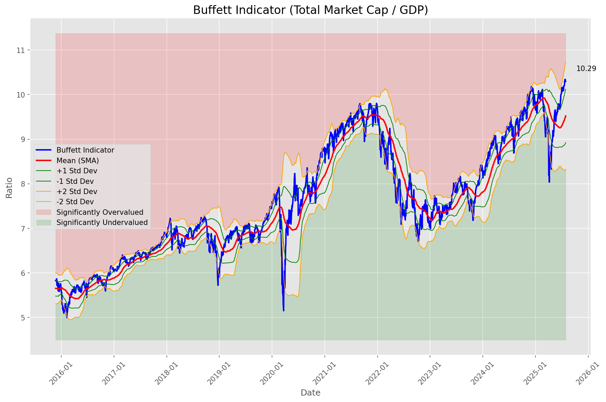
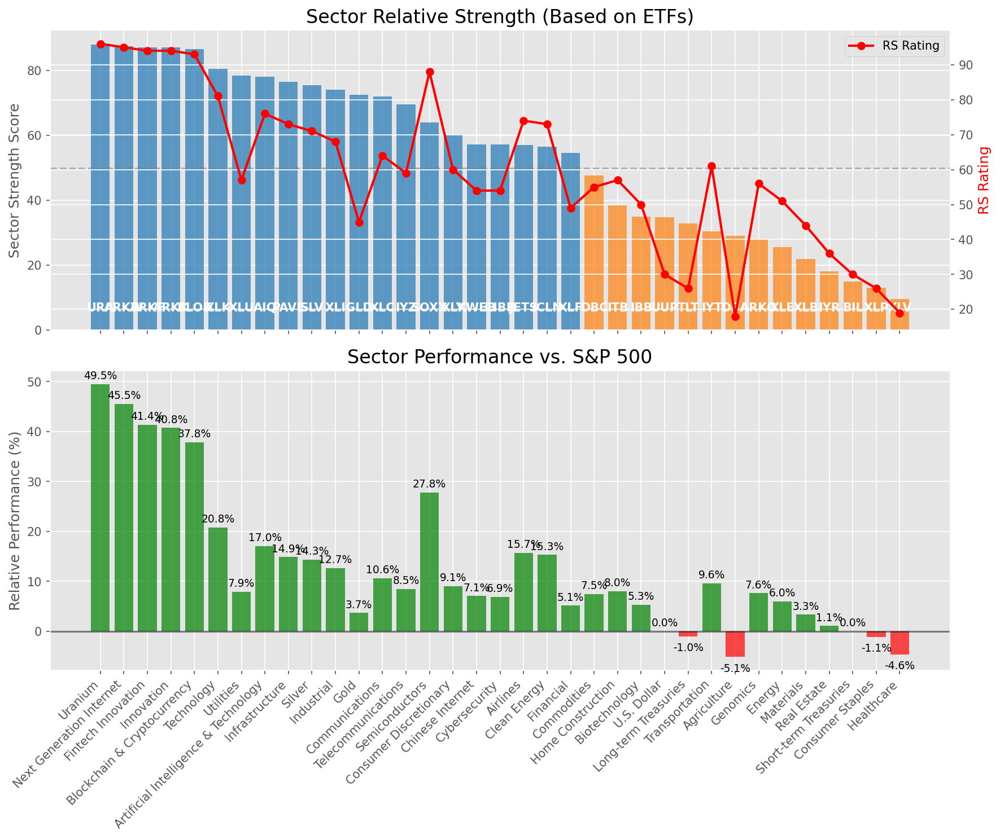

# **Daily Relative Strength Report**

**Date:** 2025-08-01

## **Market Valuation (Buffett Indicator)**

| Metric | Value |
|--------|-------|
| **Market Valuation** | **Overvalued** |
| **Current Ratio** | 10.06 |
| **Historical Mean** | 9.55 |
| **Standard Deviation** | 0.59 |
| **Z-Score (StdDev from Mean)** | 1.20 |
| **Total Market Cap** | $305.04 trillion |
| **GDP** | $30.33 trillion |

## **Market Insights**

### **Market is Overvalued**

The market appears to be trading above historical average valuations. While not at extreme levels, this suggests more modest future returns may be expected. Investors should:

- Focus on companies with reasonable valuations relative to their growth
- Be more selective with new positions
- Look for stocks showing relative strength within their sectors
- Consider trimming positions in extremely overvalued names

Historically, periods of mild overvaluation can persist for extended periods, but returns tend to be below average.

### **Buffett Indicator Overview**

The Buffett Indicator (Total Market Cap / GDP) is a measure of the stock market's valuation relative to the size of the economy. It is named after Warren Buffett, who described it as "probably the best single measure of where valuations stand at any given moment."

- **Values above +2 standard deviations:** Market significantly overvalued
- **Values above +1 standard deviation:** Market overvalued
- **Values between -1 and +1 standard deviations:** Market fairly valued
- **Values below -1 standard deviation:** Market undervalued
- **Values below -2 standard deviations:** Market significantly undervalued

---

## **Sector Relative Strength**

Based on William O'Neil's Relative Strength Methodology

| ETF | Strength | RS Rating | Performance | Above Key MAs | Trend | Sector |
|-----|----------|-----------|-------------|--------------|-------|--------|
| [URA](https://www.tradingview.com/chart/?symbol=URA) | 88.1 | 96.0 | 48.99% | 10d ✗, 50d ✓, 200d ✓ | ↗️ | Uranium |
| [ARKW](https://www.tradingview.com/chart/?symbol=ARKW) | 87.6 | 95.0 | 44.72% | 10d ✗, 50d ✓, 200d ✓ | ↗️ | Next Generation Internet |
| [ARKK](https://www.tradingview.com/chart/?symbol=ARKK) | 87.1 | 94.0 | 39.50% | 10d ✗, 50d ✓, 200d ✓ | ↗️ | Innovation |
| [ARKF](https://www.tradingview.com/chart/?symbol=ARKF) | 87.1 | 94.0 | 40.58% | 10d ✗, 50d ✓, 200d ✓ | ↗️ | Fintech Innovation |
| [BLOK](https://www.tradingview.com/chart/?symbol=BLOK) | 86.6 | 93.0 | 36.53% | 10d ✗, 50d ✓, 200d ✓ | ↗️ | Blockchain & Cryptocurrency |
| [XLK](https://www.tradingview.com/chart/?symbol=XLK) | 81.1 | 82.0 | 20.25% | 10d ✗, 50d ✓, 200d ✓ | ↗️ | Technology |
| [XLU](https://www.tradingview.com/chart/?symbol=XLU) | 80.0 | 60.0 | 8.35% | 10d ✓, 50d ✓, 200d ✓ | ↗️ | Utilities |
| [AIQ](https://www.tradingview.com/chart/?symbol=AIQ) | 78.1 | 76.0 | 16.46% | 10d ✗, 50d ✓, 200d ✓ | ↗️ | Artificial Intelligence & Technology |
| [PAVE](https://www.tradingview.com/chart/?symbol=PAVE) | 77.6 | 75.0 | 15.48% | 10d ✗, 50d ✓, 200d ✓ | ↗️ | Infrastructure |
| [SLV](https://www.tradingview.com/chart/?symbol=SLV) | 76.1 | 72.0 | 13.98% | 10d ✗, 50d ✓, 200d ✓ | ↗️ | Silver |
| [XLI](https://www.tradingview.com/chart/?symbol=XLI) | 75.1 | 70.0 | 12.93% | 10d ✗, 50d ✓, 200d ✓ | ↗️ | Industrial |
| [GLD](https://www.tradingview.com/chart/?symbol=GLD) | 73.0 | 46.0 | 3.65% | 10d ✓, 50d ✓, 200d ✓ | ↗️ | Gold |
| [XLC](https://www.tradingview.com/chart/?symbol=XLC) | 72.6 | 65.0 | 10.41% | 10d ✗, 50d ✓, 200d ✓ | ↗️ | Communications |
| [IYZ](https://www.tradingview.com/chart/?symbol=IYZ) | 70.1 | 60.0 | 8.42% | 10d ✗, 50d ✓, 200d ✓ | ↗️ | Telecommunications |
| [SOXX](https://www.tradingview.com/chart/?symbol=SOXX) | 64.6 | 89.0 | 28.34% | 10d ✗, 50d ✓, 200d ✓ | ↘️ | Semiconductors |
| [XLY](https://www.tradingview.com/chart/?symbol=XLY) | 60.2 | 60.0 | 8.38% | 10d ✗, 50d ✗, 200d ✓ | ↗️ | Consumer Discretionary |
| [CIBR](https://www.tradingview.com/chart/?symbol=CIBR) | 58.2 | 56.0 | 7.24% | 10d ✗, 50d ✗, 200d ✓ | ↗️ | Cybersecurity |
| [KWEB](https://www.tradingview.com/chart/?symbol=KWEB) | 58.2 | 56.0 | 7.06% | 10d ✗, 50d ✗, 200d ✓ | ↗️ | Chinese Internet |
| [JETS](https://www.tradingview.com/chart/?symbol=JETS) | 57.5 | 75.0 | 15.80% | 10d ✗, 50d ✗, 200d ✗ | ↗️ | Airlines |
| [ICLN](https://www.tradingview.com/chart/?symbol=ICLN) | 57.1 | 74.0 | 14.86% | 10d ✗, 50d ✓, 200d ✓ | ↘️ | Clean Energy |
| [XLF](https://www.tradingview.com/chart/?symbol=XLF) | 55.7 | 51.0 | 5.15% | 10d ✗, 50d ✗, 200d ✓ | ↗️ | Financial |
| [DBC](https://www.tradingview.com/chart/?symbol=DBC) | 47.6 | 55.0 | 6.94% | 10d ✗, 50d ✓, 200d ✓ | ↘️ | Commodities |
| [ITB](https://www.tradingview.com/chart/?symbol=ITB) | 39.9 | 60.0 | 8.37% | 10d ✗, 50d ✓, 200d ✗ | ↘️ | Home Construction |
| [IBB](https://www.tradingview.com/chart/?symbol=IBB) | 36.4 | 53.0 | 5.93% | 10d ✗, 50d ✓, 200d ✗ | ↘️ | Biotechnology |
| [UUP](https://www.tradingview.com/chart/?symbol=UUP) | 35.8 | 32.0 | 0.24% | 10d ✓, 50d ✓, 200d ✗ | ↘️ | U.S. Dollar |
| [TLT](https://www.tradingview.com/chart/?symbol=TLT) | 33.3 | 27.0 | -1.00% | 10d ✓, 50d ✓, 200d ✗ | ↘️ | Long-term Treasuries |
| [IYT](https://www.tradingview.com/chart/?symbol=IYT) | 31.5 | 63.0 | 9.40% | 10d ✗, 50d ✗, 200d ✗ | ↘️ | Transportation |
| [DBA](https://www.tradingview.com/chart/?symbol=DBA) | 29.5 | 19.0 | -4.86% | 10d ✗, 50d ✗, 200d ✗ | ↗️ | Agriculture |
| [ARKG](https://www.tradingview.com/chart/?symbol=ARKG) | 28.5 | 57.0 | 7.56% | 10d ✗, 50d ✗, 200d ✗ | ↘️ | Genomics |
| [XLE](https://www.tradingview.com/chart/?symbol=XLE) | 26.5 | 53.0 | 5.87% | 10d ✗, 50d ✗, 200d ✗ | ↘️ | Energy |
| [XLB](https://www.tradingview.com/chart/?symbol=XLB) | 22.5 | 45.0 | 3.53% | 10d ✗, 50d ✗, 200d ✗ | ↘️ | Materials |
| [IYR](https://www.tradingview.com/chart/?symbol=IYR) | 17.5 | 35.0 | 0.65% | 10d ✗, 50d ✗, 200d ✗ | ↘️ | Real Estate |
| [BIL](https://www.tradingview.com/chart/?symbol=BIL) | 15.0 | 30.0 | 0.04% | 10d ✗, 50d ✗, 200d ✗ | ↘️ | Short-term Treasuries |
| [XLP](https://www.tradingview.com/chart/?symbol=XLP) | 13.5 | 27.0 | -1.18% | 10d ✗, 50d ✗, 200d ✗ | ↘️ | Consumer Staples |
| [XLV](https://www.tradingview.com/chart/?symbol=XLV) | 10.0 | 20.0 | -4.26% | 10d ✗, 50d ✗, 200d ✗ | ↘️ | Healthcare |

### **Sector ETF Performance Interpretation**

This table shows the relative strength metrics for different market sectors based on their representative ETFs:

- **ETF**: The ETF used to measure sector performance (click for chart)
- **Strength**: Overall sector strength score (0-100) combining multiple factors
- **RS Rating**: O'Neil RS rating of the sector ETF
- **Performance**: Performance of the sector ETF relative to SPY
- **Above Key MAs**: Whether the ETF is trading above its 10, 50, and 200-day moving averages
- **Trend**: Whether the sector is in an uptrend (↗️) or downtrend (↘️)

### **Current Sector Leadership**

The current market leadership is coming from the following sectors: **Uranium, Next Generation Internet, Innovation**.

The **Uranium** sector (represented by **URA**) is showing particularly strong relative strength with an RS rating of 96.0 and performance of 48.99% vs. the S&P 500. This sector is trading above its 50-day, 200-day moving average(s). Investors should consider focusing on high RS stocks within these leading sectors for potential outperformance.

---

## **Buy Recommendations**

The following 36 stocks show exceptional relative strength:

| RS Rating | Buy Score | Current Price | Chart | Name | Ticker |
|-----------|-----------|---------------|-------|------|--------|
| 100 | 100 | $192.00 | [Chart](https://www.tradingview.com/chart/?symbol=CLS) | Celestica, Inc. | CLS |
| 100 | 100 | $105.68 | [Chart](https://www.tradingview.com/chart/?symbol=CRDO) | Credo Technology Group Holding Ltd Ordinary Shares | CRDO |
| 100 | 100 | $61.92 | [Chart](https://www.tradingview.com/chart/?symbol=MP) | MP Materials Corp. | MP |
| 100 | 100 | $227.20 | [Chart](https://www.tradingview.com/chart/?symbol=DAVE) | Dave Inc. Class A Common Stock | DAVE |
| 99 | 100 | $27.08 | [Chart](https://www.tradingview.com/chart/?symbol=CPS) | Cooper-Standard Automotive Inc. | CPS |
| 99 | 100 | $651.89 | [Chart](https://www.tradingview.com/chart/?symbol=GEV) | GE Vernova Inc. | GEV |
| 99 | 100 | $61.92 | [Chart](https://www.tradingview.com/chart/?symbol=HIMS) | Hims & Hers Health, Inc. | HIMS |
| 99 | 100 | $375.96 | [Chart](https://www.tradingview.com/chart/?symbol=TLN) | Talen Energy Corporation Common Stock | TLN |
| 99 | 100 | $125.63 | [Chart](https://www.tradingview.com/chart/?symbol=RBLX) | Roblox Corporation | RBLX |
| 98 | 100 | $199.91 | [Chart](https://www.tradingview.com/chart/?symbol=NET) | Cloudflare, Inc. Class A common stock, par value $0.001 per share | NET |
| 97 | 100 | $163.48 | [Chart](https://www.tradingview.com/chart/?symbol=IRTC) | iRhythm Technologies, Inc | IRTC |
| 96 | 100 | $166.12 | [Chart](https://www.tradingview.com/chart/?symbol=NRG) | NRG Energy, Inc. | NRG |
| 96 | 100 | $105.18 | [Chart](https://www.tradingview.com/chart/?symbol=VRNA) | Verona Pharma plc | VRNA |
| 96 | 100 | $367.15 | [Chart](https://www.tradingview.com/chart/?symbol=CVNA) | Carvana Co. | CVNA |
| 95 | 100 | $171.99 | [Chart](https://www.tradingview.com/chart/?symbol=COOP) | Mr. Cooper Group Inc. Common Stock | COOP |
| 94 | 100 | $110.53 | [Chart](https://www.tradingview.com/chart/?symbol=SANM) | Sanmina  Corp | SANM |
| 94 | 100 | $490.37 | [Chart](https://www.tradingview.com/chart/?symbol=CW) | Curtiss-Wright Corp. | CW |
| 93 | 100 | $86.94 | [Chart](https://www.tradingview.com/chart/?symbol=RYTM) | Rhythm Pharmaceuticals, Inc. Common Stock | RYTM |
| 93 | 100 | $91.94 | [Chart](https://www.tradingview.com/chart/?symbol=EBAY) | eBay Inc | EBAY |
| 93 | 100 | $42.92 | [Chart](https://www.tradingview.com/chart/?symbol=LTM) | LATAM Airlines Group S.A. American Depositary Shares (each representing two thousand (2,000) shares of Common Stock) | LTM |
| 92 | 100 | $375.33 | [Chart](https://www.tradingview.com/chart/?symbol=APP) | Applovin Corporation Class A Common Stock | APP |
| 91 | 100 | $268.16 | [Chart](https://www.tradingview.com/chart/?symbol=GE) | GE Aerospace | GE |
| 90 | 100 | $35.04 | [Chart](https://www.tradingview.com/chart/?symbol=APG) | APi Group Corporation | APG |
| 90 | 100 | $80.59 | [Chart](https://www.tradingview.com/chart/?symbol=TPB) | Turning Point Brands, Inc. | TPB |
| 88 | 100 | $144.52 | [Chart](https://www.tradingview.com/chart/?symbol=VSEC) | VSE Corp | VSEC |
| 87 | 100 | $29.41 | [Chart](https://www.tradingview.com/chart/?symbol=SRAD) | Sportradar Group AG Class A Ordinary Shares | SRAD |
| 89 | 99 | $186.89 | [Chart](https://www.tradingview.com/chart/?symbol=AWI) | Armstrong World Industries, Inc. | AWI |
| 87 | 99 | $54.37 | [Chart](https://www.tradingview.com/chart/?symbol=BTI) | British American Tobacco p.l.c. American Depositary Shares, American Depositary Shares, each representing one Ordinary Share | BTI |
| 85 | 98 | $56.70 | [Chart](https://www.tradingview.com/chart/?symbol=ERJ) | Embraer S.A. | ERJ |
| 84 | 97 | $38.78 | [Chart](https://www.tradingview.com/chart/?symbol=AHR) | American Healthcare REIT, Inc. | AHR |
| 86 | 96 | $94.60 | [Chart](https://www.tradingview.com/chart/?symbol=NDAQ) | Nasdaq, Inc. Common Stock | NDAQ |
| 86 | 96 | $257.14 | [Chart](https://www.tradingview.com/chart/?symbol=WTS) | Watts Water Technologies, Inc. Class A | WTS |
| 85 | 96 | $71.78 | [Chart](https://www.tradingview.com/chart/?symbol=ULS) | UL Solutions Inc. | ULS |
| 84 | 96 | $47.05 | [Chart](https://www.tradingview.com/chart/?symbol=BBIO) | BridgeBio Pharma, Inc. Common Stock | BBIO |
| 81 | 91 | $110.93 | [Chart](https://www.tradingview.com/chart/?symbol=SXT) | Sensient Technology Corporation | SXT |
| 80 | 91 | $234.71 | [Chart](https://www.tradingview.com/chart/?symbol=BAP) | Credicorp LTD | BAP |

---

## **Sell Recommendations**

The following 85 stocks show deteriorating relative strength:

| RS Rating | Sell Score | Current Price | Chart | Name | Ticker |
|-----------|------------|---------------|-------|------|--------|
| 1 | 100 | $70.11 | [Chart](https://www.tradingview.com/chart/?symbol=LNTH) | Lantheus Holdings, Inc | LNTH |
| 1 | 100 | $12.59 | [Chart](https://www.tradingview.com/chart/?symbol=NVDS) | Investment Managers Series Trust II Tradr 1.5X Short NVDA Daily ETF | NVDS |
| 2 | 100 | $13.67 | [Chart](https://www.tradingview.com/chart/?symbol=CLBT) | Cellebrite DI Ltd. Class A Ordinary Shares | CLBT |
| 2 | 100 | $35.00 | [Chart](https://www.tradingview.com/chart/?symbol=IBTA) | Ibotta, Inc. | IBTA |
| 3 | 100 | $24.32 | [Chart](https://www.tradingview.com/chart/?symbol=DUST) | Direxion Daily Gold Miners Index Bear 2X Shares | DUST |
| 3 | 100 | $14.82 | [Chart](https://www.tradingview.com/chart/?symbol=CSTL) | Castle Biosciences, Inc. Common Stock | CSTL |
| 3 | 100 | $15.30 | [Chart](https://www.tradingview.com/chart/?symbol=TVTX) | Travere Therapeutics, Inc. Common Stock | TVTX |
| 4 | 100 | $24.63 | [Chart](https://www.tradingview.com/chart/?symbol=ZSL) | ProShares UltraShort Silver | ZSL |
| 5 | 100 | $12.21 | [Chart](https://www.tradingview.com/chart/?symbol=CDNA) | CareDx, Inc. | CDNA |
| 5 | 100 | $10.20 | [Chart](https://www.tradingview.com/chart/?symbol=ARDT) | Ardent Health, Inc. | ARDT |
| 6 | 100 | $10.37 | [Chart](https://www.tradingview.com/chart/?symbol=OEC) | Orion S.A. | OEC |
| 6 | 100 | $43.60 | [Chart](https://www.tradingview.com/chart/?symbol=SDOW) | ProShares UltraPro Short Dow 30 | SDOW |
| 7 | 100 | $20.66 | [Chart](https://www.tradingview.com/chart/?symbol=AMRK) | A-Mark Precious Metals, Inc. | AMRK |
| 8 | 100 | $12.48 | [Chart](https://www.tradingview.com/chart/?symbol=BSM) | Black Stone Minerals, L.P. | BSM |
| 8 | 100 | $31.42 | [Chart](https://www.tradingview.com/chart/?symbol=GLBE) | Global-E Online Ltd. Ordinary Shares | GLBE |
| 8 | 100 | $22.43 | [Chart](https://www.tradingview.com/chart/?symbol=ERY) | Direxion Daily Energy Bear 2X Shares | ERY |
| 9 | 100 | $54.26 | [Chart](https://www.tradingview.com/chart/?symbol=HRB) | H&R Block, Inc. | HRB |
| 13 | 100 | $16.23 | [Chart](https://www.tradingview.com/chart/?symbol=UMH) | UMH Properties, Inc. | UMH |
| 14 | 100 | $14.90 | [Chart](https://www.tradingview.com/chart/?symbol=FIHL) | Fidelis Insurance Holdings Limited | FIHL |
| 6 | 99 | $15.02 | [Chart](https://www.tradingview.com/chart/?symbol=PLSE) | Pulse Biosciences, Inc Common Stock (DE) | PLSE |
| 7 | 99 | $18.85 | [Chart](https://www.tradingview.com/chart/?symbol=GAP) | The Gap, Inc. | GAP |
| 10 | 99 | $21.01 | [Chart](https://www.tradingview.com/chart/?symbol=AMPH) | Amphastar Pharmaceuticals, Inc. | AMPH |
| 12 | 99 | $52.61 | [Chart](https://www.tradingview.com/chart/?symbol=AMWD) | American Woodmark Corp | AMWD |
| 14 | 99 | $126.66 | [Chart](https://www.tradingview.com/chart/?symbol=ICUI) | ICU Medical Inc | ICUI |
| 6 | 98 | $20.54 | [Chart](https://www.tradingview.com/chart/?symbol=BLFS) | BioLife Solutions Inc. | BLFS |
| 9 | 98 | $17.81 | [Chart](https://www.tradingview.com/chart/?symbol=AMN) | AMN Healthcare Services | AMN |
| 9 | 98 | $10.18 | [Chart](https://www.tradingview.com/chart/?symbol=IMXI) | International Money Express, Inc. | IMXI |
| 10 | 98 | $18.70 | [Chart](https://www.tradingview.com/chart/?symbol=AVBP) | ArriVent BioPharma, Inc. Common Stock | AVBP |
| 9 | 97 | $10.10 | [Chart](https://www.tradingview.com/chart/?symbol=SD) | SandRidge Energy, Inc. | SD |
| 12 | 97 | $10.47 | [Chart](https://www.tradingview.com/chart/?symbol=CLB) | Core Laboratories Inc. | CLB |
| 8 | 96 | $52.17 | [Chart](https://www.tradingview.com/chart/?symbol=TSN) | Tyson Foods, Inc. | TSN |
| 10 | 96 | $35.30 | [Chart](https://www.tradingview.com/chart/?symbol=LZB) | La-Z-Boy Incorporated | LZB |
| 17 | 96 | $70.90 | [Chart](https://www.tradingview.com/chart/?symbol=NHI) | National Health Investors | NHI |
| 13 | 93 | $10.19 | [Chart](https://www.tradingview.com/chart/?symbol=ACIC) | American Coastal Insurance Corporation Common Stock | ACIC |
| 17 | 93 | $15.62 | [Chart](https://www.tradingview.com/chart/?symbol=MLNK) | MeridianLink, Inc. | MLNK |
| 15 | 91 | $12.98 | [Chart](https://www.tradingview.com/chart/?symbol=GOOD) | Gladstone Commercial Corporation - REIT | GOOD |
| 20 | 90 | $10.97 | [Chart](https://www.tradingview.com/chart/?symbol=MBC) | MasterBrand, Inc. | MBC |
| 21 | 90 | $37.09 | [Chart](https://www.tradingview.com/chart/?symbol=PBA) | PEMBINA PIPELINE CORPORATION | PBA |
| 20 | 89 | $18.36 | [Chart](https://www.tradingview.com/chart/?symbol=VSCO) | Victorias Secret & Co. | VSCO |
| 13 | 88 | $10.39 | [Chart](https://www.tradingview.com/chart/?symbol=SONO) | Sonos, Inc. Common Stock | SONO |
| 18 | 88 | $21.82 | [Chart](https://www.tradingview.com/chart/?symbol=CURB) | Curbline Properties Corp. | CURB |
| 19 | 87 | $11.93 | [Chart](https://www.tradingview.com/chart/?symbol=WSR) | Whitestone REIT | WSR |
| 21 | 86 | $31.45 | [Chart](https://www.tradingview.com/chart/?symbol=DAR) | DARLING INGREDIENTS INC. | DAR |
| 23 | 86 | $12.54 | [Chart](https://www.tradingview.com/chart/?symbol=ZYME) | Zymeworks Inc. | ZYME |
| 29 | 86 | $16.56 | [Chart](https://www.tradingview.com/chart/?symbol=SVOL) | Simplify Volatility Premium ETF | SVOL |
| 17 | 85 | $97.44 | [Chart](https://www.tradingview.com/chart/?symbol=AFL) | Aflac Inc. | AFL |
| 16 | 84 | $29.47 | [Chart](https://www.tradingview.com/chart/?symbol=KVYO) | Klaviyo, Inc. | KVYO |
| 24 | 84 | $13.18 | [Chart](https://www.tradingview.com/chart/?symbol=CCRN) | Cross Country Healthcare Inc | CCRN |
| 24 | 84 | $10.02 | [Chart](https://www.tradingview.com/chart/?symbol=NMZ) | Nuveen Municipal High Income Opportunity Fund | NMZ |
| 25 | 84 | $137.93 | [Chart](https://www.tradingview.com/chart/?symbol=DVA) | DaVita Inc. | DVA |
| 25 | 83 | $87.34 | [Chart](https://www.tradingview.com/chart/?symbol=BCO) | The Brink's Company | BCO |
| 23 | 82 | $11.26 | [Chart](https://www.tradingview.com/chart/?symbol=ROIV) | Roivant Sciences Ltd. Common Shares | ROIV |
| 26 | 82 | $11.78 | [Chart](https://www.tradingview.com/chart/?symbol=NVG) | Nuveen AMT-Free Municipal Credit Income Fund | NVG |
| 22 | 81 | $10.15 | [Chart](https://www.tradingview.com/chart/?symbol=BRKL) | Brookline Bancorp Inc | BRKL |
| 22 | 79 | $73.41 | [Chart](https://www.tradingview.com/chart/?symbol=MET) | MetLife, Inc. | MET |
| 23 | 79 | $186.20 | [Chart](https://www.tradingview.com/chart/?symbol=AIZ) | Assurant, Inc. | AIZ |
| 25 | 79 | $12.11 | [Chart](https://www.tradingview.com/chart/?symbol=NU) | Nu Holdings Ltd. | NU |
| 27 | 79 | $12.20 | [Chart](https://www.tradingview.com/chart/?symbol=RQI) | COHEN & STEERS QUALITY INCOME REALTY FUND, INC. COMMON SHARES | RQI |
| 27 | 79 | $18.63 | [Chart](https://www.tradingview.com/chart/?symbol=KRNT) | Kornit Digital Ltd. | KRNT |
| 39 | 79 | $10.29 | [Chart](https://www.tradingview.com/chart/?symbol=PFLT) | PennantPark Floating Rate Capital Ltd. | PFLT |
| 23 | 78 | $16.92 | [Chart](https://www.tradingview.com/chart/?symbol=NBBK) | NB Bancorp, Inc. Common Stock | NBBK |
| 25 | 78 | $153.00 | [Chart](https://www.tradingview.com/chart/?symbol=NICE) | NICE Ltd | NICE |
| 28 | 78 | $291.26 | [Chart](https://www.tradingview.com/chart/?symbol=UTHR) | United Therapeutics Corp | UTHR |
| 30 | 77 | $23.28 | [Chart](https://www.tradingview.com/chart/?symbol=IBTF) | iShares iBonds Dec 2025 Term Treasury ETF | IBTF |
| 31 | 77 | $59.89 | [Chart](https://www.tradingview.com/chart/?symbol=FTSM) | First Trust Enhanced Short Maturity ETF | FTSM |
| 24 | 76 | $85.97 | [Chart](https://www.tradingview.com/chart/?symbol=BIDU) | Baidu, Inc. | BIDU |
| 27 | 76 | $44.73 | [Chart](https://www.tradingview.com/chart/?symbol=EPI) | WisdomTree India Earnings Fund ETF | EPI |
| 32 | 76 | $100.28 | [Chart](https://www.tradingview.com/chart/?symbol=MINT) | PIMCO Enhanced Short Maturity Active Exchange-Traded Fund | MINT |
| 32 | 75 | $23.11 | [Chart](https://www.tradingview.com/chart/?symbol=IBHF) | iShares iBonds 2026 Term High Yield and Income ETF | IBHF |
| 38 | 75 | $13.46 | [Chart](https://www.tradingview.com/chart/?symbol=OCSL) | Oaktree Specialty Lending Corporation | OCSL |
| 36 | 74 | $20.89 | [Chart](https://www.tradingview.com/chart/?symbol=BKLN) | Invesco Senior Loan ETF | BKLN |
| 30 | 72 | $22.85 | [Chart](https://www.tradingview.com/chart/?symbol=IBTG) | iShares iBonds Dec 2026 Term Treasury ETF | IBTG |
| 33 | 72 | $30.73 | [Chart](https://www.tradingview.com/chart/?symbol=FLRN) | SPDR Bloomberg Investment Grade Floating Rate ETF | FLRN |
| 35 | 70 | $78.34 | [Chart](https://www.tradingview.com/chart/?symbol=FIS) | Fidelity National Information Services, Inc. | FIS |
| 38 | 70 | $77.67 | [Chart](https://www.tradingview.com/chart/?symbol=GPN) | Global Payments, Inc. | GPN |
| 34 | 69 | $47.52 | [Chart](https://www.tradingview.com/chart/?symbol=SPHD) | Invesco S&P 500 High Dividend Low Volatility ETF | SPHD |
| 35 | 69 | $45.93 | [Chart](https://www.tradingview.com/chart/?symbol=FTSL) | First Trust Senior Loan Fund ETF | FTSL |
| 34 | 68 | $33.96 | [Chart](https://www.tradingview.com/chart/?symbol=FFIN) | First Financial Bankshares Inc | FFIN |
| 37 | 67 | $54.47 | [Chart](https://www.tradingview.com/chart/?symbol=ALRM) | Alarm.com Holdings, Inc. | ALRM |
| 37 | 66 | $42.34 | [Chart](https://www.tradingview.com/chart/?symbol=SPYD) | SPDR Portfolio S&P 500 High Dividend ETF | SPYD |
| 39 | 66 | $36.52 | [Chart](https://www.tradingview.com/chart/?symbol=HYLB) | Xtrackers USD High Yield Corporate Bond ETF | HYLB |
| 39 | 66 | $20.32 | [Chart](https://www.tradingview.com/chart/?symbol=PEY) | Invesco High Yield Equity Dividend Achievers ETF | PEY |
| 37 | 64 | $160.66 | [Chart](https://www.tradingview.com/chart/?symbol=SPG) | Simon Property Group, Inc. | SPG |
| 38 | 64 | $83.25 | [Chart](https://www.tradingview.com/chart/?symbol=ACA) | Arcosa, Inc. Common Stock | ACA |
| 39 | 63 | $23.52 | [Chart](https://www.tradingview.com/chart/?symbol=SPHY) | SPDR Portfolio High Yield Bond ETF | SPHY |

## **Methodology**

This report uses William O'Neil's relative strength methodology from Investors Business Daily:

* **RS Rating**: Percentile rank of stock's performance vs. S&P 500 over the past 63 trading days (1-99 scale)
* **Buy Criteria**: RS Rating >= 80, price above 50-day MA, strong uptrend, increasing volume
* **Sell Criteria**: RS Rating < 40, price below 50-day MA, downtrend, decreasing volume

### **O'Neil's Key Principles**

1. **Focus on relative performance** - stocks outperforming the market
2. **Price trend confirmation** - stock must be in an uptrend
3. **Volume confirmation** - strong volume supports price moves
4. **Moving average validation** - price above key moving averages
5. **Market leaders only** - concentrate on top-performing stocks

*Report generated automatically after market close*