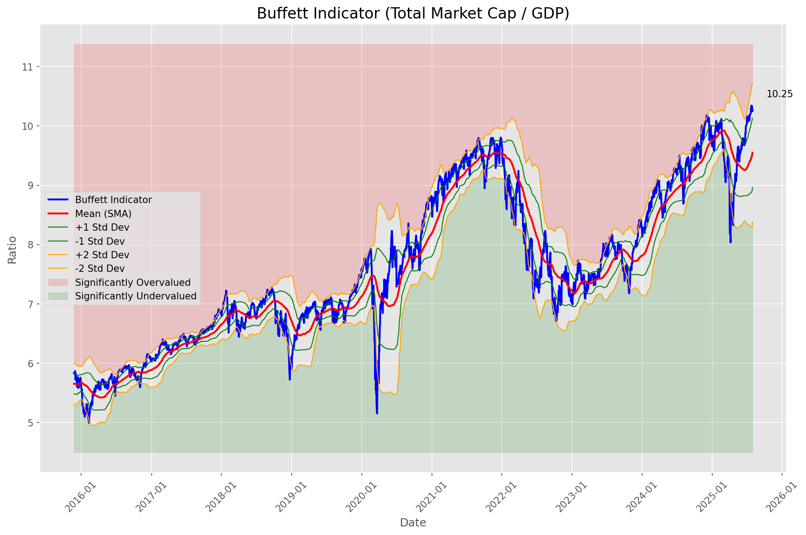
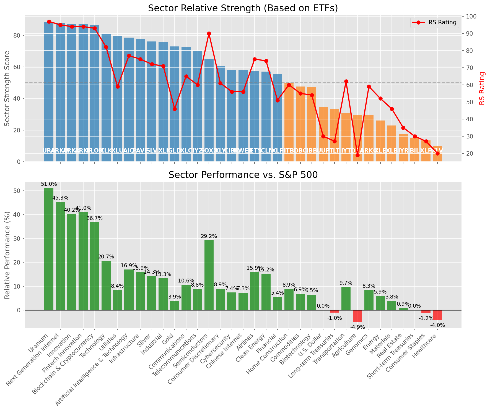

# **Daily Relative Strength Report**

**Date:** 2025-08-02

## **Market Valuation (Buffett Indicator)**

| Metric | Value |
|--------|-------|
| **Market Valuation** | **Overvalued** |
| **Current Ratio** | 10.08 |
| **Historical Mean** | 9.55 |
| **Standard Deviation** | 0.59 |
| **Z-Score (StdDev from Mean)** | 1.20 |
| **Total Market Cap** | $305.74 trillion |
| **GDP** | $30.33 trillion |

## **Market Insights**

### **Market is Overvalued**

The market appears to be trading above historical average valuations. While not at extreme levels, this suggests more modest future returns may be expected. Investors should:

- Focus on companies with reasonable valuations relative to their growth
- Be more selective with new positions
- Look for stocks showing relative strength within their sectors
- Consider trimming positions in extremely overvalued names

Historically, periods of mild overvaluation can persist for extended periods, but returns tend to be below average.

### **Buffett Indicator Overview**

The Buffett Indicator (Total Market Cap / GDP) is a measure of the stock market's valuation relative to the size of the economy. It is named after Warren Buffett, who described it as "probably the best single measure of where valuations stand at any given moment."

- **Values above +2 standard deviations:** Market significantly overvalued
- **Values above +1 standard deviation:** Market overvalued
- **Values between -1 and +1 standard deviations:** Market fairly valued
- **Values below -1 standard deviation:** Market undervalued
- **Values below -2 standard deviations:** Market significantly undervalued

---

## **Sector Relative Strength**

Based on William O'Neil's Relative Strength Methodology

| ETF | Strength | RS Rating | Performance | Above Key MAs | Trend | Sector |
|-----|----------|-----------|-------------|--------------|-------|--------|
| [URA](https://www.tradingview.com/chart/?symbol=URA) | 88.6 | 97.0 | 51.01% | 10d ✗, 50d ✓, 200d ✓ | ↗️ | Uranium |
| [ARKW](https://www.tradingview.com/chart/?symbol=ARKW) | 87.6 | 95.0 | 45.27% | 10d ✗, 50d ✓, 200d ✓ | ↗️ | Next Generation Internet |
| [ARKF](https://www.tradingview.com/chart/?symbol=ARKF) | 87.1 | 94.0 | 40.97% | 10d ✗, 50d ✓, 200d ✓ | ↗️ | Fintech Innovation |
| [ARKK](https://www.tradingview.com/chart/?symbol=ARKK) | 87.1 | 94.0 | 40.16% | 10d ✗, 50d ✓, 200d ✓ | ↗️ | Innovation |
| [BLOK](https://www.tradingview.com/chart/?symbol=BLOK) | 86.6 | 93.0 | 36.74% | 10d ✗, 50d ✓, 200d ✓ | ↗️ | Blockchain & Cryptocurrency |
| [XLK](https://www.tradingview.com/chart/?symbol=XLK) | 81.1 | 82.0 | 20.66% | 10d ✗, 50d ✓, 200d ✓ | ↗️ | Technology |
| [XLU](https://www.tradingview.com/chart/?symbol=XLU) | 79.5 | 59.0 | 8.43% | 10d ✓, 50d ✓, 200d ✓ | ↗️ | Utilities |
| [AIQ](https://www.tradingview.com/chart/?symbol=AIQ) | 78.6 | 77.0 | 16.95% | 10d ✗, 50d ✓, 200d ✓ | ↗️ | Artificial Intelligence & Technology |
| [PAVE](https://www.tradingview.com/chart/?symbol=PAVE) | 77.6 | 75.0 | 15.92% | 10d ✗, 50d ✓, 200d ✓ | ↗️ | Infrastructure |
| [SLV](https://www.tradingview.com/chart/?symbol=SLV) | 76.1 | 72.0 | 14.29% | 10d ✗, 50d ✓, 200d ✓ | ↗️ | Silver |
| [XLI](https://www.tradingview.com/chart/?symbol=XLI) | 75.6 | 71.0 | 13.26% | 10d ✗, 50d ✓, 200d ✓ | ↗️ | Industrial |
| [GLD](https://www.tradingview.com/chart/?symbol=GLD) | 73.0 | 46.0 | 3.92% | 10d ✓, 50d ✓, 200d ✓ | ↗️ | Gold |
| [XLC](https://www.tradingview.com/chart/?symbol=XLC) | 72.6 | 65.0 | 10.62% | 10d ✗, 50d ✓, 200d ✓ | ↗️ | Communications |
| [IYZ](https://www.tradingview.com/chart/?symbol=IYZ) | 70.1 | 60.0 | 8.79% | 10d ✗, 50d ✓, 200d ✓ | ↗️ | Telecommunications |
| [SOXX](https://www.tradingview.com/chart/?symbol=SOXX) | 65.1 | 90.0 | 29.22% | 10d ✗, 50d ✓, 200d ✓ | ↘️ | Semiconductors |
| [XLY](https://www.tradingview.com/chart/?symbol=XLY) | 60.7 | 61.0 | 8.94% | 10d ✗, 50d ✗, 200d ✓ | ↗️ | Consumer Discretionary |
| [CIBR](https://www.tradingview.com/chart/?symbol=CIBR) | 58.2 | 56.0 | 7.37% | 10d ✗, 50d ✗, 200d ✓ | ↗️ | Cybersecurity |
| [KWEB](https://www.tradingview.com/chart/?symbol=KWEB) | 58.2 | 56.0 | 7.34% | 10d ✗, 50d ✗, 200d ✓ | ↗️ | Chinese Internet |
| [JETS](https://www.tradingview.com/chart/?symbol=JETS) | 57.5 | 75.0 | 15.95% | 10d ✗, 50d ✗, 200d ✗ | ↗️ | Airlines |
| [ICLN](https://www.tradingview.com/chart/?symbol=ICLN) | 57.1 | 74.0 | 15.25% | 10d ✗, 50d ✓, 200d ✓ | ↘️ | Clean Energy |
| [XLF](https://www.tradingview.com/chart/?symbol=XLF) | 55.7 | 51.0 | 5.44% | 10d ✗, 50d ✗, 200d ✓ | ↗️ | Financial |
| [ITB](https://www.tradingview.com/chart/?symbol=ITB) | 49.8 | 60.0 | 8.87% | 10d ✓, 50d ✓, 200d ✗ | ↘️ | Home Construction |
| [DBC](https://www.tradingview.com/chart/?symbol=DBC) | 47.6 | 55.0 | 6.87% | 10d ✗, 50d ✓, 200d ✓ | ↘️ | Commodities |
| [IBB](https://www.tradingview.com/chart/?symbol=IBB) | 47.1 | 54.0 | 6.53% | 10d ✗, 50d ✓, 200d ✓ | ↘️ | Biotechnology |
| [UUP](https://www.tradingview.com/chart/?symbol=UUP) | 34.8 | 30.0 | 0.00% | 10d ✓, 50d ✓, 200d ✗ | ↘️ | U.S. Dollar |
| [TLT](https://www.tradingview.com/chart/?symbol=TLT) | 33.3 | 27.0 | -0.98% | 10d ✓, 50d ✓, 200d ✗ | ↘️ | Long-term Treasuries |
| [IYT](https://www.tradingview.com/chart/?symbol=IYT) | 31.0 | 62.0 | 9.68% | 10d ✗, 50d ✗, 200d ✗ | ↘️ | Transportation |
| [ARKG](https://www.tradingview.com/chart/?symbol=ARKG) | 29.5 | 59.0 | 8.32% | 10d ✗, 50d ✗, 200d ✗ | ↘️ | Genomics |
| [DBA](https://www.tradingview.com/chart/?symbol=DBA) | 29.5 | 19.0 | -4.86% | 10d ✗, 50d ✗, 200d ✗ | ↗️ | Agriculture |
| [XLE](https://www.tradingview.com/chart/?symbol=XLE) | 26.0 | 52.0 | 5.93% | 10d ✗, 50d ✗, 200d ✗ | ↘️ | Energy |
| [XLB](https://www.tradingview.com/chart/?symbol=XLB) | 23.0 | 46.0 | 3.83% | 10d ✗, 50d ✗, 200d ✗ | ↘️ | Materials |
| [IYR](https://www.tradingview.com/chart/?symbol=IYR) | 17.5 | 35.0 | 0.85% | 10d ✗, 50d ✗, 200d ✗ | ↘️ | Real Estate |
| [BIL](https://www.tradingview.com/chart/?symbol=BIL) | 15.0 | 30.0 | 0.04% | 10d ✗, 50d ✗, 200d ✗ | ↘️ | Short-term Treasuries |
| [XLP](https://www.tradingview.com/chart/?symbol=XLP) | 13.5 | 27.0 | -1.18% | 10d ✗, 50d ✗, 200d ✗ | ↘️ | Consumer Staples |
| [XLV](https://www.tradingview.com/chart/?symbol=XLV) | 10.0 | 20.0 | -4.03% | 10d ✗, 50d ✗, 200d ✗ | ↘️ | Healthcare |

### **Sector ETF Performance Interpretation**

This table shows the relative strength metrics for different market sectors based on their representative ETFs:

- **ETF**: The ETF used to measure sector performance (click for chart)
- **Strength**: Overall sector strength score (0-100) combining multiple factors
- **RS Rating**: O'Neil RS rating of the sector ETF
- **Performance**: Performance of the sector ETF relative to SPY
- **Above Key MAs**: Whether the ETF is trading above its 10, 50, and 200-day moving averages
- **Trend**: Whether the sector is in an uptrend (↗️) or downtrend (↘️)

### **Current Sector Leadership**

The current market leadership is coming from the following sectors: **Uranium, Next Generation Internet, Fintech Innovation**.

The **Uranium** sector (represented by **URA**) is showing particularly strong relative strength with an RS rating of 97.0 and performance of 51.01% vs. the S&P 500. This sector is trading above its 50-day, 200-day moving average(s). Investors should consider focusing on high RS stocks within these leading sectors for potential outperformance.

---

## **Buy Recommendations**

The following 40 stocks show exceptional relative strength:

| RS Rating | Buy Score | Current Price | Chart | Name | Ticker |
|-----------|-----------|---------------|-------|------|--------|
| 100 | 100 | $232.73 | [Chart](https://www.tradingview.com/chart/?symbol=DAVE) | Dave Inc. Class A Common Stock | DAVE |
| 100 | 100 | $63.69 | [Chart](https://www.tradingview.com/chart/?symbol=MP) | MP Materials Corp. | MP |
| 100 | 100 | $194.74 | [Chart](https://www.tradingview.com/chart/?symbol=CLS) | Celestica, Inc. | CLS |
| 100 | 100 | $144.00 | [Chart](https://www.tradingview.com/chart/?symbol=SEZL) | Sezzle Inc. Common Stock | SEZL |
| 99 | 100 | $62.55 | [Chart](https://www.tradingview.com/chart/?symbol=HIMS) | Hims & Hers Health, Inc. | HIMS |
| 99 | 100 | $656.50 | [Chart](https://www.tradingview.com/chart/?symbol=GEV) | GE Vernova Inc. | GEV |
| 99 | 100 | $125.03 | [Chart](https://www.tradingview.com/chart/?symbol=RBLX) | Roblox Corporation | RBLX |
| 99 | 100 | $26.34 | [Chart](https://www.tradingview.com/chart/?symbol=CPS) | Cooper-Standard Automotive Inc. | CPS |
| 98 | 100 | $378.01 | [Chart](https://www.tradingview.com/chart/?symbol=TLN) | Talen Energy Corporation Common Stock | TLN |
| 98 | 100 | $200.11 | [Chart](https://www.tradingview.com/chart/?symbol=NET) | Cloudflare, Inc. Class A common stock, par value $0.001 per share | NET |
| 97 | 100 | $164.97 | [Chart](https://www.tradingview.com/chart/?symbol=IRTC) | iRhythm Technologies, Inc | IRTC |
| 96 | 100 | $167.63 | [Chart](https://www.tradingview.com/chart/?symbol=NRG) | NRG Energy, Inc. | NRG |
| 95 | 100 | $48.37 | [Chart](https://www.tradingview.com/chart/?symbol=REVG) | REV Group, Inc. | REVG |
| 95 | 100 | $174.26 | [Chart](https://www.tradingview.com/chart/?symbol=COOP) | Mr. Cooper Group Inc. Common Stock | COOP |
| 95 | 100 | $105.18 | [Chart](https://www.tradingview.com/chart/?symbol=VRNA) | Verona Pharma plc | VRNA |
| 95 | 100 | $367.78 | [Chart](https://www.tradingview.com/chart/?symbol=CVNA) | Carvana Co. | CVNA |
| 94 | 100 | $110.96 | [Chart](https://www.tradingview.com/chart/?symbol=SANM) | Sanmina  Corp | SANM |
| 94 | 100 | $493.58 | [Chart](https://www.tradingview.com/chart/?symbol=CW) | Curtiss-Wright Corp. | CW |
| 93 | 100 | $88.30 | [Chart](https://www.tradingview.com/chart/?symbol=RYTM) | Rhythm Pharmaceuticals, Inc. Common Stock | RYTM |
| 93 | 100 | $379.17 | [Chart](https://www.tradingview.com/chart/?symbol=APP) | Applovin Corporation Class A Common Stock | APP |
| 93 | 100 | $91.74 | [Chart](https://www.tradingview.com/chart/?symbol=EBAY) | eBay Inc | EBAY |
| 93 | 100 | $259.29 | [Chart](https://www.tradingview.com/chart/?symbol=WWD) | Woodward, Inc. | WWD |
| 93 | 100 | $42.76 | [Chart](https://www.tradingview.com/chart/?symbol=LTM) | LATAM Airlines Group S.A. American Depositary Shares (each representing two thousand (2,000) shares of Common Stock) | LTM |
| 91 | 100 | $269.38 | [Chart](https://www.tradingview.com/chart/?symbol=GE) | GE Aerospace | GE |
| 90 | 100 | $35.07 | [Chart](https://www.tradingview.com/chart/?symbol=APG) | APi Group Corporation | APG |
| 90 | 100 | $80.96 | [Chart](https://www.tradingview.com/chart/?symbol=TPB) | Turning Point Brands, Inc. | TPB |
| 89 | 100 | $146.27 | [Chart](https://www.tradingview.com/chart/?symbol=VSEC) | VSE Corp | VSEC |
| 87 | 100 | $29.57 | [Chart](https://www.tradingview.com/chart/?symbol=SRAD) | Sportradar Group AG Class A Ordinary Shares | SRAD |
| 89 | 99 | $188.52 | [Chart](https://www.tradingview.com/chart/?symbol=AWI) | Armstrong World Industries, Inc. | AWI |
| 87 | 99 | $54.35 | [Chart](https://www.tradingview.com/chart/?symbol=BTI) | British American Tobacco p.l.c. American Depositary Shares, American Depositary Shares, each representing one Ordinary Share | BTI |
| 85 | 98 | $56.84 | [Chart](https://www.tradingview.com/chart/?symbol=ERJ) | Embraer S.A. | ERJ |
| 87 | 97 | $259.02 | [Chart](https://www.tradingview.com/chart/?symbol=WTS) | Watts Water Technologies, Inc. Class A | WTS |
| 85 | 97 | $47.37 | [Chart](https://www.tradingview.com/chart/?symbol=BBIO) | BridgeBio Pharma, Inc. Common Stock | BBIO |
| 84 | 97 | $32.53 | [Chart](https://www.tradingview.com/chart/?symbol=DB) | Deutsche Bank Aktiengesellschaft | DB |
| 84 | 97 | $38.89 | [Chart](https://www.tradingview.com/chart/?symbol=AHR) | American Healthcare REIT, Inc. | AHR |
| 86 | 96 | $95.17 | [Chart](https://www.tradingview.com/chart/?symbol=NDAQ) | Nasdaq, Inc. Common Stock | NDAQ |
| 84 | 95 | $71.90 | [Chart](https://www.tradingview.com/chart/?symbol=ULS) | UL Solutions Inc. | ULS |
| 82 | 92 | $49.23 | [Chart](https://www.tradingview.com/chart/?symbol=FHI) | Federated Hermes, Inc. | FHI |
| 82 | 92 | $111.71 | [Chart](https://www.tradingview.com/chart/?symbol=SXT) | Sensient Technology Corporation | SXT |
| 80 | 91 | $236.50 | [Chart](https://www.tradingview.com/chart/?symbol=BAP) | Credicorp LTD | BAP |

---

## **Sell Recommendations**

The following 62 stocks show deteriorating relative strength:

| RS Rating | Sell Score | Current Price | Chart | Name | Ticker |
|-----------|------------|---------------|-------|------|--------|
| 1 | 100 | $70.57 | [Chart](https://www.tradingview.com/chart/?symbol=LNTH) | Lantheus Holdings, Inc | LNTH |
| 1 | 100 | $12.47 | [Chart](https://www.tradingview.com/chart/?symbol=NVDS) | Investment Managers Series Trust II Tradr 1.5X Short NVDA Daily ETF | NVDS |
| 2 | 100 | $13.70 | [Chart](https://www.tradingview.com/chart/?symbol=CLBT) | Cellebrite DI Ltd. Class A Ordinary Shares | CLBT |
| 3 | 100 | $14.65 | [Chart](https://www.tradingview.com/chart/?symbol=CSTL) | Castle Biosciences, Inc. Common Stock | CSTL |
| 3 | 100 | $24.50 | [Chart](https://www.tradingview.com/chart/?symbol=ZSL) | ProShares UltraShort Silver | ZSL |
| 5 | 100 | $10.22 | [Chart](https://www.tradingview.com/chart/?symbol=ARDT) | Ardent Health, Inc. | ARDT |
| 5 | 100 | $43.26 | [Chart](https://www.tradingview.com/chart/?symbol=SDOW) | ProShares UltraPro Short Dow 30 | SDOW |
| 5 | 100 | $12.22 | [Chart](https://www.tradingview.com/chart/?symbol=CDNA) | CareDx, Inc. | CDNA |
| 6 | 100 | $20.39 | [Chart](https://www.tradingview.com/chart/?symbol=KIDS) | OrthoPediatrics Corp. Common Stock | KIDS |
| 6 | 100 | $10.37 | [Chart](https://www.tradingview.com/chart/?symbol=OEC) | Orion S.A. | OEC |
| 7 | 100 | $20.57 | [Chart](https://www.tradingview.com/chart/?symbol=AMRK) | A-Mark Precious Metals, Inc. | AMRK |
| 9 | 100 | $54.48 | [Chart](https://www.tradingview.com/chart/?symbol=HRB) | H&R Block, Inc. | HRB |
| 14 | 100 | $14.87 | [Chart](https://www.tradingview.com/chart/?symbol=FIHL) | Fidelis Insurance Holdings Limited | FIHL |
| 6 | 99 | $14.75 | [Chart](https://www.tradingview.com/chart/?symbol=PLSE) | Pulse Biosciences, Inc Common Stock (DE) | PLSE |
| 8 | 99 | $31.42 | [Chart](https://www.tradingview.com/chart/?symbol=GLBE) | Global-E Online Ltd. Ordinary Shares | GLBE |
| 8 | 99 | $22.39 | [Chart](https://www.tradingview.com/chart/?symbol=ERY) | Direxion Daily Energy Bear 2X Shares | ERY |
| 12 | 99 | $52.44 | [Chart](https://www.tradingview.com/chart/?symbol=AMWD) | American Woodmark Corp | AMWD |
| 9 | 98 | $10.18 | [Chart](https://www.tradingview.com/chart/?symbol=IMXI) | International Money Express, Inc. | IMXI |
| 13 | 98 | $16.23 | [Chart](https://www.tradingview.com/chart/?symbol=UMH) | UMH Properties, Inc. | UMH |
| 7 | 97 | $18.84 | [Chart](https://www.tradingview.com/chart/?symbol=GAP) | The Gap, Inc. | GAP |
| 9 | 97 | $12.56 | [Chart](https://www.tradingview.com/chart/?symbol=BSM) | Black Stone Minerals, L.P. | BSM |
| 9 | 97 | $18.66 | [Chart](https://www.tradingview.com/chart/?symbol=AVBP) | ArriVent BioPharma, Inc. Common Stock | AVBP |
| 15 | 97 | $127.40 | [Chart](https://www.tradingview.com/chart/?symbol=ICUI) | ICU Medical Inc | ICUI |
| 8 | 96 | $10.00 | [Chart](https://www.tradingview.com/chart/?symbol=SD) | SandRidge Energy, Inc. | SD |
| 7 | 95 | $20.80 | [Chart](https://www.tradingview.com/chart/?symbol=BLFS) | BioLife Solutions Inc. | BLFS |
| 12 | 95 | $10.53 | [Chart](https://www.tradingview.com/chart/?symbol=CLB) | Core Laboratories Inc. | CLB |
| 10 | 94 | $35.41 | [Chart](https://www.tradingview.com/chart/?symbol=LZB) | La-Z-Boy Incorporated | LZB |
| 12 | 92 | $10.13 | [Chart](https://www.tradingview.com/chart/?symbol=ACIC) | American Coastal Insurance Corporation Common Stock | ACIC |
| 16 | 91 | $15.57 | [Chart](https://www.tradingview.com/chart/?symbol=MLNK) | MeridianLink, Inc. | MLNK |
| 15 | 89 | $13.01 | [Chart](https://www.tradingview.com/chart/?symbol=GOOD) | Gladstone Commercial Corporation - REIT | GOOD |
| 21 | 89 | $37.20 | [Chart](https://www.tradingview.com/chart/?symbol=PBA) | PEMBINA PIPELINE CORPORATION | PBA |
| 17 | 88 | $11.80 | [Chart](https://www.tradingview.com/chart/?symbol=WSR) | Whitestone REIT | WSR |
| 20 | 88 | $85.19 | [Chart](https://www.tradingview.com/chart/?symbol=BCO) | The Brink's Company | BCO |
| 18 | 87 | $21.89 | [Chart](https://www.tradingview.com/chart/?symbol=CURB) | Curbline Properties Corp. | CURB |
| 21 | 86 | $13.04 | [Chart](https://www.tradingview.com/chart/?symbol=CCRN) | Cross Country Healthcare Inc | CCRN |
| 28 | 86 | $16.48 | [Chart](https://www.tradingview.com/chart/?symbol=SVOL) | Simplify Volatility Premium ETF | SVOL |
| 23 | 85 | $18.72 | [Chart](https://www.tradingview.com/chart/?symbol=VSCO) | Victorias Secret & Co. | VSCO |
| 21 | 84 | $31.49 | [Chart](https://www.tradingview.com/chart/?symbol=DAR) | DARLING INGREDIENTS INC. | DAR |
| 24 | 84 | $12.57 | [Chart](https://www.tradingview.com/chart/?symbol=ZYME) | Zymeworks Inc. | ZYME |
| 24 | 83 | $10.07 | [Chart](https://www.tradingview.com/chart/?symbol=NMZ) | Nuveen Municipal High Income Opportunity Fund | NMZ |
| 26 | 83 | $10.45 | [Chart](https://www.tradingview.com/chart/?symbol=LOCO) | El Pollo Loco Holdings, Inc. | LOCO |
| 26 | 81 | $138.48 | [Chart](https://www.tradingview.com/chart/?symbol=DVA) | DaVita Inc. | DVA |
| 24 | 78 | $152.61 | [Chart](https://www.tradingview.com/chart/?symbol=NICE) | NICE Ltd | NICE |
| 24 | 78 | $12.05 | [Chart](https://www.tradingview.com/chart/?symbol=NU) | Nu Holdings Ltd. | NU |
| 27 | 78 | $18.65 | [Chart](https://www.tradingview.com/chart/?symbol=KRNT) | Kornit Digital Ltd. | KRNT |
| 23 | 77 | $186.48 | [Chart](https://www.tradingview.com/chart/?symbol=AIZ) | Assurant, Inc. | AIZ |
| 23 | 77 | $10.19 | [Chart](https://www.tradingview.com/chart/?symbol=BRKL) | Brookline Bancorp Inc | BRKL |
| 28 | 77 | $12.22 | [Chart](https://www.tradingview.com/chart/?symbol=RQI) | COHEN & STEERS QUALITY INCOME REALTY FUND, INC. COMMON SHARES | RQI |
| 30 | 76 | $23.29 | [Chart](https://www.tradingview.com/chart/?symbol=IBTF) | iShares iBonds Dec 2025 Term Treasury ETF | IBTF |
| 31 | 76 | $100.28 | [Chart](https://www.tradingview.com/chart/?symbol=MINT) | PIMCO Enhanced Short Maturity Active Exchange-Traded Fund | MINT |
| 27 | 75 | $44.76 | [Chart](https://www.tradingview.com/chart/?symbol=EPI) | WisdomTree India Earnings Fund ETF | EPI |
| 31 | 75 | $59.91 | [Chart](https://www.tradingview.com/chart/?symbol=FTSM) | First Trust Enhanced Short Maturity ETF | FTSM |
| 35 | 75 | $40.40 | [Chart](https://www.tradingview.com/chart/?symbol=APOG) | Apogee Enterprises Inc | APOG |
| 36 | 73 | $20.89 | [Chart](https://www.tradingview.com/chart/?symbol=BKLN) | Invesco Senior Loan ETF | BKLN |
| 32 | 72 | $30.73 | [Chart](https://www.tradingview.com/chart/?symbol=FLRN) | SPDR Bloomberg Investment Grade Floating Rate ETF | FLRN |
| 29 | 71 | $22.86 | [Chart](https://www.tradingview.com/chart/?symbol=IBTG) | iShares iBonds Dec 2026 Term Treasury ETF | IBTG |
| 33 | 69 | $54.05 | [Chart](https://www.tradingview.com/chart/?symbol=ALRM) | Alarm.com Holdings, Inc. | ALRM |
| 34 | 68 | $47.56 | [Chart](https://www.tradingview.com/chart/?symbol=SPHD) | Invesco S&P 500 High Dividend Low Volatility ETF | SPHD |
| 35 | 67 | $45.92 | [Chart](https://www.tradingview.com/chart/?symbol=FTSL) | First Trust Senior Loan Fund ETF | FTSL |
| 35 | 67 | $78.36 | [Chart](https://www.tradingview.com/chart/?symbol=FIS) | Fidelity National Information Services, Inc. | FIS |
| 39 | 67 | $78.04 | [Chart](https://www.tradingview.com/chart/?symbol=GPN) | Global Payments, Inc. | GPN |
| 39 | 64 | $36.57 | [Chart](https://www.tradingview.com/chart/?symbol=HYLB) | Xtrackers USD High Yield Corporate Bond ETF | HYLB |

## **Methodology**

This report uses William O'Neil's relative strength methodology from Investors Business Daily:

* **RS Rating**: Percentile rank of stock's performance vs. S&P 500 over the past 63 trading days (1-99 scale)
* **Buy Criteria**: RS Rating >= 80, price above 50-day MA, strong uptrend, increasing volume
* **Sell Criteria**: RS Rating < 40, price below 50-day MA, downtrend, decreasing volume

### **O'Neil's Key Principles**

1. **Focus on relative performance** - stocks outperforming the market
2. **Price trend confirmation** - stock must be in an uptrend
3. **Volume confirmation** - strong volume supports price moves
4. **Moving average validation** - price above key moving averages
5. **Market leaders only** - concentrate on top-performing stocks

*Report generated automatically after market close*