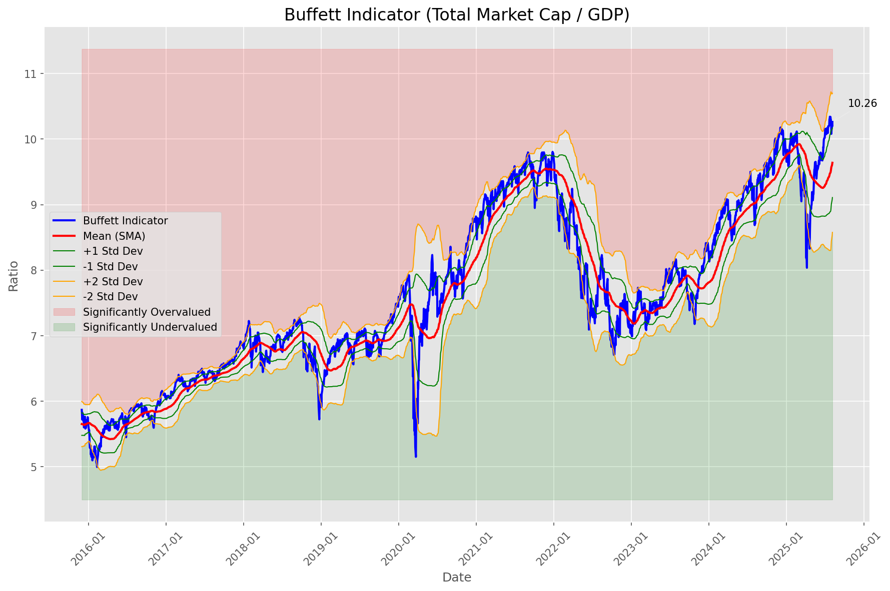
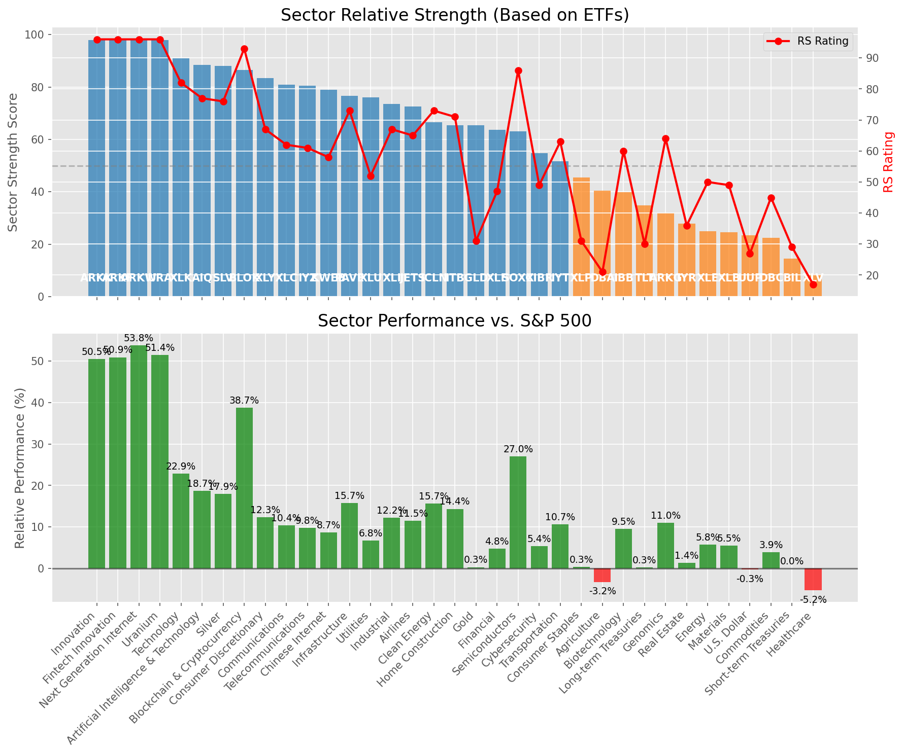

# **Daily Relative Strength Report**

**Date:** 2025-08-07

## **Market Valuation (Buffett Indicator)**

| Metric | Value |
|--------|-------|
| **Market Valuation** | **Overvalued** |
| **Current Ratio** | 10.26 |
| **Historical Mean** | 9.64 |
| **Standard Deviation** | 0.53 |
| **Z-Score (StdDev from Mean)** | 1.17 |
| **Total Market Cap** | $311.16 trillion |
| **GDP** | $30.33 trillion |

## **Market Insights**

### **Market is Overvalued**

The market appears to be trading above historical average valuations. While not at extreme levels, this suggests more modest future returns may be expected. Investors should:

- Focus on companies with reasonable valuations relative to their growth
- Be more selective with new positions
- Look for stocks showing relative strength within their sectors
- Consider trimming positions in extremely overvalued names

Historically, periods of mild overvaluation can persist for extended periods, but returns tend to be below average.

### **Buffett Indicator Overview**

The Buffett Indicator (Total Market Cap / GDP) is a measure of the stock market's valuation relative to the size of the economy. It is named after Warren Buffett, who described it as "probably the best single measure of where valuations stand at any given moment."

- **Values above +2 standard deviations:** Market significantly overvalued
- **Values above +1 standard deviation:** Market overvalued
- **Values between -1 and +1 standard deviations:** Market fairly valued
- **Values below -1 standard deviation:** Market undervalued
- **Values below -2 standard deviations:** Market significantly undervalued

---

## **Sector Relative Strength**

Based on William O'Neil's Relative Strength Methodology

| ETF | Strength | RS Rating | Performance | Above Key MAs | Trend | Sector |
|-----|----------|-----------|-------------|--------------|-------|--------|
| [ARKW](https://www.tradingview.com/chart/?symbol=ARKW) | 98.5 | 97.0 | 53.80% | 10d ✓, 50d ✓, 200d ✓ | ↗️ | Next Generation Internet |
| [ARKF](https://www.tradingview.com/chart/?symbol=ARKF) | 98.0 | 96.0 | 49.93% | 10d ✓, 50d ✓, 200d ✓ | ↗️ | Fintech Innovation |
| [XLK](https://www.tradingview.com/chart/?symbol=XLK) | 91.5 | 83.0 | 22.37% | 10d ✓, 50d ✓, 200d ✓ | ↗️ | Technology |
| [AIQ](https://www.tradingview.com/chart/?symbol=AIQ) | 88.5 | 77.0 | 18.11% | 10d ✓, 50d ✓, 200d ✓ | ↗️ | Artificial Intelligence & Technology |
| [ARKK](https://www.tradingview.com/chart/?symbol=ARKK) | 88.1 | 96.0 | 49.35% | 10d ✗, 50d ✓, 200d ✓ | ↗️ | Innovation |
| [URA](https://www.tradingview.com/chart/?symbol=URA) | 88.1 | 96.0 | 50.06% | 10d ✗, 50d ✓, 200d ✓ | ↗️ | Uranium |
| [SLV](https://www.tradingview.com/chart/?symbol=SLV) | 88.0 | 76.0 | 17.70% | 10d ✓, 50d ✓, 200d ✓ | ↗️ | Silver |
| [BLOK](https://www.tradingview.com/chart/?symbol=BLOK) | 86.6 | 93.0 | 38.74% | 10d ✗, 50d ✓, 200d ✓ | ↗️ | Blockchain & Cryptocurrency |
| [XLY](https://www.tradingview.com/chart/?symbol=XLY) | 83.0 | 66.0 | 11.84% | 10d ✓, 50d ✓, 200d ✓ | ↗️ | Consumer Discretionary |
| [XLC](https://www.tradingview.com/chart/?symbol=XLC) | 81.5 | 63.0 | 10.03% | 10d ✓, 50d ✓, 200d ✓ | ↗️ | Communications |
| [IYZ](https://www.tradingview.com/chart/?symbol=IYZ) | 81.0 | 62.0 | 9.72% | 10d ✓, 50d ✓, 200d ✓ | ↗️ | Telecommunications |
| [KWEB](https://www.tradingview.com/chart/?symbol=KWEB) | 79.5 | 59.0 | 8.69% | 10d ✓, 50d ✓, 200d ✓ | ↗️ | Chinese Internet |
| [PAVE](https://www.tradingview.com/chart/?symbol=PAVE) | 76.6 | 73.0 | 15.31% | 10d ✗, 50d ✓, 200d ✓ | ↗️ | Infrastructure |
| [XLU](https://www.tradingview.com/chart/?symbol=XLU) | 76.5 | 53.0 | 6.67% | 10d ✓, 50d ✓, 200d ✓ | ↗️ | Utilities |
| [XLI](https://www.tradingview.com/chart/?symbol=XLI) | 73.1 | 66.0 | 11.82% | 10d ✗, 50d ✓, 200d ✓ | ↗️ | Industrial |
| [ICLN](https://www.tradingview.com/chart/?symbol=ICLN) | 67.0 | 74.0 | 15.78% | 10d ✓, 50d ✓, 200d ✓ | ↘️ | Clean Energy |
| [ITB](https://www.tradingview.com/chart/?symbol=ITB) | 66.0 | 72.0 | 14.18% | 10d ✓, 50d ✓, 200d ✓ | ↘️ | Home Construction |
| [GLD](https://www.tradingview.com/chart/?symbol=GLD) | 66.0 | 32.0 | 0.45% | 10d ✓, 50d ✓, 200d ✓ | ↗️ | Gold |
| [SOXX](https://www.tradingview.com/chart/?symbol=SOXX) | 63.6 | 87.0 | 26.58% | 10d ✗, 50d ✓, 200d ✓ | ↘️ | Semiconductors |
| [JETS](https://www.tradingview.com/chart/?symbol=JETS) | 62.7 | 65.0 | 11.03% | 10d ✗, 50d ✗, 200d ✓ | ↗️ | Airlines |
| [CIBR](https://www.tradingview.com/chart/?symbol=CIBR) | 53.2 | 46.0 | 4.37% | 10d ✗, 50d ✗, 200d ✓ | ↗️ | Cybersecurity |
| [XLF](https://www.tradingview.com/chart/?symbol=XLF) | 53.2 | 46.0 | 4.13% | 10d ✗, 50d ✗, 200d ✓ | ↗️ | Financial |
| [IYT](https://www.tradingview.com/chart/?symbol=IYT) | 51.1 | 62.0 | 9.77% | 10d ✗, 50d ✓, 200d ✓ | ↘️ | Transportation |
| [XLP](https://www.tradingview.com/chart/?symbol=XLP) | 45.0 | 30.0 | 0.11% | 10d ✓, 50d ✓, 200d ✓ | ↘️ | Consumer Staples |
| [DBA](https://www.tradingview.com/chart/?symbol=DBA) | 40.4 | 21.0 | -3.24% | 10d ✓, 50d ✗, 200d ✗ | ↗️ | Agriculture |
| [IBB](https://www.tradingview.com/chart/?symbol=IBB) | 39.9 | 60.0 | 9.13% | 10d ✗, 50d ✓, 200d ✗ | ↘️ | Biotechnology |
| [TLT](https://www.tradingview.com/chart/?symbol=TLT) | 35.3 | 31.0 | 0.26% | 10d ✓, 50d ✓, 200d ✗ | ↘️ | Long-term Treasuries |
| [ARKG](https://www.tradingview.com/chart/?symbol=ARKG) | 31.5 | 63.0 | 10.37% | 10d ✗, 50d ✗, 200d ✗ | ↘️ | Genomics |
| [DBC](https://www.tradingview.com/chart/?symbol=DBC) | 25.0 | 50.0 | 5.58% | 10d ✗, 50d ✗, 200d ✗ | ↘️ | Commodities |
| [UUP](https://www.tradingview.com/chart/?symbol=UUP) | 24.4 | 29.0 | -0.20% | 10d ✗, 50d ✓, 200d ✗ | ↘️ | U.S. Dollar |
| [XLE](https://www.tradingview.com/chart/?symbol=XLE) | 24.0 | 48.0 | 5.08% | 10d ✗, 50d ✗, 200d ✗ | ↘️ | Energy |
| [XLB](https://www.tradingview.com/chart/?symbol=XLB) | 24.0 | 48.0 | 5.08% | 10d ✗, 50d ✗, 200d ✗ | ↘️ | Materials |
| [IYR](https://www.tradingview.com/chart/?symbol=IYR) | 17.5 | 35.0 | 0.98% | 10d ✗, 50d ✗, 200d ✗ | ↘️ | Real Estate |
| [BIL](https://www.tradingview.com/chart/?symbol=BIL) | 15.0 | 30.0 | 0.03% | 10d ✗, 50d ✗, 200d ✗ | ↘️ | Short-term Treasuries |
| [XLV](https://www.tradingview.com/chart/?symbol=XLV) | 8.5 | 17.0 | -5.33% | 10d ✗, 50d ✗, 200d ✗ | ↘️ | Healthcare |

### **Sector ETF Performance Interpretation**

This table shows the relative strength metrics for different market sectors based on their representative ETFs:

- **ETF**: The ETF used to measure sector performance (click for chart)
- **Strength**: Overall sector strength score (0-100) combining multiple factors
- **RS Rating**: O'Neil RS rating of the sector ETF
- **Performance**: Performance of the sector ETF relative to SPY
- **Above Key MAs**: Whether the ETF is trading above its 10, 50, and 200-day moving averages
- **Trend**: Whether the sector is in an uptrend (↗️) or downtrend (↘️)

### **Current Sector Leadership**

The current market leadership is coming from the following sectors: **Next Generation Internet, Fintech Innovation, Technology**.

The **Next Generation Internet** sector (represented by **ARKW**) is showing particularly strong relative strength with an RS rating of 97.0 and performance of 53.80% vs. the S&P 500. This sector is trading above its 10-day, 50-day, 200-day moving average(s). Investors should consider focusing on high RS stocks within these leading sectors for potential outperformance.

---

## **Buy Recommendations**

The following 56 stocks show exceptional relative strength:

| RS Rating | Buy Score | Current Price | Chart | Name | Ticker |
|-----------|-----------|---------------|-------|------|--------|
| 100 | 100 | $69.83 | [Chart](https://www.tradingview.com/chart/?symbol=MP) | MP Materials Corp. | MP |
| 100 | 100 | $118.70 | [Chart](https://www.tradingview.com/chart/?symbol=CRDO) | Credo Technology Group Holding Ltd Ordinary Shares | CRDO |
| 100 | 100 | $225.75 | [Chart](https://www.tradingview.com/chart/?symbol=LEU) | Centrus Energy Corp. | LEU |
| 100 | 100 | $111.20 | [Chart](https://www.tradingview.com/chart/?symbol=HOOD) | Robinhood Markets, Inc. Class A Common Stock | HOOD |
| 100 | 100 | $201.35 | [Chart](https://www.tradingview.com/chart/?symbol=CLS) | Celestica, Inc. | CLS |
| 100 | 100 | $37.42 | [Chart](https://www.tradingview.com/chart/?symbol=GRPN) | Groupon, Inc.Common Stock | GRPN |
| 99 | 100 | $213.00 | [Chart](https://www.tradingview.com/chart/?symbol=NET) | Cloudflare, Inc. Class A common stock, par value $0.001 per share | NET |
| 99 | 100 | $132.42 | [Chart](https://www.tradingview.com/chart/?symbol=RBLX) | Roblox Corporation | RBLX |
| 99 | 100 | $76.33 | [Chart](https://www.tradingview.com/chart/?symbol=LIF) | Life360, Inc. Common Stock | LIF |
| 98 | 100 | $183.13 | [Chart](https://www.tradingview.com/chart/?symbol=PLTR) | Palantir Technologies Inc. Class A Common Stock | PLTR |
| 98 | 100 | $375.23 | [Chart](https://www.tradingview.com/chart/?symbol=TLN) | Talen Energy Corporation Common Stock | TLN |
| 98 | 100 | $654.30 | [Chart](https://www.tradingview.com/chart/?symbol=GEV) | GE Vernova Inc. | GEV |
| 97 | 100 | $187.59 | [Chart](https://www.tradingview.com/chart/?symbol=COOP) | Mr. Cooper Group Inc. Common Stock | COOP |
| 97 | 100 | $158.75 | [Chart](https://www.tradingview.com/chart/?symbol=FUTU) | Futu Holdings Limited American Depositary Shares | FUTU |
| 97 | 100 | $157.09 | [Chart](https://www.tradingview.com/chart/?symbol=ARKW) | ARK Next Generation Internet ETF | ARKW |
| 96 | 100 | $268.47 | [Chart](https://www.tradingview.com/chart/?symbol=DASH) | DoorDash, Inc. Class A Common Stock | DASH |
| 96 | 100 | $22.77 | [Chart](https://www.tradingview.com/chart/?symbol=MAG) | MAG Silver Corp. | MAG |
| 96 | 100 | $117.51 | [Chart](https://www.tradingview.com/chart/?symbol=SANM) | Sanmina  Corp | SANM |
| 96 | 100 | $54.23 | [Chart](https://www.tradingview.com/chart/?symbol=ARKF) | ARK Fintech Innovation ETF | ARKF |
| 95 | 100 | $872.27 | [Chart](https://www.tradingview.com/chart/?symbol=AXON) | Axon Enterprise, Inc. Common Stock | AXON |
| 95 | 100 | $440.97 | [Chart](https://www.tradingview.com/chart/?symbol=APP) | Applovin Corporation Class A Common Stock | APP |
| 95 | 100 | $28.05 | [Chart](https://www.tradingview.com/chart/?symbol=KAR) | OPENLANE, Inc | KAR |
| 94 | 100 | $51.28 | [Chart](https://www.tradingview.com/chart/?symbol=BBW) | Build-A-Bear Workshop, Inc. | BBW |
| 94 | 100 | $50.42 | [Chart](https://www.tradingview.com/chart/?symbol=REVG) | REV Group, Inc. | REVG |
| 93 | 100 | $89.40 | [Chart](https://www.tradingview.com/chart/?symbol=RYTM) | Rhythm Pharmaceuticals, Inc. Common Stock | RYTM |
| 93 | 100 | $355.61 | [Chart](https://www.tradingview.com/chart/?symbol=CVNA) | Carvana Co. | CVNA |
| 92 | 100 | $92.28 | [Chart](https://www.tradingview.com/chart/?symbol=GDXU) | MicroSectors Gold Miners 3x Leveraged ETN | GDXU |
| 91 | 100 | $35.43 | [Chart](https://www.tradingview.com/chart/?symbol=DB) | Deutsche Bank Aktiengesellschaft | DB |
| 91 | 100 | $92.83 | [Chart](https://www.tradingview.com/chart/?symbol=EBAY) | eBay Inc | EBAY |
| 91 | 100 | $58.16 | [Chart](https://www.tradingview.com/chart/?symbol=AU) | AngloGold Ashanti plc | AU |
| 91 | 100 | $108.29 | [Chart](https://www.tradingview.com/chart/?symbol=APH) | Amphenol Corporation | APH |
| 91 | 100 | $156.19 | [Chart](https://www.tradingview.com/chart/?symbol=VSEC) | VSE Corp | VSEC |
| 90 | 100 | $53.54 | [Chart](https://www.tradingview.com/chart/?symbol=SIL) | Global X Silver Miners ETF (NEW) | SIL |
| 90 | 100 | $42.99 | [Chart](https://www.tradingview.com/chart/?symbol=LTM) | LATAM Airlines Group S.A. American Depositary Shares (each representing two thousand (2,000) shares of Common Stock) | LTM |
| 89 | 100 | $34.58 | [Chart](https://www.tradingview.com/chart/?symbol=ATAT) | Atour Lifestyle Holdings Limited American Depositary Shares | ATAT |
| 87 | 99 | $56.31 | [Chart](https://www.tradingview.com/chart/?symbol=BTI) | British American Tobacco p.l.c. American Depositary Shares, American Depositary Shares, each representing one Ordinary Share | BTI |
| 87 | 98 | $31.20 | [Chart](https://www.tradingview.com/chart/?symbol=PAAS) | Pan American Silver Corp. | PAAS |
| 86 | 98 | $30.00 | [Chart](https://www.tradingview.com/chart/?symbol=OR) | OR Royalties Inc. | OR |
| 84 | 98 | $19.62 | [Chart](https://www.tradingview.com/chart/?symbol=BCS) | Barclays PLC | BCS |
| 87 | 97 | $19.66 | [Chart](https://www.tradingview.com/chart/?symbol=LQDA) | Liquidia Corporation Common Stock | LQDA |
| 87 | 97 | $190.87 | [Chart](https://www.tradingview.com/chart/?symbol=AWI) | Armstrong World Industries, Inc. | AWI |
| 86 | 97 | $50.23 | [Chart](https://www.tradingview.com/chart/?symbol=GH) | Guardant Health, Inc. Common Stock | GH |
| 82 | 96 | $39.69 | [Chart](https://www.tradingview.com/chart/?symbol=AHR) | American Healthcare REIT, Inc. | AHR |
| 85 | 95 | $50.72 | [Chart](https://www.tradingview.com/chart/?symbol=PTCT) | PTC Therapeutics, Inc. | PTCT |
| 82 | 95 | $57.00 | [Chart](https://www.tradingview.com/chart/?symbol=ERJ) | Embraer S.A. | ERJ |
| 84 | 94 | $97.02 | [Chart](https://www.tradingview.com/chart/?symbol=NDAQ) | Nasdaq, Inc. Common Stock | NDAQ |
| 83 | 94 | $115.17 | [Chart](https://www.tradingview.com/chart/?symbol=SXT) | Sensient Technology Corporation | SXT |
| 82 | 94 | $321.23 | [Chart](https://www.tradingview.com/chart/?symbol=FFIV) | F5, Inc. Common Stock | FFIV |
| 82 | 94 | $101.95 | [Chart](https://www.tradingview.com/chart/?symbol=BK) | Bank of New York Mellon Corporation | BK |
| 82 | 93 | $26.63 | [Chart](https://www.tradingview.com/chart/?symbol=TFPM) | Triple Flag Precious Metals Corp. | TFPM |
| 81 | 92 | $32.93 | [Chart](https://www.tradingview.com/chart/?symbol=HODL) | VanEck Bitcoin ETF | HODL |
| 81 | 92 | $147.37 | [Chart](https://www.tradingview.com/chart/?symbol=PPA) | Invesco Aerospace & Defense ETF | PPA |
| 81 | 91 | $66.16 | [Chart](https://www.tradingview.com/chart/?symbol=IBIT) | iShares Bitcoin Trust ETF | IBIT |
| 80 | 91 | $242.99 | [Chart](https://www.tradingview.com/chart/?symbol=BAP) | Credicorp LTD | BAP |
| 80 | 90 | $17.61 | [Chart](https://www.tradingview.com/chart/?symbol=DAN) | Dana Incorporated | DAN |
| 80 | 90 | $50.94 | [Chart](https://www.tradingview.com/chart/?symbol=FHI) | Federated Hermes, Inc. | FHI |

---

## **Sell Recommendations**

The following 52 stocks show deteriorating relative strength:

| RS Rating | Sell Score | Current Price | Chart | Name | Ticker |
|-----------|------------|---------------|-------|------|--------|
| 1 | 100 | $11.62 | [Chart](https://www.tradingview.com/chart/?symbol=NVDS) | Investment Managers Series Trust II Tradr 1.5X Short NVDA Daily ETF | NVDS |
| 2 | 100 | $22.84 | [Chart](https://www.tradingview.com/chart/?symbol=ZSL) | ProShares UltraShort Silver | ZSL |
| 2 | 100 | $16.25 | [Chart](https://www.tradingview.com/chart/?symbol=DJT) | Trump Media & Technology Group Corp. Common Stock | DJT |
| 3 | 100 | $13.71 | [Chart](https://www.tradingview.com/chart/?symbol=CLBT) | Cellebrite DI Ltd. Class A Ordinary Shares | CLBT |
| 3 | 100 | $39.91 | [Chart](https://www.tradingview.com/chart/?symbol=PRCT) | PROCEPT BioRobotics Corporation Common Stock | PRCT |
| 3 | 100 | $38.80 | [Chart](https://www.tradingview.com/chart/?symbol=INTA) | Intapp, Inc. Common Stock | INTA |
| 4 | 100 | $24.34 | [Chart](https://www.tradingview.com/chart/?symbol=TBBB) | BBB Foods Inc. | TBBB |
| 6 | 100 | $42.34 | [Chart](https://www.tradingview.com/chart/?symbol=SDOW) | ProShares UltraPro Short Dow 30 | SDOW |
| 7 | 100 | $11.24 | [Chart](https://www.tradingview.com/chart/?symbol=SHC) | Sotera Health Company Common Stock | SHC |
| 8 | 100 | $10.45 | [Chart](https://www.tradingview.com/chart/?symbol=OEC) | Orion S.A. | OEC |
| 9 | 100 | $24.62 | [Chart](https://www.tradingview.com/chart/?symbol=DXD) | ProShares UltraShort Dow 30 | DXD |
| 9 | 100 | $12.79 | [Chart](https://www.tradingview.com/chart/?symbol=EWTX) | Edgewise Therapeutics, Inc. Common Stock | EWTX |
| 10 | 100 | $39.09 | [Chart](https://www.tradingview.com/chart/?symbol=SH) | ProShares Short S&P500 | SH |
| 10 | 100 | $41.11 | [Chart](https://www.tradingview.com/chart/?symbol=BILL) | BILL Holdings, Inc. | BILL |
| 10 | 100 | $54.95 | [Chart](https://www.tradingview.com/chart/?symbol=HRB) | H&R Block, Inc. | HRB |
| 13 | 100 | $16.35 | [Chart](https://www.tradingview.com/chart/?symbol=CTO) | CTO Realty Growth, Inc. | CTO |
| 16 | 100 | $31.62 | [Chart](https://www.tradingview.com/chart/?symbol=JD) | JD.com, Inc. | JD |
| 11 | 99 | $36.69 | [Chart](https://www.tradingview.com/chart/?symbol=LZB) | La-Z-Boy Incorporated | LZB |
| 8 | 97 | $20.21 | [Chart](https://www.tradingview.com/chart/?symbol=GAP) | The Gap, Inc. | GAP |
| 12 | 97 | $12.20 | [Chart](https://www.tradingview.com/chart/?symbol=CCRN) | Cross Country Healthcare Inc | CCRN |
| 10 | 96 | $21.77 | [Chart](https://www.tradingview.com/chart/?symbol=HELE) | Helen Of Troy Ltd | HELE |
| 11 | 95 | $225.80 | [Chart](https://www.tradingview.com/chart/?symbol=WDAY) | Workday, Inc. Class A Common Stock | WDAY |
| 16 | 94 | $13.03 | [Chart](https://www.tradingview.com/chart/?symbol=GOOD) | Gladstone Commercial Corporation - REIT | GOOD |
| 10 | 92 | $15.34 | [Chart](https://www.tradingview.com/chart/?symbol=PLSE) | Pulse Biosciences, Inc Common Stock (DE) | PLSE |
| 19 | 91 | $22.48 | [Chart](https://www.tradingview.com/chart/?symbol=CURB) | Curbline Properties Corp. | CURB |
| 16 | 90 | $36.97 | [Chart](https://www.tradingview.com/chart/?symbol=PBA) | PEMBINA PIPELINE CORPORATION | PBA |
| 20 | 89 | $37.50 | [Chart](https://www.tradingview.com/chart/?symbol=VNO) | Vornado Realty Trust | VNO |
| 21 | 88 | $46.15 | [Chart](https://www.tradingview.com/chart/?symbol=EDU) | New Oriental Education and Technology Group, Inc. American Depositary Shares (each representing ten (10) Common Shares) | EDU |
| 19 | 87 | $12.16 | [Chart](https://www.tradingview.com/chart/?symbol=WSR) | Whitestone REIT | WSR |
| 26 | 86 | $44.59 | [Chart](https://www.tradingview.com/chart/?symbol=EPI) | WisdomTree India Earnings Fund ETF | EPI |
| 22 | 85 | $19.09 | [Chart](https://www.tradingview.com/chart/?symbol=AVBP) | ArriVent BioPharma, Inc. Common Stock | AVBP |
| 16 | 84 | $25.75 | [Chart](https://www.tradingview.com/chart/?symbol=DOG) | ProShares Short Dow30 | DOG |
| 17 | 84 | $10.04 | [Chart](https://www.tradingview.com/chart/?symbol=BRKL) | Brookline Bancorp Inc | BRKL |
| 20 | 84 | $17.35 | [Chart](https://www.tradingview.com/chart/?symbol=DIV) | Global X SuperDividend U.S. ETF | DIV |
| 27 | 82 | $12.29 | [Chart](https://www.tradingview.com/chart/?symbol=RQI) | COHEN & STEERS QUALITY INCOME REALTY FUND, INC. COMMON SHARES | RQI |
| 19 | 81 | $61.11 | [Chart](https://www.tradingview.com/chart/?symbol=UL) | Unilever plc | UL |
| 26 | 80 | $13.56 | [Chart](https://www.tradingview.com/chart/?symbol=KROS) | Keros Therapeutics, Inc. Common Stock | KROS |
| 26 | 80 | $48.16 | [Chart](https://www.tradingview.com/chart/?symbol=FR) | First Industrial Realty Trust, Inc. | FR |
| 30 | 79 | $50.25 | [Chart](https://www.tradingview.com/chart/?symbol=XHLF) | BondBloxx Bloomberg Six Month Target Duration US Treasury ETF | XHLF |
| 29 | 78 | $50.73 | [Chart](https://www.tradingview.com/chart/?symbol=LW) | Lamb Weston Holdings, Inc. | LW |
| 36 | 78 | $47.80 | [Chart](https://www.tradingview.com/chart/?symbol=SPHD) | Invesco S&P 500 High Dividend Low Volatility ETF | SPHD |
| 28 | 76 | $68.37 | [Chart](https://www.tradingview.com/chart/?symbol=PYPL) | PayPal Holdings, Inc. Common Stock | PYPL |
| 31 | 76 | $30.75 | [Chart](https://www.tradingview.com/chart/?symbol=FLRN) | SPDR Bloomberg Investment Grade Floating Rate ETF | FLRN |
| 32 | 76 | $89.29 | [Chart](https://www.tradingview.com/chart/?symbol=VNQ) | Vanguard Real Estate ETF | VNQ |
| 33 | 74 | $15.53 | [Chart](https://www.tradingview.com/chart/?symbol=HQH) | abrdn Healthcare Investors | HQH |
| 29 | 73 | $23.70 | [Chart](https://www.tradingview.com/chart/?symbol=FFBC) | First Financial Bancorp | FFBC |
| 29 | 72 | $23.30 | [Chart](https://www.tradingview.com/chart/?symbol=IBTF) | iShares iBonds Dec 2025 Term Treasury ETF | IBTF |
| 34 | 69 | $12.46 | [Chart](https://www.tradingview.com/chart/?symbol=NU) | Nu Holdings Ltd. | NU |
| 35 | 68 | $23.62 | [Chart](https://www.tradingview.com/chart/?symbol=COLB) | Columbia Banking Systems Inc | COLB |
| 39 | 68 | $24.13 | [Chart](https://www.tradingview.com/chart/?symbol=FLBL) | Franklin Senior Loan ETF | FLBL |
| 39 | 68 | $42.77 | [Chart](https://www.tradingview.com/chart/?symbol=SPYD) | SPDR Portfolio S&P 500 High Dividend ETF | SPYD |
| 38 | 67 | $96.18 | [Chart](https://www.tradingview.com/chart/?symbol=RWR) | SPDR Dow Jones REIT ETF | RWR |

## **Methodology**

This report uses William O'Neil's relative strength methodology from Investors Business Daily:

* **RS Rating**: Percentile rank of stock's performance vs. S&P 500 over the past 63 trading days (1-99 scale)
* **Buy Criteria**: RS Rating >= 80, price above 50-day MA, strong uptrend, increasing volume
* **Sell Criteria**: RS Rating < 40, price below 50-day MA, downtrend, decreasing volume

### **O'Neil's Key Principles**

1. **Focus on relative performance** - stocks outperforming the market
2. **Price trend confirmation** - stock must be in an uptrend
3. **Volume confirmation** - strong volume supports price moves
4. **Moving average validation** - price above key moving averages
5. **Market leaders only** - concentrate on top-performing stocks

*Report generated automatically after market close*