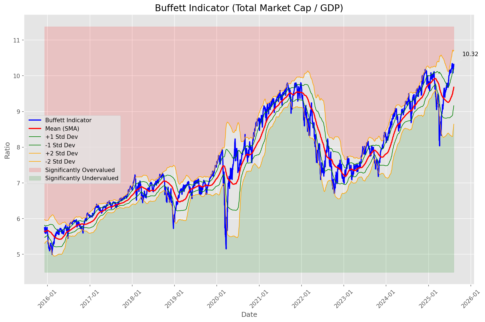
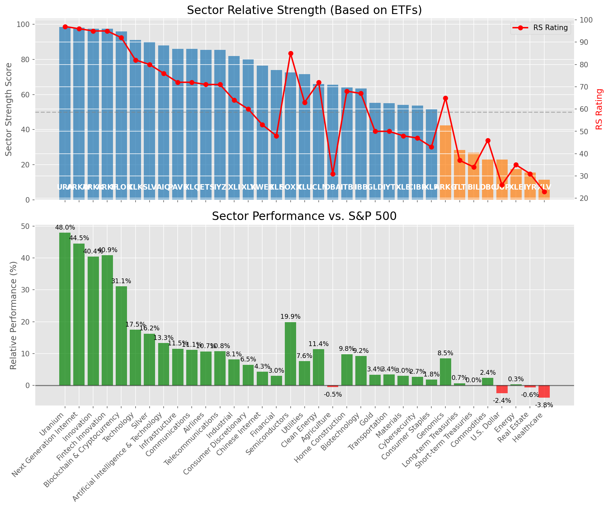

# **Daily Relative Strength Report**

**Date:** 2025-08-12

## **Market Valuation (Buffett Indicator)**

| Metric | Value |
|--------|-------|
| **Market Valuation** | **Overvalued** |
| **Current Ratio** | 10.39 |
| **Historical Mean** | 9.70 |
| **Standard Deviation** | 0.51 |
| **Z-Score (StdDev from Mean)** | 1.17 |
| **Total Market Cap** | $315.25 trillion |
| **GDP** | $30.33 trillion |

## **Market Insights**

### **Market is Overvalued**

The market appears to be trading above historical average valuations. While not at extreme levels, this suggests more modest future returns may be expected. Investors should:

- Focus on companies with reasonable valuations relative to their growth
- Be more selective with new positions
- Look for stocks showing relative strength within their sectors
- Consider trimming positions in extremely overvalued names

Historically, periods of mild overvaluation can persist for extended periods, but returns tend to be below average.

### **Buffett Indicator Overview**

The Buffett Indicator (Total Market Cap / GDP) is a measure of the stock market's valuation relative to the size of the economy. It is named after Warren Buffett, who described it as "probably the best single measure of where valuations stand at any given moment."

- **Values above +2 standard deviations:** Market significantly overvalued
- **Values above +1 standard deviation:** Market overvalued
- **Values between -1 and +1 standard deviations:** Market fairly valued
- **Values below -1 standard deviation:** Market undervalued
- **Values below -2 standard deviations:** Market significantly undervalued

---

## **Sector Relative Strength**

Based on William O'Neil's Relative Strength Methodology

| ETF | Strength | RS Rating | Performance | Above Key MAs | Trend | Sector |
|-----|----------|-----------|-------------|--------------|-------|--------|
| [URA](https://www.tradingview.com/chart/?symbol=URA) | 98.5 | 97.0 | 46.89% | 10d ✓, 50d ✓, 200d ✓ | ↗️ | Uranium |
| [ARKW](https://www.tradingview.com/chart/?symbol=ARKW) | 98.0 | 96.0 | 44.26% | 10d ✓, 50d ✓, 200d ✓ | ↗️ | Next Generation Internet |
| [ARKK](https://www.tradingview.com/chart/?symbol=ARKK) | 97.5 | 95.0 | 40.11% | 10d ✓, 50d ✓, 200d ✓ | ↗️ | Innovation |
| [ARKF](https://www.tradingview.com/chart/?symbol=ARKF) | 97.5 | 95.0 | 40.81% | 10d ✓, 50d ✓, 200d ✓ | ↗️ | Fintech Innovation |
| [BLOK](https://www.tradingview.com/chart/?symbol=BLOK) | 96.0 | 92.0 | 31.41% | 10d ✓, 50d ✓, 200d ✓ | ↗️ | Blockchain & Cryptocurrency |
| [XLK](https://www.tradingview.com/chart/?symbol=XLK) | 91.0 | 82.0 | 17.28% | 10d ✓, 50d ✓, 200d ✓ | ↗️ | Technology |
| [SLV](https://www.tradingview.com/chart/?symbol=SLV) | 90.5 | 81.0 | 16.37% | 10d ✓, 50d ✓, 200d ✓ | ↗️ | Silver |
| [AIQ](https://www.tradingview.com/chart/?symbol=AIQ) | 87.5 | 75.0 | 13.08% | 10d ✓, 50d ✓, 200d ✓ | ↗️ | Artificial Intelligence & Technology |
| [PAVE](https://www.tradingview.com/chart/?symbol=PAVE) | 86.0 | 72.0 | 11.48% | 10d ✓, 50d ✓, 200d ✓ | ↗️ | Infrastructure |
| [XLC](https://www.tradingview.com/chart/?symbol=XLC) | 85.5 | 71.0 | 10.98% | 10d ✓, 50d ✓, 200d ✓ | ↗️ | Communications |
| [JETS](https://www.tradingview.com/chart/?symbol=JETS) | 85.5 | 71.0 | 10.80% | 10d ✓, 50d ✓, 200d ✓ | ↗️ | Airlines |
| [IYZ](https://www.tradingview.com/chart/?symbol=IYZ) | 85.5 | 71.0 | 10.68% | 10d ✓, 50d ✓, 200d ✓ | ↗️ | Telecommunications |
| [XLI](https://www.tradingview.com/chart/?symbol=XLI) | 82.5 | 65.0 | 8.20% | 10d ✓, 50d ✓, 200d ✓ | ↗️ | Industrial |
| [XLY](https://www.tradingview.com/chart/?symbol=XLY) | 80.0 | 60.0 | 6.42% | 10d ✓, 50d ✓, 200d ✓ | ↗️ | Consumer Discretionary |
| [KWEB](https://www.tradingview.com/chart/?symbol=KWEB) | 76.0 | 52.0 | 4.10% | 10d ✓, 50d ✓, 200d ✓ | ↗️ | Chinese Internet |
| [XLF](https://www.tradingview.com/chart/?symbol=XLF) | 74.0 | 48.0 | 3.09% | 10d ✓, 50d ✓, 200d ✓ | ↗️ | Financial |
| [SOXX](https://www.tradingview.com/chart/?symbol=SOXX) | 72.5 | 85.0 | 19.75% | 10d ✓, 50d ✓, 200d ✓ | ↘️ | Semiconductors |
| [XLU](https://www.tradingview.com/chart/?symbol=XLU) | 71.6 | 63.0 | 7.38% | 10d ✗, 50d ✓, 200d ✓ | ↗️ | Utilities |
| [ICLN](https://www.tradingview.com/chart/?symbol=ICLN) | 66.0 | 72.0 | 11.17% | 10d ✓, 50d ✓, 200d ✓ | ↘️ | Clean Energy |
| [DBA](https://www.tradingview.com/chart/?symbol=DBA) | 65.5 | 31.0 | -0.65% | 10d ✓, 50d ✓, 200d ✓ | ↗️ | Agriculture |
| [ITB](https://www.tradingview.com/chart/?symbol=ITB) | 64.0 | 68.0 | 9.76% | 10d ✓, 50d ✓, 200d ✓ | ↘️ | Home Construction |
| [IBB](https://www.tradingview.com/chart/?symbol=IBB) | 63.5 | 67.0 | 9.23% | 10d ✓, 50d ✓, 200d ✓ | ↘️ | Biotechnology |
| [IYT](https://www.tradingview.com/chart/?symbol=IYT) | 55.0 | 50.0 | 3.57% | 10d ✓, 50d ✓, 200d ✓ | ↘️ | Transportation |
| [GLD](https://www.tradingview.com/chart/?symbol=GLD) | 54.7 | 49.0 | 3.36% | 10d ✗, 50d ✗, 200d ✓ | ↗️ | Gold |
| [CIBR](https://www.tradingview.com/chart/?symbol=CIBR) | 53.2 | 46.0 | 2.47% | 10d ✗, 50d ✗, 200d ✓ | ↗️ | Cybersecurity |
| [XLP](https://www.tradingview.com/chart/?symbol=XLP) | 52.0 | 44.0 | 1.91% | 10d ✓, 50d ✓, 200d ✓ | ↘️ | Consumer Staples |
| [XLB](https://www.tradingview.com/chart/?symbol=XLB) | 43.6 | 47.0 | 2.89% | 10d ✓, 50d ✗, 200d ✓ | ↘️ | Materials |
| [ARKG](https://www.tradingview.com/chart/?symbol=ARKG) | 42.4 | 65.0 | 8.29% | 10d ✓, 50d ✗, 200d ✗ | ↘️ | Genomics |
| [TLT](https://www.tradingview.com/chart/?symbol=TLT) | 27.9 | 36.0 | 0.60% | 10d ✗, 50d ✓, 200d ✗ | ↘️ | Long-term Treasuries |
| [BIL](https://www.tradingview.com/chart/?symbol=BIL) | 26.9 | 34.0 | 0.04% | 10d ✓, 50d ✗, 200d ✗ | ↘️ | Short-term Treasuries |
| [DBC](https://www.tradingview.com/chart/?symbol=DBC) | 25.0 | 50.0 | 3.55% | 10d ✗, 50d ✗, 200d ✗ | ↘️ | Commodities |
| [UUP](https://www.tradingview.com/chart/?symbol=UUP) | 22.9 | 26.0 | -2.32% | 10d ✗, 50d ✓, 200d ✗ | ↘️ | U.S. Dollar |
| [XLE](https://www.tradingview.com/chart/?symbol=XLE) | 18.0 | 36.0 | 0.46% | 10d ✗, 50d ✗, 200d ✗ | ↘️ | Energy |
| [IYR](https://www.tradingview.com/chart/?symbol=IYR) | 15.5 | 31.0 | -0.86% | 10d ✗, 50d ✗, 200d ✗ | ↘️ | Real Estate |
| [XLV](https://www.tradingview.com/chart/?symbol=XLV) | 11.5 | 23.0 | -3.80% | 10d ✗, 50d ✗, 200d ✗ | ↘️ | Healthcare |

### **Sector ETF Performance Interpretation**

This table shows the relative strength metrics for different market sectors based on their representative ETFs:

- **ETF**: The ETF used to measure sector performance (click for chart)
- **Strength**: Overall sector strength score (0-100) combining multiple factors
- **RS Rating**: O'Neil RS rating of the sector ETF
- **Performance**: Performance of the sector ETF relative to SPY
- **Above Key MAs**: Whether the ETF is trading above its 10, 50, and 200-day moving averages
- **Trend**: Whether the sector is in an uptrend (↗️) or downtrend (↘️)

### **Current Sector Leadership**

The current market leadership is coming from the following sectors: **Uranium, Next Generation Internet, Innovation**.

The **Uranium** sector (represented by **URA**) is showing particularly strong relative strength with an RS rating of 97.0 and performance of 46.89% vs. the S&P 500. This sector is trading above its 10-day, 50-day, 200-day moving average(s). Investors should consider focusing on high RS stocks within these leading sectors for potential outperformance.

---

## **Buy Recommendations**

The following 85 stocks show exceptional relative strength:

| RS Rating | Buy Score | Current Price | Chart | Name | Ticker |
|-----------|-----------|---------------|-------|------|--------|
| 100 | 100 | $67.89 | [Chart](https://www.tradingview.com/chart/?symbol=KTOS) | Kratos Defense & Security Solutions, Inc. | KTOS |
| 100 | 100 | $222.24 | [Chart](https://www.tradingview.com/chart/?symbol=LEU) | Centrus Energy Corp. | LEU |
| 100 | 100 | $114.78 | [Chart](https://www.tradingview.com/chart/?symbol=HOOD) | Robinhood Markets, Inc. Class A Common Stock | HOOD |
| 100 | 100 | $72.89 | [Chart](https://www.tradingview.com/chart/?symbol=MP) | MP Materials Corp. | MP |
| 100 | 100 | $209.93 | [Chart](https://www.tradingview.com/chart/?symbol=CLS) | Celestica, Inc. | CLS |
| 100 | 100 | $121.89 | [Chart](https://www.tradingview.com/chart/?symbol=CRDO) | Credo Technology Group Holding Ltd Ordinary Shares | CRDO |
| 99 | 100 | $92.23 | [Chart](https://www.tradingview.com/chart/?symbol=GDXU) | MicroSectors Gold Miners 3x Leveraged ETN | GDXU |
| 99 | 100 | $82.87 | [Chart](https://www.tradingview.com/chart/?symbol=LIF) | Life360, Inc. Common Stock | LIF |
| 99 | 100 | $130.31 | [Chart](https://www.tradingview.com/chart/?symbol=RBLX) | Roblox Corporation | RBLX |
| 98 | 100 | $46.41 | [Chart](https://www.tradingview.com/chart/?symbol=TTMI) | TTM Technologies Inc | TTMI |
| 98 | 100 | $655.86 | [Chart](https://www.tradingview.com/chart/?symbol=GEV) | GE Vernova Inc. | GEV |
| 98 | 100 | $191.83 | [Chart](https://www.tradingview.com/chart/?symbol=COOP) | Mr. Cooper Group Inc. Common Stock | COOP |
| 98 | 100 | $94.84 | [Chart](https://www.tradingview.com/chart/?symbol=RYTM) | Rhythm Pharmaceuticals, Inc. Common Stock | RYTM |
| 98 | 100 | $185.52 | [Chart](https://www.tradingview.com/chart/?symbol=PLTR) | Palantir Technologies Inc. Class A Common Stock | PLTR |
| 97 | 100 | $165.49 | [Chart](https://www.tradingview.com/chart/?symbol=FUTU) | Futu Holdings Limited American Depositary Shares | FUTU |
| 97 | 100 | $122.67 | [Chart](https://www.tradingview.com/chart/?symbol=SANM) | Sanmina  Corp | SANM |
| 97 | 100 | $25.50 | [Chart](https://www.tradingview.com/chart/?symbol=ACAD) | Acadia Pharmaceuticals Inc. | ACAD |
| 97 | 100 | $23.85 | [Chart](https://www.tradingview.com/chart/?symbol=LQDA) | Liquidia Corporation Common Stock | LQDA |
| 96 | 100 | $57.99 | [Chart](https://www.tradingview.com/chart/?symbol=BTI) | British American Tobacco p.l.c. American Depositary Shares, American Depositary Shares, each representing one Ordinary Share | BTI |
| 96 | 100 | $57.19 | [Chart](https://www.tradingview.com/chart/?symbol=AU) | AngloGold Ashanti plc | AU |
| 96 | 100 | $66.82 | [Chart](https://www.tradingview.com/chart/?symbol=MRCY) | Mercury Systems Inc. | MRCY |
| 96 | 100 | $36.11 | [Chart](https://www.tradingview.com/chart/?symbol=NNE) | Nano Nuclear Energy Inc. Common Stock | NNE |
| 96 | 100 | $161.71 | [Chart](https://www.tradingview.com/chart/?symbol=ARKW) | ARK Next Generation Internet ETF | ARKW |
| 95 | 100 | $121.84 | [Chart](https://www.tradingview.com/chart/?symbol=PPLT) | abrdn Physical Platinum Shares ETF | PPLT |
| 95 | 100 | $96.38 | [Chart](https://www.tradingview.com/chart/?symbol=EBAY) | eBay Inc | EBAY |
| 95 | 100 | $55.17 | [Chart](https://www.tradingview.com/chart/?symbol=ARKF) | ARK Fintech Innovation ETF | ARKF |
| 95 | 100 | $31.71 | [Chart](https://www.tradingview.com/chart/?symbol=PAAS) | Pan American Silver Corp. | PAAS |
| 95 | 100 | $51.52 | [Chart](https://www.tradingview.com/chart/?symbol=REVG) | REV Group, Inc. | REVG |
| 94 | 100 | $30.85 | [Chart](https://www.tradingview.com/chart/?symbol=OR) | OR Royalties Inc. | OR |
| 94 | 100 | $261.98 | [Chart](https://www.tradingview.com/chart/?symbol=DASH) | DoorDash, Inc. Class A Common Stock | DASH |
| 94 | 100 | $67.57 | [Chart](https://www.tradingview.com/chart/?symbol=IBKR) | Interactive Brokers Group, Inc. Class A Common Stock | IBKR |
| 94 | 100 | $54.25 | [Chart](https://www.tradingview.com/chart/?symbol=SIL) | Global X Silver Miners ETF (NEW) | SIL |
| 94 | 100 | $96.16 | [Chart](https://www.tradingview.com/chart/?symbol=TPB) | Turning Point Brands, Inc. | TPB |
| 93 | 100 | $111.59 | [Chart](https://www.tradingview.com/chart/?symbol=TPR) | Tapestry, Inc. Common Stock | TPR |
| 93 | 100 | $465.85 | [Chart](https://www.tradingview.com/chart/?symbol=APP) | Applovin Corporation Class A Common Stock | APP |
| 93 | 100 | $26.68 | [Chart](https://www.tradingview.com/chart/?symbol=TFPM) | Triple Flag Precious Metals Corp. | TFPM |
| 93 | 100 | $47.84 | [Chart](https://www.tradingview.com/chart/?symbol=BBIO) | BridgeBio Pharma, Inc. Common Stock | BBIO |
| 92 | 100 | $36.19 | [Chart](https://www.tradingview.com/chart/?symbol=DB) | Deutsche Bank Aktiengesellschaft | DB |
| 92 | 100 | $110.28 | [Chart](https://www.tradingview.com/chart/?symbol=APH) | Amphenol Corporation | APH |
| 92 | 100 | $54.88 | [Chart](https://www.tradingview.com/chart/?symbol=GH) | Guardant Health, Inc. Common Stock | GH |
| 92 | 100 | $58.20 | [Chart](https://www.tradingview.com/chart/?symbol=CALX) | CALIX, INC. | CALX |
| 91 | 100 | $23.04 | [Chart](https://www.tradingview.com/chart/?symbol=MAG) | MAG Silver Corp. | MAG |
| 91 | 100 | $21.86 | [Chart](https://www.tradingview.com/chart/?symbol=MIR) | Mirion Technologies, Inc. | MIR |
| 91 | 100 | $498.48 | [Chart](https://www.tradingview.com/chart/?symbol=CW) | Curtiss-Wright Corp. | CW |
| 91 | 100 | $59.11 | [Chart](https://www.tradingview.com/chart/?symbol=VIK) | Viking Holdings Ltd | VIK |
| 90 | 100 | $134.42 | [Chart](https://www.tradingview.com/chart/?symbol=AEM) | Agnico Eagle Mines Ltd. | AEM |
| 90 | 100 | $28.40 | [Chart](https://www.tradingview.com/chart/?symbol=KAR) | OPENLANE, Inc | KAR |
| 90 | 100 | $279.63 | [Chart](https://www.tradingview.com/chart/?symbol=GE) | GE Aerospace | GE |
| 90 | 100 | $94.98 | [Chart](https://www.tradingview.com/chart/?symbol=C) | Citigroup Inc. | C |
| 90 | 100 | $43.35 | [Chart](https://www.tradingview.com/chart/?symbol=LTM) | LATAM Airlines Group S.A. American Depositary Shares (each representing two thousand (2,000) shares of Common Stock) | LTM |
| 89 | 100 | $266.31 | [Chart](https://www.tradingview.com/chart/?symbol=IDCC) | InterDigital, Inc. | IDCC |
| 88 | 100 | $57.88 | [Chart](https://www.tradingview.com/chart/?symbol=GDX) | VanEck Gold Miners ETF | GDX |
| 88 | 100 | $59.19 | [Chart](https://www.tradingview.com/chart/?symbol=ERJ) | Embraer S.A. | ERJ |
| 88 | 100 | $72.50 | [Chart](https://www.tradingview.com/chart/?symbol=GDXJ) | VanEck Junior Gold Miners ETF | GDXJ |
| 88 | 100 | $175.84 | [Chart](https://www.tradingview.com/chart/?symbol=SE) | Sea Limited American Depositary Shares, each representing one Class A Ordinary Share | SE |
| 88 | 100 | $159.69 | [Chart](https://www.tradingview.com/chart/?symbol=VSEC) | VSE Corp | VSEC |
| 87 | 100 | $20.32 | [Chart](https://www.tradingview.com/chart/?symbol=BCS) | Barclays PLC | BCS |
| 87 | 100 | $96.19 | [Chart](https://www.tradingview.com/chart/?symbol=WPM) | Wheaton Precious Metals Corp. Common Stock | WPM |
| 89 | 99 | $266.98 | [Chart](https://www.tradingview.com/chart/?symbol=WTS) | Watts Water Technologies, Inc. Class A | WTS |
| 89 | 99 | $193.79 | [Chart](https://www.tradingview.com/chart/?symbol=ASND) | Ascendis Pharma A/S American Depositary Shares | ASND |
| 88 | 98 | $191.96 | [Chart](https://www.tradingview.com/chart/?symbol=AWI) | Armstrong World Industries, Inc. | AWI |
| 88 | 98 | $66.36 | [Chart](https://www.tradingview.com/chart/?symbol=MAIN) | Main Street Capital Corporation | MAIN |
| 87 | 97 | $31.46 | [Chart](https://www.tradingview.com/chart/?symbol=IIIV) | i3 Verticals, Inc. Class A Common Stock | IIIV |
| 86 | 97 | $249.20 | [Chart](https://www.tradingview.com/chart/?symbol=BAP) | Credicorp LTD | BAP |
| 86 | 97 | $116.00 | [Chart](https://www.tradingview.com/chart/?symbol=SXT) | Sensient Technology Corporation | SXT |
| 85 | 97 | $104.11 | [Chart](https://www.tradingview.com/chart/?symbol=BK) | Bank of New York Mellon Corporation | BK |
| 86 | 96 | $18.16 | [Chart](https://www.tradingview.com/chart/?symbol=BVN) | Compania de Minas Buenaventura S.A. | BVN |
| 85 | 95 | $48.09 | [Chart](https://www.tradingview.com/chart/?symbol=FAST) | Fastenal Co | FAST |
| 85 | 95 | $51.45 | [Chart](https://www.tradingview.com/chart/?symbol=FHI) | Federated Hermes, Inc. | FHI |
| 85 | 95 | $197.68 | [Chart](https://www.tradingview.com/chart/?symbol=ITA) | iShares U.S. Aerospace & Defense ETF | ITA |
| 84 | 94 | $147.26 | [Chart](https://www.tradingview.com/chart/?symbol=PPA) | Invesco Aerospace & Defense ETF | PPA |
| 81 | 94 | $48.06 | [Chart](https://www.tradingview.com/chart/?symbol=CIB) | Grupo Cibest S.A. American Depositary Shares (each representing four (4) Preferred Shares) | CIB |
| 83 | 93 | $12.88 | [Chart](https://www.tradingview.com/chart/?symbol=PSLV) | Sprott Physical Silver Trust | PSLV |
| 82 | 93 | $33.91 | [Chart](https://www.tradingview.com/chart/?symbol=HODL) | VanEck Bitcoin ETF | HODL |
| 82 | 93 | $68.08 | [Chart](https://www.tradingview.com/chart/?symbol=IBIT) | iShares Bitcoin Trust ETF | IBIT |
| 81 | 93 | $87.56 | [Chart](https://www.tradingview.com/chart/?symbol=LLYVK) | Liberty Media Corporation Series C Liberty Live Common Stock | LLYVK |
| 80 | 93 | $47.27 | [Chart](https://www.tradingview.com/chart/?symbol=EWP) | iShares MSCI Spain ETF | EWP |
| 80 | 93 | $26.07 | [Chart](https://www.tradingview.com/chart/?symbol=LAUR) | Laureate Education, Inc. Common Stock | LAUR |
| 80 | 93 | $120.46 | [Chart](https://www.tradingview.com/chart/?symbol=GILD) | Gilead Sciences Inc | GILD |
| 81 | 92 | $36.17 | [Chart](https://www.tradingview.com/chart/?symbol=SIVR) | abrdn Physical Silver Shares ETF | SIVR |
| 81 | 92 | $34.48 | [Chart](https://www.tradingview.com/chart/?symbol=SLV) | iShares Silver Trust | SLV |
| 80 | 92 | $71.33 | [Chart](https://www.tradingview.com/chart/?symbol=CSCO) | Cisco Systems, Inc. Common Stock (DE) | CSCO |
| 80 | 92 | $35.13 | [Chart](https://www.tradingview.com/chart/?symbol=APG) | APi Group Corporation | APG |
| 80 | 91 | $230.52 | [Chart](https://www.tradingview.com/chart/?symbol=BA) | Boeing Company | BA |
| 80 | 91 | $118.12 | [Chart](https://www.tradingview.com/chart/?symbol=SPMO) | Invesco S&P 500 Momentum ETF | SPMO |

---

## **Sell Recommendations**

The following 91 stocks show deteriorating relative strength:

| RS Rating | Sell Score | Current Price | Chart | Name | Ticker |
|-----------|------------|---------------|-------|------|--------|
| 1 | 100 | $11.63 | [Chart](https://www.tradingview.com/chart/?symbol=NVDS) | Investment Managers Series Trust II Tradr 1.5X Short NVDA Daily ETF | NVDS |
| 1 | 100 | $22.93 | [Chart](https://www.tradingview.com/chart/?symbol=TECS) | Direxion Daily Technology Bear 3x Shares | TECS |
| 1 | 100 | $191.06 | [Chart](https://www.tradingview.com/chart/?symbol=LULU) | lululemon athletica inc. | LULU |
| 2 | 100 | $24.78 | [Chart](https://www.tradingview.com/chart/?symbol=CRI) | Carter's Inc. | CRI |
| 2 | 100 | $13.71 | [Chart](https://www.tradingview.com/chart/?symbol=CLBT) | Cellebrite DI Ltd. Class A Ordinary Shares | CLBT |
| 3 | 100 | $23.60 | [Chart](https://www.tradingview.com/chart/?symbol=ZSL) | ProShares UltraShort Silver | ZSL |
| 4 | 100 | $40.73 | [Chart](https://www.tradingview.com/chart/?symbol=OXM) | Oxford Industries, Inc. | OXM |
| 5 | 100 | $23.26 | [Chart](https://www.tradingview.com/chart/?symbol=QID) | ProShares UltraShort QQQ | QID |
| 6 | 100 | $16.17 | [Chart](https://www.tradingview.com/chart/?symbol=S) | SentinelOne, Inc. | S |
| 6 | 100 | $23.44 | [Chart](https://www.tradingview.com/chart/?symbol=CRTO) | Criteo S.A. | CRTO |
| 7 | 100 | $39.34 | [Chart](https://www.tradingview.com/chart/?symbol=BILL) | BILL Holdings, Inc. | BILL |
| 7 | 100 | $20.34 | [Chart](https://www.tradingview.com/chart/?symbol=GAP) | The Gap, Inc. | GAP |
| 7 | 100 | $12.04 | [Chart](https://www.tradingview.com/chart/?symbol=ARDT) | Ardent Health, Inc. | ARDT |
| 11 | 100 | $40.83 | [Chart](https://www.tradingview.com/chart/?symbol=SDOW) | ProShares UltraPro Short Dow 30 | SDOW |
| 12 | 100 | $32.00 | [Chart](https://www.tradingview.com/chart/?symbol=JD) | JD.com, Inc. | JD |
| 12 | 100 | $13.74 | [Chart](https://www.tradingview.com/chart/?symbol=VRE) | Veris Residential, Inc. | VRE |
| 16 | 100 | $16.27 | [Chart](https://www.tradingview.com/chart/?symbol=CTO) | CTO Realty Growth, Inc. | CTO |
| 9 | 99 | $28.52 | [Chart](https://www.tradingview.com/chart/?symbol=BBWI) | Bath & Body Works, Inc. | BBWI |
| 11 | 99 | $16.42 | [Chart](https://www.tradingview.com/chart/?symbol=BTAL) | AGF U.S. Market Neutral Anti-Beta Fund | BTAL |
| 6 | 98 | $212.99 | [Chart](https://www.tradingview.com/chart/?symbol=WDAY) | Workday, Inc. Class A Common Stock | WDAY |
| 6 | 98 | $14.58 | [Chart](https://www.tradingview.com/chart/?symbol=PRO) | Pros Holdings, Inc. | PRO |
| 17 | 98 | $25.23 | [Chart](https://www.tradingview.com/chart/?symbol=FCPT) | Four Corners Property Trust, Inc. | FCPT |
| 8 | 96 | $138.06 | [Chart](https://www.tradingview.com/chart/?symbol=MAA) | Mid-America Apartment Communities, Inc. | MAA |
| 15 | 96 | $36.41 | [Chart](https://www.tradingview.com/chart/?symbol=VNO) | Vornado Realty Trust | VNO |
| 16 | 96 | $24.05 | [Chart](https://www.tradingview.com/chart/?symbol=DXD) | ProShares UltraShort Dow 30 | DXD |
| 13 | 95 | $34.12 | [Chart](https://www.tradingview.com/chart/?symbol=AMH) | AMERICAN HOMES 4 RENT | AMH |
| 15 | 95 | $38.56 | [Chart](https://www.tradingview.com/chart/?symbol=SH) | ProShares Short S&P500 | SH |
| 6 | 94 | $29.05 | [Chart](https://www.tradingview.com/chart/?symbol=SMPL) | The Simply Good Foods Company Common Stock | SMPL |
| 13 | 94 | $14.88 | [Chart](https://www.tradingview.com/chart/?symbol=PLSE) | Pulse Biosciences, Inc Common Stock (DE) | PLSE |
| 18 | 94 | $46.01 | [Chart](https://www.tradingview.com/chart/?symbol=EDU) | New Oriental Education and Technology Group, Inc. American Depositary Shares (each representing ten (10) Common Shares) | EDU |
| 19 | 94 | $47.84 | [Chart](https://www.tradingview.com/chart/?symbol=FR) | First Industrial Realty Trust, Inc. | FR |
| 7 | 93 | $10.61 | [Chart](https://www.tradingview.com/chart/?symbol=DVAX) | Dynavax Technologies Corporation | DVAX |
| 11 | 93 | $103.89 | [Chart](https://www.tradingview.com/chart/?symbol=CPT) | Camden Property Trust | CPT |
| 12 | 93 | $32.36 | [Chart](https://www.tradingview.com/chart/?symbol=PSQ) | ProShares Short QQQ | PSQ |
| 12 | 93 | $37.61 | [Chart](https://www.tradingview.com/chart/?symbol=UDR) | UDR, Inc. | UDR |
| 19 | 93 | $16.16 | [Chart](https://www.tradingview.com/chart/?symbol=UMH) | UMH Properties, Inc. | UMH |
| 20 | 93 | $22.36 | [Chart](https://www.tradingview.com/chart/?symbol=CURB) | Curbline Properties Corp. | CURB |
| 14 | 92 | $13.32 | [Chart](https://www.tradingview.com/chart/?symbol=EWTX) | Edgewise Therapeutics, Inc. Common Stock | EWTX |
| 11 | 91 | $36.72 | [Chart](https://www.tradingview.com/chart/?symbol=LZB) | La-Z-Boy Incorporated | LZB |
| 17 | 91 | $49.08 | [Chart](https://www.tradingview.com/chart/?symbol=BIRK) | Birkenstock Holding plc | BIRK |
| 19 | 90 | $37.45 | [Chart](https://www.tradingview.com/chart/?symbol=KSA) | iShares MSCI Saudi Arabia ETF | KSA |
| 19 | 89 | $12.01 | [Chart](https://www.tradingview.com/chart/?symbol=PMT) | PennyMac Mortgage Investment Trust | PMT |
| 20 | 89 | $25.52 | [Chart](https://www.tradingview.com/chart/?symbol=WY) | Weyerhaeuser Company | WY |
| 13 | 88 | $15.15 | [Chart](https://www.tradingview.com/chart/?symbol=MCS) | The Marcus Corporation | MCS |
| 16 | 88 | $12.67 | [Chart](https://www.tradingview.com/chart/?symbol=CCRN) | Cross Country Healthcare Inc | CCRN |
| 21 | 88 | $11.99 | [Chart](https://www.tradingview.com/chart/?symbol=WSR) | Whitestone REIT | WSR |
| 19 | 87 | $12.94 | [Chart](https://www.tradingview.com/chart/?symbol=NAVI) | Navient Corporation | NAVI |
| 17 | 86 | $28.61 | [Chart](https://www.tradingview.com/chart/?symbol=CNX) | CNX Resources Corporation | CNX |
| 20 | 85 | $12.18 | [Chart](https://www.tradingview.com/chart/?symbol=NU) | Nu Holdings Ltd. | NU |
| 20 | 85 | $104.36 | [Chart](https://www.tradingview.com/chart/?symbol=PLD) | PROLOGIS, INC. | PLD |
| 23 | 84 | $12.04 | [Chart](https://www.tradingview.com/chart/?symbol=RQI) | COHEN & STEERS QUALITY INCOME REALTY FUND, INC. COMMON SHARES | RQI |
| 21 | 83 | $14.21 | [Chart](https://www.tradingview.com/chart/?symbol=INMD) | InMode Ltd. Ordinary Shares | INMD |
| 20 | 82 | $29.88 | [Chart](https://www.tradingview.com/chart/?symbol=EPRT) | Essential Properties Realty Trust, Inc. | EPRT |
| 20 | 82 | $68.38 | [Chart](https://www.tradingview.com/chart/?symbol=PYPL) | PayPal Holdings, Inc. Common Stock | PYPL |
| 21 | 82 | $87.28 | [Chart](https://www.tradingview.com/chart/?symbol=TRU) | TransUnion | TRU |
| 22 | 82 | $29.95 | [Chart](https://www.tradingview.com/chart/?symbol=CNQ) | Canadian Natural Resources Limited | CNQ |
| 24 | 82 | $19.27 | [Chart](https://www.tradingview.com/chart/?symbol=CVBF) | CVB Financial Corp | CVBF |
| 25 | 82 | $55.13 | [Chart](https://www.tradingview.com/chart/?symbol=IYH) | iShares U.S. Healthcare ETF | IYH |
| 26 | 82 | $24.48 | [Chart](https://www.tradingview.com/chart/?symbol=CGON) | CG Oncology, Inc. Common stock | CGON |
| 30 | 82 | $45.47 | [Chart](https://www.tradingview.com/chart/?symbol=SON) | Sonoco Products Company | SON |
| 20 | 81 | $217.47 | [Chart](https://www.tradingview.com/chart/?symbol=SBAC) | SBA Communications Corp | SBAC |
| 22 | 81 | $14.35 | [Chart](https://www.tradingview.com/chart/?symbol=DEI) | Douglas Emmett, Inc. | DEI |
| 25 | 81 | $27.28 | [Chart](https://www.tradingview.com/chart/?symbol=IVT) | InvenTrust Properties Corp. | IVT |
| 28 | 81 | $23.63 | [Chart](https://www.tradingview.com/chart/?symbol=FFBC) | First Financial Bancorp | FFBC |
| 27 | 80 | $45.48 | [Chart](https://www.tradingview.com/chart/?symbol=GLPI) | Gaming and Leisure Properties, Inc. | GLPI |
| 27 | 80 | $44.07 | [Chart](https://www.tradingview.com/chart/?symbol=SW) | Smurfit Westrock plc | SW |
| 22 | 79 | $10.71 | [Chart](https://www.tradingview.com/chart/?symbol=NFBK) | Northfield Bancorp, Inc. | NFBK |
| 29 | 79 | $88.29 | [Chart](https://www.tradingview.com/chart/?symbol=VNQ) | Vanguard Real Estate ETF | VNQ |
| 23 | 78 | $25.45 | [Chart](https://www.tradingview.com/chart/?symbol=DOG) | ProShares Short Dow30 | DOG |
| 28 | 78 | $30.74 | [Chart](https://www.tradingview.com/chart/?symbol=MBIN) | Merchants Bancorp Common Stock | MBIN |
| 30 | 78 | $64.56 | [Chart](https://www.tradingview.com/chart/?symbol=ZROZ) | PIMCO 25+ Year Zero Coupon U.S. Treasury Index Exchange-Traded Fund | ZROZ |
| 30 | 78 | $95.17 | [Chart](https://www.tradingview.com/chart/?symbol=RWR) | SPDR Dow Jones REIT ETF | RWR |
| 27 | 76 | $33.90 | [Chart](https://www.tradingview.com/chart/?symbol=FFIN) | First Financial Bankshares Inc | FFIN |
| 39 | 76 | $15.36 | [Chart](https://www.tradingview.com/chart/?symbol=FXN) | First Trust Energy AlphaDEX Fund | FXN |
| 28 | 75 | $124.39 | [Chart](https://www.tradingview.com/chart/?symbol=XPO) | XPO, Inc. | XPO |
| 31 | 75 | $15.85 | [Chart](https://www.tradingview.com/chart/?symbol=MARA) | MARA Holdings, Inc. Common Stock | MARA |
| 37 | 75 | $41.38 | [Chart](https://www.tradingview.com/chart/?symbol=SRLN) | SPDR Blackstone Senior Loan ETF | SRLN |
| 31 | 74 | $60.92 | [Chart](https://www.tradingview.com/chart/?symbol=UL) | Unilever plc | UL |
| 31 | 74 | $13.83 | [Chart](https://www.tradingview.com/chart/?symbol=DOLE) | Dole plc | DOLE |
| 37 | 73 | $14.88 | [Chart](https://www.tradingview.com/chart/?symbol=GBDC) | Golub Capital BDC, Inc. | GBDC |
| 32 | 72 | $41.34 | [Chart](https://www.tradingview.com/chart/?symbol=NNN) | NNN REIT, Inc. | NNN |
| 33 | 72 | $17.39 | [Chart](https://www.tradingview.com/chart/?symbol=NBBK) | NB Bancorp, Inc. Common Stock | NBBK |
| 38 | 72 | $116.64 | [Chart](https://www.tradingview.com/chart/?symbol=A) | Agilent Technologies Inc. | A |
| 31 | 71 | $44.87 | [Chart](https://www.tradingview.com/chart/?symbol=IHDG) | WisdomTree International Hedged Quality Dividend Growth Fund | IHDG |
| 37 | 71 | $153.16 | [Chart](https://www.tradingview.com/chart/?symbol=QCOM) | Qualcomm Inc | QCOM |
| 31 | 70 | $37.47 | [Chart](https://www.tradingview.com/chart/?symbol=FRME) | First Merchants Corp | FRME |
| 37 | 70 | $223.02 | [Chart](https://www.tradingview.com/chart/?symbol=ABG) | Asbury Automotive Group, Inc. | ABG |
| 37 | 70 | $24.15 | [Chart](https://www.tradingview.com/chart/?symbol=FLBL) | Franklin Senior Loan ETF | FLBL |
| 32 | 68 | $47.78 | [Chart](https://www.tradingview.com/chart/?symbol=IP) | International Paper Co. | IP |
| 39 | 67 | $13.11 | [Chart](https://www.tradingview.com/chart/?symbol=RA) | Brookfield Real Assets Income Fund Inc. | RA |
| 38 | 66 | $36.35 | [Chart](https://www.tradingview.com/chart/?symbol=STBA) | S&T Bancorp Inc | STBA |

## **Methodology**

This report uses William O'Neil's relative strength methodology from Investors Business Daily:

* **RS Rating**: Percentile rank of stock's performance vs. S&P 500 over the past 63 trading days (1-99 scale)
* **Buy Criteria**: RS Rating >= 80, price above 50-day MA, strong uptrend, increasing volume
* **Sell Criteria**: RS Rating < 40, price below 50-day MA, downtrend, decreasing volume

### **O'Neil's Key Principles**

1. **Focus on relative performance** - stocks outperforming the market
2. **Price trend confirmation** - stock must be in an uptrend
3. **Volume confirmation** - strong volume supports price moves
4. **Moving average validation** - price above key moving averages
5. **Market leaders only** - concentrate on top-performing stocks

*Report generated automatically after market close*