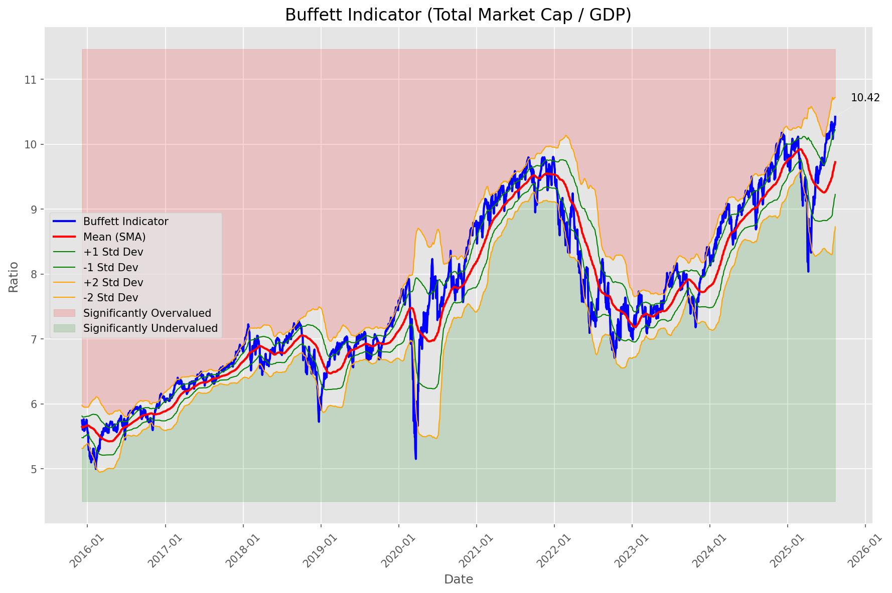
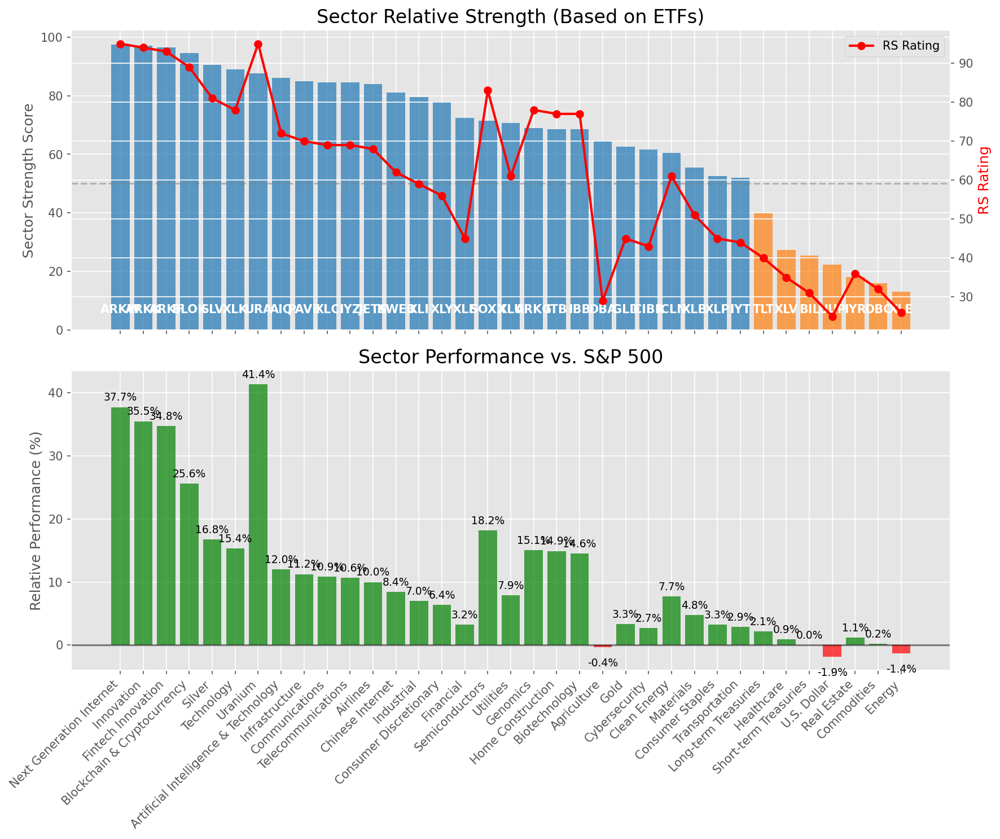

# **Daily Relative Strength Report**

**Date:** 2025-08-13

## **Market Valuation (Buffett Indicator)**

| Metric | Value |
|--------|-------|
| **Market Valuation** | **Overvalued** |
| **Current Ratio** | 10.46 |
| **Historical Mean** | 9.72 |
| **Standard Deviation** | 0.50 |
| **Z-Score (StdDev from Mean)** | 1.41 |
| **Total Market Cap** | $317.32 trillion |
| **GDP** | $30.33 trillion |

## **Market Insights**

### **Market is Overvalued**

The market appears to be trading above historical average valuations. While not at extreme levels, this suggests more modest future returns may be expected. Investors should:

- Focus on companies with reasonable valuations relative to their growth
- Be more selective with new positions
- Look for stocks showing relative strength within their sectors
- Consider trimming positions in extremely overvalued names

Historically, periods of mild overvaluation can persist for extended periods, but returns tend to be below average.

### **Buffett Indicator Overview**

The Buffett Indicator (Total Market Cap / GDP) is a measure of the stock market's valuation relative to the size of the economy. It is named after Warren Buffett, who described it as "probably the best single measure of where valuations stand at any given moment."

- **Values above +2 standard deviations:** Market significantly overvalued
- **Values above +1 standard deviation:** Market overvalued
- **Values between -1 and +1 standard deviations:** Market fairly valued
- **Values below -1 standard deviation:** Market undervalued
- **Values below -2 standard deviations:** Market significantly undervalued

---

## **Sector Relative Strength**

Based on William O'Neil's Relative Strength Methodology

| ETF | Strength | RS Rating | Performance | Above Key MAs | Trend | Sector |
|-----|----------|-----------|-------------|--------------|-------|--------|
| [ARKW](https://www.tradingview.com/chart/?symbol=ARKW) | 97.0 | 94.0 | 37.72% | 10d ✓, 50d ✓, 200d ✓ | ↗️ | Next Generation Internet |
| [ARKK](https://www.tradingview.com/chart/?symbol=ARKK) | 97.0 | 94.0 | 36.05% | 10d ✓, 50d ✓, 200d ✓ | ↗️ | Innovation |
| [ARKF](https://www.tradingview.com/chart/?symbol=ARKF) | 96.5 | 93.0 | 34.98% | 10d ✓, 50d ✓, 200d ✓ | ↗️ | Fintech Innovation |
| [BLOK](https://www.tradingview.com/chart/?symbol=BLOK) | 94.5 | 89.0 | 25.87% | 10d ✓, 50d ✓, 200d ✓ | ↗️ | Blockchain & Cryptocurrency |
| [SLV](https://www.tradingview.com/chart/?symbol=SLV) | 90.0 | 80.0 | 16.76% | 10d ✓, 50d ✓, 200d ✓ | ↗️ | Silver |
| [XLK](https://www.tradingview.com/chart/?symbol=XLK) | 88.5 | 77.0 | 15.30% | 10d ✓, 50d ✓, 200d ✓ | ↗️ | Technology |
| [URA](https://www.tradingview.com/chart/?symbol=URA) | 87.6 | 95.0 | 41.99% | 10d ✗, 50d ✓, 200d ✓ | ↗️ | Uranium |
| [PAVE](https://www.tradingview.com/chart/?symbol=PAVE) | 86.0 | 72.0 | 11.97% | 10d ✓, 50d ✓, 200d ✓ | ↗️ | Infrastructure |
| [AIQ](https://www.tradingview.com/chart/?symbol=AIQ) | 85.5 | 71.0 | 11.84% | 10d ✓, 50d ✓, 200d ✓ | ↗️ | Artificial Intelligence & Technology |
| [XLC](https://www.tradingview.com/chart/?symbol=XLC) | 84.5 | 69.0 | 11.02% | 10d ✓, 50d ✓, 200d ✓ | ↗️ | Communications |
| [IYZ](https://www.tradingview.com/chart/?symbol=IYZ) | 84.5 | 69.0 | 10.66% | 10d ✓, 50d ✓, 200d ✓ | ↗️ | Telecommunications |
| [JETS](https://www.tradingview.com/chart/?symbol=JETS) | 84.5 | 69.0 | 11.08% | 10d ✓, 50d ✓, 200d ✓ | ↗️ | Airlines |
| [KWEB](https://www.tradingview.com/chart/?symbol=KWEB) | 80.5 | 61.0 | 8.25% | 10d ✓, 50d ✓, 200d ✓ | ↗️ | Chinese Internet |
| [XLI](https://www.tradingview.com/chart/?symbol=XLI) | 79.5 | 59.0 | 7.56% | 10d ✓, 50d ✓, 200d ✓ | ↗️ | Industrial |
| [XLY](https://www.tradingview.com/chart/?symbol=XLY) | 78.0 | 56.0 | 6.77% | 10d ✓, 50d ✓, 200d ✓ | ↗️ | Consumer Discretionary |
| [XLF](https://www.tradingview.com/chart/?symbol=XLF) | 71.5 | 43.0 | 3.14% | 10d ✓, 50d ✓, 200d ✓ | ↗️ | Financial |
| [SOXX](https://www.tradingview.com/chart/?symbol=SOXX) | 71.0 | 82.0 | 18.59% | 10d ✓, 50d ✓, 200d ✓ | ↘️ | Semiconductors |
| [XLU](https://www.tradingview.com/chart/?symbol=XLU) | 70.6 | 61.0 | 8.17% | 10d ✗, 50d ✓, 200d ✓ | ↗️ | Utilities |
| [ITB](https://www.tradingview.com/chart/?symbol=ITB) | 69.0 | 78.0 | 15.84% | 10d ✓, 50d ✓, 200d ✓ | ↘️ | Home Construction |
| [ARKG](https://www.tradingview.com/chart/?symbol=ARKG) | 69.0 | 78.0 | 16.07% | 10d ✓, 50d ✓, 200d ✓ | ↘️ | Genomics |
| [IBB](https://www.tradingview.com/chart/?symbol=IBB) | 68.0 | 76.0 | 14.69% | 10d ✓, 50d ✓, 200d ✓ | ↘️ | Biotechnology |
| [DBA](https://www.tradingview.com/chart/?symbol=DBA) | 63.5 | 27.0 | -0.57% | 10d ✓, 50d ✓, 200d ✓ | ↗️ | Agriculture |
| [GLD](https://www.tradingview.com/chart/?symbol=GLD) | 61.6 | 43.0 | 3.12% | 10d ✗, 50d ✓, 200d ✓ | ↗️ | Gold |
| [CIBR](https://www.tradingview.com/chart/?symbol=CIBR) | 61.1 | 42.0 | 2.62% | 10d ✓, 50d ✗, 200d ✓ | ↗️ | Cybersecurity |
| [ICLN](https://www.tradingview.com/chart/?symbol=ICLN) | 60.0 | 60.0 | 7.73% | 10d ✓, 50d ✓, 200d ✓ | ↘️ | Clean Energy |
| [XLB](https://www.tradingview.com/chart/?symbol=XLB) | 55.5 | 51.0 | 5.30% | 10d ✓, 50d ✓, 200d ✓ | ↘️ | Materials |
| [IYT](https://www.tradingview.com/chart/?symbol=IYT) | 52.0 | 44.0 | 3.33% | 10d ✓, 50d ✓, 200d ✓ | ↘️ | Transportation |
| [XLP](https://www.tradingview.com/chart/?symbol=XLP) | 52.0 | 44.0 | 3.25% | 10d ✓, 50d ✓, 200d ✓ | ↘️ | Consumer Staples |
| [TLT](https://www.tradingview.com/chart/?symbol=TLT) | 39.3 | 39.0 | 2.04% | 10d ✓, 50d ✓, 200d ✗ | ↘️ | Long-term Treasuries |
| [XLV](https://www.tradingview.com/chart/?symbol=XLV) | 26.9 | 34.0 | 0.90% | 10d ✓, 50d ✗, 200d ✗ | ↘️ | Healthcare |
| [BIL](https://www.tradingview.com/chart/?symbol=BIL) | 24.9 | 30.0 | 0.03% | 10d ✓, 50d ✗, 200d ✗ | ↘️ | Short-term Treasuries |
| [UUP](https://www.tradingview.com/chart/?symbol=UUP) | 22.4 | 25.0 | -1.74% | 10d ✗, 50d ✓, 200d ✗ | ↘️ | U.S. Dollar |
| [IYR](https://www.tradingview.com/chart/?symbol=IYR) | 18.5 | 37.0 | 1.63% | 10d ✗, 50d ✗, 200d ✗ | ↘️ | Real Estate |
| [DBC](https://www.tradingview.com/chart/?symbol=DBC) | 16.5 | 33.0 | 0.67% | 10d ✗, 50d ✗, 200d ✗ | ↘️ | Commodities |
| [XLE](https://www.tradingview.com/chart/?symbol=XLE) | 13.5 | 27.0 | -0.71% | 10d ✗, 50d ✗, 200d ✗ | ↘️ | Energy |

### **Sector ETF Performance Interpretation**

This table shows the relative strength metrics for different market sectors based on their representative ETFs:

- **ETF**: The ETF used to measure sector performance (click for chart)
- **Strength**: Overall sector strength score (0-100) combining multiple factors
- **RS Rating**: O'Neil RS rating of the sector ETF
- **Performance**: Performance of the sector ETF relative to SPY
- **Above Key MAs**: Whether the ETF is trading above its 10, 50, and 200-day moving averages
- **Trend**: Whether the sector is in an uptrend (↗️) or downtrend (↘️)

### **Current Sector Leadership**

The current market leadership is coming from the following sectors: **Next Generation Internet, Innovation, Fintech Innovation**.

The **Next Generation Internet** sector (represented by **ARKW**) is showing particularly strong relative strength with an RS rating of 94.0 and performance of 37.72% vs. the S&P 500. This sector is trading above its 10-day, 50-day, 200-day moving average(s). Investors should consider focusing on high RS stocks within these leading sectors for potential outperformance.

---

## **Buy Recommendations**

The following 77 stocks show exceptional relative strength:

| RS Rating | Buy Score | Current Price | Chart | Name | Ticker |
|-----------|-----------|---------------|-------|------|--------|
| 100 | 100 | $68.26 | [Chart](https://www.tradingview.com/chart/?symbol=KTOS) | Kratos Defense & Security Solutions, Inc. | KTOS |
| 100 | 100 | $75.57 | [Chart](https://www.tradingview.com/chart/?symbol=MP) | MP Materials Corp. | MP |
| 100 | 100 | $204.31 | [Chart](https://www.tradingview.com/chart/?symbol=CLS) | Celestica, Inc. | CLS |
| 100 | 100 | $121.64 | [Chart](https://www.tradingview.com/chart/?symbol=CRDO) | Credo Technology Group Holding Ltd Ordinary Shares | CRDO |
| 100 | 100 | $70.06 | [Chart](https://www.tradingview.com/chart/?symbol=NBIS) | Nebius Group N.V. Class A Ordinary Shares | NBIS |
| 99 | 100 | $93.16 | [Chart](https://www.tradingview.com/chart/?symbol=GDXU) | MicroSectors Gold Miners 3x Leveraged ETN | GDXU |
| 99 | 100 | $108.82 | [Chart](https://www.tradingview.com/chart/?symbol=HOOD) | Robinhood Markets, Inc. Class A Common Stock | HOOD |
| 99 | 100 | $98.64 | [Chart](https://www.tradingview.com/chart/?symbol=RYTM) | Rhythm Pharmaceuticals, Inc. Common Stock | RYTM |
| 98 | 100 | $177.57 | [Chart](https://www.tradingview.com/chart/?symbol=FUTU) | Futu Holdings Limited American Depositary Shares | FUTU |
| 98 | 100 | $201.28 | [Chart](https://www.tradingview.com/chart/?symbol=COOP) | Mr. Cooper Group Inc. Common Stock | COOP |
| 98 | 100 | $24.71 | [Chart](https://www.tradingview.com/chart/?symbol=LQDA) | Liquidia Corporation Common Stock | LQDA |
| 97 | 100 | $45.06 | [Chart](https://www.tradingview.com/chart/?symbol=TTMI) | TTM Technologies Inc | TTMI |
| 97 | 100 | $88.73 | [Chart](https://www.tradingview.com/chart/?symbol=LIF) | Life360, Inc. Common Stock | LIF |
| 96 | 100 | $121.45 | [Chart](https://www.tradingview.com/chart/?symbol=SANM) | Sanmina  Corp | SANM |
| 96 | 100 | $100.02 | [Chart](https://www.tradingview.com/chart/?symbol=EBAY) | eBay Inc | EBAY |
| 96 | 100 | $68.46 | [Chart](https://www.tradingview.com/chart/?symbol=MRCY) | Mercury Systems Inc. | MRCY |
| 96 | 100 | $25.30 | [Chart](https://www.tradingview.com/chart/?symbol=ACAD) | Acadia Pharmaceuticals Inc. | ACAD |
| 96 | 100 | $184.92 | [Chart](https://www.tradingview.com/chart/?symbol=PLTR) | Palantir Technologies Inc. Class A Common Stock | PLTR |
| 96 | 100 | $99.77 | [Chart](https://www.tradingview.com/chart/?symbol=TPB) | Turning Point Brands, Inc. | TPB |
| 95 | 100 | $57.16 | [Chart](https://www.tradingview.com/chart/?symbol=BTI) | British American Tobacco p.l.c. American Depositary Shares, American Depositary Shares, each representing one Ordinary Share | BTI |
| 95 | 100 | $58.11 | [Chart](https://www.tradingview.com/chart/?symbol=GH) | Guardant Health, Inc. Common Stock | GH |
| 95 | 100 | $53.57 | [Chart](https://www.tradingview.com/chart/?symbol=REVG) | REV Group, Inc. | REVG |
| 94 | 100 | $113.30 | [Chart](https://www.tradingview.com/chart/?symbol=TPR) | Tapestry, Inc. Common Stock | TPR |
| 94 | 100 | $55.86 | [Chart](https://www.tradingview.com/chart/?symbol=AU) | AngloGold Ashanti plc | AU |
| 94 | 100 | $31.36 | [Chart](https://www.tradingview.com/chart/?symbol=PAAS) | Pan American Silver Corp. | PAAS |
| 94 | 100 | $54.15 | [Chart](https://www.tradingview.com/chart/?symbol=SIL) | Global X Silver Miners ETF (NEW) | SIL |
| 94 | 100 | $162.45 | [Chart](https://www.tradingview.com/chart/?symbol=ARKW) | ARK Next Generation Internet ETF | ARKW |
| 93 | 100 | $122.03 | [Chart](https://www.tradingview.com/chart/?symbol=PPLT) | abrdn Physical Platinum Shares ETF | PPLT |
| 93 | 100 | $30.85 | [Chart](https://www.tradingview.com/chart/?symbol=OR) | OR Royalties Inc. | OR |
| 93 | 100 | $33.08 | [Chart](https://www.tradingview.com/chart/?symbol=IIIV) | i3 Verticals, Inc. Class A Common Stock | IIIV |
| 93 | 100 | $55.41 | [Chart](https://www.tradingview.com/chart/?symbol=ARKF) | ARK Fintech Innovation ETF | ARKF |
| 93 | 100 | $30.92 | [Chart](https://www.tradingview.com/chart/?symbol=SRAD) | Sportradar Group AG Class A Ordinary Shares | SRAD |
| 92 | 100 | $36.15 | [Chart](https://www.tradingview.com/chart/?symbol=DB) | Deutsche Bank Aktiengesellschaft | DB |
| 92 | 100 | $26.09 | [Chart](https://www.tradingview.com/chart/?symbol=TFPM) | Triple Flag Precious Metals Corp. | TFPM |
| 92 | 100 | $58.78 | [Chart](https://www.tradingview.com/chart/?symbol=CALX) | CALIX, INC. | CALX |
| 91 | 100 | $28.89 | [Chart](https://www.tradingview.com/chart/?symbol=KAR) | OPENLANE, Inc | KAR |
| 91 | 100 | $59.95 | [Chart](https://www.tradingview.com/chart/?symbol=VIK) | Viking Holdings Ltd | VIK |
| 91 | 100 | $120.66 | [Chart](https://www.tradingview.com/chart/?symbol=SXT) | Sensient Technology Corporation | SXT |
| 90 | 100 | $109.25 | [Chart](https://www.tradingview.com/chart/?symbol=APH) | Amphenol Corporation | APH |
| 90 | 100 | $22.26 | [Chart](https://www.tradingview.com/chart/?symbol=MIR) | Mirion Technologies, Inc. | MIR |
| 90 | 100 | $44.79 | [Chart](https://www.tradingview.com/chart/?symbol=LTM) | LATAM Airlines Group S.A. American Depositary Shares (each representing two thousand (2,000) shares of Common Stock) | LTM |
| 89 | 100 | $22.86 | [Chart](https://www.tradingview.com/chart/?symbol=MAG) | MAG Silver Corp. | MAG |
| 89 | 100 | $273.62 | [Chart](https://www.tradingview.com/chart/?symbol=IDCC) | InterDigital, Inc. | IDCC |
| 89 | 100 | $165.57 | [Chart](https://www.tradingview.com/chart/?symbol=VSEC) | VSE Corp | VSEC |
| 88 | 100 | $133.42 | [Chart](https://www.tradingview.com/chart/?symbol=AEM) | Agnico Eagle Mines Ltd. | AEM |
| 88 | 100 | $58.04 | [Chart](https://www.tradingview.com/chart/?symbol=GDX) | VanEck Gold Miners ETF | GDX |
| 89 | 99 | $95.23 | [Chart](https://www.tradingview.com/chart/?symbol=C) | Citigroup Inc. | C |
| 87 | 99 | $38.80 | [Chart](https://www.tradingview.com/chart/?symbol=AS) | Amer Sports, Inc. | AS |
| 89 | 98 | $17.23 | [Chart](https://www.tradingview.com/chart/?symbol=ARLO) | Arlo Technologies, Inc. | ARLO |
| 88 | 98 | $67.50 | [Chart](https://www.tradingview.com/chart/?symbol=MAIN) | Main Street Capital Corporation | MAIN |
| 88 | 98 | $53.32 | [Chart](https://www.tradingview.com/chart/?symbol=FHI) | Federated Hermes, Inc. | FHI |
| 88 | 98 | $494.20 | [Chart](https://www.tradingview.com/chart/?symbol=CW) | Curtiss-Wright Corp. | CW |
| 87 | 98 | $73.09 | [Chart](https://www.tradingview.com/chart/?symbol=GDXJ) | VanEck Junior Gold Miners ETF | GDXJ |
| 84 | 98 | $20.39 | [Chart](https://www.tradingview.com/chart/?symbol=BCS) | Barclays PLC | BCS |
| 87 | 97 | $195.72 | [Chart](https://www.tradingview.com/chart/?symbol=AWI) | Armstrong World Industries, Inc. | AWI |
| 87 | 97 | $744.38 | [Chart](https://www.tradingview.com/chart/?symbol=GS) | Goldman Sachs Group Inc. | GS |
| 86 | 96 | $49.12 | [Chart](https://www.tradingview.com/chart/?symbol=FAST) | Fastenal Co | FAST |
| 85 | 96 | $250.46 | [Chart](https://www.tradingview.com/chart/?symbol=BAP) | Credicorp LTD | BAP |
| 83 | 96 | $166.63 | [Chart](https://www.tradingview.com/chart/?symbol=IRTC) | iRhythm Technologies, Inc | IRTC |
| 83 | 95 | $64.31 | [Chart](https://www.tradingview.com/chart/?symbol=CAKE) | Cheesecake Factory (The) | CAKE |
| 83 | 95 | $62.51 | [Chart](https://www.tradingview.com/chart/?symbol=SHLD) | Global X Defense Tech ETF | SHLD |
| 82 | 95 | $58.41 | [Chart](https://www.tradingview.com/chart/?symbol=ERJ) | Embraer S.A. | ERJ |
| 82 | 95 | $120.01 | [Chart](https://www.tradingview.com/chart/?symbol=GILD) | Gilead Sciences Inc | GILD |
| 84 | 94 | $445.33 | [Chart](https://www.tradingview.com/chart/?symbol=APP) | Applovin Corporation Class A Common Stock | APP |
| 83 | 94 | $24.74 | [Chart](https://www.tradingview.com/chart/?symbol=ING) | ING Groep N.V. American Depositary Shares | ING |
| 82 | 94 | $91.38 | [Chart](https://www.tradingview.com/chart/?symbol=LLYVK) | Liberty Media Corporation Series C Liberty Live Common Stock | LLYVK |
| 80 | 94 | $40.54 | [Chart](https://www.tradingview.com/chart/?symbol=AHR) | American Healthcare REIT, Inc. | AHR |
| 80 | 93 | $48.79 | [Chart](https://www.tradingview.com/chart/?symbol=CIB) | Grupo Cibest S.A. American Depositary Shares (each representing four (4) Preferred Shares) | CIB |
| 82 | 92 | $147.40 | [Chart](https://www.tradingview.com/chart/?symbol=PPA) | Invesco Aerospace & Defense ETF | PPA |
| 82 | 92 | $191.06 | [Chart](https://www.tradingview.com/chart/?symbol=ASND) | Ascendis Pharma A/S American Depositary Shares | ASND |
| 82 | 92 | $13.05 | [Chart](https://www.tradingview.com/chart/?symbol=PSLV) | Sprott Physical Silver Trust | PSLV |
| 82 | 92 | $28.88 | [Chart](https://www.tradingview.com/chart/?symbol=CPS) | Cooper-Standard Automotive Inc. | CPS |
| 80 | 92 | $422.44 | [Chart](https://www.tradingview.com/chart/?symbol=CYBR) | CyberArk Software Ltd. | CYBR |
| 80 | 92 | $35.71 | [Chart](https://www.tradingview.com/chart/?symbol=APG) | APi Group Corporation | APG |
| 80 | 91 | $36.68 | [Chart](https://www.tradingview.com/chart/?symbol=SIVR) | abrdn Physical Silver Shares ETF | SIVR |
| 80 | 91 | $34.95 | [Chart](https://www.tradingview.com/chart/?symbol=SLV) | iShares Silver Trust | SLV |
| 80 | 90 | $19.30 | [Chart](https://www.tradingview.com/chart/?symbol=DAN) | Dana Incorporated | DAN |

---

## **Sell Recommendations**

The following 65 stocks show deteriorating relative strength:

| RS Rating | Sell Score | Current Price | Chart | Name | Ticker |
|-----------|------------|---------------|-------|------|--------|
| 1 | 100 | $11.63 | [Chart](https://www.tradingview.com/chart/?symbol=NVDS) | Investment Managers Series Trust II Tradr 1.5X Short NVDA Daily ETF | NVDS |
| 1 | 100 | $199.53 | [Chart](https://www.tradingview.com/chart/?symbol=LULU) | lululemon athletica inc. | LULU |
| 2 | 100 | $22.61 | [Chart](https://www.tradingview.com/chart/?symbol=TECS) | Direxion Daily Technology Bear 3x Shares | TECS |
| 3 | 100 | $26.06 | [Chart](https://www.tradingview.com/chart/?symbol=CRI) | Carter's Inc. | CRI |
| 3 | 100 | $22.55 | [Chart](https://www.tradingview.com/chart/?symbol=ZSL) | ProShares UltraShort Silver | ZSL |
| 5 | 100 | $23.95 | [Chart](https://www.tradingview.com/chart/?symbol=CRTO) | Criteo S.A. | CRTO |
| 6 | 100 | $39.62 | [Chart](https://www.tradingview.com/chart/?symbol=SDOW) | ProShares UltraPro Short Dow 30 | SDOW |
| 6 | 100 | $75.82 | [Chart](https://www.tradingview.com/chart/?symbol=ESTC) | Elastic N.V. | ESTC |
| 6 | 100 | $10.90 | [Chart](https://www.tradingview.com/chart/?symbol=PATH) | UiPath, Inc. | PATH |
| 7 | 100 | $17.09 | [Chart](https://www.tradingview.com/chart/?symbol=S) | SentinelOne, Inc. | S |
| 9 | 100 | $32.41 | [Chart](https://www.tradingview.com/chart/?symbol=JD) | JD.com, Inc. | JD |
| 15 | 100 | $16.62 | [Chart](https://www.tradingview.com/chart/?symbol=CTO) | CTO Realty Growth, Inc. | CTO |
| 10 | 99 | $29.50 | [Chart](https://www.tradingview.com/chart/?symbol=BBWI) | Bath & Body Works, Inc. | BBWI |
| 11 | 99 | $23.57 | [Chart](https://www.tradingview.com/chart/?symbol=DXD) | ProShares UltraShort Dow 30 | DXD |
| 15 | 99 | $14.21 | [Chart](https://www.tradingview.com/chart/?symbol=VRE) | Veris Residential, Inc. | VRE |
| 17 | 99 | $12.38 | [Chart](https://www.tradingview.com/chart/?symbol=NU) | Nu Holdings Ltd. | NU |
| 13 | 98 | $72.37 | [Chart](https://www.tradingview.com/chart/?symbol=EXPO) | Exponent Inc | EXPO |
| 10 | 97 | $16.38 | [Chart](https://www.tradingview.com/chart/?symbol=BTAL) | AGF U.S. Market Neutral Anti-Beta Fund | BTAL |
| 18 | 96 | $25.41 | [Chart](https://www.tradingview.com/chart/?symbol=FCPT) | Four Corners Property Trust, Inc. | FCPT |
| 9 | 95 | $31.73 | [Chart](https://www.tradingview.com/chart/?symbol=DAR) | DARLING INGREDIENTS INC. | DAR |
| 13 | 95 | $38.38 | [Chart](https://www.tradingview.com/chart/?symbol=SH) | ProShares Short S&P500 | SH |
| 14 | 95 | $34.74 | [Chart](https://www.tradingview.com/chart/?symbol=AMH) | AMERICAN HOMES 4 RENT | AMH |
| 15 | 95 | $37.41 | [Chart](https://www.tradingview.com/chart/?symbol=KSA) | iShares MSCI Saudi Arabia ETF | KSA |
| 19 | 95 | $46.56 | [Chart](https://www.tradingview.com/chart/?symbol=EDU) | New Oriental Education and Technology Group, Inc. American Depositary Shares (each representing ten (10) Common Shares) | EDU |
| 10 | 94 | $28.89 | [Chart](https://www.tradingview.com/chart/?symbol=CNX) | CNX Resources Corporation | CNX |
| 14 | 94 | $38.27 | [Chart](https://www.tradingview.com/chart/?symbol=UDR) | UDR, Inc. | UDR |
| 7 | 93 | $22.50 | [Chart](https://www.tradingview.com/chart/?symbol=CLW) | Clearwater Paper Corporation | CLW |
| 11 | 93 | $79.06 | [Chart](https://www.tradingview.com/chart/?symbol=SIGI) | Selective Insurance Group | SIGI |
| 12 | 93 | $106.21 | [Chart](https://www.tradingview.com/chart/?symbol=CPT) | Camden Property Trust | CPT |
| 12 | 92 | $786.48 | [Chart](https://www.tradingview.com/chart/?symbol=EQIX) | Equinix, Inc. Common Stock REIT | EQIX |
| 21 | 92 | $22.66 | [Chart](https://www.tradingview.com/chart/?symbol=CURB) | Curbline Properties Corp. | CURB |
| 16 | 91 | $50.27 | [Chart](https://www.tradingview.com/chart/?symbol=BIRK) | Birkenstock Holding plc | BIRK |
| 17 | 91 | $12.19 | [Chart](https://www.tradingview.com/chart/?symbol=PMT) | PennyMac Mortgage Investment Trust | PMT |
| 20 | 91 | $48.85 | [Chart](https://www.tradingview.com/chart/?symbol=FR) | First Industrial Realty Trust, Inc. | FR |
| 20 | 91 | $37.85 | [Chart](https://www.tradingview.com/chart/?symbol=VNO) | Vornado Realty Trust | VNO |
| 15 | 90 | $29.89 | [Chart](https://www.tradingview.com/chart/?symbol=CNQ) | Canadian Natural Resources Limited | CNQ |
| 17 | 90 | $12.98 | [Chart](https://www.tradingview.com/chart/?symbol=NAVI) | Navient Corporation | NAVI |
| 22 | 90 | $12.24 | [Chart](https://www.tradingview.com/chart/?symbol=WSR) | Whitestone REIT | WSR |
| 22 | 89 | $37.80 | [Chart](https://www.tradingview.com/chart/?symbol=FLIN) | Franklin FTSE India ETF | FLIN |
| 17 | 88 | $13.97 | [Chart](https://www.tradingview.com/chart/?symbol=EWTX) | Edgewise Therapeutics, Inc. Common Stock | EWTX |
| 17 | 86 | $25.20 | [Chart](https://www.tradingview.com/chart/?symbol=DOG) | ProShares Short Dow30 | DOG |
| 21 | 86 | $106.08 | [Chart](https://www.tradingview.com/chart/?symbol=PLD) | PROLOGIS, INC. | PLD |
| 25 | 86 | $15.46 | [Chart](https://www.tradingview.com/chart/?symbol=FXN) | First Trust Energy AlphaDEX Fund | FXN |
| 19 | 85 | $163.54 | [Chart](https://www.tradingview.com/chart/?symbol=EGP) | EastGroup Properties Inc. | EGP |
| 22 | 85 | $122.07 | [Chart](https://www.tradingview.com/chart/?symbol=PSX) | PHILLIPS 66 | PSX |
| 23 | 84 | $44.76 | [Chart](https://www.tradingview.com/chart/?symbol=SW) | Smurfit Westrock plc | SW |
| 21 | 83 | $30.42 | [Chart](https://www.tradingview.com/chart/?symbol=EPRT) | Essential Properties Realty Trust, Inc. | EPRT |
| 19 | 82 | $15.63 | [Chart](https://www.tradingview.com/chart/?symbol=MARA) | MARA Holdings, Inc. Common Stock | MARA |
| 21 | 82 | $36.37 | [Chart](https://www.tradingview.com/chart/?symbol=MSGE) | Madison Square Garden Entertainment Corp. | MSGE |
| 21 | 80 | $218.74 | [Chart](https://www.tradingview.com/chart/?symbol=SBAC) | SBA Communications Corp | SBAC |
| 21 | 79 | $274.98 | [Chart](https://www.tradingview.com/chart/?symbol=CB) | Chubb Limited | CB |
| 26 | 79 | $12.14 | [Chart](https://www.tradingview.com/chart/?symbol=RQI) | COHEN & STEERS QUALITY INCOME REALTY FUND, INC. COMMON SHARES | RQI |
| 33 | 79 | $13.19 | [Chart](https://www.tradingview.com/chart/?symbol=MED) | Medifast, Inc. | MED |
| 23 | 78 | $70.41 | [Chart](https://www.tradingview.com/chart/?symbol=PYPL) | PayPal Holdings, Inc. Common Stock | PYPL |
| 30 | 78 | $14.88 | [Chart](https://www.tradingview.com/chart/?symbol=GBDC) | Golub Capital BDC, Inc. | GBDC |
| 28 | 77 | $35.83 | [Chart](https://www.tradingview.com/chart/?symbol=FFIN) | First Financial Bankshares Inc | FFIN |
| 34 | 77 | $14.46 | [Chart](https://www.tradingview.com/chart/?symbol=MNR) | Mach Natural Resources LP Common Units representing Limited Partner Interests | MNR |
| 32 | 76 | $14.88 | [Chart](https://www.tradingview.com/chart/?symbol=DEI) | Douglas Emmett, Inc. | DEI |
| 32 | 74 | $46.16 | [Chart](https://www.tradingview.com/chart/?symbol=GLPI) | Gaming and Leisure Properties, Inc. | GLPI |
| 32 | 73 | $135.60 | [Chart](https://www.tradingview.com/chart/?symbol=VLO) | Valero Energy Corporation | VLO |
| 30 | 71 | $91.58 | [Chart](https://www.tradingview.com/chart/?symbol=BIL) | SPDR Bloomberg 1-3 Month T-Bill ETF | BIL |
| 33 | 71 | $21.73 | [Chart](https://www.tradingview.com/chart/?symbol=DBC) | Invesco DB Commodity Index Tracking Fund | DBC |
| 35 | 71 | $13.14 | [Chart](https://www.tradingview.com/chart/?symbol=RA) | Brookfield Real Assets Income Fund Inc. | RA |
| 37 | 71 | $10.31 | [Chart](https://www.tradingview.com/chart/?symbol=NMCO) | Nuveen Municipal Credit Opportunities Fund | NMCO |
| 36 | 66 | $48.58 | [Chart](https://www.tradingview.com/chart/?symbol=IP) | International Paper Co. | IP |

## **Methodology**

This report uses William O'Neil's relative strength methodology from Investors Business Daily:

* **RS Rating**: Percentile rank of stock's performance vs. S&P 500 over the past 63 trading days (1-99 scale)
* **Buy Criteria**: RS Rating >= 80, price above 50-day MA, strong uptrend, increasing volume
* **Sell Criteria**: RS Rating < 40, price below 50-day MA, downtrend, decreasing volume

### **O'Neil's Key Principles**

1. **Focus on relative performance** - stocks outperforming the market
2. **Price trend confirmation** - stock must be in an uptrend
3. **Volume confirmation** - strong volume supports price moves
4. **Moving average validation** - price above key moving averages
5. **Market leaders only** - concentrate on top-performing stocks

*Report generated automatically after market close*