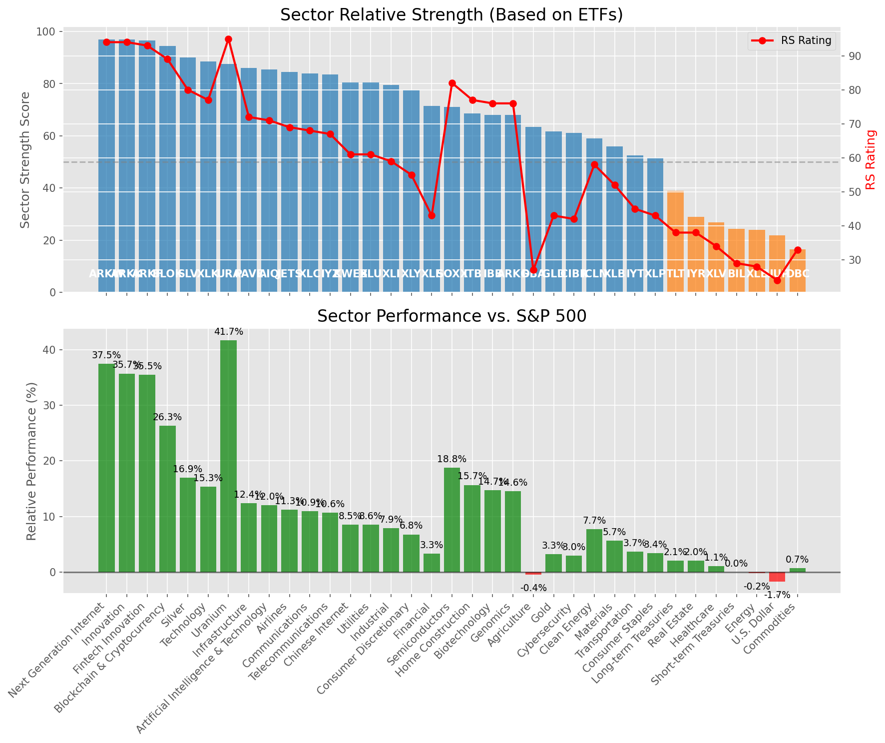

# **Daily Relative Strength Report**

**Date:** 2025-08-13

## **Market Valuation (Buffett Indicator)**

| Metric | Value |
|--------|-------|
| **Market Valuation** | **Overvalued** |
| **Current Ratio** | 10.44 |
| **Historical Mean** | 9.72 |
| **Standard Deviation** | 0.50 |
| **Z-Score (StdDev from Mean)** | 1.41 |
| **Total Market Cap** | $316.55 trillion |
| **GDP** | $30.33 trillion |

## **Market Insights**

### **Market is Overvalued**

The market appears to be trading above historical average valuations. While not at extreme levels, this suggests more modest future returns may be expected. Investors should:

- Focus on companies with reasonable valuations relative to their growth
- Be more selective with new positions
- Look for stocks showing relative strength within their sectors
- Consider trimming positions in extremely overvalued names

Historically, periods of mild overvaluation can persist for extended periods, but returns tend to be below average.

### **Buffett Indicator Overview**

The Buffett Indicator (Total Market Cap / GDP) is a measure of the stock market's valuation relative to the size of the economy. It is named after Warren Buffett, who described it as "probably the best single measure of where valuations stand at any given moment."

- **Values above +2 standard deviations:** Market significantly overvalued
- **Values above +1 standard deviation:** Market overvalued
- **Values between -1 and +1 standard deviations:** Market fairly valued
- **Values below -1 standard deviation:** Market undervalued
- **Values below -2 standard deviations:** Market significantly undervalued

---

## **Sector Relative Strength**

Based on William O'Neil's Relative Strength Methodology

| ETF | Strength | RS Rating | Performance | Above Key MAs | Trend | Sector |
|-----|----------|-----------|-------------|--------------|-------|--------|
| [ARKW](https://www.tradingview.com/chart/?symbol=ARKW) | 97.5 | 95.0 | 37.72% | 10d ✓, 50d ✓, 200d ✓ | ↗️ | Next Generation Internet |
| [ARKK](https://www.tradingview.com/chart/?symbol=ARKK) | 97.0 | 94.0 | 35.10% | 10d ✓, 50d ✓, 200d ✓ | ↗️ | Innovation |
| [ARKF](https://www.tradingview.com/chart/?symbol=ARKF) | 97.0 | 94.0 | 35.13% | 10d ✓, 50d ✓, 200d ✓ | ↗️ | Fintech Innovation |
| [BLOK](https://www.tradingview.com/chart/?symbol=BLOK) | 94.5 | 89.0 | 25.59% | 10d ✓, 50d ✓, 200d ✓ | ↗️ | Blockchain & Cryptocurrency |
| [SLV](https://www.tradingview.com/chart/?symbol=SLV) | 90.5 | 81.0 | 16.88% | 10d ✓, 50d ✓, 200d ✓ | ↗️ | Silver |
| [XLK](https://www.tradingview.com/chart/?symbol=XLK) | 89.0 | 78.0 | 15.03% | 10d ✓, 50d ✓, 200d ✓ | ↗️ | Technology |
| [URA](https://www.tradingview.com/chart/?symbol=URA) | 87.6 | 95.0 | 40.91% | 10d ✗, 50d ✓, 200d ✓ | ↗️ | Uranium |
| [AIQ](https://www.tradingview.com/chart/?symbol=AIQ) | 86.0 | 72.0 | 11.84% | 10d ✓, 50d ✓, 200d ✓ | ↗️ | Artificial Intelligence & Technology |
| [PAVE](https://www.tradingview.com/chart/?symbol=PAVE) | 85.5 | 71.0 | 11.35% | 10d ✓, 50d ✓, 200d ✓ | ↗️ | Infrastructure |
| [XLC](https://www.tradingview.com/chart/?symbol=XLC) | 85.0 | 70.0 | 11.13% | 10d ✓, 50d ✓, 200d ✓ | ↗️ | Communications |
| [IYZ](https://www.tradingview.com/chart/?symbol=IYZ) | 84.5 | 69.0 | 10.50% | 10d ✓, 50d ✓, 200d ✓ | ↗️ | Telecommunications |
| [JETS](https://www.tradingview.com/chart/?symbol=JETS) | 84.0 | 68.0 | 10.34% | 10d ✓, 50d ✓, 200d ✓ | ↗️ | Airlines |
| [KWEB](https://www.tradingview.com/chart/?symbol=KWEB) | 81.0 | 62.0 | 8.36% | 10d ✓, 50d ✓, 200d ✓ | ↗️ | Chinese Internet |
| [XLI](https://www.tradingview.com/chart/?symbol=XLI) | 79.5 | 59.0 | 7.11% | 10d ✓, 50d ✓, 200d ✓ | ↗️ | Industrial |
| [XLY](https://www.tradingview.com/chart/?symbol=XLY) | 78.0 | 56.0 | 6.44% | 10d ✓, 50d ✓, 200d ✓ | ↗️ | Consumer Discretionary |
| [XLF](https://www.tradingview.com/chart/?symbol=XLF) | 71.5 | 43.0 | 2.80% | 10d ✓, 50d ✓, 200d ✓ | ↗️ | Financial |
| [SOXX](https://www.tradingview.com/chart/?symbol=SOXX) | 71.0 | 82.0 | 18.21% | 10d ✓, 50d ✓, 200d ✓ | ↘️ | Semiconductors |
| [XLU](https://www.tradingview.com/chart/?symbol=XLU) | 70.6 | 61.0 | 7.66% | 10d ✗, 50d ✓, 200d ✓ | ↗️ | Utilities |
| [ITB](https://www.tradingview.com/chart/?symbol=ITB) | 69.0 | 78.0 | 15.09% | 10d ✓, 50d ✓, 200d ✓ | ↘️ | Home Construction |
| [IBB](https://www.tradingview.com/chart/?symbol=IBB) | 68.5 | 77.0 | 14.37% | 10d ✓, 50d ✓, 200d ✓ | ↘️ | Biotechnology |
| [ARKG](https://www.tradingview.com/chart/?symbol=ARKG) | 68.5 | 77.0 | 14.62% | 10d ✓, 50d ✓, 200d ✓ | ↘️ | Genomics |
| [DBA](https://www.tradingview.com/chart/?symbol=DBA) | 64.5 | 29.0 | -0.37% | 10d ✓, 50d ✓, 200d ✓ | ↗️ | Agriculture |
| [GLD](https://www.tradingview.com/chart/?symbol=GLD) | 62.6 | 45.0 | 3.28% | 10d ✗, 50d ✓, 200d ✓ | ↗️ | Gold |
| [CIBR](https://www.tradingview.com/chart/?symbol=CIBR) | 61.1 | 42.0 | 2.49% | 10d ✓, 50d ✗, 200d ✓ | ↗️ | Cybersecurity |
| [ICLN](https://www.tradingview.com/chart/?symbol=ICLN) | 60.0 | 60.0 | 7.53% | 10d ✓, 50d ✓, 200d ✓ | ↘️ | Clean Energy |
| [XLB](https://www.tradingview.com/chart/?symbol=XLB) | 55.0 | 50.0 | 4.80% | 10d ✓, 50d ✓, 200d ✓ | ↘️ | Materials |
| [XLP](https://www.tradingview.com/chart/?symbol=XLP) | 52.5 | 45.0 | 3.30% | 10d ✓, 50d ✓, 200d ✓ | ↘️ | Consumer Staples |
| [IYT](https://www.tradingview.com/chart/?symbol=IYT) | 52.5 | 45.0 | 3.13% | 10d ✓, 50d ✓, 200d ✓ | ↘️ | Transportation |
| [TLT](https://www.tradingview.com/chart/?symbol=TLT) | 39.8 | 40.0 | 2.15% | 10d ✓, 50d ✓, 200d ✗ | ↘️ | Long-term Treasuries |
| [XLV](https://www.tradingview.com/chart/?symbol=XLV) | 26.9 | 34.0 | 0.71% | 10d ✓, 50d ✗, 200d ✗ | ↘️ | Healthcare |
| [BIL](https://www.tradingview.com/chart/?symbol=BIL) | 25.4 | 31.0 | 0.03% | 10d ✓, 50d ✗, 200d ✗ | ↘️ | Short-term Treasuries |
| [UUP](https://www.tradingview.com/chart/?symbol=UUP) | 22.4 | 25.0 | -1.82% | 10d ✗, 50d ✓, 200d ✗ | ↘️ | U.S. Dollar |
| [IYR](https://www.tradingview.com/chart/?symbol=IYR) | 18.0 | 36.0 | 1.21% | 10d ✗, 50d ✗, 200d ✗ | ↘️ | Real Estate |
| [DBC](https://www.tradingview.com/chart/?symbol=DBC) | 16.5 | 33.0 | 0.42% | 10d ✗, 50d ✗, 200d ✗ | ↘️ | Commodities |
| [XLE](https://www.tradingview.com/chart/?symbol=XLE) | 13.0 | 26.0 | -1.27% | 10d ✗, 50d ✗, 200d ✗ | ↘️ | Energy |

### **Sector ETF Performance Interpretation**

This table shows the relative strength metrics for different market sectors based on their representative ETFs:

- **ETF**: The ETF used to measure sector performance (click for chart)
- **Strength**: Overall sector strength score (0-100) combining multiple factors
- **RS Rating**: O'Neil RS rating of the sector ETF
- **Performance**: Performance of the sector ETF relative to SPY
- **Above Key MAs**: Whether the ETF is trading above its 10, 50, and 200-day moving averages
- **Trend**: Whether the sector is in an uptrend (↗️) or downtrend (↘️)

### **Current Sector Leadership**

The current market leadership is coming from the following sectors: **Next Generation Internet, Innovation, Fintech Innovation**.

The **Next Generation Internet** sector (represented by **ARKW**) is showing particularly strong relative strength with an RS rating of 95.0 and performance of 37.72% vs. the S&P 500. This sector is trading above its 10-day, 50-day, 200-day moving average(s). Investors should consider focusing on high RS stocks within these leading sectors for potential outperformance.

---

## **Buy Recommendations**

The following 77 stocks show exceptional relative strength:

| RS Rating | Buy Score | Current Price | Chart | Name | Ticker |
|-----------|-----------|---------------|-------|------|--------|
| 100 | 100 | $73.28 | [Chart](https://www.tradingview.com/chart/?symbol=MP) | MP Materials Corp. | MP |
| 100 | 100 | $66.52 | [Chart](https://www.tradingview.com/chart/?symbol=KTOS) | Kratos Defense & Security Solutions, Inc. | KTOS |
| 100 | 100 | $204.41 | [Chart](https://www.tradingview.com/chart/?symbol=CLS) | Celestica, Inc. | CLS |
| 100 | 100 | $118.96 | [Chart](https://www.tradingview.com/chart/?symbol=CRDO) | Credo Technology Group Holding Ltd Ordinary Shares | CRDO |
| 100 | 100 | $69.93 | [Chart](https://www.tradingview.com/chart/?symbol=NBIS) | Nebius Group N.V. Class A Ordinary Shares | NBIS |
| 99 | 100 | $108.80 | [Chart](https://www.tradingview.com/chart/?symbol=HOOD) | Robinhood Markets, Inc. Class A Common Stock | HOOD |
| 99 | 100 | $93.32 | [Chart](https://www.tradingview.com/chart/?symbol=GDXU) | MicroSectors Gold Miners 3x Leveraged ETN | GDXU |
| 99 | 100 | $98.86 | [Chart](https://www.tradingview.com/chart/?symbol=RYTM) | Rhythm Pharmaceuticals, Inc. Common Stock | RYTM |
| 98 | 100 | $176.90 | [Chart](https://www.tradingview.com/chart/?symbol=FUTU) | Futu Holdings Limited American Depositary Shares | FUTU |
| 98 | 100 | $198.07 | [Chart](https://www.tradingview.com/chart/?symbol=COOP) | Mr. Cooper Group Inc. Common Stock | COOP |
| 98 | 100 | $24.75 | [Chart](https://www.tradingview.com/chart/?symbol=LQDA) | Liquidia Corporation Common Stock | LQDA |
| 97 | 100 | $88.75 | [Chart](https://www.tradingview.com/chart/?symbol=LIF) | Life360, Inc. Common Stock | LIF |
| 97 | 100 | $25.34 | [Chart](https://www.tradingview.com/chart/?symbol=ACAD) | Acadia Pharmaceuticals Inc. | ACAD |
| 97 | 100 | $44.99 | [Chart](https://www.tradingview.com/chart/?symbol=TTMI) | TTM Technologies Inc | TTMI |
| 96 | 100 | $184.91 | [Chart](https://www.tradingview.com/chart/?symbol=PLTR) | Palantir Technologies Inc. Class A Common Stock | PLTR |
| 96 | 100 | $66.86 | [Chart](https://www.tradingview.com/chart/?symbol=MRCY) | Mercury Systems Inc. | MRCY |
| 96 | 100 | $99.38 | [Chart](https://www.tradingview.com/chart/?symbol=EBAY) | eBay Inc | EBAY |
| 96 | 100 | $121.96 | [Chart](https://www.tradingview.com/chart/?symbol=SANM) | Sanmina  Corp | SANM |
| 95 | 100 | $57.82 | [Chart](https://www.tradingview.com/chart/?symbol=GH) | Guardant Health, Inc. Common Stock | GH |
| 95 | 100 | $57.09 | [Chart](https://www.tradingview.com/chart/?symbol=BTI) | British American Tobacco p.l.c. American Depositary Shares, American Depositary Shares, each representing one Ordinary Share | BTI |
| 95 | 100 | $53.10 | [Chart](https://www.tradingview.com/chart/?symbol=REVG) | REV Group, Inc. | REVG |
| 95 | 100 | $98.08 | [Chart](https://www.tradingview.com/chart/?symbol=TPB) | Turning Point Brands, Inc. | TPB |
| 95 | 100 | $162.45 | [Chart](https://www.tradingview.com/chart/?symbol=ARKW) | ARK Next Generation Internet ETF | ARKW |
| 94 | 100 | $31.21 | [Chart](https://www.tradingview.com/chart/?symbol=PAAS) | Pan American Silver Corp. | PAAS |
| 94 | 100 | $56.02 | [Chart](https://www.tradingview.com/chart/?symbol=AU) | AngloGold Ashanti plc | AU |
| 94 | 100 | $55.47 | [Chart](https://www.tradingview.com/chart/?symbol=ARKF) | ARK Fintech Innovation ETF | ARKF |
| 94 | 100 | $54.16 | [Chart](https://www.tradingview.com/chart/?symbol=SIL) | Global X Silver Miners ETF (NEW) | SIL |
| 94 | 100 | $113.69 | [Chart](https://www.tradingview.com/chart/?symbol=TPR) | Tapestry, Inc. Common Stock | TPR |
| 93 | 100 | $30.86 | [Chart](https://www.tradingview.com/chart/?symbol=OR) | OR Royalties Inc. | OR |
| 93 | 100 | $121.76 | [Chart](https://www.tradingview.com/chart/?symbol=PPLT) | abrdn Physical Platinum Shares ETF | PPLT |
| 93 | 100 | $33.26 | [Chart](https://www.tradingview.com/chart/?symbol=IIIV) | i3 Verticals, Inc. Class A Common Stock | IIIV |
| 92 | 100 | $26.31 | [Chart](https://www.tradingview.com/chart/?symbol=TFPM) | Triple Flag Precious Metals Corp. | TFPM |
| 92 | 100 | $17.87 | [Chart](https://www.tradingview.com/chart/?symbol=ARLO) | Arlo Technologies, Inc. | ARLO |
| 92 | 100 | $58.49 | [Chart](https://www.tradingview.com/chart/?symbol=CALX) | CALIX, INC. | CALX |
| 92 | 100 | $36.08 | [Chart](https://www.tradingview.com/chart/?symbol=DB) | Deutsche Bank Aktiengesellschaft | DB |
| 92 | 100 | $30.55 | [Chart](https://www.tradingview.com/chart/?symbol=SRAD) | Sportradar Group AG Class A Ordinary Shares | SRAD |
| 91 | 100 | $28.90 | [Chart](https://www.tradingview.com/chart/?symbol=KAR) | OPENLANE, Inc | KAR |
| 91 | 100 | $119.66 | [Chart](https://www.tradingview.com/chart/?symbol=SXT) | Sensient Technology Corporation | SXT |
| 91 | 100 | $59.60 | [Chart](https://www.tradingview.com/chart/?symbol=VIK) | Viking Holdings Ltd | VIK |
| 90 | 100 | $108.58 | [Chart](https://www.tradingview.com/chart/?symbol=APH) | Amphenol Corporation | APH |
| 89 | 100 | $22.77 | [Chart](https://www.tradingview.com/chart/?symbol=MAG) | MAG Silver Corp. | MAG |
| 89 | 100 | $273.62 | [Chart](https://www.tradingview.com/chart/?symbol=IDCC) | InterDigital, Inc. | IDCC |
| 89 | 100 | $44.59 | [Chart](https://www.tradingview.com/chart/?symbol=LTM) | LATAM Airlines Group S.A. American Depositary Shares (each representing two thousand (2,000) shares of Common Stock) | LTM |
| 88 | 100 | $58.06 | [Chart](https://www.tradingview.com/chart/?symbol=GDX) | VanEck Gold Miners ETF | GDX |
| 88 | 100 | $133.74 | [Chart](https://www.tradingview.com/chart/?symbol=AEM) | Agnico Eagle Mines Ltd. | AEM |
| 88 | 100 | $163.95 | [Chart](https://www.tradingview.com/chart/?symbol=VSEC) | VSE Corp | VSEC |
| 89 | 99 | $94.83 | [Chart](https://www.tradingview.com/chart/?symbol=C) | Citigroup Inc. | C |
| 88 | 99 | $21.66 | [Chart](https://www.tradingview.com/chart/?symbol=MIR) | Mirion Technologies, Inc. | MIR |
| 87 | 99 | $38.20 | [Chart](https://www.tradingview.com/chart/?symbol=AS) | Amer Sports, Inc. | AS |
| 88 | 98 | $195.76 | [Chart](https://www.tradingview.com/chart/?symbol=AWI) | Armstrong World Industries, Inc. | AWI |
| 88 | 98 | $67.20 | [Chart](https://www.tradingview.com/chart/?symbol=MAIN) | Main Street Capital Corporation | MAIN |
| 87 | 98 | $73.15 | [Chart](https://www.tradingview.com/chart/?symbol=GDXJ) | VanEck Junior Gold Miners ETF | GDXJ |
| 87 | 98 | $253.12 | [Chart](https://www.tradingview.com/chart/?symbol=BAP) | Credicorp LTD | BAP |
| 85 | 98 | $48.85 | [Chart](https://www.tradingview.com/chart/?symbol=CIB) | Grupo Cibest S.A. American Depositary Shares (each representing four (4) Preferred Shares) | CIB |
| 84 | 98 | $20.30 | [Chart](https://www.tradingview.com/chart/?symbol=BCS) | Barclays PLC | BCS |
| 87 | 97 | $52.93 | [Chart](https://www.tradingview.com/chart/?symbol=FHI) | Federated Hermes, Inc. | FHI |
| 87 | 97 | $739.99 | [Chart](https://www.tradingview.com/chart/?symbol=GS) | Goldman Sachs Group Inc. | GS |
| 84 | 97 | $167.75 | [Chart](https://www.tradingview.com/chart/?symbol=IRTC) | iRhythm Technologies, Inc | IRTC |
| 86 | 96 | $48.92 | [Chart](https://www.tradingview.com/chart/?symbol=FAST) | Fastenal Co | FAST |
| 85 | 95 | $445.93 | [Chart](https://www.tradingview.com/chart/?symbol=APP) | Applovin Corporation Class A Common Stock | APP |
| 83 | 95 | $62.26 | [Chart](https://www.tradingview.com/chart/?symbol=SHLD) | Global X Defense Tech ETF | SHLD |
| 83 | 95 | $63.95 | [Chart](https://www.tradingview.com/chart/?symbol=CAKE) | Cheesecake Factory (The) | CAKE |
| 83 | 95 | $91.08 | [Chart](https://www.tradingview.com/chart/?symbol=LLYVK) | Liberty Media Corporation Series C Liberty Live Common Stock | LLYVK |
| 82 | 95 | $58.03 | [Chart](https://www.tradingview.com/chart/?symbol=ERJ) | Embraer S.A. | ERJ |
| 82 | 95 | $119.84 | [Chart](https://www.tradingview.com/chart/?symbol=GILD) | Gilead Sciences Inc | GILD |
| 83 | 94 | $24.68 | [Chart](https://www.tradingview.com/chart/?symbol=ING) | ING Groep N.V. American Depositary Shares | ING |
| 80 | 94 | $40.38 | [Chart](https://www.tradingview.com/chart/?symbol=AHR) | American Healthcare REIT, Inc. | AHR |
| 83 | 93 | $191.92 | [Chart](https://www.tradingview.com/chart/?symbol=ASND) | Ascendis Pharma A/S American Depositary Shares | ASND |
| 81 | 93 | $422.02 | [Chart](https://www.tradingview.com/chart/?symbol=CYBR) | CyberArk Software Ltd. | CYBR |
| 80 | 93 | $47.92 | [Chart](https://www.tradingview.com/chart/?symbol=EWP) | iShares MSCI Spain ETF | EWP |
| 82 | 92 | $13.07 | [Chart](https://www.tradingview.com/chart/?symbol=PSLV) | Sprott Physical Silver Trust | PSLV |
| 81 | 92 | $34.98 | [Chart](https://www.tradingview.com/chart/?symbol=SLV) | iShares Silver Trust | SLV |
| 81 | 92 | $36.71 | [Chart](https://www.tradingview.com/chart/?symbol=SIVR) | abrdn Physical Silver Shares ETF | SIVR |
| 80 | 92 | $35.59 | [Chart](https://www.tradingview.com/chart/?symbol=APG) | APi Group Corporation | APG |
| 80 | 91 | $74.37 | [Chart](https://www.tradingview.com/chart/?symbol=TD) | Toronto Dominion Bank | TD |
| 80 | 91 | $38.76 | [Chart](https://www.tradingview.com/chart/?symbol=TDS) | Telephone and Data Systems Inc. | TDS |
| 80 | 90 | $19.18 | [Chart](https://www.tradingview.com/chart/?symbol=DAN) | Dana Incorporated | DAN |

---

## **Sell Recommendations**

The following 76 stocks show deteriorating relative strength:

| RS Rating | Sell Score | Current Price | Chart | Name | Ticker |
|-----------|------------|---------------|-------|------|--------|
| 1 | 100 | $11.79 | [Chart](https://www.tradingview.com/chart/?symbol=NVDS) | Investment Managers Series Trust II Tradr 1.5X Short NVDA Daily ETF | NVDS |
| 1 | 100 | $199.53 | [Chart](https://www.tradingview.com/chart/?symbol=LULU) | lululemon athletica inc. | LULU |
| 2 | 100 | $22.77 | [Chart](https://www.tradingview.com/chart/?symbol=TECS) | Direxion Daily Technology Bear 3x Shares | TECS |
| 2 | 100 | $22.51 | [Chart](https://www.tradingview.com/chart/?symbol=ZSL) | ProShares UltraShort Silver | ZSL |
| 2 | 100 | $13.94 | [Chart](https://www.tradingview.com/chart/?symbol=CLBT) | Cellebrite DI Ltd. Class A Ordinary Shares | CLBT |
| 3 | 100 | $25.82 | [Chart](https://www.tradingview.com/chart/?symbol=CRI) | Carter's Inc. | CRI |
| 5 | 100 | $23.78 | [Chart](https://www.tradingview.com/chart/?symbol=CRTO) | Criteo S.A. | CRTO |
| 6 | 100 | $75.59 | [Chart](https://www.tradingview.com/chart/?symbol=ESTC) | Elastic N.V. | ESTC |
| 6 | 100 | $10.94 | [Chart](https://www.tradingview.com/chart/?symbol=PATH) | UiPath, Inc. | PATH |
| 7 | 100 | $21.02 | [Chart](https://www.tradingview.com/chart/?symbol=GAP) | The Gap, Inc. | GAP |
| 7 | 100 | $40.04 | [Chart](https://www.tradingview.com/chart/?symbol=SDOW) | ProShares UltraPro Short Dow 30 | SDOW |
| 7 | 100 | $16.97 | [Chart](https://www.tradingview.com/chart/?symbol=S) | SentinelOne, Inc. | S |
| 9 | 100 | $32.40 | [Chart](https://www.tradingview.com/chart/?symbol=JD) | JD.com, Inc. | JD |
| 9 | 100 | $29.13 | [Chart](https://www.tradingview.com/chart/?symbol=BBWI) | Bath & Body Works, Inc. | BBWI |
| 15 | 100 | $16.59 | [Chart](https://www.tradingview.com/chart/?symbol=CTO) | CTO Realty Growth, Inc. | CTO |
| 11 | 99 | $23.73 | [Chart](https://www.tradingview.com/chart/?symbol=DXD) | ProShares UltraShort Dow 30 | DXD |
| 16 | 99 | $14.22 | [Chart](https://www.tradingview.com/chart/?symbol=VRE) | Veris Residential, Inc. | VRE |
| 17 | 99 | $12.34 | [Chart](https://www.tradingview.com/chart/?symbol=NU) | Nu Holdings Ltd. | NU |
| 14 | 98 | $72.44 | [Chart](https://www.tradingview.com/chart/?symbol=EXPO) | Exponent Inc | EXPO |
| 10 | 97 | $16.44 | [Chart](https://www.tradingview.com/chart/?symbol=BTAL) | AGF U.S. Market Neutral Anti-Beta Fund | BTAL |
| 13 | 97 | $34.42 | [Chart](https://www.tradingview.com/chart/?symbol=AMH) | AMERICAN HOMES 4 RENT | AMH |
| 8 | 96 | $31.33 | [Chart](https://www.tradingview.com/chart/?symbol=DAR) | DARLING INGREDIENTS INC. | DAR |
| 18 | 96 | $25.46 | [Chart](https://www.tradingview.com/chart/?symbol=FCPT) | Four Corners Property Trust, Inc. | FCPT |
| 7 | 95 | $40.08 | [Chart](https://www.tradingview.com/chart/?symbol=BILL) | BILL Holdings, Inc. | BILL |
| 13 | 95 | $38.02 | [Chart](https://www.tradingview.com/chart/?symbol=UDR) | UDR, Inc. | UDR |
| 14 | 95 | $38.47 | [Chart](https://www.tradingview.com/chart/?symbol=SH) | ProShares Short S&P500 | SH |
| 16 | 95 | $37.41 | [Chart](https://www.tradingview.com/chart/?symbol=KSA) | iShares MSCI Saudi Arabia ETF | KSA |
| 19 | 95 | $46.66 | [Chart](https://www.tradingview.com/chart/?symbol=EDU) | New Oriental Education and Technology Group, Inc. American Depositary Shares (each representing ten (10) Common Shares) | EDU |
| 11 | 94 | $28.94 | [Chart](https://www.tradingview.com/chart/?symbol=CNX) | CNX Resources Corporation | CNX |
| 12 | 94 | $105.14 | [Chart](https://www.tradingview.com/chart/?symbol=CPT) | Camden Property Trust | CPT |
| 12 | 93 | $783.32 | [Chart](https://www.tradingview.com/chart/?symbol=EQIX) | Equinix, Inc. Common Stock REIT | EQIX |
| 16 | 93 | $50.39 | [Chart](https://www.tradingview.com/chart/?symbol=BIRK) | Birkenstock Holding plc | BIRK |
| 14 | 92 | $13.67 | [Chart](https://www.tradingview.com/chart/?symbol=EWTX) | Edgewise Therapeutics, Inc. Common Stock | EWTX |
| 19 | 92 | $37.55 | [Chart](https://www.tradingview.com/chart/?symbol=VNO) | Vornado Realty Trust | VNO |
| 20 | 92 | $48.74 | [Chart](https://www.tradingview.com/chart/?symbol=FR) | First Industrial Realty Trust, Inc. | FR |
| 16 | 91 | $281.64 | [Chart](https://www.tradingview.com/chart/?symbol=PSA) | Public Storage | PSA |
| 18 | 91 | $12.20 | [Chart](https://www.tradingview.com/chart/?symbol=PMT) | PennyMac Mortgage Investment Trust | PMT |
| 22 | 91 | $335.73 | [Chart](https://www.tradingview.com/chart/?symbol=EG) | Everest Group, Ltd. | EG |
| 15 | 90 | $29.73 | [Chart](https://www.tradingview.com/chart/?symbol=CNQ) | Canadian Natural Resources Limited | CNQ |
| 14 | 89 | $12.76 | [Chart](https://www.tradingview.com/chart/?symbol=CCRN) | Cross Country Healthcare Inc | CCRN |
| 18 | 89 | $13.01 | [Chart](https://www.tradingview.com/chart/?symbol=NAVI) | Navient Corporation | NAVI |
| 23 | 89 | $12.24 | [Chart](https://www.tradingview.com/chart/?symbol=WSR) | Whitestone REIT | WSR |
| 20 | 88 | $16.36 | [Chart](https://www.tradingview.com/chart/?symbol=UMH) | UMH Properties, Inc. | UMH |
| 21 | 87 | $120.70 | [Chart](https://www.tradingview.com/chart/?symbol=PSX) | PHILLIPS 66 | PSX |
| 25 | 87 | $15.43 | [Chart](https://www.tradingview.com/chart/?symbol=FXN) | First Trust Energy AlphaDEX Fund | FXN |
| 18 | 86 | $25.29 | [Chart](https://www.tradingview.com/chart/?symbol=DOG) | ProShares Short Dow30 | DOG |
| 20 | 86 | $36.01 | [Chart](https://www.tradingview.com/chart/?symbol=MSGE) | Madison Square Garden Entertainment Corp. | MSGE |
| 21 | 86 | $105.62 | [Chart](https://www.tradingview.com/chart/?symbol=PLD) | PROLOGIS, INC. | PLD |
| 22 | 85 | $44.55 | [Chart](https://www.tradingview.com/chart/?symbol=SW) | Smurfit Westrock plc | SW |
| 23 | 82 | $30.48 | [Chart](https://www.tradingview.com/chart/?symbol=EPRT) | Essential Properties Realty Trust, Inc. | EPRT |
| 22 | 80 | $218.58 | [Chart](https://www.tradingview.com/chart/?symbol=SBAC) | SBA Communications Corp | SBAC |
| 24 | 80 | $36.26 | [Chart](https://www.tradingview.com/chart/?symbol=PBA) | PEMBINA PIPELINE CORPORATION | PBA |
| 26 | 80 | $35.47 | [Chart](https://www.tradingview.com/chart/?symbol=FFIN) | First Financial Bankshares Inc | FFIN |
| 27 | 80 | $12.14 | [Chart](https://www.tradingview.com/chart/?symbol=RQI) | COHEN & STEERS QUALITY INCOME REALTY FUND, INC. COMMON SHARES | RQI |
| 29 | 80 | $14.83 | [Chart](https://www.tradingview.com/chart/?symbol=GBDC) | Golub Capital BDC, Inc. | GBDC |
| 31 | 80 | $14.34 | [Chart](https://www.tradingview.com/chart/?symbol=MNR) | Mach Natural Resources LP Common Units representing Limited Partner Interests | MNR |
| 22 | 79 | $275.77 | [Chart](https://www.tradingview.com/chart/?symbol=CB) | Chubb Limited | CB |
| 23 | 79 | $15.94 | [Chart](https://www.tradingview.com/chart/?symbol=MARA) | MARA Holdings, Inc. Common Stock | MARA |
| 23 | 79 | $70.14 | [Chart](https://www.tradingview.com/chart/?symbol=PYPL) | PayPal Holdings, Inc. Common Stock | PYPL |
| 30 | 78 | $14.79 | [Chart](https://www.tradingview.com/chart/?symbol=DEI) | Douglas Emmett, Inc. | DEI |
| 34 | 78 | $37.62 | [Chart](https://www.tradingview.com/chart/?symbol=FLIN) | Franklin FTSE India ETF | FLIN |
| 34 | 78 | $13.19 | [Chart](https://www.tradingview.com/chart/?symbol=MED) | Medifast, Inc. | MED |
| 23 | 77 | $68.49 | [Chart](https://www.tradingview.com/chart/?symbol=HSIC) | Henry Schein Inc | HSIC |
| 28 | 77 | $133.97 | [Chart](https://www.tradingview.com/chart/?symbol=VLO) | Valero Energy Corporation | VLO |
| 27 | 74 | $11.22 | [Chart](https://www.tradingview.com/chart/?symbol=NFBK) | Northfield Bancorp, Inc. | NFBK |
| 33 | 74 | $46.16 | [Chart](https://www.tradingview.com/chart/?symbol=GLPI) | Gaming and Leisure Properties, Inc. | GLPI |
| 28 | 73 | $72.28 | [Chart](https://www.tradingview.com/chart/?symbol=ADC) | Agree Realty Corporation | ADC |
| 33 | 72 | $21.68 | [Chart](https://www.tradingview.com/chart/?symbol=DBC) | Invesco DB Commodity Index Tracking Fund | DBC |
| 37 | 72 | $56.02 | [Chart](https://www.tradingview.com/chart/?symbol=IYH) | iShares U.S. Healthcare ETF | IYH |
| 31 | 71 | $91.58 | [Chart](https://www.tradingview.com/chart/?symbol=BIL) | SPDR Bloomberg 1-3 Month T-Bill ETF | BIL |
| 32 | 71 | $48.11 | [Chart](https://www.tradingview.com/chart/?symbol=IP) | International Paper Co. | IP |
| 36 | 71 | $10.25 | [Chart](https://www.tradingview.com/chart/?symbol=NMCO) | Nuveen Municipal Credit Opportunities Fund | NMCO |
| 35 | 70 | $24.14 | [Chart](https://www.tradingview.com/chart/?symbol=FLBL) | Franklin Senior Loan ETF | FLBL |
| 31 | 69 | $100.22 | [Chart](https://www.tradingview.com/chart/?symbol=CLIP) | Global X 1-3 Month T-Bill ETF | CLIP |
| 37 | 69 | $13.15 | [Chart](https://www.tradingview.com/chart/?symbol=RA) | Brookfield Real Assets Income Fund Inc. | RA |
| 36 | 67 | $41.32 | [Chart](https://www.tradingview.com/chart/?symbol=NNN) | NNN REIT, Inc. | NNN |

## **Methodology**

This report uses William O'Neil's relative strength methodology from Investors Business Daily:

* **RS Rating**: Percentile rank of stock's performance vs. S&P 500 over the past 63 trading days (1-99 scale)
* **Buy Criteria**: RS Rating >= 80, price above 50-day MA, strong uptrend, increasing volume
* **Sell Criteria**: RS Rating < 40, price below 50-day MA, downtrend, decreasing volume

### **O'Neil's Key Principles**

1. **Focus on relative performance** - stocks outperforming the market
2. **Price trend confirmation** - stock must be in an uptrend
3. **Volume confirmation** - strong volume supports price moves
4. **Moving average validation** - price above key moving averages
5. **Market leaders only** - concentrate on top-performing stocks

*Report generated automatically after market close*