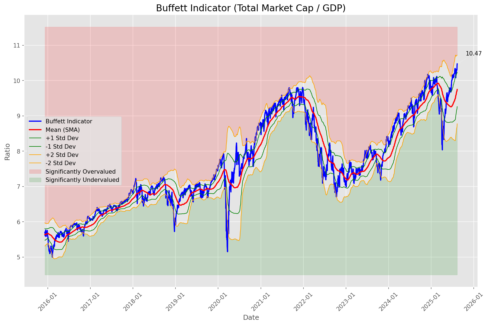
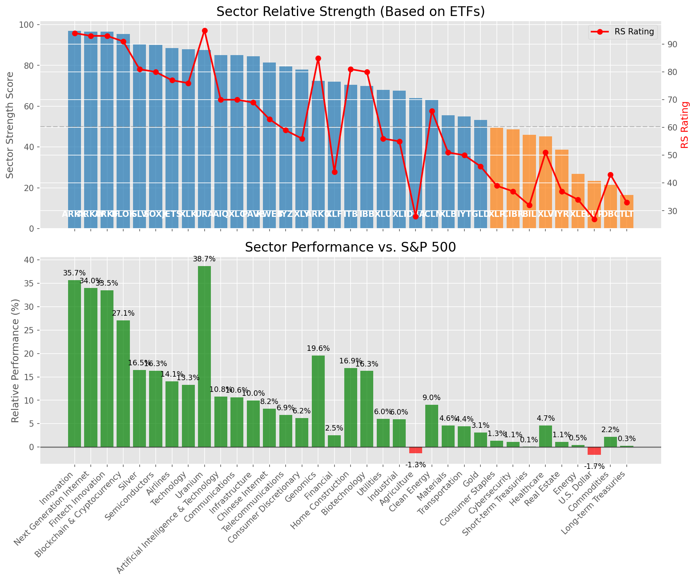

# **Daily Relative Strength Report**

**Date:** 2025-08-15

## **Market Valuation (Buffett Indicator)**

| Metric | Value |
|--------|-------|
| **Market Valuation** | **Overvalued** |
| **Current Ratio** | 10.43 |
| **Historical Mean** | 9.77 |
| **Standard Deviation** | 0.46 |
| **Z-Score (StdDev from Mean)** | 1.47 |
| **Total Market Cap** | $316.46 trillion |
| **GDP** | $30.33 trillion |

## **Market Insights**

### **Market is Overvalued**

The market appears to be trading above historical average valuations. While not at extreme levels, this suggests more modest future returns may be expected. Investors should:

- Focus on companies with reasonable valuations relative to their growth
- Be more selective with new positions
- Look for stocks showing relative strength within their sectors
- Consider trimming positions in extremely overvalued names

Historically, periods of mild overvaluation can persist for extended periods, but returns tend to be below average.

### **Buffett Indicator Overview**

The Buffett Indicator (Total Market Cap / GDP) is a measure of the stock market's valuation relative to the size of the economy. It is named after Warren Buffett, who described it as "probably the best single measure of where valuations stand at any given moment."

- **Values above +2 standard deviations:** Market significantly overvalued
- **Values above +1 standard deviation:** Market overvalued
- **Values between -1 and +1 standard deviations:** Market fairly valued
- **Values below -1 standard deviation:** Market undervalued
- **Values below -2 standard deviations:** Market significantly undervalued

---

## **Sector Relative Strength**

Based on William O'Neil's Relative Strength Methodology

| ETF | Strength | RS Rating | Performance | Above Key MAs | Trend | Sector |
|-----|----------|-----------|-------------|--------------|-------|--------|
| [ARKK](https://www.tradingview.com/chart/?symbol=ARKK) | 97.0 | 94.0 | 35.08% | 10d ✓, 50d ✓, 200d ✓ | ↗️ | Innovation |
| [ARKF](https://www.tradingview.com/chart/?symbol=ARKF) | 96.5 | 93.0 | 33.23% | 10d ✓, 50d ✓, 200d ✓ | ↗️ | Fintech Innovation |
| [ARKW](https://www.tradingview.com/chart/?symbol=ARKW) | 96.5 | 93.0 | 33.98% | 10d ✓, 50d ✓, 200d ✓ | ↗️ | Next Generation Internet |
| [BLOK](https://www.tradingview.com/chart/?symbol=BLOK) | 95.0 | 90.0 | 26.35% | 10d ✓, 50d ✓, 200d ✓ | ↗️ | Blockchain & Cryptocurrency |
| [SOXX](https://www.tradingview.com/chart/?symbol=SOXX) | 90.5 | 81.0 | 16.50% | 10d ✓, 50d ✓, 200d ✓ | ↗️ | Semiconductors |
| [JETS](https://www.tradingview.com/chart/?symbol=JETS) | 88.5 | 77.0 | 14.00% | 10d ✓, 50d ✓, 200d ✓ | ↗️ | Airlines |
| [XLK](https://www.tradingview.com/chart/?symbol=XLK) | 88.0 | 76.0 | 13.29% | 10d ✓, 50d ✓, 200d ✓ | ↗️ | Technology |
| [URA](https://www.tradingview.com/chart/?symbol=URA) | 87.6 | 95.0 | 38.70% | 10d ✗, 50d ✓, 200d ✓ | ↗️ | Uranium |
| [XLC](https://www.tradingview.com/chart/?symbol=XLC) | 85.0 | 70.0 | 10.64% | 10d ✓, 50d ✓, 200d ✓ | ↗️ | Communications |
| [AIQ](https://www.tradingview.com/chart/?symbol=AIQ) | 85.0 | 70.0 | 10.68% | 10d ✓, 50d ✓, 200d ✓ | ↗️ | Artificial Intelligence & Technology |
| [PAVE](https://www.tradingview.com/chart/?symbol=PAVE) | 84.5 | 69.0 | 10.04% | 10d ✓, 50d ✓, 200d ✓ | ↗️ | Infrastructure |
| [KWEB](https://www.tradingview.com/chart/?symbol=KWEB) | 81.5 | 63.0 | 8.08% | 10d ✓, 50d ✓, 200d ✓ | ↗️ | Chinese Internet |
| [SLV](https://www.tradingview.com/chart/?symbol=SLV) | 80.1 | 80.0 | 16.40% | 10d ✗, 50d ✓, 200d ✓ | ↗️ | Silver |
| [IYZ](https://www.tradingview.com/chart/?symbol=IYZ) | 79.5 | 59.0 | 7.05% | 10d ✓, 50d ✓, 200d ✓ | ↗️ | Telecommunications |
| [XLY](https://www.tradingview.com/chart/?symbol=XLY) | 77.5 | 55.0 | 5.93% | 10d ✓, 50d ✓, 200d ✓ | ↗️ | Consumer Discretionary |
| [ARKG](https://www.tradingview.com/chart/?symbol=ARKG) | 72.0 | 84.0 | 18.76% | 10d ✓, 50d ✓, 200d ✓ | ↘️ | Genomics |
| [XLF](https://www.tradingview.com/chart/?symbol=XLF) | 72.0 | 44.0 | 2.58% | 10d ✓, 50d ✓, 200d ✓ | ↗️ | Financial |
| [ITB](https://www.tradingview.com/chart/?symbol=ITB) | 70.0 | 80.0 | 16.27% | 10d ✓, 50d ✓, 200d ✓ | ↘️ | Home Construction |
| [IBB](https://www.tradingview.com/chart/?symbol=IBB) | 70.0 | 80.0 | 15.89% | 10d ✓, 50d ✓, 200d ✓ | ↘️ | Biotechnology |
| [XLI](https://www.tradingview.com/chart/?symbol=XLI) | 68.1 | 56.0 | 6.09% | 10d ✗, 50d ✓, 200d ✓ | ↗️ | Industrial |
| [XLU](https://www.tradingview.com/chart/?symbol=XLU) | 67.1 | 54.0 | 5.58% | 10d ✗, 50d ✓, 200d ✓ | ↗️ | Utilities |
| [DBA](https://www.tradingview.com/chart/?symbol=DBA) | 63.0 | 26.0 | -1.48% | 10d ✓, 50d ✓, 200d ✓ | ↗️ | Agriculture |
| [ICLN](https://www.tradingview.com/chart/?symbol=ICLN) | 58.5 | 57.0 | 6.54% | 10d ✓, 50d ✓, 200d ✓ | ↘️ | Clean Energy |
| [IYT](https://www.tradingview.com/chart/?symbol=IYT) | 55.5 | 51.0 | 4.70% | 10d ✓, 50d ✓, 200d ✓ | ↘️ | Transportation |
| [XLB](https://www.tradingview.com/chart/?symbol=XLB) | 55.0 | 50.0 | 4.53% | 10d ✓, 50d ✓, 200d ✓ | ↘️ | Materials |
| [GLD](https://www.tradingview.com/chart/?symbol=GLD) | 53.2 | 46.0 | 3.25% | 10d ✗, 50d ✗, 200d ✓ | ↗️ | Gold |
| [CIBR](https://www.tradingview.com/chart/?symbol=CIBR) | 48.7 | 37.0 | 1.15% | 10d ✗, 50d ✗, 200d ✓ | ↗️ | Cybersecurity |
| [BIL](https://www.tradingview.com/chart/?symbol=BIL) | 45.5 | 31.0 | 0.06% | 10d ✓, 50d ✓, 200d ✓ | ↘️ | Short-term Treasuries |
| [XLV](https://www.tradingview.com/chart/?symbol=XLV) | 44.3 | 49.0 | 4.13% | 10d ✓, 50d ✓, 200d ✗ | ↘️ | Healthcare |
| [XLP](https://www.tradingview.com/chart/?symbol=XLP) | 37.6 | 35.0 | 0.82% | 10d ✗, 50d ✓, 200d ✓ | ↘️ | Consumer Staples |
| [IYR](https://www.tradingview.com/chart/?symbol=IYR) | 27.9 | 36.0 | 1.02% | 10d ✓, 50d ✗, 200d ✗ | ↘️ | Real Estate |
| [XLE](https://www.tradingview.com/chart/?symbol=XLE) | 27.4 | 35.0 | 0.79% | 10d ✓, 50d ✗, 200d ✗ | ↘️ | Energy |
| [UUP](https://www.tradingview.com/chart/?symbol=UUP) | 22.9 | 26.0 | -1.67% | 10d ✗, 50d ✓, 200d ✗ | ↘️ | U.S. Dollar |
| [DBC](https://www.tradingview.com/chart/?symbol=DBC) | 21.5 | 43.0 | 2.40% | 10d ✗, 50d ✗, 200d ✗ | ↘️ | Commodities |
| [TLT](https://www.tradingview.com/chart/?symbol=TLT) | 16.5 | 33.0 | 0.40% | 10d ✗, 50d ✗, 200d ✗ | ↘️ | Long-term Treasuries |

### **Sector ETF Performance Interpretation**

This table shows the relative strength metrics for different market sectors based on their representative ETFs:

- **ETF**: The ETF used to measure sector performance (click for chart)
- **Strength**: Overall sector strength score (0-100) combining multiple factors
- **RS Rating**: O'Neil RS rating of the sector ETF
- **Performance**: Performance of the sector ETF relative to SPY
- **Above Key MAs**: Whether the ETF is trading above its 10, 50, and 200-day moving averages
- **Trend**: Whether the sector is in an uptrend (↗️) or downtrend (↘️)

### **Current Sector Leadership**

The current market leadership is coming from the following sectors: **Innovation, Fintech Innovation, Next Generation Internet**.

The **Innovation** sector (represented by **ARKK**) is showing particularly strong relative strength with an RS rating of 94.0 and performance of 35.08% vs. the S&P 500. This sector is trading above its 10-day, 50-day, 200-day moving average(s). Investors should consider focusing on high RS stocks within these leading sectors for potential outperformance.

---

## **Buy Recommendations**

The following 49 stocks show exceptional relative strength:

| RS Rating | Buy Score | Current Price | Chart | Name | Ticker |
|-----------|-----------|---------------|-------|------|--------|
| 100 | 100 | $74.17 | [Chart](https://www.tradingview.com/chart/?symbol=MP) | MP Materials Corp. | MP |
| 100 | 100 | $111.96 | [Chart](https://www.tradingview.com/chart/?symbol=HOOD) | Robinhood Markets, Inc. Class A Common Stock | HOOD |
| 100 | 100 | $68.43 | [Chart](https://www.tradingview.com/chart/?symbol=KTOS) | Kratos Defense & Security Solutions, Inc. | KTOS |
| 100 | 100 | $70.56 | [Chart](https://www.tradingview.com/chart/?symbol=NBIS) | Nebius Group N.V. Class A Ordinary Shares | NBIS |
| 99 | 100 | $96.25 | [Chart](https://www.tradingview.com/chart/?symbol=RYTM) | Rhythm Pharmaceuticals, Inc. Common Stock | RYTM |
| 99 | 100 | $174.25 | [Chart](https://www.tradingview.com/chart/?symbol=FUTU) | Futu Holdings Limited American Depositary Shares | FUTU |
| 98 | 100 | $25.43 | [Chart](https://www.tradingview.com/chart/?symbol=TME) | Tencent Music Entertainment Group American Depositary Shares, each representing two Class A Ordinary Shares | TME |
| 97 | 100 | $66.94 | [Chart](https://www.tradingview.com/chart/?symbol=MRCY) | Mercury Systems Inc. | MRCY |
| 97 | 100 | $192.81 | [Chart](https://www.tradingview.com/chart/?symbol=COOP) | Mr. Cooper Group Inc. Common Stock | COOP |
| 96 | 100 | $85.04 | [Chart](https://www.tradingview.com/chart/?symbol=LIF) | Life360, Inc. Common Stock | LIF |
| 96 | 100 | $25.17 | [Chart](https://www.tradingview.com/chart/?symbol=ACAD) | Acadia Pharmaceuticals Inc. | ACAD |
| 96 | 100 | $100.53 | [Chart](https://www.tradingview.com/chart/?symbol=EBAY) | eBay Inc | EBAY |
| 95 | 100 | $57.09 | [Chart](https://www.tradingview.com/chart/?symbol=BTI) | British American Tobacco p.l.c. American Depositary Shares, American Depositary Shares, each representing one Ordinary Share | BTI |
| 95 | 100 | $123.78 | [Chart](https://www.tradingview.com/chart/?symbol=PPLT) | abrdn Physical Platinum Shares ETF | PPLT |
| 95 | 100 | $31.75 | [Chart](https://www.tradingview.com/chart/?symbol=PAAS) | Pan American Silver Corp. | PAAS |
| 94 | 100 | $74.99 | [Chart](https://www.tradingview.com/chart/?symbol=WNS) | WNS (Holdings) Limited | WNS |
| 94 | 100 | $54.15 | [Chart](https://www.tradingview.com/chart/?symbol=SIL) | Global X Silver Miners ETF (NEW) | SIL |
| 94 | 100 | $98.50 | [Chart](https://www.tradingview.com/chart/?symbol=TPB) | Turning Point Brands, Inc. | TPB |
| 94 | 100 | $26.29 | [Chart](https://www.tradingview.com/chart/?symbol=LQDA) | Liquidia Corporation Common Stock | LQDA |
| 93 | 100 | $31.05 | [Chart](https://www.tradingview.com/chart/?symbol=SRAD) | Sportradar Group AG Class A Ordinary Shares | SRAD |
| 93 | 100 | $30.53 | [Chart](https://www.tradingview.com/chart/?symbol=OR) | OR Royalties Inc. | OR |
| 93 | 100 | $54.33 | [Chart](https://www.tradingview.com/chart/?symbol=ARKF) | ARK Fintech Innovation ETF | ARKF |
| 93 | 100 | $60.50 | [Chart](https://www.tradingview.com/chart/?symbol=VIK) | Viking Holdings Ltd | VIK |
| 93 | 100 | $160.01 | [Chart](https://www.tradingview.com/chart/?symbol=ARKW) | ARK Next Generation Internet ETF | ARKW |
| 92 | 100 | $25.94 | [Chart](https://www.tradingview.com/chart/?symbol=TFPM) | Triple Flag Precious Metals Corp. | TFPM |
| 92 | 100 | $36.61 | [Chart](https://www.tradingview.com/chart/?symbol=DB) | Deutsche Bank Aktiengesellschaft | DB |
| 91 | 100 | $23.07 | [Chart](https://www.tradingview.com/chart/?symbol=MAG) | MAG Silver Corp. | MAG |
| 89 | 100 | $162.67 | [Chart](https://www.tradingview.com/chart/?symbol=VSEC) | VSE Corp | VSEC |
| 89 | 100 | $269.75 | [Chart](https://www.tradingview.com/chart/?symbol=IDCC) | InterDigital, Inc. | IDCC |
| 89 | 100 | $38.54 | [Chart](https://www.tradingview.com/chart/?symbol=AS) | Amer Sports, Inc. | AS |
| 88 | 99 | $117.42 | [Chart](https://www.tradingview.com/chart/?symbol=SXT) | Sensient Technology Corporation | SXT |
| 86 | 99 | $44.18 | [Chart](https://www.tradingview.com/chart/?symbol=LTM) | LATAM Airlines Group S.A. American Depositary Shares (each representing two thousand (2,000) shares of Common Stock) | LTM |
| 88 | 98 | $94.18 | [Chart](https://www.tradingview.com/chart/?symbol=C) | Citigroup Inc. | C |
| 88 | 98 | $66.73 | [Chart](https://www.tradingview.com/chart/?symbol=MAIN) | Main Street Capital Corporation | MAIN |
| 88 | 98 | $53.15 | [Chart](https://www.tradingview.com/chart/?symbol=FHI) | Federated Hermes, Inc. | FHI |
| 86 | 98 | $93.18 | [Chart](https://www.tradingview.com/chart/?symbol=LLYVK) | Liberty Media Corporation Series C Liberty Live Common Stock | LLYVK |
| 86 | 97 | $252.25 | [Chart](https://www.tradingview.com/chart/?symbol=BAP) | Credicorp LTD | BAP |
| 86 | 96 | $193.06 | [Chart](https://www.tradingview.com/chart/?symbol=AWI) | Armstrong World Industries, Inc. | AWI |
| 83 | 96 | $118.30 | [Chart](https://www.tradingview.com/chart/?symbol=GILD) | Gilead Sciences Inc | GILD |
| 83 | 96 | $190.70 | [Chart](https://www.tradingview.com/chart/?symbol=TKO) | TKO Group Holdings, Inc. | TKO |
| 82 | 96 | $20.32 | [Chart](https://www.tradingview.com/chart/?symbol=BCS) | Barclays PLC | BCS |
| 85 | 95 | $31.94 | [Chart](https://www.tradingview.com/chart/?symbol=IIIV) | i3 Verticals, Inc. Class A Common Stock | IIIV |
| 83 | 95 | $15.91 | [Chart](https://www.tradingview.com/chart/?symbol=MUFG) | Mitsubishi UFJ Financial Group, Inc. | MUFG |
| 83 | 95 | $419.99 | [Chart](https://www.tradingview.com/chart/?symbol=CYBR) | CyberArk Software Ltd. | CYBR |
| 84 | 94 | $436.29 | [Chart](https://www.tradingview.com/chart/?symbol=APP) | Applovin Corporation Class A Common Stock | APP |
| 83 | 94 | $28.96 | [Chart](https://www.tradingview.com/chart/?symbol=CPS) | Cooper-Standard Automotive Inc. | CPS |
| 83 | 94 | $24.95 | [Chart](https://www.tradingview.com/chart/?symbol=ING) | ING Groep N.V. American Depositary Shares | ING |
| 81 | 94 | $48.83 | [Chart](https://www.tradingview.com/chart/?symbol=EWP) | iShares MSCI Spain ETF | EWP |
| 83 | 93 | $12.88 | [Chart](https://www.tradingview.com/chart/?symbol=PSLV) | Sprott Physical Silver Trust | PSLV |

---

## **Sell Recommendations**

The following 113 stocks show deteriorating relative strength:

| RS Rating | Sell Score | Current Price | Chart | Name | Ticker |
|-----------|------------|---------------|-------|------|--------|
| 1 | 100 | $11.87 | [Chart](https://www.tradingview.com/chart/?symbol=NVDS) | Investment Managers Series Trust II Tradr 1.5X Short NVDA Daily ETF | NVDS |
| 1 | 100 | $196.71 | [Chart](https://www.tradingview.com/chart/?symbol=LULU) | lululemon athletica inc. | LULU |
| 2 | 100 | $11.67 | [Chart](https://www.tradingview.com/chart/?symbol=NVCR) | NovoCure Limited Ordinary Shares | NVCR |
| 2 | 100 | $23.32 | [Chart](https://www.tradingview.com/chart/?symbol=TECS) | Direxion Daily Technology Bear 3x Shares | TECS |
| 2 | 100 | $26.06 | [Chart](https://www.tradingview.com/chart/?symbol=CRI) | Carter's Inc. | CRI |
| 3 | 100 | $47.17 | [Chart](https://www.tradingview.com/chart/?symbol=CPRT) | Copart Inc | CPRT |
| 3 | 100 | $23.21 | [Chart](https://www.tradingview.com/chart/?symbol=ZSL) | ProShares UltraShort Silver | ZSL |
| 4 | 100 | $20.71 | [Chart](https://www.tradingview.com/chart/?symbol=GAP) | The Gap, Inc. | GAP |
| 6 | 100 | $12.39 | [Chart](https://www.tradingview.com/chart/?symbol=ARDT) | Ardent Health, Inc. | ARDT |
| 7 | 100 | $77.34 | [Chart](https://www.tradingview.com/chart/?symbol=ESTC) | Elastic N.V. | ESTC |
| 7 | 100 | $39.37 | [Chart](https://www.tradingview.com/chart/?symbol=SDOW) | ProShares UltraPro Short Dow 30 | SDOW |
| 7 | 100 | $28.52 | [Chart](https://www.tradingview.com/chart/?symbol=BBWI) | Bath & Body Works, Inc. | BBWI |
| 7 | 100 | $57.81 | [Chart](https://www.tradingview.com/chart/?symbol=ATKR) | Atkore Inc. | ATKR |
| 7 | 100 | $16.73 | [Chart](https://www.tradingview.com/chart/?symbol=S) | SentinelOne, Inc. | S |
| 7 | 100 | $25.39 | [Chart](https://www.tradingview.com/chart/?symbol=CZR) | Caesars Entertainment, Inc. Common Stock | CZR |
| 7 | 100 | $10.86 | [Chart](https://www.tradingview.com/chart/?symbol=PATH) | UiPath, Inc. | PATH |
| 10 | 100 | $69.25 | [Chart](https://www.tradingview.com/chart/?symbol=EXPO) | Exponent Inc | EXPO |
| 14 | 100 | $14.19 | [Chart](https://www.tradingview.com/chart/?symbol=VRE) | Veris Residential, Inc. | VRE |
| 11 | 99 | $23.46 | [Chart](https://www.tradingview.com/chart/?symbol=DXD) | ProShares UltraShort Dow 30 | DXD |
| 6 | 98 | $42.93 | [Chart](https://www.tradingview.com/chart/?symbol=GTLB) | GitLab Inc. Class A Common Stock | GTLB |
| 11 | 98 | $16.48 | [Chart](https://www.tradingview.com/chart/?symbol=BTAL) | AGF U.S. Market Neutral Anti-Beta Fund | BTAL |
| 14 | 98 | $10.53 | [Chart](https://www.tradingview.com/chart/?symbol=NRIX) | Nurix Therapeutics, Inc. Common stock | NRIX |
| 6 | 97 | $41.45 | [Chart](https://www.tradingview.com/chart/?symbol=VIST) | Vista Energy S.A.B. de C.V. | VIST |
| 9 | 97 | $75.02 | [Chart](https://www.tradingview.com/chart/?symbol=OKE) | Oneok, Inc. | OKE |
| 15 | 97 | $38.46 | [Chart](https://www.tradingview.com/chart/?symbol=SH) | ProShares Short S&P500 | SH |
| 15 | 97 | $38.46 | [Chart](https://www.tradingview.com/chart/?symbol=UDR) | UDR, Inc. | UDR |
| 17 | 97 | $37.56 | [Chart](https://www.tradingview.com/chart/?symbol=KSA) | iShares MSCI Saudi Arabia ETF | KSA |
| 10 | 96 | $28.95 | [Chart](https://www.tradingview.com/chart/?symbol=CNX) | CNX Resources Corporation | CNX |
| 10 | 96 | $31.13 | [Chart](https://www.tradingview.com/chart/?symbol=DAR) | DARLING INGREDIENTS INC. | DAR |
| 11 | 96 | $17.36 | [Chart](https://www.tradingview.com/chart/?symbol=SVOL) | Simplify Volatility Premium ETF | SVOL |
| 16 | 96 | $25.34 | [Chart](https://www.tradingview.com/chart/?symbol=FCPT) | Four Corners Property Trust, Inc. | FCPT |
| 17 | 96 | $16.51 | [Chart](https://www.tradingview.com/chart/?symbol=CTO) | CTO Realty Growth, Inc. | CTO |
| 10 | 95 | $85.49 | [Chart](https://www.tradingview.com/chart/?symbol=MMSI) | Merit Medical Systems Inc | MMSI |
| 13 | 95 | $14.97 | [Chart](https://www.tradingview.com/chart/?symbol=PLYM) | Plymouth Industrial REIT, Inc. | PLYM |
| 13 | 95 | $32.46 | [Chart](https://www.tradingview.com/chart/?symbol=PSQ) | ProShares Short QQQ | PSQ |
| 13 | 95 | $64.06 | [Chart](https://www.tradingview.com/chart/?symbol=EQR) | Equity Residential | EQR |
| 14 | 95 | $10.70 | [Chart](https://www.tradingview.com/chart/?symbol=DVAX) | Dynavax Technologies Corporation | DVAX |
| 13 | 94 | $34.66 | [Chart](https://www.tradingview.com/chart/?symbol=AMH) | AMERICAN HOMES 4 RENT | AMH |
| 17 | 94 | $12.18 | [Chart](https://www.tradingview.com/chart/?symbol=PMT) | PennyMac Mortgage Investment Trust | PMT |
| 19 | 94 | $10.05 | [Chart](https://www.tradingview.com/chart/?symbol=NMZ) | Nuveen Municipal High Income Opportunity Fund | NMZ |
| 13 | 93 | $17.39 | [Chart](https://www.tradingview.com/chart/?symbol=IRT) | Independence Realty Trust Inc. | IRT |
| 15 | 93 | $42.85 | [Chart](https://www.tradingview.com/chart/?symbol=SW) | Smurfit Westrock plc | SW |
| 15 | 93 | $91.61 | [Chart](https://www.tradingview.com/chart/?symbol=IRM) | Iron Mountain Inc. | IRM |
| 16 | 93 | $283.64 | [Chart](https://www.tradingview.com/chart/?symbol=PSA) | Public Storage | PSA |
| 20 | 93 | $22.40 | [Chart](https://www.tradingview.com/chart/?symbol=CURB) | Curbline Properties Corp. | CURB |
| 9 | 92 | $15.09 | [Chart](https://www.tradingview.com/chart/?symbol=MCS) | The Marcus Corporation | MCS |
| 13 | 92 | $106.69 | [Chart](https://www.tradingview.com/chart/?symbol=CPT) | Camden Property Trust | CPT |
| 17 | 92 | $36.95 | [Chart](https://www.tradingview.com/chart/?symbol=VNO) | Vornado Realty Trust | VNO |
| 18 | 92 | $25.15 | [Chart](https://www.tradingview.com/chart/?symbol=DOG) | ProShares Short Dow30 | DOG |
| 23 | 92 | $12.18 | [Chart](https://www.tradingview.com/chart/?symbol=WSR) | Whitestone REIT | WSR |
| 13 | 91 | $784.22 | [Chart](https://www.tradingview.com/chart/?symbol=EQIX) | Equinix, Inc. Common Stock REIT | EQIX |
| 16 | 91 | $190.06 | [Chart](https://www.tradingview.com/chart/?symbol=AVB) | AvalonBay Communities, Inc. | AVB |
| 28 | 91 | $48.42 | [Chart](https://www.tradingview.com/chart/?symbol=EDU) | New Oriental Education and Technology Group, Inc. American Depositary Shares (each representing ten (10) Common Shares) | EDU |
| 13 | 90 | $258.68 | [Chart](https://www.tradingview.com/chart/?symbol=ESS) | Essex Property Trust, Inc | ESS |
| 17 | 90 | $13.01 | [Chart](https://www.tradingview.com/chart/?symbol=CCRN) | Cross Country Healthcare Inc | CCRN |
| 18 | 90 | $28.40 | [Chart](https://www.tradingview.com/chart/?symbol=HRL) | Hormel Foods Corporation | HRL |
| 18 | 90 | $33.33 | [Chart](https://www.tradingview.com/chart/?symbol=CMCSA) | Comcast Corp | CMCSA |
| 18 | 89 | $275.40 | [Chart](https://www.tradingview.com/chart/?symbol=CB) | Chubb Limited | CB |
| 18 | 89 | $13.03 | [Chart](https://www.tradingview.com/chart/?symbol=NAVI) | Navient Corporation | NAVI |
| 23 | 89 | $37.59 | [Chart](https://www.tradingview.com/chart/?symbol=FLIN) | Franklin FTSE India ETF | FLIN |
| 23 | 89 | $334.39 | [Chart](https://www.tradingview.com/chart/?symbol=EG) | Everest Group, Ltd. | EG |
| 14 | 88 | $31.45 | [Chart](https://www.tradingview.com/chart/?symbol=JD) | JD.com, Inc. | JD |
| 15 | 88 | $320.35 | [Chart](https://www.tradingview.com/chart/?symbol=CPAY) | Corpay, Inc. | CPAY |
| 17 | 88 | $69.70 | [Chart](https://www.tradingview.com/chart/?symbol=MKC) | McCormick & Company, Incorporated Non-VTG CS | MKC |
| 18 | 88 | $135.02 | [Chart](https://www.tradingview.com/chart/?symbol=DVA) | DaVita Inc. | DVA |
| 19 | 88 | $84.79 | [Chart](https://www.tradingview.com/chart/?symbol=CL) | Colgate-Palmolive Company | CL |
| 20 | 88 | $154.37 | [Chart](https://www.tradingview.com/chart/?symbol=PG) | Procter & Gamble Company | PG |
| 21 | 88 | $48.83 | [Chart](https://www.tradingview.com/chart/?symbol=FR) | First Industrial Realty Trust, Inc. | FR |
| 25 | 88 | $36.79 | [Chart](https://www.tradingview.com/chart/?symbol=PBA) | PEMBINA PIPELINE CORPORATION | PBA |
| 20 | 87 | $12.30 | [Chart](https://www.tradingview.com/chart/?symbol=NOV) | NOV Inc. | NOV |
| 24 | 87 | $19.45 | [Chart](https://www.tradingview.com/chart/?symbol=CVBF) | CVB Financial Corp | CVBF |
| 20 | 86 | $44.51 | [Chart](https://www.tradingview.com/chart/?symbol=EPI) | WisdomTree India Earnings Fund ETF | EPI |
| 30 | 86 | $22.70 | [Chart](https://www.tradingview.com/chart/?symbol=TLTW) | iShares 20+ Year Treasury Bond BuyWrite Strategy ETF | TLTW |
| 24 | 85 | $106.33 | [Chart](https://www.tradingview.com/chart/?symbol=PLD) | PROLOGIS, INC. | PLD |
| 19 | 84 | $30.35 | [Chart](https://www.tradingview.com/chart/?symbol=EPRT) | Essential Properties Realty Trust, Inc. | EPRT |
| 22 | 84 | $29.79 | [Chart](https://www.tradingview.com/chart/?symbol=CNQ) | Canadian Natural Resources Limited | CNQ |
| 22 | 84 | $161.90 | [Chart](https://www.tradingview.com/chart/?symbol=EGP) | EastGroup Properties Inc. | EGP |
| 26 | 84 | $26.02 | [Chart](https://www.tradingview.com/chart/?symbol=WY) | Weyerhaeuser Company | WY |
| 17 | 83 | $126.39 | [Chart](https://www.tradingview.com/chart/?symbol=INGR) | Ingredion Incorporated | INGR |
| 21 | 83 | $30.44 | [Chart](https://www.tradingview.com/chart/?symbol=SEE) | Sealed Air Corp. | SEE |
| 24 | 83 | $11.70 | [Chart](https://www.tradingview.com/chart/?symbol=NVG) | Nuveen AMT-Free Municipal Credit Income Fund | NVG |
| 25 | 83 | $14.65 | [Chart](https://www.tradingview.com/chart/?symbol=DEI) | Douglas Emmett, Inc. | DEI |
| 26 | 83 | $72.51 | [Chart](https://www.tradingview.com/chart/?symbol=ADC) | Agree Realty Corporation | ADC |
| 27 | 82 | $19.91 | [Chart](https://www.tradingview.com/chart/?symbol=STWD) | STARWOOD PROPERTY TRUST, INC. | STWD |
| 27 | 82 | $18.23 | [Chart](https://www.tradingview.com/chart/?symbol=EBF) | Ennis, Inc. | EBF |
| 29 | 82 | $36.95 | [Chart](https://www.tradingview.com/chart/?symbol=TMF) | Direxion Daily 20+ Year Treasury Bull 3X Shares (based on the NYSE 20 Year Plus Treasury Bond Index; symbol AXTWEN) | TMF |
| 21 | 81 | $220.27 | [Chart](https://www.tradingview.com/chart/?symbol=SBAC) | SBA Communications Corp | SBAC |
| 22 | 81 | $177.74 | [Chart](https://www.tradingview.com/chart/?symbol=DOV) | Dover Corporation | DOV |
| 26 | 81 | $46.10 | [Chart](https://www.tradingview.com/chart/?symbol=GLPI) | Gaming and Leisure Properties, Inc. | GLPI |
| 27 | 81 | $61.02 | [Chart](https://www.tradingview.com/chart/?symbol=UL) | Unilever plc | UL |
| 28 | 81 | $14.81 | [Chart](https://www.tradingview.com/chart/?symbol=GBDC) | Golub Capital BDC, Inc. | GBDC |
| 22 | 80 | $77.74 | [Chart](https://www.tradingview.com/chart/?symbol=MET) | MetLife, Inc. | MET |
| 27 | 80 | $240.27 | [Chart](https://www.tradingview.com/chart/?symbol=RNR) | RenaissanceRe Holdings Ltd. | RNR |
| 30 | 80 | $17.27 | [Chart](https://www.tradingview.com/chart/?symbol=DOC) | Healthpeak Properties, Inc. | DOC |
| 22 | 79 | $11.91 | [Chart](https://www.tradingview.com/chart/?symbol=CEPU) | Central Puerto S.A. American Depositary Shares (each represents ten Common Shares) | CEPU |
| 24 | 79 | $69.74 | [Chart](https://www.tradingview.com/chart/?symbol=PYPL) | PayPal Holdings, Inc. Common Stock | PYPL |
| 34 | 79 | $55.14 | [Chart](https://www.tradingview.com/chart/?symbol=VGLT) | Vanguard Long-Term Treasury ETF | VGLT |
| 26 | 77 | $84.55 | [Chart](https://www.tradingview.com/chart/?symbol=GGG) | Graco Inc | GGG |
| 29 | 76 | $21.25 | [Chart](https://www.tradingview.com/chart/?symbol=KIM) | Kimco Realty Corp. | KIM |
| 33 | 76 | $86.42 | [Chart](https://www.tradingview.com/chart/?symbol=TLT) | iShares 20+ Year Treasury Bond ETF | TLT |
| 33 | 75 | $56.17 | [Chart](https://www.tradingview.com/chart/?symbol=USRT) | iShares Core U.S. REIT ETF | USRT |
| 31 | 74 | $12.06 | [Chart](https://www.tradingview.com/chart/?symbol=PBR) | PETROLEO BRASILEIRO S.A.-PETROBRAS ADS (REP 1 COMMON SHARE) | PBR |
| 31 | 74 | $53.39 | [Chart](https://www.tradingview.com/chart/?symbol=BALL) | Ball Corporation | BALL |
| 33 | 74 | $22.59 | [Chart](https://www.tradingview.com/chart/?symbol=UCTT) | Ultra Clean Holdings, Inc. | UCTT |
| 34 | 74 | $89.64 | [Chart](https://www.tradingview.com/chart/?symbol=VNQ) | Vanguard Real Estate ETF | VNQ |
| 35 | 72 | $136.59 | [Chart](https://www.tradingview.com/chart/?symbol=VLO) | Valero Energy Corporation | VLO |
| 32 | 71 | $49.14 | [Chart](https://www.tradingview.com/chart/?symbol=BNDX) | Vanguard Total International Bond ETF | BNDX |
| 36 | 71 | $12.15 | [Chart](https://www.tradingview.com/chart/?symbol=RQI) | COHEN & STEERS QUALITY INCOME REALTY FUND, INC. COMMON SHARES | RQI |
| 35 | 70 | $26.12 | [Chart](https://www.tradingview.com/chart/?symbol=SPTL) | SPDR Portfolio Long Term Treasury ETF | SPTL |
| 37 | 70 | $31.18 | [Chart](https://www.tradingview.com/chart/?symbol=SRRK) | Scholar Rock Holding Corporation Common Stock | SRRK |
| 33 | 69 | $23.12 | [Chart](https://www.tradingview.com/chart/?symbol=FCG) | First Trust Natural Gas ETF | FCG |
| 35 | 68 | $86.29 | [Chart](https://www.tradingview.com/chart/?symbol=XLE) | Energy Select Sector SPDR Fund | XLE |
| 38 | 67 | $24.58 | [Chart](https://www.tradingview.com/chart/?symbol=SNDR) | Schneider National, Inc. | SNDR |

## **Methodology**

This report uses William O'Neil's relative strength methodology from Investors Business Daily:

* **RS Rating**: Percentile rank of stock's performance vs. S&P 500 over the past 63 trading days (1-99 scale)
* **Buy Criteria**: RS Rating >= 80, price above 50-day MA, strong uptrend, increasing volume
* **Sell Criteria**: RS Rating < 40, price below 50-day MA, downtrend, decreasing volume

### **O'Neil's Key Principles**

1. **Focus on relative performance** - stocks outperforming the market
2. **Price trend confirmation** - stock must be in an uptrend
3. **Volume confirmation** - strong volume supports price moves
4. **Moving average validation** - price above key moving averages
5. **Market leaders only** - concentrate on top-performing stocks

*Report generated automatically after market close*