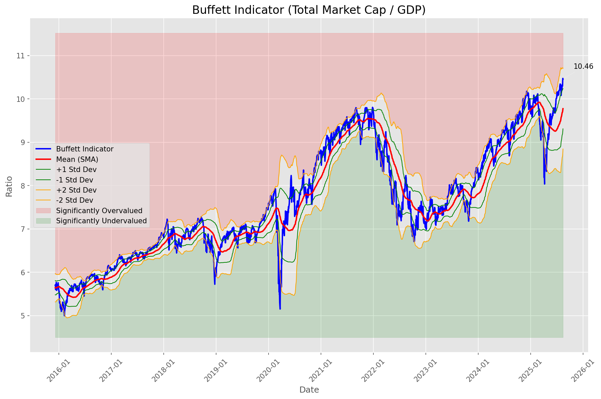
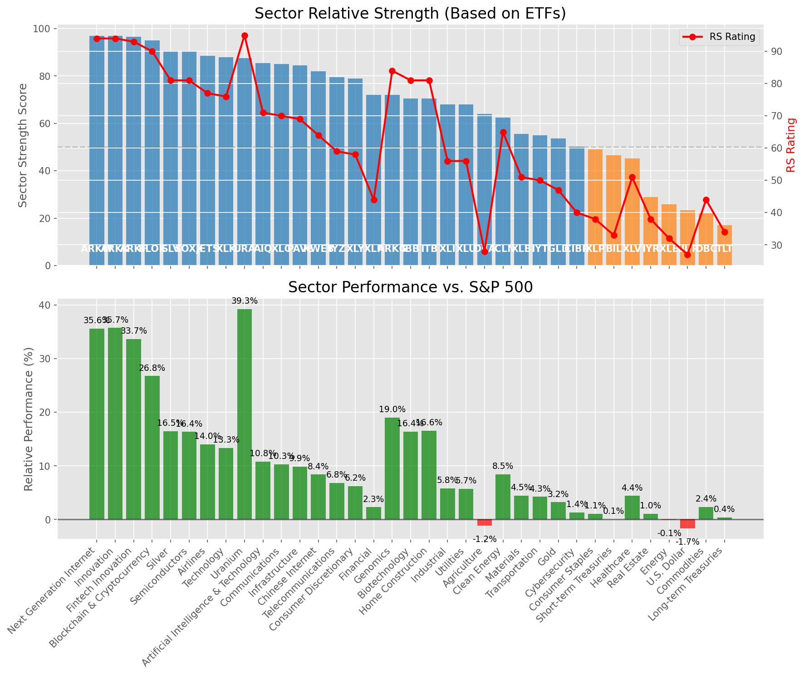

# **Daily Relative Strength Report**

**Date:** 2025-08-15

## **Market Valuation (Buffett Indicator)**

| Metric | Value |
|--------|-------|
| **Market Valuation** | **Overvalued** |
| **Current Ratio** | 10.45 |
| **Historical Mean** | 9.77 |
| **Standard Deviation** | 0.46 |
| **Z-Score (StdDev from Mean)** | 1.47 |
| **Total Market Cap** | $316.81 trillion |
| **GDP** | $30.33 trillion |

## **Market Insights**

### **Market is Overvalued**

The market appears to be trading above historical average valuations. While not at extreme levels, this suggests more modest future returns may be expected. Investors should:

- Focus on companies with reasonable valuations relative to their growth
- Be more selective with new positions
- Look for stocks showing relative strength within their sectors
- Consider trimming positions in extremely overvalued names

Historically, periods of mild overvaluation can persist for extended periods, but returns tend to be below average.

### **Buffett Indicator Overview**

The Buffett Indicator (Total Market Cap / GDP) is a measure of the stock market's valuation relative to the size of the economy. It is named after Warren Buffett, who described it as "probably the best single measure of where valuations stand at any given moment."

- **Values above +2 standard deviations:** Market significantly overvalued
- **Values above +1 standard deviation:** Market overvalued
- **Values between -1 and +1 standard deviations:** Market fairly valued
- **Values below -1 standard deviation:** Market undervalued
- **Values below -2 standard deviations:** Market significantly undervalued

---

## **Sector Relative Strength**

Based on William O'Neil's Relative Strength Methodology

| ETF | Strength | RS Rating | Performance | Above Key MAs | Trend | Sector |
|-----|----------|-----------|-------------|--------------|-------|--------|
| [ARKK](https://www.tradingview.com/chart/?symbol=ARKK) | 97.0 | 94.0 | 35.66% | 10d ✓, 50d ✓, 200d ✓ | ↗️ | Innovation |
| [ARKW](https://www.tradingview.com/chart/?symbol=ARKW) | 96.5 | 93.0 | 33.98% | 10d ✓, 50d ✓, 200d ✓ | ↗️ | Next Generation Internet |
| [ARKF](https://www.tradingview.com/chart/?symbol=ARKF) | 96.5 | 93.0 | 33.55% | 10d ✓, 50d ✓, 200d ✓ | ↗️ | Fintech Innovation |
| [BLOK](https://www.tradingview.com/chart/?symbol=BLOK) | 95.5 | 91.0 | 27.10% | 10d ✓, 50d ✓, 200d ✓ | ↗️ | Blockchain & Cryptocurrency |
| [SLV](https://www.tradingview.com/chart/?symbol=SLV) | 90.5 | 81.0 | 16.50% | 10d ✓, 50d ✓, 200d ✓ | ↗️ | Silver |
| [SOXX](https://www.tradingview.com/chart/?symbol=SOXX) | 90.0 | 80.0 | 16.34% | 10d ✓, 50d ✓, 200d ✓ | ↗️ | Semiconductors |
| [JETS](https://www.tradingview.com/chart/?symbol=JETS) | 88.5 | 77.0 | 14.09% | 10d ✓, 50d ✓, 200d ✓ | ↗️ | Airlines |
| [XLK](https://www.tradingview.com/chart/?symbol=XLK) | 88.0 | 76.0 | 13.34% | 10d ✓, 50d ✓, 200d ✓ | ↗️ | Technology |
| [URA](https://www.tradingview.com/chart/?symbol=URA) | 87.6 | 95.0 | 38.70% | 10d ✗, 50d ✓, 200d ✓ | ↗️ | Uranium |
| [AIQ](https://www.tradingview.com/chart/?symbol=AIQ) | 85.0 | 70.0 | 10.79% | 10d ✓, 50d ✓, 200d ✓ | ↗️ | Artificial Intelligence & Technology |
| [XLC](https://www.tradingview.com/chart/?symbol=XLC) | 85.0 | 70.0 | 10.62% | 10d ✓, 50d ✓, 200d ✓ | ↗️ | Communications |
| [PAVE](https://www.tradingview.com/chart/?symbol=PAVE) | 84.5 | 69.0 | 9.98% | 10d ✓, 50d ✓, 200d ✓ | ↗️ | Infrastructure |
| [KWEB](https://www.tradingview.com/chart/?symbol=KWEB) | 81.5 | 63.0 | 8.24% | 10d ✓, 50d ✓, 200d ✓ | ↗️ | Chinese Internet |
| [IYZ](https://www.tradingview.com/chart/?symbol=IYZ) | 79.5 | 59.0 | 6.91% | 10d ✓, 50d ✓, 200d ✓ | ↗️ | Telecommunications |
| [XLY](https://www.tradingview.com/chart/?symbol=XLY) | 78.0 | 56.0 | 6.17% | 10d ✓, 50d ✓, 200d ✓ | ↗️ | Consumer Discretionary |
| [ARKG](https://www.tradingview.com/chart/?symbol=ARKG) | 72.5 | 85.0 | 19.57% | 10d ✓, 50d ✓, 200d ✓ | ↘️ | Genomics |
| [XLF](https://www.tradingview.com/chart/?symbol=XLF) | 72.0 | 44.0 | 2.50% | 10d ✓, 50d ✓, 200d ✓ | ↗️ | Financial |
| [ITB](https://www.tradingview.com/chart/?symbol=ITB) | 70.5 | 81.0 | 16.93% | 10d ✓, 50d ✓, 200d ✓ | ↘️ | Home Construction |
| [IBB](https://www.tradingview.com/chart/?symbol=IBB) | 70.0 | 80.0 | 16.27% | 10d ✓, 50d ✓, 200d ✓ | ↘️ | Biotechnology |
| [XLU](https://www.tradingview.com/chart/?symbol=XLU) | 68.1 | 56.0 | 6.01% | 10d ✗, 50d ✓, 200d ✓ | ↗️ | Utilities |
| [XLI](https://www.tradingview.com/chart/?symbol=XLI) | 67.6 | 55.0 | 5.98% | 10d ✗, 50d ✓, 200d ✓ | ↗️ | Industrial |
| [DBA](https://www.tradingview.com/chart/?symbol=DBA) | 64.0 | 28.0 | -1.28% | 10d ✓, 50d ✓, 200d ✓ | ↗️ | Agriculture |
| [ICLN](https://www.tradingview.com/chart/?symbol=ICLN) | 63.0 | 66.0 | 9.04% | 10d ✓, 50d ✓, 200d ✓ | ↘️ | Clean Energy |
| [XLB](https://www.tradingview.com/chart/?symbol=XLB) | 55.5 | 51.0 | 4.63% | 10d ✓, 50d ✓, 200d ✓ | ↘️ | Materials |
| [IYT](https://www.tradingview.com/chart/?symbol=IYT) | 55.0 | 50.0 | 4.42% | 10d ✓, 50d ✓, 200d ✓ | ↘️ | Transportation |
| [GLD](https://www.tradingview.com/chart/?symbol=GLD) | 53.2 | 46.0 | 3.15% | 10d ✗, 50d ✗, 200d ✓ | ↗️ | Gold |
| [XLP](https://www.tradingview.com/chart/?symbol=XLP) | 49.5 | 39.0 | 1.34% | 10d ✓, 50d ✓, 200d ✓ | ↘️ | Consumer Staples |
| [CIBR](https://www.tradingview.com/chart/?symbol=CIBR) | 48.7 | 37.0 | 1.11% | 10d ✗, 50d ✗, 200d ✓ | ↗️ | Cybersecurity |
| [BIL](https://www.tradingview.com/chart/?symbol=BIL) | 46.0 | 32.0 | 0.07% | 10d ✓, 50d ✓, 200d ✓ | ↘️ | Short-term Treasuries |
| [XLV](https://www.tradingview.com/chart/?symbol=XLV) | 45.3 | 51.0 | 4.65% | 10d ✓, 50d ✓, 200d ✗ | ↘️ | Healthcare |
| [IYR](https://www.tradingview.com/chart/?symbol=IYR) | 38.6 | 37.0 | 1.15% | 10d ✓, 50d ✗, 200d ✓ | ↘️ | Real Estate |
| [XLE](https://www.tradingview.com/chart/?symbol=XLE) | 26.9 | 34.0 | 0.46% | 10d ✓, 50d ✗, 200d ✗ | ↘️ | Energy |
| [UUP](https://www.tradingview.com/chart/?symbol=UUP) | 23.4 | 27.0 | -1.65% | 10d ✗, 50d ✓, 200d ✗ | ↘️ | U.S. Dollar |
| [DBC](https://www.tradingview.com/chart/?symbol=DBC) | 21.5 | 43.0 | 2.20% | 10d ✗, 50d ✗, 200d ✗ | ↘️ | Commodities |
| [TLT](https://www.tradingview.com/chart/?symbol=TLT) | 16.5 | 33.0 | 0.27% | 10d ✗, 50d ✗, 200d ✗ | ↘️ | Long-term Treasuries |

### **Sector ETF Performance Interpretation**

This table shows the relative strength metrics for different market sectors based on their representative ETFs:

- **ETF**: The ETF used to measure sector performance (click for chart)
- **Strength**: Overall sector strength score (0-100) combining multiple factors
- **RS Rating**: O'Neil RS rating of the sector ETF
- **Performance**: Performance of the sector ETF relative to SPY
- **Above Key MAs**: Whether the ETF is trading above its 10, 50, and 200-day moving averages
- **Trend**: Whether the sector is in an uptrend (↗️) or downtrend (↘️)

### **Current Sector Leadership**

The current market leadership is coming from the following sectors: **Innovation, Next Generation Internet, Fintech Innovation**.

The **Innovation** sector (represented by **ARKK**) is showing particularly strong relative strength with an RS rating of 94.0 and performance of 35.66% vs. the S&P 500. This sector is trading above its 10-day, 50-day, 200-day moving average(s). Investors should consider focusing on high RS stocks within these leading sectors for potential outperformance.

---

## **Buy Recommendations**

The following 52 stocks show exceptional relative strength:

| RS Rating | Buy Score | Current Price | Chart | Name | Ticker |
|-----------|-----------|---------------|-------|------|--------|
| 100 | 100 | $68.37 | [Chart](https://www.tradingview.com/chart/?symbol=KTOS) | Kratos Defense & Security Solutions, Inc. | KTOS |
| 100 | 100 | $112.59 | [Chart](https://www.tradingview.com/chart/?symbol=HOOD) | Robinhood Markets, Inc. Class A Common Stock | HOOD |
| 100 | 100 | $74.91 | [Chart](https://www.tradingview.com/chart/?symbol=MP) | MP Materials Corp. | MP |
| 100 | 100 | $44.63 | [Chart](https://www.tradingview.com/chart/?symbol=RKLB) | Rocket Lab Corporation Common Stock | RKLB |
| 100 | 100 | $70.72 | [Chart](https://www.tradingview.com/chart/?symbol=NBIS) | Nebius Group N.V. Class A Ordinary Shares | NBIS |
| 99 | 100 | $97.01 | [Chart](https://www.tradingview.com/chart/?symbol=RYTM) | Rhythm Pharmaceuticals, Inc. Common Stock | RYTM |
| 99 | 100 | $174.11 | [Chart](https://www.tradingview.com/chart/?symbol=FUTU) | Futu Holdings Limited American Depositary Shares | FUTU |
| 98 | 100 | $25.48 | [Chart](https://www.tradingview.com/chart/?symbol=TME) | Tencent Music Entertainment Group American Depositary Shares, each representing two Class A Ordinary Shares | TME |
| 97 | 100 | $192.16 | [Chart](https://www.tradingview.com/chart/?symbol=COOP) | Mr. Cooper Group Inc. Common Stock | COOP |
| 96 | 100 | $66.72 | [Chart](https://www.tradingview.com/chart/?symbol=MRCY) | Mercury Systems Inc. | MRCY |
| 96 | 100 | $25.15 | [Chart](https://www.tradingview.com/chart/?symbol=ACAD) | Acadia Pharmaceuticals Inc. | ACAD |
| 96 | 100 | $84.78 | [Chart](https://www.tradingview.com/chart/?symbol=LIF) | Life360, Inc. Common Stock | LIF |
| 96 | 100 | $100.45 | [Chart](https://www.tradingview.com/chart/?symbol=EBAY) | eBay Inc | EBAY |
| 95 | 100 | $31.71 | [Chart](https://www.tradingview.com/chart/?symbol=PAAS) | Pan American Silver Corp. | PAAS |
| 94 | 100 | $74.98 | [Chart](https://www.tradingview.com/chart/?symbol=WNS) | WNS (Holdings) Limited | WNS |
| 94 | 100 | $54.10 | [Chart](https://www.tradingview.com/chart/?symbol=SIL) | Global X Silver Miners ETF (NEW) | SIL |
| 94 | 100 | $57.16 | [Chart](https://www.tradingview.com/chart/?symbol=BTI) | British American Tobacco p.l.c. American Depositary Shares, American Depositary Shares, each representing one Ordinary Share | BTI |
| 94 | 100 | $98.92 | [Chart](https://www.tradingview.com/chart/?symbol=TPB) | Turning Point Brands, Inc. | TPB |
| 94 | 100 | $26.18 | [Chart](https://www.tradingview.com/chart/?symbol=LQDA) | Liquidia Corporation Common Stock | LQDA |
| 93 | 100 | $122.01 | [Chart](https://www.tradingview.com/chart/?symbol=PPLT) | abrdn Physical Platinum Shares ETF | PPLT |
| 93 | 100 | $30.46 | [Chart](https://www.tradingview.com/chart/?symbol=OR) | OR Royalties Inc. | OR |
| 93 | 100 | $31.07 | [Chart](https://www.tradingview.com/chart/?symbol=SRAD) | Sportradar Group AG Class A Ordinary Shares | SRAD |
| 93 | 100 | $54.46 | [Chart](https://www.tradingview.com/chart/?symbol=ARKF) | ARK Fintech Innovation ETF | ARKF |
| 93 | 100 | $160.01 | [Chart](https://www.tradingview.com/chart/?symbol=ARKW) | ARK Next Generation Internet ETF | ARKW |
| 92 | 100 | $26.09 | [Chart](https://www.tradingview.com/chart/?symbol=TFPM) | Triple Flag Precious Metals Corp. | TFPM |
| 92 | 100 | $36.48 | [Chart](https://www.tradingview.com/chart/?symbol=DB) | Deutsche Bank Aktiengesellschaft | DB |
| 92 | 100 | $60.20 | [Chart](https://www.tradingview.com/chart/?symbol=VIK) | Viking Holdings Ltd | VIK |
| 91 | 100 | $23.05 | [Chart](https://www.tradingview.com/chart/?symbol=MAG) | MAG Silver Corp. | MAG |
| 90 | 100 | $38.73 | [Chart](https://www.tradingview.com/chart/?symbol=AS) | Amer Sports, Inc. | AS |
| 89 | 100 | $269.75 | [Chart](https://www.tradingview.com/chart/?symbol=IDCC) | InterDigital, Inc. | IDCC |
| 89 | 100 | $117.84 | [Chart](https://www.tradingview.com/chart/?symbol=SXT) | Sensient Technology Corporation | SXT |
| 88 | 100 | $161.79 | [Chart](https://www.tradingview.com/chart/?symbol=VSEC) | VSE Corp | VSEC |
| 89 | 99 | $53.42 | [Chart](https://www.tradingview.com/chart/?symbol=FHI) | Federated Hermes, Inc. | FHI |
| 88 | 98 | $66.40 | [Chart](https://www.tradingview.com/chart/?symbol=MAIN) | Main Street Capital Corporation | MAIN |
| 88 | 98 | $94.12 | [Chart](https://www.tradingview.com/chart/?symbol=C) | Citigroup Inc. | C |
| 85 | 98 | $43.97 | [Chart](https://www.tradingview.com/chart/?symbol=LTM) | LATAM Airlines Group S.A. American Depositary Shares (each representing two thousand (2,000) shares of Common Stock) | LTM |
| 86 | 97 | $252.58 | [Chart](https://www.tradingview.com/chart/?symbol=BAP) | Credicorp LTD | BAP |
| 86 | 96 | $192.93 | [Chart](https://www.tradingview.com/chart/?symbol=AWI) | Armstrong World Industries, Inc. | AWI |
| 84 | 96 | $93.06 | [Chart](https://www.tradingview.com/chart/?symbol=LLYVK) | Liberty Media Corporation Series C Liberty Live Common Stock | LLYVK |
| 83 | 96 | $118.61 | [Chart](https://www.tradingview.com/chart/?symbol=GILD) | Gilead Sciences Inc | GILD |
| 85 | 95 | $31.51 | [Chart](https://www.tradingview.com/chart/?symbol=IIIV) | i3 Verticals, Inc. Class A Common Stock | IIIV |
| 83 | 95 | $420.58 | [Chart](https://www.tradingview.com/chart/?symbol=CYBR) | CyberArk Software Ltd. | CYBR |
| 83 | 95 | $15.89 | [Chart](https://www.tradingview.com/chart/?symbol=MUFG) | Mitsubishi UFJ Financial Group, Inc. | MUFG |
| 82 | 95 | $189.49 | [Chart](https://www.tradingview.com/chart/?symbol=TKO) | TKO Group Holdings, Inc. | TKO |
| 81 | 95 | $20.30 | [Chart](https://www.tradingview.com/chart/?symbol=BCS) | Barclays PLC | BCS |
| 84 | 94 | $435.73 | [Chart](https://www.tradingview.com/chart/?symbol=APP) | Applovin Corporation Class A Common Stock | APP |
| 84 | 94 | $48.78 | [Chart](https://www.tradingview.com/chart/?symbol=FAST) | Fastenal Co | FAST |
| 83 | 94 | $24.86 | [Chart](https://www.tradingview.com/chart/?symbol=ING) | ING Groep N.V. American Depositary Shares | ING |
| 83 | 94 | $28.96 | [Chart](https://www.tradingview.com/chart/?symbol=CPS) | Cooper-Standard Automotive Inc. | CPS |
| 81 | 94 | $48.85 | [Chart](https://www.tradingview.com/chart/?symbol=EWP) | iShares MSCI Spain ETF | EWP |
| 80 | 94 | $40.48 | [Chart](https://www.tradingview.com/chart/?symbol=AHR) | American Healthcare REIT, Inc. | AHR |
| 83 | 93 | $12.89 | [Chart](https://www.tradingview.com/chart/?symbol=PSLV) | Sprott Physical Silver Trust | PSLV |

---

## **Sell Recommendations**

The following 114 stocks show deteriorating relative strength:

| RS Rating | Sell Score | Current Price | Chart | Name | Ticker |
|-----------|------------|---------------|-------|------|--------|
| 1 | 100 | $11.80 | [Chart](https://www.tradingview.com/chart/?symbol=NVDS) | Investment Managers Series Trust II Tradr 1.5X Short NVDA Daily ETF | NVDS |
| 1 | 100 | $198.38 | [Chart](https://www.tradingview.com/chart/?symbol=LULU) | lululemon athletica inc. | LULU |
| 2 | 100 | $23.29 | [Chart](https://www.tradingview.com/chart/?symbol=TECS) | Direxion Daily Technology Bear 3x Shares | TECS |
| 2 | 100 | $26.10 | [Chart](https://www.tradingview.com/chart/?symbol=CRI) | Carter's Inc. | CRI |
| 3 | 100 | $23.22 | [Chart](https://www.tradingview.com/chart/?symbol=ZSL) | ProShares UltraShort Silver | ZSL |
| 4 | 100 | $20.71 | [Chart](https://www.tradingview.com/chart/?symbol=GAP) | The Gap, Inc. | GAP |
| 6 | 100 | $57.37 | [Chart](https://www.tradingview.com/chart/?symbol=ATKR) | Atkore Inc. | ATKR |
| 6 | 100 | $12.47 | [Chart](https://www.tradingview.com/chart/?symbol=ARDT) | Ardent Health, Inc. | ARDT |
| 7 | 100 | $39.28 | [Chart](https://www.tradingview.com/chart/?symbol=SDOW) | ProShares UltraPro Short Dow 30 | SDOW |
| 7 | 100 | $25.30 | [Chart](https://www.tradingview.com/chart/?symbol=CZR) | Caesars Entertainment, Inc. Common Stock | CZR |
| 7 | 100 | $77.50 | [Chart](https://www.tradingview.com/chart/?symbol=ESTC) | Elastic N.V. | ESTC |
| 7 | 100 | $28.62 | [Chart](https://www.tradingview.com/chart/?symbol=BBWI) | Bath & Body Works, Inc. | BBWI |
| 7 | 100 | $16.75 | [Chart](https://www.tradingview.com/chart/?symbol=S) | SentinelOne, Inc. | S |
| 7 | 100 | $24.04 | [Chart](https://www.tradingview.com/chart/?symbol=CRTO) | Criteo S.A. | CRTO |
| 10 | 100 | $69.19 | [Chart](https://www.tradingview.com/chart/?symbol=EXPO) | Exponent Inc | EXPO |
| 10 | 100 | $16.63 | [Chart](https://www.tradingview.com/chart/?symbol=BTAL) | AGF U.S. Market Neutral Anti-Beta Fund | BTAL |
| 12 | 100 | $16.38 | [Chart](https://www.tradingview.com/chart/?symbol=CTO) | CTO Realty Growth, Inc. | CTO |
| 14 | 100 | $14.16 | [Chart](https://www.tradingview.com/chart/?symbol=VRE) | Veris Residential, Inc. | VRE |
| 2 | 99 | $11.81 | [Chart](https://www.tradingview.com/chart/?symbol=NVCR) | NovoCure Limited Ordinary Shares | NVCR |
| 3 | 99 | $47.14 | [Chart](https://www.tradingview.com/chart/?symbol=CPRT) | Copart Inc | CPRT |
| 7 | 99 | $10.95 | [Chart](https://www.tradingview.com/chart/?symbol=PATH) | UiPath, Inc. | PATH |
| 11 | 99 | $23.43 | [Chart](https://www.tradingview.com/chart/?symbol=DXD) | ProShares UltraShort Dow 30 | DXD |
| 6 | 97 | $41.30 | [Chart](https://www.tradingview.com/chart/?symbol=VIST) | Vista Energy S.A.B. de C.V. | VIST |
| 9 | 97 | $74.55 | [Chart](https://www.tradingview.com/chart/?symbol=OKE) | Oneok, Inc. | OKE |
| 14 | 97 | $10.55 | [Chart](https://www.tradingview.com/chart/?symbol=NRIX) | Nurix Therapeutics, Inc. Common stock | NRIX |
| 15 | 97 | $38.43 | [Chart](https://www.tradingview.com/chart/?symbol=UDR) | UDR, Inc. | UDR |
| 17 | 97 | $37.55 | [Chart](https://www.tradingview.com/chart/?symbol=KSA) | iShares MSCI Saudi Arabia ETF | KSA |
| 7 | 96 | $43.65 | [Chart](https://www.tradingview.com/chart/?symbol=GTLB) | GitLab Inc. Class A Common Stock | GTLB |
| 10 | 96 | $28.93 | [Chart](https://www.tradingview.com/chart/?symbol=CNX) | CNX Resources Corporation | CNX |
| 11 | 96 | $17.33 | [Chart](https://www.tradingview.com/chart/?symbol=SVOL) | Simplify Volatility Premium ETF | SVOL |
| 15 | 96 | $38.41 | [Chart](https://www.tradingview.com/chart/?symbol=SH) | ProShares Short S&P500 | SH |
| 14 | 95 | $10.75 | [Chart](https://www.tradingview.com/chart/?symbol=DVAX) | Dynavax Technologies Corporation | DVAX |
| 16 | 95 | $25.41 | [Chart](https://www.tradingview.com/chart/?symbol=FCPT) | Four Corners Property Trust, Inc. | FCPT |
| 9 | 94 | $415.56 | [Chart](https://www.tradingview.com/chart/?symbol=WSO) | Watsco, Inc. | WSO |
| 10 | 94 | $85.51 | [Chart](https://www.tradingview.com/chart/?symbol=MMSI) | Merit Medical Systems Inc | MMSI |
| 11 | 94 | $31.19 | [Chart](https://www.tradingview.com/chart/?symbol=DAR) | DARLING INGREDIENTS INC. | DAR |
| 13 | 94 | $32.44 | [Chart](https://www.tradingview.com/chart/?symbol=PSQ) | ProShares Short QQQ | PSQ |
| 13 | 94 | $14.99 | [Chart](https://www.tradingview.com/chart/?symbol=PLYM) | Plymouth Industrial REIT, Inc. | PLYM |
| 13 | 94 | $64.22 | [Chart](https://www.tradingview.com/chart/?symbol=EQR) | Equity Residential | EQR |
| 13 | 93 | $34.67 | [Chart](https://www.tradingview.com/chart/?symbol=AMH) | AMERICAN HOMES 4 RENT | AMH |
| 15 | 93 | $42.92 | [Chart](https://www.tradingview.com/chart/?symbol=SW) | Smurfit Westrock plc | SW |
| 15 | 93 | $91.66 | [Chart](https://www.tradingview.com/chart/?symbol=IRM) | Iron Mountain Inc. | IRM |
| 17 | 93 | $12.20 | [Chart](https://www.tradingview.com/chart/?symbol=PMT) | PennyMac Mortgage Investment Trust | PMT |
| 9 | 92 | $15.09 | [Chart](https://www.tradingview.com/chart/?symbol=MCS) | The Marcus Corporation | MCS |
| 13 | 92 | $17.39 | [Chart](https://www.tradingview.com/chart/?symbol=IRT) | Independence Realty Trust Inc. | IRT |
| 17 | 92 | $284.14 | [Chart](https://www.tradingview.com/chart/?symbol=PSA) | Public Storage | PSA |
| 18 | 92 | $25.14 | [Chart](https://www.tradingview.com/chart/?symbol=DOG) | ProShares Short Dow30 | DOG |
| 20 | 92 | $22.36 | [Chart](https://www.tradingview.com/chart/?symbol=CURB) | Curbline Properties Corp. | CURB |
| 23 | 92 | $12.18 | [Chart](https://www.tradingview.com/chart/?symbol=WSR) | Whitestone REIT | WSR |
| 13 | 91 | $106.88 | [Chart](https://www.tradingview.com/chart/?symbol=CPT) | Camden Property Trust | CPT |
| 19 | 91 | $162.41 | [Chart](https://www.tradingview.com/chart/?symbol=EGP) | EastGroup Properties Inc. | EGP |
| 20 | 91 | $10.09 | [Chart](https://www.tradingview.com/chart/?symbol=NMZ) | Nuveen Municipal High Income Opportunity Fund | NMZ |
| 13 | 90 | $782.46 | [Chart](https://www.tradingview.com/chart/?symbol=EQIX) | Equinix, Inc. Common Stock REIT | EQIX |
| 16 | 90 | $12.89 | [Chart](https://www.tradingview.com/chart/?symbol=NAVI) | Navient Corporation | NAVI |
| 17 | 90 | $13.01 | [Chart](https://www.tradingview.com/chart/?symbol=CCRN) | Cross Country Healthcare Inc | CCRN |
| 18 | 90 | $37.01 | [Chart](https://www.tradingview.com/chart/?symbol=VNO) | Vornado Realty Trust | VNO |
| 13 | 89 | $14.44 | [Chart](https://www.tradingview.com/chart/?symbol=CHCT) | Community Healthcare Trust Incorporated Common Stock, $0.01 par value per share | CHCT |
| 13 | 89 | $125.91 | [Chart](https://www.tradingview.com/chart/?symbol=INGR) | Ingredion Incorporated | INGR |
| 19 | 89 | $28.48 | [Chart](https://www.tradingview.com/chart/?symbol=HRL) | Hormel Foods Corporation | HRL |
| 23 | 89 | $332.71 | [Chart](https://www.tradingview.com/chart/?symbol=EG) | Everest Group, Ltd. | EG |
| 29 | 89 | $48.58 | [Chart](https://www.tradingview.com/chart/?symbol=EDU) | New Oriental Education and Technology Group, Inc. American Depositary Shares (each representing ten (10) Common Shares) | EDU |
| 17 | 88 | $69.99 | [Chart](https://www.tradingview.com/chart/?symbol=MKC) | McCormick & Company, Incorporated Non-VTG CS | MKC |
| 18 | 88 | $275.43 | [Chart](https://www.tradingview.com/chart/?symbol=CB) | Chubb Limited | CB |
| 18 | 88 | $135.51 | [Chart](https://www.tradingview.com/chart/?symbol=DVA) | DaVita Inc. | DVA |
| 19 | 88 | $33.45 | [Chart](https://www.tradingview.com/chart/?symbol=CMCSA) | Comcast Corp | CMCSA |
| 21 | 88 | $48.88 | [Chart](https://www.tradingview.com/chart/?symbol=FR) | First Industrial Realty Trust, Inc. | FR |
| 23 | 88 | $19.39 | [Chart](https://www.tradingview.com/chart/?symbol=CVBF) | CVB Financial Corp | CVBF |
| 25 | 88 | $36.73 | [Chart](https://www.tradingview.com/chart/?symbol=PBA) | PEMBINA PIPELINE CORPORATION | PBA |
| 15 | 87 | $318.66 | [Chart](https://www.tradingview.com/chart/?symbol=CPAY) | Corpay, Inc. | CPAY |
| 19 | 87 | $85.21 | [Chart](https://www.tradingview.com/chart/?symbol=CL) | Colgate-Palmolive Company | CL |
| 25 | 87 | $37.75 | [Chart](https://www.tradingview.com/chart/?symbol=FLIN) | Franklin FTSE India ETF | FLIN |
| 15 | 86 | $31.59 | [Chart](https://www.tradingview.com/chart/?symbol=JD) | JD.com, Inc. | JD |
| 21 | 86 | $155.34 | [Chart](https://www.tradingview.com/chart/?symbol=PG) | Procter & Gamble Company | PG |
| 21 | 85 | $44.58 | [Chart](https://www.tradingview.com/chart/?symbol=EPI) | WisdomTree India Earnings Fund ETF | EPI |
| 24 | 85 | $106.52 | [Chart](https://www.tradingview.com/chart/?symbol=PLD) | PROLOGIS, INC. | PLD |
| 30 | 85 | $22.68 | [Chart](https://www.tradingview.com/chart/?symbol=TLTW) | iShares 20+ Year Treasury Bond BuyWrite Strategy ETF | TLTW |
| 22 | 84 | $29.80 | [Chart](https://www.tradingview.com/chart/?symbol=CNQ) | Canadian Natural Resources Limited | CNQ |
| 26 | 83 | $25.96 | [Chart](https://www.tradingview.com/chart/?symbol=WY) | Weyerhaeuser Company | WY |
| 20 | 82 | $30.55 | [Chart](https://www.tradingview.com/chart/?symbol=EPRT) | Essential Properties Realty Trust, Inc. | EPRT |
| 25 | 82 | $14.64 | [Chart](https://www.tradingview.com/chart/?symbol=DEI) | Douglas Emmett, Inc. | DEI |
| 25 | 82 | $238.14 | [Chart](https://www.tradingview.com/chart/?symbol=RNR) | RenaissanceRe Holdings Ltd. | RNR |
| 26 | 82 | $72.66 | [Chart](https://www.tradingview.com/chart/?symbol=ADC) | Agree Realty Corporation | ADC |
| 27 | 82 | $14.19 | [Chart](https://www.tradingview.com/chart/?symbol=BMEZ) | BlackRock Health Sciences Term Trust | BMEZ |
| 21 | 81 | $176.88 | [Chart](https://www.tradingview.com/chart/?symbol=DOV) | Dover Corporation | DOV |
| 23 | 81 | $14.24 | [Chart](https://www.tradingview.com/chart/?symbol=INMD) | InMode Ltd. Ordinary Shares | INMD |
| 28 | 81 | $14.77 | [Chart](https://www.tradingview.com/chart/?symbol=GBDC) | Golub Capital BDC, Inc. | GBDC |
| 28 | 81 | $18.23 | [Chart](https://www.tradingview.com/chart/?symbol=EBF) | Ennis, Inc. | EBF |
| 29 | 81 | $36.82 | [Chart](https://www.tradingview.com/chart/?symbol=TMF) | Direxion Daily 20+ Year Treasury Bull 3X Shares (based on the NYSE 20 Year Plus Treasury Bond Index; symbol AXTWEN) | TMF |
| 22 | 80 | $220.50 | [Chart](https://www.tradingview.com/chart/?symbol=SBAC) | SBA Communications Corp | SBAC |
| 28 | 80 | $19.89 | [Chart](https://www.tradingview.com/chart/?symbol=STWD) | STARWOOD PROPERTY TRUST, INC. | STWD |
| 29 | 80 | $12.19 | [Chart](https://www.tradingview.com/chart/?symbol=RQI) | COHEN & STEERS QUALITY INCOME REALTY FUND, INC. COMMON SHARES | RQI |
| 22 | 79 | $77.57 | [Chart](https://www.tradingview.com/chart/?symbol=MET) | MetLife, Inc. | MET |
| 22 | 79 | $11.91 | [Chart](https://www.tradingview.com/chart/?symbol=CEPU) | Central Puerto S.A. American Depositary Shares (each represents ten Common Shares) | CEPU |
| 23 | 79 | $69.33 | [Chart](https://www.tradingview.com/chart/?symbol=PYPL) | PayPal Holdings, Inc. Common Stock | PYPL |
| 27 | 79 | $46.24 | [Chart](https://www.tradingview.com/chart/?symbol=GLPI) | Gaming and Leisure Properties, Inc. | GLPI |
| 28 | 79 | $61.13 | [Chart](https://www.tradingview.com/chart/?symbol=UL) | Unilever plc | UL |
| 31 | 79 | $17.29 | [Chart](https://www.tradingview.com/chart/?symbol=DOC) | Healthpeak Properties, Inc. | DOC |
| 34 | 78 | $55.08 | [Chart](https://www.tradingview.com/chart/?symbol=VGLT) | Vanguard Long-Term Treasury ETF | VGLT |
| 26 | 76 | $84.33 | [Chart](https://www.tradingview.com/chart/?symbol=GGG) | Graco Inc | GGG |
| 29 | 76 | $21.21 | [Chart](https://www.tradingview.com/chart/?symbol=KIM) | Kimco Realty Corp. | KIM |
| 33 | 76 | $86.31 | [Chart](https://www.tradingview.com/chart/?symbol=TLT) | iShares 20+ Year Treasury Bond ETF | TLT |
| 31 | 74 | $12.04 | [Chart](https://www.tradingview.com/chart/?symbol=PBR) | PETROLEO BRASILEIRO S.A.-PETROBRAS ADS (REP 1 COMMON SHARE) | PBR |
| 33 | 74 | $22.59 | [Chart](https://www.tradingview.com/chart/?symbol=UCTT) | Ultra Clean Holdings, Inc. | UCTT |
| 34 | 74 | $56.17 | [Chart](https://www.tradingview.com/chart/?symbol=USRT) | iShares Core U.S. REIT ETF | USRT |
| 35 | 72 | $89.75 | [Chart](https://www.tradingview.com/chart/?symbol=VNQ) | Vanguard Real Estate ETF | VNQ |
| 36 | 71 | $136.54 | [Chart](https://www.tradingview.com/chart/?symbol=VLO) | Valero Energy Corporation | VLO |
| 32 | 70 | $23.09 | [Chart](https://www.tradingview.com/chart/?symbol=FCG) | First Trust Natural Gas ETF | FCG |
| 35 | 70 | $53.77 | [Chart](https://www.tradingview.com/chart/?symbol=BALL) | Ball Corporation | BALL |
| 38 | 70 | $25.67 | [Chart](https://www.tradingview.com/chart/?symbol=CGON) | CG Oncology, Inc. Common stock | CGON |
| 36 | 69 | $24.48 | [Chart](https://www.tradingview.com/chart/?symbol=SNDR) | Schneider National, Inc. | SNDR |
| 37 | 69 | $34.43 | [Chart](https://www.tradingview.com/chart/?symbol=RDN) | Radian Group Inc. | RDN |
| 39 | 69 | $21.32 | [Chart](https://www.tradingview.com/chart/?symbol=HAL) | Halliburton Company | HAL |
| 34 | 68 | $86.00 | [Chart](https://www.tradingview.com/chart/?symbol=XLE) | Energy Select Sector SPDR Fund | XLE |
| 39 | 67 | $31.24 | [Chart](https://www.tradingview.com/chart/?symbol=SRRK) | Scholar Rock Holding Corporation Common Stock | SRRK |

## **Methodology**

This report uses William O'Neil's relative strength methodology from Investors Business Daily:

* **RS Rating**: Percentile rank of stock's performance vs. S&P 500 over the past 63 trading days (1-99 scale)
* **Buy Criteria**: RS Rating >= 80, price above 50-day MA, strong uptrend, increasing volume
* **Sell Criteria**: RS Rating < 40, price below 50-day MA, downtrend, decreasing volume

### **O'Neil's Key Principles**

1. **Focus on relative performance** - stocks outperforming the market
2. **Price trend confirmation** - stock must be in an uptrend
3. **Volume confirmation** - strong volume supports price moves
4. **Moving average validation** - price above key moving averages
5. **Market leaders only** - concentrate on top-performing stocks

*Report generated automatically after market close*