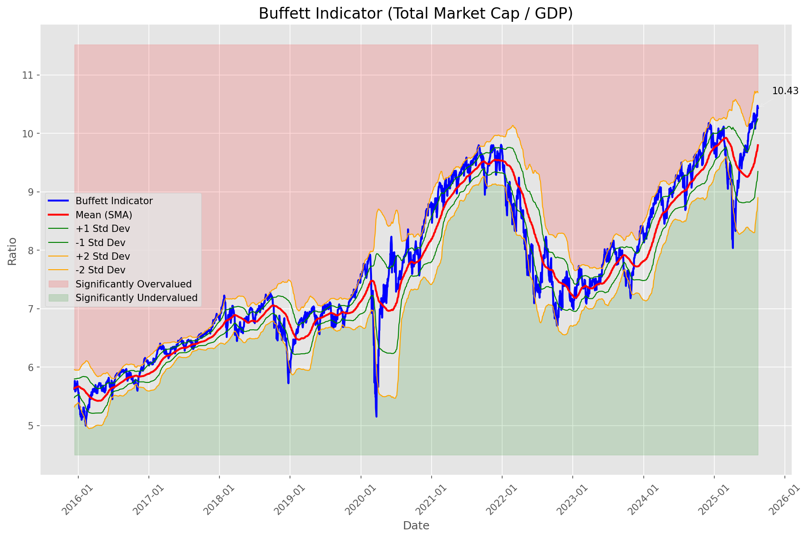
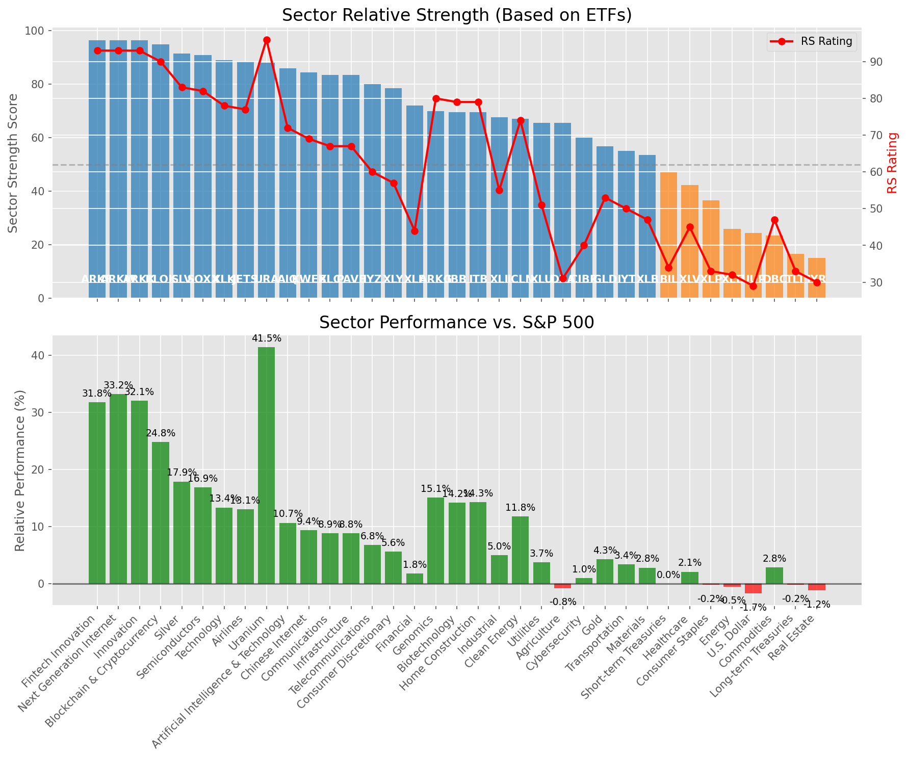

# **Daily Relative Strength Report**

**Date:** 2025-08-18

## **Market Valuation (Buffett Indicator)**

| Metric | Value |
|--------|-------|
| **Market Valuation** | **Overvalued** |
| **Current Ratio** | 10.44 |
| **Historical Mean** | 9.80 |
| **Standard Deviation** | 0.45 |
| **Z-Score (StdDev from Mean)** | 1.42 |
| **Total Market Cap** | $316.59 trillion |
| **GDP** | $30.33 trillion |

## **Market Insights**

### **Market is Overvalued**

The market appears to be trading above historical average valuations. While not at extreme levels, this suggests more modest future returns may be expected. Investors should:

- Focus on companies with reasonable valuations relative to their growth
- Be more selective with new positions
- Look for stocks showing relative strength within their sectors
- Consider trimming positions in extremely overvalued names

Historically, periods of mild overvaluation can persist for extended periods, but returns tend to be below average.

### **Buffett Indicator Overview**

The Buffett Indicator (Total Market Cap / GDP) is a measure of the stock market's valuation relative to the size of the economy. It is named after Warren Buffett, who described it as "probably the best single measure of where valuations stand at any given moment."

- **Values above +2 standard deviations:** Market significantly overvalued
- **Values above +1 standard deviation:** Market overvalued
- **Values between -1 and +1 standard deviations:** Market fairly valued
- **Values below -1 standard deviation:** Market undervalued
- **Values below -2 standard deviations:** Market significantly undervalued

---

## **Sector Relative Strength**

Based on William O'Neil's Relative Strength Methodology

| ETF | Strength | RS Rating | Performance | Above Key MAs | Trend | Sector |
|-----|----------|-----------|-------------|--------------|-------|--------|
| [ARKF](https://www.tradingview.com/chart/?symbol=ARKF) | 96.5 | 93.0 | 31.82% | 10d ✓, 50d ✓, 200d ✓ | ↗️ | Fintech Innovation |
| [ARKK](https://www.tradingview.com/chart/?symbol=ARKK) | 96.5 | 93.0 | 32.11% | 10d ✓, 50d ✓, 200d ✓ | ↗️ | Innovation |
| [ARKW](https://www.tradingview.com/chart/?symbol=ARKW) | 96.5 | 93.0 | 33.23% | 10d ✓, 50d ✓, 200d ✓ | ↗️ | Next Generation Internet |
| [BLOK](https://www.tradingview.com/chart/?symbol=BLOK) | 95.0 | 90.0 | 24.80% | 10d ✓, 50d ✓, 200d ✓ | ↗️ | Blockchain & Cryptocurrency |
| [SLV](https://www.tradingview.com/chart/?symbol=SLV) | 91.5 | 83.0 | 17.92% | 10d ✓, 50d ✓, 200d ✓ | ↗️ | Silver |
| [SOXX](https://www.tradingview.com/chart/?symbol=SOXX) | 91.0 | 82.0 | 16.85% | 10d ✓, 50d ✓, 200d ✓ | ↗️ | Semiconductors |
| [XLK](https://www.tradingview.com/chart/?symbol=XLK) | 89.0 | 78.0 | 13.36% | 10d ✓, 50d ✓, 200d ✓ | ↗️ | Technology |
| [JETS](https://www.tradingview.com/chart/?symbol=JETS) | 88.5 | 77.0 | 13.06% | 10d ✓, 50d ✓, 200d ✓ | ↗️ | Airlines |
| [URA](https://www.tradingview.com/chart/?symbol=URA) | 88.1 | 96.0 | 41.47% | 10d ✗, 50d ✓, 200d ✓ | ↗️ | Uranium |
| [AIQ](https://www.tradingview.com/chart/?symbol=AIQ) | 86.0 | 72.0 | 10.68% | 10d ✓, 50d ✓, 200d ✓ | ↗️ | Artificial Intelligence & Technology |
| [KWEB](https://www.tradingview.com/chart/?symbol=KWEB) | 84.5 | 69.0 | 9.36% | 10d ✓, 50d ✓, 200d ✓ | ↗️ | Chinese Internet |
| [XLC](https://www.tradingview.com/chart/?symbol=XLC) | 83.5 | 67.0 | 8.86% | 10d ✓, 50d ✓, 200d ✓ | ↗️ | Communications |
| [PAVE](https://www.tradingview.com/chart/?symbol=PAVE) | 83.5 | 67.0 | 8.82% | 10d ✓, 50d ✓, 200d ✓ | ↗️ | Infrastructure |
| [IYZ](https://www.tradingview.com/chart/?symbol=IYZ) | 80.0 | 60.0 | 6.83% | 10d ✓, 50d ✓, 200d ✓ | ↗️ | Telecommunications |
| [XLY](https://www.tradingview.com/chart/?symbol=XLY) | 78.5 | 57.0 | 5.65% | 10d ✓, 50d ✓, 200d ✓ | ↗️ | Consumer Discretionary |
| [XLF](https://www.tradingview.com/chart/?symbol=XLF) | 72.0 | 44.0 | 1.76% | 10d ✓, 50d ✓, 200d ✓ | ↗️ | Financial |
| [ARKG](https://www.tradingview.com/chart/?symbol=ARKG) | 70.0 | 80.0 | 15.14% | 10d ✓, 50d ✓, 200d ✓ | ↘️ | Genomics |
| [ITB](https://www.tradingview.com/chart/?symbol=ITB) | 69.5 | 79.0 | 14.33% | 10d ✓, 50d ✓, 200d ✓ | ↘️ | Home Construction |
| [IBB](https://www.tradingview.com/chart/?symbol=IBB) | 69.5 | 79.0 | 14.21% | 10d ✓, 50d ✓, 200d ✓ | ↘️ | Biotechnology |
| [XLI](https://www.tradingview.com/chart/?symbol=XLI) | 67.6 | 55.0 | 5.04% | 10d ✗, 50d ✓, 200d ✓ | ↗️ | Industrial |
| [ICLN](https://www.tradingview.com/chart/?symbol=ICLN) | 67.0 | 74.0 | 11.81% | 10d ✓, 50d ✓, 200d ✓ | ↘️ | Clean Energy |
| [XLU](https://www.tradingview.com/chart/?symbol=XLU) | 65.6 | 51.0 | 3.74% | 10d ✗, 50d ✓, 200d ✓ | ↗️ | Utilities |
| [DBA](https://www.tradingview.com/chart/?symbol=DBA) | 65.5 | 31.0 | -0.77% | 10d ✓, 50d ✓, 200d ✓ | ↗️ | Agriculture |
| [CIBR](https://www.tradingview.com/chart/?symbol=CIBR) | 60.1 | 40.0 | 1.02% | 10d ✓, 50d ✗, 200d ✓ | ↗️ | Cybersecurity |
| [GLD](https://www.tradingview.com/chart/?symbol=GLD) | 56.7 | 53.0 | 4.32% | 10d ✗, 50d ✗, 200d ✓ | ↗️ | Gold |
| [IYT](https://www.tradingview.com/chart/?symbol=IYT) | 55.0 | 50.0 | 3.41% | 10d ✓, 50d ✓, 200d ✓ | ↘️ | Transportation |
| [XLB](https://www.tradingview.com/chart/?symbol=XLB) | 53.5 | 47.0 | 2.83% | 10d ✓, 50d ✓, 200d ✓ | ↘️ | Materials |
| [BIL](https://www.tradingview.com/chart/?symbol=BIL) | 47.0 | 34.0 | 0.02% | 10d ✓, 50d ✓, 200d ✓ | ↘️ | Short-term Treasuries |
| [XLV](https://www.tradingview.com/chart/?symbol=XLV) | 42.3 | 45.0 | 2.10% | 10d ✓, 50d ✓, 200d ✗ | ↘️ | Healthcare |
| [XLP](https://www.tradingview.com/chart/?symbol=XLP) | 36.6 | 33.0 | -0.19% | 10d ✗, 50d ✓, 200d ✓ | ↘️ | Consumer Staples |
| [XLE](https://www.tradingview.com/chart/?symbol=XLE) | 25.9 | 32.0 | -0.50% | 10d ✓, 50d ✗, 200d ✗ | ↘️ | Energy |
| [UUP](https://www.tradingview.com/chart/?symbol=UUP) | 24.4 | 29.0 | -1.69% | 10d ✗, 50d ✓, 200d ✗ | ↘️ | U.S. Dollar |
| [DBC](https://www.tradingview.com/chart/?symbol=DBC) | 23.5 | 47.0 | 2.83% | 10d ✗, 50d ✗, 200d ✗ | ↘️ | Commodities |
| [TLT](https://www.tradingview.com/chart/?symbol=TLT) | 16.5 | 33.0 | -0.17% | 10d ✗, 50d ✗, 200d ✗ | ↘️ | Long-term Treasuries |
| [IYR](https://www.tradingview.com/chart/?symbol=IYR) | 15.0 | 30.0 | -1.18% | 10d ✗, 50d ✗, 200d ✗ | ↘️ | Real Estate |

### **Sector ETF Performance Interpretation**

This table shows the relative strength metrics for different market sectors based on their representative ETFs:

- **ETF**: The ETF used to measure sector performance (click for chart)
- **Strength**: Overall sector strength score (0-100) combining multiple factors
- **RS Rating**: O'Neil RS rating of the sector ETF
- **Performance**: Performance of the sector ETF relative to SPY
- **Above Key MAs**: Whether the ETF is trading above its 10, 50, and 200-day moving averages
- **Trend**: Whether the sector is in an uptrend (↗️) or downtrend (↘️)

### **Current Sector Leadership**

The current market leadership is coming from the following sectors: **Fintech Innovation, Innovation, Next Generation Internet**.

The **Fintech Innovation** sector (represented by **ARKF**) is showing particularly strong relative strength with an RS rating of 93.0 and performance of 31.82% vs. the S&P 500. This sector is trading above its 10-day, 50-day, 200-day moving average(s). Investors should consider focusing on high RS stocks within these leading sectors for potential outperformance.

---

## **Buy Recommendations**

The following 57 stocks show exceptional relative strength:

| RS Rating | Buy Score | Current Price | Chart | Name | Ticker |
|-----------|-----------|---------------|-------|------|--------|
| 100 | 100 | $115.02 | [Chart](https://www.tradingview.com/chart/?symbol=HOOD) | Robinhood Markets, Inc. Class A Common Stock | HOOD |
| 100 | 100 | $68.74 | [Chart](https://www.tradingview.com/chart/?symbol=KTOS) | Kratos Defense & Security Solutions, Inc. | KTOS |
| 100 | 100 | $44.97 | [Chart](https://www.tradingview.com/chart/?symbol=RKLB) | Rocket Lab Corporation Common Stock | RKLB |
| 100 | 100 | $72.54 | [Chart](https://www.tradingview.com/chart/?symbol=NBIS) | Nebius Group N.V. Class A Ordinary Shares | NBIS |
| 99 | 100 | $172.92 | [Chart](https://www.tradingview.com/chart/?symbol=FUTU) | Futu Holdings Limited American Depositary Shares | FUTU |
| 99 | 100 | $98.09 | [Chart](https://www.tradingview.com/chart/?symbol=RYTM) | Rhythm Pharmaceuticals, Inc. Common Stock | RYTM |
| 98 | 100 | $25.51 | [Chart](https://www.tradingview.com/chart/?symbol=TME) | Tencent Music Entertainment Group American Depositary Shares, each representing two Class A Ordinary Shares | TME |
| 97 | 100 | $105.79 | [Chart](https://www.tradingview.com/chart/?symbol=VRNA) | Verona Pharma plc | VRNA |
| 97 | 100 | $87.20 | [Chart](https://www.tradingview.com/chart/?symbol=LIF) | Life360, Inc. Common Stock | LIF |
| 97 | 100 | $66.80 | [Chart](https://www.tradingview.com/chart/?symbol=MRCY) | Mercury Systems Inc. | MRCY |
| 97 | 100 | $59.47 | [Chart](https://www.tradingview.com/chart/?symbol=GH) | Guardant Health, Inc. Common Stock | GH |
| 97 | 100 | $27.72 | [Chart](https://www.tradingview.com/chart/?symbol=LQDA) | Liquidia Corporation Common Stock | LQDA |
| 95 | 100 | $31.69 | [Chart](https://www.tradingview.com/chart/?symbol=PAAS) | Pan American Silver Corp. | PAAS |
| 95 | 100 | $53.86 | [Chart](https://www.tradingview.com/chart/?symbol=SIL) | Global X Silver Miners ETF (NEW) | SIL |
| 95 | 100 | $99.03 | [Chart](https://www.tradingview.com/chart/?symbol=EBAY) | eBay Inc | EBAY |
| 94 | 100 | $98.65 | [Chart](https://www.tradingview.com/chart/?symbol=TPB) | Turning Point Brands, Inc. | TPB |
| 94 | 100 | $75.14 | [Chart](https://www.tradingview.com/chart/?symbol=WNS) | WNS (Holdings) Limited | WNS |
| 94 | 100 | $57.72 | [Chart](https://www.tradingview.com/chart/?symbol=BTI) | British American Tobacco p.l.c. American Depositary Shares, American Depositary Shares, each representing one Ordinary Share | BTI |
| 93 | 100 | $159.78 | [Chart](https://www.tradingview.com/chart/?symbol=ARKW) | ARK Next Generation Internet ETF | ARKW |
| 93 | 100 | $36.59 | [Chart](https://www.tradingview.com/chart/?symbol=DB) | Deutsche Bank Aktiengesellschaft | DB |
| 93 | 100 | $54.56 | [Chart](https://www.tradingview.com/chart/?symbol=ARKF) | ARK Fintech Innovation ETF | ARKF |
| 93 | 100 | $30.81 | [Chart](https://www.tradingview.com/chart/?symbol=OR) | OR Royalties Inc. | OR |
| 92 | 100 | $23.04 | [Chart](https://www.tradingview.com/chart/?symbol=MAG) | MAG Silver Corp. | MAG |
| 92 | 100 | $31.28 | [Chart](https://www.tradingview.com/chart/?symbol=SRAD) | Sportradar Group AG Class A Ordinary Shares | SRAD |
| 91 | 100 | $57.81 | [Chart](https://www.tradingview.com/chart/?symbol=CALX) | CALIX, INC. | CALX |
| 91 | 100 | $45.20 | [Chart](https://www.tradingview.com/chart/?symbol=LTM) | LATAM Airlines Group S.A. American Depositary Shares (each representing two thousand (2,000) shares of Common Stock) | LTM |
| 91 | 100 | $326.80 | [Chart](https://www.tradingview.com/chart/?symbol=RCL) | Royal Caribbean Group | RCL |
| 90 | 100 | $60.20 | [Chart](https://www.tradingview.com/chart/?symbol=VIK) | Viking Holdings Ltd | VIK |
| 90 | 100 | $164.72 | [Chart](https://www.tradingview.com/chart/?symbol=VSEC) | VSE Corp | VSEC |
| 89 | 100 | $269.87 | [Chart](https://www.tradingview.com/chart/?symbol=IDCC) | InterDigital, Inc. | IDCC |
| 89 | 100 | $23.87 | [Chart](https://www.tradingview.com/chart/?symbol=EYE) | National Vision Holdings, Inc. Common Stock | EYE |
| 90 | 99 | $17.11 | [Chart](https://www.tradingview.com/chart/?symbol=ARLO) | Arlo Technologies, Inc. | ARLO |
| 89 | 99 | $94.22 | [Chart](https://www.tradingview.com/chart/?symbol=C) | Citigroup Inc. | C |
| 88 | 99 | $253.22 | [Chart](https://www.tradingview.com/chart/?symbol=BAP) | Credicorp LTD | BAP |
| 88 | 98 | $52.97 | [Chart](https://www.tradingview.com/chart/?symbol=FHI) | Federated Hermes, Inc. | FHI |
| 87 | 97 | $438.54 | [Chart](https://www.tradingview.com/chart/?symbol=APP) | Applovin Corporation Class A Common Stock | APP |
| 87 | 97 | $193.86 | [Chart](https://www.tradingview.com/chart/?symbol=AWI) | Armstrong World Industries, Inc. | AWI |
| 86 | 96 | $493.63 | [Chart](https://www.tradingview.com/chart/?symbol=CW) | Curtiss-Wright Corp. | CW |
| 85 | 96 | $359.51 | [Chart](https://www.tradingview.com/chart/?symbol=CVNA) | Carvana Co. | CVNA |
| 84 | 96 | $421.10 | [Chart](https://www.tradingview.com/chart/?symbol=CYBR) | CyberArk Software Ltd. | CYBR |
| 82 | 96 | $20.29 | [Chart](https://www.tradingview.com/chart/?symbol=BCS) | Barclays PLC | BCS |
| 85 | 95 | $65.63 | [Chart](https://www.tradingview.com/chart/?symbol=MAIN) | Main Street Capital Corporation | MAIN |
| 85 | 95 | $31.32 | [Chart](https://www.tradingview.com/chart/?symbol=IIIV) | i3 Verticals, Inc. Class A Common Stock | IIIV |
| 84 | 95 | $28.76 | [Chart](https://www.tradingview.com/chart/?symbol=CPS) | Cooper-Standard Automotive Inc. | CPS |
| 83 | 95 | $92.91 | [Chart](https://www.tradingview.com/chart/?symbol=LLYVK) | Liberty Media Corporation Series C Liberty Live Common Stock | LLYVK |
| 84 | 94 | $49.11 | [Chart](https://www.tradingview.com/chart/?symbol=FAST) | Fastenal Co | FAST |
| 82 | 94 | $35.54 | [Chart](https://www.tradingview.com/chart/?symbol=APG) | APi Group Corporation | APG |
| 82 | 94 | $35.04 | [Chart](https://www.tradingview.com/chart/?symbol=ATRO) | Astronics Corp | ATRO |
| 80 | 94 | $40.88 | [Chart](https://www.tradingview.com/chart/?symbol=AHR) | American Healthcare REIT, Inc. | AHR |
| 82 | 93 | $24.69 | [Chart](https://www.tradingview.com/chart/?symbol=ING) | ING Groep N.V. American Depositary Shares | ING |
| 81 | 93 | $62.81 | [Chart](https://www.tradingview.com/chart/?symbol=SHLD) | Global X Defense Tech ETF | SHLD |
| 81 | 93 | $15.64 | [Chart](https://www.tradingview.com/chart/?symbol=MUFG) | Mitsubishi UFJ Financial Group, Inc. | MUFG |
| 80 | 93 | $117.99 | [Chart](https://www.tradingview.com/chart/?symbol=GILD) | Gilead Sciences Inc | GILD |
| 80 | 93 | $48.60 | [Chart](https://www.tradingview.com/chart/?symbol=EWP) | iShares MSCI Spain ETF | EWP |
| 80 | 93 | $28.35 | [Chart](https://www.tradingview.com/chart/?symbol=SONY) | Sony Group Corporation American Depositary Shares (Each Representing One Share of Dollar Validated Common Stock) | SONY |
| 80 | 90 | $73.91 | [Chart](https://www.tradingview.com/chart/?symbol=TD) | Toronto Dominion Bank | TD |
| 80 | 90 | $18.52 | [Chart](https://www.tradingview.com/chart/?symbol=DAN) | Dana Incorporated | DAN |

---

## **Sell Recommendations**

The following 118 stocks show deteriorating relative strength:

| RS Rating | Sell Score | Current Price | Chart | Name | Ticker |
|-----------|------------|---------------|-------|------|--------|
| 1 | 100 | $11.63 | [Chart](https://www.tradingview.com/chart/?symbol=NVDS) | Investment Managers Series Trust II Tradr 1.5X Short NVDA Daily ETF | NVDS |
| 2 | 100 | $23.15 | [Chart](https://www.tradingview.com/chart/?symbol=TECS) | Direxion Daily Technology Bear 3x Shares | TECS |
| 2 | 100 | $26.55 | [Chart](https://www.tradingview.com/chart/?symbol=BRZE) | Braze, Inc. Class A Common Stock | BRZE |
| 2 | 100 | $23.10 | [Chart](https://www.tradingview.com/chart/?symbol=ZSL) | ProShares UltraShort Silver | ZSL |
| 3 | 100 | $47.36 | [Chart](https://www.tradingview.com/chart/?symbol=CPRT) | Copart Inc | CPRT |
| 4 | 100 | $20.91 | [Chart](https://www.tradingview.com/chart/?symbol=GAP) | The Gap, Inc. | GAP |
| 7 | 100 | $25.68 | [Chart](https://www.tradingview.com/chart/?symbol=CZR) | Caesars Entertainment, Inc. Common Stock | CZR |
| 7 | 100 | $23.60 | [Chart](https://www.tradingview.com/chart/?symbol=CRTO) | Criteo S.A. | CRTO |
| 8 | 100 | $17.01 | [Chart](https://www.tradingview.com/chart/?symbol=S) | SentinelOne, Inc. | S |
| 8 | 100 | $78.52 | [Chart](https://www.tradingview.com/chart/?symbol=ESTC) | Elastic N.V. | ESTC |
| 9 | 100 | $39.61 | [Chart](https://www.tradingview.com/chart/?symbol=SDOW) | ProShares UltraPro Short Dow 30 | SDOW |
| 10 | 100 | $16.41 | [Chart](https://www.tradingview.com/chart/?symbol=BTAL) | AGF U.S. Market Neutral Anti-Beta Fund | BTAL |
| 10 | 100 | $17.35 | [Chart](https://www.tradingview.com/chart/?symbol=SVOL) | Simplify Volatility Premium ETF | SVOL |
| 12 | 100 | $16.42 | [Chart](https://www.tradingview.com/chart/?symbol=CTO) | CTO Realty Growth, Inc. | CTO |
| 13 | 100 | $13.99 | [Chart](https://www.tradingview.com/chart/?symbol=VRE) | Veris Residential, Inc. | VRE |
| 10 | 99 | $11.17 | [Chart](https://www.tradingview.com/chart/?symbol=PATH) | UiPath, Inc. | PATH |
| 2 | 98 | $12.09 | [Chart](https://www.tradingview.com/chart/?symbol=NVCR) | NovoCure Limited Ordinary Shares | NVCR |
| 4 | 98 | $21.97 | [Chart](https://www.tradingview.com/chart/?symbol=CLW) | Clearwater Paper Corporation | CLW |
| 8 | 98 | $57.98 | [Chart](https://www.tradingview.com/chart/?symbol=ATKR) | Atkore Inc. | ATKR |
| 13 | 98 | $38.11 | [Chart](https://www.tradingview.com/chart/?symbol=UDR) | UDR, Inc. | UDR |
| 9 | 97 | $46.26 | [Chart](https://www.tradingview.com/chart/?symbol=POWI) | Power Integrations Inc | POWI |
| 9 | 97 | $73.04 | [Chart](https://www.tradingview.com/chart/?symbol=OKE) | Oneok, Inc. | OKE |
| 14 | 97 | $280.56 | [Chart](https://www.tradingview.com/chart/?symbol=PSA) | Public Storage | PSA |
| 8 | 96 | $28.11 | [Chart](https://www.tradingview.com/chart/?symbol=CNX) | CNX Resources Corporation | CNX |
| 12 | 96 | $105.77 | [Chart](https://www.tradingview.com/chart/?symbol=CPT) | Camden Property Trust | CPT |
| 14 | 96 | $188.25 | [Chart](https://www.tradingview.com/chart/?symbol=AVB) | AvalonBay Communities, Inc. | AVB |
| 14 | 96 | $32.46 | [Chart](https://www.tradingview.com/chart/?symbol=PSQ) | ProShares Short QQQ | PSQ |
| 17 | 96 | $38.48 | [Chart](https://www.tradingview.com/chart/?symbol=SH) | ProShares Short S&P500 | SH |
| 17 | 96 | $22.04 | [Chart](https://www.tradingview.com/chart/?symbol=CURB) | Curbline Properties Corp. | CURB |
| 7 | 95 | $41.70 | [Chart](https://www.tradingview.com/chart/?symbol=VIST) | Vista Energy S.A.B. de C.V. | VIST |
| 12 | 95 | $31.63 | [Chart](https://www.tradingview.com/chart/?symbol=TECK) | Teck Resources Limited | TECK |
| 15 | 95 | $25.15 | [Chart](https://www.tradingview.com/chart/?symbol=FCPT) | Four Corners Property Trust, Inc. | FCPT |
| 8 | 94 | $419.26 | [Chart](https://www.tradingview.com/chart/?symbol=WSO) | Watsco, Inc. | WSO |
| 11 | 94 | $14.46 | [Chart](https://www.tradingview.com/chart/?symbol=CHCT) | Community Healthcare Trust Incorporated Common Stock, $0.01 par value per share | CHCT |
| 11 | 94 | $17.19 | [Chart](https://www.tradingview.com/chart/?symbol=IRT) | Independence Realty Trust Inc. | IRT |
| 19 | 94 | $37.83 | [Chart](https://www.tradingview.com/chart/?symbol=KSA) | iShares MSCI Saudi Arabia ETF | KSA |
| 10 | 93 | $86.16 | [Chart](https://www.tradingview.com/chart/?symbol=MMSI) | Merit Medical Systems Inc | MMSI |
| 11 | 93 | $31.03 | [Chart](https://www.tradingview.com/chart/?symbol=DAR) | DARLING INGREDIENTS INC. | DAR |
| 11 | 93 | $15.11 | [Chart](https://www.tradingview.com/chart/?symbol=MCS) | The Marcus Corporation | MCS |
| 13 | 93 | $10.76 | [Chart](https://www.tradingview.com/chart/?symbol=DVAX) | Dynavax Technologies Corporation | DVAX |
| 14 | 93 | $39.65 | [Chart](https://www.tradingview.com/chart/?symbol=WLY) | John Wiley & Sons, Inc. Class A | WLY |
| 14 | 93 | $19.20 | [Chart](https://www.tradingview.com/chart/?symbol=KIDS) | OrthoPediatrics Corp. Common Stock | KIDS |
| 14 | 93 | $90.74 | [Chart](https://www.tradingview.com/chart/?symbol=IRM) | Iron Mountain Inc. | IRM |
| 15 | 93 | $12.00 | [Chart](https://www.tradingview.com/chart/?symbol=PMT) | PennyMac Mortgage Investment Trust | PMT |
| 12 | 92 | $34.41 | [Chart](https://www.tradingview.com/chart/?symbol=AMH) | AMERICAN HOMES 4 RENT | AMH |
| 10 | 91 | $21.10 | [Chart](https://www.tradingview.com/chart/?symbol=KVUE) | Kenvue Inc. | KVUE |
| 14 | 91 | $23.56 | [Chart](https://www.tradingview.com/chart/?symbol=DXD) | ProShares UltraShort Dow 30 | DXD |
| 20 | 91 | $10.05 | [Chart](https://www.tradingview.com/chart/?symbol=NMZ) | Nuveen Municipal High Income Opportunity Fund | NMZ |
| 21 | 91 | $18.03 | [Chart](https://www.tradingview.com/chart/?symbol=EBF) | Ennis, Inc. | EBF |
| 16 | 90 | $133.25 | [Chart](https://www.tradingview.com/chart/?symbol=DVA) | DaVita Inc. | DVA |
| 17 | 90 | $36.80 | [Chart](https://www.tradingview.com/chart/?symbol=VNO) | Vornado Realty Trust | VNO |
| 21 | 90 | $25.20 | [Chart](https://www.tradingview.com/chart/?symbol=DOG) | ProShares Short Dow30 | DOG |
| 22 | 90 | $13.38 | [Chart](https://www.tradingview.com/chart/?symbol=MED) | Medifast, Inc. | MED |
| 14 | 89 | $11.61 | [Chart](https://www.tradingview.com/chart/?symbol=CEPU) | Central Puerto S.A. American Depositary Shares (each represents ten Common Shares) | CEPU |
| 17 | 89 | $272.92 | [Chart](https://www.tradingview.com/chart/?symbol=CB) | Chubb Limited | CB |
| 18 | 89 | $24.33 | [Chart](https://www.tradingview.com/chart/?symbol=SILA) | Sila Realty Trust, Inc. | SILA |
| 20 | 89 | $48.50 | [Chart](https://www.tradingview.com/chart/?symbol=FR) | First Industrial Realty Trust, Inc. | FR |
| 21 | 89 | $331.97 | [Chart](https://www.tradingview.com/chart/?symbol=EG) | Everest Group, Ltd. | EG |
| 16 | 88 | $42.92 | [Chart](https://www.tradingview.com/chart/?symbol=SW) | Smurfit Westrock plc | SW |
| 18 | 88 | $161.10 | [Chart](https://www.tradingview.com/chart/?symbol=EGP) | EastGroup Properties Inc. | EGP |
| 20 | 87 | $15.57 | [Chart](https://www.tradingview.com/chart/?symbol=VTLE) | Vital Energy, Inc. | VTLE |
| 20 | 87 | $177.15 | [Chart](https://www.tradingview.com/chart/?symbol=DOV) | Dover Corporation | DOV |
| 22 | 87 | $105.44 | [Chart](https://www.tradingview.com/chart/?symbol=PLD) | PROLOGIS, INC. | PLD |
| 24 | 87 | $12.27 | [Chart](https://www.tradingview.com/chart/?symbol=WSR) | Whitestone REIT | WSR |
| 14 | 86 | $316.50 | [Chart](https://www.tradingview.com/chart/?symbol=CPAY) | Corpay, Inc. | CPAY |
| 16 | 86 | $215.15 | [Chart](https://www.tradingview.com/chart/?symbol=SBAC) | SBA Communications Corp | SBAC |
| 24 | 86 | $12.09 | [Chart](https://www.tradingview.com/chart/?symbol=RQI) | COHEN & STEERS QUALITY INCOME REALTY FUND, INC. COMMON SHARES | RQI |
| 27 | 86 | $36.66 | [Chart](https://www.tradingview.com/chart/?symbol=PBA) | PEMBINA PIPELINE CORPORATION | PBA |
| 32 | 86 | $48.31 | [Chart](https://www.tradingview.com/chart/?symbol=EDU) | New Oriental Education and Technology Group, Inc. American Depositary Shares (each representing ten (10) Common Shares) | EDU |
| 23 | 85 | $25.68 | [Chart](https://www.tradingview.com/chart/?symbol=WY) | Weyerhaeuser Company | WY |
| 23 | 85 | $17.06 | [Chart](https://www.tradingview.com/chart/?symbol=DOC) | Healthpeak Properties, Inc. | DOC |
| 26 | 85 | $56.00 | [Chart](https://www.tradingview.com/chart/?symbol=USRT) | iShares Core U.S. REIT ETF | USRT |
| 28 | 85 | $36.60 | [Chart](https://www.tradingview.com/chart/?symbol=TMF) | Direxion Daily 20+ Year Treasury Bull 3X Shares (based on the NYSE 20 Year Plus Treasury Bond Index; symbol AXTWEN) | TMF |
| 21 | 84 | $155.72 | [Chart](https://www.tradingview.com/chart/?symbol=PG) | Procter & Gamble Company | PG |
| 24 | 84 | $12.36 | [Chart](https://www.tradingview.com/chart/?symbol=NOV) | NOV Inc. | NOV |
| 26 | 84 | $10.20 | [Chart](https://www.tradingview.com/chart/?symbol=MUC) | BLACKROCK MUNIHOLDINGS CALIFORNIA QUALITY FUND, INC | MUC |
| 31 | 83 | $11.83 | [Chart](https://www.tradingview.com/chart/?symbol=NZF) | Nuveen Municipal Credit Income Fund | NZF |
| 32 | 83 | $22.66 | [Chart](https://www.tradingview.com/chart/?symbol=TLTW) | iShares 20+ Year Treasury Bond BuyWrite Strategy ETF | TLTW |
| 20 | 82 | $61.84 | [Chart](https://www.tradingview.com/chart/?symbol=MDLZ) | Mondelez International, Inc. Class A | MDLZ |
| 28 | 82 | $19.42 | [Chart](https://www.tradingview.com/chart/?symbol=CVBF) | CVB Financial Corp | CVBF |
| 23 | 81 | $77.74 | [Chart](https://www.tradingview.com/chart/?symbol=MET) | MetLife, Inc. | MET |
| 27 | 81 | $24.19 | [Chart](https://www.tradingview.com/chart/?symbol=HYMB) | SPDR Nuveen ICE High Yield Municipal Bond ETF | HYMB |
| 28 | 81 | $19.85 | [Chart](https://www.tradingview.com/chart/?symbol=STWD) | STARWOOD PROPERTY TRUST, INC. | STWD |
| 29 | 81 | $88.91 | [Chart](https://www.tradingview.com/chart/?symbol=VNQ) | Vanguard Real Estate ETF | VNQ |
| 23 | 80 | $71.96 | [Chart](https://www.tradingview.com/chart/?symbol=ADC) | Agree Realty Corporation | ADC |
| 25 | 80 | $57.44 | [Chart](https://www.tradingview.com/chart/?symbol=BMRN) | BioMarin Pharmaceuticals Inc | BMRN |
| 28 | 80 | $14.74 | [Chart](https://www.tradingview.com/chart/?symbol=GBDC) | Golub Capital BDC, Inc. | GBDC |
| 24 | 79 | $69.53 | [Chart](https://www.tradingview.com/chart/?symbol=PYPL) | PayPal Holdings, Inc. Common Stock | PYPL |
| 25 | 79 | $29.77 | [Chart](https://www.tradingview.com/chart/?symbol=CNQ) | Canadian Natural Resources Limited | CNQ |
| 26 | 79 | $45.19 | [Chart](https://www.tradingview.com/chart/?symbol=EPI) | WisdomTree India Earnings Fund ETF | EPI |
| 27 | 79 | $122.84 | [Chart](https://www.tradingview.com/chart/?symbol=PSX) | PHILLIPS 66 | PSX |
| 27 | 79 | $41.31 | [Chart](https://www.tradingview.com/chart/?symbol=CTS) | CTS Corporation | CTS |
| 28 | 79 | $45.48 | [Chart](https://www.tradingview.com/chart/?symbol=SON) | Sonoco Products Company | SON |
| 31 | 79 | $20.84 | [Chart](https://www.tradingview.com/chart/?symbol=BKLN) | Invesco Senior Loan ETF | BKLN |
| 35 | 79 | $55.01 | [Chart](https://www.tradingview.com/chart/?symbol=VGLT) | Vanguard Long-Term Treasury ETF | VGLT |
| 25 | 78 | $14.76 | [Chart](https://www.tradingview.com/chart/?symbol=VSH) | Vishay Intertechnology, Inc. | VSH |
| 27 | 78 | $14.56 | [Chart](https://www.tradingview.com/chart/?symbol=DEI) | Douglas Emmett, Inc. | DEI |
| 30 | 77 | $10.81 | [Chart](https://www.tradingview.com/chart/?symbol=NEA) | Nuveen AMT-Free Quality Municipal Income Fund | NEA |
| 30 | 77 | $11.18 | [Chart](https://www.tradingview.com/chart/?symbol=NAD) | Nuveen Quality Municipal Income Fund | NAD |
| 33 | 77 | $86.15 | [Chart](https://www.tradingview.com/chart/?symbol=TLT) | iShares 20+ Year Treasury Bond ETF | TLT |
| 38 | 77 | $32.09 | [Chart](https://www.tradingview.com/chart/?symbol=PCVX) | Vaxcyte, Inc. Common Stock | PCVX |
| 28 | 75 | $38.39 | [Chart](https://www.tradingview.com/chart/?symbol=FLIN) | Franklin FTSE India ETF | FLIN |
| 33 | 75 | $26.98 | [Chart](https://www.tradingview.com/chart/?symbol=FREL) | Fidelity MSCI Real Estate Index ETF | FREL |
| 35 | 75 | $26.06 | [Chart](https://www.tradingview.com/chart/?symbol=SPTL) | SPDR Portfolio Long Term Treasury ETF | SPTL |
| 30 | 73 | $34.38 | [Chart](https://www.tradingview.com/chart/?symbol=RDN) | Radian Group Inc. | RDN |
| 36 | 73 | $10.44 | [Chart](https://www.tradingview.com/chart/?symbol=LOCO) | El Pollo Loco Holdings, Inc. | LOCO |
| 39 | 73 | $15.50 | [Chart](https://www.tradingview.com/chart/?symbol=FXN) | First Trust Energy AlphaDEX Fund | FXN |
| 32 | 72 | $14.37 | [Chart](https://www.tradingview.com/chart/?symbol=BAND) | Bandwidth Inc. Class A Common Stock | BAND |
| 32 | 72 | $85.05 | [Chart](https://www.tradingview.com/chart/?symbol=XLE) | Energy Select Sector SPDR Fund | XLE |
| 36 | 71 | $78.41 | [Chart](https://www.tradingview.com/chart/?symbol=ENTG) | Entegris Inc | ENTG |
| 37 | 71 | $21.33 | [Chart](https://www.tradingview.com/chart/?symbol=HAL) | Halliburton Company | HAL |
| 34 | 70 | $44.41 | [Chart](https://www.tradingview.com/chart/?symbol=FIZZ) | National Beverage Corp. | FIZZ |
| 34 | 69 | $747.55 | [Chart](https://www.tradingview.com/chart/?symbol=ASML) | ASML Holding NV | ASML |
| 35 | 69 | $37.45 | [Chart](https://www.tradingview.com/chart/?symbol=STBA) | S&T Bancorp Inc | STBA |
| 38 | 68 | $38.67 | [Chart](https://www.tradingview.com/chart/?symbol=NMIH) | NMI Holdings Inc. Common Stock | NMIH |
| 38 | 68 | $27.59 | [Chart](https://www.tradingview.com/chart/?symbol=CDP) | COPT Defense Properties | CDP |
| 39 | 67 | $12.12 | [Chart](https://www.tradingview.com/chart/?symbol=PBR) | PETROLEO BRASILEIRO S.A.-PETROBRAS ADS (REP 1 COMMON SHARE) | PBR |
| 39 | 67 | $136.81 | [Chart](https://www.tradingview.com/chart/?symbol=VLO) | Valero Energy Corporation | VLO |

## **Methodology**

This report uses William O'Neil's relative strength methodology from Investors Business Daily:

* **RS Rating**: Percentile rank of stock's performance vs. S&P 500 over the past 63 trading days (1-99 scale)
* **Buy Criteria**: RS Rating >= 80, price above 50-day MA, strong uptrend, increasing volume
* **Sell Criteria**: RS Rating < 40, price below 50-day MA, downtrend, decreasing volume

### **O'Neil's Key Principles**

1. **Focus on relative performance** - stocks outperforming the market
2. **Price trend confirmation** - stock must be in an uptrend
3. **Volume confirmation** - strong volume supports price moves
4. **Moving average validation** - price above key moving averages
5. **Market leaders only** - concentrate on top-performing stocks

*Report generated automatically after market close*