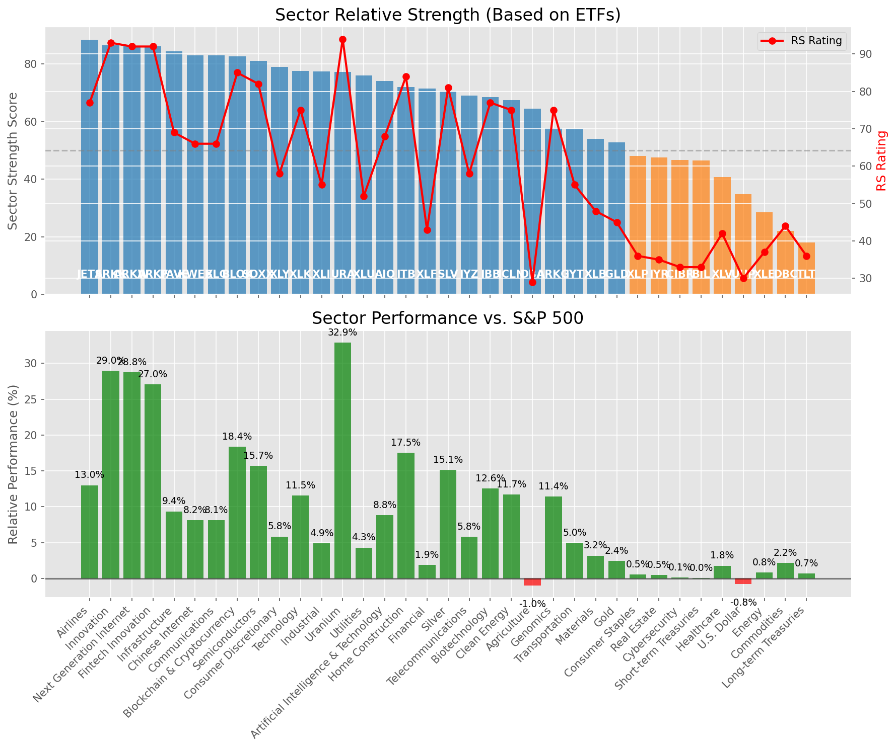

# **Daily Relative Strength Report**

**Date:** 2025-08-19

## **Market Valuation (Buffett Indicator)**

| Metric | Value |
|--------|-------|
| **Market Valuation** | **Overvalued** |
| **Current Ratio** | 10.37 |
| **Historical Mean** | 9.82 |
| **Standard Deviation** | 0.44 |
| **Z-Score (StdDev from Mean)** | 1.41 |
| **Total Market Cap** | $314.41 trillion |
| **GDP** | $30.33 trillion |

## **Market Insights**

### **Market is Overvalued**

The market appears to be trading above historical average valuations. While not at extreme levels, this suggests more modest future returns may be expected. Investors should:

- Focus on companies with reasonable valuations relative to their growth
- Be more selective with new positions
- Look for stocks showing relative strength within their sectors
- Consider trimming positions in extremely overvalued names

Historically, periods of mild overvaluation can persist for extended periods, but returns tend to be below average.

### **Buffett Indicator Overview**

The Buffett Indicator (Total Market Cap / GDP) is a measure of the stock market's valuation relative to the size of the economy. It is named after Warren Buffett, who described it as "probably the best single measure of where valuations stand at any given moment."

- **Values above +2 standard deviations:** Market significantly overvalued
- **Values above +1 standard deviation:** Market overvalued
- **Values between -1 and +1 standard deviations:** Market fairly valued
- **Values below -1 standard deviation:** Market undervalued
- **Values below -2 standard deviations:** Market significantly undervalued

---

## **Sector Relative Strength**

Based on William O'Neil's Relative Strength Methodology

| ETF | Strength | RS Rating | Performance | Above Key MAs | Trend | Sector |
|-----|----------|-----------|-------------|--------------|-------|--------|
| [JETS](https://www.tradingview.com/chart/?symbol=JETS) | 88.5 | 77.0 | 12.87% | 10d ✓, 50d ✓, 200d ✓ | ↗️ | Airlines |
| [ARKW](https://www.tradingview.com/chart/?symbol=ARKW) | 86.6 | 93.0 | 29.09% | 10d ✗, 50d ✓, 200d ✓ | ↗️ | Next Generation Internet |
| [ARKK](https://www.tradingview.com/chart/?symbol=ARKK) | 86.6 | 93.0 | 29.52% | 10d ✗, 50d ✓, 200d ✓ | ↗️ | Innovation |
| [ARKF](https://www.tradingview.com/chart/?symbol=ARKF) | 86.1 | 92.0 | 27.43% | 10d ✗, 50d ✓, 200d ✓ | ↗️ | Fintech Innovation |
| [PAVE](https://www.tradingview.com/chart/?symbol=PAVE) | 84.0 | 68.0 | 9.03% | 10d ✓, 50d ✓, 200d ✓ | ↗️ | Infrastructure |
| [KWEB](https://www.tradingview.com/chart/?symbol=KWEB) | 83.5 | 67.0 | 8.30% | 10d ✓, 50d ✓, 200d ✓ | ↗️ | Chinese Internet |
| [XLC](https://www.tradingview.com/chart/?symbol=XLC) | 83.0 | 66.0 | 7.91% | 10d ✓, 50d ✓, 200d ✓ | ↗️ | Communications |
| [BLOK](https://www.tradingview.com/chart/?symbol=BLOK) | 82.6 | 85.0 | 18.76% | 10d ✗, 50d ✓, 200d ✓ | ↗️ | Blockchain & Cryptocurrency |
| [SOXX](https://www.tradingview.com/chart/?symbol=SOXX) | 81.1 | 82.0 | 16.27% | 10d ✗, 50d ✓, 200d ✓ | ↗️ | Semiconductors |
| [XLY](https://www.tradingview.com/chart/?symbol=XLY) | 79.0 | 58.0 | 5.71% | 10d ✓, 50d ✓, 200d ✓ | ↗️ | Consumer Discretionary |
| [XLK](https://www.tradingview.com/chart/?symbol=XLK) | 78.1 | 76.0 | 11.76% | 10d ✗, 50d ✓, 200d ✓ | ↗️ | Technology |
| [URA](https://www.tradingview.com/chart/?symbol=URA) | 77.2 | 94.0 | 33.66% | 10d ✗, 50d ✗, 200d ✓ | ↗️ | Uranium |
| [AIQ](https://www.tradingview.com/chart/?symbol=AIQ) | 74.1 | 68.0 | 8.96% | 10d ✗, 50d ✓, 200d ✓ | ↗️ | Artificial Intelligence & Technology |
| [ITB](https://www.tradingview.com/chart/?symbol=ITB) | 71.5 | 83.0 | 16.90% | 10d ✓, 50d ✓, 200d ✓ | ↘️ | Home Construction |
| [XLF](https://www.tradingview.com/chart/?symbol=XLF) | 71.5 | 43.0 | 1.74% | 10d ✓, 50d ✓, 200d ✓ | ↗️ | Financial |
| [SLV](https://www.tradingview.com/chart/?symbol=SLV) | 70.7 | 81.0 | 15.18% | 10d ✗, 50d ✗, 200d ✓ | ↗️ | Silver |
| [IYZ](https://www.tradingview.com/chart/?symbol=IYZ) | 69.6 | 59.0 | 5.99% | 10d ✗, 50d ✓, 200d ✓ | ↗️ | Telecommunications |
| [IBB](https://www.tradingview.com/chart/?symbol=IBB) | 68.5 | 77.0 | 12.71% | 10d ✓, 50d ✓, 200d ✓ | ↘️ | Biotechnology |
| [ICLN](https://www.tradingview.com/chart/?symbol=ICLN) | 67.5 | 75.0 | 11.38% | 10d ✓, 50d ✓, 200d ✓ | ↘️ | Clean Energy |
| [XLI](https://www.tradingview.com/chart/?symbol=XLI) | 67.1 | 54.0 | 4.56% | 10d ✗, 50d ✓, 200d ✓ | ↗️ | Industrial |
| [XLU](https://www.tradingview.com/chart/?symbol=XLU) | 66.1 | 52.0 | 4.00% | 10d ✗, 50d ✓, 200d ✓ | ↗️ | Utilities |
| [DBA](https://www.tradingview.com/chart/?symbol=DBA) | 65.0 | 30.0 | -1.06% | 10d ✓, 50d ✓, 200d ✓ | ↗️ | Agriculture |
| [ARKG](https://www.tradingview.com/chart/?symbol=ARKG) | 58.1 | 76.0 | 11.91% | 10d ✓, 50d ✗, 200d ✓ | ↘️ | Genomics |
| [IYT](https://www.tradingview.com/chart/?symbol=IYT) | 57.0 | 54.0 | 4.57% | 10d ✓, 50d ✓, 200d ✓ | ↘️ | Transportation |
| [XLB](https://www.tradingview.com/chart/?symbol=XLB) | 54.0 | 48.0 | 2.93% | 10d ✓, 50d ✓, 200d ✓ | ↘️ | Materials |
| [GLD](https://www.tradingview.com/chart/?symbol=GLD) | 53.2 | 46.0 | 2.51% | 10d ✗, 50d ✗, 200d ✓ | ↗️ | Gold |
| [XLP](https://www.tradingview.com/chart/?symbol=XLP) | 47.0 | 34.0 | 0.11% | 10d ✓, 50d ✓, 200d ✓ | ↘️ | Consumer Staples |
| [CIBR](https://www.tradingview.com/chart/?symbol=CIBR) | 46.7 | 33.0 | -0.10% | 10d ✗, 50d ✗, 200d ✓ | ↗️ | Cybersecurity |
| [BIL](https://www.tradingview.com/chart/?symbol=BIL) | 46.5 | 33.0 | 0.04% | 10d ✓, 50d ✓, 200d ✓ | ↘️ | Short-term Treasuries |
| [IYR](https://www.tradingview.com/chart/?symbol=IYR) | 46.5 | 33.0 | -0.09% | 10d ✓, 50d ✓, 200d ✓ | ↘️ | Real Estate |
| [XLV](https://www.tradingview.com/chart/?symbol=XLV) | 40.8 | 42.0 | 1.61% | 10d ✓, 50d ✓, 200d ✗ | ↘️ | Healthcare |
| [UUP](https://www.tradingview.com/chart/?symbol=UUP) | 34.8 | 30.0 | -0.83% | 10d ✓, 50d ✓, 200d ✗ | ↘️ | U.S. Dollar |
| [TLT](https://www.tradingview.com/chart/?symbol=TLT) | 28.9 | 38.0 | 0.79% | 10d ✗, 50d ✓, 200d ✗ | ↘️ | Long-term Treasuries |
| [DBC](https://www.tradingview.com/chart/?symbol=DBC) | 22.5 | 45.0 | 2.13% | 10d ✗, 50d ✗, 200d ✗ | ↘️ | Commodities |
| [XLE](https://www.tradingview.com/chart/?symbol=XLE) | 18.0 | 36.0 | 0.43% | 10d ✗, 50d ✗, 200d ✗ | ↘️ | Energy |

### **Sector ETF Performance Interpretation**

This table shows the relative strength metrics for different market sectors based on their representative ETFs:

- **ETF**: The ETF used to measure sector performance (click for chart)
- **Strength**: Overall sector strength score (0-100) combining multiple factors
- **RS Rating**: O'Neil RS rating of the sector ETF
- **Performance**: Performance of the sector ETF relative to SPY
- **Above Key MAs**: Whether the ETF is trading above its 10, 50, and 200-day moving averages
- **Trend**: Whether the sector is in an uptrend (↗️) or downtrend (↘️)

### **Current Sector Leadership**

The current market leadership is coming from the following sectors: **Airlines, Next Generation Internet, Innovation**.

The **Airlines** sector (represented by **JETS**) is showing particularly strong relative strength with an RS rating of 77.0 and performance of 12.87% vs. the S&P 500. This sector is trading above its 10-day, 50-day, 200-day moving average(s). Investors should consider focusing on high RS stocks within these leading sectors for potential outperformance.

---

## **Buy Recommendations**

The following 34 stocks show exceptional relative strength:

| RS Rating | Buy Score | Current Price | Chart | Name | Ticker |
|-----------|-----------|---------------|-------|------|--------|
| 99 | 100 | $97.51 | [Chart](https://www.tradingview.com/chart/?symbol=RYTM) | Rhythm Pharmaceuticals, Inc. Common Stock | RYTM |
| 99 | 100 | $27.22 | [Chart](https://www.tradingview.com/chart/?symbol=LQDA) | Liquidia Corporation Common Stock | LQDA |
| 98 | 100 | $168.97 | [Chart](https://www.tradingview.com/chart/?symbol=FUTU) | Futu Holdings Limited American Depositary Shares | FUTU |
| 98 | 100 | $59.30 | [Chart](https://www.tradingview.com/chart/?symbol=GH) | Guardant Health, Inc. Common Stock | GH |
| 98 | 100 | $25.30 | [Chart](https://www.tradingview.com/chart/?symbol=TME) | Tencent Music Entertainment Group American Depositary Shares, each representing two Class A Ordinary Shares | TME |
| 97 | 100 | $105.79 | [Chart](https://www.tradingview.com/chart/?symbol=VRNA) | Verona Pharma plc | VRNA |
| 97 | 100 | $189.16 | [Chart](https://www.tradingview.com/chart/?symbol=COOP) | Mr. Cooper Group Inc. Common Stock | COOP |
| 97 | 100 | $85.97 | [Chart](https://www.tradingview.com/chart/?symbol=LIF) | Life360, Inc. Common Stock | LIF |
| 96 | 100 | $99.56 | [Chart](https://www.tradingview.com/chart/?symbol=EBAY) | eBay Inc | EBAY |
| 96 | 100 | $64.21 | [Chart](https://www.tradingview.com/chart/?symbol=MRCY) | Mercury Systems Inc. | MRCY |
| 94 | 100 | $57.45 | [Chart](https://www.tradingview.com/chart/?symbol=BTI) | British American Tobacco p.l.c. American Depositary Shares, American Depositary Shares, each representing one Ordinary Share | BTI |
| 94 | 100 | $75.17 | [Chart](https://www.tradingview.com/chart/?symbol=WNS) | WNS (Holdings) Limited | WNS |
| 94 | 100 | $98.65 | [Chart](https://www.tradingview.com/chart/?symbol=TPB) | Turning Point Brands, Inc. | TPB |
| 93 | 100 | $331.21 | [Chart](https://www.tradingview.com/chart/?symbol=RCL) | Royal Caribbean Group | RCL |
| 93 | 100 | $250.01 | [Chart](https://www.tradingview.com/chart/?symbol=BAP) | Credicorp LTD | BAP |
| 92 | 100 | $36.42 | [Chart](https://www.tradingview.com/chart/?symbol=DB) | Deutsche Bank Aktiengesellschaft | DB |
| 92 | 100 | $30.65 | [Chart](https://www.tradingview.com/chart/?symbol=SRAD) | Sportradar Group AG Class A Ordinary Shares | SRAD |
| 92 | 100 | $45.99 | [Chart](https://www.tradingview.com/chart/?symbol=LTM) | LATAM Airlines Group S.A. American Depositary Shares (each representing two thousand (2,000) shares of Common Stock) | LTM |
| 91 | 100 | $59.56 | [Chart](https://www.tradingview.com/chart/?symbol=VIK) | Viking Holdings Ltd | VIK |
| 89 | 100 | $431.78 | [Chart](https://www.tradingview.com/chart/?symbol=CYBR) | CyberArk Software Ltd. | CYBR |
| 89 | 100 | $269.87 | [Chart](https://www.tradingview.com/chart/?symbol=IDCC) | InterDigital, Inc. | IDCC |
| 89 | 99 | $93.78 | [Chart](https://www.tradingview.com/chart/?symbol=C) | Citigroup Inc. | C |
| 87 | 99 | $160.53 | [Chart](https://www.tradingview.com/chart/?symbol=VSEC) | VSE Corp | VSEC |
| 88 | 98 | $194.45 | [Chart](https://www.tradingview.com/chart/?symbol=AWI) | Armstrong World Industries, Inc. | AWI |
| 88 | 98 | $52.54 | [Chart](https://www.tradingview.com/chart/?symbol=FHI) | Federated Hermes, Inc. | FHI |
| 85 | 97 | $93.39 | [Chart](https://www.tradingview.com/chart/?symbol=LLYVK) | Liberty Media Corporation Series C Liberty Live Common Stock | LLYVK |
| 86 | 96 | $31.32 | [Chart](https://www.tradingview.com/chart/?symbol=IIIV) | i3 Verticals, Inc. Class A Common Stock | IIIV |
| 84 | 95 | $28.76 | [Chart](https://www.tradingview.com/chart/?symbol=CPS) | Cooper-Standard Automotive Inc. | CPS |
| 82 | 95 | $26.21 | [Chart](https://www.tradingview.com/chart/?symbol=LAUR) | Laureate Education, Inc. Common Stock | LAUR |
| 81 | 95 | $40.48 | [Chart](https://www.tradingview.com/chart/?symbol=AHR) | American Healthcare REIT, Inc. | AHR |
| 83 | 93 | $18.69 | [Chart](https://www.tradingview.com/chart/?symbol=DAN) | Dana Incorporated | DAN |
| 81 | 93 | $35.43 | [Chart](https://www.tradingview.com/chart/?symbol=APG) | APi Group Corporation | APG |
| 81 | 92 | $24.70 | [Chart](https://www.tradingview.com/chart/?symbol=ING) | ING Groep N.V. American Depositary Shares | ING |
| 81 | 92 | $67.00 | [Chart](https://www.tradingview.com/chart/?symbol=NXT) | Nextracker Inc. Class A Common Stock | NXT |

---

## **Sell Recommendations**

The following 157 stocks show deteriorating relative strength:

| RS Rating | Sell Score | Current Price | Chart | Name | Ticker |
|-----------|------------|---------------|-------|------|--------|
| 2 | 100 | $12.11 | [Chart](https://www.tradingview.com/chart/?symbol=NVDS) | Investment Managers Series Trust II Tradr 1.5X Short NVDA Daily ETF | NVDS |
| 2 | 100 | $24.24 | [Chart](https://www.tradingview.com/chart/?symbol=TECS) | Direxion Daily Technology Bear 3x Shares | TECS |
| 2 | 100 | $17.48 | [Chart](https://www.tradingview.com/chart/?symbol=DJT) | Trump Media & Technology Group Corp. Common Stock | DJT |
| 2 | 100 | $25.39 | [Chart](https://www.tradingview.com/chart/?symbol=CRI) | Carter's Inc. | CRI |
| 2 | 100 | $33.19 | [Chart](https://www.tradingview.com/chart/?symbol=IOT) | Samsara Inc. | IOT |
| 3 | 100 | $25.78 | [Chart](https://www.tradingview.com/chart/?symbol=BRZE) | Braze, Inc. Class A Common Stock | BRZE |
| 3 | 100 | $20.57 | [Chart](https://www.tradingview.com/chart/?symbol=GAP) | The Gap, Inc. | GAP |
| 4 | 100 | $24.08 | [Chart](https://www.tradingview.com/chart/?symbol=ZSL) | ProShares UltraShort Silver | ZSL |
| 4 | 100 | $23.53 | [Chart](https://www.tradingview.com/chart/?symbol=HELE) | Helen Of Troy Ltd | HELE |
| 6 | 100 | $23.32 | [Chart](https://www.tradingview.com/chart/?symbol=NOG) | Northern Oil and Gas, Inc. | NOG |
| 7 | 100 | $57.34 | [Chart](https://www.tradingview.com/chart/?symbol=ATKR) | Atkore Inc. | ATKR |
| 7 | 100 | $77.66 | [Chart](https://www.tradingview.com/chart/?symbol=ESTC) | Elastic N.V. | ESTC |
| 7 | 100 | $23.45 | [Chart](https://www.tradingview.com/chart/?symbol=CRTO) | Criteo S.A. | CRTO |
| 7 | 100 | $25.70 | [Chart](https://www.tradingview.com/chart/?symbol=TBBB) | BBB Foods Inc. | TBBB |
| 8 | 100 | $17.04 | [Chart](https://www.tradingview.com/chart/?symbol=S) | SentinelOne, Inc. | S |
| 9 | 100 | $25.39 | [Chart](https://www.tradingview.com/chart/?symbol=CZR) | Caesars Entertainment, Inc. Common Stock | CZR |
| 9 | 100 | $17.22 | [Chart](https://www.tradingview.com/chart/?symbol=SVOL) | Simplify Volatility Premium ETF | SVOL |
| 10 | 100 | $39.78 | [Chart](https://www.tradingview.com/chart/?symbol=SDOW) | ProShares UltraPro Short Dow 30 | SDOW |
| 10 | 100 | $31.43 | [Chart](https://www.tradingview.com/chart/?symbol=TECK) | Teck Resources Limited | TECK |
| 10 | 100 | $10.98 | [Chart](https://www.tradingview.com/chart/?symbol=PATH) | UiPath, Inc. | PATH |
| 11 | 100 | $16.81 | [Chart](https://www.tradingview.com/chart/?symbol=BTAL) | AGF U.S. Market Neutral Anti-Beta Fund | BTAL |
| 11 | 100 | $14.46 | [Chart](https://www.tradingview.com/chart/?symbol=CHCT) | Community Healthcare Trust Incorporated Common Stock, $0.01 par value per share | CHCT |
| 12 | 100 | $16.42 | [Chart](https://www.tradingview.com/chart/?symbol=CTO) | CTO Realty Growth, Inc. | CTO |
| 15 | 100 | $38.55 | [Chart](https://www.tradingview.com/chart/?symbol=UDR) | UDR, Inc. | UDR |
| 2 | 99 | $12.02 | [Chart](https://www.tradingview.com/chart/?symbol=NVCR) | NovoCure Limited Ordinary Shares | NVCR |
| 4 | 99 | $21.97 | [Chart](https://www.tradingview.com/chart/?symbol=CLW) | Clearwater Paper Corporation | CLW |
| 5 | 99 | $40.46 | [Chart](https://www.tradingview.com/chart/?symbol=VIST) | Vista Energy S.A.B. de C.V. | VIST |
| 9 | 99 | $73.01 | [Chart](https://www.tradingview.com/chart/?symbol=OKE) | Oneok, Inc. | OKE |
| 15 | 99 | $190.53 | [Chart](https://www.tradingview.com/chart/?symbol=AVB) | AvalonBay Communities, Inc. | AVB |
| 9 | 98 | $27.97 | [Chart](https://www.tradingview.com/chart/?symbol=CNX) | CNX Resources Corporation | CNX |
| 11 | 98 | $46.45 | [Chart](https://www.tradingview.com/chart/?symbol=POWI) | Power Integrations Inc | POWI |
| 12 | 98 | $17.30 | [Chart](https://www.tradingview.com/chart/?symbol=IRT) | Independence Realty Trust Inc. | IRT |
| 14 | 98 | $107.47 | [Chart](https://www.tradingview.com/chart/?symbol=CPT) | Camden Property Trust | CPT |
| 14 | 98 | $39.65 | [Chart](https://www.tradingview.com/chart/?symbol=WLY) | John Wiley & Sons, Inc. Class A | WLY |
| 16 | 98 | $14.28 | [Chart](https://www.tradingview.com/chart/?symbol=VRE) | Veris Residential, Inc. | VRE |
| 16 | 97 | $284.70 | [Chart](https://www.tradingview.com/chart/?symbol=PSA) | Public Storage | PSA |
| 18 | 97 | $38.73 | [Chart](https://www.tradingview.com/chart/?symbol=SH) | ProShares Short S&P500 | SH |
| 8 | 96 | $11.02 | [Chart](https://www.tradingview.com/chart/?symbol=CEPU) | Central Puerto S.A. American Depositary Shares (each represents ten Common Shares) | CEPU |
| 11 | 96 | $86.41 | [Chart](https://www.tradingview.com/chart/?symbol=MMSI) | Merit Medical Systems Inc | MMSI |
| 12 | 96 | $105.17 | [Chart](https://www.tradingview.com/chart/?symbol=MATX) | Matsons, Inc. | MATX |
| 12 | 96 | $29.80 | [Chart](https://www.tradingview.com/chart/?symbol=BBWI) | Bath & Body Works, Inc. | BBWI |
| 13 | 96 | $35.87 | [Chart](https://www.tradingview.com/chart/?symbol=APGE) | Apogee Therapeutics, Inc. Common Stock | APGE |
| 13 | 96 | $90.98 | [Chart](https://www.tradingview.com/chart/?symbol=IRM) | Iron Mountain Inc. | IRM |
| 18 | 96 | $22.14 | [Chart](https://www.tradingview.com/chart/?symbol=CURB) | Curbline Properties Corp. | CURB |
| 5 | 95 | $30.95 | [Chart](https://www.tradingview.com/chart/?symbol=YELP) | YELP INC. | YELP |
| 10 | 95 | $15.11 | [Chart](https://www.tradingview.com/chart/?symbol=MCS) | The Marcus Corporation | MCS |
| 10 | 95 | $106.21 | [Chart](https://www.tradingview.com/chart/?symbol=ITGR) | Integer Holdings Corporation | ITGR |
| 11 | 95 | $29.04 | [Chart](https://www.tradingview.com/chart/?symbol=MGPI) | MGP Ingredients Inc | MGPI |
| 12 | 95 | $21.66 | [Chart](https://www.tradingview.com/chart/?symbol=DIN) | Dine Brands Global, Inc. | DIN |
| 16 | 95 | $25.42 | [Chart](https://www.tradingview.com/chart/?symbol=FCPT) | Four Corners Property Trust, Inc. | FCPT |
| 10 | 94 | $769.14 | [Chart](https://www.tradingview.com/chart/?symbol=EQIX) | Equinix, Inc. Common Stock REIT | EQIX |
| 11 | 94 | $21.27 | [Chart](https://www.tradingview.com/chart/?symbol=KVUE) | Kenvue Inc. | KVUE |
| 18 | 94 | $13.79 | [Chart](https://www.tradingview.com/chart/?symbol=EWTX) | Edgewise Therapeutics, Inc. Common Stock | EWTX |
| 20 | 94 | $37.79 | [Chart](https://www.tradingview.com/chart/?symbol=KSA) | iShares MSCI Saudi Arabia ETF | KSA |
| 8 | 93 | $62.83 | [Chart](https://www.tradingview.com/chart/?symbol=CBZ) | CBIZ, Inc. | CBZ |
| 14 | 93 | $39.07 | [Chart](https://www.tradingview.com/chart/?symbol=WHD) | Cactus, Inc. | WHD |
| 15 | 93 | $31.12 | [Chart](https://www.tradingview.com/chart/?symbol=DAR) | DARLING INGREDIENTS INC. | DAR |
| 16 | 93 | $32.90 | [Chart](https://www.tradingview.com/chart/?symbol=PSQ) | ProShares Short QQQ | PSQ |
| 13 | 92 | $34.80 | [Chart](https://www.tradingview.com/chart/?symbol=AMH) | AMERICAN HOMES 4 RENT | AMH |
| 17 | 92 | $85.34 | [Chart](https://www.tradingview.com/chart/?symbol=CL) | Colgate-Palmolive Company | CL |
| 20 | 92 | $10.05 | [Chart](https://www.tradingview.com/chart/?symbol=NMZ) | Nuveen Municipal High Income Opportunity Fund | NMZ |
| 20 | 92 | $18.03 | [Chart](https://www.tradingview.com/chart/?symbol=EBF) | Ennis, Inc. | EBF |
| 18 | 91 | $135.42 | [Chart](https://www.tradingview.com/chart/?symbol=DVA) | DaVita Inc. | DVA |
| 25 | 91 | $46.82 | [Chart](https://www.tradingview.com/chart/?symbol=EDU) | New Oriental Education and Technology Group, Inc. American Depositary Shares (each representing ten (10) Common Shares) | EDU |
| 14 | 90 | $259.62 | [Chart](https://www.tradingview.com/chart/?symbol=ESS) | Essex Property Trust, Inc | ESS |
| 14 | 90 | $167.02 | [Chart](https://www.tradingview.com/chart/?symbol=EPAM) | EPAM SYSTEMS, INC. | EPAM |
| 15 | 90 | $141.88 | [Chart](https://www.tradingview.com/chart/?symbol=OLED) | Universal Display Corp | OLED |
| 16 | 90 | $68.67 | [Chart](https://www.tradingview.com/chart/?symbol=MKC) | McCormick & Company, Incorporated Non-VTG CS | MKC |
| 17 | 90 | $274.00 | [Chart](https://www.tradingview.com/chart/?symbol=CB) | Chubb Limited | CB |
| 17 | 90 | $43.05 | [Chart](https://www.tradingview.com/chart/?symbol=SW) | Smurfit Westrock plc | SW |
| 21 | 90 | $14.77 | [Chart](https://www.tradingview.com/chart/?symbol=VTLE) | Vital Energy, Inc. | VTLE |
| 13 | 89 | $43.80 | [Chart](https://www.tradingview.com/chart/?symbol=GTLB) | GitLab Inc. Class A Common Stock | GTLB |
| 14 | 89 | $210.08 | [Chart](https://www.tradingview.com/chart/?symbol=MMC) | Marsh & McLennan Companies, Inc. | MMC |
| 16 | 89 | $25.64 | [Chart](https://www.tradingview.com/chart/?symbol=WKC) | World Kinect Corporation | WKC |
| 18 | 89 | $21.22 | [Chart](https://www.tradingview.com/chart/?symbol=TDC) | TERADATA CORPORATION | TDC |
| 19 | 89 | $36.98 | [Chart](https://www.tradingview.com/chart/?symbol=VNO) | Vornado Realty Trust | VNO |
| 21 | 89 | $331.97 | [Chart](https://www.tradingview.com/chart/?symbol=EG) | Everest Group, Ltd. | EG |
| 27 | 89 | $36.94 | [Chart](https://www.tradingview.com/chart/?symbol=PBA) | PEMBINA PIPELINE CORPORATION | PBA |
| 30 | 89 | $31.77 | [Chart](https://www.tradingview.com/chart/?symbol=PCVX) | Vaxcyte, Inc. Common Stock | PCVX |
| 13 | 88 | $125.92 | [Chart](https://www.tradingview.com/chart/?symbol=INGR) | Ingredion Incorporated | INGR |
| 18 | 88 | $12.07 | [Chart](https://www.tradingview.com/chart/?symbol=PMT) | PennyMac Mortgage Investment Trust | PMT |
| 22 | 88 | $25.24 | [Chart](https://www.tradingview.com/chart/?symbol=DOG) | ProShares Short Dow30 | DOG |
| 23 | 88 | $12.27 | [Chart](https://www.tradingview.com/chart/?symbol=WSR) | Whitestone REIT | WSR |
| 23 | 88 | $17.11 | [Chart](https://www.tradingview.com/chart/?symbol=DOC) | Healthpeak Properties, Inc. | DOC |
| 24 | 88 | $10.18 | [Chart](https://www.tradingview.com/chart/?symbol=MUC) | BLACKROCK MUNIHOLDINGS CALIFORNIA QUALITY FUND, INC | MUC |
| 15 | 87 | $319.38 | [Chart](https://www.tradingview.com/chart/?symbol=CPAY) | Corpay, Inc. | CPAY |
| 17 | 87 | $218.61 | [Chart](https://www.tradingview.com/chart/?symbol=SBAC) | SBA Communications Corp | SBAC |
| 19 | 87 | $13.03 | [Chart](https://www.tradingview.com/chart/?symbol=CLMT) | Calumet, Inc. Common Stock | CLMT |
| 19 | 87 | $34.16 | [Chart](https://www.tradingview.com/chart/?symbol=PECO) | Phillips Edison & Company, Inc. Common Stock | PECO |
| 20 | 87 | $33.20 | [Chart](https://www.tradingview.com/chart/?symbol=SLB) | Schlumberger Limited | SLB |
| 21 | 87 | $178.48 | [Chart](https://www.tradingview.com/chart/?symbol=DOV) | Dover Corporation | DOV |
| 21 | 87 | $165.24 | [Chart](https://www.tradingview.com/chart/?symbol=EGP) | EastGroup Properties Inc. | EGP |
| 26 | 87 | $12.23 | [Chart](https://www.tradingview.com/chart/?symbol=RQI) | COHEN & STEERS QUALITY INCOME REALTY FUND, INC. COMMON SHARES | RQI |
| 28 | 87 | $13.95 | [Chart](https://www.tradingview.com/chart/?symbol=MNR) | Mach Natural Resources LP Common Units representing Limited Partner Interests | MNR |
| 16 | 86 | $10.06 | [Chart](https://www.tradingview.com/chart/?symbol=SPDN) | Direxion Daily S&P 500 Bear 1X Shares | SPDN |
| 18 | 86 | $12.83 | [Chart](https://www.tradingview.com/chart/?symbol=NAVI) | Navient Corporation | NAVI |
| 19 | 86 | $55.26 | [Chart](https://www.tradingview.com/chart/?symbol=TRNO) | Terreno Realty Corporation | TRNO |
| 19 | 86 | $10.67 | [Chart](https://www.tradingview.com/chart/?symbol=SD) | SandRidge Energy, Inc. | SD |
| 20 | 86 | $62.18 | [Chart](https://www.tradingview.com/chart/?symbol=MDLZ) | Mondelez International, Inc. Class A | MDLZ |
| 20 | 86 | $33.60 | [Chart](https://www.tradingview.com/chart/?symbol=CMCSA) | Comcast Corp | CMCSA |
| 23 | 86 | $10.58 | [Chart](https://www.tradingview.com/chart/?symbol=DVAX) | Dynavax Technologies Corporation | DVAX |
| 30 | 86 | $11.80 | [Chart](https://www.tradingview.com/chart/?symbol=NZF) | Nuveen Municipal Credit Income Fund | NZF |
| 16 | 85 | $48.91 | [Chart](https://www.tradingview.com/chart/?symbol=DT) | Dynatrace, Inc. | DT |
| 18 | 84 | $28.88 | [Chart](https://www.tradingview.com/chart/?symbol=AMAL) | Amalgamated Financial Corp. Common Stock (DE) | AMAL |
| 25 | 84 | $11.61 | [Chart](https://www.tradingview.com/chart/?symbol=NVG) | Nuveen AMT-Free Municipal Credit Income Fund | NVG |
| 28 | 84 | $19.36 | [Chart](https://www.tradingview.com/chart/?symbol=CVBF) | CVB Financial Corp | CVBF |
| 17 | 83 | $46.96 | [Chart](https://www.tradingview.com/chart/?symbol=IP) | International Paper Co. | IP |
| 21 | 83 | $69.05 | [Chart](https://www.tradingview.com/chart/?symbol=PYPL) | PayPal Holdings, Inc. Common Stock | PYPL |
| 24 | 83 | $57.45 | [Chart](https://www.tradingview.com/chart/?symbol=BMRN) | BioMarin Pharmaceuticals Inc | BMRN |
| 28 | 83 | $56.71 | [Chart](https://www.tradingview.com/chart/?symbol=USRT) | iShares Core U.S. REIT ETF | USRT |
| 28 | 83 | $12.37 | [Chart](https://www.tradingview.com/chart/?symbol=NOV) | NOV Inc. | NOV |
| 18 | 82 | $66.63 | [Chart](https://www.tradingview.com/chart/?symbol=QSR) | Restaurant Brands International Inc. | QSR |
| 19 | 82 | $67.87 | [Chart](https://www.tradingview.com/chart/?symbol=HSIC) | Henry Schein Inc | HSIC |
| 24 | 82 | $45.33 | [Chart](https://www.tradingview.com/chart/?symbol=EPI) | WisdomTree India Earnings Fund ETF | EPI |
| 26 | 82 | $24.15 | [Chart](https://www.tradingview.com/chart/?symbol=HYMB) | SPDR Nuveen ICE High Yield Municipal Bond ETF | HYMB |
| 28 | 82 | $16.75 | [Chart](https://www.tradingview.com/chart/?symbol=MLN) | VanEck Long Muni ETF | MLN |
| 23 | 81 | $29.45 | [Chart](https://www.tradingview.com/chart/?symbol=CNQ) | Canadian Natural Resources Limited | CNQ |
| 29 | 81 | $14.80 | [Chart](https://www.tradingview.com/chart/?symbol=VSH) | Vishay Intertechnology, Inc. | VSH |
| 29 | 81 | $19.95 | [Chart](https://www.tradingview.com/chart/?symbol=STWD) | STARWOOD PROPERTY TRUST, INC. | STWD |
| 30 | 81 | $11.15 | [Chart](https://www.tradingview.com/chart/?symbol=NAD) | Nuveen Quality Municipal Income Fund | NAD |
| 23 | 80 | $137.61 | [Chart](https://www.tradingview.com/chart/?symbol=APO) | Apollo Global Management, Inc. | APO |
| 26 | 80 | $41.31 | [Chart](https://www.tradingview.com/chart/?symbol=CTS) | CTS Corporation | CTS |
| 27 | 80 | $66.44 | [Chart](https://www.tradingview.com/chart/?symbol=BXP) | BXP, Inc. | BXP |
| 27 | 80 | $14.05 | [Chart](https://www.tradingview.com/chart/?symbol=BMEZ) | BlackRock Health Sciences Term Trust | BMEZ |
| 28 | 80 | $14.79 | [Chart](https://www.tradingview.com/chart/?symbol=GBDC) | Golub Capital BDC, Inc. | GBDC |
| 22 | 79 | $26.14 | [Chart](https://www.tradingview.com/chart/?symbol=FIVN) | FIVE9, INC. | FIVN |
| 28 | 79 | $11.81 | [Chart](https://www.tradingview.com/chart/?symbol=PBR) | PETROLEO BRASILEIRO S.A.-PETROBRAS ADS (REP 1 COMMON SHARE) | PBR |
| 31 | 79 | $121.67 | [Chart](https://www.tradingview.com/chart/?symbol=PSX) | PHILLIPS 66 | PSX |
| 31 | 79 | $10.81 | [Chart](https://www.tradingview.com/chart/?symbol=NEA) | Nuveen AMT-Free Quality Municipal Income Fund | NEA |
| 26 | 78 | $14.20 | [Chart](https://www.tradingview.com/chart/?symbol=INMD) | InMode Ltd. Ordinary Shares | INMD |
| 26 | 78 | $14.09 | [Chart](https://www.tradingview.com/chart/?symbol=RDY) | Dr. Reddy's Laboratories Limited American Depositary Shares | RDY |
| 29 | 78 | $122.44 | [Chart](https://www.tradingview.com/chart/?symbol=XOP) | SPDR S&P Oil & Gas Exploration & Production ETF | XOP |
| 29 | 77 | $46.81 | [Chart](https://www.tradingview.com/chart/?symbol=GLPI) | Gaming and Leisure Properties, Inc. | GLPI |
| 32 | 77 | $26.98 | [Chart](https://www.tradingview.com/chart/?symbol=FREL) | Fidelity MSCI Real Estate Index ETF | FREL |
| 34 | 77 | $20.85 | [Chart](https://www.tradingview.com/chart/?symbol=BKLN) | Invesco Senior Loan ETF | BKLN |
| 38 | 77 | $37.32 | [Chart](https://www.tradingview.com/chart/?symbol=TMF) | Direxion Daily 20+ Year Treasury Bull 3X Shares (based on the NYSE 20 Year Plus Treasury Bond Index; symbol AXTWEN) | TMF |
| 28 | 76 | $41.44 | [Chart](https://www.tradingview.com/chart/?symbol=XLRE) | Real Estate Select Sector SPDR Fund | XLRE |
| 31 | 76 | $744.92 | [Chart](https://www.tradingview.com/chart/?symbol=ASML) | ASML Holding NV | ASML |
| 31 | 76 | $19.20 | [Chart](https://www.tradingview.com/chart/?symbol=AVBP) | ArriVent BioPharma, Inc. Common Stock | AVBP |
| 29 | 75 | $13.73 | [Chart](https://www.tradingview.com/chart/?symbol=CIM) | Chimera Investment Corp. | CIM |
| 36 | 75 | $11.50 | [Chart](https://www.tradingview.com/chart/?symbol=BCAX) | Bicara Therapeutics Inc. Common Stock | BCAX |
| 29 | 74 | $101.69 | [Chart](https://www.tradingview.com/chart/?symbol=CCI) | Crown Castle Inc. | CCI |
| 31 | 74 | $14.37 | [Chart](https://www.tradingview.com/chart/?symbol=BAND) | Bandwidth Inc. Class A Common Stock | BAND |
| 35 | 74 | $65.11 | [Chart](https://www.tradingview.com/chart/?symbol=EDV) | Vanguard World Funds Extended Duration ETF | EDV |
| 35 | 74 | $10.47 | [Chart](https://www.tradingview.com/chart/?symbol=DSU) | Blackrock Debt Strategies Fund, Inc. | DSU |
| 37 | 74 | $21.00 | [Chart](https://www.tradingview.com/chart/?symbol=HAL) | Halliburton Company | HAL |
| 28 | 73 | $38.52 | [Chart](https://www.tradingview.com/chart/?symbol=FLIN) | Franklin FTSE India ETF | FLIN |
| 36 | 73 | $43.92 | [Chart](https://www.tradingview.com/chart/?symbol=XDTE) | Roundhill S&P 500 0DTE Covered Call Strategy ETF | XDTE |
| 33 | 72 | $44.41 | [Chart](https://www.tradingview.com/chart/?symbol=FIZZ) | National Beverage Corp. | FIZZ |
| 36 | 72 | $33.79 | [Chart](https://www.tradingview.com/chart/?symbol=MEOH) | Methanex Corp | MEOH |
| 36 | 71 | $84.73 | [Chart](https://www.tradingview.com/chart/?symbol=XLE) | Energy Select Sector SPDR Fund | XLE |
| 34 | 70 | $37.45 | [Chart](https://www.tradingview.com/chart/?symbol=STBA) | S&T Bancorp Inc | STBA |
| 35 | 69 | $49.24 | [Chart](https://www.tradingview.com/chart/?symbol=BNDX) | Vanguard Total International Bond ETF | BNDX |
| 37 | 69 | $14.99 | [Chart](https://www.tradingview.com/chart/?symbol=DEI) | Douglas Emmett, Inc. | DEI |
| 36 | 68 | $106.97 | [Chart](https://www.tradingview.com/chart/?symbol=XOM) | Exxon Mobil Corporation | XOM |
| 38 | 67 | $123.00 | [Chart](https://www.tradingview.com/chart/?symbol=TMDX) | TransMedics Group, Inc. Common Stock | TMDX |
| 38 | 66 | $118.83 | [Chart](https://www.tradingview.com/chart/?symbol=VDE) | Vanguard Energy ETF | VDE |

## **Methodology**

This report uses William O'Neil's relative strength methodology from Investors Business Daily:

* **RS Rating**: Percentile rank of stock's performance vs. S&P 500 over the past 63 trading days (1-99 scale)
* **Buy Criteria**: RS Rating >= 80, price above 50-day MA, strong uptrend, increasing volume
* **Sell Criteria**: RS Rating < 40, price below 50-day MA, downtrend, decreasing volume

### **O'Neil's Key Principles**

1. **Focus on relative performance** - stocks outperforming the market
2. **Price trend confirmation** - stock must be in an uptrend
3. **Volume confirmation** - strong volume supports price moves
4. **Moving average validation** - price above key moving averages
5. **Market leaders only** - concentrate on top-performing stocks

*Report generated automatically after market close*