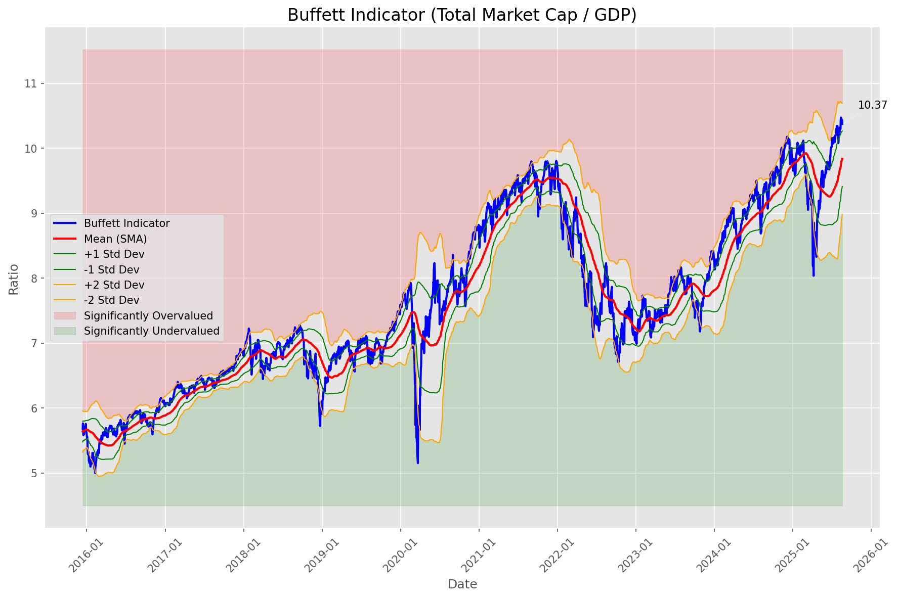

# **Daily Relative Strength Report**

**Date:** 2025-08-20

## **Market Valuation (Buffett Indicator)**

| Metric | Value |
|--------|-------|
| **Market Valuation** | **Overvalued** |
| **Current Ratio** | 10.30 |
| **Historical Mean** | 9.84 |
| **Standard Deviation** | 0.43 |
| **Z-Score (StdDev from Mean)** | 1.25 |
| **Total Market Cap** | $312.56 trillion |
| **GDP** | $30.33 trillion |

## **Market Insights**

### **Market is Overvalued**

The market appears to be trading above historical average valuations. While not at extreme levels, this suggests more modest future returns may be expected. Investors should:

- Focus on companies with reasonable valuations relative to their growth
- Be more selective with new positions
- Look for stocks showing relative strength within their sectors
- Consider trimming positions in extremely overvalued names

Historically, periods of mild overvaluation can persist for extended periods, but returns tend to be below average.

### **Buffett Indicator Overview**

The Buffett Indicator (Total Market Cap / GDP) is a measure of the stock market's valuation relative to the size of the economy. It is named after Warren Buffett, who described it as "probably the best single measure of where valuations stand at any given moment."

- **Values above +2 standard deviations:** Market significantly overvalued
- **Values above +1 standard deviation:** Market overvalued
- **Values between -1 and +1 standard deviations:** Market fairly valued
- **Values below -1 standard deviation:** Market undervalued
- **Values below -2 standard deviations:** Market significantly undervalued

---

## **Sector Relative Strength**

Based on William O'Neil's Relative Strength Methodology

| ETF | Strength | RS Rating | Performance | Above Key MAs | Trend | Sector |
|-----|----------|-----------|-------------|--------------|-------|--------|
| [JETS](https://www.tradingview.com/chart/?symbol=JETS) | 88.0 | 76.0 | 11.53% | 10d ✓, 50d ✓, 200d ✓ | ↗️ | Airlines |
| [ARKK](https://www.tradingview.com/chart/?symbol=ARKK) | 86.1 | 92.0 | 26.94% | 10d ✗, 50d ✓, 200d ✓ | ↗️ | Innovation |
| [ARKF](https://www.tradingview.com/chart/?symbol=ARKF) | 86.1 | 92.0 | 27.04% | 10d ✗, 50d ✓, 200d ✓ | ↗️ | Fintech Innovation |
| [ARKW](https://www.tradingview.com/chart/?symbol=ARKW) | 86.1 | 92.0 | 27.17% | 10d ✗, 50d ✓, 200d ✓ | ↗️ | Next Generation Internet |
| [KWEB](https://www.tradingview.com/chart/?symbol=KWEB) | 83.5 | 67.0 | 8.04% | 10d ✓, 50d ✓, 200d ✓ | ↗️ | Chinese Internet |
| [BLOK](https://www.tradingview.com/chart/?symbol=BLOK) | 81.1 | 82.0 | 15.58% | 10d ✗, 50d ✓, 200d ✓ | ↗️ | Blockchain & Cryptocurrency |
| [SLV](https://www.tradingview.com/chart/?symbol=SLV) | 80.1 | 80.0 | 13.96% | 10d ✗, 50d ✓, 200d ✓ | ↗️ | Silver |
| [SOXX](https://www.tradingview.com/chart/?symbol=SOXX) | 80.1 | 80.0 | 13.91% | 10d ✗, 50d ✓, 200d ✓ | ↗️ | Semiconductors |
| [XLK](https://www.tradingview.com/chart/?symbol=XLK) | 77.1 | 74.0 | 10.54% | 10d ✗, 50d ✓, 200d ✓ | ↗️ | Technology |
| [URA](https://www.tradingview.com/chart/?symbol=URA) | 76.7 | 93.0 | 28.92% | 10d ✗, 50d ✗, 200d ✓ | ↗️ | Uranium |
| [PAVE](https://www.tradingview.com/chart/?symbol=PAVE) | 74.1 | 68.0 | 8.55% | 10d ✗, 50d ✓, 200d ✓ | ↗️ | Infrastructure |
| [XLC](https://www.tradingview.com/chart/?symbol=XLC) | 73.1 | 66.0 | 7.88% | 10d ✗, 50d ✓, 200d ✓ | ↗️ | Communications |
| [AIQ](https://www.tradingview.com/chart/?symbol=AIQ) | 73.1 | 66.0 | 7.83% | 10d ✗, 50d ✓, 200d ✓ | ↗️ | Artificial Intelligence & Technology |
| [XLF](https://www.tradingview.com/chart/?symbol=XLF) | 73.0 | 46.0 | 2.64% | 10d ✓, 50d ✓, 200d ✓ | ↗️ | Financial |
| [ITB](https://www.tradingview.com/chart/?symbol=ITB) | 71.5 | 83.0 | 16.53% | 10d ✓, 50d ✓, 200d ✓ | ↘️ | Home Construction |
| [IYZ](https://www.tradingview.com/chart/?symbol=IYZ) | 69.6 | 59.0 | 6.00% | 10d ✗, 50d ✓, 200d ✓ | ↗️ | Telecommunications |
| [XLY](https://www.tradingview.com/chart/?symbol=XLY) | 68.1 | 56.0 | 5.18% | 10d ✗, 50d ✓, 200d ✓ | ↗️ | Consumer Discretionary |
| [XLI](https://www.tradingview.com/chart/?symbol=XLI) | 67.6 | 55.0 | 4.95% | 10d ✗, 50d ✓, 200d ✓ | ↗️ | Industrial |
| [IBB](https://www.tradingview.com/chart/?symbol=IBB) | 67.0 | 74.0 | 10.69% | 10d ✓, 50d ✓, 200d ✓ | ↘️ | Biotechnology |
| [ICLN](https://www.tradingview.com/chart/?symbol=ICLN) | 67.0 | 74.0 | 10.59% | 10d ✓, 50d ✓, 200d ✓ | ↘️ | Clean Energy |
| [XLU](https://www.tradingview.com/chart/?symbol=XLU) | 66.1 | 52.0 | 3.93% | 10d ✗, 50d ✓, 200d ✓ | ↗️ | Utilities |
| [DBA](https://www.tradingview.com/chart/?symbol=DBA) | 65.0 | 30.0 | -0.66% | 10d ✓, 50d ✓, 200d ✓ | ↗️ | Agriculture |
| [IYT](https://www.tradingview.com/chart/?symbol=IYT) | 56.5 | 53.0 | 4.18% | 10d ✓, 50d ✓, 200d ✓ | ↘️ | Transportation |
| [XLB](https://www.tradingview.com/chart/?symbol=XLB) | 54.5 | 49.0 | 3.11% | 10d ✓, 50d ✓, 200d ✓ | ↘️ | Materials |
| [GLD](https://www.tradingview.com/chart/?symbol=GLD) | 50.7 | 41.0 | 1.45% | 10d ✗, 50d ✗, 200d ✓ | ↗️ | Gold |
| [IYR](https://www.tradingview.com/chart/?symbol=IYR) | 49.0 | 38.0 | 1.09% | 10d ✓, 50d ✓, 200d ✓ | ↘️ | Real Estate |
| [XLP](https://www.tradingview.com/chart/?symbol=XLP) | 48.0 | 36.0 | 0.56% | 10d ✓, 50d ✓, 200d ✓ | ↘️ | Consumer Staples |
| [BIL](https://www.tradingview.com/chart/?symbol=BIL) | 46.0 | 32.0 | 0.03% | 10d ✓, 50d ✓, 200d ✓ | ↘️ | Short-term Treasuries |
| [CIBR](https://www.tradingview.com/chart/?symbol=CIBR) | 45.7 | 31.0 | -0.29% | 10d ✗, 50d ✗, 200d ✓ | ↗️ | Cybersecurity |
| [XLV](https://www.tradingview.com/chart/?symbol=XLV) | 41.3 | 43.0 | 1.89% | 10d ✓, 50d ✓, 200d ✗ | ↘️ | Healthcare |
| [UUP](https://www.tradingview.com/chart/?symbol=UUP) | 34.8 | 30.0 | -0.62% | 10d ✓, 50d ✓, 200d ✗ | ↘️ | U.S. Dollar |
| [ARKG](https://www.tradingview.com/chart/?symbol=ARKG) | 34.5 | 69.0 | 8.71% | 10d ✗, 50d ✗, 200d ✗ | ↘️ | Genomics |
| [XLE](https://www.tradingview.com/chart/?symbol=XLE) | 32.9 | 46.0 | 2.61% | 10d ✓, 50d ✗, 200d ✗ | ↘️ | Energy |
| [DBC](https://www.tradingview.com/chart/?symbol=DBC) | 31.4 | 43.0 | 1.82% | 10d ✓, 50d ✗, 200d ✗ | ↘️ | Commodities |
| [TLT](https://www.tradingview.com/chart/?symbol=TLT) | 30.4 | 41.0 | 1.53% | 10d ✗, 50d ✓, 200d ✗ | ↘️ | Long-term Treasuries |

### **Sector ETF Performance Interpretation**

This table shows the relative strength metrics for different market sectors based on their representative ETFs:

- **ETF**: The ETF used to measure sector performance (click for chart)
- **Strength**: Overall sector strength score (0-100) combining multiple factors
- **RS Rating**: O'Neil RS rating of the sector ETF
- **Performance**: Performance of the sector ETF relative to SPY
- **Above Key MAs**: Whether the ETF is trading above its 10, 50, and 200-day moving averages
- **Trend**: Whether the sector is in an uptrend (↗️) or downtrend (↘️)

### **Current Sector Leadership**

The current market leadership is coming from the following sectors: **Airlines, Innovation, Fintech Innovation**.

The **Airlines** sector (represented by **JETS**) is showing particularly strong relative strength with an RS rating of 76.0 and performance of 11.53% vs. the S&P 500. This sector is trading above its 10-day, 50-day, 200-day moving average(s). Investors should consider focusing on high RS stocks within these leading sectors for potential outperformance.

---

## **Buy Recommendations**

The following 27 stocks show exceptional relative strength:

| RS Rating | Buy Score | Current Price | Chart | Name | Ticker |
|-----------|-----------|---------------|-------|------|--------|
| 99 | 100 | $173.76 | [Chart](https://www.tradingview.com/chart/?symbol=FUTU) | Futu Holdings Limited American Depositary Shares | FUTU |
| 99 | 100 | $26.94 | [Chart](https://www.tradingview.com/chart/?symbol=LQDA) | Liquidia Corporation Common Stock | LQDA |
| 98 | 100 | $58.21 | [Chart](https://www.tradingview.com/chart/?symbol=GH) | Guardant Health, Inc. Common Stock | GH |
| 97 | 100 | $105.68 | [Chart](https://www.tradingview.com/chart/?symbol=VRNA) | Verona Pharma plc | VRNA |
| 97 | 100 | $84.01 | [Chart](https://www.tradingview.com/chart/?symbol=LIF) | Life360, Inc. Common Stock | LIF |
| 96 | 100 | $99.18 | [Chart](https://www.tradingview.com/chart/?symbol=EBAY) | eBay Inc | EBAY |
| 95 | 100 | $64.19 | [Chart](https://www.tradingview.com/chart/?symbol=MRCY) | Mercury Systems Inc. | MRCY |
| 95 | 100 | $58.94 | [Chart](https://www.tradingview.com/chart/?symbol=BTI) | British American Tobacco p.l.c. American Depositary Shares, American Depositary Shares, each representing one Ordinary Share | BTI |
| 94 | 100 | $75.35 | [Chart](https://www.tradingview.com/chart/?symbol=WNS) | WNS (Holdings) Limited | WNS |
| 94 | 100 | $325.50 | [Chart](https://www.tradingview.com/chart/?symbol=RCL) | Royal Caribbean Group | RCL |
| 93 | 100 | $36.45 | [Chart](https://www.tradingview.com/chart/?symbol=DB) | Deutsche Bank Aktiengesellschaft | DB |
| 92 | 100 | $250.21 | [Chart](https://www.tradingview.com/chart/?symbol=BAP) | Credicorp LTD | BAP |
| 92 | 100 | $29.98 | [Chart](https://www.tradingview.com/chart/?symbol=SRAD) | Sportradar Group AG Class A Ordinary Shares | SRAD |
| 92 | 100 | $49.32 | [Chart](https://www.tradingview.com/chart/?symbol=RING) | iShares MSCI Global Gold Miners ETF | RING |
| 91 | 100 | $113.23 | [Chart](https://www.tradingview.com/chart/?symbol=AZZ) | AZZ Inc. | AZZ |
| 90 | 100 | $438.47 | [Chart](https://www.tradingview.com/chart/?symbol=CYBR) | CyberArk Software Ltd. | CYBR |
| 90 | 100 | $45.52 | [Chart](https://www.tradingview.com/chart/?symbol=LTM) | LATAM Airlines Group S.A. American Depositary Shares (each representing two thousand (2,000) shares of Common Stock) | LTM |
| 86 | 100 | $41.83 | [Chart](https://www.tradingview.com/chart/?symbol=AHR) | American Healthcare REIT, Inc. | AHR |
| 89 | 99 | $195.27 | [Chart](https://www.tradingview.com/chart/?symbol=AWI) | Armstrong World Industries, Inc. | AWI |
| 89 | 99 | $52.56 | [Chart](https://www.tradingview.com/chart/?symbol=FHI) | Federated Hermes, Inc. | FHI |
| 86 | 98 | $92.40 | [Chart](https://www.tradingview.com/chart/?symbol=LLYVK) | Liberty Media Corporation Series C Liberty Live Common Stock | LLYVK |
| 85 | 96 | $28.76 | [Chart](https://www.tradingview.com/chart/?symbol=CPS) | Cooper-Standard Automotive Inc. | CPS |
| 82 | 95 | $25.98 | [Chart](https://www.tradingview.com/chart/?symbol=LAUR) | Laureate Education, Inc. Common Stock | LAUR |
| 81 | 94 | $162.69 | [Chart](https://www.tradingview.com/chart/?symbol=IRTC) | iRhythm Technologies, Inc | IRTC |
| 81 | 93 | $35.31 | [Chart](https://www.tradingview.com/chart/?symbol=APG) | APi Group Corporation | APG |
| 82 | 92 | $18.71 | [Chart](https://www.tradingview.com/chart/?symbol=DAN) | Dana Incorporated | DAN |
| 81 | 92 | $24.77 | [Chart](https://www.tradingview.com/chart/?symbol=ING) | ING Groep N.V. American Depositary Shares | ING |

---

## **Sell Recommendations**

The following 175 stocks show deteriorating relative strength:

| RS Rating | Sell Score | Current Price | Chart | Name | Ticker |
|-----------|------------|---------------|-------|------|--------|
| 1 | 100 | $11.79 | [Chart](https://www.tradingview.com/chart/?symbol=NVCR) | NovoCure Limited Ordinary Shares | NVCR |
| 2 | 100 | $66.85 | [Chart](https://www.tradingview.com/chart/?symbol=BMA) | Banco Macro S.A. | BMA |
| 2 | 100 | $25.02 | [Chart](https://www.tradingview.com/chart/?symbol=BRZE) | Braze, Inc. Class A Common Stock | BRZE |
| 2 | 100 | $25.66 | [Chart](https://www.tradingview.com/chart/?symbol=CRI) | Carter's Inc. | CRI |
| 2 | 100 | $16.98 | [Chart](https://www.tradingview.com/chart/?symbol=DJT) | Trump Media & Technology Group Corp. Common Stock | DJT |
| 2 | 100 | $11.34 | [Chart](https://www.tradingview.com/chart/?symbol=ACVA) | ACV Auctions Inc. | ACVA |
| 2 | 100 | $15.34 | [Chart](https://www.tradingview.com/chart/?symbol=KRNT) | Kornit Digital Ltd. | KRNT |
| 2 | 100 | $32.82 | [Chart](https://www.tradingview.com/chart/?symbol=IOT) | Samsara Inc. | IOT |
| 3 | 100 | $21.95 | [Chart](https://www.tradingview.com/chart/?symbol=CLW) | Clearwater Paper Corporation | CLW |
| 3 | 100 | $23.42 | [Chart](https://www.tradingview.com/chart/?symbol=ZSL) | ProShares UltraShort Silver | ZSL |
| 3 | 100 | $25.30 | [Chart](https://www.tradingview.com/chart/?symbol=TECS) | Direxion Daily Technology Bear 3x Shares | TECS |
| 3 | 100 | $20.73 | [Chart](https://www.tradingview.com/chart/?symbol=GAP) | The Gap, Inc. | GAP |
| 4 | 100 | $24.02 | [Chart](https://www.tradingview.com/chart/?symbol=HELE) | Helen Of Troy Ltd | HELE |
| 4 | 100 | $15.59 | [Chart](https://www.tradingview.com/chart/?symbol=TSLT) | T-REX 2X Long Tesla Daily Target ETF | TSLT |
| 5 | 100 | $14.21 | [Chart](https://www.tradingview.com/chart/?symbol=CMCO) | Columbus McKinnon Corp/NY | CMCO |
| 6 | 100 | $76.29 | [Chart](https://www.tradingview.com/chart/?symbol=ESTC) | Elastic N.V. | ESTC |
| 6 | 100 | $56.41 | [Chart](https://www.tradingview.com/chart/?symbol=ATKR) | Atkore Inc. | ATKR |
| 7 | 100 | $23.18 | [Chart](https://www.tradingview.com/chart/?symbol=NOG) | Northern Oil and Gas, Inc. | NOG |
| 7 | 100 | $26.00 | [Chart](https://www.tradingview.com/chart/?symbol=TBBB) | BBB Foods Inc. | TBBB |
| 8 | 100 | $39.37 | [Chart](https://www.tradingview.com/chart/?symbol=TWM) | ProShares UltraShort Russell2000 | TWM |
| 8 | 100 | $31.06 | [Chart](https://www.tradingview.com/chart/?symbol=PCVX) | Vaxcyte, Inc. Common Stock | PCVX |
| 9 | 100 | $31.05 | [Chart](https://www.tradingview.com/chart/?symbol=TECK) | Teck Resources Limited | TECK |
| 9 | 100 | $39.83 | [Chart](https://www.tradingview.com/chart/?symbol=SDOW) | ProShares UltraPro Short Dow 30 | SDOW |
| 9 | 100 | $23.83 | [Chart](https://www.tradingview.com/chart/?symbol=CRTO) | Criteo S.A. | CRTO |
| 11 | 100 | $14.83 | [Chart](https://www.tradingview.com/chart/?symbol=CHCT) | Community Healthcare Trust Incorporated Common Stock, $0.01 par value per share | CHCT |
| 11 | 100 | $17.09 | [Chart](https://www.tradingview.com/chart/?symbol=SVOL) | Simplify Volatility Premium ETF | SVOL |
| 11 | 100 | $12.04 | [Chart](https://www.tradingview.com/chart/?symbol=BSM) | Black Stone Minerals, L.P. | BSM |
| 13 | 100 | $14.71 | [Chart](https://www.tradingview.com/chart/?symbol=RXO) | RXO, Inc. | RXO |
| 13 | 100 | $16.60 | [Chart](https://www.tradingview.com/chart/?symbol=CTO) | CTO Realty Growth, Inc. | CTO |
| 14 | 100 | $108.06 | [Chart](https://www.tradingview.com/chart/?symbol=CPT) | Camden Property Trust | CPT |
| 5 | 99 | $28.68 | [Chart](https://www.tradingview.com/chart/?symbol=SMPL) | The Simply Good Foods Company Common Stock | SMPL |
| 6 | 99 | $104.19 | [Chart](https://www.tradingview.com/chart/?symbol=DECK) | Deckers Outdoor Corp | DECK |
| 7 | 99 | $16.73 | [Chart](https://www.tradingview.com/chart/?symbol=S) | SentinelOne, Inc. | S |
| 13 | 99 | $17.27 | [Chart](https://www.tradingview.com/chart/?symbol=IRT) | Independence Realty Trust Inc. | IRT |
| 16 | 99 | $38.70 | [Chart](https://www.tradingview.com/chart/?symbol=UDR) | UDR, Inc. | UDR |
| 17 | 99 | $14.37 | [Chart](https://www.tradingview.com/chart/?symbol=VRE) | Veris Residential, Inc. | VRE |
| 3 | 98 | $38.60 | [Chart](https://www.tradingview.com/chart/?symbol=VIXY) | ProShares VIX Short-Term Futures ETF | VIXY |
| 5 | 98 | $40.24 | [Chart](https://www.tradingview.com/chart/?symbol=VIST) | Vista Energy S.A.B. de C.V. | VIST |
| 10 | 98 | $73.50 | [Chart](https://www.tradingview.com/chart/?symbol=OKE) | Oneok, Inc. | OKE |
| 10 | 98 | $10.89 | [Chart](https://www.tradingview.com/chart/?symbol=PATH) | UiPath, Inc. | PATH |
| 11 | 98 | $29.54 | [Chart](https://www.tradingview.com/chart/?symbol=BBWI) | Bath & Body Works, Inc. | BBWI |
| 12 | 98 | $21.62 | [Chart](https://www.tradingview.com/chart/?symbol=DIN) | Dine Brands Global, Inc. | DIN |
| 14 | 98 | $18.99 | [Chart](https://www.tradingview.com/chart/?symbol=AVBP) | ArriVent BioPharma, Inc. Common Stock | AVBP |
| 16 | 98 | $40.21 | [Chart](https://www.tradingview.com/chart/?symbol=WLY) | John Wiley & Sons, Inc. Class A | WLY |
| 21 | 98 | $11.83 | [Chart](https://www.tradingview.com/chart/?symbol=DYN) | Dyne Therapeutics, Inc. Common Stock | DYN |
| 12 | 97 | $17.14 | [Chart](https://www.tradingview.com/chart/?symbol=BTAL) | AGF U.S. Market Neutral Anti-Beta Fund | BTAL |
| 12 | 97 | $15.03 | [Chart](https://www.tradingview.com/chart/?symbol=MCS) | The Marcus Corporation | MCS |
| 15 | 97 | $190.72 | [Chart](https://www.tradingview.com/chart/?symbol=AVB) | AvalonBay Communities, Inc. | AVB |
| 18 | 97 | $38.95 | [Chart](https://www.tradingview.com/chart/?symbol=SH) | ProShares Short S&P500 | SH |
| 19 | 97 | $11.30 | [Chart](https://www.tradingview.com/chart/?symbol=CHPT) | ChargePoint Holdings, Inc. | CHPT |
| 5 | 96 | $30.67 | [Chart](https://www.tradingview.com/chart/?symbol=YELP) | YELP INC. | YELP |
| 7 | 96 | $11.09 | [Chart](https://www.tradingview.com/chart/?symbol=CEPU) | Central Puerto S.A. American Depositary Shares (each represents ten Common Shares) | CEPU |
| 9 | 96 | $45.59 | [Chart](https://www.tradingview.com/chart/?symbol=POWI) | Power Integrations Inc | POWI |
| 16 | 96 | $10.35 | [Chart](https://www.tradingview.com/chart/?symbol=DVAX) | Dynavax Technologies Corporation | DVAX |
| 16 | 96 | $139.68 | [Chart](https://www.tradingview.com/chart/?symbol=OLED) | Universal Display Corp | OLED |
| 18 | 96 | $287.09 | [Chart](https://www.tradingview.com/chart/?symbol=PSA) | Public Storage | PSA |
| 10 | 95 | $106.27 | [Chart](https://www.tradingview.com/chart/?symbol=ITGR) | Integer Holdings Corporation | ITGR |
| 11 | 95 | $28.48 | [Chart](https://www.tradingview.com/chart/?symbol=CNX) | CNX Resources Corporation | CNX |
| 12 | 95 | $87.91 | [Chart](https://www.tradingview.com/chart/?symbol=MMSI) | Merit Medical Systems Inc | MMSI |
| 13 | 95 | $29.31 | [Chart](https://www.tradingview.com/chart/?symbol=MGPI) | MGP Ingredients Inc | MGPI |
| 14 | 95 | $91.07 | [Chart](https://www.tradingview.com/chart/?symbol=IRM) | Iron Mountain Inc. | IRM |
| 11 | 94 | $772.20 | [Chart](https://www.tradingview.com/chart/?symbol=EQIX) | Equinix, Inc. Common Stock REIT | EQIX |
| 14 | 94 | $10.72 | [Chart](https://www.tradingview.com/chart/?symbol=LBRT) | Liberty Energy Inc. | LBRT |
| 15 | 94 | $38.80 | [Chart](https://www.tradingview.com/chart/?symbol=WHD) | Cactus, Inc. | WHD |
| 19 | 94 | $25.89 | [Chart](https://www.tradingview.com/chart/?symbol=FCPT) | Four Corners Property Trust, Inc. | FCPT |
| 20 | 94 | $37.86 | [Chart](https://www.tradingview.com/chart/?symbol=KSA) | iShares MSCI Saudi Arabia ETF | KSA |
| 21 | 94 | $22.12 | [Chart](https://www.tradingview.com/chart/?symbol=CURB) | Curbline Properties Corp. | CURB |
| 9 | 93 | $63.92 | [Chart](https://www.tradingview.com/chart/?symbol=CBZ) | CBIZ, Inc. | CBZ |
| 10 | 93 | $43.72 | [Chart](https://www.tradingview.com/chart/?symbol=GTLB) | GitLab Inc. Class A Common Stock | GTLB |
| 12 | 93 | $102.68 | [Chart](https://www.tradingview.com/chart/?symbol=MATX) | Matsons, Inc. | MATX |
| 13 | 93 | $167.35 | [Chart](https://www.tradingview.com/chart/?symbol=EPAM) | EPAM SYSTEMS, INC. | EPAM |
| 17 | 93 | $13.79 | [Chart](https://www.tradingview.com/chart/?symbol=EWTX) | Edgewise Therapeutics, Inc. Common Stock | EWTX |
| 20 | 93 | $18.25 | [Chart](https://www.tradingview.com/chart/?symbol=EBF) | Ennis, Inc. | EBF |
| 14 | 92 | $30.67 | [Chart](https://www.tradingview.com/chart/?symbol=DAR) | DARLING INGREDIENTS INC. | DAR |
| 20 | 92 | $10.05 | [Chart](https://www.tradingview.com/chart/?symbol=NMZ) | Nuveen Municipal High Income Opportunity Fund | NMZ |
| 13 | 91 | $249.41 | [Chart](https://www.tradingview.com/chart/?symbol=EFX) | Equifax, Incorporated | EFX |
| 15 | 91 | $36.41 | [Chart](https://www.tradingview.com/chart/?symbol=APGE) | Apogee Therapeutics, Inc. Common Stock | APGE |
| 17 | 91 | $33.26 | [Chart](https://www.tradingview.com/chart/?symbol=PSQ) | ProShares Short QQQ | PSQ |
| 19 | 91 | $14.48 | [Chart](https://www.tradingview.com/chart/?symbol=VTLE) | Vital Energy, Inc. | VTLE |
| 25 | 91 | $46.86 | [Chart](https://www.tradingview.com/chart/?symbol=EDU) | New Oriental Education and Technology Group, Inc. American Depositary Shares (each representing ten (10) Common Shares) | EDU |
| 12 | 90 | $142.38 | [Chart](https://www.tradingview.com/chart/?symbol=MAA) | Mid-America Apartment Communities, Inc. | MAA |
| 12 | 90 | $30.55 | [Chart](https://www.tradingview.com/chart/?symbol=INVH) | Invitation Homes Inc. Common Stock | INVH |
| 13 | 90 | $420.91 | [Chart](https://www.tradingview.com/chart/?symbol=WSO) | Watsco, Inc. | WSO |
| 17 | 90 | $10.91 | [Chart](https://www.tradingview.com/chart/?symbol=BCAX) | Bicara Therapeutics Inc. Common Stock | BCAX |
| 21 | 90 | $121.53 | [Chart](https://www.tradingview.com/chart/?symbol=RGEN) | Repligen Corp | RGEN |
| 25 | 90 | $13.85 | [Chart](https://www.tradingview.com/chart/?symbol=MNR) | Mach Natural Resources LP Common Units representing Limited Partner Interests | MNR |
| 13 | 89 | $126.32 | [Chart](https://www.tradingview.com/chart/?symbol=INGR) | Ingredion Incorporated | INGR |
| 14 | 89 | $35.13 | [Chart](https://www.tradingview.com/chart/?symbol=AMH) | AMERICAN HOMES 4 RENT | AMH |
| 15 | 89 | $42.10 | [Chart](https://www.tradingview.com/chart/?symbol=SW) | Smurfit Westrock plc | SW |
| 17 | 89 | $85.64 | [Chart](https://www.tradingview.com/chart/?symbol=CL) | Colgate-Palmolive Company | CL |
| 17 | 89 | $10.11 | [Chart](https://www.tradingview.com/chart/?symbol=SPDN) | Direxion Daily S&P 500 Bear 1X Shares | SPDN |
| 18 | 89 | $13.21 | [Chart](https://www.tradingview.com/chart/?symbol=EIC) | Eagle Point Income Company Inc. | EIC |
| 29 | 89 | $11.77 | [Chart](https://www.tradingview.com/chart/?symbol=NZF) | Nuveen Municipal Credit Income Fund | NZF |
| 17 | 88 | $25.78 | [Chart](https://www.tradingview.com/chart/?symbol=WKC) | World Kinect Corporation | WKC |
| 18 | 88 | $67.85 | [Chart](https://www.tradingview.com/chart/?symbol=PYPL) | PayPal Holdings, Inc. Common Stock | PYPL |
| 19 | 88 | $137.07 | [Chart](https://www.tradingview.com/chart/?symbol=DVA) | DaVita Inc. | DVA |
| 19 | 88 | $69.67 | [Chart](https://www.tradingview.com/chart/?symbol=MKC) | McCormick & Company, Incorporated Non-VTG CS | MKC |
| 21 | 88 | $25.32 | [Chart](https://www.tradingview.com/chart/?symbol=CGON) | CG Oncology, Inc. Common stock | CGON |
| 23 | 88 | $73.28 | [Chart](https://www.tradingview.com/chart/?symbol=NUVL) | Nuvalent, Inc. Class A Common Stock | NUVL |
| 25 | 88 | $14.59 | [Chart](https://www.tradingview.com/chart/?symbol=IMVT) | Immunovant, Inc. Common Stock | IMVT |
| 25 | 88 | $10.93 | [Chart](https://www.tradingview.com/chart/?symbol=MQY) | Blackrock Muni Yield Quality Fund, Inc | MQY |
| 25 | 88 | $12.18 | [Chart](https://www.tradingview.com/chart/?symbol=NOV) | NOV Inc. | NOV |
| 18 | 87 | $36.29 | [Chart](https://www.tradingview.com/chart/?symbol=VNO) | Vornado Realty Trust | VNO |
| 19 | 87 | $68.82 | [Chart](https://www.tradingview.com/chart/?symbol=HSIC) | Henry Schein Inc | HSIC |
| 19 | 87 | $12.14 | [Chart](https://www.tradingview.com/chart/?symbol=PMT) | PennyMac Mortgage Investment Trust | PMT |
| 22 | 86 | $25.27 | [Chart](https://www.tradingview.com/chart/?symbol=DOG) | ProShares Short Dow30 | DOG |
| 22 | 86 | $14.15 | [Chart](https://www.tradingview.com/chart/?symbol=INMD) | InMode Ltd. Ordinary Shares | INMD |
| 24 | 86 | $11.58 | [Chart](https://www.tradingview.com/chart/?symbol=NVG) | Nuveen AMT-Free Municipal Credit Income Fund | NVG |
| 25 | 86 | $10.37 | [Chart](https://www.tradingview.com/chart/?symbol=MYI) | BLACKROCK MUNIYIELD QUALITY FUND III, INC. | MYI |
| 26 | 86 | $22.05 | [Chart](https://www.tradingview.com/chart/?symbol=SIRI) | Sirius XM Holdings,  Inc | SIRI |
| 27 | 86 | $19.21 | [Chart](https://www.tradingview.com/chart/?symbol=CVBF) | CVB Financial Corp | CVBF |
| 18 | 85 | $28.88 | [Chart](https://www.tradingview.com/chart/?symbol=AMAL) | Amalgamated Financial Corp. Common Stock (DE) | AMAL |
| 20 | 85 | $12.82 | [Chart](https://www.tradingview.com/chart/?symbol=NAVI) | Navient Corporation | NAVI |
| 20 | 85 | $19.28 | [Chart](https://www.tradingview.com/chart/?symbol=INGM) | Ingram Micro Holding Corporation | INGM |
| 21 | 85 | $78.99 | [Chart](https://www.tradingview.com/chart/?symbol=IR) | Ingersoll Rand Inc. Common Stock | IR |
| 23 | 85 | $164.68 | [Chart](https://www.tradingview.com/chart/?symbol=EGP) | EastGroup Properties Inc. | EGP |
| 29 | 85 | $12.37 | [Chart](https://www.tradingview.com/chart/?symbol=RQI) | COHEN & STEERS QUALITY INCOME REALTY FUND, INC. COMMON SHARES | RQI |
| 17 | 84 | $315.45 | [Chart](https://www.tradingview.com/chart/?symbol=CPAY) | Corpay, Inc. | CPAY |
| 23 | 84 | $23.98 | [Chart](https://www.tradingview.com/chart/?symbol=UPBD) | Upbound Group, Inc. Common Stock | UPBD |
| 23 | 84 | $14.04 | [Chart](https://www.tradingview.com/chart/?symbol=BMEZ) | BlackRock Health Sciences Term Trust | BMEZ |
| 24 | 84 | $14.70 | [Chart](https://www.tradingview.com/chart/?symbol=GBDC) | Golub Capital BDC, Inc. | GBDC |
| 25 | 84 | $12.39 | [Chart](https://www.tradingview.com/chart/?symbol=WSR) | Whitestone REIT | WSR |
| 26 | 84 | $24.15 | [Chart](https://www.tradingview.com/chart/?symbol=HYMB) | SPDR Nuveen ICE High Yield Municipal Bond ETF | HYMB |
| 28 | 84 | $14.67 | [Chart](https://www.tradingview.com/chart/?symbol=VSH) | Vishay Intertechnology, Inc. | VSH |
| 21 | 83 | $222.41 | [Chart](https://www.tradingview.com/chart/?symbol=SBAC) | SBA Communications Corp | SBAC |
| 21 | 83 | $55.22 | [Chart](https://www.tradingview.com/chart/?symbol=TRNO) | Terreno Realty Corporation | TRNO |
| 21 | 83 | $75.51 | [Chart](https://www.tradingview.com/chart/?symbol=AWR) | American States Water Company | AWR |
| 22 | 83 | $63.02 | [Chart](https://www.tradingview.com/chart/?symbol=MDLZ) | Mondelez International, Inc. Class A | MDLZ |
| 23 | 83 | $33.31 | [Chart](https://www.tradingview.com/chart/?symbol=SLB) | Schlumberger Limited | SLB |
| 29 | 83 | $10.78 | [Chart](https://www.tradingview.com/chart/?symbol=NEA) | Nuveen AMT-Free Quality Municipal Income Fund | NEA |
| 30 | 83 | $11.14 | [Chart](https://www.tradingview.com/chart/?symbol=NAD) | Nuveen Quality Municipal Income Fund | NAD |
| 21 | 82 | $307.88 | [Chart](https://www.tradingview.com/chart/?symbol=LAD) | Lithia Motors, Inc. | LAD |
| 24 | 82 | $178.10 | [Chart](https://www.tradingview.com/chart/?symbol=DOV) | Dover Corporation | DOV |
| 24 | 82 | $29.65 | [Chart](https://www.tradingview.com/chart/?symbol=CNQ) | Canadian Natural Resources Limited | CNQ |
| 24 | 81 | $134.72 | [Chart](https://www.tradingview.com/chart/?symbol=APO) | Apollo Global Management, Inc. | APO |
| 25 | 81 | $78.43 | [Chart](https://www.tradingview.com/chart/?symbol=PFG) | Principal Financial Group, Inc. | PFG |
| 25 | 81 | $121.34 | [Chart](https://www.tradingview.com/chart/?symbol=TMDX) | TransMedics Group, Inc. Common Stock | TMDX |
| 31 | 81 | $33.59 | [Chart](https://www.tradingview.com/chart/?symbol=MEOH) | Methanex Corp | MEOH |
| 26 | 80 | $11.05 | [Chart](https://www.tradingview.com/chart/?symbol=PBR.A) | Petroleo Brasileiro S.A.-Petrobras | PBR.A |
| 31 | 80 | $24.11 | [Chart](https://www.tradingview.com/chart/?symbol=FLMI) | Franklin Dynamic Municipal Bond ETF | FLMI |
| 28 | 79 | $129.16 | [Chart](https://www.tradingview.com/chart/?symbol=ARM) | Arm Holdings plc American Depositary Shares | ARM |
| 30 | 79 | $11.94 | [Chart](https://www.tradingview.com/chart/?symbol=PBR) | PETROLEO BRASILEIRO S.A.-PETROBRAS ADS (REP 1 COMMON SHARE) | PBR |
| 30 | 79 | $25.98 | [Chart](https://www.tradingview.com/chart/?symbol=WY) | Weyerhaeuser Company | WY |
| 30 | 79 | $13.84 | [Chart](https://www.tradingview.com/chart/?symbol=MED) | Medifast, Inc. | MED |
| 33 | 79 | $20.84 | [Chart](https://www.tradingview.com/chart/?symbol=BKLN) | Invesco Senior Loan ETF | BKLN |
| 24 | 78 | $25.93 | [Chart](https://www.tradingview.com/chart/?symbol=FIVN) | FIVE9, INC. | FIVN |
| 25 | 78 | $14.12 | [Chart](https://www.tradingview.com/chart/?symbol=RDY) | Dr. Reddy's Laboratories Limited American Depositary Shares | RDY |
| 27 | 78 | $112.01 | [Chart](https://www.tradingview.com/chart/?symbol=PPG) | PPG Industries, Inc. | PPG |
| 30 | 78 | $743.40 | [Chart](https://www.tradingview.com/chart/?symbol=ASML) | ASML Holding NV | ASML |
| 33 | 78 | $138.47 | [Chart](https://www.tradingview.com/chart/?symbol=FANG) | Diamondback Energy, Inc. | FANG |
| 34 | 78 | $20.00 | [Chart](https://www.tradingview.com/chart/?symbol=STWD) | STARWOOD PROPERTY TRUST, INC. | STWD |
| 24 | 77 | $10.60 | [Chart](https://www.tradingview.com/chart/?symbol=BRKL) | Brookline Bancorp Inc | BRKL |
| 28 | 77 | $45.50 | [Chart](https://www.tradingview.com/chart/?symbol=EPI) | WisdomTree India Earnings Fund ETF | EPI |
| 24 | 76 | $208.21 | [Chart](https://www.tradingview.com/chart/?symbol=AMT) | American Tower Corporation | AMT |
| 29 | 76 | $44.45 | [Chart](https://www.tradingview.com/chart/?symbol=FIZZ) | National Beverage Corp. | FIZZ |
| 30 | 76 | $24.32 | [Chart](https://www.tradingview.com/chart/?symbol=VRRM) | Verra Mobility Corporation Class A Common Stock | VRRM |
| 33 | 76 | $162.11 | [Chart](https://www.tradingview.com/chart/?symbol=TRGP) | Targa Resources Corp. | TRGP |
| 27 | 75 | $85.25 | [Chart](https://www.tradingview.com/chart/?symbol=GGG) | Graco Inc | GGG |
| 31 | 75 | $144.27 | [Chart](https://www.tradingview.com/chart/?symbol=JBHT) | JB Hunt Transport Services Inc | JBHT |
| 31 | 74 | $58.28 | [Chart](https://www.tradingview.com/chart/?symbol=STEP) | StepStone Group Inc. Class A Common Stock | STEP |
| 35 | 74 | $124.09 | [Chart](https://www.tradingview.com/chart/?symbol=XOP) | SPDR S&P Oil & Gas Exploration & Production ETF | XOP |
| 35 | 74 | $154.39 | [Chart](https://www.tradingview.com/chart/?symbol=QCOM) | Qualcomm Inc | QCOM |
| 35 | 74 | $10.48 | [Chart](https://www.tradingview.com/chart/?symbol=DSU) | Blackrock Debt Strategies Fund, Inc. | DSU |
| 29 | 73 | $46.50 | [Chart](https://www.tradingview.com/chart/?symbol=GBX) | The Greenbrier Companies, Inc. | GBX |
| 29 | 73 | $17.18 | [Chart](https://www.tradingview.com/chart/?symbol=OCFC) | OceanFirst Financial Corp | OCFC |
| 32 | 72 | $37.30 | [Chart](https://www.tradingview.com/chart/?symbol=STBA) | S&T Bancorp Inc | STBA |
| 31 | 71 | $23.04 | [Chart](https://www.tradingview.com/chart/?symbol=BSJP) | Invesco BulletShares 2025 High Yield Corporate Bond ETF | BSJP |
| 31 | 71 | $102.49 | [Chart](https://www.tradingview.com/chart/?symbol=CCI) | Crown Castle Inc. | CCI |
| 34 | 71 | $20.70 | [Chart](https://www.tradingview.com/chart/?symbol=RVLV) | Revolve Group, Inc. | RVLV |
| 37 | 71 | $61.86 | [Chart](https://www.tradingview.com/chart/?symbol=ROCK) | Gibraltar Industries, Inc. | ROCK |
| 35 | 70 | $14.79 | [Chart](https://www.tradingview.com/chart/?symbol=DEI) | Douglas Emmett, Inc. | DEI |
| 37 | 70 | $14.30 | [Chart](https://www.tradingview.com/chart/?symbol=BAND) | Bandwidth Inc. Class A Common Stock | BAND |
| 35 | 69 | $49.28 | [Chart](https://www.tradingview.com/chart/?symbol=BNDX) | Vanguard Total International Bond ETF | BNDX |
| 38 | 68 | $13.93 | [Chart](https://www.tradingview.com/chart/?symbol=CLMT) | Calumet, Inc. Common Stock | CLMT |
| 38 | 67 | $13.01 | [Chart](https://www.tradingview.com/chart/?symbol=PDBC) | Invesco Actively Managed Exch-Traded Commodity Fd Tr Invesco Optimum Yield Diversified Commodity Strategy No K-1 ETF | PDBC |

## **Methodology**

This report uses William O'Neil's relative strength methodology from Investors Business Daily:

* **RS Rating**: Percentile rank of stock's performance vs. S&P 500 over the past 63 trading days (1-99 scale)
* **Buy Criteria**: RS Rating >= 80, price above 50-day MA, strong uptrend, increasing volume
* **Sell Criteria**: RS Rating < 40, price below 50-day MA, downtrend, decreasing volume

### **O'Neil's Key Principles**

1. **Focus on relative performance** - stocks outperforming the market
2. **Price trend confirmation** - stock must be in an uptrend
3. **Volume confirmation** - strong volume supports price moves
4. **Moving average validation** - price above key moving averages
5. **Market leaders only** - concentrate on top-performing stocks

*Report generated automatically after market close*