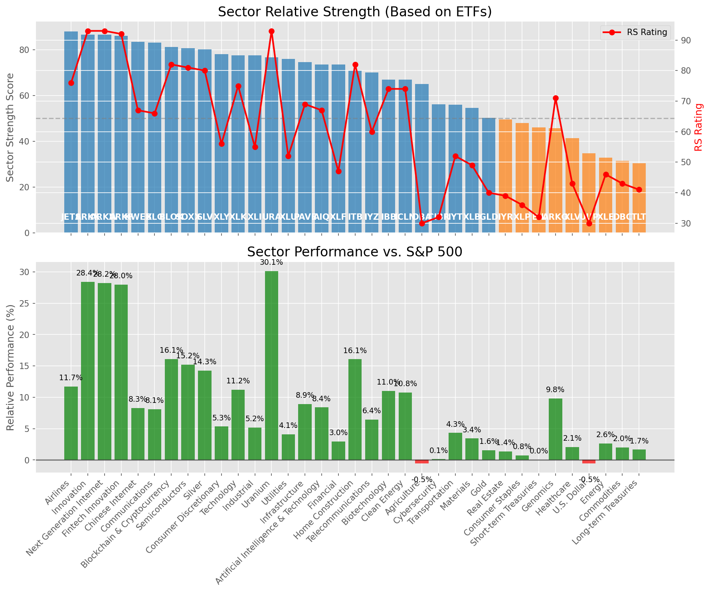

# **Daily Relative Strength Report**

**Date:** 2025-08-20

## **Market Valuation (Buffett Indicator)**

| Metric | Value |
|--------|-------|
| **Market Valuation** | **Overvalued** |
| **Current Ratio** | 10.29 |
| **Historical Mean** | 9.84 |
| **Standard Deviation** | 0.43 |
| **Z-Score (StdDev from Mean)** | 1.25 |
| **Total Market Cap** | $312.06 trillion |
| **GDP** | $30.33 trillion |

## **Market Insights**

### **Market is Overvalued**

The market appears to be trading above historical average valuations. While not at extreme levels, this suggests more modest future returns may be expected. Investors should:

- Focus on companies with reasonable valuations relative to their growth
- Be more selective with new positions
- Look for stocks showing relative strength within their sectors
- Consider trimming positions in extremely overvalued names

Historically, periods of mild overvaluation can persist for extended periods, but returns tend to be below average.

### **Buffett Indicator Overview**

The Buffett Indicator (Total Market Cap / GDP) is a measure of the stock market's valuation relative to the size of the economy. It is named after Warren Buffett, who described it as "probably the best single measure of where valuations stand at any given moment."

- **Values above +2 standard deviations:** Market significantly overvalued
- **Values above +1 standard deviation:** Market overvalued
- **Values between -1 and +1 standard deviations:** Market fairly valued
- **Values below -1 standard deviation:** Market undervalued
- **Values below -2 standard deviations:** Market significantly undervalued

---

## **Sector Relative Strength**

Based on William O'Neil's Relative Strength Methodology

| ETF | Strength | RS Rating | Performance | Above Key MAs | Trend | Sector |
|-----|----------|-----------|-------------|--------------|-------|--------|
| [JETS](https://www.tradingview.com/chart/?symbol=JETS) | 88.0 | 76.0 | 11.79% | 10d ✓, 50d ✓, 200d ✓ | ↗️ | Airlines |
| [ARKW](https://www.tradingview.com/chart/?symbol=ARKW) | 86.6 | 93.0 | 28.76% | 10d ✗, 50d ✓, 200d ✓ | ↗️ | Next Generation Internet |
| [BLOK](https://www.tradingview.com/chart/?symbol=BLOK) | 83.1 | 86.0 | 18.37% | 10d ✗, 50d ✓, 200d ✓ | ↗️ | Blockchain & Cryptocurrency |
| [KWEB](https://www.tradingview.com/chart/?symbol=KWEB) | 82.5 | 65.0 | 7.56% | 10d ✓, 50d ✓, 200d ✓ | ↗️ | Chinese Internet |
| [SLV](https://www.tradingview.com/chart/?symbol=SLV) | 79.6 | 79.0 | 13.54% | 10d ✗, 50d ✓, 200d ✓ | ↗️ | Silver |
| [XLU](https://www.tradingview.com/chart/?symbol=XLU) | 76.5 | 53.0 | 4.40% | 10d ✓, 50d ✓, 200d ✓ | ↗️ | Utilities |
| [URA](https://www.tradingview.com/chart/?symbol=URA) | 76.2 | 92.0 | 27.53% | 10d ✗, 50d ✗, 200d ✓ | ↗️ | Uranium |
| [ARKK](https://www.tradingview.com/chart/?symbol=ARKK) | 75.7 | 91.0 | 24.89% | 10d ✗, 50d ✗, 200d ✓ | ↗️ | Innovation |
| [ARKF](https://www.tradingview.com/chart/?symbol=ARKF) | 75.7 | 91.0 | 24.59% | 10d ✗, 50d ✗, 200d ✓ | ↗️ | Fintech Innovation |
| [XLK](https://www.tradingview.com/chart/?symbol=XLK) | 75.6 | 71.0 | 9.73% | 10d ✗, 50d ✓, 200d ✓ | ↗️ | Technology |
| [PAVE](https://www.tradingview.com/chart/?symbol=PAVE) | 74.1 | 68.0 | 8.57% | 10d ✗, 50d ✓, 200d ✓ | ↗️ | Infrastructure |
| [ITB](https://www.tradingview.com/chart/?symbol=ITB) | 73.0 | 86.0 | 18.53% | 10d ✓, 50d ✓, 200d ✓ | ↘️ | Home Construction |
| [XLC](https://www.tradingview.com/chart/?symbol=XLC) | 72.6 | 65.0 | 7.48% | 10d ✗, 50d ✓, 200d ✓ | ↗️ | Communications |
| [XLF](https://www.tradingview.com/chart/?symbol=XLF) | 72.5 | 45.0 | 2.49% | 10d ✓, 50d ✓, 200d ✓ | ↗️ | Financial |
| [IYZ](https://www.tradingview.com/chart/?symbol=IYZ) | 69.1 | 58.0 | 5.81% | 10d ✗, 50d ✓, 200d ✓ | ↗️ | Telecommunications |
| [SOXX](https://www.tradingview.com/chart/?symbol=SOXX) | 68.7 | 77.0 | 12.46% | 10d ✗, 50d ✗, 200d ✓ | ↗️ | Semiconductors |
| [XLY](https://www.tradingview.com/chart/?symbol=XLY) | 68.1 | 56.0 | 5.17% | 10d ✗, 50d ✓, 200d ✓ | ↗️ | Consumer Discretionary |
| [XLI](https://www.tradingview.com/chart/?symbol=XLI) | 67.1 | 54.0 | 4.74% | 10d ✗, 50d ✓, 200d ✓ | ↗️ | Industrial |
| [IBB](https://www.tradingview.com/chart/?symbol=IBB) | 67.0 | 74.0 | 10.72% | 10d ✓, 50d ✓, 200d ✓ | ↘️ | Biotechnology |
| [ICLN](https://www.tradingview.com/chart/?symbol=ICLN) | 66.5 | 73.0 | 10.59% | 10d ✓, 50d ✓, 200d ✓ | ↘️ | Clean Energy |
| [DBA](https://www.tradingview.com/chart/?symbol=DBA) | 65.5 | 31.0 | -0.51% | 10d ✓, 50d ✓, 200d ✓ | ↗️ | Agriculture |
| [AIQ](https://www.tradingview.com/chart/?symbol=AIQ) | 61.7 | 63.0 | 7.05% | 10d ✗, 50d ✗, 200d ✓ | ↗️ | Artificial Intelligence & Technology |
| [IYT](https://www.tradingview.com/chart/?symbol=IYT) | 57.5 | 55.0 | 4.95% | 10d ✓, 50d ✓, 200d ✓ | ↘️ | Transportation |
| [XLB](https://www.tradingview.com/chart/?symbol=XLB) | 55.0 | 50.0 | 3.53% | 10d ✓, 50d ✓, 200d ✓ | ↘️ | Materials |
| [IYR](https://www.tradingview.com/chart/?symbol=IYR) | 51.0 | 42.0 | 1.71% | 10d ✓, 50d ✓, 200d ✓ | ↘️ | Real Estate |
| [GLD](https://www.tradingview.com/chart/?symbol=GLD) | 49.7 | 39.0 | 1.32% | 10d ✗, 50d ✗, 200d ✓ | ↗️ | Gold |
| [XLP](https://www.tradingview.com/chart/?symbol=XLP) | 49.0 | 38.0 | 1.09% | 10d ✓, 50d ✓, 200d ✓ | ↘️ | Consumer Staples |
| [BIL](https://www.tradingview.com/chart/?symbol=BIL) | 46.0 | 32.0 | 0.03% | 10d ✓, 50d ✓, 200d ✓ | ↘️ | Short-term Treasuries |
| [CIBR](https://www.tradingview.com/chart/?symbol=CIBR) | 44.7 | 29.0 | -0.93% | 10d ✗, 50d ✗, 200d ✓ | ↗️ | Cybersecurity |
| [XLV](https://www.tradingview.com/chart/?symbol=XLV) | 41.8 | 44.0 | 2.19% | 10d ✓, 50d ✓, 200d ✗ | ↘️ | Healthcare |
| [UUP](https://www.tradingview.com/chart/?symbol=UUP) | 34.8 | 30.0 | -0.58% | 10d ✓, 50d ✓, 200d ✗ | ↘️ | U.S. Dollar |
| [ARKG](https://www.tradingview.com/chart/?symbol=ARKG) | 33.5 | 67.0 | 8.16% | 10d ✗, 50d ✗, 200d ✗ | ↘️ | Genomics |
| [XLE](https://www.tradingview.com/chart/?symbol=XLE) | 31.9 | 44.0 | 2.32% | 10d ✓, 50d ✗, 200d ✗ | ↘️ | Energy |
| [DBC](https://www.tradingview.com/chart/?symbol=DBC) | 22.0 | 44.0 | 2.17% | 10d ✗, 50d ✗, 200d ✗ | ↘️ | Commodities |
| [TLT](https://www.tradingview.com/chart/?symbol=TLT) | 20.5 | 41.0 | 1.49% | 10d ✗, 50d ✗, 200d ✗ | ↘️ | Long-term Treasuries |

### **Sector ETF Performance Interpretation**

This table shows the relative strength metrics for different market sectors based on their representative ETFs:

- **ETF**: The ETF used to measure sector performance (click for chart)
- **Strength**: Overall sector strength score (0-100) combining multiple factors
- **RS Rating**: O'Neil RS rating of the sector ETF
- **Performance**: Performance of the sector ETF relative to SPY
- **Above Key MAs**: Whether the ETF is trading above its 10, 50, and 200-day moving averages
- **Trend**: Whether the sector is in an uptrend (↗️) or downtrend (↘️)

### **Current Sector Leadership**

The current market leadership is coming from the following sectors: **Airlines, Next Generation Internet, Blockchain & Cryptocurrency**.

The **Airlines** sector (represented by **JETS**) is showing particularly strong relative strength with an RS rating of 76.0 and performance of 11.79% vs. the S&P 500. This sector is trading above its 10-day, 50-day, 200-day moving average(s). Investors should consider focusing on high RS stocks within these leading sectors for potential outperformance.

---

## **Buy Recommendations**

The following 26 stocks show exceptional relative strength:

| RS Rating | Buy Score | Current Price | Chart | Name | Ticker |
|-----------|-----------|---------------|-------|------|--------|
| 99 | 100 | $97.19 | [Chart](https://www.tradingview.com/chart/?symbol=RYTM) | Rhythm Pharmaceuticals, Inc. Common Stock | RYTM |
| 99 | 100 | $169.24 | [Chart](https://www.tradingview.com/chart/?symbol=FUTU) | Futu Holdings Limited American Depositary Shares | FUTU |
| 99 | 100 | $26.62 | [Chart](https://www.tradingview.com/chart/?symbol=LQDA) | Liquidia Corporation Common Stock | LQDA |
| 98 | 100 | $191.22 | [Chart](https://www.tradingview.com/chart/?symbol=COOP) | Mr. Cooper Group Inc. Common Stock | COOP |
| 98 | 100 | $58.60 | [Chart](https://www.tradingview.com/chart/?symbol=GH) | Guardant Health, Inc. Common Stock | GH |
| 97 | 100 | $105.57 | [Chart](https://www.tradingview.com/chart/?symbol=VRNA) | Verona Pharma plc | VRNA |
| 96 | 100 | $64.22 | [Chart](https://www.tradingview.com/chart/?symbol=MRCY) | Mercury Systems Inc. | MRCY |
| 96 | 100 | $99.59 | [Chart](https://www.tradingview.com/chart/?symbol=EBAY) | eBay Inc | EBAY |
| 96 | 100 | $83.86 | [Chart](https://www.tradingview.com/chart/?symbol=LIF) | Life360, Inc. Common Stock | LIF |
| 95 | 100 | $75.15 | [Chart](https://www.tradingview.com/chart/?symbol=WNS) | WNS (Holdings) Limited | WNS |
| 95 | 100 | $58.73 | [Chart](https://www.tradingview.com/chart/?symbol=BTI) | British American Tobacco p.l.c. American Depositary Shares, American Depositary Shares, each representing one Ordinary Share | BTI |
| 94 | 100 | $323.70 | [Chart](https://www.tradingview.com/chart/?symbol=RCL) | Royal Caribbean Group | RCL |
| 93 | 100 | $250.48 | [Chart](https://www.tradingview.com/chart/?symbol=BAP) | Credicorp LTD | BAP |
| 90 | 100 | $113.23 | [Chart](https://www.tradingview.com/chart/?symbol=AZZ) | AZZ Inc. | AZZ |
| 90 | 100 | $52.59 | [Chart](https://www.tradingview.com/chart/?symbol=FHI) | Federated Hermes, Inc. | FHI |
| 89 | 100 | $433.39 | [Chart](https://www.tradingview.com/chart/?symbol=CYBR) | CyberArk Software Ltd. | CYBR |
| 89 | 100 | $44.91 | [Chart](https://www.tradingview.com/chart/?symbol=LTM) | LATAM Airlines Group S.A. American Depositary Shares (each representing two thousand (2,000) shares of Common Stock) | LTM |
| 88 | 100 | $161.16 | [Chart](https://www.tradingview.com/chart/?symbol=VSEC) | VSE Corp | VSEC |
| 89 | 99 | $195.27 | [Chart](https://www.tradingview.com/chart/?symbol=AWI) | Armstrong World Industries, Inc. | AWI |
| 86 | 98 | $93.57 | [Chart](https://www.tradingview.com/chart/?symbol=LLYVK) | Liberty Media Corporation Series C Liberty Live Common Stock | LLYVK |
| 83 | 97 | $41.16 | [Chart](https://www.tradingview.com/chart/?symbol=AHR) | American Healthcare REIT, Inc. | AHR |
| 85 | 96 | $28.76 | [Chart](https://www.tradingview.com/chart/?symbol=CPS) | Cooper-Standard Automotive Inc. | CPS |
| 82 | 95 | $26.21 | [Chart](https://www.tradingview.com/chart/?symbol=LAUR) | Laureate Education, Inc. Common Stock | LAUR |
| 81 | 92 | $24.74 | [Chart](https://www.tradingview.com/chart/?symbol=ING) | ING Groep N.V. American Depositary Shares | ING |
| 81 | 91 | $18.62 | [Chart](https://www.tradingview.com/chart/?symbol=DAN) | Dana Incorporated | DAN |
| 80 | 90 | $73.86 | [Chart](https://www.tradingview.com/chart/?symbol=TD) | Toronto Dominion Bank | TD |

---

## **Sell Recommendations**

The following 158 stocks show deteriorating relative strength:

| RS Rating | Sell Score | Current Price | Chart | Name | Ticker |
|-----------|------------|---------------|-------|------|--------|
| 2 | 100 | $65.70 | [Chart](https://www.tradingview.com/chart/?symbol=BMA) | Banco Macro S.A. | BMA |
| 2 | 100 | $25.03 | [Chart](https://www.tradingview.com/chart/?symbol=BRZE) | Braze, Inc. Class A Common Stock | BRZE |
| 2 | 100 | $25.84 | [Chart](https://www.tradingview.com/chart/?symbol=CRI) | Carter's Inc. | CRI |
| 2 | 100 | $47.87 | [Chart](https://www.tradingview.com/chart/?symbol=FTV) | Fortive Corporation | FTV |
| 2 | 100 | $12.85 | [Chart](https://www.tradingview.com/chart/?symbol=NVDS) | Investment Managers Series Trust II Tradr 1.5X Short NVDA Daily ETF | NVDS |
| 2 | 100 | $32.29 | [Chart](https://www.tradingview.com/chart/?symbol=IOT) | Samsara Inc. | IOT |
| 2 | 100 | $15.48 | [Chart](https://www.tradingview.com/chart/?symbol=KRNT) | Kornit Digital Ltd. | KRNT |
| 2 | 100 | $16.73 | [Chart](https://www.tradingview.com/chart/?symbol=DJT) | Trump Media & Technology Group Corp. Common Stock | DJT |
| 2 | 100 | $11.47 | [Chart](https://www.tradingview.com/chart/?symbol=ACVA) | ACV Auctions Inc. | ACVA |
| 3 | 100 | $23.54 | [Chart](https://www.tradingview.com/chart/?symbol=ZSL) | ProShares UltraShort Silver | ZSL |
| 3 | 100 | $25.83 | [Chart](https://www.tradingview.com/chart/?symbol=TECS) | Direxion Daily Technology Bear 3x Shares | TECS |
| 3 | 100 | $15.29 | [Chart](https://www.tradingview.com/chart/?symbol=TSLT) | T-REX 2X Long Tesla Daily Target ETF | TSLT |
| 3 | 100 | $20.53 | [Chart](https://www.tradingview.com/chart/?symbol=GAP) | The Gap, Inc. | GAP |
| 3 | 100 | $21.95 | [Chart](https://www.tradingview.com/chart/?symbol=CLW) | Clearwater Paper Corporation | CLW |
| 4 | 100 | $39.85 | [Chart](https://www.tradingview.com/chart/?symbol=VIST) | Vista Energy S.A.B. de C.V. | VIST |
| 5 | 100 | $75.95 | [Chart](https://www.tradingview.com/chart/?symbol=ESTC) | Elastic N.V. | ESTC |
| 5 | 100 | $24.03 | [Chart](https://www.tradingview.com/chart/?symbol=HELE) | Helen Of Troy Ltd | HELE |
| 6 | 100 | $104.16 | [Chart](https://www.tradingview.com/chart/?symbol=DECK) | Deckers Outdoor Corp | DECK |
| 6 | 100 | $22.87 | [Chart](https://www.tradingview.com/chart/?symbol=NOG) | Northern Oil and Gas, Inc. | NOG |
| 6 | 100 | $25.63 | [Chart](https://www.tradingview.com/chart/?symbol=TBBB) | BBB Foods Inc. | TBBB |
| 7 | 100 | $57.79 | [Chart](https://www.tradingview.com/chart/?symbol=ATKR) | Atkore Inc. | ATKR |
| 7 | 100 | $23.37 | [Chart](https://www.tradingview.com/chart/?symbol=CRTO) | Criteo S.A. | CRTO |
| 7 | 100 | $16.70 | [Chart](https://www.tradingview.com/chart/?symbol=S) | SentinelOne, Inc. | S |
| 8 | 100 | $39.37 | [Chart](https://www.tradingview.com/chart/?symbol=TWM) | ProShares UltraShort Russell2000 | TWM |
| 9 | 100 | $17.23 | [Chart](https://www.tradingview.com/chart/?symbol=SVOL) | Simplify Volatility Premium ETF | SVOL |
| 9 | 100 | $31.18 | [Chart](https://www.tradingview.com/chart/?symbol=TECK) | Teck Resources Limited | TECK |
| 9 | 100 | $39.83 | [Chart](https://www.tradingview.com/chart/?symbol=SDOW) | ProShares UltraPro Short Dow 30 | SDOW |
| 10 | 100 | $11.92 | [Chart](https://www.tradingview.com/chart/?symbol=BSM) | Black Stone Minerals, L.P. | BSM |
| 11 | 100 | $14.86 | [Chart](https://www.tradingview.com/chart/?symbol=CHCT) | Community Healthcare Trust Incorporated Common Stock, $0.01 par value per share | CHCT |
| 13 | 100 | $16.60 | [Chart](https://www.tradingview.com/chart/?symbol=CTO) | CTO Realty Growth, Inc. | CTO |
| 2 | 99 | $16.49 | [Chart](https://www.tradingview.com/chart/?symbol=AI) | C3.ai, Inc. | AI |
| 4 | 99 | $38.72 | [Chart](https://www.tradingview.com/chart/?symbol=VIXY) | ProShares VIX Short-Term Futures ETF | VIXY |
| 9 | 99 | $25.28 | [Chart](https://www.tradingview.com/chart/?symbol=CZR) | Caesars Entertainment, Inc. Common Stock | CZR |
| 10 | 99 | $10.87 | [Chart](https://www.tradingview.com/chart/?symbol=PATH) | UiPath, Inc. | PATH |
| 10 | 99 | $73.43 | [Chart](https://www.tradingview.com/chart/?symbol=OKE) | Oneok, Inc. | OKE |
| 14 | 99 | $17.48 | [Chart](https://www.tradingview.com/chart/?symbol=IRT) | Independence Realty Trust Inc. | IRT |
| 14 | 99 | $15.25 | [Chart](https://www.tradingview.com/chart/?symbol=RXO) | RXO, Inc. | RXO |
| 15 | 99 | $40.21 | [Chart](https://www.tradingview.com/chart/?symbol=WLY) | John Wiley & Sons, Inc. Class A | WLY |
| 11 | 98 | $16.92 | [Chart](https://www.tradingview.com/chart/?symbol=BTAL) | AGF U.S. Market Neutral Anti-Beta Fund | BTAL |
| 11 | 98 | $15.14 | [Chart](https://www.tradingview.com/chart/?symbol=MCS) | The Marcus Corporation | MCS |
| 11 | 98 | $29.53 | [Chart](https://www.tradingview.com/chart/?symbol=BBWI) | Bath & Body Works, Inc. | BBWI |
| 13 | 98 | $30.58 | [Chart](https://www.tradingview.com/chart/?symbol=DAR) | DARLING INGREDIENTS INC. | DAR |
| 14 | 98 | $108.28 | [Chart](https://www.tradingview.com/chart/?symbol=CPT) | Camden Property Trust | CPT |
| 16 | 98 | $14.41 | [Chart](https://www.tradingview.com/chart/?symbol=VRE) | Veris Residential, Inc. | VRE |
| 18 | 98 | $39.04 | [Chart](https://www.tradingview.com/chart/?symbol=SH) | ProShares Short S&P500 | SH |
| 18 | 98 | $39.24 | [Chart](https://www.tradingview.com/chart/?symbol=UDR) | UDR, Inc. | UDR |
| 10 | 97 | $28.45 | [Chart](https://www.tradingview.com/chart/?symbol=CNX) | CNX Resources Corporation | CNX |
| 22 | 97 | $11.90 | [Chart](https://www.tradingview.com/chart/?symbol=DYN) | Dyne Therapeutics, Inc. Common Stock | DYN |
| 12 | 96 | $103.13 | [Chart](https://www.tradingview.com/chart/?symbol=MATX) | Matsons, Inc. | MATX |
| 13 | 96 | $122.49 | [Chart](https://www.tradingview.com/chart/?symbol=CLX) | Clorox Company | CLX |
| 15 | 96 | $191.45 | [Chart](https://www.tradingview.com/chart/?symbol=AVB) | AvalonBay Communities, Inc. | AVB |
| 10 | 95 | $106.27 | [Chart](https://www.tradingview.com/chart/?symbol=ITGR) | Integer Holdings Corporation | ITGR |
| 13 | 95 | $29.31 | [Chart](https://www.tradingview.com/chart/?symbol=MGPI) | MGP Ingredients Inc | MGPI |
| 14 | 95 | $10.69 | [Chart](https://www.tradingview.com/chart/?symbol=LBRT) | Liberty Energy Inc. | LBRT |
| 15 | 95 | $92.26 | [Chart](https://www.tradingview.com/chart/?symbol=IRM) | Iron Mountain Inc. | IRM |
| 17 | 95 | $14.39 | [Chart](https://www.tradingview.com/chart/?symbol=VTLE) | Vital Energy, Inc. | VTLE |
| 19 | 95 | $22.30 | [Chart](https://www.tradingview.com/chart/?symbol=CURB) | Curbline Properties Corp. | CURB |
| 20 | 95 | $37.86 | [Chart](https://www.tradingview.com/chart/?symbol=KSA) | iShares MSCI Saudi Arabia ETF | KSA |
| 12 | 94 | $87.15 | [Chart](https://www.tradingview.com/chart/?symbol=MMSI) | Merit Medical Systems Inc | MMSI |
| 17 | 94 | $25.66 | [Chart](https://www.tradingview.com/chart/?symbol=FCPT) | Four Corners Property Trust, Inc. | FCPT |
| 19 | 94 | $18.25 | [Chart](https://www.tradingview.com/chart/?symbol=EBF) | Ennis, Inc. | EBF |
| 7 | 93 | $11.04 | [Chart](https://www.tradingview.com/chart/?symbol=CEPU) | Central Puerto S.A. American Depositary Shares (each represents ten Common Shares) | CEPU |
| 10 | 93 | $773.46 | [Chart](https://www.tradingview.com/chart/?symbol=EQIX) | Equinix, Inc. Common Stock REIT | EQIX |
| 16 | 93 | $140.75 | [Chart](https://www.tradingview.com/chart/?symbol=OLED) | Universal Display Corp | OLED |
| 17 | 93 | $33.42 | [Chart](https://www.tradingview.com/chart/?symbol=PSQ) | ProShares Short QQQ | PSQ |
| 17 | 92 | $10.14 | [Chart](https://www.tradingview.com/chart/?symbol=SPDN) | Direxion Daily S&P 500 Bear 1X Shares | SPDN |
| 20 | 92 | $10.05 | [Chart](https://www.tradingview.com/chart/?symbol=NMZ) | Nuveen Municipal High Income Opportunity Fund | NMZ |
| 9 | 91 | $23.66 | [Chart](https://www.tradingview.com/chart/?symbol=PRGO) | PERRIGO COMPANY PLC | PRGO |
| 10 | 91 | $70.66 | [Chart](https://www.tradingview.com/chart/?symbol=CTSH) | Cognizant Technology Solutions | CTSH |
| 15 | 91 | $39.29 | [Chart](https://www.tradingview.com/chart/?symbol=WHD) | Cactus, Inc. | WHD |
| 15 | 91 | $36.41 | [Chart](https://www.tradingview.com/chart/?symbol=APGE) | Apogee Therapeutics, Inc. Common Stock | APGE |
| 13 | 90 | $30.89 | [Chart](https://www.tradingview.com/chart/?symbol=INVH) | Invitation Homes Inc. Common Stock | INVH |
| 15 | 90 | $167.53 | [Chart](https://www.tradingview.com/chart/?symbol=EPAM) | EPAM SYSTEMS, INC. | EPAM |
| 16 | 90 | $42.52 | [Chart](https://www.tradingview.com/chart/?symbol=SW) | Smurfit Westrock plc | SW |
| 17 | 90 | $13.80 | [Chart](https://www.tradingview.com/chart/?symbol=EWTX) | Edgewise Therapeutics, Inc. Common Stock | EWTX |
| 19 | 90 | $87.01 | [Chart](https://www.tradingview.com/chart/?symbol=CL) | Colgate-Palmolive Company | CL |
| 25 | 90 | $46.96 | [Chart](https://www.tradingview.com/chart/?symbol=EDU) | New Oriental Education and Technology Group, Inc. American Depositary Shares (each representing ten (10) Common Shares) | EDU |
| 29 | 90 | $31.73 | [Chart](https://www.tradingview.com/chart/?symbol=PCVX) | Vaxcyte, Inc. Common Stock | PCVX |
| 11 | 89 | $17.52 | [Chart](https://www.tradingview.com/chart/?symbol=MAT) | Mattel, Inc. | MAT |
| 18 | 89 | $68.09 | [Chart](https://www.tradingview.com/chart/?symbol=PYPL) | PayPal Holdings, Inc. Common Stock | PYPL |
| 18 | 89 | $68.72 | [Chart](https://www.tradingview.com/chart/?symbol=HSIC) | Henry Schein Inc | HSIC |
| 21 | 89 | $25.25 | [Chart](https://www.tradingview.com/chart/?symbol=DOG) | ProShares Short Dow30 | DOG |
| 25 | 89 | $14.59 | [Chart](https://www.tradingview.com/chart/?symbol=IMVT) | Immunovant, Inc. Common Stock | IMVT |
| 25 | 89 | $14.50 | [Chart](https://www.tradingview.com/chart/?symbol=VSH) | Vishay Intertechnology, Inc. | VSH |
| 25 | 89 | $13.83 | [Chart](https://www.tradingview.com/chart/?symbol=MNR) | Mach Natural Resources LP Common Units representing Limited Partner Interests | MNR |
| 28 | 89 | $11.79 | [Chart](https://www.tradingview.com/chart/?symbol=NZF) | Nuveen Municipal Credit Income Fund | NZF |
| 16 | 88 | $35.55 | [Chart](https://www.tradingview.com/chart/?symbol=AMH) | AMERICAN HOMES 4 RENT | AMH |
| 19 | 88 | $33.52 | [Chart](https://www.tradingview.com/chart/?symbol=CMCSA) | Comcast Corp | CMCSA |
| 20 | 88 | $70.44 | [Chart](https://www.tradingview.com/chart/?symbol=MKC) | McCormick & Company, Incorporated Non-VTG CS | MKC |
| 20 | 88 | $36.82 | [Chart](https://www.tradingview.com/chart/?symbol=VNO) | Vornado Realty Trust | VNO |
| 21 | 88 | $10.49 | [Chart](https://www.tradingview.com/chart/?symbol=DVAX) | Dynavax Technologies Corporation | DVAX |
| 24 | 88 | $10.95 | [Chart](https://www.tradingview.com/chart/?symbol=MQY) | Blackrock Muni Yield Quality Fund, Inc | MQY |
| 26 | 88 | $12.26 | [Chart](https://www.tradingview.com/chart/?symbol=NOV) | NOV Inc. | NOV |
| 14 | 87 | $23.65 | [Chart](https://www.tradingview.com/chart/?symbol=DXD) | ProShares UltraShort Dow 30 | DXD |
| 14 | 87 | $64.54 | [Chart](https://www.tradingview.com/chart/?symbol=QSR) | Restaurant Brands International Inc. | QSR |
| 20 | 87 | $78.74 | [Chart](https://www.tradingview.com/chart/?symbol=IR) | Ingersoll Rand Inc. Common Stock | IR |
| 21 | 87 | $119.35 | [Chart](https://www.tradingview.com/chart/?symbol=TMDX) | TransMedics Group, Inc. Common Stock | TMDX |
| 19 | 86 | $136.68 | [Chart](https://www.tradingview.com/chart/?symbol=DVA) | DaVita Inc. | DVA |
| 19 | 86 | $42.86 | [Chart](https://www.tradingview.com/chart/?symbol=KNX) | Knight-Swift Transportation Holdings Inc. Class A Common Stock | KNX |
| 21 | 86 | $133.08 | [Chart](https://www.tradingview.com/chart/?symbol=APO) | Apollo Global Management, Inc. | APO |
| 22 | 86 | $29.54 | [Chart](https://www.tradingview.com/chart/?symbol=CNQ) | Canadian Natural Resources Limited | CNQ |
| 22 | 86 | $33.23 | [Chart](https://www.tradingview.com/chart/?symbol=SLB) | Schlumberger Limited | SLB |
| 26 | 86 | $24.18 | [Chart](https://www.tradingview.com/chart/?symbol=HYMB) | SPDR Nuveen ICE High Yield Municipal Bond ETF | HYMB |
| 18 | 85 | $28.88 | [Chart](https://www.tradingview.com/chart/?symbol=AMAL) | Amalgamated Financial Corp. Common Stock (DE) | AMAL |
| 18 | 85 | $12.16 | [Chart](https://www.tradingview.com/chart/?symbol=PMT) | PennyMac Mortgage Investment Trust | PMT |
| 18 | 84 | $19.37 | [Chart](https://www.tradingview.com/chart/?symbol=INGM) | Ingram Micro Holding Corporation | INGM |
| 23 | 84 | $63.75 | [Chart](https://www.tradingview.com/chart/?symbol=MDLZ) | Mondelez International, Inc. Class A | MDLZ |
| 24 | 84 | $11.63 | [Chart](https://www.tradingview.com/chart/?symbol=NVG) | Nuveen AMT-Free Municipal Credit Income Fund | NVG |
| 25 | 84 | $12.39 | [Chart](https://www.tradingview.com/chart/?symbol=WSR) | Whitestone REIT | WSR |
| 25 | 84 | $14.79 | [Chart](https://www.tradingview.com/chart/?symbol=GBDC) | Golub Capital BDC, Inc. | GBDC |
| 27 | 84 | $19.31 | [Chart](https://www.tradingview.com/chart/?symbol=CVBF) | CVB Financial Corp | CVBF |
| 27 | 84 | $12.29 | [Chart](https://www.tradingview.com/chart/?symbol=RQI) | COHEN & STEERS QUALITY INCOME REALTY FUND, INC. COMMON SHARES | RQI |
| 30 | 84 | $10.80 | [Chart](https://www.tradingview.com/chart/?symbol=NEA) | Nuveen AMT-Free Quality Municipal Income Fund | NEA |
| 30 | 84 | $11.16 | [Chart](https://www.tradingview.com/chart/?symbol=NAD) | Nuveen Quality Municipal Income Fund | NAD |
| 21 | 83 | $223.53 | [Chart](https://www.tradingview.com/chart/?symbol=SBAC) | SBA Communications Corp | SBAC |
| 21 | 83 | $25.62 | [Chart](https://www.tradingview.com/chart/?symbol=FIVN) | FIVE9, INC. | FIVN |
| 23 | 83 | $30.53 | [Chart](https://www.tradingview.com/chart/?symbol=SRRK) | Scholar Rock Holding Corporation Common Stock | SRRK |
| 25 | 83 | $127.83 | [Chart](https://www.tradingview.com/chart/?symbol=ARM) | Arm Holdings plc American Depositary Shares | ARM |
| 18 | 82 | $47.02 | [Chart](https://www.tradingview.com/chart/?symbol=IP) | International Paper Co. | IP |
| 22 | 82 | $13.26 | [Chart](https://www.tradingview.com/chart/?symbol=CLMT) | Calumet, Inc. Common Stock | CLMT |
| 25 | 82 | $11.04 | [Chart](https://www.tradingview.com/chart/?symbol=PBR.A) | Petroleo Brasileiro S.A.-Petrobras | PBR.A |
| 31 | 82 | $22.50 | [Chart](https://www.tradingview.com/chart/?symbol=SIRI) | Sirius XM Holdings,  Inc | SIRI |
| 34 | 82 | $41.44 | [Chart](https://www.tradingview.com/chart/?symbol=SRLN) | SPDR Blackstone Senior Loan ETF | SRLN |
| 25 | 81 | $14.18 | [Chart](https://www.tradingview.com/chart/?symbol=INMD) | InMode Ltd. Ordinary Shares | INMD |
| 29 | 81 | $160.16 | [Chart](https://www.tradingview.com/chart/?symbol=TRGP) | Targa Resources Corp. | TRGP |
| 20 | 80 | $307.93 | [Chart](https://www.tradingview.com/chart/?symbol=LAD) | Lithia Motors, Inc. | LAD |
| 23 | 80 | $179.71 | [Chart](https://www.tradingview.com/chart/?symbol=DOV) | Dover Corporation | DOV |
| 26 | 80 | $14.05 | [Chart](https://www.tradingview.com/chart/?symbol=BMEZ) | BlackRock Health Sciences Term Trust | BMEZ |
| 29 | 80 | $740.40 | [Chart](https://www.tradingview.com/chart/?symbol=ASML) | ASML Holding NV | ASML |
| 30 | 80 | $17.36 | [Chart](https://www.tradingview.com/chart/?symbol=DOC) | Healthpeak Properties, Inc. | DOC |
| 31 | 80 | $11.96 | [Chart](https://www.tradingview.com/chart/?symbol=PBR) | PETROLEO BRASILEIRO S.A.-PETROBRAS ADS (REP 1 COMMON SHARE) | PBR |
| 26 | 79 | $14.18 | [Chart](https://www.tradingview.com/chart/?symbol=RDY) | Dr. Reddy's Laboratories Limited American Depositary Shares | RDY |
| 31 | 79 | $123.01 | [Chart](https://www.tradingview.com/chart/?symbol=XOP) | SPDR S&P Oil & Gas Exploration & Production ETF | XOP |
| 33 | 79 | $20.84 | [Chart](https://www.tradingview.com/chart/?symbol=BKLN) | Invesco Senior Loan ETF | BKLN |
| 24 | 78 | $45.34 | [Chart](https://www.tradingview.com/chart/?symbol=EPI) | WisdomTree India Earnings Fund ETF | EPI |
| 28 | 78 | $57.74 | [Chart](https://www.tradingview.com/chart/?symbol=STEP) | StepStone Group Inc. Class A Common Stock | STEP |
| 30 | 78 | $19.20 | [Chart](https://www.tradingview.com/chart/?symbol=AVBP) | ArriVent BioPharma, Inc. Common Stock | AVBP |
| 34 | 78 | $138.66 | [Chart](https://www.tradingview.com/chart/?symbol=FANG) | Diamondback Energy, Inc. | FANG |
| 29 | 77 | $66.90 | [Chart](https://www.tradingview.com/chart/?symbol=BXP) | BXP, Inc. | BXP |
| 33 | 77 | $153.93 | [Chart](https://www.tradingview.com/chart/?symbol=QCOM) | Qualcomm Inc | QCOM |
| 25 | 76 | $209.54 | [Chart](https://www.tradingview.com/chart/?symbol=AMT) | American Tower Corporation | AMT |
| 29 | 76 | $44.45 | [Chart](https://www.tradingview.com/chart/?symbol=FIZZ) | National Beverage Corp. | FIZZ |
| 33 | 76 | $43.59 | [Chart](https://www.tradingview.com/chart/?symbol=XDTE) | Roundhill S&P 500 0DTE Covered Call Strategy ETF | XDTE |
| 36 | 76 | $20.10 | [Chart](https://www.tradingview.com/chart/?symbol=STWD) | STARWOOD PROPERTY TRUST, INC. | STWD |
| 37 | 76 | $12.02 | [Chart](https://www.tradingview.com/chart/?symbol=CHPT) | ChargePoint Holdings, Inc. | CHPT |
| 35 | 75 | $33.79 | [Chart](https://www.tradingview.com/chart/?symbol=MEOH) | Methanex Corp | MEOH |
| 27 | 74 | $25.48 | [Chart](https://www.tradingview.com/chart/?symbol=STM) | STMicroelectronics N.V. | STM |
| 35 | 74 | $10.48 | [Chart](https://www.tradingview.com/chart/?symbol=DSU) | Blackrock Debt Strategies Fund, Inc. | DSU |
| 35 | 74 | $11.51 | [Chart](https://www.tradingview.com/chart/?symbol=BCAX) | Bicara Therapeutics Inc. Common Stock | BCAX |
| 29 | 73 | $46.50 | [Chart](https://www.tradingview.com/chart/?symbol=GBX) | The Greenbrier Companies, Inc. | GBX |
| 32 | 72 | $37.30 | [Chart](https://www.tradingview.com/chart/?symbol=STBA) | S&T Bancorp Inc | STBA |
| 35 | 72 | $49.28 | [Chart](https://www.tradingview.com/chart/?symbol=BNDX) | Vanguard Total International Bond ETF | BNDX |
| 31 | 71 | $23.04 | [Chart](https://www.tradingview.com/chart/?symbol=BSJP) | Invesco BulletShares 2025 High Yield Corporate Bond ETF | BSJP |
| 34 | 70 | $103.15 | [Chart](https://www.tradingview.com/chart/?symbol=CCI) | Crown Castle Inc. | CCI |
| 37 | 70 | $14.30 | [Chart](https://www.tradingview.com/chart/?symbol=BAND) | Bandwidth Inc. Class A Common Stock | BAND |
| 36 | 69 | $16.39 | [Chart](https://www.tradingview.com/chart/?symbol=QYLD) | Global X Funds Global X NASDAQ-100 Covered Call ETF | QYLD |
| 37 | 69 | $12.98 | [Chart](https://www.tradingview.com/chart/?symbol=PDBC) | Invesco Actively Managed Exch-Traded Commodity Fd Tr Invesco Optimum Yield Diversified Commodity Strategy No K-1 ETF | PDBC |
| 39 | 67 | $119.29 | [Chart](https://www.tradingview.com/chart/?symbol=VDE) | Vanguard Energy ETF | VDE |

## **Methodology**

This report uses William O'Neil's relative strength methodology from Investors Business Daily:

* **RS Rating**: Percentile rank of stock's performance vs. S&P 500 over the past 63 trading days (1-99 scale)
* **Buy Criteria**: RS Rating >= 80, price above 50-day MA, strong uptrend, increasing volume
* **Sell Criteria**: RS Rating < 40, price below 50-day MA, downtrend, decreasing volume

### **O'Neil's Key Principles**

1. **Focus on relative performance** - stocks outperforming the market
2. **Price trend confirmation** - stock must be in an uptrend
3. **Volume confirmation** - strong volume supports price moves
4. **Moving average validation** - price above key moving averages
5. **Market leaders only** - concentrate on top-performing stocks

*Report generated automatically after market close*