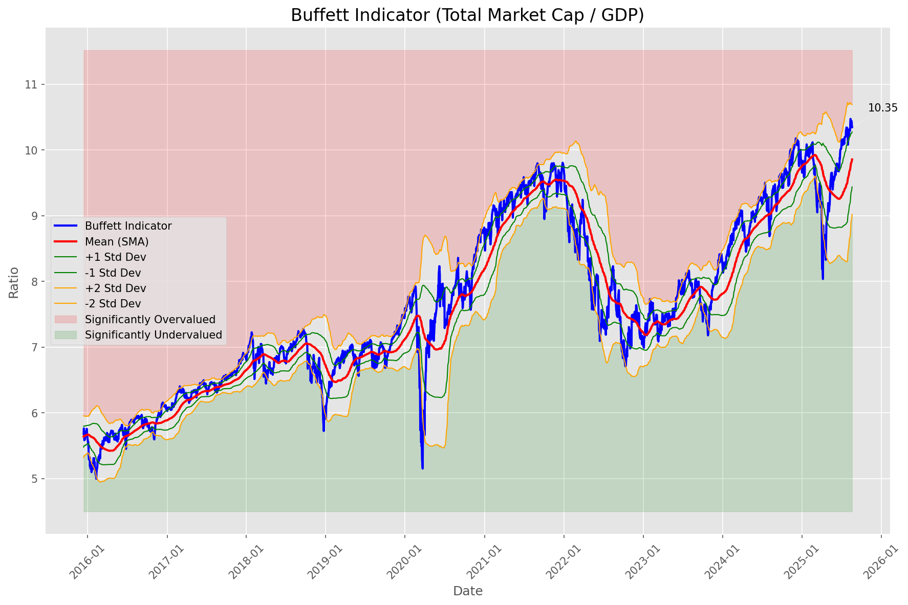
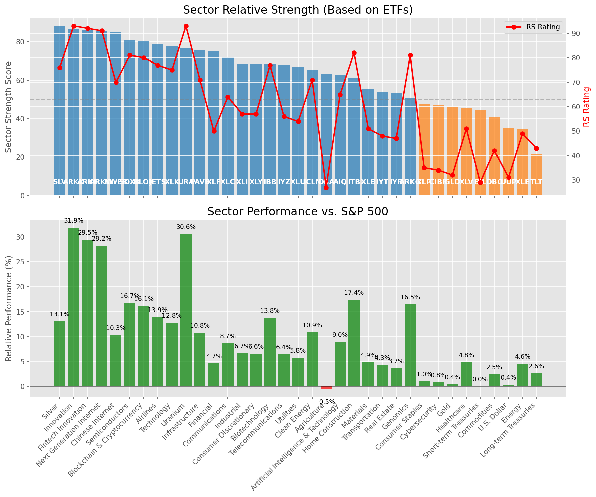

# **Daily Relative Strength Report**

**Date:** 2025-08-21

## **Market Valuation (Buffett Indicator)**

| Metric | Value |
|--------|-------|
| **Market Valuation** | **Overvalued** |
| **Current Ratio** | 10.32 |
| **Historical Mean** | 9.86 |
| **Standard Deviation** | 0.42 |
| **Z-Score (StdDev from Mean)** | 1.17 |
| **Total Market Cap** | $313.04 trillion |
| **GDP** | $30.33 trillion |

## **Market Insights**

### **Market is Overvalued**

The market appears to be trading above historical average valuations. While not at extreme levels, this suggests more modest future returns may be expected. Investors should:

- Focus on companies with reasonable valuations relative to their growth
- Be more selective with new positions
- Look for stocks showing relative strength within their sectors
- Consider trimming positions in extremely overvalued names

Historically, periods of mild overvaluation can persist for extended periods, but returns tend to be below average.

### **Buffett Indicator Overview**

The Buffett Indicator (Total Market Cap / GDP) is a measure of the stock market's valuation relative to the size of the economy. It is named after Warren Buffett, who described it as "probably the best single measure of where valuations stand at any given moment."

- **Values above +2 standard deviations:** Market significantly overvalued
- **Values above +1 standard deviation:** Market overvalued
- **Values between -1 and +1 standard deviations:** Market fairly valued
- **Values below -1 standard deviation:** Market undervalued
- **Values below -2 standard deviations:** Market significantly undervalued

---

## **Sector Relative Strength**

Based on William O'Neil's Relative Strength Methodology

| ETF | Strength | RS Rating | Performance | Above Key MAs | Trend | Sector |
|-----|----------|-----------|-------------|--------------|-------|--------|
| [SLV](https://www.tradingview.com/chart/?symbol=SLV) | 88.0 | 76.0 | 13.13% | 10d ✓, 50d ✓, 200d ✓ | ↗️ | Silver |
| [ARKK](https://www.tradingview.com/chart/?symbol=ARKK) | 86.6 | 93.0 | 31.86% | 10d ✗, 50d ✓, 200d ✓ | ↗️ | Innovation |
| [ARKF](https://www.tradingview.com/chart/?symbol=ARKF) | 86.1 | 92.0 | 29.47% | 10d ✗, 50d ✓, 200d ✓ | ↗️ | Fintech Innovation |
| [ARKW](https://www.tradingview.com/chart/?symbol=ARKW) | 85.6 | 91.0 | 28.22% | 10d ✗, 50d ✓, 200d ✓ | ↗️ | Next Generation Internet |
| [KWEB](https://www.tradingview.com/chart/?symbol=KWEB) | 85.0 | 70.0 | 10.34% | 10d ✓, 50d ✓, 200d ✓ | ↗️ | Chinese Internet |
| [SOXX](https://www.tradingview.com/chart/?symbol=SOXX) | 80.6 | 81.0 | 16.70% | 10d ✗, 50d ✓, 200d ✓ | ↗️ | Semiconductors |
| [BLOK](https://www.tradingview.com/chart/?symbol=BLOK) | 80.1 | 80.0 | 16.11% | 10d ✗, 50d ✓, 200d ✓ | ↗️ | Blockchain & Cryptocurrency |
| [JETS](https://www.tradingview.com/chart/?symbol=JETS) | 78.6 | 77.0 | 13.92% | 10d ✗, 50d ✓, 200d ✓ | ↗️ | Airlines |
| [XLK](https://www.tradingview.com/chart/?symbol=XLK) | 77.6 | 75.0 | 12.81% | 10d ✗, 50d ✓, 200d ✓ | ↗️ | Technology |
| [URA](https://www.tradingview.com/chart/?symbol=URA) | 76.7 | 93.0 | 30.57% | 10d ✗, 50d ✗, 200d ✓ | ↗️ | Uranium |
| [PAVE](https://www.tradingview.com/chart/?symbol=PAVE) | 75.6 | 71.0 | 10.81% | 10d ✗, 50d ✓, 200d ✓ | ↗️ | Infrastructure |
| [XLF](https://www.tradingview.com/chart/?symbol=XLF) | 75.0 | 50.0 | 4.68% | 10d ✓, 50d ✓, 200d ✓ | ↗️ | Financial |
| [XLC](https://www.tradingview.com/chart/?symbol=XLC) | 72.1 | 64.0 | 8.65% | 10d ✗, 50d ✓, 200d ✓ | ↗️ | Communications |
| [XLI](https://www.tradingview.com/chart/?symbol=XLI) | 68.6 | 57.0 | 6.67% | 10d ✗, 50d ✓, 200d ✓ | ↗️ | Industrial |
| [XLY](https://www.tradingview.com/chart/?symbol=XLY) | 68.6 | 57.0 | 6.62% | 10d ✗, 50d ✓, 200d ✓ | ↗️ | Consumer Discretionary |
| [IBB](https://www.tradingview.com/chart/?symbol=IBB) | 68.5 | 77.0 | 13.80% | 10d ✓, 50d ✓, 200d ✓ | ↘️ | Biotechnology |
| [IYZ](https://www.tradingview.com/chart/?symbol=IYZ) | 68.1 | 56.0 | 6.44% | 10d ✗, 50d ✓, 200d ✓ | ↗️ | Telecommunications |
| [XLU](https://www.tradingview.com/chart/?symbol=XLU) | 67.1 | 54.0 | 5.78% | 10d ✗, 50d ✓, 200d ✓ | ↗️ | Utilities |
| [ICLN](https://www.tradingview.com/chart/?symbol=ICLN) | 65.5 | 71.0 | 10.92% | 10d ✓, 50d ✓, 200d ✓ | ↘️ | Clean Energy |
| [DBA](https://www.tradingview.com/chart/?symbol=DBA) | 63.5 | 27.0 | -0.51% | 10d ✓, 50d ✓, 200d ✓ | ↗️ | Agriculture |
| [AIQ](https://www.tradingview.com/chart/?symbol=AIQ) | 62.7 | 65.0 | 8.98% | 10d ✗, 50d ✗, 200d ✓ | ↗️ | Artificial Intelligence & Technology |
| [ITB](https://www.tradingview.com/chart/?symbol=ITB) | 61.1 | 82.0 | 17.40% | 10d ✗, 50d ✓, 200d ✓ | ↘️ | Home Construction |
| [XLB](https://www.tradingview.com/chart/?symbol=XLB) | 55.5 | 51.0 | 4.86% | 10d ✓, 50d ✓, 200d ✓ | ↘️ | Materials |
| [IYT](https://www.tradingview.com/chart/?symbol=IYT) | 54.0 | 48.0 | 4.33% | 10d ✓, 50d ✓, 200d ✓ | ↘️ | Transportation |
| [IYR](https://www.tradingview.com/chart/?symbol=IYR) | 53.5 | 47.0 | 3.66% | 10d ✓, 50d ✓, 200d ✓ | ↘️ | Real Estate |
| [ARKG](https://www.tradingview.com/chart/?symbol=ARKG) | 50.7 | 81.0 | 16.47% | 10d ✗, 50d ✗, 200d ✓ | ↘️ | Genomics |
| [XLP](https://www.tradingview.com/chart/?symbol=XLP) | 47.5 | 35.0 | 1.04% | 10d ✓, 50d ✓, 200d ✓ | ↘️ | Consumer Staples |
| [CIBR](https://www.tradingview.com/chart/?symbol=CIBR) | 47.2 | 34.0 | 0.84% | 10d ✗, 50d ✗, 200d ✓ | ↗️ | Cybersecurity |
| [GLD](https://www.tradingview.com/chart/?symbol=GLD) | 46.2 | 32.0 | 0.45% | 10d ✗, 50d ✗, 200d ✓ | ↗️ | Gold |
| [XLV](https://www.tradingview.com/chart/?symbol=XLV) | 45.3 | 51.0 | 4.85% | 10d ✓, 50d ✓, 200d ✗ | ↘️ | Healthcare |
| [BIL](https://www.tradingview.com/chart/?symbol=BIL) | 44.5 | 29.0 | 0.04% | 10d ✓, 50d ✓, 200d ✓ | ↘️ | Short-term Treasuries |
| [DBC](https://www.tradingview.com/chart/?symbol=DBC) | 41.1 | 42.0 | 2.48% | 10d ✓, 50d ✗, 200d ✓ | ↘️ | Commodities |
| [UUP](https://www.tradingview.com/chart/?symbol=UUP) | 35.3 | 31.0 | 0.38% | 10d ✓, 50d ✓, 200d ✗ | ↘️ | U.S. Dollar |
| [XLE](https://www.tradingview.com/chart/?symbol=XLE) | 34.4 | 49.0 | 4.59% | 10d ✓, 50d ✗, 200d ✗ | ↘️ | Energy |
| [TLT](https://www.tradingview.com/chart/?symbol=TLT) | 21.5 | 43.0 | 2.64% | 10d ✗, 50d ✗, 200d ✗ | ↘️ | Long-term Treasuries |

### **Sector ETF Performance Interpretation**

This table shows the relative strength metrics for different market sectors based on their representative ETFs:

- **ETF**: The ETF used to measure sector performance (click for chart)
- **Strength**: Overall sector strength score (0-100) combining multiple factors
- **RS Rating**: O'Neil RS rating of the sector ETF
- **Performance**: Performance of the sector ETF relative to SPY
- **Above Key MAs**: Whether the ETF is trading above its 10, 50, and 200-day moving averages
- **Trend**: Whether the sector is in an uptrend (↗️) or downtrend (↘️)

### **Current Sector Leadership**

The current market leadership is coming from the following sectors: **Silver, Innovation, Fintech Innovation**.

The **Silver** sector (represented by **SLV**) is showing particularly strong relative strength with an RS rating of 76.0 and performance of 13.13% vs. the S&P 500. This sector is trading above its 10-day, 50-day, 200-day moving average(s). Investors should consider focusing on high RS stocks within these leading sectors for potential outperformance.

---

## **Buy Recommendations**

The following 30 stocks show exceptional relative strength:

| RS Rating | Buy Score | Current Price | Chart | Name | Ticker |
|-----------|-----------|---------------|-------|------|--------|
| 99 | 100 | $180.76 | [Chart](https://www.tradingview.com/chart/?symbol=FUTU) | Futu Holdings Limited American Depositary Shares | FUTU |
| 99 | 100 | $27.69 | [Chart](https://www.tradingview.com/chart/?symbol=LQDA) | Liquidia Corporation Common Stock | LQDA |
| 96 | 100 | $99.17 | [Chart](https://www.tradingview.com/chart/?symbol=EBAY) | eBay Inc | EBAY |
| 96 | 100 | $64.71 | [Chart](https://www.tradingview.com/chart/?symbol=MRCY) | Mercury Systems Inc. | MRCY |
| 96 | 100 | $86.10 | [Chart](https://www.tradingview.com/chart/?symbol=LIF) | Life360, Inc. Common Stock | LIF |
| 95 | 100 | $324.31 | [Chart](https://www.tradingview.com/chart/?symbol=RCL) | Royal Caribbean Group | RCL |
| 95 | 100 | $31.95 | [Chart](https://www.tradingview.com/chart/?symbol=CPS) | Cooper-Standard Automotive Inc. | CPS |
| 94 | 100 | $59.02 | [Chart](https://www.tradingview.com/chart/?symbol=BTI) | British American Tobacco p.l.c. American Depositary Shares, American Depositary Shares, each representing one Ordinary Share | BTI |
| 94 | 100 | $23.92 | [Chart](https://www.tradingview.com/chart/?symbol=BZ) | KANZHUN LIMITED American Depository Shares | BZ |
| 94 | 100 | $31.02 | [Chart](https://www.tradingview.com/chart/?symbol=SRAD) | Sportradar Group AG Class A Ordinary Shares | SRAD |
| 93 | 100 | $75.30 | [Chart](https://www.tradingview.com/chart/?symbol=WNS) | WNS (Holdings) Limited | WNS |
| 93 | 100 | $31.78 | [Chart](https://www.tradingview.com/chart/?symbol=PAAS) | Pan American Silver Corp. | PAAS |
| 92 | 100 | $36.57 | [Chart](https://www.tradingview.com/chart/?symbol=DB) | Deutsche Bank Aktiengesellschaft | DB |
| 91 | 100 | $49.58 | [Chart](https://www.tradingview.com/chart/?symbol=RING) | iShares MSCI Global Gold Miners ETF | RING |
| 90 | 100 | $251.70 | [Chart](https://www.tradingview.com/chart/?symbol=BAP) | Credicorp LTD | BAP |
| 89 | 100 | $23.20 | [Chart](https://www.tradingview.com/chart/?symbol=MAG) | MAG Silver Corp. | MAG |
| 89 | 100 | $45.46 | [Chart](https://www.tradingview.com/chart/?symbol=LTM) | LATAM Airlines Group S.A. American Depositary Shares (each representing two thousand (2,000) shares of Common Stock) | LTM |
| 88 | 100 | $42.31 | [Chart](https://www.tradingview.com/chart/?symbol=AHR) | American Healthcare REIT, Inc. | AHR |
| 88 | 98 | $18.45 | [Chart](https://www.tradingview.com/chart/?symbol=BVN) | Compania de Minas Buenaventura S.A. | BVN |
| 88 | 98 | $52.72 | [Chart](https://www.tradingview.com/chart/?symbol=FHI) | Federated Hermes, Inc. | FHI |
| 86 | 98 | $428.39 | [Chart](https://www.tradingview.com/chart/?symbol=CYBR) | CyberArk Software Ltd. | CYBR |
| 87 | 97 | $193.90 | [Chart](https://www.tradingview.com/chart/?symbol=AWI) | Armstrong World Industries, Inc. | AWI |
| 87 | 97 | $112.81 | [Chart](https://www.tradingview.com/chart/?symbol=AZZ) | AZZ Inc. | AZZ |
| 85 | 97 | $93.02 | [Chart](https://www.tradingview.com/chart/?symbol=LLYVK) | Liberty Media Corporation Series C Liberty Live Common Stock | LLYVK |
| 82 | 95 | $135.83 | [Chart](https://www.tradingview.com/chart/?symbol=AEM) | Agnico Eagle Mines Ltd. | AEM |
| 83 | 93 | $18.55 | [Chart](https://www.tradingview.com/chart/?symbol=DAN) | Dana Incorporated | DAN |
| 80 | 93 | $163.20 | [Chart](https://www.tradingview.com/chart/?symbol=IRTC) | iRhythm Technologies, Inc | IRTC |
| 80 | 93 | $26.06 | [Chart](https://www.tradingview.com/chart/?symbol=LAUR) | Laureate Education, Inc. Common Stock | LAUR |
| 82 | 92 | $15.78 | [Chart](https://www.tradingview.com/chart/?symbol=EZPW) | Ezcorp Inc | EZPW |
| 80 | 91 | $24.83 | [Chart](https://www.tradingview.com/chart/?symbol=ING) | ING Groep N.V. American Depositary Shares | ING |

---

## **Sell Recommendations**

The following 169 stocks show deteriorating relative strength:

| RS Rating | Sell Score | Current Price | Chart | Name | Ticker |
|-----------|------------|---------------|-------|------|--------|
| 1 | 100 | $15.26 | [Chart](https://www.tradingview.com/chart/?symbol=KRNT) | Kornit Digital Ltd. | KRNT |
| 2 | 100 | $21.20 | [Chart](https://www.tradingview.com/chart/?symbol=CLW) | Clearwater Paper Corporation | CLW |
| 2 | 100 | $17.14 | [Chart](https://www.tradingview.com/chart/?symbol=DJT) | Trump Media & Technology Group Corp. Common Stock | DJT |
| 2 | 100 | $38.29 | [Chart](https://www.tradingview.com/chart/?symbol=VIXY) | ProShares VIX Short-Term Futures ETF | VIXY |
| 2 | 100 | $25.23 | [Chart](https://www.tradingview.com/chart/?symbol=TECS) | Direxion Daily Technology Bear 3x Shares | TECS |
| 2 | 100 | $18.74 | [Chart](https://www.tradingview.com/chart/?symbol=DUST) | Direxion Daily Gold Miners Index Bear 2X Shares | DUST |
| 2 | 100 | $23.13 | [Chart](https://www.tradingview.com/chart/?symbol=ZSL) | ProShares UltraShort Silver | ZSL |
| 2 | 100 | $32.80 | [Chart](https://www.tradingview.com/chart/?symbol=IOT) | Samsara Inc. | IOT |
| 2 | 100 | $11.29 | [Chart](https://www.tradingview.com/chart/?symbol=ACVA) | ACV Auctions Inc. | ACVA |
| 3 | 100 | $25.40 | [Chart](https://www.tradingview.com/chart/?symbol=BRZE) | Braze, Inc. Class A Common Stock | BRZE |
| 4 | 100 | $24.95 | [Chart](https://www.tradingview.com/chart/?symbol=CRI) | Carter's Inc. | CRI |
| 4 | 100 | $18.75 | [Chart](https://www.tradingview.com/chart/?symbol=GPCR) | Structure Therapeutics Inc. American Depositary Shares | GPCR |
| 4 | 100 | $14.14 | [Chart](https://www.tradingview.com/chart/?symbol=CMCO) | Columbus McKinnon Corp/NY | CMCO |
| 5 | 100 | $66.06 | [Chart](https://www.tradingview.com/chart/?symbol=EMN) | Eastman Chemical Company | EMN |
| 5 | 100 | $40.13 | [Chart](https://www.tradingview.com/chart/?symbol=VIST) | Vista Energy S.A.B. de C.V. | VIST |
| 5 | 100 | $15.58 | [Chart](https://www.tradingview.com/chart/?symbol=TSLT) | T-REX 2X Long Tesla Daily Target ETF | TSLT |
| 6 | 100 | $40.06 | [Chart](https://www.tradingview.com/chart/?symbol=SDOW) | ProShares UltraPro Short Dow 30 | SDOW |
| 6 | 100 | $56.68 | [Chart](https://www.tradingview.com/chart/?symbol=ATKR) | Atkore Inc. | ATKR |
| 6 | 100 | $25.87 | [Chart](https://www.tradingview.com/chart/?symbol=TBBB) | BBB Foods Inc. | TBBB |
| 7 | 100 | $16.48 | [Chart](https://www.tradingview.com/chart/?symbol=S) | SentinelOne, Inc. | S |
| 7 | 100 | $39.65 | [Chart](https://www.tradingview.com/chart/?symbol=TWM) | ProShares UltraShort Russell2000 | TWM |
| 8 | 100 | $25.60 | [Chart](https://www.tradingview.com/chart/?symbol=QDEL) | QuidelOrtho Corporation Common Stock | QDEL |
| 9 | 100 | $31.23 | [Chart](https://www.tradingview.com/chart/?symbol=TECK) | Teck Resources Limited | TECK |
| 10 | 100 | $14.84 | [Chart](https://www.tradingview.com/chart/?symbol=CHCT) | Community Healthcare Trust Incorporated Common Stock, $0.01 par value per share | CHCT |
| 11 | 100 | $17.21 | [Chart](https://www.tradingview.com/chart/?symbol=SVOL) | Simplify Volatility Premium ETF | SVOL |
| 11 | 100 | $11.09 | [Chart](https://www.tradingview.com/chart/?symbol=CHPT) | ChargePoint Holdings, Inc. | CHPT |
| 11 | 100 | $12.04 | [Chart](https://www.tradingview.com/chart/?symbol=BSM) | Black Stone Minerals, L.P. | BSM |
| 13 | 100 | $16.63 | [Chart](https://www.tradingview.com/chart/?symbol=CTO) | CTO Realty Growth, Inc. | CTO |
| 15 | 100 | $38.97 | [Chart](https://www.tradingview.com/chart/?symbol=SH) | ProShares Short S&P500 | SH |
| 15 | 100 | $31.38 | [Chart](https://www.tradingview.com/chart/?symbol=PCVX) | Vaxcyte, Inc. Common Stock | PCVX |
| 15 | 100 | $39.89 | [Chart](https://www.tradingview.com/chart/?symbol=WLY) | John Wiley & Sons, Inc. Class A | WLY |
| 18 | 100 | $14.43 | [Chart](https://www.tradingview.com/chart/?symbol=RXO) | RXO, Inc. | RXO |
| 2 | 99 | $66.52 | [Chart](https://www.tradingview.com/chart/?symbol=BMA) | Banco Macro S.A. | BMA |
| 3 | 99 | $16.57 | [Chart](https://www.tradingview.com/chart/?symbol=AI) | C3.ai, Inc. | AI |
| 7 | 99 | $76.93 | [Chart](https://www.tradingview.com/chart/?symbol=ESTC) | Elastic N.V. | ESTC |
| 8 | 99 | $23.34 | [Chart](https://www.tradingview.com/chart/?symbol=HELE) | Helen Of Troy Ltd | HELE |
| 8 | 99 | $23.32 | [Chart](https://www.tradingview.com/chart/?symbol=WSC) | WillScot Holdings Corporation Class A Common Stock | WSC |
| 10 | 99 | $93.72 | [Chart](https://www.tradingview.com/chart/?symbol=CNI) | Canadian National Railway | CNI |
| 11 | 99 | $10.85 | [Chart](https://www.tradingview.com/chart/?symbol=PATH) | UiPath, Inc. | PATH |
| 13 | 99 | $29.15 | [Chart](https://www.tradingview.com/chart/?symbol=MGPI) | MGP Ingredients Inc | MGPI |
| 15 | 99 | $18.02 | [Chart](https://www.tradingview.com/chart/?symbol=EBF) | Ennis, Inc. | EBF |
| 4 | 98 | $47.31 | [Chart](https://www.tradingview.com/chart/?symbol=CPRT) | Copart Inc | CPRT |
| 6 | 98 | $28.94 | [Chart](https://www.tradingview.com/chart/?symbol=SMPL) | The Simply Good Foods Company Common Stock | SMPL |
| 9 | 98 | $23.46 | [Chart](https://www.tradingview.com/chart/?symbol=NOG) | Northern Oil and Gas, Inc. | NOG |
| 12 | 98 | $73.99 | [Chart](https://www.tradingview.com/chart/?symbol=OKE) | Oneok, Inc. | OKE |
| 14 | 98 | $21.11 | [Chart](https://www.tradingview.com/chart/?symbol=DIN) | Dine Brands Global, Inc. | DIN |
| 17 | 98 | $108.07 | [Chart](https://www.tradingview.com/chart/?symbol=CPT) | Camden Property Trust | CPT |
| 5 | 97 | $31.09 | [Chart](https://www.tradingview.com/chart/?symbol=YELP) | YELP INC. | YELP |
| 10 | 97 | $107.30 | [Chart](https://www.tradingview.com/chart/?symbol=ITGR) | Integer Holdings Corporation | ITGR |
| 11 | 97 | $17.11 | [Chart](https://www.tradingview.com/chart/?symbol=BTAL) | AGF U.S. Market Neutral Anti-Beta Fund | BTAL |
| 18 | 97 | $10.00 | [Chart](https://www.tradingview.com/chart/?symbol=NMZ) | Nuveen Municipal High Income Opportunity Fund | NMZ |
| 19 | 97 | $38.72 | [Chart](https://www.tradingview.com/chart/?symbol=UDR) | UDR, Inc. | UDR |
| 4 | 96 | $144.22 | [Chart](https://www.tradingview.com/chart/?symbol=GDDY) | GoDaddy Inc | GDDY |
| 10 | 96 | $776.29 | [Chart](https://www.tradingview.com/chart/?symbol=EQIX) | Equinix, Inc. Common Stock REIT | EQIX |
| 11 | 96 | $24.80 | [Chart](https://www.tradingview.com/chart/?symbol=CZR) | Caesars Entertainment, Inc. Common Stock | CZR |
| 11 | 96 | $21.50 | [Chart](https://www.tradingview.com/chart/?symbol=KVUE) | Kenvue Inc. | KVUE |
| 11 | 96 | $166.44 | [Chart](https://www.tradingview.com/chart/?symbol=EPAM) | EPAM SYSTEMS, INC. | EPAM |
| 15 | 96 | $19.27 | [Chart](https://www.tradingview.com/chart/?symbol=AVBP) | ArriVent BioPharma, Inc. Common Stock | AVBP |
| 16 | 96 | $17.17 | [Chart](https://www.tradingview.com/chart/?symbol=IRT) | Independence Realty Trust Inc. | IRT |
| 16 | 96 | $286.94 | [Chart](https://www.tradingview.com/chart/?symbol=PSA) | Public Storage | PSA |
| 18 | 96 | $190.95 | [Chart](https://www.tradingview.com/chart/?symbol=AVB) | AvalonBay Communities, Inc. | AVB |
| 10 | 95 | $28.38 | [Chart](https://www.tradingview.com/chart/?symbol=CNX) | CNX Resources Corporation | CNX |
| 11 | 95 | $36.02 | [Chart](https://www.tradingview.com/chart/?symbol=APGE) | Apogee Therapeutics, Inc. Common Stock | APGE |
| 12 | 95 | $15.17 | [Chart](https://www.tradingview.com/chart/?symbol=MCS) | The Marcus Corporation | MCS |
| 13 | 95 | $33.27 | [Chart](https://www.tradingview.com/chart/?symbol=PSQ) | ProShares Short QQQ | PSQ |
| 6 | 94 | $10.98 | [Chart](https://www.tradingview.com/chart/?symbol=CEPU) | Central Puerto S.A. American Depositary Shares (each represents ten Common Shares) | CEPU |
| 8 | 94 | $64.00 | [Chart](https://www.tradingview.com/chart/?symbol=CBZ) | CBIZ, Inc. | CBZ |
| 15 | 94 | $18.27 | [Chart](https://www.tradingview.com/chart/?symbol=LOVE) | The Lovesac Company Common Stock | LOVE |
| 16 | 94 | $140.29 | [Chart](https://www.tradingview.com/chart/?symbol=OLED) | Universal Display Corp | OLED |
| 16 | 94 | $10.12 | [Chart](https://www.tradingview.com/chart/?symbol=SPDN) | Direxion Daily S&P 500 Bear 1X Shares | SPDN |
| 17 | 94 | $90.41 | [Chart](https://www.tradingview.com/chart/?symbol=IRM) | Iron Mountain Inc. | IRM |
| 16 | 93 | $14.42 | [Chart](https://www.tradingview.com/chart/?symbol=VRE) | Veris Residential, Inc. | VRE |
| 17 | 93 | $25.91 | [Chart](https://www.tradingview.com/chart/?symbol=FCPT) | Four Corners Property Trust, Inc. | FCPT |
| 21 | 93 | $22.34 | [Chart](https://www.tradingview.com/chart/?symbol=CURB) | Curbline Properties Corp. | CURB |
| 14 | 92 | $38.98 | [Chart](https://www.tradingview.com/chart/?symbol=WHD) | Cactus, Inc. | WHD |
| 17 | 92 | $29.28 | [Chart](https://www.tradingview.com/chart/?symbol=BBWI) | Bath & Body Works, Inc. | BBWI |
| 27 | 92 | $47.25 | [Chart](https://www.tradingview.com/chart/?symbol=EDU) | New Oriental Education and Technology Group, Inc. American Depositary Shares (each representing ten (10) Common Shares) | EDU |
| 13 | 91 | $30.64 | [Chart](https://www.tradingview.com/chart/?symbol=INVH) | Invitation Homes Inc. Common Stock | INVH |
| 13 | 91 | $141.78 | [Chart](https://www.tradingview.com/chart/?symbol=MAA) | Mid-America Apartment Communities, Inc. | MAA |
| 14 | 91 | $28.47 | [Chart](https://www.tradingview.com/chart/?symbol=AMAL) | Amalgamated Financial Corp. Common Stock (DE) | AMAL |
| 16 | 91 | $19.48 | [Chart](https://www.tradingview.com/chart/?symbol=KIDS) | OrthoPediatrics Corp. Common Stock | KIDS |
| 17 | 91 | $10.60 | [Chart](https://www.tradingview.com/chart/?symbol=LBRT) | Liberty Energy Inc. | LBRT |
| 17 | 91 | $67.50 | [Chart](https://www.tradingview.com/chart/?symbol=PYPL) | PayPal Holdings, Inc. Common Stock | PYPL |
| 17 | 91 | $25.31 | [Chart](https://www.tradingview.com/chart/?symbol=DOG) | ProShares Short Dow30 | DOG |
| 17 | 90 | $81.01 | [Chart](https://www.tradingview.com/chart/?symbol=AGO) | Assured Guaranty, LTD | AGO |
| 17 | 90 | $85.90 | [Chart](https://www.tradingview.com/chart/?symbol=CL) | Colgate-Palmolive Company | CL |
| 18 | 90 | $68.25 | [Chart](https://www.tradingview.com/chart/?symbol=HSIC) | Henry Schein Inc | HSIC |
| 21 | 90 | $10.11 | [Chart](https://www.tradingview.com/chart/?symbol=MUC) | BLACKROCK MUNIHOLDINGS CALIFORNIA QUALITY FUND, INC | MUC |
| 12 | 89 | $48.35 | [Chart](https://www.tradingview.com/chart/?symbol=DT) | Dynatrace, Inc. | DT |
| 22 | 89 | $10.91 | [Chart](https://www.tradingview.com/chart/?symbol=MQY) | Blackrock Muni Yield Quality Fund, Inc | MQY |
| 30 | 89 | $11.73 | [Chart](https://www.tradingview.com/chart/?symbol=NZF) | Nuveen Municipal Credit Income Fund | NZF |
| 15 | 88 | $31.19 | [Chart](https://www.tradingview.com/chart/?symbol=JD) | JD.com, Inc. | JD |
| 16 | 88 | $35.30 | [Chart](https://www.tradingview.com/chart/?symbol=AMH) | AMERICAN HOMES 4 RENT | AMH |
| 18 | 88 | $33.31 | [Chart](https://www.tradingview.com/chart/?symbol=CMCSA) | Comcast Corp | CMCSA |
| 19 | 88 | $121.56 | [Chart](https://www.tradingview.com/chart/?symbol=RGEN) | Repligen Corp | RGEN |
| 21 | 88 | $73.24 | [Chart](https://www.tradingview.com/chart/?symbol=NUVL) | Nuvalent, Inc. Class A Common Stock | NUVL |
| 21 | 88 | $25.53 | [Chart](https://www.tradingview.com/chart/?symbol=CGON) | CG Oncology, Inc. Common stock | CGON |
| 22 | 88 | $14.24 | [Chart](https://www.tradingview.com/chart/?symbol=VTLE) | Vital Energy, Inc. | VTLE |
| 22 | 88 | $13.65 | [Chart](https://www.tradingview.com/chart/?symbol=OCSL) | Oaktree Specialty Lending Corporation | OCSL |
| 23 | 88 | $10.37 | [Chart](https://www.tradingview.com/chart/?symbol=MYI) | BLACKROCK MUNIYIELD QUALITY FUND III, INC. | MYI |
| 25 | 88 | $24.13 | [Chart](https://www.tradingview.com/chart/?symbol=HYMB) | SPDR Nuveen ICE High Yield Municipal Bond ETF | HYMB |
| 13 | 87 | $63.41 | [Chart](https://www.tradingview.com/chart/?symbol=QSR) | Restaurant Brands International Inc. | QSR |
| 18 | 87 | $219.25 | [Chart](https://www.tradingview.com/chart/?symbol=SBAC) | SBA Communications Corp | SBAC |
| 18 | 87 | $75.26 | [Chart](https://www.tradingview.com/chart/?symbol=AWR) | American States Water Company | AWR |
| 22 | 87 | $117.85 | [Chart](https://www.tradingview.com/chart/?symbol=TMDX) | TransMedics Group, Inc. Common Stock | TMDX |
| 25 | 87 | $11.55 | [Chart](https://www.tradingview.com/chart/?symbol=NVG) | Nuveen AMT-Free Municipal Credit Income Fund | NVG |
| 16 | 86 | $25.82 | [Chart](https://www.tradingview.com/chart/?symbol=WKC) | World Kinect Corporation | WKC |
| 22 | 86 | $29.77 | [Chart](https://www.tradingview.com/chart/?symbol=CNQ) | Canadian Natural Resources Limited | CNQ |
| 23 | 86 | $10.96 | [Chart](https://www.tradingview.com/chart/?symbol=PBR.A) | Petroleo Brasileiro S.A.-Petrobras | PBR.A |
| 20 | 85 | $247.31 | [Chart](https://www.tradingview.com/chart/?symbol=EFX) | Equifax, Incorporated | EFX |
| 21 | 85 | $78.13 | [Chart](https://www.tradingview.com/chart/?symbol=IR) | Ingersoll Rand Inc. Common Stock | IR |
| 22 | 85 | $24.04 | [Chart](https://www.tradingview.com/chart/?symbol=UPBD) | Upbound Group, Inc. Common Stock | UPBD |
| 24 | 85 | $12.40 | [Chart](https://www.tradingview.com/chart/?symbol=WSR) | Whitestone REIT | WSR |
| 25 | 85 | $19.29 | [Chart](https://www.tradingview.com/chart/?symbol=CVBF) | CVB Financial Corp | CVBF |
| 26 | 85 | $33.43 | [Chart](https://www.tradingview.com/chart/?symbol=SLB) | Schlumberger Limited | SLB |
| 27 | 85 | $14.11 | [Chart](https://www.tradingview.com/chart/?symbol=INMD) | InMode Ltd. Ordinary Shares | INMD |
| 18 | 84 | $19.33 | [Chart](https://www.tradingview.com/chart/?symbol=INGM) | Ingram Micro Holding Corporation | INGM |
| 19 | 84 | $306.70 | [Chart](https://www.tradingview.com/chart/?symbol=LAD) | Lithia Motors, Inc. | LAD |
| 21 | 84 | $62.73 | [Chart](https://www.tradingview.com/chart/?symbol=MDLZ) | Mondelez International, Inc. Class A | MDLZ |
| 21 | 84 | $164.90 | [Chart](https://www.tradingview.com/chart/?symbol=EGP) | EastGroup Properties Inc. | EGP |
| 25 | 84 | $14.66 | [Chart](https://www.tradingview.com/chart/?symbol=GBDC) | Golub Capital BDC, Inc. | GBDC |
| 24 | 83 | $13.65 | [Chart](https://www.tradingview.com/chart/?symbol=MED) | Medifast, Inc. | MED |
| 27 | 83 | $11.83 | [Chart](https://www.tradingview.com/chart/?symbol=PBR) | PETROLEO BRASILEIRO S.A.-PETROBRAS ADS (REP 1 COMMON SHARE) | PBR |
| 31 | 83 | $12.23 | [Chart](https://www.tradingview.com/chart/?symbol=NOV) | NOV Inc. | NOV |
| 31 | 83 | $10.79 | [Chart](https://www.tradingview.com/chart/?symbol=NEA) | Nuveen AMT-Free Quality Municipal Income Fund | NEA |
| 33 | 83 | $22.09 | [Chart](https://www.tradingview.com/chart/?symbol=SIRI) | Sirius XM Holdings,  Inc | SIRI |
| 23 | 82 | $36.27 | [Chart](https://www.tradingview.com/chart/?symbol=VNO) | Vornado Realty Trust | VNO |
| 25 | 82 | $138.43 | [Chart](https://www.tradingview.com/chart/?symbol=DVA) | DaVita Inc. | DVA |
| 28 | 82 | $736.30 | [Chart](https://www.tradingview.com/chart/?symbol=ASML) | ASML Holding NV | ASML |
| 29 | 82 | $33.72 | [Chart](https://www.tradingview.com/chart/?symbol=MEOH) | Methanex Corp | MEOH |
| 31 | 82 | $20.84 | [Chart](https://www.tradingview.com/chart/?symbol=BKLN) | Invesco Senior Loan ETF | BKLN |
| 25 | 81 | $45.30 | [Chart](https://www.tradingview.com/chart/?symbol=EPI) | WisdomTree India Earnings Fund ETF | EPI |
| 26 | 81 | $14.05 | [Chart](https://www.tradingview.com/chart/?symbol=BAND) | Bandwidth Inc. Class A Common Stock | BAND |
| 34 | 81 | $11.16 | [Chart](https://www.tradingview.com/chart/?symbol=NAD) | Nuveen Quality Municipal Income Fund | NAD |
| 25 | 80 | $44.37 | [Chart](https://www.tradingview.com/chart/?symbol=FIZZ) | National Beverage Corp. | FIZZ |
| 26 | 80 | $33.96 | [Chart](https://www.tradingview.com/chart/?symbol=PECO) | Phillips Edison & Company, Inc. Common Stock | PECO |
| 28 | 80 | $178.13 | [Chart](https://www.tradingview.com/chart/?symbol=DOV) | Dover Corporation | DOV |
| 22 | 79 | $10.63 | [Chart](https://www.tradingview.com/chart/?symbol=BRKL) | Brookline Bancorp Inc | BRKL |
| 24 | 79 | $31.19 | [Chart](https://www.tradingview.com/chart/?symbol=EPRT) | Essential Properties Realty Trust, Inc. | EPRT |
| 34 | 79 | $137.52 | [Chart](https://www.tradingview.com/chart/?symbol=FANG) | Diamondback Energy, Inc. | FANG |
| 23 | 78 | $208.55 | [Chart](https://www.tradingview.com/chart/?symbol=AMT) | American Tower Corporation | AMT |
| 27 | 78 | $25.34 | [Chart](https://www.tradingview.com/chart/?symbol=FIVN) | FIVE9, INC. | FIVN |
| 27 | 77 | $55.39 | [Chart](https://www.tradingview.com/chart/?symbol=TRNO) | Terreno Realty Corporation | TRNO |
| 29 | 77 | $111.31 | [Chart](https://www.tradingview.com/chart/?symbol=PPG) | PPG Industries, Inc. | PPG |
| 32 | 77 | $10.50 | [Chart](https://www.tradingview.com/chart/?symbol=DSU) | Blackrock Debt Strategies Fund, Inc. | DSU |
| 25 | 76 | $85.30 | [Chart](https://www.tradingview.com/chart/?symbol=GGG) | Graco Inc | GGG |
| 37 | 76 | $14.51 | [Chart](https://www.tradingview.com/chart/?symbol=VSH) | Vishay Intertechnology, Inc. | VSH |
| 26 | 75 | $48.01 | [Chart](https://www.tradingview.com/chart/?symbol=IP) | International Paper Co. | IP |
| 37 | 75 | $20.46 | [Chart](https://www.tradingview.com/chart/?symbol=SCVL) | Shoe Carnival Inc | SCVL |
| 28 | 74 | $17.33 | [Chart](https://www.tradingview.com/chart/?symbol=OCFC) | OceanFirst Financial Corp | OCFC |
| 39 | 74 | $14.70 | [Chart](https://www.tradingview.com/chart/?symbol=IMVT) | Immunovant, Inc. Common Stock | IMVT |
| 28 | 73 | $23.04 | [Chart](https://www.tradingview.com/chart/?symbol=BSJP) | Invesco BulletShares 2025 High Yield Corporate Bond ETF | BSJP |
| 33 | 73 | $14.41 | [Chart](https://www.tradingview.com/chart/?symbol=RDY) | Dr. Reddy's Laboratories Limited American Depositary Shares | RDY |
| 33 | 72 | $37.46 | [Chart](https://www.tradingview.com/chart/?symbol=STBA) | S&T Bancorp Inc | STBA |
| 34 | 72 | $19.09 | [Chart](https://www.tradingview.com/chart/?symbol=FSIG) | First Trust Limited Duration Investment Grade Corporate ETF | FSIG |
| 35 | 72 | $25.34 | [Chart](https://www.tradingview.com/chart/?symbol=SJNK) | SPDR Bloomberg Short Term High Yield Bond ETF | SJNK |
| 37 | 72 | $153.79 | [Chart](https://www.tradingview.com/chart/?symbol=QCOM) | Qualcomm Inc | QCOM |
| 33 | 71 | $49.18 | [Chart](https://www.tradingview.com/chart/?symbol=BNDX) | Vanguard Total International Bond ETF | BNDX |
| 38 | 71 | $132.88 | [Chart](https://www.tradingview.com/chart/?symbol=ARM) | Arm Holdings plc American Depositary Shares | ARM |
| 38 | 70 | $39.30 | [Chart](https://www.tradingview.com/chart/?symbol=NMIH) | NMI Holdings Inc. Common Stock | NMIH |
| 38 | 70 | $163.03 | [Chart](https://www.tradingview.com/chart/?symbol=TRGP) | Targa Resources Corp. | TRGP |
| 33 | 69 | $102.25 | [Chart](https://www.tradingview.com/chart/?symbol=CCI) | Crown Castle Inc. | CCI |
| 39 | 69 | $32.11 | [Chart](https://www.tradingview.com/chart/?symbol=DAR) | DARLING INGREDIENTS INC. | DAR |
| 36 | 68 | $42.90 | [Chart](https://www.tradingview.com/chart/?symbol=SHYG) | iShares 0-5 Year High Yield Corporate Bond ETF | SHYG |
| 37 | 68 | $13.07 | [Chart](https://www.tradingview.com/chart/?symbol=PDBC) | Invesco Actively Managed Exch-Traded Commodity Fd Tr Invesco Optimum Yield Diversified Commodity Strategy No K-1 ETF | PDBC |
| 38 | 68 | $96.62 | [Chart](https://www.tradingview.com/chart/?symbol=JNK) | SPDR Bloomberg High Yield Bond ETF | JNK |
| 38 | 68 | $40.01 | [Chart](https://www.tradingview.com/chart/?symbol=SPHR) | Sphere Entertainment Co. | SPHR |
| 39 | 67 | $133.22 | [Chart](https://www.tradingview.com/chart/?symbol=APO) | Apollo Global Management, Inc. | APO |
| 39 | 67 | $66.26 | [Chart](https://www.tradingview.com/chart/?symbol=BXP) | BXP, Inc. | BXP |

## **Methodology**

This report uses William O'Neil's relative strength methodology from Investors Business Daily:

* **RS Rating**: Percentile rank of stock's performance vs. S&P 500 over the past 63 trading days (1-99 scale)
* **Buy Criteria**: RS Rating >= 80, price above 50-day MA, strong uptrend, increasing volume
* **Sell Criteria**: RS Rating < 40, price below 50-day MA, downtrend, decreasing volume

### **O'Neil's Key Principles**

1. **Focus on relative performance** - stocks outperforming the market
2. **Price trend confirmation** - stock must be in an uptrend
3. **Volume confirmation** - strong volume supports price moves
4. **Moving average validation** - price above key moving averages
5. **Market leaders only** - concentrate on top-performing stocks

*Report generated automatically after market close*