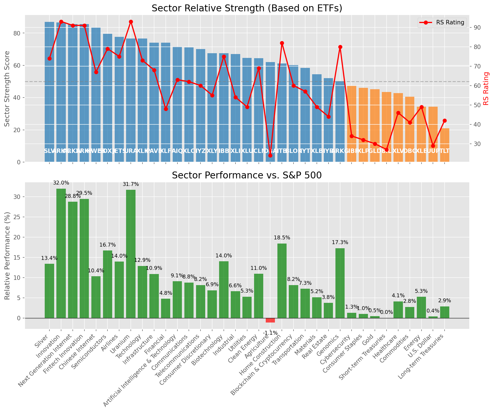

# **Daily Relative Strength Report**

**Date:** 2025-08-21

## **Market Valuation (Buffett Indicator)**

| Metric | Value |
|--------|-------|
| **Market Valuation** | **Overvalued** |
| **Current Ratio** | 10.32 |
| **Historical Mean** | 9.86 |
| **Standard Deviation** | 0.42 |
| **Z-Score (StdDev from Mean)** | 1.17 |
| **Total Market Cap** | $313.01 trillion |
| **GDP** | $30.33 trillion |

## **Market Insights**

### **Market is Overvalued**

The market appears to be trading above historical average valuations. While not at extreme levels, this suggests more modest future returns may be expected. Investors should:

- Focus on companies with reasonable valuations relative to their growth
- Be more selective with new positions
- Look for stocks showing relative strength within their sectors
- Consider trimming positions in extremely overvalued names

Historically, periods of mild overvaluation can persist for extended periods, but returns tend to be below average.

### **Buffett Indicator Overview**

The Buffett Indicator (Total Market Cap / GDP) is a measure of the stock market's valuation relative to the size of the economy. It is named after Warren Buffett, who described it as "probably the best single measure of where valuations stand at any given moment."

- **Values above +2 standard deviations:** Market significantly overvalued
- **Values above +1 standard deviation:** Market overvalued
- **Values between -1 and +1 standard deviations:** Market fairly valued
- **Values below -1 standard deviation:** Market undervalued
- **Values below -2 standard deviations:** Market significantly undervalued

---

## **Sector Relative Strength**

Based on William O'Neil's Relative Strength Methodology

| ETF | Strength | RS Rating | Performance | Above Key MAs | Trend | Sector |
|-----|----------|-----------|-------------|--------------|-------|--------|
| [SLV](https://www.tradingview.com/chart/?symbol=SLV) | 87.0 | 74.0 | 13.31% | 10d ✓, 50d ✓, 200d ✓ | ↗️ | Silver |
| [ARKK](https://www.tradingview.com/chart/?symbol=ARKK) | 86.6 | 93.0 | 32.26% | 10d ✗, 50d ✓, 200d ✓ | ↗️ | Innovation |
| [ARKF](https://www.tradingview.com/chart/?symbol=ARKF) | 86.1 | 92.0 | 29.41% | 10d ✗, 50d ✓, 200d ✓ | ↗️ | Fintech Innovation |
| [ARKW](https://www.tradingview.com/chart/?symbol=ARKW) | 85.6 | 91.0 | 28.80% | 10d ✗, 50d ✓, 200d ✓ | ↗️ | Next Generation Internet |
| [KWEB](https://www.tradingview.com/chart/?symbol=KWEB) | 84.0 | 68.0 | 10.40% | 10d ✓, 50d ✓, 200d ✓ | ↗️ | Chinese Internet |
| [SOXX](https://www.tradingview.com/chart/?symbol=SOXX) | 80.1 | 80.0 | 16.73% | 10d ✗, 50d ✓, 200d ✓ | ↗️ | Semiconductors |
| [JETS](https://www.tradingview.com/chart/?symbol=JETS) | 78.1 | 76.0 | 14.15% | 10d ✗, 50d ✓, 200d ✓ | ↗️ | Airlines |
| [XLK](https://www.tradingview.com/chart/?symbol=XLK) | 76.6 | 73.0 | 12.87% | 10d ✗, 50d ✓, 200d ✓ | ↗️ | Technology |
| [URA](https://www.tradingview.com/chart/?symbol=URA) | 76.2 | 92.0 | 31.09% | 10d ✗, 50d ✗, 200d ✓ | ↗️ | Uranium |
| [PAVE](https://www.tradingview.com/chart/?symbol=PAVE) | 75.1 | 70.0 | 11.10% | 10d ✗, 50d ✓, 200d ✓ | ↗️ | Infrastructure |
| [XLF](https://www.tradingview.com/chart/?symbol=XLF) | 74.0 | 48.0 | 4.79% | 10d ✓, 50d ✓, 200d ✓ | ↗️ | Financial |
| [XLC](https://www.tradingview.com/chart/?symbol=XLC) | 71.1 | 62.0 | 8.65% | 10d ✗, 50d ✓, 200d ✓ | ↗️ | Communications |
| [IYZ](https://www.tradingview.com/chart/?symbol=IYZ) | 70.1 | 60.0 | 8.09% | 10d ✗, 50d ✓, 200d ✓ | ↗️ | Telecommunications |
| [IBB](https://www.tradingview.com/chart/?symbol=IBB) | 68.0 | 76.0 | 14.32% | 10d ✓, 50d ✓, 200d ✓ | ↘️ | Biotechnology |
| [XLI](https://www.tradingview.com/chart/?symbol=XLI) | 67.6 | 55.0 | 6.86% | 10d ✗, 50d ✓, 200d ✓ | ↗️ | Industrial |
| [XLY](https://www.tradingview.com/chart/?symbol=XLY) | 67.6 | 55.0 | 6.75% | 10d ✗, 50d ✓, 200d ✓ | ↗️ | Consumer Discretionary |
| [XLU](https://www.tradingview.com/chart/?symbol=XLU) | 65.1 | 50.0 | 5.50% | 10d ✗, 50d ✓, 200d ✓ | ↗️ | Utilities |
| [ICLN](https://www.tradingview.com/chart/?symbol=ICLN) | 64.5 | 69.0 | 10.88% | 10d ✓, 50d ✓, 200d ✓ | ↘️ | Clean Energy |
| [DBA](https://www.tradingview.com/chart/?symbol=DBA) | 62.0 | 24.0 | -1.26% | 10d ✓, 50d ✓, 200d ✓ | ↗️ | Agriculture |
| [AIQ](https://www.tradingview.com/chart/?symbol=AIQ) | 61.7 | 63.0 | 9.00% | 10d ✗, 50d ✗, 200d ✓ | ↗️ | Artificial Intelligence & Technology |
| [ARKG](https://www.tradingview.com/chart/?symbol=ARKG) | 61.1 | 82.0 | 18.11% | 10d ✓, 50d ✗, 200d ✓ | ↘️ | Genomics |
| [ITB](https://www.tradingview.com/chart/?symbol=ITB) | 61.1 | 82.0 | 18.25% | 10d ✗, 50d ✓, 200d ✓ | ↘️ | Home Construction |
| [BLOK](https://www.tradingview.com/chart/?symbol=BLOK) | 59.7 | 59.0 | 7.77% | 10d ✗, 50d ✗, 200d ✓ | ↗️ | Blockchain & Cryptocurrency |
| [IYT](https://www.tradingview.com/chart/?symbol=IYT) | 58.5 | 57.0 | 7.41% | 10d ✓, 50d ✓, 200d ✓ | ↘️ | Transportation |
| [XLB](https://www.tradingview.com/chart/?symbol=XLB) | 54.5 | 49.0 | 5.27% | 10d ✓, 50d ✓, 200d ✓ | ↘️ | Materials |
| [IYR](https://www.tradingview.com/chart/?symbol=IYR) | 52.5 | 45.0 | 3.74% | 10d ✓, 50d ✓, 200d ✓ | ↘️ | Real Estate |
| [CIBR](https://www.tradingview.com/chart/?symbol=CIBR) | 46.7 | 33.0 | 1.15% | 10d ✗, 50d ✗, 200d ✓ | ↗️ | Cybersecurity |
| [GLD](https://www.tradingview.com/chart/?symbol=GLD) | 45.2 | 30.0 | 0.47% | 10d ✗, 50d ✗, 200d ✓ | ↗️ | Gold |
| [XLE](https://www.tradingview.com/chart/?symbol=XLE) | 44.8 | 50.0 | 5.46% | 10d ✓, 50d ✓, 200d ✗ | ↘️ | Energy |
| [XLV](https://www.tradingview.com/chart/?symbol=XLV) | 43.8 | 48.0 | 4.91% | 10d ✓, 50d ✓, 200d ✗ | ↘️ | Healthcare |
| [BIL](https://www.tradingview.com/chart/?symbol=BIL) | 43.5 | 27.0 | 0.03% | 10d ✓, 50d ✓, 200d ✓ | ↘️ | Short-term Treasuries |
| [DBC](https://www.tradingview.com/chart/?symbol=DBC) | 40.6 | 41.0 | 2.82% | 10d ✓, 50d ✗, 200d ✓ | ↘️ | Commodities |
| [XLP](https://www.tradingview.com/chart/?symbol=XLP) | 36.1 | 32.0 | 0.92% | 10d ✗, 50d ✓, 200d ✓ | ↘️ | Consumer Staples |
| [UUP](https://www.tradingview.com/chart/?symbol=UUP) | 34.3 | 29.0 | 0.33% | 10d ✓, 50d ✓, 200d ✗ | ↘️ | U.S. Dollar |
| [TLT](https://www.tradingview.com/chart/?symbol=TLT) | 21.0 | 42.0 | 2.95% | 10d ✗, 50d ✗, 200d ✗ | ↘️ | Long-term Treasuries |

### **Sector ETF Performance Interpretation**

This table shows the relative strength metrics for different market sectors based on their representative ETFs:

- **ETF**: The ETF used to measure sector performance (click for chart)
- **Strength**: Overall sector strength score (0-100) combining multiple factors
- **RS Rating**: O'Neil RS rating of the sector ETF
- **Performance**: Performance of the sector ETF relative to SPY
- **Above Key MAs**: Whether the ETF is trading above its 10, 50, and 200-day moving averages
- **Trend**: Whether the sector is in an uptrend (↗️) or downtrend (↘️)

### **Current Sector Leadership**

The current market leadership is coming from the following sectors: **Silver, Innovation, Fintech Innovation**.

The **Silver** sector (represented by **SLV**) is showing particularly strong relative strength with an RS rating of 74.0 and performance of 13.31% vs. the S&P 500. This sector is trading above its 10-day, 50-day, 200-day moving average(s). Investors should consider focusing on high RS stocks within these leading sectors for potential outperformance.

---

## **Buy Recommendations**

The following 32 stocks show exceptional relative strength:

| RS Rating | Buy Score | Current Price | Chart | Name | Ticker |
|-----------|-----------|---------------|-------|------|--------|
| 99 | 100 | $61.75 | [Chart](https://www.tradingview.com/chart/?symbol=GH) | Guardant Health, Inc. Common Stock | GH |
| 99 | 100 | $182.32 | [Chart](https://www.tradingview.com/chart/?symbol=FUTU) | Futu Holdings Limited American Depositary Shares | FUTU |
| 99 | 100 | $27.15 | [Chart](https://www.tradingview.com/chart/?symbol=LQDA) | Liquidia Corporation Common Stock | LQDA |
| 97 | 100 | $34.48 | [Chart](https://www.tradingview.com/chart/?symbol=CPS) | Cooper-Standard Automotive Inc. | CPS |
| 96 | 100 | $66.20 | [Chart](https://www.tradingview.com/chart/?symbol=MRCY) | Mercury Systems Inc. | MRCY |
| 96 | 100 | $85.40 | [Chart](https://www.tradingview.com/chart/?symbol=LIF) | Life360, Inc. Common Stock | LIF |
| 95 | 100 | $100.33 | [Chart](https://www.tradingview.com/chart/?symbol=TPB) | Turning Point Brands, Inc. | TPB |
| 94 | 100 | $31.41 | [Chart](https://www.tradingview.com/chart/?symbol=SRAD) | Sportradar Group AG Class A Ordinary Shares | SRAD |
| 94 | 100 | $322.91 | [Chart](https://www.tradingview.com/chart/?symbol=RCL) | Royal Caribbean Group | RCL |
| 93 | 100 | $59.20 | [Chart](https://www.tradingview.com/chart/?symbol=BTI) | British American Tobacco p.l.c. American Depositary Shares, American Depositary Shares, each representing one Ordinary Share | BTI |
| 93 | 100 | $75.30 | [Chart](https://www.tradingview.com/chart/?symbol=WNS) | WNS (Holdings) Limited | WNS |
| 93 | 100 | $23.70 | [Chart](https://www.tradingview.com/chart/?symbol=BZ) | KANZHUN LIMITED American Depository Shares | BZ |
| 93 | 100 | $31.84 | [Chart](https://www.tradingview.com/chart/?symbol=PAAS) | Pan American Silver Corp. | PAAS |
| 91 | 100 | $36.66 | [Chart](https://www.tradingview.com/chart/?symbol=DB) | Deutsche Bank Aktiengesellschaft | DB |
| 91 | 100 | $23.87 | [Chart](https://www.tradingview.com/chart/?symbol=EYE) | National Vision Holdings, Inc. Common Stock | EYE |
| 90 | 100 | $50.23 | [Chart](https://www.tradingview.com/chart/?symbol=RING) | iShares MSCI Global Gold Miners ETF | RING |
| 89 | 100 | $45.66 | [Chart](https://www.tradingview.com/chart/?symbol=LTM) | LATAM Airlines Group S.A. American Depositary Shares (each representing two thousand (2,000) shares of Common Stock) | LTM |
| 88 | 100 | $42.45 | [Chart](https://www.tradingview.com/chart/?symbol=AHR) | American Healthcare REIT, Inc. | AHR |
| 88 | 99 | $23.21 | [Chart](https://www.tradingview.com/chart/?symbol=MAG) | MAG Silver Corp. | MAG |
| 88 | 98 | $123.47 | [Chart](https://www.tradingview.com/chart/?symbol=PPLT) | abrdn Physical Platinum Shares ETF | PPLT |
| 88 | 98 | $52.76 | [Chart](https://www.tradingview.com/chart/?symbol=FHI) | Federated Hermes, Inc. | FHI |
| 86 | 98 | $433.23 | [Chart](https://www.tradingview.com/chart/?symbol=CYBR) | CyberArk Software Ltd. | CYBR |
| 86 | 98 | $93.56 | [Chart](https://www.tradingview.com/chart/?symbol=LLYVK) | Liberty Media Corporation Series C Liberty Live Common Stock | LLYVK |
| 85 | 98 | $26.34 | [Chart](https://www.tradingview.com/chart/?symbol=LAUR) | Laureate Education, Inc. Common Stock | LAUR |
| 87 | 97 | $112.81 | [Chart](https://www.tradingview.com/chart/?symbol=AZZ) | AZZ Inc. | AZZ |
| 87 | 97 | $18.43 | [Chart](https://www.tradingview.com/chart/?symbol=BVN) | Compania de Minas Buenaventura S.A. | BVN |
| 86 | 96 | $193.90 | [Chart](https://www.tradingview.com/chart/?symbol=AWI) | Armstrong World Industries, Inc. | AWI |
| 83 | 96 | $165.94 | [Chart](https://www.tradingview.com/chart/?symbol=IRTC) | iRhythm Technologies, Inc | IRTC |
| 81 | 94 | $135.66 | [Chart](https://www.tradingview.com/chart/?symbol=AEM) | Agnico Eagle Mines Ltd. | AEM |
| 83 | 93 | $18.73 | [Chart](https://www.tradingview.com/chart/?symbol=DAN) | Dana Incorporated | DAN |
| 81 | 93 | $35.96 | [Chart](https://www.tradingview.com/chart/?symbol=ATRO) | Astronics Corp | ATRO |
| 82 | 92 | $15.88 | [Chart](https://www.tradingview.com/chart/?symbol=EZPW) | Ezcorp Inc | EZPW |

---

## **Sell Recommendations**

The following 169 stocks show deteriorating relative strength:

| RS Rating | Sell Score | Current Price | Chart | Name | Ticker |
|-----------|------------|---------------|-------|------|--------|
| 1 | 100 | $15.29 | [Chart](https://www.tradingview.com/chart/?symbol=KRNT) | Kornit Digital Ltd. | KRNT |
| 2 | 100 | $21.20 | [Chart](https://www.tradingview.com/chart/?symbol=CLW) | Clearwater Paper Corporation | CLW |
| 2 | 100 | $25.22 | [Chart](https://www.tradingview.com/chart/?symbol=TECS) | Direxion Daily Technology Bear 3x Shares | TECS |
| 2 | 100 | $38.11 | [Chart](https://www.tradingview.com/chart/?symbol=VIXY) | ProShares VIX Short-Term Futures ETF | VIXY |
| 2 | 100 | $65.57 | [Chart](https://www.tradingview.com/chart/?symbol=BMA) | Banco Macro S.A. | BMA |
| 2 | 100 | $11.45 | [Chart](https://www.tradingview.com/chart/?symbol=ACVA) | ACV Auctions Inc. | ACVA |
| 2 | 100 | $17.27 | [Chart](https://www.tradingview.com/chart/?symbol=DJT) | Trump Media & Technology Group Corp. Common Stock | DJT |
| 2 | 100 | $23.05 | [Chart](https://www.tradingview.com/chart/?symbol=ZSL) | ProShares UltraShort Silver | ZSL |
| 2 | 100 | $32.83 | [Chart](https://www.tradingview.com/chart/?symbol=IOT) | Samsara Inc. | IOT |
| 3 | 100 | $25.49 | [Chart](https://www.tradingview.com/chart/?symbol=BRZE) | Braze, Inc. Class A Common Stock | BRZE |
| 4 | 100 | $25.22 | [Chart](https://www.tradingview.com/chart/?symbol=CRI) | Carter's Inc. | CRI |
| 4 | 100 | $40.10 | [Chart](https://www.tradingview.com/chart/?symbol=VIST) | Vista Energy S.A.B. de C.V. | VIST |
| 5 | 100 | $15.49 | [Chart](https://www.tradingview.com/chart/?symbol=TSLT) | T-REX 2X Long Tesla Daily Target ETF | TSLT |
| 5 | 100 | $39.95 | [Chart](https://www.tradingview.com/chart/?symbol=SDOW) | ProShares UltraPro Short Dow 30 | SDOW |
| 6 | 100 | $25.59 | [Chart](https://www.tradingview.com/chart/?symbol=TBBB) | BBB Foods Inc. | TBBB |
| 7 | 100 | $23.25 | [Chart](https://www.tradingview.com/chart/?symbol=EPC) | Edgewell Personal Care Company | EPC |
| 7 | 100 | $39.65 | [Chart](https://www.tradingview.com/chart/?symbol=TWM) | ProShares UltraShort Russell2000 | TWM |
| 7 | 100 | $16.54 | [Chart](https://www.tradingview.com/chart/?symbol=S) | SentinelOne, Inc. | S |
| 7 | 100 | $13.96 | [Chart](https://www.tradingview.com/chart/?symbol=CMCO) | Columbus McKinnon Corp/NY | CMCO |
| 8 | 100 | $56.77 | [Chart](https://www.tradingview.com/chart/?symbol=ATKR) | Atkore Inc. | ATKR |
| 10 | 100 | $31.62 | [Chart](https://www.tradingview.com/chart/?symbol=TECK) | Teck Resources Limited | TECK |
| 10 | 100 | $12.08 | [Chart](https://www.tradingview.com/chart/?symbol=BSM) | Black Stone Minerals, L.P. | BSM |
| 12 | 100 | $29.15 | [Chart](https://www.tradingview.com/chart/?symbol=MGPI) | MGP Ingredients Inc | MGPI |
| 12 | 100 | $11.27 | [Chart](https://www.tradingview.com/chart/?symbol=CHPT) | ChargePoint Holdings, Inc. | CHPT |
| 13 | 100 | $14.79 | [Chart](https://www.tradingview.com/chart/?symbol=CHCT) | Community Healthcare Trust Incorporated Common Stock, $0.01 par value per share | CHCT |
| 13 | 100 | $38.95 | [Chart](https://www.tradingview.com/chart/?symbol=SH) | ProShares Short S&P500 | SH |
| 14 | 100 | $39.89 | [Chart](https://www.tradingview.com/chart/?symbol=WLY) | John Wiley & Sons, Inc. Class A | WLY |
| 14 | 100 | $17.05 | [Chart](https://www.tradingview.com/chart/?symbol=SVOL) | Simplify Volatility Premium ETF | SVOL |
| 14 | 100 | $18.02 | [Chart](https://www.tradingview.com/chart/?symbol=EBF) | Ennis, Inc. | EBF |
| 15 | 100 | $107.94 | [Chart](https://www.tradingview.com/chart/?symbol=CPT) | Camden Property Trust | CPT |
| 15 | 100 | $16.59 | [Chart](https://www.tradingview.com/chart/?symbol=CTO) | CTO Realty Growth, Inc. | CTO |
| 16 | 100 | $31.84 | [Chart](https://www.tradingview.com/chart/?symbol=PCVX) | Vaxcyte, Inc. Common Stock | PCVX |
| 10 | 99 | $10.93 | [Chart](https://www.tradingview.com/chart/?symbol=PATH) | UiPath, Inc. | PATH |
| 17 | 99 | $38.63 | [Chart](https://www.tradingview.com/chart/?symbol=UDR) | UDR, Inc. | UDR |
| 19 | 99 | $14.64 | [Chart](https://www.tradingview.com/chart/?symbol=RXO) | RXO, Inc. | RXO |
| 3 | 98 | $16.75 | [Chart](https://www.tradingview.com/chart/?symbol=AI) | C3.ai, Inc. | AI |
| 7 | 98 | $77.79 | [Chart](https://www.tradingview.com/chart/?symbol=ESTC) | Elastic N.V. | ESTC |
| 9 | 98 | $26.08 | [Chart](https://www.tradingview.com/chart/?symbol=QDEL) | QuidelOrtho Corporation Common Stock | QDEL |
| 9 | 98 | $107.30 | [Chart](https://www.tradingview.com/chart/?symbol=ITGR) | Integer Holdings Corporation | ITGR |
| 10 | 98 | $94.16 | [Chart](https://www.tradingview.com/chart/?symbol=CNI) | Canadian National Railway | CNI |
| 10 | 98 | $769.00 | [Chart](https://www.tradingview.com/chart/?symbol=EQIX) | Equinix, Inc. Common Stock REIT | EQIX |
| 11 | 98 | $165.72 | [Chart](https://www.tradingview.com/chart/?symbol=EPAM) | EPAM SYSTEMS, INC. | EPAM |
| 13 | 98 | $10.20 | [Chart](https://www.tradingview.com/chart/?symbol=OEC) | Orion S.A. | OEC |
| 14 | 98 | $17.16 | [Chart](https://www.tradingview.com/chart/?symbol=IRT) | Independence Realty Trust Inc. | IRT |
| 17 | 98 | $10.00 | [Chart](https://www.tradingview.com/chart/?symbol=NMZ) | Nuveen Municipal High Income Opportunity Fund | NMZ |
| 10 | 97 | $21.46 | [Chart](https://www.tradingview.com/chart/?symbol=KVUE) | Kenvue Inc. | KVUE |
| 12 | 97 | $36.42 | [Chart](https://www.tradingview.com/chart/?symbol=APGE) | Apogee Therapeutics, Inc. Common Stock | APGE |
| 12 | 97 | $74.16 | [Chart](https://www.tradingview.com/chart/?symbol=OKE) | Oneok, Inc. | OKE |
| 13 | 97 | $10.51 | [Chart](https://www.tradingview.com/chart/?symbol=CLB) | Core Laboratories Inc. | CLB |
| 14 | 97 | $21.27 | [Chart](https://www.tradingview.com/chart/?symbol=DIN) | Dine Brands Global, Inc. | DIN |
| 14 | 97 | $19.27 | [Chart](https://www.tradingview.com/chart/?symbol=AVBP) | ArriVent BioPharma, Inc. Common Stock | AVBP |
| 7 | 96 | $29.34 | [Chart](https://www.tradingview.com/chart/?symbol=SMPL) | The Simply Good Foods Company Common Stock | SMPL |
| 11 | 96 | $15.17 | [Chart](https://www.tradingview.com/chart/?symbol=MCS) | The Marcus Corporation | MCS |
| 17 | 96 | $191.16 | [Chart](https://www.tradingview.com/chart/?symbol=AVB) | AvalonBay Communities, Inc. | AVB |
| 5 | 95 | $30.98 | [Chart](https://www.tradingview.com/chart/?symbol=YELP) | YELP INC. | YELP |
| 10 | 95 | $28.57 | [Chart](https://www.tradingview.com/chart/?symbol=CNX) | CNX Resources Corporation | CNX |
| 15 | 95 | $90.03 | [Chart](https://www.tradingview.com/chart/?symbol=IRM) | Iron Mountain Inc. | IRM |
| 15 | 95 | $140.29 | [Chart](https://www.tradingview.com/chart/?symbol=OLED) | Universal Display Corp | OLED |
| 6 | 94 | $10.98 | [Chart](https://www.tradingview.com/chart/?symbol=CEPU) | Central Puerto S.A. American Depositary Shares (each represents ten Common Shares) | CEPU |
| 13 | 94 | $18.00 | [Chart](https://www.tradingview.com/chart/?symbol=LOVE) | The Lovesac Company Common Stock | LOVE |
| 13 | 94 | $33.29 | [Chart](https://www.tradingview.com/chart/?symbol=PSQ) | ProShares Short QQQ | PSQ |
| 14 | 94 | $149.50 | [Chart](https://www.tradingview.com/chart/?symbol=HLNE) | Hamilton Lane Incorporated Class A Common Stock | HLNE |
| 15 | 94 | $10.12 | [Chart](https://www.tradingview.com/chart/?symbol=SPDN) | Direxion Daily S&P 500 Bear 1X Shares | SPDN |
| 16 | 94 | $25.91 | [Chart](https://www.tradingview.com/chart/?symbol=FCPT) | Four Corners Property Trust, Inc. | FCPT |
| 20 | 94 | $22.34 | [Chart](https://www.tradingview.com/chart/?symbol=CURB) | Curbline Properties Corp. | CURB |
| 21 | 93 | $286.43 | [Chart](https://www.tradingview.com/chart/?symbol=PSA) | Public Storage | PSA |
| 25 | 93 | $47.15 | [Chart](https://www.tradingview.com/chart/?symbol=EDU) | New Oriental Education and Technology Group, Inc. American Depositary Shares (each representing ten (10) Common Shares) | EDU |
| 11 | 92 | $87.12 | [Chart](https://www.tradingview.com/chart/?symbol=MMSI) | Merit Medical Systems Inc | MMSI |
| 11 | 92 | $64.37 | [Chart](https://www.tradingview.com/chart/?symbol=CBZ) | CBIZ, Inc. | CBZ |
| 13 | 92 | $28.47 | [Chart](https://www.tradingview.com/chart/?symbol=AMAL) | Amalgamated Financial Corp. Common Stock (DE) | AMAL |
| 14 | 92 | $102.55 | [Chart](https://www.tradingview.com/chart/?symbol=MATX) | Matsons, Inc. | MATX |
| 15 | 92 | $19.48 | [Chart](https://www.tradingview.com/chart/?symbol=KIDS) | OrthoPediatrics Corp. Common Stock | KIDS |
| 16 | 92 | $67.36 | [Chart](https://www.tradingview.com/chart/?symbol=PYPL) | PayPal Holdings, Inc. Common Stock | PYPL |
| 16 | 92 | $29.32 | [Chart](https://www.tradingview.com/chart/?symbol=BBWI) | Bath & Body Works, Inc. | BBWI |
| 19 | 92 | $39.51 | [Chart](https://www.tradingview.com/chart/?symbol=WHD) | Cactus, Inc. | WHD |
| 19 | 92 | $14.37 | [Chart](https://www.tradingview.com/chart/?symbol=VRE) | Veris Residential, Inc. | VRE |
| 22 | 92 | $10.38 | [Chart](https://www.tradingview.com/chart/?symbol=MYI) | BLACKROCK MUNIYIELD QUALITY FUND III, INC. | MYI |
| 12 | 91 | $141.21 | [Chart](https://www.tradingview.com/chart/?symbol=MAA) | Mid-America Apartment Communities, Inc. | MAA |
| 15 | 91 | $85.66 | [Chart](https://www.tradingview.com/chart/?symbol=CL) | Colgate-Palmolive Company | CL |
| 16 | 91 | $25.28 | [Chart](https://www.tradingview.com/chart/?symbol=DOG) | ProShares Short Dow30 | DOG |
| 17 | 91 | $68.39 | [Chart](https://www.tradingview.com/chart/?symbol=HSIC) | Henry Schein Inc | HSIC |
| 17 | 91 | $11.50 | [Chart](https://www.tradingview.com/chart/?symbol=BCAX) | Bicara Therapeutics Inc. Common Stock | BCAX |
| 22 | 91 | $31.86 | [Chart](https://www.tradingview.com/chart/?symbol=MBIN) | Merchants Bancorp Common Stock | MBIN |
| 12 | 90 | $30.57 | [Chart](https://www.tradingview.com/chart/?symbol=INVH) | Invitation Homes Inc. Common Stock | INVH |
| 17 | 90 | $10.72 | [Chart](https://www.tradingview.com/chart/?symbol=LBRT) | Liberty Energy Inc. | LBRT |
| 21 | 90 | $10.91 | [Chart](https://www.tradingview.com/chart/?symbol=MQY) | Blackrock Muni Yield Quality Fund, Inc | MQY |
| 21 | 90 | $10.11 | [Chart](https://www.tradingview.com/chart/?symbol=MUC) | BLACKROCK MUNIHOLDINGS CALIFORNIA QUALITY FUND, INC | MUC |
| 29 | 90 | $11.74 | [Chart](https://www.tradingview.com/chart/?symbol=NZF) | Nuveen Municipal Credit Income Fund | NZF |
| 12 | 89 | $48.77 | [Chart](https://www.tradingview.com/chart/?symbol=DT) | Dynatrace, Inc. | DT |
| 15 | 89 | $13.55 | [Chart](https://www.tradingview.com/chart/?symbol=MNR) | Mach Natural Resources LP Common Units representing Limited Partner Interests | MNR |
| 16 | 89 | $25.60 | [Chart](https://www.tradingview.com/chart/?symbol=WKC) | World Kinect Corporation | WKC |
| 20 | 89 | $13.66 | [Chart](https://www.tradingview.com/chart/?symbol=OCSL) | Oaktree Specialty Lending Corporation | OCSL |
| 23 | 89 | $24.12 | [Chart](https://www.tradingview.com/chart/?symbol=HYMB) | SPDR Nuveen ICE High Yield Municipal Bond ETF | HYMB |
| 24 | 89 | $25.86 | [Chart](https://www.tradingview.com/chart/?symbol=CGON) | CG Oncology, Inc. Common stock | CGON |
| 14 | 88 | $31.20 | [Chart](https://www.tradingview.com/chart/?symbol=JD) | JD.com, Inc. | JD |
| 14 | 88 | $35.19 | [Chart](https://www.tradingview.com/chart/?symbol=AMH) | AMERICAN HOMES 4 RENT | AMH |
| 14 | 88 | $127.81 | [Chart](https://www.tradingview.com/chart/?symbol=INGR) | Ingredion Incorporated | INGR |
| 17 | 88 | $75.26 | [Chart](https://www.tradingview.com/chart/?symbol=AWR) | American States Water Company | AWR |
| 20 | 88 | $40.04 | [Chart](https://www.tradingview.com/chart/?symbol=CUBE) | CubeSmart | CUBE |
| 20 | 88 | $80.91 | [Chart](https://www.tradingview.com/chart/?symbol=AGO) | Assured Guaranty, LTD | AGO |
| 23 | 88 | $11.55 | [Chart](https://www.tradingview.com/chart/?symbol=NVG) | Nuveen AMT-Free Municipal Credit Income Fund | NVG |
| 17 | 87 | $219.84 | [Chart](https://www.tradingview.com/chart/?symbol=SBAC) | SBA Communications Corp | SBAC |
| 19 | 87 | $77.89 | [Chart](https://www.tradingview.com/chart/?symbol=IR) | Ingersoll Rand Inc. Common Stock | IR |
| 26 | 87 | $21.25 | [Chart](https://www.tradingview.com/chart/?symbol=LGOV) | First Trust Long Duration Opportunities ETF | LGOV |
| 20 | 86 | $14.12 | [Chart](https://www.tradingview.com/chart/?symbol=BMEZ) | BlackRock Health Sciences Term Trust | BMEZ |
| 22 | 86 | $118.43 | [Chart](https://www.tradingview.com/chart/?symbol=TMDX) | TransMedics Group, Inc. Common Stock | TMDX |
| 22 | 86 | $10.36 | [Chart](https://www.tradingview.com/chart/?symbol=NMFC) | NEW MOUNTAIN FINANCE CORPORATION | NMFC |
| 19 | 85 | $247.70 | [Chart](https://www.tradingview.com/chart/?symbol=EFX) | Equifax, Incorporated | EFX |
| 20 | 85 | $62.88 | [Chart](https://www.tradingview.com/chart/?symbol=MDLZ) | Mondelez International, Inc. Class A | MDLZ |
| 20 | 85 | $164.90 | [Chart](https://www.tradingview.com/chart/?symbol=EGP) | EastGroup Properties Inc. | EGP |
| 21 | 85 | $309.63 | [Chart](https://www.tradingview.com/chart/?symbol=LAD) | Lithia Motors, Inc. | LAD |
| 22 | 85 | $13.65 | [Chart](https://www.tradingview.com/chart/?symbol=MED) | Medifast, Inc. | MED |
| 23 | 85 | $14.61 | [Chart](https://www.tradingview.com/chart/?symbol=GBDC) | Golub Capital BDC, Inc. | GBDC |
| 25 | 85 | $14.51 | [Chart](https://www.tradingview.com/chart/?symbol=VTLE) | Vital Energy, Inc. | VTLE |
| 20 | 84 | $11.97 | [Chart](https://www.tradingview.com/chart/?symbol=PMT) | PennyMac Mortgage Investment Trust | PMT |
| 23 | 84 | $30.13 | [Chart](https://www.tradingview.com/chart/?symbol=CNQ) | Canadian Natural Resources Limited | CNQ |
| 25 | 84 | $72.88 | [Chart](https://www.tradingview.com/chart/?symbol=NUVL) | Nuvalent, Inc. Class A Common Stock | NUVL |
| 26 | 84 | $735.08 | [Chart](https://www.tradingview.com/chart/?symbol=ASML) | ASML Holding NV | ASML |
| 27 | 84 | $33.72 | [Chart](https://www.tradingview.com/chart/?symbol=MEOH) | Methanex Corp | MEOH |
| 29 | 84 | $20.84 | [Chart](https://www.tradingview.com/chart/?symbol=BKLN) | Invesco Senior Loan ETF | BKLN |
| 21 | 83 | $36.12 | [Chart](https://www.tradingview.com/chart/?symbol=VNO) | Vornado Realty Trust | VNO |
| 23 | 83 | $138.20 | [Chart](https://www.tradingview.com/chart/?symbol=DVA) | DaVita Inc. | DVA |
| 25 | 83 | $11.12 | [Chart](https://www.tradingview.com/chart/?symbol=PBR.A) | Petroleo Brasileiro S.A.-Petrobras | PBR.A |
| 27 | 83 | $24.09 | [Chart](https://www.tradingview.com/chart/?symbol=FLMI) | Franklin Dynamic Municipal Bond ETF | FLMI |
| 30 | 83 | $10.80 | [Chart](https://www.tradingview.com/chart/?symbol=NEA) | Nuveen AMT-Free Quality Municipal Income Fund | NEA |
| 23 | 82 | $45.30 | [Chart](https://www.tradingview.com/chart/?symbol=EPI) | WisdomTree India Earnings Fund ETF | EPI |
| 25 | 82 | $14.05 | [Chart](https://www.tradingview.com/chart/?symbol=BAND) | Bandwidth Inc. Class A Common Stock | BAND |
| 28 | 82 | $33.94 | [Chart](https://www.tradingview.com/chart/?symbol=SLB) | Schlumberger Limited | SLB |
| 33 | 82 | $11.18 | [Chart](https://www.tradingview.com/chart/?symbol=NAD) | Nuveen Quality Municipal Income Fund | NAD |
| 34 | 82 | $22.20 | [Chart](https://www.tradingview.com/chart/?symbol=SIRI) | Sirius XM Holdings,  Inc | SIRI |
| 24 | 81 | $44.37 | [Chart](https://www.tradingview.com/chart/?symbol=FIZZ) | National Beverage Corp. | FIZZ |
| 26 | 81 | $177.79 | [Chart](https://www.tradingview.com/chart/?symbol=DOV) | Dover Corporation | DOV |
| 29 | 81 | $120.59 | [Chart](https://www.tradingview.com/chart/?symbol=RGEN) | Repligen Corp | RGEN |
| 23 | 80 | $19.20 | [Chart](https://www.tradingview.com/chart/?symbol=INGM) | Ingram Micro Holding Corporation | INGM |
| 26 | 79 | $25.43 | [Chart](https://www.tradingview.com/chart/?symbol=FIVN) | FIVE9, INC. | FIVN |
| 32 | 79 | $10.47 | [Chart](https://www.tradingview.com/chart/?symbol=DSU) | Blackrock Debt Strategies Fund, Inc. | DSU |
| 23 | 78 | $209.78 | [Chart](https://www.tradingview.com/chart/?symbol=AMT) | American Tower Corporation | AMT |
| 31 | 78 | $11.99 | [Chart](https://www.tradingview.com/chart/?symbol=PBR) | PETROLEO BRASILEIRO S.A.-PETROBRAS ADS (REP 1 COMMON SHARE) | PBR |
| 35 | 78 | $24.83 | [Chart](https://www.tradingview.com/chart/?symbol=UCON) | First Trust Smith Unconstrained Bond ETF | UCON |
| 34 | 77 | $12.32 | [Chart](https://www.tradingview.com/chart/?symbol=RQI) | COHEN & STEERS QUALITY INCOME REALTY FUND, INC. COMMON SHARES | RQI |
| 34 | 77 | $19.30 | [Chart](https://www.tradingview.com/chart/?symbol=CVBF) | CVB Financial Corp | CVBF |
| 38 | 77 | $43.65 | [Chart](https://www.tradingview.com/chart/?symbol=FIXD) | First Trust Exchange-Traded Fund VIII First Trust Smith Opportunistic Fixed Income ETF | FIXD |
| 26 | 76 | $17.33 | [Chart](https://www.tradingview.com/chart/?symbol=OCFC) | OceanFirst Financial Corp | OCFC |
| 26 | 75 | $23.04 | [Chart](https://www.tradingview.com/chart/?symbol=BSJP) | Invesco BulletShares 2025 High Yield Corporate Bond ETF | BSJP |
| 34 | 75 | $132.27 | [Chart](https://www.tradingview.com/chart/?symbol=ARM) | Arm Holdings plc American Depositary Shares | ARM |
| 34 | 75 | $23.95 | [Chart](https://www.tradingview.com/chart/?symbol=UPBD) | Upbound Group, Inc. Common Stock | UPBD |
| 37 | 75 | $138.78 | [Chart](https://www.tradingview.com/chart/?symbol=FANG) | Diamondback Energy, Inc. | FANG |
| 38 | 75 | $12.45 | [Chart](https://www.tradingview.com/chart/?symbol=NOV) | NOV Inc. | NOV |
| 29 | 74 | $84.83 | [Chart](https://www.tradingview.com/chart/?symbol=GGG) | Graco Inc | GGG |
| 31 | 74 | $37.46 | [Chart](https://www.tradingview.com/chart/?symbol=STBA) | S&T Bancorp Inc | STBA |
| 31 | 74 | $111.97 | [Chart](https://www.tradingview.com/chart/?symbol=PPG) | PPG Industries, Inc. | PPG |
| 31 | 74 | $14.41 | [Chart](https://www.tradingview.com/chart/?symbol=RDY) | Dr. Reddy's Laboratories Limited American Depositary Shares | RDY |
| 33 | 74 | $162.22 | [Chart](https://www.tradingview.com/chart/?symbol=TRGP) | Targa Resources Corp. | TRGP |
| 30 | 73 | $10.62 | [Chart](https://www.tradingview.com/chart/?symbol=BRKL) | Brookline Bancorp Inc | BRKL |
| 39 | 73 | $14.61 | [Chart](https://www.tradingview.com/chart/?symbol=VSH) | Vishay Intertechnology, Inc. | VSH |
| 32 | 72 | $13.08 | [Chart](https://www.tradingview.com/chart/?symbol=NAVI) | Navient Corporation | NAVI |
| 33 | 72 | $19.08 | [Chart](https://www.tradingview.com/chart/?symbol=FSIG) | First Trust Limited Duration Investment Grade Corporate ETF | FSIG |
| 34 | 72 | $25.35 | [Chart](https://www.tradingview.com/chart/?symbol=SJNK) | SPDR Bloomberg Short Term High Yield Bond ETF | SJNK |
| 36 | 72 | $39.30 | [Chart](https://www.tradingview.com/chart/?symbol=NMIH) | NMI Holdings Inc. Common Stock | NMIH |
| 36 | 72 | $153.88 | [Chart](https://www.tradingview.com/chart/?symbol=QCOM) | Qualcomm Inc | QCOM |
| 32 | 71 | $49.20 | [Chart](https://www.tradingview.com/chart/?symbol=BNDX) | Vanguard Total International Bond ETF | BNDX |
| 38 | 69 | $32.13 | [Chart](https://www.tradingview.com/chart/?symbol=DAR) | DARLING INGREDIENTS INC. | DAR |
| 39 | 69 | $25.77 | [Chart](https://www.tradingview.com/chart/?symbol=WY) | Weyerhaeuser Company | WY |
| 33 | 68 | $24.12 | [Chart](https://www.tradingview.com/chart/?symbol=FLBL) | Franklin Senior Loan ETF | FLBL |
| 34 | 67 | $102.73 | [Chart](https://www.tradingview.com/chart/?symbol=CCI) | Crown Castle Inc. | CCI |
| 38 | 67 | $41.65 | [Chart](https://www.tradingview.com/chart/?symbol=XLRE) | Real Estate Select Sector SPDR Fund | XLRE |
| 38 | 67 | $66.34 | [Chart](https://www.tradingview.com/chart/?symbol=BXP) | BXP, Inc. | BXP |
| 38 | 65 | $13.12 | [Chart](https://www.tradingview.com/chart/?symbol=PDBC) | Invesco Actively Managed Exch-Traded Commodity Fd Tr Invesco Optimum Yield Diversified Commodity Strategy No K-1 ETF | PDBC |
| 39 | 63 | $45.84 | [Chart](https://www.tradingview.com/chart/?symbol=GBX) | The Greenbrier Companies, Inc. | GBX |

## **Methodology**

This report uses William O'Neil's relative strength methodology from Investors Business Daily:

* **RS Rating**: Percentile rank of stock's performance vs. S&P 500 over the past 63 trading days (1-99 scale)
* **Buy Criteria**: RS Rating >= 80, price above 50-day MA, strong uptrend, increasing volume
* **Sell Criteria**: RS Rating < 40, price below 50-day MA, downtrend, decreasing volume

### **O'Neil's Key Principles**

1. **Focus on relative performance** - stocks outperforming the market
2. **Price trend confirmation** - stock must be in an uptrend
3. **Volume confirmation** - strong volume supports price moves
4. **Moving average validation** - price above key moving averages
5. **Market leaders only** - concentrate on top-performing stocks

*Report generated automatically after market close*