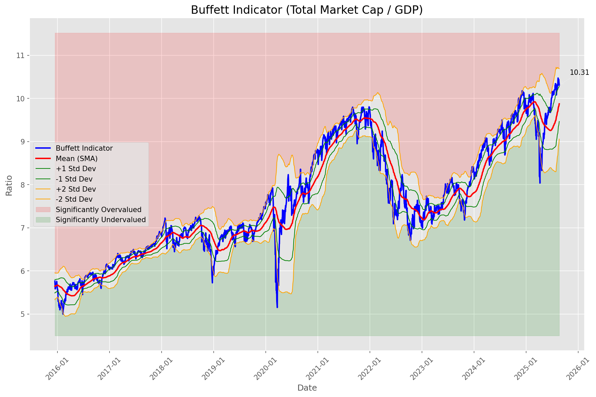
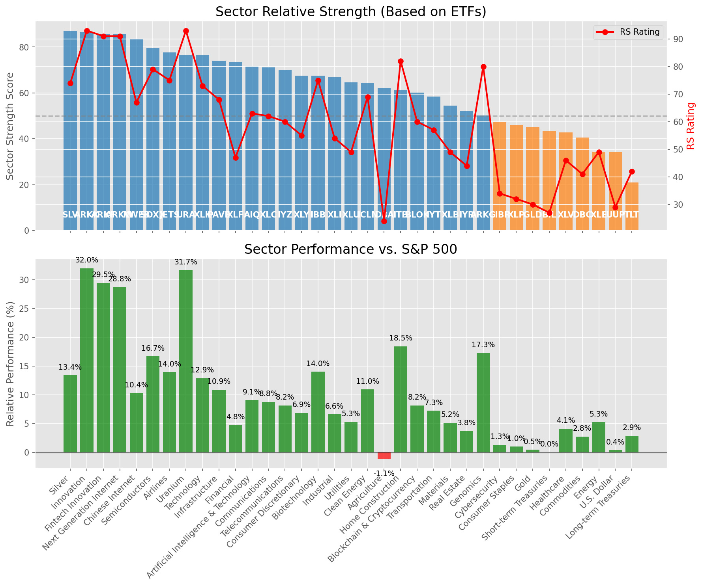

# **Daily Relative Strength Report**

**Date:** 2025-08-22

## **Market Valuation (Buffett Indicator)**

| Metric | Value |
|--------|-------|
| **Market Valuation** | **Overvalued** |
| **Current Ratio** | 10.49 |
| **Historical Mean** | 9.87 |
| **Standard Deviation** | 0.41 |
| **Z-Score (StdDev from Mean)** | 1.07 |
| **Total Market Cap** | $318.11 trillion |
| **GDP** | $30.33 trillion |

## **Market Insights**

### **Market is Overvalued**

The market appears to be trading above historical average valuations. While not at extreme levels, this suggests more modest future returns may be expected. Investors should:

- Focus on companies with reasonable valuations relative to their growth
- Be more selective with new positions
- Look for stocks showing relative strength within their sectors
- Consider trimming positions in extremely overvalued names

Historically, periods of mild overvaluation can persist for extended periods, but returns tend to be below average.

### **Buffett Indicator Overview**

The Buffett Indicator (Total Market Cap / GDP) is a measure of the stock market's valuation relative to the size of the economy. It is named after Warren Buffett, who described it as "probably the best single measure of where valuations stand at any given moment."

- **Values above +2 standard deviations:** Market significantly overvalued
- **Values above +1 standard deviation:** Market overvalued
- **Values between -1 and +1 standard deviations:** Market fairly valued
- **Values below -1 standard deviation:** Market undervalued
- **Values below -2 standard deviations:** Market significantly undervalued

---

## **Sector Relative Strength**

Based on William O'Neil's Relative Strength Methodology

| ETF | Strength | RS Rating | Performance | Above Key MAs | Trend | Sector |
|-----|----------|-----------|-------------|--------------|-------|--------|
| [URA](https://www.tradingview.com/chart/?symbol=URA) | 96.5 | 93.0 | 36.81% | 10d ✓, 50d ✓, 200d ✓ | ↗️ | Uranium |
| [ARKK](https://www.tradingview.com/chart/?symbol=ARKK) | 96.5 | 93.0 | 36.06% | 10d ✓, 50d ✓, 200d ✓ | ↗️ | Innovation |
| [ARKF](https://www.tradingview.com/chart/?symbol=ARKF) | 95.5 | 91.0 | 32.87% | 10d ✓, 50d ✓, 200d ✓ | ↗️ | Fintech Innovation |
| [SOXX](https://www.tradingview.com/chart/?symbol=SOXX) | 90.5 | 81.0 | 21.49% | 10d ✓, 50d ✓, 200d ✓ | ↗️ | Semiconductors |
| [JETS](https://www.tradingview.com/chart/?symbol=JETS) | 88.0 | 76.0 | 17.96% | 10d ✓, 50d ✓, 200d ✓ | ↗️ | Airlines |
| [SLV](https://www.tradingview.com/chart/?symbol=SLV) | 87.5 | 75.0 | 17.83% | 10d ✓, 50d ✓, 200d ✓ | ↗️ | Silver |
| [BLOK](https://www.tradingview.com/chart/?symbol=BLOK) | 87.5 | 75.0 | 17.48% | 10d ✓, 50d ✓, 200d ✓ | ↗️ | Blockchain & Cryptocurrency |
| [ARKW](https://www.tradingview.com/chart/?symbol=ARKW) | 85.1 | 90.0 | 31.80% | 10d ✗, 50d ✓, 200d ✓ | ↗️ | Next Generation Internet |
| [PAVE](https://www.tradingview.com/chart/?symbol=PAVE) | 84.5 | 69.0 | 14.46% | 10d ✓, 50d ✓, 200d ✓ | ↗️ | Infrastructure |
| [KWEB](https://www.tradingview.com/chart/?symbol=KWEB) | 84.0 | 68.0 | 13.75% | 10d ✓, 50d ✓, 200d ✓ | ↗️ | Chinese Internet |
| [XLC](https://www.tradingview.com/chart/?symbol=XLC) | 79.0 | 58.0 | 10.36% | 10d ✓, 50d ✓, 200d ✓ | ↗️ | Communications |
| [XLY](https://www.tradingview.com/chart/?symbol=XLY) | 77.5 | 55.0 | 9.21% | 10d ✓, 50d ✓, 200d ✓ | ↗️ | Consumer Discretionary |
| [XLI](https://www.tradingview.com/chart/?symbol=XLI) | 77.0 | 54.0 | 8.91% | 10d ✓, 50d ✓, 200d ✓ | ↗️ | Industrial |
| [XLK](https://www.tradingview.com/chart/?symbol=XLK) | 74.6 | 69.0 | 14.51% | 10d ✗, 50d ✓, 200d ✓ | ↗️ | Technology |
| [XLU](https://www.tradingview.com/chart/?symbol=XLU) | 74.5 | 49.0 | 7.59% | 10d ✓, 50d ✓, 200d ✓ | ↗️ | Utilities |
| [XLF](https://www.tradingview.com/chart/?symbol=XLF) | 73.5 | 47.0 | 6.83% | 10d ✓, 50d ✓, 200d ✓ | ↗️ | Financial |
| [ITB](https://www.tradingview.com/chart/?symbol=ITB) | 73.0 | 86.0 | 25.80% | 10d ✓, 50d ✓, 200d ✓ | ↘️ | Home Construction |
| [AIQ](https://www.tradingview.com/chart/?symbol=AIQ) | 71.1 | 62.0 | 11.32% | 10d ✗, 50d ✓, 200d ✓ | ↗️ | Artificial Intelligence & Technology |
| [ARKG](https://www.tradingview.com/chart/?symbol=ARKG) | 71.0 | 82.0 | 22.12% | 10d ✓, 50d ✓, 200d ✓ | ↘️ | Genomics |
| [ICLN](https://www.tradingview.com/chart/?symbol=ICLN) | 67.0 | 74.0 | 17.17% | 10d ✓, 50d ✓, 200d ✓ | ↘️ | Clean Energy |
| [GLD](https://www.tradingview.com/chart/?symbol=GLD) | 66.5 | 33.0 | 2.41% | 10d ✓, 50d ✓, 200d ✓ | ↗️ | Gold |
| [IBB](https://www.tradingview.com/chart/?symbol=IBB) | 66.0 | 72.0 | 16.01% | 10d ✓, 50d ✓, 200d ✓ | ↘️ | Biotechnology |
| [IYZ](https://www.tradingview.com/chart/?symbol=IYZ) | 65.6 | 51.0 | 8.18% | 10d ✗, 50d ✓, 200d ✓ | ↗️ | Telecommunications |
| [DBA](https://www.tradingview.com/chart/?symbol=DBA) | 61.0 | 22.0 | -0.29% | 10d ✓, 50d ✓, 200d ✓ | ↗️ | Agriculture |
| [IYT](https://www.tradingview.com/chart/?symbol=IYT) | 59.5 | 59.0 | 10.64% | 10d ✓, 50d ✓, 200d ✓ | ↘️ | Transportation |
| [XLE](https://www.tradingview.com/chart/?symbol=XLE) | 55.5 | 51.0 | 8.00% | 10d ✓, 50d ✓, 200d ✓ | ↘️ | Energy |
| [XLB](https://www.tradingview.com/chart/?symbol=XLB) | 55.0 | 50.0 | 7.86% | 10d ✓, 50d ✓, 200d ✓ | ↘️ | Materials |
| [CIBR](https://www.tradingview.com/chart/?symbol=CIBR) | 54.6 | 29.0 | 1.71% | 10d ✓, 50d ✗, 200d ✓ | ↗️ | Cybersecurity |
| [IYR](https://www.tradingview.com/chart/?symbol=IYR) | 53.0 | 46.0 | 6.52% | 10d ✓, 50d ✓, 200d ✓ | ↘️ | Real Estate |
| [XLP](https://www.tradingview.com/chart/?symbol=XLP) | 44.0 | 28.0 | 1.59% | 10d ✓, 50d ✓, 200d ✓ | ↘️ | Consumer Staples |
| [XLV](https://www.tradingview.com/chart/?symbol=XLV) | 42.3 | 45.0 | 6.14% | 10d ✓, 50d ✓, 200d ✗ | ↘️ | Healthcare |
| [BIL](https://www.tradingview.com/chart/?symbol=BIL) | 41.5 | 23.0 | 0.05% | 10d ✓, 50d ✓, 200d ✓ | ↘️ | Short-term Treasuries |
| [DBC](https://www.tradingview.com/chart/?symbol=DBC) | 39.1 | 38.0 | 3.76% | 10d ✓, 50d ✗, 200d ✓ | ↘️ | Commodities |
| [TLT](https://www.tradingview.com/chart/?symbol=TLT) | 37.8 | 36.0 | 3.19% | 10d ✓, 50d ✓, 200d ✗ | ↘️ | Long-term Treasuries |
| [UUP](https://www.tradingview.com/chart/?symbol=UUP) | 20.4 | 21.0 | -0.85% | 10d ✗, 50d ✓, 200d ✗ | ↘️ | U.S. Dollar |

### **Sector ETF Performance Interpretation**

This table shows the relative strength metrics for different market sectors based on their representative ETFs:

- **ETF**: The ETF used to measure sector performance (click for chart)
- **Strength**: Overall sector strength score (0-100) combining multiple factors
- **RS Rating**: O'Neil RS rating of the sector ETF
- **Performance**: Performance of the sector ETF relative to SPY
- **Above Key MAs**: Whether the ETF is trading above its 10, 50, and 200-day moving averages
- **Trend**: Whether the sector is in an uptrend (↗️) or downtrend (↘️)

### **Current Sector Leadership**

The current market leadership is coming from the following sectors: **Uranium, Innovation, Fintech Innovation**.

The **Uranium** sector (represented by **URA**) is showing particularly strong relative strength with an RS rating of 93.0 and performance of 36.81% vs. the S&P 500. This sector is trading above its 10-day, 50-day, 200-day moving average(s). Investors should consider focusing on high RS stocks within these leading sectors for potential outperformance.

---

## **Buy Recommendations**

The following 42 stocks show exceptional relative strength:

| RS Rating | Buy Score | Current Price | Chart | Name | Ticker |
|-----------|-----------|---------------|-------|------|--------|
| 99 | 100 | $27.00 | [Chart](https://www.tradingview.com/chart/?symbol=LQDA) | Liquidia Corporation Common Stock | LQDA |
| 99 | 100 | $59.19 | [Chart](https://www.tradingview.com/chart/?symbol=TPC) | Tutor Perini Corporation | TPC |
| 99 | 100 | $191.97 | [Chart](https://www.tradingview.com/chart/?symbol=FUTU) | Futu Holdings Limited American Depositary Shares | FUTU |
| 99 | 100 | $43.97 | [Chart](https://www.tradingview.com/chart/?symbol=RKLB) | Rocket Lab Corporation Common Stock | RKLB |
| 98 | 100 | $197.38 | [Chart](https://www.tradingview.com/chart/?symbol=COOP) | Mr. Cooper Group Inc. Common Stock | COOP |
| 97 | 100 | $43.83 | [Chart](https://www.tradingview.com/chart/?symbol=TTMI) | TTM Technologies Inc | TTMI |
| 96 | 100 | $90.18 | [Chart](https://www.tradingview.com/chart/?symbol=LIF) | Life360, Inc. Common Stock | LIF |
| 96 | 100 | $34.51 | [Chart](https://www.tradingview.com/chart/?symbol=CPS) | Cooper-Standard Automotive Inc. | CPS |
| 95 | 100 | $56.87 | [Chart](https://www.tradingview.com/chart/?symbol=BBW) | Build-A-Bear Workshop, Inc. | BBW |
| 95 | 100 | $341.50 | [Chart](https://www.tradingview.com/chart/?symbol=RCL) | Royal Caribbean Group | RCL |
| 95 | 100 | $66.94 | [Chart](https://www.tradingview.com/chart/?symbol=MRCY) | Mercury Systems Inc. | MRCY |
| 94 | 100 | $60.28 | [Chart](https://www.tradingview.com/chart/?symbol=VIK) | Viking Holdings Ltd | VIK |
| 94 | 100 | $31.54 | [Chart](https://www.tradingview.com/chart/?symbol=ACMR) | ACM Research, Inc. Class A Common Stock | ACMR |
| 94 | 100 | $99.56 | [Chart](https://www.tradingview.com/chart/?symbol=TPB) | Turning Point Brands, Inc. | TPB |
| 93 | 100 | $32.60 | [Chart](https://www.tradingview.com/chart/?symbol=PAAS) | Pan American Silver Corp. | PAAS |
| 93 | 100 | $99.23 | [Chart](https://www.tradingview.com/chart/?symbol=EBAY) | eBay Inc | EBAY |
| 92 | 100 | $75.44 | [Chart](https://www.tradingview.com/chart/?symbol=WNS) | WNS (Holdings) Limited | WNS |
| 91 | 100 | $55.41 | [Chart](https://www.tradingview.com/chart/?symbol=SIL) | Global X Silver Miners ETF (NEW) | SIL |
| 91 | 100 | $54.41 | [Chart](https://www.tradingview.com/chart/?symbol=ARKF) | ARK Fintech Innovation ETF | ARKF |
| 91 | 100 | $31.46 | [Chart](https://www.tradingview.com/chart/?symbol=SRAD) | Sportradar Group AG Class A Ordinary Shares | SRAD |
| 91 | 100 | $22.84 | [Chart](https://www.tradingview.com/chart/?symbol=BZ) | KANZHUN LIMITED American Depository Shares | BZ |
| 90 | 100 | $58.68 | [Chart](https://www.tradingview.com/chart/?symbol=BTI) | British American Tobacco p.l.c. American Depositary Shares, American Depositary Shares, each representing one Ordinary Share | BTI |
| 89 | 100 | $37.17 | [Chart](https://www.tradingview.com/chart/?symbol=DB) | Deutsche Bank Aktiengesellschaft | DB |
| 89 | 100 | $24.32 | [Chart](https://www.tradingview.com/chart/?symbol=EYE) | National Vision Holdings, Inc. Common Stock | EYE |
| 88 | 100 | $47.56 | [Chart](https://www.tradingview.com/chart/?symbol=LTM) | LATAM Airlines Group S.A. American Depositary Shares (each representing two thousand (2,000) shares of Common Stock) | LTM |
| 89 | 99 | $95.49 | [Chart](https://www.tradingview.com/chart/?symbol=C) | Citigroup Inc. | C |
| 89 | 98 | $17.58 | [Chart](https://www.tradingview.com/chart/?symbol=ARLO) | Arlo Technologies, Inc. | ARLO |
| 87 | 98 | $23.64 | [Chart](https://www.tradingview.com/chart/?symbol=MAG) | MAG Silver Corp. | MAG |
| 85 | 98 | $51.36 | [Chart](https://www.tradingview.com/chart/?symbol=RING) | iShares MSCI Global Gold Miners ETF | RING |
| 85 | 98 | $42.60 | [Chart](https://www.tradingview.com/chart/?symbol=AHR) | American Healthcare REIT, Inc. | AHR |
| 85 | 97 | $31.04 | [Chart](https://www.tradingview.com/chart/?symbol=OR) | OR Royalties Inc. | OR |
| 86 | 96 | $53.52 | [Chart](https://www.tradingview.com/chart/?symbol=FHI) | Federated Hermes, Inc. | FHI |
| 86 | 96 | $124.30 | [Chart](https://www.tradingview.com/chart/?symbol=PPLT) | abrdn Physical Platinum Shares ETF | PPLT |
| 85 | 96 | $255.94 | [Chart](https://www.tradingview.com/chart/?symbol=BAP) | Credicorp LTD | BAP |
| 84 | 96 | $94.70 | [Chart](https://www.tradingview.com/chart/?symbol=LLYVK) | Liberty Media Corporation Series C Liberty Live Common Stock | LLYVK |
| 84 | 96 | $162.93 | [Chart](https://www.tradingview.com/chart/?symbol=VSEC) | VSE Corp | VSEC |
| 85 | 95 | $58.66 | [Chart](https://www.tradingview.com/chart/?symbol=CALX) | CALIX, INC. | CALX |
| 84 | 95 | $26.36 | [Chart](https://www.tradingview.com/chart/?symbol=TFPM) | Triple Flag Precious Metals Corp. | TFPM |
| 84 | 94 | $193.54 | [Chart](https://www.tradingview.com/chart/?symbol=AWI) | Armstrong World Industries, Inc. | AWI |
| 82 | 94 | $63.84 | [Chart](https://www.tradingview.com/chart/?symbol=CAKE) | Cheesecake Factory (The) | CAKE |
| 81 | 93 | $36.23 | [Chart](https://www.tradingview.com/chart/?symbol=ATRO) | Astronics Corp | ATRO |
| 82 | 92 | $19.84 | [Chart](https://www.tradingview.com/chart/?symbol=DAN) | Dana Incorporated | DAN |

---

## **Sell Recommendations**

The following 121 stocks show deteriorating relative strength:

| RS Rating | Sell Score | Current Price | Chart | Name | Ticker |
|-----------|------------|---------------|-------|------|--------|
| 1 | 100 | $17.95 | [Chart](https://www.tradingview.com/chart/?symbol=DUST) | Direxion Daily Gold Miners Index Bear 2X Shares | DUST |
| 1 | 100 | $24.13 | [Chart](https://www.tradingview.com/chart/?symbol=TECS) | Direxion Daily Technology Bear 3x Shares | TECS |
| 2 | 100 | $15.32 | [Chart](https://www.tradingview.com/chart/?symbol=KRNT) | Kornit Digital Ltd. | KRNT |
| 2 | 100 | $21.93 | [Chart](https://www.tradingview.com/chart/?symbol=ZSL) | ProShares UltraShort Silver | ZSL |
| 2 | 100 | $17.93 | [Chart](https://www.tradingview.com/chart/?symbol=DJT) | Trump Media & Technology Group Corp. Common Stock | DJT |
| 2 | 100 | $36.27 | [Chart](https://www.tradingview.com/chart/?symbol=TWM) | ProShares UltraShort Russell2000 | TWM |
| 2 | 100 | $12.09 | [Chart](https://www.tradingview.com/chart/?symbol=ACVA) | ACV Auctions Inc. | ACVA |
| 3 | 100 | $26.49 | [Chart](https://www.tradingview.com/chart/?symbol=BRZE) | Braze, Inc. Class A Common Stock | BRZE |
| 3 | 100 | $22.19 | [Chart](https://www.tradingview.com/chart/?symbol=CLW) | Clearwater Paper Corporation | CLW |
| 3 | 100 | $37.38 | [Chart](https://www.tradingview.com/chart/?symbol=SDOW) | ProShares UltraPro Short Dow 30 | SDOW |
| 3 | 100 | $34.44 | [Chart](https://www.tradingview.com/chart/?symbol=IOT) | Samsara Inc. | IOT |
| 5 | 100 | $47.68 | [Chart](https://www.tradingview.com/chart/?symbol=EXAS) | Exact Sciences Corp | EXAS |
| 6 | 100 | $11.50 | [Chart](https://www.tradingview.com/chart/?symbol=CHPT) | ChargePoint Holdings, Inc. | CHPT |
| 6 | 100 | $69.76 | [Chart](https://www.tradingview.com/chart/?symbol=EMN) | Eastman Chemical Company | EMN |
| 6 | 100 | $16.93 | [Chart](https://www.tradingview.com/chart/?symbol=S) | SentinelOne, Inc. | S |
| 7 | 100 | $359.06 | [Chart](https://www.tradingview.com/chart/?symbol=ADBE) | Adobe Inc. | ADBE |
| 7 | 100 | $25.87 | [Chart](https://www.tradingview.com/chart/?symbol=TBBB) | BBB Foods Inc. | TBBB |
| 8 | 100 | $40.48 | [Chart](https://www.tradingview.com/chart/?symbol=LINE) | Lineage, Inc. Common Stock | LINE |
| 8 | 100 | $24.05 | [Chart](https://www.tradingview.com/chart/?symbol=EPC) | Edgewell Personal Care Company | EPC |
| 9 | 100 | $96.07 | [Chart](https://www.tradingview.com/chart/?symbol=CNI) | Canadian National Railway | CNI |
| 9 | 100 | $21.16 | [Chart](https://www.tradingview.com/chart/?symbol=ERY) | Direxion Daily Energy Bear 2X Shares | ERY |
| 9 | 100 | $11.12 | [Chart](https://www.tradingview.com/chart/?symbol=PATH) | UiPath, Inc. | PATH |
| 10 | 100 | $38.40 | [Chart](https://www.tradingview.com/chart/?symbol=SH) | ProShares Short S&P500 | SH |
| 11 | 100 | $14.78 | [Chart](https://www.tradingview.com/chart/?symbol=CHCT) | Community Healthcare Trust Incorporated Common Stock, $0.01 par value per share | CHCT |
| 11 | 100 | $18.20 | [Chart](https://www.tradingview.com/chart/?symbol=LOVE) | The Lovesac Company Common Stock | LOVE |
| 11 | 100 | $60.48 | [Chart](https://www.tradingview.com/chart/?symbol=ATKR) | Atkore Inc. | ATKR |
| 12 | 100 | $28.96 | [Chart](https://www.tradingview.com/chart/?symbol=MGPI) | MGP Ingredients Inc | MGPI |
| 12 | 100 | $18.02 | [Chart](https://www.tradingview.com/chart/?symbol=EBF) | Ennis, Inc. | EBF |
| 14 | 100 | $10.04 | [Chart](https://www.tradingview.com/chart/?symbol=NMZ) | Nuveen Municipal High Income Opportunity Fund | NMZ |
| 15 | 100 | $16.96 | [Chart](https://www.tradingview.com/chart/?symbol=CTO) | CTO Realty Growth, Inc. | CTO |
| 15 | 100 | $39.85 | [Chart](https://www.tradingview.com/chart/?symbol=WLY) | John Wiley & Sons, Inc. Class A | WLY |
| 8 | 99 | $54.72 | [Chart](https://www.tradingview.com/chart/?symbol=TFIN) | Triumph Financial, Inc. | TFIN |
| 16 | 99 | $109.75 | [Chart](https://www.tradingview.com/chart/?symbol=CPT) | Camden Property Trust | CPT |
| 6 | 98 | $79.72 | [Chart](https://www.tradingview.com/chart/?symbol=ESTC) | Elastic N.V. | ESTC |
| 9 | 98 | $32.81 | [Chart](https://www.tradingview.com/chart/?symbol=PSQ) | ProShares Short QQQ | PSQ |
| 11 | 98 | $12.35 | [Chart](https://www.tradingview.com/chart/?symbol=BSM) | Black Stone Minerals, L.P. | BSM |
| 17 | 98 | $32.78 | [Chart](https://www.tradingview.com/chart/?symbol=PCVX) | Vaxcyte, Inc. Common Stock | PCVX |
| 20 | 98 | $39.55 | [Chart](https://www.tradingview.com/chart/?symbol=UDR) | UDR, Inc. | UDR |
| 10 | 97 | $790.73 | [Chart](https://www.tradingview.com/chart/?symbol=EQIX) | Equinix, Inc. Common Stock REIT | EQIX |
| 19 | 97 | $20.30 | [Chart](https://www.tradingview.com/chart/?symbol=AVBP) | ArriVent BioPharma, Inc. Common Stock | AVBP |
| 4 | 96 | $147.98 | [Chart](https://www.tradingview.com/chart/?symbol=GDDY) | GoDaddy Inc | GDDY |
| 5 | 96 | $11.26 | [Chart](https://www.tradingview.com/chart/?symbol=CEPU) | Central Puerto S.A. American Depositary Shares (each represents ten Common Shares) | CEPU |
| 6 | 96 | $16.61 | [Chart](https://www.tradingview.com/chart/?symbol=BTAL) | AGF U.S. Market Neutral Anti-Beta Fund | BTAL |
| 9 | 96 | $106.83 | [Chart](https://www.tradingview.com/chart/?symbol=ITGR) | Integer Holdings Corporation | ITGR |
| 11 | 96 | $24.76 | [Chart](https://www.tradingview.com/chart/?symbol=DOG) | ProShares Short Dow30 | DOG |
| 11 | 96 | $15.61 | [Chart](https://www.tradingview.com/chart/?symbol=MCS) | The Marcus Corporation | MCS |
| 11 | 96 | $75.14 | [Chart](https://www.tradingview.com/chart/?symbol=OKE) | Oneok, Inc. | OKE |
| 12 | 96 | $10.12 | [Chart](https://www.tradingview.com/chart/?symbol=SPDN) | Direxion Daily S&P 500 Bear 1X Shares | SPDN |
| 17 | 96 | $10.95 | [Chart](https://www.tradingview.com/chart/?symbol=MQY) | Blackrock Muni Yield Quality Fund, Inc | MQY |
| 18 | 96 | $194.88 | [Chart](https://www.tradingview.com/chart/?symbol=AVB) | AvalonBay Communities, Inc. | AVB |
| 18 | 96 | $10.37 | [Chart](https://www.tradingview.com/chart/?symbol=MYI) | BLACKROCK MUNIYIELD QUALITY FUND III, INC. | MYI |
| 15 | 95 | $33.91 | [Chart](https://www.tradingview.com/chart/?symbol=TECK) | Teck Resources Limited | TECK |
| 11 | 94 | $28.78 | [Chart](https://www.tradingview.com/chart/?symbol=CNX) | CNX Resources Corporation | CNX |
| 12 | 94 | $28.37 | [Chart](https://www.tradingview.com/chart/?symbol=AMAL) | Amalgamated Financial Corp. Common Stock (DE) | AMAL |
| 15 | 94 | $10.82 | [Chart](https://www.tradingview.com/chart/?symbol=OEC) | Orion S.A. | OEC |
| 17 | 94 | $26.22 | [Chart](https://www.tradingview.com/chart/?symbol=FCPT) | Four Corners Property Trust, Inc. | FCPT |
| 19 | 94 | $11.63 | [Chart](https://www.tradingview.com/chart/?symbol=NVG) | Nuveen AMT-Free Municipal Credit Income Fund | NVG |
| 14 | 93 | $31.30 | [Chart](https://www.tradingview.com/chart/?symbol=INVH) | Invitation Homes Inc. Common Stock | INVH |
| 15 | 93 | $38.68 | [Chart](https://www.tradingview.com/chart/?symbol=APGE) | Apogee Therapeutics, Inc. Common Stock | APGE |
| 27 | 93 | $47.45 | [Chart](https://www.tradingview.com/chart/?symbol=EDU) | New Oriental Education and Technology Group, Inc. American Depositary Shares (each representing ten (10) Common Shares) | EDU |
| 19 | 92 | $13.79 | [Chart](https://www.tradingview.com/chart/?symbol=OCSL) | Oaktree Specialty Lending Corporation | OCSL |
| 11 | 91 | $49.71 | [Chart](https://www.tradingview.com/chart/?symbol=DT) | Dynatrace, Inc. | DT |
| 12 | 91 | $143.41 | [Chart](https://www.tradingview.com/chart/?symbol=MAA) | Mid-America Apartment Communities, Inc. | MAA |
| 12 | 91 | $66.97 | [Chart](https://www.tradingview.com/chart/?symbol=CBZ) | CBIZ, Inc. | CBZ |
| 13 | 91 | $10.68 | [Chart](https://www.tradingview.com/chart/?symbol=DVAX) | Dynavax Technologies Corporation | DVAX |
| 20 | 91 | $10.18 | [Chart](https://www.tradingview.com/chart/?symbol=MUC) | BLACKROCK MUNIHOLDINGS CALIFORNIA QUALITY FUND, INC | MUC |
| 10 | 90 | $72.99 | [Chart](https://www.tradingview.com/chart/?symbol=CTSH) | Cognizant Technology Solutions | CTSH |
| 11 | 90 | $64.03 | [Chart](https://www.tradingview.com/chart/?symbol=QSR) | Restaurant Brands International Inc. | QSR |
| 16 | 90 | $106.28 | [Chart](https://www.tradingview.com/chart/?symbol=MATX) | Matsons, Inc. | MATX |
| 17 | 90 | $69.30 | [Chart](https://www.tradingview.com/chart/?symbol=PYPL) | PayPal Holdings, Inc. Common Stock | PYPL |
| 20 | 90 | $10.40 | [Chart](https://www.tradingview.com/chart/?symbol=NMFC) | NEW MOUNTAIN FINANCE CORPORATION | NMFC |
| 20 | 90 | $26.79 | [Chart](https://www.tradingview.com/chart/?symbol=WKC) | World Kinect Corporation | WKC |
| 20 | 90 | $94.78 | [Chart](https://www.tradingview.com/chart/?symbol=IRM) | Iron Mountain Inc. | IRM |
| 15 | 89 | $74.58 | [Chart](https://www.tradingview.com/chart/?symbol=AWR) | American States Water Company | AWR |
| 16 | 89 | $80.89 | [Chart](https://www.tradingview.com/chart/?symbol=AGO) | Assured Guaranty, LTD | AGO |
| 22 | 89 | $11.11 | [Chart](https://www.tradingview.com/chart/?symbol=CLB) | Core Laboratories Inc. | CLB |
| 14 | 88 | $31.88 | [Chart](https://www.tradingview.com/chart/?symbol=JD) | JD.com, Inc. | JD |
| 22 | 88 | $145.19 | [Chart](https://www.tradingview.com/chart/?symbol=OLED) | Universal Display Corp | OLED |
| 23 | 88 | $30.85 | [Chart](https://www.tradingview.com/chart/?symbol=CNQ) | Canadian Natural Resources Limited | CNQ |
| 24 | 88 | $23.33 | [Chart](https://www.tradingview.com/chart/?symbol=BSJQ) | Invesco BulletShares 2026 High Yield Corporate Bond ETF | BSJQ |
| 19 | 87 | $69.95 | [Chart](https://www.tradingview.com/chart/?symbol=HSIC) | Henry Schein Inc | HSIC |
| 21 | 87 | $49.51 | [Chart](https://www.tradingview.com/chart/?symbol=FMB) | First Trust Managed Municipal ETF | FMB |
| 17 | 86 | $63.39 | [Chart](https://www.tradingview.com/chart/?symbol=MDLZ) | Mondelez International, Inc. Class A | MDLZ |
| 19 | 86 | $223.93 | [Chart](https://www.tradingview.com/chart/?symbol=SBAC) | SBA Communications Corp | SBAC |
| 20 | 86 | $45.30 | [Chart](https://www.tradingview.com/chart/?symbol=EPI) | WisdomTree India Earnings Fund ETF | EPI |
| 22 | 86 | $81.08 | [Chart](https://www.tradingview.com/chart/?symbol=IR) | Ingersoll Rand Inc. Common Stock | IR |
| 21 | 85 | $144.12 | [Chart](https://www.tradingview.com/chart/?symbol=EXR) | Extra Space Storage, Inc. | EXR |
| 21 | 85 | $14.78 | [Chart](https://www.tradingview.com/chart/?symbol=GBDC) | Golub Capital BDC, Inc. | GBDC |
| 24 | 85 | $45.90 | [Chart](https://www.tradingview.com/chart/?symbol=FTSL) | First Trust Senior Loan Fund ETF | FTSL |
| 25 | 85 | $20.89 | [Chart](https://www.tradingview.com/chart/?symbol=BKLN) | Invesco Senior Loan ETF | BKLN |
| 27 | 85 | $10.50 | [Chart](https://www.tradingview.com/chart/?symbol=DSU) | Blackrock Debt Strategies Fund, Inc. | DSU |
| 19 | 84 | $44.87 | [Chart](https://www.tradingview.com/chart/?symbol=FIZZ) | National Beverage Corp. | FIZZ |
| 23 | 83 | $23.05 | [Chart](https://www.tradingview.com/chart/?symbol=BSJP) | Invesco BulletShares 2025 High Yield Corporate Bond ETF | BSJP |
| 28 | 83 | $22.75 | [Chart](https://www.tradingview.com/chart/?symbol=DIN) | Dine Brands Global, Inc. | DIN |
| 19 | 82 | $27.51 | [Chart](https://www.tradingview.com/chart/?symbol=SARO) | StandardAero, Inc. | SARO |
| 22 | 81 | $167.65 | [Chart](https://www.tradingview.com/chart/?symbol=DLR) | Digital Realty Trust, Inc. | DLR |
| 23 | 80 | $12.32 | [Chart](https://www.tradingview.com/chart/?symbol=PMT) | PennyMac Mortgage Investment Trust | PMT |
| 30 | 80 | $754.29 | [Chart](https://www.tradingview.com/chart/?symbol=ASML) | ASML Holding NV | ASML |
| 31 | 80 | $42.36 | [Chart](https://www.tradingview.com/chart/?symbol=WHD) | Cactus, Inc. | WHD |
| 26 | 79 | $37.46 | [Chart](https://www.tradingview.com/chart/?symbol=STBA) | S&T Bancorp Inc | STBA |
| 37 | 77 | $27.69 | [Chart](https://www.tradingview.com/chart/?symbol=MRNA) | Moderna, Inc. Common Stock | MRNA |
| 27 | 75 | $212.53 | [Chart](https://www.tradingview.com/chart/?symbol=AMT) | American Tower Corporation | AMT |
| 35 | 75 | $14.12 | [Chart](https://www.tradingview.com/chart/?symbol=BAND) | Bandwidth Inc. Class A Common Stock | BAND |
| 38 | 75 | $22.09 | [Chart](https://www.tradingview.com/chart/?symbol=DBC) | Invesco DB Commodity Index Tracking Fund | DBC |
| 34 | 74 | $13.60 | [Chart](https://www.tradingview.com/chart/?symbol=NAVI) | Navient Corporation | NAVI |
| 35 | 74 | $10.87 | [Chart](https://www.tradingview.com/chart/?symbol=BTZ) | BlackRock Credit Allocation Income Trust | BTZ |
| 38 | 74 | $130.55 | [Chart](https://www.tradingview.com/chart/?symbol=PLXS) | Plexus Corp | PLXS |
| 28 | 73 | $31.66 | [Chart](https://www.tradingview.com/chart/?symbol=BOX) | BOX, INC. | BOX |
| 34 | 73 | $38.17 | [Chart](https://www.tradingview.com/chart/?symbol=VNO) | Vornado Realty Trust | VNO |
| 39 | 73 | $76.28 | [Chart](https://www.tradingview.com/chart/?symbol=NUVL) | Nuvalent, Inc. Class A Common Stock | NUVL |
| 30 | 72 | $14.55 | [Chart](https://www.tradingview.com/chart/?symbol=RDY) | Dr. Reddy's Laboratories Limited American Depositary Shares | RDY |
| 34 | 72 | $11.10 | [Chart](https://www.tradingview.com/chart/?symbol=FPI) | Farmland Partners Inc. | FPI |
| 35 | 71 | $13.16 | [Chart](https://www.tradingview.com/chart/?symbol=PDBC) | Invesco Actively Managed Exch-Traded Commodity Fd Tr Invesco Optimum Yield Diversified Commodity Strategy No K-1 ETF | PDBC |
| 35 | 71 | $15.89 | [Chart](https://www.tradingview.com/chart/?symbol=NCDL) | Nuveen Churchill Direct Lending Corp | NCDL |
| 37 | 71 | $11.38 | [Chart](https://www.tradingview.com/chart/?symbol=GSBD) | Goldman Sachs BDC, Inc. | GSBD |
| 33 | 70 | $40.07 | [Chart](https://www.tradingview.com/chart/?symbol=BIPC) | Brookfield Infrastructure Corporation Class A Exchangeable Subordinate Voting Shares | BIPC |
| 37 | 70 | $15.64 | [Chart](https://www.tradingview.com/chart/?symbol=VTLE) | Vital Energy, Inc. | VTLE |
| 38 | 70 | $12.26 | [Chart](https://www.tradingview.com/chart/?symbol=PBR) | PETROLEO BRASILEIRO S.A.-PETROBRAS ADS (REP 1 COMMON SHARE) | PBR |
| 32 | 68 | $42.75 | [Chart](https://www.tradingview.com/chart/?symbol=OFG) | OFG BANCORP | OFG |
| 36 | 68 | $164.34 | [Chart](https://www.tradingview.com/chart/?symbol=TRGP) | Targa Resources Corp. | TRGP |
| 38 | 68 | $57.39 | [Chart](https://www.tradingview.com/chart/?symbol=SLG) | SL Green Realty Corp. | SLG |

## **Methodology**

This report uses William O'Neil's relative strength methodology from Investors Business Daily:

* **RS Rating**: Percentile rank of stock's performance vs. S&P 500 over the past 63 trading days (1-99 scale)
* **Buy Criteria**: RS Rating >= 80, price above 50-day MA, strong uptrend, increasing volume
* **Sell Criteria**: RS Rating < 40, price below 50-day MA, downtrend, decreasing volume

### **O'Neil's Key Principles**

1. **Focus on relative performance** - stocks outperforming the market
2. **Price trend confirmation** - stock must be in an uptrend
3. **Volume confirmation** - strong volume supports price moves
4. **Moving average validation** - price above key moving averages
5. **Market leaders only** - concentrate on top-performing stocks

*Report generated automatically after market close*