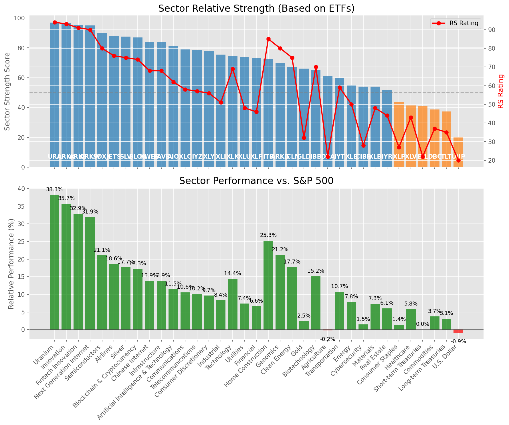

# **Daily Relative Strength Report**

**Date:** 2025-08-22

## **Market Valuation (Buffett Indicator)**

| Metric | Value |
|--------|-------|
| **Market Valuation** | **Overvalued** |
| **Current Ratio** | 10.47 |
| **Historical Mean** | 9.87 |
| **Standard Deviation** | 0.41 |
| **Z-Score (StdDev from Mean)** | 1.07 |
| **Total Market Cap** | $317.47 trillion |
| **GDP** | $30.33 trillion |

## **Market Insights**

### **Market is Overvalued**

The market appears to be trading above historical average valuations. While not at extreme levels, this suggests more modest future returns may be expected. Investors should:

- Focus on companies with reasonable valuations relative to their growth
- Be more selective with new positions
- Look for stocks showing relative strength within their sectors
- Consider trimming positions in extremely overvalued names

Historically, periods of mild overvaluation can persist for extended periods, but returns tend to be below average.

### **Buffett Indicator Overview**

The Buffett Indicator (Total Market Cap / GDP) is a measure of the stock market's valuation relative to the size of the economy. It is named after Warren Buffett, who described it as "probably the best single measure of where valuations stand at any given moment."

- **Values above +2 standard deviations:** Market significantly overvalued
- **Values above +1 standard deviation:** Market overvalued
- **Values between -1 and +1 standard deviations:** Market fairly valued
- **Values below -1 standard deviation:** Market undervalued
- **Values below -2 standard deviations:** Market significantly undervalued

---

## **Sector Relative Strength**

Based on William O'Neil's Relative Strength Methodology

| ETF | Strength | RS Rating | Performance | Above Key MAs | Trend | Sector |
|-----|----------|-----------|-------------|--------------|-------|--------|
| [URA](https://www.tradingview.com/chart/?symbol=URA) | 97.0 | 94.0 | 36.61% | 10d ✓, 50d ✓, 200d ✓ | ↗️ | Uranium |
| [ARKK](https://www.tradingview.com/chart/?symbol=ARKK) | 97.0 | 94.0 | 36.21% | 10d ✓, 50d ✓, 200d ✓ | ↗️ | Innovation |
| [ARKF](https://www.tradingview.com/chart/?symbol=ARKF) | 96.0 | 92.0 | 32.60% | 10d ✓, 50d ✓, 200d ✓ | ↗️ | Fintech Innovation |
| [SOXX](https://www.tradingview.com/chart/?symbol=SOXX) | 92.0 | 84.0 | 22.22% | 10d ✓, 50d ✓, 200d ✓ | ↗️ | Semiconductors |
| [JETS](https://www.tradingview.com/chart/?symbol=JETS) | 88.5 | 77.0 | 17.01% | 10d ✓, 50d ✓, 200d ✓ | ↗️ | Airlines |
| [SLV](https://www.tradingview.com/chart/?symbol=SLV) | 88.0 | 76.0 | 16.52% | 10d ✓, 50d ✓, 200d ✓ | ↗️ | Silver |
| [PAVE](https://www.tradingview.com/chart/?symbol=PAVE) | 86.0 | 72.0 | 14.02% | 10d ✓, 50d ✓, 200d ✓ | ↗️ | Infrastructure |
| [KWEB](https://www.tradingview.com/chart/?symbol=KWEB) | 85.5 | 71.0 | 13.59% | 10d ✓, 50d ✓, 200d ✓ | ↗️ | Chinese Internet |
| [ARKW](https://www.tradingview.com/chart/?symbol=ARKW) | 84.6 | 89.0 | 28.79% | 10d ✗, 50d ✓, 200d ✓ | ↗️ | Next Generation Internet |
| [AIQ](https://www.tradingview.com/chart/?symbol=AIQ) | 83.0 | 66.0 | 11.49% | 10d ✓, 50d ✓, 200d ✓ | ↗️ | Artificial Intelligence & Technology |
| [XLC](https://www.tradingview.com/chart/?symbol=XLC) | 81.5 | 63.0 | 10.70% | 10d ✓, 50d ✓, 200d ✓ | ↗️ | Communications |
| [XLY](https://www.tradingview.com/chart/?symbol=XLY) | 79.0 | 58.0 | 8.86% | 10d ✓, 50d ✓, 200d ✓ | ↗️ | Consumer Discretionary |
| [XLI](https://www.tradingview.com/chart/?symbol=XLI) | 78.5 | 57.0 | 8.65% | 10d ✓, 50d ✓, 200d ✓ | ↗️ | Industrial |
| [XLK](https://www.tradingview.com/chart/?symbol=XLK) | 77.1 | 74.0 | 14.89% | 10d ✗, 50d ✓, 200d ✓ | ↗️ | Technology |
| [XLU](https://www.tradingview.com/chart/?symbol=XLU) | 77.0 | 54.0 | 7.67% | 10d ✓, 50d ✓, 200d ✓ | ↗️ | Utilities |
| [XLF](https://www.tradingview.com/chart/?symbol=XLF) | 75.0 | 50.0 | 6.35% | 10d ✓, 50d ✓, 200d ✓ | ↗️ | Financial |
| [ITB](https://www.tradingview.com/chart/?symbol=ITB) | 72.5 | 85.0 | 23.34% | 10d ✓, 50d ✓, 200d ✓ | ↘️ | Home Construction |
| [ARKG](https://www.tradingview.com/chart/?symbol=ARKG) | 72.0 | 84.0 | 22.29% | 10d ✓, 50d ✓, 200d ✓ | ↘️ | Genomics |
| [ICLN](https://www.tradingview.com/chart/?symbol=ICLN) | 68.5 | 77.0 | 16.93% | 10d ✓, 50d ✓, 200d ✓ | ↘️ | Clean Energy |
| [IYZ](https://www.tradingview.com/chart/?symbol=IYZ) | 68.1 | 56.0 | 8.18% | 10d ✗, 50d ✓, 200d ✓ | ↗️ | Telecommunications |
| [IBB](https://www.tradingview.com/chart/?symbol=IBB) | 68.0 | 76.0 | 16.52% | 10d ✓, 50d ✓, 200d ✓ | ↘️ | Biotechnology |
| [GLD](https://www.tradingview.com/chart/?symbol=GLD) | 67.0 | 34.0 | 2.05% | 10d ✓, 50d ✓, 200d ✓ | ↗️ | Gold |
| [IYT](https://www.tradingview.com/chart/?symbol=IYT) | 61.5 | 63.0 | 10.67% | 10d ✓, 50d ✓, 200d ✓ | ↘️ | Transportation |
| [DBA](https://www.tradingview.com/chart/?symbol=DBA) | 61.0 | 22.0 | -1.09% | 10d ✓, 50d ✓, 200d ✓ | ↗️ | Agriculture |
| [BLOK](https://www.tradingview.com/chart/?symbol=BLOK) | 58.2 | 56.0 | 8.17% | 10d ✗, 50d ✗, 200d ✓ | ↗️ | Blockchain & Cryptocurrency |
| [CIBR](https://www.tradingview.com/chart/?symbol=CIBR) | 57.1 | 34.0 | 2.07% | 10d ✓, 50d ✗, 200d ✓ | ↗️ | Cybersecurity |
| [XLE](https://www.tradingview.com/chart/?symbol=XLE) | 56.5 | 53.0 | 7.46% | 10d ✓, 50d ✓, 200d ✓ | ↘️ | Energy |
| [XLB](https://www.tradingview.com/chart/?symbol=XLB) | 56.5 | 53.0 | 7.29% | 10d ✓, 50d ✓, 200d ✓ | ↘️ | Materials |
| [IYR](https://www.tradingview.com/chart/?symbol=IYR) | 54.5 | 49.0 | 6.10% | 10d ✓, 50d ✓, 200d ✓ | ↘️ | Real Estate |
| [XLP](https://www.tradingview.com/chart/?symbol=XLP) | 46.5 | 33.0 | 1.93% | 10d ✓, 50d ✓, 200d ✓ | ↘️ | Consumer Staples |
| [XLV](https://www.tradingview.com/chart/?symbol=XLV) | 44.8 | 50.0 | 6.27% | 10d ✓, 50d ✓, 200d ✗ | ↘️ | Healthcare |
| [BIL](https://www.tradingview.com/chart/?symbol=BIL) | 42.5 | 25.0 | 0.05% | 10d ✓, 50d ✓, 200d ✓ | ↘️ | Short-term Treasuries |
| [TLT](https://www.tradingview.com/chart/?symbol=TLT) | 39.8 | 40.0 | 3.25% | 10d ✓, 50d ✓, 200d ✗ | ↘️ | Long-term Treasuries |
| [DBC](https://www.tradingview.com/chart/?symbol=DBC) | 39.1 | 38.0 | 2.76% | 10d ✓, 50d ✗, 200d ✓ | ↘️ | Commodities |
| [UUP](https://www.tradingview.com/chart/?symbol=UUP) | 21.4 | 23.0 | -0.59% | 10d ✗, 50d ✓, 200d ✗ | ↘️ | U.S. Dollar |

### **Sector ETF Performance Interpretation**

This table shows the relative strength metrics for different market sectors based on their representative ETFs:

- **ETF**: The ETF used to measure sector performance (click for chart)
- **Strength**: Overall sector strength score (0-100) combining multiple factors
- **RS Rating**: O'Neil RS rating of the sector ETF
- **Performance**: Performance of the sector ETF relative to SPY
- **Above Key MAs**: Whether the ETF is trading above its 10, 50, and 200-day moving averages
- **Trend**: Whether the sector is in an uptrend (↗️) or downtrend (↘️)

### **Current Sector Leadership**

The current market leadership is coming from the following sectors: **Uranium, Innovation, Fintech Innovation**.

The **Uranium** sector (represented by **URA**) is showing particularly strong relative strength with an RS rating of 94.0 and performance of 36.61% vs. the S&P 500. This sector is trading above its 10-day, 50-day, 200-day moving average(s). Investors should consider focusing on high RS stocks within these leading sectors for potential outperformance.

---

## **Buy Recommendations**

The following 41 stocks show exceptional relative strength:

| RS Rating | Buy Score | Current Price | Chart | Name | Ticker |
|-----------|-----------|---------------|-------|------|--------|
| 100 | 100 | $27.69 | [Chart](https://www.tradingview.com/chart/?symbol=LQDA) | Liquidia Corporation Common Stock | LQDA |
| 99 | 100 | $101.68 | [Chart](https://www.tradingview.com/chart/?symbol=RYTM) | Rhythm Pharmaceuticals, Inc. Common Stock | RYTM |
| 99 | 100 | $189.87 | [Chart](https://www.tradingview.com/chart/?symbol=FUTU) | Futu Holdings Limited American Depositary Shares | FUTU |
| 99 | 100 | $43.42 | [Chart](https://www.tradingview.com/chart/?symbol=RKLB) | Rocket Lab Corporation Common Stock | RKLB |
| 98 | 100 | $194.25 | [Chart](https://www.tradingview.com/chart/?symbol=COOP) | Mr. Cooper Group Inc. Common Stock | COOP |
| 98 | 100 | $57.02 | [Chart](https://www.tradingview.com/chart/?symbol=TPC) | Tutor Perini Corporation | TPC |
| 97 | 100 | $89.02 | [Chart](https://www.tradingview.com/chart/?symbol=LIF) | Life360, Inc. Common Stock | LIF |
| 96 | 100 | $34.31 | [Chart](https://www.tradingview.com/chart/?symbol=CPS) | Cooper-Standard Automotive Inc. | CPS |
| 95 | 100 | $336.29 | [Chart](https://www.tradingview.com/chart/?symbol=RCL) | Royal Caribbean Group | RCL |
| 95 | 100 | $31.37 | [Chart](https://www.tradingview.com/chart/?symbol=ACMR) | ACM Research, Inc. Class A Common Stock | ACMR |
| 95 | 100 | $65.64 | [Chart](https://www.tradingview.com/chart/?symbol=MRCY) | Mercury Systems Inc. | MRCY |
| 95 | 100 | $60.07 | [Chart](https://www.tradingview.com/chart/?symbol=VIK) | Viking Holdings Ltd | VIK |
| 93 | 100 | $32.30 | [Chart](https://www.tradingview.com/chart/?symbol=PAAS) | Pan American Silver Corp. | PAAS |
| 93 | 100 | $75.51 | [Chart](https://www.tradingview.com/chart/?symbol=WNS) | WNS (Holdings) Limited | WNS |
| 93 | 100 | $99.25 | [Chart](https://www.tradingview.com/chart/?symbol=TPB) | Turning Point Brands, Inc. | TPB |
| 92 | 100 | $22.95 | [Chart](https://www.tradingview.com/chart/?symbol=BZ) | KANZHUN LIMITED American Depository Shares | BZ |
| 92 | 100 | $54.30 | [Chart](https://www.tradingview.com/chart/?symbol=ARKF) | ARK Fintech Innovation ETF | ARKF |
| 92 | 100 | $58.90 | [Chart](https://www.tradingview.com/chart/?symbol=BTI) | British American Tobacco p.l.c. American Depositary Shares, American Depositary Shares, each representing one Ordinary Share | BTI |
| 92 | 100 | $31.41 | [Chart](https://www.tradingview.com/chart/?symbol=SRAD) | Sportradar Group AG Class A Ordinary Shares | SRAD |
| 90 | 100 | $37.15 | [Chart](https://www.tradingview.com/chart/?symbol=DB) | Deutsche Bank Aktiengesellschaft | DB |
| 90 | 100 | $54.71 | [Chart](https://www.tradingview.com/chart/?symbol=SIL) | Global X Silver Miners ETF (NEW) | SIL |
| 90 | 100 | $24.41 | [Chart](https://www.tradingview.com/chart/?symbol=EYE) | National Vision Holdings, Inc. Common Stock | EYE |
| 88 | 100 | $43.11 | [Chart](https://www.tradingview.com/chart/?symbol=AHR) | American Healthcare REIT, Inc. | AHR |
| 88 | 100 | $50.44 | [Chart](https://www.tradingview.com/chart/?symbol=RING) | iShares MSCI Global Gold Miners ETF | RING |
| 87 | 100 | $46.01 | [Chart](https://www.tradingview.com/chart/?symbol=LTM) | LATAM Airlines Group S.A. American Depositary Shares (each representing two thousand (2,000) shares of Common Stock) | LTM |
| 89 | 99 | $94.33 | [Chart](https://www.tradingview.com/chart/?symbol=C) | Citigroup Inc. | C |
| 88 | 99 | $23.50 | [Chart](https://www.tradingview.com/chart/?symbol=MAG) | MAG Silver Corp. | MAG |
| 89 | 98 | $17.39 | [Chart](https://www.tradingview.com/chart/?symbol=ARLO) | Arlo Technologies, Inc. | ARLO |
| 87 | 98 | $251.11 | [Chart](https://www.tradingview.com/chart/?symbol=BAP) | Credicorp LTD | BAP |
| 86 | 98 | $162.93 | [Chart](https://www.tradingview.com/chart/?symbol=VSEC) | VSE Corp | VSEC |
| 87 | 97 | $123.70 | [Chart](https://www.tradingview.com/chart/?symbol=PPLT) | abrdn Physical Platinum Shares ETF | PPLT |
| 85 | 97 | $30.65 | [Chart](https://www.tradingview.com/chart/?symbol=OR) | OR Royalties Inc. | OR |
| 85 | 97 | $94.26 | [Chart](https://www.tradingview.com/chart/?symbol=LLYVK) | Liberty Media Corporation Series C Liberty Live Common Stock | LLYVK |
| 86 | 96 | $193.54 | [Chart](https://www.tradingview.com/chart/?symbol=AWI) | Armstrong World Industries, Inc. | AWI |
| 85 | 95 | $18.39 | [Chart](https://www.tradingview.com/chart/?symbol=BVN) | Compania de Minas Buenaventura S.A. | BVN |
| 84 | 95 | $26.03 | [Chart](https://www.tradingview.com/chart/?symbol=TFPM) | Triple Flag Precious Metals Corp. | TFPM |
| 82 | 95 | $26.35 | [Chart](https://www.tradingview.com/chart/?symbol=LAUR) | Laureate Education, Inc. Common Stock | LAUR |
| 84 | 94 | $16.02 | [Chart](https://www.tradingview.com/chart/?symbol=EZPW) | Ezcorp Inc | EZPW |
| 81 | 94 | $166.68 | [Chart](https://www.tradingview.com/chart/?symbol=IRTC) | iRhythm Technologies, Inc | IRTC |
| 82 | 92 | $19.50 | [Chart](https://www.tradingview.com/chart/?symbol=DAN) | Dana Incorporated | DAN |
| 80 | 92 | $443.28 | [Chart](https://www.tradingview.com/chart/?symbol=CYBR) | CyberArk Software Ltd. | CYBR |

---

## **Sell Recommendations**

The following 143 stocks show deteriorating relative strength:

| RS Rating | Sell Score | Current Price | Chart | Name | Ticker |
|-----------|------------|---------------|-------|------|--------|
| 1 | 100 | $15.32 | [Chart](https://www.tradingview.com/chart/?symbol=KRNT) | Kornit Digital Ltd. | KRNT |
| 1 | 100 | $23.87 | [Chart](https://www.tradingview.com/chart/?symbol=TECS) | Direxion Daily Technology Bear 3x Shares | TECS |
| 1 | 100 | $18.37 | [Chart](https://www.tradingview.com/chart/?symbol=DUST) | Direxion Daily Gold Miners Index Bear 2X Shares | DUST |
| 2 | 100 | $21.36 | [Chart](https://www.tradingview.com/chart/?symbol=CLW) | Clearwater Paper Corporation | CLW |
| 2 | 100 | $36.20 | [Chart](https://www.tradingview.com/chart/?symbol=VIXY) | ProShares VIX Short-Term Futures ETF | VIXY |
| 2 | 100 | $48.82 | [Chart](https://www.tradingview.com/chart/?symbol=FTV) | Fortive Corporation | FTV |
| 2 | 100 | $23.03 | [Chart](https://www.tradingview.com/chart/?symbol=ZSL) | ProShares UltraShort Silver | ZSL |
| 2 | 100 | $33.85 | [Chart](https://www.tradingview.com/chart/?symbol=IOT) | Samsara Inc. | IOT |
| 2 | 100 | $12.12 | [Chart](https://www.tradingview.com/chart/?symbol=ACVA) | ACV Auctions Inc. | ACVA |
| 2 | 100 | $17.88 | [Chart](https://www.tradingview.com/chart/?symbol=DJT) | Trump Media & Technology Group Corp. Common Stock | DJT |
| 3 | 100 | $26.56 | [Chart](https://www.tradingview.com/chart/?symbol=BRZE) | Braze, Inc. Class A Common Stock | BRZE |
| 3 | 100 | $37.95 | [Chart](https://www.tradingview.com/chart/?symbol=SDOW) | ProShares UltraPro Short Dow 30 | SDOW |
| 3 | 100 | $36.80 | [Chart](https://www.tradingview.com/chart/?symbol=TWM) | ProShares UltraShort Russell2000 | TWM |
| 5 | 100 | $26.60 | [Chart](https://www.tradingview.com/chart/?symbol=CRI) | Carter's Inc. | CRI |
| 6 | 100 | $68.78 | [Chart](https://www.tradingview.com/chart/?symbol=EMN) | Eastman Chemical Company | EMN |
| 6 | 100 | $47.53 | [Chart](https://www.tradingview.com/chart/?symbol=EXAS) | Exact Sciences Corp | EXAS |
| 6 | 100 | $25.56 | [Chart](https://www.tradingview.com/chart/?symbol=TBBB) | BBB Foods Inc. | TBBB |
| 6 | 100 | $13.94 | [Chart](https://www.tradingview.com/chart/?symbol=CMCO) | Columbus McKinnon Corp/NY | CMCO |
| 7 | 100 | $17.07 | [Chart](https://www.tradingview.com/chart/?symbol=S) | SentinelOne, Inc. | S |
| 7 | 100 | $56.54 | [Chart](https://www.tradingview.com/chart/?symbol=ATKR) | Atkore Inc. | ATKR |
| 8 | 100 | $361.61 | [Chart](https://www.tradingview.com/chart/?symbol=ADBE) | Adobe Inc. | ADBE |
| 10 | 100 | $12.13 | [Chart](https://www.tradingview.com/chart/?symbol=BSM) | Black Stone Minerals, L.P. | BSM |
| 10 | 100 | $95.77 | [Chart](https://www.tradingview.com/chart/?symbol=CNI) | Canadian National Railway | CNI |
| 11 | 100 | $38.39 | [Chart](https://www.tradingview.com/chart/?symbol=SH) | ProShares Short S&P500 | SH |
| 11 | 100 | $11.22 | [Chart](https://www.tradingview.com/chart/?symbol=PATH) | UiPath, Inc. | PATH |
| 12 | 100 | $14.78 | [Chart](https://www.tradingview.com/chart/?symbol=CHCT) | Community Healthcare Trust Incorporated Common Stock, $0.01 par value per share | CHCT |
| 12 | 100 | $18.20 | [Chart](https://www.tradingview.com/chart/?symbol=LOVE) | The Lovesac Company Common Stock | LOVE |
| 12 | 100 | $11.33 | [Chart](https://www.tradingview.com/chart/?symbol=CHPT) | ChargePoint Holdings, Inc. | CHPT |
| 13 | 100 | $17.08 | [Chart](https://www.tradingview.com/chart/?symbol=SVOL) | Simplify Volatility Premium ETF | SVOL |
| 13 | 100 | $16.63 | [Chart](https://www.tradingview.com/chart/?symbol=CTO) | CTO Realty Growth, Inc. | CTO |
| 13 | 100 | $18.02 | [Chart](https://www.tradingview.com/chart/?symbol=EBF) | Ennis, Inc. | EBF |
| 14 | 100 | $108.02 | [Chart](https://www.tradingview.com/chart/?symbol=CPT) | Camden Property Trust | CPT |
| 2 | 99 | $37.25 | [Chart](https://www.tradingview.com/chart/?symbol=VXX) | iPath Series B S&P 500 VIX Short-Term Futures ETN | VXX |
| 14 | 99 | $28.96 | [Chart](https://www.tradingview.com/chart/?symbol=MGPI) | MGP Ingredients Inc | MGPI |
| 17 | 99 | $39.85 | [Chart](https://www.tradingview.com/chart/?symbol=WLY) | John Wiley & Sons, Inc. Class A | WLY |
| 4 | 98 | $147.87 | [Chart](https://www.tradingview.com/chart/?symbol=GDDY) | GoDaddy Inc | GDDY |
| 7 | 98 | $79.94 | [Chart](https://www.tradingview.com/chart/?symbol=ESTC) | Elastic N.V. | ESTC |
| 10 | 98 | $106.83 | [Chart](https://www.tradingview.com/chart/?symbol=ITGR) | Integer Holdings Corporation | ITGR |
| 12 | 98 | $75.11 | [Chart](https://www.tradingview.com/chart/?symbol=OKE) | Oneok, Inc. | OKE |
| 14 | 98 | $33.24 | [Chart](https://www.tradingview.com/chart/?symbol=TECK) | Teck Resources Limited | TECK |
| 15 | 98 | $190.43 | [Chart](https://www.tradingview.com/chart/?symbol=AVB) | AvalonBay Communities, Inc. | AVB |
| 20 | 98 | $39.30 | [Chart](https://www.tradingview.com/chart/?symbol=UDR) | UDR, Inc. | UDR |
| 5 | 97 | $25.10 | [Chart](https://www.tradingview.com/chart/?symbol=THR) | THERMON GROUP HOLDINGS, INC. | THR |
| 10 | 97 | $32.70 | [Chart](https://www.tradingview.com/chart/?symbol=PSQ) | ProShares Short QQQ | PSQ |
| 16 | 97 | $10.00 | [Chart](https://www.tradingview.com/chart/?symbol=NMZ) | Nuveen Municipal High Income Opportunity Fund | NMZ |
| 20 | 97 | $33.19 | [Chart](https://www.tradingview.com/chart/?symbol=PCVX) | Vaxcyte, Inc. Common Stock | PCVX |
| 5 | 96 | $40.88 | [Chart](https://www.tradingview.com/chart/?symbol=VIST) | Vista Energy S.A.B. de C.V. | VIST |
| 7 | 96 | $16.68 | [Chart](https://www.tradingview.com/chart/?symbol=BTAL) | AGF U.S. Market Neutral Anti-Beta Fund | BTAL |
| 9 | 96 | $15.15 | [Chart](https://www.tradingview.com/chart/?symbol=MCS) | The Marcus Corporation | MCS |
| 10 | 96 | $772.19 | [Chart](https://www.tradingview.com/chart/?symbol=EQIX) | Equinix, Inc. Common Stock REIT | EQIX |
| 15 | 96 | $25.78 | [Chart](https://www.tradingview.com/chart/?symbol=FCPT) | Four Corners Property Trust, Inc. | FCPT |
| 19 | 96 | $19.88 | [Chart](https://www.tradingview.com/chart/?symbol=AVBP) | ArriVent BioPharma, Inc. Common Stock | AVBP |
| 7 | 95 | $14.94 | [Chart](https://www.tradingview.com/chart/?symbol=PRO) | Pros Holdings, Inc. | PRO |
| 8 | 95 | $29.94 | [Chart](https://www.tradingview.com/chart/?symbol=SMPL) | The Simply Good Foods Company Common Stock | SMPL |
| 11 | 95 | $166.40 | [Chart](https://www.tradingview.com/chart/?symbol=EPAM) | EPAM SYSTEMS, INC. | EPAM |
| 12 | 95 | $24.86 | [Chart](https://www.tradingview.com/chart/?symbol=DOG) | ProShares Short Dow30 | DOG |
| 13 | 95 | $10.12 | [Chart](https://www.tradingview.com/chart/?symbol=SPDN) | Direxion Daily S&P 500 Bear 1X Shares | SPDN |
| 15 | 94 | $90.55 | [Chart](https://www.tradingview.com/chart/?symbol=IRM) | Iron Mountain Inc. | IRM |
| 20 | 94 | $10.37 | [Chart](https://www.tradingview.com/chart/?symbol=MYI) | BLACKROCK MUNIYIELD QUALITY FUND III, INC. | MYI |
| 7 | 93 | $11.10 | [Chart](https://www.tradingview.com/chart/?symbol=CEPU) | Central Puerto S.A. American Depositary Shares (each represents ten Common Shares) | CEPU |
| 10 | 93 | $64.70 | [Chart](https://www.tradingview.com/chart/?symbol=CBZ) | CBIZ, Inc. | CBZ |
| 13 | 93 | $28.37 | [Chart](https://www.tradingview.com/chart/?symbol=AMAL) | Amalgamated Financial Corp. Common Stock (DE) | AMAL |
| 13 | 93 | $28.89 | [Chart](https://www.tradingview.com/chart/?symbol=CNX) | CNX Resources Corporation | CNX |
| 14 | 93 | $31.12 | [Chart](https://www.tradingview.com/chart/?symbol=INVH) | Invitation Homes Inc. Common Stock | INVH |
| 17 | 93 | $140.33 | [Chart](https://www.tradingview.com/chart/?symbol=OLED) | Universal Display Corp | OLED |
| 10 | 92 | $86.63 | [Chart](https://www.tradingview.com/chart/?symbol=MMSI) | Merit Medical Systems Inc | MMSI |
| 17 | 92 | $14.42 | [Chart](https://www.tradingview.com/chart/?symbol=VRE) | Veris Residential, Inc. | VRE |
| 17 | 92 | $39.42 | [Chart](https://www.tradingview.com/chart/?symbol=WHD) | Cactus, Inc. | WHD |
| 19 | 92 | $10.91 | [Chart](https://www.tradingview.com/chart/?symbol=MQY) | Blackrock Muni Yield Quality Fund, Inc | MQY |
| 19 | 92 | $286.76 | [Chart](https://www.tradingview.com/chart/?symbol=PSA) | Public Storage | PSA |
| 27 | 92 | $11.76 | [Chart](https://www.tradingview.com/chart/?symbol=NZF) | Nuveen Municipal Credit Income Fund | NZF |
| 11 | 91 | $49.50 | [Chart](https://www.tradingview.com/chart/?symbol=DT) | Dynatrace, Inc. | DT |
| 18 | 91 | $13.64 | [Chart](https://www.tradingview.com/chart/?symbol=OCSL) | Oaktree Specialty Lending Corporation | OCSL |
| 22 | 91 | $11.68 | [Chart](https://www.tradingview.com/chart/?symbol=NVG) | Nuveen AMT-Free Municipal Credit Income Fund | NVG |
| 11 | 90 | $72.46 | [Chart](https://www.tradingview.com/chart/?symbol=CTSH) | Cognizant Technology Solutions | CTSH |
| 12 | 90 | $64.21 | [Chart](https://www.tradingview.com/chart/?symbol=QSR) | Restaurant Brands International Inc. | QSR |
| 14 | 90 | $31.61 | [Chart](https://www.tradingview.com/chart/?symbol=JD) | JD.com, Inc. | JD |
| 16 | 90 | $74.58 | [Chart](https://www.tradingview.com/chart/?symbol=AWR) | American States Water Company | AWR |
| 19 | 90 | $69.30 | [Chart](https://www.tradingview.com/chart/?symbol=PYPL) | PayPal Holdings, Inc. Common Stock | PYPL |
| 23 | 90 | $25.98 | [Chart](https://www.tradingview.com/chart/?symbol=CGON) | CG Oncology, Inc. Common stock | CGON |
| 16 | 89 | $86.14 | [Chart](https://www.tradingview.com/chart/?symbol=CL) | Colgate-Palmolive Company | CL |
| 19 | 89 | $10.12 | [Chart](https://www.tradingview.com/chart/?symbol=MUC) | BLACKROCK MUNIHOLDINGS CALIFORNIA QUALITY FUND, INC | MUC |
| 21 | 89 | $70.10 | [Chart](https://www.tradingview.com/chart/?symbol=HSIC) | Henry Schein Inc | HSIC |
| 23 | 89 | $21.24 | [Chart](https://www.tradingview.com/chart/?symbol=LGOV) | First Trust Long Duration Opportunities ETF | LGOV |
| 16 | 88 | $25.82 | [Chart](https://www.tradingview.com/chart/?symbol=WKC) | World Kinect Corporation | WKC |
| 19 | 88 | $11.24 | [Chart](https://www.tradingview.com/chart/?symbol=LBRT) | Liberty Energy Inc. | LBRT |
| 19 | 88 | $24.00 | [Chart](https://www.tradingview.com/chart/?symbol=JANX) | Janux Therapeutics, Inc. Common Stock | JANX |
| 20 | 88 | $137.58 | [Chart](https://www.tradingview.com/chart/?symbol=DVA) | DaVita Inc. | DVA |
| 22 | 88 | $79.98 | [Chart](https://www.tradingview.com/chart/?symbol=IR) | Ingersoll Rand Inc. Common Stock | IR |
| 22 | 88 | $24.25 | [Chart](https://www.tradingview.com/chart/?symbol=HYMB) | SPDR Nuveen ICE High Yield Municipal Bond ETF | HYMB |
| 16 | 87 | $220.89 | [Chart](https://www.tradingview.com/chart/?symbol=SBAC) | SBA Communications Corp | SBAC |
| 18 | 87 | $80.89 | [Chart](https://www.tradingview.com/chart/?symbol=AGO) | Assured Guaranty, LTD | AGO |
| 20 | 87 | $10.37 | [Chart](https://www.tradingview.com/chart/?symbol=NMFC) | NEW MOUNTAIN FINANCE CORPORATION | NMFC |
| 24 | 86 | $30.69 | [Chart](https://www.tradingview.com/chart/?symbol=CNQ) | Canadian Natural Resources Limited | CNQ |
| 24 | 86 | $24.08 | [Chart](https://www.tradingview.com/chart/?symbol=FLMI) | Franklin Dynamic Municipal Bond ETF | FLMI |
| 24 | 86 | $32.85 | [Chart](https://www.tradingview.com/chart/?symbol=MBIN) | Merchants Bancorp Common Stock | MBIN |
| 27 | 86 | $20.88 | [Chart](https://www.tradingview.com/chart/?symbol=BKLN) | Invesco Senior Loan ETF | BKLN |
| 18 | 85 | $308.13 | [Chart](https://www.tradingview.com/chart/?symbol=LAD) | Lithia Motors, Inc. | LAD |
| 19 | 85 | $63.50 | [Chart](https://www.tradingview.com/chart/?symbol=MDLZ) | Mondelez International, Inc. Class A | MDLZ |
| 22 | 85 | $45.34 | [Chart](https://www.tradingview.com/chart/?symbol=EPI) | WisdomTree India Earnings Fund ETF | EPI |
| 23 | 85 | $49.51 | [Chart](https://www.tradingview.com/chart/?symbol=FMB) | First Trust Managed Municipal ETF | FMB |
| 35 | 85 | $48.02 | [Chart](https://www.tradingview.com/chart/?symbol=EDU) | New Oriental Education and Technology Group, Inc. American Depositary Shares (each representing ten (10) Common Shares) | EDU |
| 21 | 84 | $163.78 | [Chart](https://www.tradingview.com/chart/?symbol=EGP) | EastGroup Properties Inc. | EGP |
| 23 | 84 | $14.76 | [Chart](https://www.tradingview.com/chart/?symbol=GBDC) | Golub Capital BDC, Inc. | GBDC |
| 20 | 83 | $31.12 | [Chart](https://www.tradingview.com/chart/?symbol=EPRT) | Essential Properties Realty Trust, Inc. | EPRT |
| 21 | 83 | $44.87 | [Chart](https://www.tradingview.com/chart/?symbol=FIZZ) | National Beverage Corp. | FIZZ |
| 25 | 83 | $73.65 | [Chart](https://www.tradingview.com/chart/?symbol=NUVL) | Nuvalent, Inc. Class A Common Stock | NUVL |
| 27 | 83 | $45.85 | [Chart](https://www.tradingview.com/chart/?symbol=FTSL) | First Trust Senior Loan Fund ETF | FTSL |
| 21 | 82 | $27.46 | [Chart](https://www.tradingview.com/chart/?symbol=SARO) | StandardAero, Inc. | SARO |
| 24 | 82 | $119.65 | [Chart](https://www.tradingview.com/chart/?symbol=RGEN) | Repligen Corp | RGEN |
| 26 | 82 | $23.27 | [Chart](https://www.tradingview.com/chart/?symbol=BSJQ) | Invesco BulletShares 2026 High Yield Corporate Bond ETF | BSJQ |
| 23 | 81 | $177.41 | [Chart](https://www.tradingview.com/chart/?symbol=DOV) | Dover Corporation | DOV |
| 25 | 81 | $28.16 | [Chart](https://www.tradingview.com/chart/?symbol=TWST) | Twist Bioscience Corporation Common Stock | TWST |
| 25 | 81 | $23.05 | [Chart](https://www.tradingview.com/chart/?symbol=BSJP) | Invesco BulletShares 2025 High Yield Corporate Bond ETF | BSJP |
| 30 | 81 | $10.50 | [Chart](https://www.tradingview.com/chart/?symbol=DSU) | Blackrock Debt Strategies Fund, Inc. | DSU |
| 21 | 80 | $25.05 | [Chart](https://www.tradingview.com/chart/?symbol=IRDM) | Iridium Communications Inc. | IRDM |
| 25 | 77 | $84.68 | [Chart](https://www.tradingview.com/chart/?symbol=GGG) | Graco Inc | GGG |
| 28 | 77 | $37.46 | [Chart](https://www.tradingview.com/chart/?symbol=STBA) | S&T Bancorp Inc | STBA |
| 28 | 77 | $13.06 | [Chart](https://www.tradingview.com/chart/?symbol=NAVI) | Navient Corporation | NAVI |
| 29 | 77 | $37.53 | [Chart](https://www.tradingview.com/chart/?symbol=VNO) | Vornado Realty Trust | VNO |
| 29 | 76 | $49.30 | [Chart](https://www.tradingview.com/chart/?symbol=BNDX) | Vanguard Total International Bond ETF | BNDX |
| 32 | 76 | $12.36 | [Chart](https://www.tradingview.com/chart/?symbol=RQI) | COHEN & STEERS QUALITY INCOME REALTY FUND, INC. COMMON SHARES | RQI |
| 36 | 76 | $23.00 | [Chart](https://www.tradingview.com/chart/?symbol=DIN) | Dine Brands Global, Inc. | DIN |
| 38 | 76 | $27.48 | [Chart](https://www.tradingview.com/chart/?symbol=MRNA) | Moderna, Inc. Common Stock | MRNA |
| 29 | 75 | $19.09 | [Chart](https://www.tradingview.com/chart/?symbol=FSIG) | First Trust Limited Duration Investment Grade Corporate ETF | FSIG |
| 38 | 75 | $21.99 | [Chart](https://www.tradingview.com/chart/?symbol=DBC) | Invesco DB Commodity Index Tracking Fund | DBC |
| 30 | 74 | $162.10 | [Chart](https://www.tradingview.com/chart/?symbol=TRGP) | Targa Resources Corp. | TRGP |
| 31 | 74 | $31.69 | [Chart](https://www.tradingview.com/chart/?symbol=BOX) | BOX, INC. | BOX |
| 31 | 74 | $17.20 | [Chart](https://www.tradingview.com/chart/?symbol=OCFC) | OceanFirst Financial Corp | OCFC |
| 28 | 73 | $48.95 | [Chart](https://www.tradingview.com/chart/?symbol=IP) | International Paper Co. | IP |
| 37 | 72 | $10.85 | [Chart](https://www.tradingview.com/chart/?symbol=BTZ) | BlackRock Credit Allocation Income Trust | BTZ |
| 32 | 71 | $213.88 | [Chart](https://www.tradingview.com/chart/?symbol=AMT) | American Tower Corporation | AMT |
| 38 | 71 | $11.38 | [Chart](https://www.tradingview.com/chart/?symbol=PBR.A) | Petroleo Brasileiro S.A.-Petrobras | PBR.A |
| 39 | 71 | $14.12 | [Chart](https://www.tradingview.com/chart/?symbol=BAND) | Bandwidth Inc. Class A Common Stock | BAND |
| 33 | 70 | $61.16 | [Chart](https://www.tradingview.com/chart/?symbol=ROCK) | Gibraltar Industries, Inc. | ROCK |
| 33 | 70 | $14.54 | [Chart](https://www.tradingview.com/chart/?symbol=RDY) | Dr. Reddy's Laboratories Limited American Depositary Shares | RDY |
| 35 | 70 | $66.42 | [Chart](https://www.tradingview.com/chart/?symbol=BXP) | BXP, Inc. | BXP |
| 37 | 70 | $13.57 | [Chart](https://www.tradingview.com/chart/?symbol=MED) | Medifast, Inc. | MED |
| 38 | 68 | $13.15 | [Chart](https://www.tradingview.com/chart/?symbol=PDBC) | Invesco Actively Managed Exch-Traded Commodity Fd Tr Invesco Optimum Yield Diversified Commodity Strategy No K-1 ETF | PDBC |
| 38 | 68 | $15.89 | [Chart](https://www.tradingview.com/chart/?symbol=NCDL) | Nuveen Churchill Direct Lending Corp | NCDL |
| 39 | 67 | $24.60 | [Chart](https://www.tradingview.com/chart/?symbol=VRRM) | Verra Mobility Corporation Class A Common Stock | VRRM |
| 36 | 65 | $42.75 | [Chart](https://www.tradingview.com/chart/?symbol=OFG) | OFG BANCORP | OFG |
| 37 | 63 | $164.53 | [Chart](https://www.tradingview.com/chart/?symbol=AMAT) | Applied Materials Inc | AMAT |

## **Methodology**

This report uses William O'Neil's relative strength methodology from Investors Business Daily:

* **RS Rating**: Percentile rank of stock's performance vs. S&P 500 over the past 63 trading days (1-99 scale)
* **Buy Criteria**: RS Rating >= 80, price above 50-day MA, strong uptrend, increasing volume
* **Sell Criteria**: RS Rating < 40, price below 50-day MA, downtrend, decreasing volume

### **O'Neil's Key Principles**

1. **Focus on relative performance** - stocks outperforming the market
2. **Price trend confirmation** - stock must be in an uptrend
3. **Volume confirmation** - strong volume supports price moves
4. **Moving average validation** - price above key moving averages
5. **Market leaders only** - concentrate on top-performing stocks

*Report generated automatically after market close*