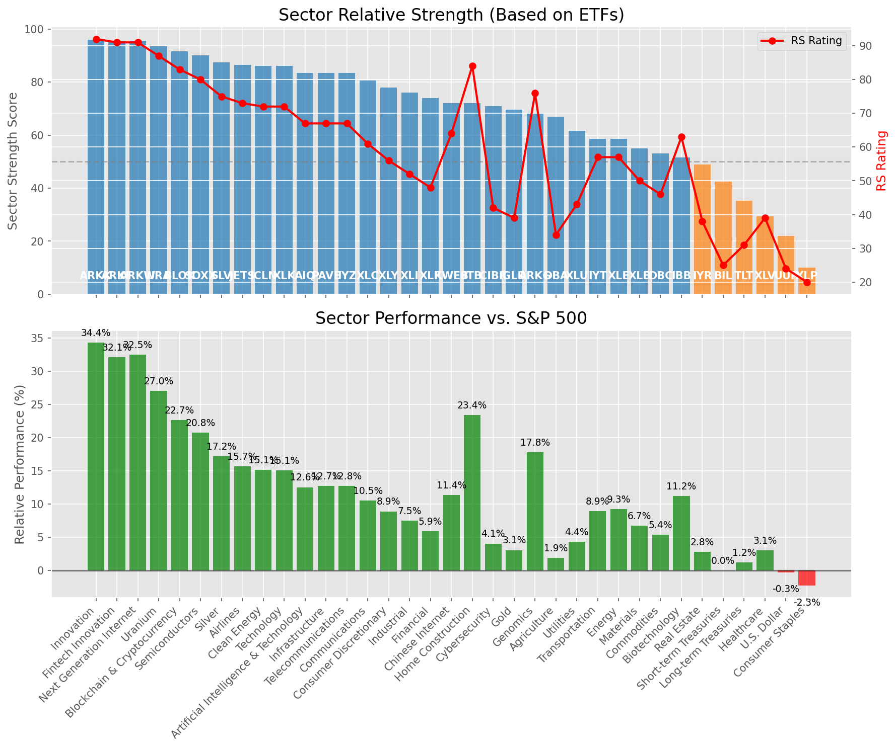

# **Daily Relative Strength Report**

**Date:** 2025-08-29

## **Market Valuation (Buffett Indicator)**

| Metric | Value |
|--------|-------|
| **Market Valuation** | **Overvalued** |
| **Current Ratio** | 10.48 |
| **Historical Mean** | 9.96 |
| **Standard Deviation** | 0.38 |
| **Z-Score (StdDev from Mean)** | 1.56 |
| **Total Market Cap** | $318.20 trillion |
| **GDP** | $30.35 trillion |

## **Market Insights**

### **Market is Overvalued**

The market appears to be trading above historical average valuations. While not at extreme levels, this suggests more modest future returns may be expected. Investors should:

- Focus on companies with reasonable valuations relative to their growth
- Be more selective with new positions
- Look for stocks showing relative strength within their sectors
- Consider trimming positions in extremely overvalued names

Historically, periods of mild overvaluation can persist for extended periods, but returns tend to be below average.

### **Buffett Indicator Overview**

The Buffett Indicator (Total Market Cap / GDP) is a measure of the stock market's valuation relative to the size of the economy. It is named after Warren Buffett, who described it as "probably the best single measure of where valuations stand at any given moment."

- **Values above +2 standard deviations:** Market significantly overvalued
- **Values above +1 standard deviation:** Market overvalued
- **Values between -1 and +1 standard deviations:** Market fairly valued
- **Values below -1 standard deviation:** Market undervalued
- **Values below -2 standard deviations:** Market significantly undervalued

---

## **Sector Relative Strength**

Based on William O'Neil's Relative Strength Methodology

| ETF | Strength | RS Rating | Performance | Above Key MAs | Trend | Sector |
|-----|----------|-----------|-------------|--------------|-------|--------|
| [ARKW](https://www.tradingview.com/chart/?symbol=ARKW) | 94.5 | 89.0 | 28.63% | 10d ✓, 50d ✓, 200d ✓ | ↗️ | Next Generation Internet |
| [ARKF](https://www.tradingview.com/chart/?symbol=ARKF) | 94.5 | 89.0 | 29.17% | 10d ✓, 50d ✓, 200d ✓ | ↗️ | Fintech Innovation |
| [URA](https://www.tradingview.com/chart/?symbol=URA) | 94.0 | 88.0 | 27.61% | 10d ✓, 50d ✓, 200d ✓ | ↗️ | Uranium |
| [BLOK](https://www.tradingview.com/chart/?symbol=BLOK) | 90.5 | 81.0 | 21.17% | 10d ✓, 50d ✓, 200d ✓ | ↗️ | Blockchain & Cryptocurrency |
| [KWEB](https://www.tradingview.com/chart/?symbol=KWEB) | 86.0 | 72.0 | 15.14% | 10d ✓, 50d ✓, 200d ✓ | ↗️ | Chinese Internet |
| [JETS](https://www.tradingview.com/chart/?symbol=JETS) | 86.0 | 72.0 | 15.34% | 10d ✓, 50d ✓, 200d ✓ | ↗️ | Airlines |
| [SLV](https://www.tradingview.com/chart/?symbol=SLV) | 85.5 | 71.0 | 14.56% | 10d ✓, 50d ✓, 200d ✓ | ↗️ | Silver |
| [ARKK](https://www.tradingview.com/chart/?symbol=ARKK) | 85.1 | 90.0 | 31.21% | 10d ✗, 50d ✓, 200d ✓ | ↗️ | Innovation |
| [PAVE](https://www.tradingview.com/chart/?symbol=PAVE) | 82.5 | 65.0 | 11.94% | 10d ✓, 50d ✓, 200d ✓ | ↗️ | Infrastructure |
| [IYZ](https://www.tradingview.com/chart/?symbol=IYZ) | 82.5 | 65.0 | 11.52% | 10d ✓, 50d ✓, 200d ✓ | ↗️ | Telecommunications |
| [AIQ](https://www.tradingview.com/chart/?symbol=AIQ) | 81.5 | 63.0 | 10.68% | 10d ✓, 50d ✓, 200d ✓ | ↗️ | Artificial Intelligence & Technology |
| [XLC](https://www.tradingview.com/chart/?symbol=XLC) | 79.5 | 59.0 | 9.31% | 10d ✓, 50d ✓, 200d ✓ | ↗️ | Communications |
| [SOXX](https://www.tradingview.com/chart/?symbol=SOXX) | 78.6 | 77.0 | 17.93% | 10d ✗, 50d ✓, 200d ✓ | ↗️ | Semiconductors |
| [XLY](https://www.tradingview.com/chart/?symbol=XLY) | 77.5 | 55.0 | 8.14% | 10d ✓, 50d ✓, 200d ✓ | ↗️ | Consumer Discretionary |
| [ICLN](https://www.tradingview.com/chart/?symbol=ICLN) | 75.1 | 70.0 | 14.30% | 10d ✗, 50d ✓, 200d ✓ | ↗️ | Clean Energy |
| [XLF](https://www.tradingview.com/chart/?symbol=XLF) | 74.0 | 48.0 | 5.90% | 10d ✓, 50d ✓, 200d ✓ | ↗️ | Financial |
| [XLK](https://www.tradingview.com/chart/?symbol=XLK) | 73.6 | 67.0 | 12.66% | 10d ✗, 50d ✓, 200d ✓ | ↗️ | Technology |
| [ITB](https://www.tradingview.com/chart/?symbol=ITB) | 72.5 | 85.0 | 25.08% | 10d ✓, 50d ✓, 200d ✓ | ↘️ | Home Construction |
| [DBA](https://www.tradingview.com/chart/?symbol=DBA) | 71.0 | 42.0 | 3.93% | 10d ✓, 50d ✓, 200d ✓ | ↗️ | Agriculture |
| [GLD](https://www.tradingview.com/chart/?symbol=GLD) | 67.0 | 34.0 | 2.05% | 10d ✓, 50d ✓, 200d ✓ | ↗️ | Gold |
| [XLI](https://www.tradingview.com/chart/?symbol=XLI) | 65.1 | 50.0 | 6.57% | 10d ✗, 50d ✓, 200d ✓ | ↗️ | Industrial |
| [ARKG](https://www.tradingview.com/chart/?symbol=ARKG) | 65.0 | 70.0 | 14.23% | 10d ✓, 50d ✓, 200d ✓ | ↘️ | Genomics |
| [XLE](https://www.tradingview.com/chart/?symbol=XLE) | 59.5 | 59.0 | 9.43% | 10d ✓, 50d ✓, 200d ✓ | ↘️ | Energy |
| [XLU](https://www.tradingview.com/chart/?symbol=XLU) | 58.6 | 37.0 | 2.60% | 10d ✗, 50d ✓, 200d ✓ | ↗️ | Utilities |
| [XLB](https://www.tradingview.com/chart/?symbol=XLB) | 54.5 | 49.0 | 6.25% | 10d ✓, 50d ✓, 200d ✓ | ↘️ | Materials |
| [CIBR](https://www.tradingview.com/chart/?symbol=CIBR) | 54.1 | 28.0 | 0.81% | 10d ✓, 50d ✗, 200d ✓ | ↗️ | Cybersecurity |
| [IBB](https://www.tradingview.com/chart/?symbol=IBB) | 52.6 | 65.0 | 11.73% | 10d ✗, 50d ✓, 200d ✓ | ↘️ | Biotechnology |
| [DBC](https://www.tradingview.com/chart/?symbol=DBC) | 51.5 | 43.0 | 4.17% | 10d ✓, 50d ✓, 200d ✓ | ↘️ | Commodities |
| [IYT](https://www.tradingview.com/chart/?symbol=IYT) | 49.6 | 59.0 | 9.50% | 10d ✗, 50d ✓, 200d ✓ | ↘️ | Transportation |
| [IYR](https://www.tradingview.com/chart/?symbol=IYR) | 49.5 | 39.0 | 3.22% | 10d ✓, 50d ✓, 200d ✓ | ↘️ | Real Estate |
| [BIL](https://www.tradingview.com/chart/?symbol=BIL) | 43.0 | 26.0 | 0.36% | 10d ✓, 50d ✓, 200d ✓ | ↘️ | Short-term Treasuries |
| [XLV](https://www.tradingview.com/chart/?symbol=XLV) | 40.3 | 41.0 | 3.55% | 10d ✓, 50d ✓, 200d ✗ | ↘️ | Healthcare |
| [UUP](https://www.tradingview.com/chart/?symbol=UUP) | 22.9 | 26.0 | 0.40% | 10d ✗, 50d ✓, 200d ✗ | ↘️ | U.S. Dollar |
| [TLT](https://www.tradingview.com/chart/?symbol=TLT) | 16.0 | 32.0 | 1.69% | 10d ✗, 50d ✗, 200d ✗ | ↘️ | Long-term Treasuries |
| [XLP](https://www.tradingview.com/chart/?symbol=XLP) | 10.0 | 20.0 | -2.53% | 10d ✗, 50d ✗, 200d ✗ | ↘️ | Consumer Staples |

### **Sector ETF Performance Interpretation**

This table shows the relative strength metrics for different market sectors based on their representative ETFs:

- **ETF**: The ETF used to measure sector performance (click for chart)
- **Strength**: Overall sector strength score (0-100) combining multiple factors
- **RS Rating**: O'Neil RS rating of the sector ETF
- **Performance**: Performance of the sector ETF relative to SPY
- **Above Key MAs**: Whether the ETF is trading above its 10, 50, and 200-day moving averages
- **Trend**: Whether the sector is in an uptrend (↗️) or downtrend (↘️)

### **Current Sector Leadership**

The current market leadership is coming from the following sectors: **Next Generation Internet, Fintech Innovation, Uranium**.

The **Next Generation Internet** sector (represented by **ARKW**) is showing particularly strong relative strength with an RS rating of 89.0 and performance of 28.63% vs. the S&P 500. This sector is trading above its 10-day, 50-day, 200-day moving average(s). Investors should consider focusing on high RS stocks within these leading sectors for potential outperformance.

---

## **Buy Recommendations**

The following 48 stocks show exceptional relative strength:

| RS Rating | Buy Score | Current Price | Chart | Name | Ticker |
|-----------|-----------|---------------|-------|------|--------|
| 100 | 100 | $185.60 | [Chart](https://www.tradingview.com/chart/?symbol=FUTU) | Futu Holdings Limited American Depositary Shares | FUTU |
| 100 | 100 | $123.06 | [Chart](https://www.tradingview.com/chart/?symbol=CRDO) | Credo Technology Group Holding Ltd Ordinary Shares | CRDO |
| 100 | 100 | $71.14 | [Chart](https://www.tradingview.com/chart/?symbol=MP) | MP Materials Corp. | MP |
| 100 | 100 | $48.60 | [Chart](https://www.tradingview.com/chart/?symbol=RKLB) | Rocket Lab Corporation Common Stock | RKLB |
| 99 | 100 | $194.75 | [Chart](https://www.tradingview.com/chart/?symbol=CLS) | Celestica, Inc. | CLS |
| 99 | 100 | $27.68 | [Chart](https://www.tradingview.com/chart/?symbol=LQDA) | Liquidia Corporation Common Stock | LQDA |
| 99 | 100 | $62.88 | [Chart](https://www.tradingview.com/chart/?symbol=CELH) | Celsius Holdings, Inc. Common Stock | CELH |
| 98 | 100 | $58.94 | [Chart](https://www.tradingview.com/chart/?symbol=TPC) | Tutor Perini Corporation | TPC |
| 98 | 100 | $36.82 | [Chart](https://www.tradingview.com/chart/?symbol=CPS) | Cooper-Standard Automotive Inc. | CPS |
| 97 | 100 | $44.57 | [Chart](https://www.tradingview.com/chart/?symbol=TTMI) | TTM Technologies Inc | TTMI |
| 97 | 100 | $378.92 | [Chart](https://www.tradingview.com/chart/?symbol=TLN) | Talen Energy Corporation Common Stock | TLN |
| 96 | 100 | $53.21 | [Chart](https://www.tradingview.com/chart/?symbol=REVG) | REV Group, Inc. | REVG |
| 96 | 100 | $90.44 | [Chart](https://www.tradingview.com/chart/?symbol=LIF) | Life360, Inc. Common Stock | LIF |
| 94 | 100 | $124.59 | [Chart](https://www.tradingview.com/chart/?symbol=RBLX) | Roblox Corporation | RBLX |
| 94 | 100 | $363.22 | [Chart](https://www.tradingview.com/chart/?symbol=RCL) | Royal Caribbean Group | RCL |
| 94 | 100 | $63.62 | [Chart](https://www.tradingview.com/chart/?symbol=VIK) | Viking Holdings Ltd | VIK |
| 93 | 100 | $117.52 | [Chart](https://www.tradingview.com/chart/?symbol=SANM) | Sanmina  Corp | SANM |
| 92 | 100 | $23.62 | [Chart](https://www.tradingview.com/chart/?symbol=BZ) | KANZHUN LIMITED American Depository Shares | BZ |
| 92 | 100 | $67.55 | [Chart](https://www.tradingview.com/chart/?symbol=MRCY) | Mercury Systems Inc. | MRCY |
| 91 | 100 | $97.38 | [Chart](https://www.tradingview.com/chart/?symbol=LLYVK) | Liberty Media Corporation Series C Liberty Live Common Stock | LLYVK |
| 91 | 100 | $99.50 | [Chart](https://www.tradingview.com/chart/?symbol=TPB) | Turning Point Brands, Inc. | TPB |
| 91 | 100 | $50.26 | [Chart](https://www.tradingview.com/chart/?symbol=LTM) | LATAM Airlines Group S.A. American Depositary Shares (each representing two thousand (2,000) shares of Common Stock) | LTM |
| 90 | 100 | $75.45 | [Chart](https://www.tradingview.com/chart/?symbol=WNS) | WNS (Holdings) Limited | WNS |
| 89 | 100 | $156.66 | [Chart](https://www.tradingview.com/chart/?symbol=ARKW) | ARK Next Generation Internet ETF | ARKW |
| 89 | 100 | $53.54 | [Chart](https://www.tradingview.com/chart/?symbol=ARKF) | ARK Fintech Innovation ETF | ARKF |
| 89 | 100 | $101.82 | [Chart](https://www.tradingview.com/chart/?symbol=TPR) | Tapestry, Inc. Common Stock | TPR |
| 88 | 100 | $53.91 | [Chart](https://www.tradingview.com/chart/?symbol=RING) | iShares MSCI Global Gold Miners ETF | RING |
| 86 | 100 | $105.91 | [Chart](https://www.tradingview.com/chart/?symbol=VRNA) | Verona Pharma plc | VRNA |
| 88 | 99 | $125.22 | [Chart](https://www.tradingview.com/chart/?symbol=PPLT) | abrdn Physical Platinum Shares ETF | PPLT |
| 88 | 99 | $96.57 | [Chart](https://www.tradingview.com/chart/?symbol=C) | Citigroup Inc. | C |
| 86 | 99 | $271.71 | [Chart](https://www.tradingview.com/chart/?symbol=IDCC) | InterDigital, Inc. | IDCC |
| 87 | 98 | $28.92 | [Chart](https://www.tradingview.com/chart/?symbol=KAR) | OPENLANE, Inc | KAR |
| 87 | 97 | $53.62 | [Chart](https://www.tradingview.com/chart/?symbol=FLEX) | Flex Ltd. Ordinary Shares | FLEX |
| 86 | 97 | $59.45 | [Chart](https://www.tradingview.com/chart/?symbol=CALX) | CALIX, INC. | CALX |
| 86 | 97 | $38.92 | [Chart](https://www.tradingview.com/chart/?symbol=ATAT) | Atour Lifestyle Holdings Limited American Depositary Shares | ATAT |
| 86 | 96 | $58.10 | [Chart](https://www.tradingview.com/chart/?symbol=SIL) | Global X Silver Miners ETF (NEW) | SIL |
| 86 | 96 | $16.67 | [Chart](https://www.tradingview.com/chart/?symbol=EZPW) | Ezcorp Inc | EZPW |
| 83 | 96 | $208.71 | [Chart](https://www.tradingview.com/chart/?symbol=NET) | Cloudflare, Inc. Class A common stock, par value $0.001 per share | NET |
| 84 | 95 | $24.52 | [Chart](https://www.tradingview.com/chart/?symbol=MAG) | MAG Silver Corp. | MAG |
| 82 | 95 | $42.79 | [Chart](https://www.tradingview.com/chart/?symbol=AHR) | American Healthcare REIT, Inc. | AHR |
| 84 | 94 | $28.22 | [Chart](https://www.tradingview.com/chart/?symbol=ACMR) | ACM Research, Inc. Class A Common Stock | ACMR |
| 81 | 94 | $169.98 | [Chart](https://www.tradingview.com/chart/?symbol=IRTC) | iRhythm Technologies, Inc | IRTC |
| 80 | 94 | $102.17 | [Chart](https://www.tradingview.com/chart/?symbol=SNEX) | StoneX Group Inc. Common Stock | SNEX |
| 82 | 93 | $20.16 | [Chart](https://www.tradingview.com/chart/?symbol=DAN) | Dana Incorporated | DAN |
| 80 | 93 | $27.48 | [Chart](https://www.tradingview.com/chart/?symbol=LAUR) | Laureate Education, Inc. Common Stock | LAUR |
| 81 | 90 | $25.99 | [Chart](https://www.tradingview.com/chart/?symbol=ACAD) | Acadia Pharmaceuticals Inc. | ACAD |
| 80 | 90 | $17.41 | [Chart](https://www.tradingview.com/chart/?symbol=ARLO) | Arlo Technologies, Inc. | ARLO |
| 80 | 90 | $219.08 | [Chart](https://www.tradingview.com/chart/?symbol=AN) | AutoNation, Inc. | AN |

---

## **Sell Recommendations**

The following 87 stocks show deteriorating relative strength:

| RS Rating | Sell Score | Current Price | Chart | Name | Ticker |
|-----------|------------|---------------|-------|------|--------|
| 1 | 100 | $20.48 | [Chart](https://www.tradingview.com/chart/?symbol=ZSL) | ProShares UltraShort Silver | ZSL |
| 1 | 100 | $14.94 | [Chart](https://www.tradingview.com/chart/?symbol=KRNT) | Kornit Digital Ltd. | KRNT |
| 2 | 100 | $24.23 | [Chart](https://www.tradingview.com/chart/?symbol=TECS) | Direxion Daily Technology Bear 3x Shares | TECS |
| 2 | 100 | $21.57 | [Chart](https://www.tradingview.com/chart/?symbol=CLW) | Clearwater Paper Corporation | CLW |
| 2 | 100 | $36.27 | [Chart](https://www.tradingview.com/chart/?symbol=VXX) | iPath Series B S&P 500 VIX Short-Term Futures ETN | VXX |
| 3 | 100 | $36.35 | [Chart](https://www.tradingview.com/chart/?symbol=TWM) | ProShares UltraShort Russell2000 | TWM |
| 3 | 100 | $45.08 | [Chart](https://www.tradingview.com/chart/?symbol=ONON) | On Holding AG | ONON |
| 4 | 100 | $17.53 | [Chart](https://www.tradingview.com/chart/?symbol=DJT) | Trump Media & Technology Group Corp. Common Stock | DJT |
| 4 | 100 | $37.95 | [Chart](https://www.tradingview.com/chart/?symbol=SDOW) | ProShares UltraPro Short Dow 30 | SDOW |
| 4 | 100 | $373.32 | [Chart](https://www.tradingview.com/chart/?symbol=FDS) | Factset Research Systems | FDS |
| 4 | 100 | $11.27 | [Chart](https://www.tradingview.com/chart/?symbol=CHPT) | ChargePoint Holdings, Inc. | CHPT |
| 5 | 100 | $20.24 | [Chart](https://www.tradingview.com/chart/?symbol=ERY) | Direxion Daily Energy Bear 2X Shares | ERY |
| 6 | 100 | $47.42 | [Chart](https://www.tradingview.com/chart/?symbol=EXAS) | Exact Sciences Corp | EXAS |
| 7 | 100 | $16.37 | [Chart](https://www.tradingview.com/chart/?symbol=BTAL) | AGF U.S. Market Neutral Anti-Beta Fund | BTAL |
| 7 | 100 | $24.87 | [Chart](https://www.tradingview.com/chart/?symbol=GDEN) | Golden Entertainment, Inc. Common Stock | GDEN |
| 7 | 100 | $19.12 | [Chart](https://www.tradingview.com/chart/?symbol=AVBP) | ArriVent BioPharma, Inc. Common Stock | AVBP |
| 9 | 100 | $58.19 | [Chart](https://www.tradingview.com/chart/?symbol=ATKR) | Atkore Inc. | ATKR |
| 9 | 100 | $100.00 | [Chart](https://www.tradingview.com/chart/?symbol=BNTX) | BioNTech SE American Depositary Share | BNTX |
| 9 | 100 | $356.70 | [Chart](https://www.tradingview.com/chart/?symbol=ADBE) | Adobe Inc. | ADBE |
| 11 | 100 | $24.24 | [Chart](https://www.tradingview.com/chart/?symbol=WSC) | WillScot Holdings Corporation Class A Common Stock | WSC |
| 11 | 100 | $22.72 | [Chart](https://www.tradingview.com/chart/?symbol=JANX) | Janux Therapeutics, Inc. Common Stock | JANX |
| 12 | 100 | $38.48 | [Chart](https://www.tradingview.com/chart/?symbol=SH) | ProShares Short S&P500 | SH |
| 15 | 100 | $15.41 | [Chart](https://www.tradingview.com/chart/?symbol=CHCT) | Community Healthcare Trust Incorporated Common Stock, $0.01 par value per share | CHCT |
| 7 | 99 | $15.44 | [Chart](https://www.tradingview.com/chart/?symbol=MCS) | The Marcus Corporation | MCS |
| 6 | 97 | $114.94 | [Chart](https://www.tradingview.com/chart/?symbol=IPAR) | Interparfums, Inc. Common Stock | IPAR |
| 13 | 97 | $92.33 | [Chart](https://www.tradingview.com/chart/?symbol=IRM) | Iron Mountain Inc. | IRM |
| 13 | 97 | $104.05 | [Chart](https://www.tradingview.com/chart/?symbol=MATX) | Matsons, Inc. | MATX |
| 23 | 97 | $76.58 | [Chart](https://www.tradingview.com/chart/?symbol=NUVL) | Nuvalent, Inc. Class A Common Stock | NUVL |
| 11 | 96 | $29.20 | [Chart](https://www.tradingview.com/chart/?symbol=CNX) | CNX Resources Corporation | CNX |
| 14 | 96 | $143.58 | [Chart](https://www.tradingview.com/chart/?symbol=EXR) | Extra Space Storage, Inc. | EXR |
| 22 | 96 | $17.34 | [Chart](https://www.tradingview.com/chart/?symbol=SVOL) | Simplify Volatility Premium ETF | SVOL |
| 9 | 95 | $10.49 | [Chart](https://www.tradingview.com/chart/?symbol=CLPT) | ClearPoint Neuro, Inc. Common Stock | CLPT |
| 12 | 95 | $107.87 | [Chart](https://www.tradingview.com/chart/?symbol=ITGR) | Integer Holdings Corporation | ITGR |
| 14 | 95 | $25.89 | [Chart](https://www.tradingview.com/chart/?symbol=FCPT) | Four Corners Property Trust, Inc. | FCPT |
| 16 | 95 | $10.55 | [Chart](https://www.tradingview.com/chart/?symbol=OEC) | Orion S.A. | OEC |
| 17 | 95 | $34.67 | [Chart](https://www.tradingview.com/chart/?symbol=RGR) | Sturm, Ruger & Company, Inc. | RGR |
| 6 | 94 | $31.62 | [Chart](https://www.tradingview.com/chart/?symbol=YELP) | YELP INC. | YELP |
| 9 | 94 | $11.12 | [Chart](https://www.tradingview.com/chart/?symbol=PATH) | UiPath, Inc. | PATH |
| 10 | 94 | $26.49 | [Chart](https://www.tradingview.com/chart/?symbol=SARO) | StandardAero, Inc. | SARO |
| 13 | 94 | $24.87 | [Chart](https://www.tradingview.com/chart/?symbol=DOG) | ProShares Short Dow30 | DOG |
| 18 | 94 | $10.13 | [Chart](https://www.tradingview.com/chart/?symbol=NMZ) | Nuveen Municipal High Income Opportunity Fund | NMZ |
| 12 | 93 | $32.92 | [Chart](https://www.tradingview.com/chart/?symbol=PSQ) | ProShares Short QQQ | PSQ |
| 13 | 93 | $10.00 | [Chart](https://www.tradingview.com/chart/?symbol=SPDN) | Direxion Daily S&P 500 Bear 1X Shares | SPDN |
| 13 | 91 | $31.29 | [Chart](https://www.tradingview.com/chart/?symbol=INVH) | Invitation Homes Inc. Common Stock | INVH |
| 15 | 91 | $246.30 | [Chart](https://www.tradingview.com/chart/?symbol=EFX) | Equifax, Incorporated | EFX |
| 17 | 91 | $39.57 | [Chart](https://www.tradingview.com/chart/?symbol=UDR) | UDR, Inc. | UDR |
| 18 | 91 | $11.02 | [Chart](https://www.tradingview.com/chart/?symbol=FPI) | Farmland Partners Inc. | FPI |
| 19 | 90 | $26.81 | [Chart](https://www.tradingview.com/chart/?symbol=WKC) | World Kinect Corporation | WKC |
| 15 | 89 | $28.89 | [Chart](https://www.tradingview.com/chart/?symbol=AMAL) | Amalgamated Financial Corp. Common Stock (DE) | AMAL |
| 25 | 89 | $63.58 | [Chart](https://www.tradingview.com/chart/?symbol=ZROZ) | PIMCO 25+ Year Zero Coupon U.S. Treasury Index Exchange-Traded Fund | ZROZ |
| 14 | 88 | $50.60 | [Chart](https://www.tradingview.com/chart/?symbol=DT) | Dynatrace, Inc. | DT |
| 22 | 88 | $22.53 | [Chart](https://www.tradingview.com/chart/?symbol=CURB) | Curbline Properties Corp. | CURB |
| 23 | 88 | $39.35 | [Chart](https://www.tradingview.com/chart/?symbol=NMIH) | NMI Holdings Inc. Common Stock | NMIH |
| 15 | 87 | $43.79 | [Chart](https://www.tradingview.com/chart/?symbol=EPI) | WisdomTree India Earnings Fund ETF | EPI |
| 19 | 87 | $29.19 | [Chart](https://www.tradingview.com/chart/?symbol=FORM) | FormFactor Inc. | FORM |
| 33 | 87 | $12.40 | [Chart](https://www.tradingview.com/chart/?symbol=MAGN) | Magnera Corporation | MAGN |
| 25 | 86 | $23.07 | [Chart](https://www.tradingview.com/chart/?symbol=BSJP) | Invesco BulletShares 2025 High Yield Corporate Bond ETF | BSJP |
| 18 | 85 | $119.58 | [Chart](https://www.tradingview.com/chart/?symbol=CHH) | Choice Hotels Intnl. | CHH |
| 21 | 84 | $79.43 | [Chart](https://www.tradingview.com/chart/?symbol=IR) | Ingersoll Rand Inc. Common Stock | IR |
| 23 | 83 | $46.36 | [Chart](https://www.tradingview.com/chart/?symbol=TRUP) | Trupanion, Inc. | TRUP |
| 23 | 83 | $56.89 | [Chart](https://www.tradingview.com/chart/?symbol=SLG) | SL Green Realty Corp. | SLG |
| 25 | 83 | $36.37 | [Chart](https://www.tradingview.com/chart/?symbol=APGE) | Apogee Therapeutics, Inc. Common Stock | APGE |
| 19 | 82 | $82.20 | [Chart](https://www.tradingview.com/chart/?symbol=AGO) | Assured Guaranty, LTD | AGO |
| 22 | 82 | $70.19 | [Chart](https://www.tradingview.com/chart/?symbol=PYPL) | PayPal Holdings, Inc. Common Stock | PYPL |
| 26 | 81 | $20.92 | [Chart](https://www.tradingview.com/chart/?symbol=BKLN) | Invesco Senior Loan ETF | BKLN |
| 28 | 80 | $25.87 | [Chart](https://www.tradingview.com/chart/?symbol=WY) | Weyerhaeuser Company | WY |
| 21 | 79 | $457.45 | [Chart](https://www.tradingview.com/chart/?symbol=KNSL) | Kinsale Capital Group, Inc. | KNSL |
| 23 | 78 | $742.62 | [Chart](https://www.tradingview.com/chart/?symbol=ASML) | ASML Holding NV | ASML |
| 24 | 78 | $287.71 | [Chart](https://www.tradingview.com/chart/?symbol=AMGN) | Amgen Inc | AMGN |
| 27 | 77 | $21.43 | [Chart](https://www.tradingview.com/chart/?symbol=KMT) | Kennametal Inc. | KMT |
| 28 | 77 | $111.23 | [Chart](https://www.tradingview.com/chart/?symbol=PPG) | PPG Industries, Inc. | PPG |
| 30 | 77 | $41.95 | [Chart](https://www.tradingview.com/chart/?symbol=WHD) | Cactus, Inc. | WHD |
| 31 | 77 | $11.44 | [Chart](https://www.tradingview.com/chart/?symbol=GSBD) | Goldman Sachs BDC, Inc. | GSBD |
| 30 | 76 | $29.57 | [Chart](https://www.tradingview.com/chart/?symbol=MGPI) | MGP Ingredients Inc | MGPI |
| 32 | 76 | $178.86 | [Chart](https://www.tradingview.com/chart/?symbol=DOV) | Dover Corporation | DOV |
| 26 | 75 | $45.96 | [Chart](https://www.tradingview.com/chart/?symbol=FTSL) | First Trust Senior Loan Fund ETF | FTSL |
| 28 | 75 | $38.03 | [Chart](https://www.tradingview.com/chart/?symbol=VNO) | Vornado Realty Trust | VNO |
| 32 | 75 | $86.60 | [Chart](https://www.tradingview.com/chart/?symbol=TLT) | iShares 20+ Year Treasury Bond ETF | TLT |
| 28 | 73 | $130.53 | [Chart](https://www.tradingview.com/chart/?symbol=ABNB) | Airbnb, Inc. Class A Common Stock | ABNB |
| 32 | 72 | $12.31 | [Chart](https://www.tradingview.com/chart/?symbol=PMT) | PennyMac Mortgage Investment Trust | PMT |
| 33 | 71 | $15.91 | [Chart](https://www.tradingview.com/chart/?symbol=NCDL) | Nuveen Churchill Direct Lending Corp | NCDL |
| 37 | 71 | $36.93 | [Chart](https://www.tradingview.com/chart/?symbol=TMF) | Direxion Daily 20+ Year Treasury Bull 3X Shares (based on the NYSE 20 Year Plus Treasury Bond Index; symbol AXTWEN) | TMF |
| 37 | 71 | $137.76 | [Chart](https://www.tradingview.com/chart/?symbol=DVA) | DaVita Inc. | DVA |
| 33 | 69 | $85.39 | [Chart](https://www.tradingview.com/chart/?symbol=GGG) | Graco Inc | GGG |
| 36 | 69 | $19.57 | [Chart](https://www.tradingview.com/chart/?symbol=INGM) | Ingram Micro Holding Corporation | INGM |
| 39 | 65 | $109.12 | [Chart](https://www.tradingview.com/chart/?symbol=AGYS) | Agilysys, Inc. Common Stock (DE) | AGYS |
| 39 | 62 | $56.77 | [Chart](https://www.tradingview.com/chart/?symbol=DFIN) | Donnelley Financial Solutions, Inc. | DFIN |

## **Methodology**

This report uses William O'Neil's relative strength methodology from Investors Business Daily:

* **RS Rating**: Percentile rank of stock's performance vs. S&P 500 over the past 63 trading days (1-99 scale)
* **Buy Criteria**: RS Rating >= 80, price above 50-day MA, strong uptrend, increasing volume
* **Sell Criteria**: RS Rating < 40, price below 50-day MA, downtrend, decreasing volume

### **O'Neil's Key Principles**

1. **Focus on relative performance** - stocks outperforming the market
2. **Price trend confirmation** - stock must be in an uptrend
3. **Volume confirmation** - strong volume supports price moves
4. **Moving average validation** - price above key moving averages
5. **Market leaders only** - concentrate on top-performing stocks

*Report generated automatically after market close*