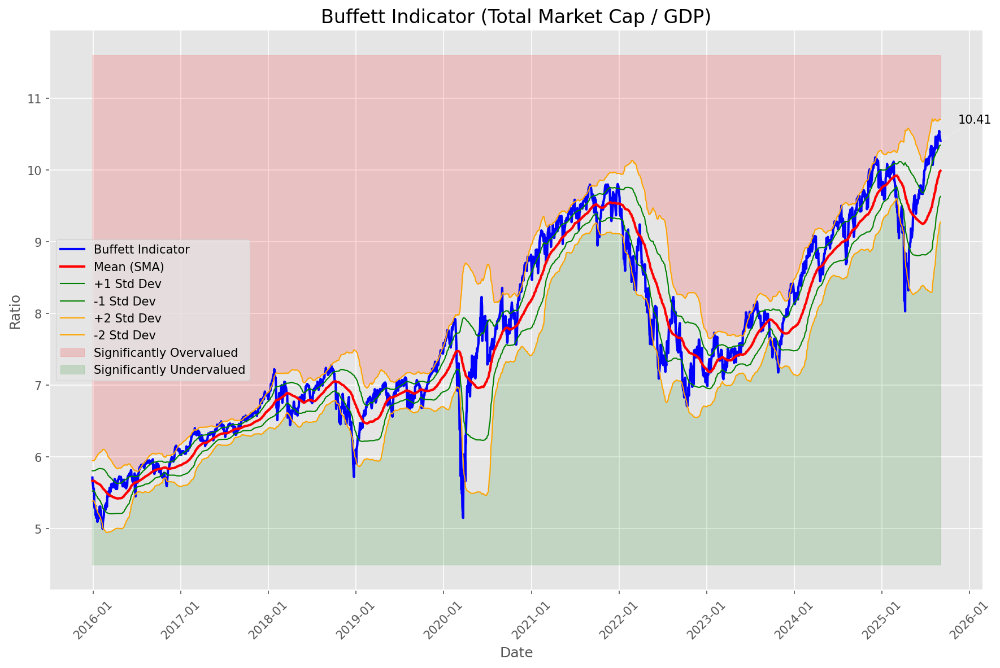
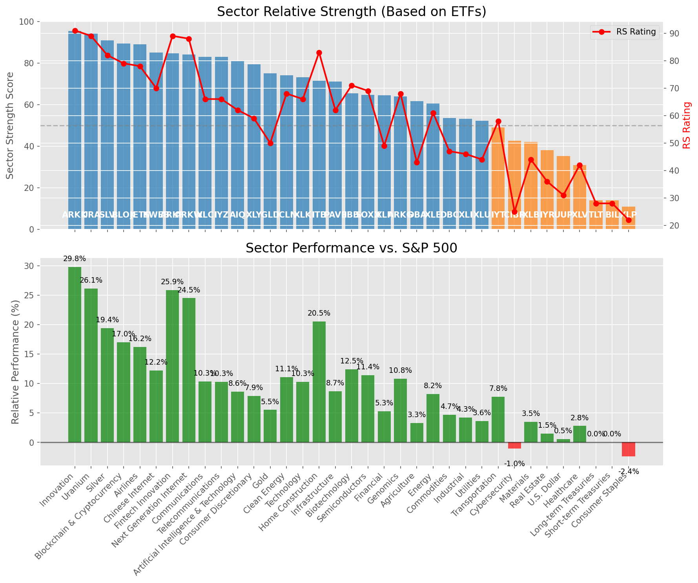

# **Daily Relative Strength Report**

**Date:** 2025-09-03

## **Market Valuation (Buffett Indicator)**

| Metric | Value |
|--------|-------|
| **Market Valuation** | **Overvalued** |
| **Current Ratio** | 10.45 |
| **Historical Mean** | 9.99 |
| **Standard Deviation** | 0.36 |
| **Z-Score (StdDev from Mean)** | 1.18 |
| **Total Market Cap** | $317.30 trillion |
| **GDP** | $30.35 trillion |

## **Market Insights**

### **Market is Overvalued**

The market appears to be trading above historical average valuations. While not at extreme levels, this suggests more modest future returns may be expected. Investors should:

- Focus on companies with reasonable valuations relative to their growth
- Be more selective with new positions
- Look for stocks showing relative strength within their sectors
- Consider trimming positions in extremely overvalued names

Historically, periods of mild overvaluation can persist for extended periods, but returns tend to be below average.

### **Buffett Indicator Overview**

The Buffett Indicator (Total Market Cap / GDP) is a measure of the stock market's valuation relative to the size of the economy. It is named after Warren Buffett, who described it as "probably the best single measure of where valuations stand at any given moment."

- **Values above +2 standard deviations:** Market significantly overvalued
- **Values above +1 standard deviation:** Market overvalued
- **Values between -1 and +1 standard deviations:** Market fairly valued
- **Values below -1 standard deviation:** Market undervalued
- **Values below -2 standard deviations:** Market significantly undervalued

---

## **Sector Relative Strength**

Based on William O'Neil's Relative Strength Methodology

| ETF | Strength | RS Rating | Performance | Above Key MAs | Trend | Sector |
|-----|----------|-----------|-------------|--------------|-------|--------|
| [ARKK](https://www.tradingview.com/chart/?symbol=ARKK) | 95.5 | 91.0 | 29.82% | 10d ✓, 50d ✓, 200d ✓ | ↗️ | Innovation |
| [URA](https://www.tradingview.com/chart/?symbol=URA) | 94.5 | 89.0 | 26.12% | 10d ✓, 50d ✓, 200d ✓ | ↗️ | Uranium |
| [SLV](https://www.tradingview.com/chart/?symbol=SLV) | 91.0 | 82.0 | 19.40% | 10d ✓, 50d ✓, 200d ✓ | ↗️ | Silver |
| [BLOK](https://www.tradingview.com/chart/?symbol=BLOK) | 89.5 | 79.0 | 17.03% | 10d ✓, 50d ✓, 200d ✓ | ↗️ | Blockchain & Cryptocurrency |
| [JETS](https://www.tradingview.com/chart/?symbol=JETS) | 89.0 | 78.0 | 16.24% | 10d ✓, 50d ✓, 200d ✓ | ↗️ | Airlines |
| [KWEB](https://www.tradingview.com/chart/?symbol=KWEB) | 85.0 | 70.0 | 12.22% | 10d ✓, 50d ✓, 200d ✓ | ↗️ | Chinese Internet |
| [ARKF](https://www.tradingview.com/chart/?symbol=ARKF) | 84.6 | 89.0 | 25.91% | 10d ✗, 50d ✓, 200d ✓ | ↗️ | Fintech Innovation |
| [ARKW](https://www.tradingview.com/chart/?symbol=ARKW) | 84.1 | 88.0 | 24.51% | 10d ✗, 50d ✓, 200d ✓ | ↗️ | Next Generation Internet |
| [XLC](https://www.tradingview.com/chart/?symbol=XLC) | 83.0 | 66.0 | 10.35% | 10d ✓, 50d ✓, 200d ✓ | ↗️ | Communications |
| [IYZ](https://www.tradingview.com/chart/?symbol=IYZ) | 83.0 | 66.0 | 10.29% | 10d ✓, 50d ✓, 200d ✓ | ↗️ | Telecommunications |
| [AIQ](https://www.tradingview.com/chart/?symbol=AIQ) | 81.0 | 62.0 | 8.60% | 10d ✓, 50d ✓, 200d ✓ | ↗️ | Artificial Intelligence & Technology |
| [XLY](https://www.tradingview.com/chart/?symbol=XLY) | 79.5 | 59.0 | 7.90% | 10d ✓, 50d ✓, 200d ✓ | ↗️ | Consumer Discretionary |
| [GLD](https://www.tradingview.com/chart/?symbol=GLD) | 75.0 | 50.0 | 5.53% | 10d ✓, 50d ✓, 200d ✓ | ↗️ | Gold |
| [ICLN](https://www.tradingview.com/chart/?symbol=ICLN) | 74.1 | 68.0 | 11.09% | 10d ✗, 50d ✓, 200d ✓ | ↗️ | Clean Energy |
| [XLK](https://www.tradingview.com/chart/?symbol=XLK) | 73.1 | 66.0 | 10.31% | 10d ✗, 50d ✓, 200d ✓ | ↗️ | Technology |
| [ITB](https://www.tradingview.com/chart/?symbol=ITB) | 71.5 | 83.0 | 20.53% | 10d ✓, 50d ✓, 200d ✓ | ↘️ | Home Construction |
| [PAVE](https://www.tradingview.com/chart/?symbol=PAVE) | 71.1 | 62.0 | 8.68% | 10d ✗, 50d ✓, 200d ✓ | ↗️ | Infrastructure |
| [IBB](https://www.tradingview.com/chart/?symbol=IBB) | 65.5 | 71.0 | 12.45% | 10d ✓, 50d ✓, 200d ✓ | ↘️ | Biotechnology |
| [SOXX](https://www.tradingview.com/chart/?symbol=SOXX) | 64.7 | 69.0 | 11.44% | 10d ✗, 50d ✗, 200d ✓ | ↗️ | Semiconductors |
| [XLF](https://www.tradingview.com/chart/?symbol=XLF) | 64.6 | 49.0 | 5.27% | 10d ✗, 50d ✓, 200d ✓ | ↗️ | Financial |
| [ARKG](https://www.tradingview.com/chart/?symbol=ARKG) | 64.0 | 68.0 | 10.84% | 10d ✓, 50d ✓, 200d ✓ | ↘️ | Genomics |
| [DBA](https://www.tradingview.com/chart/?symbol=DBA) | 61.6 | 43.0 | 3.31% | 10d ✗, 50d ✓, 200d ✓ | ↗️ | Agriculture |
| [XLE](https://www.tradingview.com/chart/?symbol=XLE) | 60.5 | 61.0 | 8.24% | 10d ✓, 50d ✓, 200d ✓ | ↘️ | Energy |
| [DBC](https://www.tradingview.com/chart/?symbol=DBC) | 53.5 | 47.0 | 4.68% | 10d ✓, 50d ✓, 200d ✓ | ↘️ | Commodities |
| [XLI](https://www.tradingview.com/chart/?symbol=XLI) | 53.2 | 46.0 | 4.26% | 10d ✗, 50d ✗, 200d ✓ | ↗️ | Industrial |
| [XLU](https://www.tradingview.com/chart/?symbol=XLU) | 52.2 | 44.0 | 3.61% | 10d ✗, 50d ✗, 200d ✓ | ↗️ | Utilities |
| [IYT](https://www.tradingview.com/chart/?symbol=IYT) | 49.1 | 58.0 | 7.79% | 10d ✗, 50d ✓, 200d ✓ | ↘️ | Transportation |
| [CIBR](https://www.tradingview.com/chart/?symbol=CIBR) | 42.7 | 25.0 | -1.04% | 10d ✗, 50d ✗, 200d ✓ | ↗️ | Cybersecurity |
| [XLB](https://www.tradingview.com/chart/?symbol=XLB) | 42.1 | 44.0 | 3.47% | 10d ✗, 50d ✓, 200d ✓ | ↘️ | Materials |
| [IYR](https://www.tradingview.com/chart/?symbol=IYR) | 38.1 | 36.0 | 1.52% | 10d ✗, 50d ✓, 200d ✓ | ↘️ | Real Estate |
| [UUP](https://www.tradingview.com/chart/?symbol=UUP) | 35.3 | 31.0 | 0.55% | 10d ✓, 50d ✓, 200d ✗ | ↘️ | U.S. Dollar |
| [XLV](https://www.tradingview.com/chart/?symbol=XLV) | 30.9 | 42.0 | 2.80% | 10d ✗, 50d ✓, 200d ✗ | ↘️ | Healthcare |
| [TLT](https://www.tradingview.com/chart/?symbol=TLT) | 14.0 | 28.0 | 0.03% | 10d ✗, 50d ✗, 200d ✗ | ↘️ | Long-term Treasuries |
| [BIL](https://www.tradingview.com/chart/?symbol=BIL) | 14.0 | 28.0 | 0.02% | 10d ✗, 50d ✗, 200d ✗ | ↘️ | Short-term Treasuries |
| [XLP](https://www.tradingview.com/chart/?symbol=XLP) | 11.0 | 22.0 | -2.37% | 10d ✗, 50d ✗, 200d ✗ | ↘️ | Consumer Staples |

### **Sector ETF Performance Interpretation**

This table shows the relative strength metrics for different market sectors based on their representative ETFs:

- **ETF**: The ETF used to measure sector performance (click for chart)
- **Strength**: Overall sector strength score (0-100) combining multiple factors
- **RS Rating**: O'Neil RS rating of the sector ETF
- **Performance**: Performance of the sector ETF relative to SPY
- **Above Key MAs**: Whether the ETF is trading above its 10, 50, and 200-day moving averages
- **Trend**: Whether the sector is in an uptrend (↗️) or downtrend (↘️)

### **Current Sector Leadership**

The current market leadership is coming from the following sectors: **Innovation, Uranium, Silver**.

The **Innovation** sector (represented by **ARKK**) is showing particularly strong relative strength with an RS rating of 91.0 and performance of 29.82% vs. the S&P 500. This sector is trading above its 10-day, 50-day, 200-day moving average(s). Investors should consider focusing on high RS stocks within these leading sectors for potential outperformance.

---

## **Buy Recommendations**

The following 49 stocks show exceptional relative strength:

| RS Rating | Buy Score | Current Price | Chart | Name | Ticker |
|-----------|-----------|---------------|-------|------|--------|
| 100 | 100 | $75.39 | [Chart](https://www.tradingview.com/chart/?symbol=MIRM) | Mirum Pharmaceuticals, Inc. Common Stock | MIRM |
| 100 | 100 | $211.63 | [Chart](https://www.tradingview.com/chart/?symbol=CLS) | Celestica, Inc. | CLS |
| 100 | 100 | $52.42 | [Chart](https://www.tradingview.com/chart/?symbol=BE) | Bloom Energy Corporation | BE |
| 100 | 100 | $144.65 | [Chart](https://www.tradingview.com/chart/?symbol=INSM) | Insmed, Inc. | INSM |
| 99 | 100 | $66.61 | [Chart](https://www.tradingview.com/chart/?symbol=KTOS) | Kratos Defense & Security Solutions, Inc. | KTOS |
| 99 | 100 | $29.46 | [Chart](https://www.tradingview.com/chart/?symbol=LQDA) | Liquidia Corporation Common Stock | LQDA |
| 99 | 100 | $125.64 | [Chart](https://www.tradingview.com/chart/?symbol=CRDO) | Credo Technology Group Holding Ltd Ordinary Shares | CRDO |
| 98 | 100 | $25.33 | [Chart](https://www.tradingview.com/chart/?symbol=MGNI) | Magnite, Inc. Common Stock | MGNI |
| 97 | 100 | $207.85 | [Chart](https://www.tradingview.com/chart/?symbol=LEU) | Centrus Energy Corp. | LEU |
| 97 | 100 | $132.10 | [Chart](https://www.tradingview.com/chart/?symbol=RBLX) | Roblox Corporation | RBLX |
| 96 | 100 | $46.34 | [Chart](https://www.tradingview.com/chart/?symbol=TTMI) | TTM Technologies Inc | TTMI |
| 95 | 100 | $69.47 | [Chart](https://www.tradingview.com/chart/?symbol=GLW) | Corning Incorporated | GLW |
| 94 | 100 | $51.92 | [Chart](https://www.tradingview.com/chart/?symbol=BBIO) | BridgeBio Pharma, Inc. Common Stock | BBIO |
| 94 | 100 | $42.54 | [Chart](https://www.tradingview.com/chart/?symbol=SMR) | NuScale Power Corporation | SMR |
| 93 | 100 | $357.05 | [Chart](https://www.tradingview.com/chart/?symbol=RCL) | Royal Caribbean Group | RCL |
| 93 | 100 | $99.26 | [Chart](https://www.tradingview.com/chart/?symbol=TPB) | Turning Point Brands, Inc. | TPB |
| 92 | 100 | $117.09 | [Chart](https://www.tradingview.com/chart/?symbol=SANM) | Sanmina  Corp | SANM |
| 92 | 100 | $18.21 | [Chart](https://www.tradingview.com/chart/?symbol=VNM) | VanEck Vietnam ETF | VNM |
| 92 | 100 | $61.36 | [Chart](https://www.tradingview.com/chart/?symbol=SIL) | Global X Silver Miners ETF (NEW) | SIL |
| 92 | 100 | $97.32 | [Chart](https://www.tradingview.com/chart/?symbol=LLYVK) | Liberty Media Corporation Series C Liberty Live Common Stock | LLYVK |
| 92 | 100 | $62.72 | [Chart](https://www.tradingview.com/chart/?symbol=VIK) | Viking Holdings Ltd | VIK |
| 92 | 100 | $51.62 | [Chart](https://www.tradingview.com/chart/?symbol=LTM) | LATAM Airlines Group S.A. American Depositary Shares (each representing two thousand (2,000) shares of Common Stock) | LTM |
| 91 | 100 | $58.75 | [Chart](https://www.tradingview.com/chart/?symbol=DFEN) | Direxion Daily Aerospace & Defense Bull 3X Shares | DFEN |
| 91 | 100 | $60.11 | [Chart](https://www.tradingview.com/chart/?symbol=AU) | AngloGold Ashanti plc | AU |
| 91 | 100 | $34.41 | [Chart](https://www.tradingview.com/chart/?symbol=PAAS) | Pan American Silver Corp. | PAAS |
| 91 | 100 | $131.11 | [Chart](https://www.tradingview.com/chart/?symbol=PPLT) | abrdn Physical Platinum Shares ETF | PPLT |
| 91 | 100 | $75.27 | [Chart](https://www.tradingview.com/chart/?symbol=ARKK) | ARK Innovation ETF | ARKK |
| 90 | 100 | $60.87 | [Chart](https://www.tradingview.com/chart/?symbol=BBW) | Build-A-Bear Workshop, Inc. | BBW |
| 89 | 100 | $106.06 | [Chart](https://www.tradingview.com/chart/?symbol=VRNA) | Verona Pharma plc | VRNA |
| 89 | 100 | $163.80 | [Chart](https://www.tradingview.com/chart/?symbol=VSEC) | VSE Corp | VSEC |
| 88 | 100 | $277.49 | [Chart](https://www.tradingview.com/chart/?symbol=IDCC) | InterDigital, Inc. | IDCC |
| 88 | 100 | $28.06 | [Chart](https://www.tradingview.com/chart/?symbol=LAUR) | Laureate Education, Inc. Common Stock | LAUR |
| 88 | 100 | $53.78 | [Chart](https://www.tradingview.com/chart/?symbol=REVG) | REV Group, Inc. | REVG |
| 87 | 100 | $160.67 | [Chart](https://www.tradingview.com/chart/?symbol=PLTR) | Palantir Technologies Inc. Class A Common Stock | PLTR |
| 86 | 100 | $102.70 | [Chart](https://www.tradingview.com/chart/?symbol=SNEX) | StoneX Group Inc. Common Stock | SNEX |
| 89 | 99 | $18.37 | [Chart](https://www.tradingview.com/chart/?symbol=ARLO) | Arlo Technologies, Inc. | ARLO |
| 88 | 99 | $16.65 | [Chart](https://www.tradingview.com/chart/?symbol=EZPW) | Ezcorp Inc | EZPW |
| 87 | 99 | $63.63 | [Chart](https://www.tradingview.com/chart/?symbol=IBKR) | Interactive Brokers Group, Inc. Class A Common Stock | IBKR |
| 87 | 99 | $38.90 | [Chart](https://www.tradingview.com/chart/?symbol=ATAT) | Atour Lifestyle Holdings Limited American Depositary Shares | ATAT |
| 85 | 99 | $175.08 | [Chart](https://www.tradingview.com/chart/?symbol=IRTC) | iRhythm Technologies, Inc | IRTC |
| 86 | 97 | $24.82 | [Chart](https://www.tradingview.com/chart/?symbol=MAG) | MAG Silver Corp. | MAG |
| 84 | 97 | $207.14 | [Chart](https://www.tradingview.com/chart/?symbol=NET) | Cloudflare, Inc. Class A common stock, par value $0.001 per share | NET |
| 85 | 95 | $31.48 | [Chart](https://www.tradingview.com/chart/?symbol=PHR) | Phreesia, Inc. | PHR |
| 83 | 95 | $260.11 | [Chart](https://www.tradingview.com/chart/?symbol=BAP) | Credicorp LTD | BAP |
| 84 | 94 | $126.18 | [Chart](https://www.tradingview.com/chart/?symbol=BPOP) | Popular Inc | BPOP |
| 83 | 94 | $13.87 | [Chart](https://www.tradingview.com/chart/?symbol=PSLV) | Sprott Physical Silver Trust | PSLV |
| 81 | 94 | $104.97 | [Chart](https://www.tradingview.com/chart/?symbol=BK) | Bank of New York Mellon Corporation | BK |
| 82 | 92 | $495.50 | [Chart](https://www.tradingview.com/chart/?symbol=APP) | Applovin Corporation Class A Common Stock | APP |
| 80 | 91 | $149.48 | [Chart](https://www.tradingview.com/chart/?symbol=FCFS) | FirstCash Holdings, Inc. Common Stock | FCFS |

---

## **Sell Recommendations**

The following 221 stocks show deteriorating relative strength:

| RS Rating | Sell Score | Current Price | Chart | Name | Ticker |
|-----------|------------|---------------|-------|------|--------|
| 1 | 100 | $87.65 | [Chart](https://www.tradingview.com/chart/?symbol=INSP) | Inspire Medical Systems, Inc. | INSP |
| 1 | 100 | $19.44 | [Chart](https://www.tradingview.com/chart/?symbol=ZSL) | ProShares UltraShort Silver | ZSL |
| 2 | 100 | $21.46 | [Chart](https://www.tradingview.com/chart/?symbol=CLW) | Clearwater Paper Corporation | CLW |
| 2 | 100 | $44.64 | [Chart](https://www.tradingview.com/chart/?symbol=PRGS) | Progress Software Corp (DE) | PRGS |
| 3 | 100 | $27.06 | [Chart](https://www.tradingview.com/chart/?symbol=BRZE) | Braze, Inc. Class A Common Stock | BRZE |
| 3 | 100 | $53.22 | [Chart](https://www.tradingview.com/chart/?symbol=HAE) | Haemonetics Corporation | HAE |
| 3 | 100 | $36.79 | [Chart](https://www.tradingview.com/chart/?symbol=TWM) | ProShares UltraShort Russell2000 | TWM |
| 3 | 100 | $24.56 | [Chart](https://www.tradingview.com/chart/?symbol=TECS) | Direxion Daily Technology Bear 3x Shares | TECS |
| 3 | 100 | $44.90 | [Chart](https://www.tradingview.com/chart/?symbol=ONON) | On Holding AG | ONON |
| 3 | 100 | $35.77 | [Chart](https://www.tradingview.com/chart/?symbol=IOT) | Samsara Inc. | IOT |
| 3 | 100 | $82.93 | [Chart](https://www.tradingview.com/chart/?symbol=GSHD) | Goosehead Insurance, Inc. Class A Common Stock | GSHD |
| 4 | 100 | $251.83 | [Chart](https://www.tradingview.com/chart/?symbol=ACN) | Accenture PLC | ACN |
| 4 | 100 | $17.01 | [Chart](https://www.tradingview.com/chart/?symbol=DJT) | Trump Media & Technology Group Corp. Common Stock | DJT |
| 4 | 100 | $34.35 | [Chart](https://www.tradingview.com/chart/?symbol=VCEL) | Vericel Corporation | VCEL |
| 4 | 100 | $10.77 | [Chart](https://www.tradingview.com/chart/?symbol=CHPT) | ChargePoint Holdings, Inc. | CHPT |
| 4 | 100 | $42.61 | [Chart](https://www.tradingview.com/chart/?symbol=OXM) | Oxford Industries, Inc. | OXM |
| 5 | 100 | $44.50 | [Chart](https://www.tradingview.com/chart/?symbol=CE) | Celanese Corporation Common Stock | CE |
| 5 | 100 | $13.47 | [Chart](https://www.tradingview.com/chart/?symbol=ZIM) | ZIM Integrated Shipping Services Ltd. | ZIM |
| 5 | 100 | $15.28 | [Chart](https://www.tradingview.com/chart/?symbol=PRO) | Pros Holdings, Inc. | PRO |
| 5 | 100 | $180.18 | [Chart](https://www.tradingview.com/chart/?symbol=MKTX) | MarketAxess Holdings Inc. | MKTX |
| 5 | 100 | $66.08 | [Chart](https://www.tradingview.com/chart/?symbol=CAVA) | CAVA Group, Inc. | CAVA |
| 6 | 100 | $344.38 | [Chart](https://www.tradingview.com/chart/?symbol=ADBE) | Adobe Inc. | ADBE |
| 6 | 100 | $17.04 | [Chart](https://www.tradingview.com/chart/?symbol=ADMA) | ADMA Biologics, Inc. | ADMA |
| 6 | 100 | $38.86 | [Chart](https://www.tradingview.com/chart/?symbol=SDOW) | ProShares UltraPro Short Dow 30 | SDOW |
| 6 | 100 | $763.53 | [Chart](https://www.tradingview.com/chart/?symbol=EQIX) | Equinix, Inc. Common Stock REIT | EQIX |
| 6 | 100 | $37.11 | [Chart](https://www.tradingview.com/chart/?symbol=RHI) | Robert Half Inc. | RHI |
| 6 | 100 | $10.83 | [Chart](https://www.tradingview.com/chart/?symbol=PATH) | UiPath, Inc. | PATH |
| 7 | 100 | $12.81 | [Chart](https://www.tradingview.com/chart/?symbol=SEM) | SELECT MEDICAL HOLDINGS CORP | SEM |
| 7 | 100 | $31.61 | [Chart](https://www.tradingview.com/chart/?symbol=YELP) | YELP INC. | YELP |
| 7 | 100 | $65.75 | [Chart](https://www.tradingview.com/chart/?symbol=IFF) | International Flavors & Fragrances Inc. | IFF |
| 7 | 100 | $20.98 | [Chart](https://www.tradingview.com/chart/?symbol=ERY) | Direxion Daily Energy Bear 2X Shares | ERY |
| 7 | 100 | $23.39 | [Chart](https://www.tradingview.com/chart/?symbol=WSC) | WillScot Holdings Corporation Class A Common Stock | WSC |
| 7 | 100 | $28.64 | [Chart](https://www.tradingview.com/chart/?symbol=SMPL) | The Simply Good Foods Company Common Stock | SMPL |
| 7 | 100 | $57.46 | [Chart](https://www.tradingview.com/chart/?symbol=ATKR) | Atkore Inc. | ATKR |
| 8 | 100 | $19.84 | [Chart](https://www.tradingview.com/chart/?symbol=AVBP) | ArriVent BioPharma, Inc. Common Stock | AVBP |
| 8 | 100 | $10.00 | [Chart](https://www.tradingview.com/chart/?symbol=TWO) | Two Harbors Investment Corp. | TWO |
| 8 | 100 | $28.55 | [Chart](https://www.tradingview.com/chart/?symbol=BF.B) | Brown-Forman Corporation Class B | BF.B |
| 8 | 100 | $45.35 | [Chart](https://www.tradingview.com/chart/?symbol=SLVM) | Sylvamo Corporation | SLVM |
| 8 | 100 | $368.88 | [Chart](https://www.tradingview.com/chart/?symbol=FDS) | Factset Research Systems | FDS |
| 8 | 100 | $13.74 | [Chart](https://www.tradingview.com/chart/?symbol=XRAY) | DENTSPLY SIRONA Inc. | XRAY |
| 8 | 100 | $20.08 | [Chart](https://www.tradingview.com/chart/?symbol=RPD) | Rapid7, Inc. Common Stock | RPD |
| 9 | 100 | $35.91 | [Chart](https://www.tradingview.com/chart/?symbol=LZB) | La-Z-Boy Incorporated | LZB |
| 9 | 100 | $16.43 | [Chart](https://www.tradingview.com/chart/?symbol=BTAL) | AGF U.S. Market Neutral Anti-Beta Fund | BTAL |
| 9 | 100 | $24.27 | [Chart](https://www.tradingview.com/chart/?symbol=GDEN) | Golden Entertainment, Inc. Common Stock | GDEN |
| 9 | 100 | $44.54 | [Chart](https://www.tradingview.com/chart/?symbol=POWI) | Power Integrations Inc | POWI |
| 9 | 100 | $11.49 | [Chart](https://www.tradingview.com/chart/?symbol=MRTN) | Marten Transport Ltd | MRTN |
| 9 | 100 | $15.36 | [Chart](https://www.tradingview.com/chart/?symbol=MCS) | The Marcus Corporation | MCS |
| 10 | 100 | $88.83 | [Chart](https://www.tradingview.com/chart/?symbol=IRM) | Iron Mountain Inc. | IRM |
| 10 | 100 | $37.27 | [Chart](https://www.tradingview.com/chart/?symbol=FMC) | FMC Corporation | FMC |
| 10 | 100 | $237.45 | [Chart](https://www.tradingview.com/chart/?symbol=EFX) | Equifax, Incorporated | EFX |
| 11 | 100 | $23.72 | [Chart](https://www.tradingview.com/chart/?symbol=EPC) | Edgewell Personal Care Company | EPC |
| 11 | 100 | $23.52 | [Chart](https://www.tradingview.com/chart/?symbol=CRTO) | Criteo S.A. | CRTO |
| 11 | 100 | $106.97 | [Chart](https://www.tradingview.com/chart/?symbol=ITGR) | Integer Holdings Corporation | ITGR |
| 11 | 100 | $160.98 | [Chart](https://www.tradingview.com/chart/?symbol=IEX) | IDEX Corporation | IEX |
| 12 | 100 | $102.28 | [Chart](https://www.tradingview.com/chart/?symbol=MATX) | Matsons, Inc. | MATX |
| 12 | 100 | $151.97 | [Chart](https://www.tradingview.com/chart/?symbol=ZTS) | ZOETIS INC. | ZTS |
| 12 | 100 | $100.39 | [Chart](https://www.tradingview.com/chart/?symbol=BNTX) | BioNTech SE American Depositary Share | BNTX |
| 12 | 100 | $49.23 | [Chart](https://www.tradingview.com/chart/?symbol=GIS) | General Mills, Inc. | GIS |
| 12 | 100 | $15.16 | [Chart](https://www.tradingview.com/chart/?symbol=UMH) | UMH Properties, Inc. | UMH |
| 13 | 100 | $25.81 | [Chart](https://www.tradingview.com/chart/?symbol=NOG) | Northern Oil and Gas, Inc. | NOG |
| 13 | 100 | $30.24 | [Chart](https://www.tradingview.com/chart/?symbol=INVH) | Invitation Homes Inc. Common Stock | INVH |
| 13 | 100 | $10.02 | [Chart](https://www.tradingview.com/chart/?symbol=SPDN) | Direxion Daily S&P 500 Bear 1X Shares | SPDN |
| 13 | 100 | $22.98 | [Chart](https://www.tradingview.com/chart/?symbol=JANX) | Janux Therapeutics, Inc. Common Stock | JANX |
| 14 | 100 | $22.71 | [Chart](https://www.tradingview.com/chart/?symbol=DIN) | Dine Brands Global, Inc. | DIN |
| 14 | 100 | $14.24 | [Chart](https://www.tradingview.com/chart/?symbol=DXC) | DXC Technology Company | DXC |
| 15 | 100 | $38.57 | [Chart](https://www.tradingview.com/chart/?symbol=SH) | ProShares Short S&P500 | SH |
| 15 | 100 | $15.17 | [Chart](https://www.tradingview.com/chart/?symbol=CHCT) | Community Healthcare Trust Incorporated Common Stock, $0.01 par value per share | CHCT |
| 15 | 100 | $64.08 | [Chart](https://www.tradingview.com/chart/?symbol=EQR) | Equity Residential | EQR |
| 15 | 100 | $17.01 | [Chart](https://www.tradingview.com/chart/?symbol=CTO) | CTO Realty Growth, Inc. | CTO |
| 16 | 100 | $41.38 | [Chart](https://www.tradingview.com/chart/?symbol=WHD) | Cactus, Inc. | WHD |
| 16 | 100 | $25.63 | [Chart](https://www.tradingview.com/chart/?symbol=FCPT) | Four Corners Property Trust, Inc. | FCPT |
| 2 | 99 | $261.06 | [Chart](https://www.tradingview.com/chart/?symbol=CHTR) | Charter Comm Inc Del CL A New | CHTR |
| 8 | 99 | $95.08 | [Chart](https://www.tradingview.com/chart/?symbol=BRO) | Brown & Brown, Inc. | BRO |
| 9 | 99 | $372.66 | [Chart](https://www.tradingview.com/chart/?symbol=MUSA) | MURPHY USA INC. | MUSA |
| 14 | 99 | $30.90 | [Chart](https://www.tradingview.com/chart/?symbol=CDRE) | Cadre Holdings, Inc. | CDRE |
| 17 | 99 | $24.80 | [Chart](https://www.tradingview.com/chart/?symbol=WY) | Weyerhaeuser Company | WY |
| 21 | 99 | $17.29 | [Chart](https://www.tradingview.com/chart/?symbol=SVOL) | Simplify Volatility Premium ETF | SVOL |
| 7 | 98 | $67.99 | [Chart](https://www.tradingview.com/chart/?symbol=FIS) | Fidelity National Information Services, Inc. | FIS |
| 13 | 98 | $161.27 | [Chart](https://www.tradingview.com/chart/?symbol=DLR) | Digital Realty Trust, Inc. | DLR |
| 13 | 98 | $49.57 | [Chart](https://www.tradingview.com/chart/?symbol=DT) | Dynatrace, Inc. | DT |
| 14 | 98 | $20.61 | [Chart](https://www.tradingview.com/chart/?symbol=TDC) | TERADATA CORPORATION | TDC |
| 14 | 98 | $108.58 | [Chart](https://www.tradingview.com/chart/?symbol=CPT) | Camden Property Trust | CPT |
| 14 | 98 | $138.34 | [Chart](https://www.tradingview.com/chart/?symbol=OLED) | Universal Display Corp | OLED |
| 17 | 98 | $169.31 | [Chart](https://www.tradingview.com/chart/?symbol=AVY) | Avery Dennison Corp. | AVY |
| 18 | 98 | $142.34 | [Chart](https://www.tradingview.com/chart/?symbol=EXR) | Extra Space Storage, Inc. | EXR |
| 23 | 98 | $85.78 | [Chart](https://www.tradingview.com/chart/?symbol=BCC) | Boise Cascade Company | BCC |
| 4 | 97 | $471.02 | [Chart](https://www.tradingview.com/chart/?symbol=HUBS) | HUBSPOT, INC. | HUBS |
| 11 | 97 | $85.67 | [Chart](https://www.tradingview.com/chart/?symbol=OTIS) | Otis Worldwide Corporation | OTIS |
| 11 | 97 | $26.76 | [Chart](https://www.tradingview.com/chart/?symbol=SARO) | StandardAero, Inc. | SARO |
| 12 | 97 | $28.43 | [Chart](https://www.tradingview.com/chart/?symbol=FORM) | FormFactor Inc. | FORM |
| 15 | 97 | $189.59 | [Chart](https://www.tradingview.com/chart/?symbol=AVB) | AvalonBay Communities, Inc. | AVB |
| 22 | 97 | $144.80 | [Chart](https://www.tradingview.com/chart/?symbol=HLNE) | Hamilton Lane Incorporated Class A Common Stock | HLNE |
| 11 | 96 | $31.21 | [Chart](https://www.tradingview.com/chart/?symbol=KVYO) | Klaviyo, Inc. | KVYO |
| 13 | 96 | $45.20 | [Chart](https://www.tradingview.com/chart/?symbol=TRUP) | Trupanion, Inc. | TRUP |
| 15 | 96 | $260.60 | [Chart](https://www.tradingview.com/chart/?symbol=ESS) | Essex Property Trust, Inc | ESS |
| 15 | 96 | $83.51 | [Chart](https://www.tradingview.com/chart/?symbol=CL) | Colgate-Palmolive Company | CL |
| 15 | 96 | $92.39 | [Chart](https://www.tradingview.com/chart/?symbol=CHD) | Church & Dwight Co., Inc. | CHD |
| 16 | 96 | $142.35 | [Chart](https://www.tradingview.com/chart/?symbol=MAA) | Mid-America Apartment Communities, Inc. | MAA |
| 16 | 96 | $73.49 | [Chart](https://www.tradingview.com/chart/?symbol=AWR) | American States Water Company | AWR |
| 18 | 96 | $69.17 | [Chart](https://www.tradingview.com/chart/?symbol=PYPL) | PayPal Holdings, Inc. Common Stock | PYPL |
| 18 | 96 | $29.58 | [Chart](https://www.tradingview.com/chart/?symbol=CNX) | CNX Resources Corporation | CNX |
| 19 | 96 | $40.96 | [Chart](https://www.tradingview.com/chart/?symbol=LINE) | Lineage, Inc. Common Stock | LINE |
| 5 | 95 | $170.69 | [Chart](https://www.tradingview.com/chart/?symbol=TEAM) | Atlassian Corporation Class A Common Stock | TEAM |
| 10 | 95 | $15.99 | [Chart](https://www.tradingview.com/chart/?symbol=FA) | First Advantage Corporation Common Stock | FA |
| 11 | 95 | $71.22 | [Chart](https://www.tradingview.com/chart/?symbol=CTSH) | Cognizant Technology Solutions | CTSH |
| 14 | 95 | $13.32 | [Chart](https://www.tradingview.com/chart/?symbol=GOOD) | Gladstone Commercial Corporation - REIT | GOOD |
| 15 | 95 | $34.54 | [Chart](https://www.tradingview.com/chart/?symbol=AMH) | AMERICAN HOMES 4 RENT | AMH |
| 15 | 95 | $38.12 | [Chart](https://www.tradingview.com/chart/?symbol=UDR) | UDR, Inc. | UDR |
| 16 | 95 | $56.68 | [Chart](https://www.tradingview.com/chart/?symbol=SLG) | SL Green Realty Corp. | SLG |
| 18 | 95 | $77.71 | [Chart](https://www.tradingview.com/chart/?symbol=IR) | Ingersoll Rand Inc. Common Stock | IR |
| 19 | 95 | $30.81 | [Chart](https://www.tradingview.com/chart/?symbol=EPRT) | Essential Properties Realty Trust, Inc. | EPRT |
| 10 | 94 | $204.85 | [Chart](https://www.tradingview.com/chart/?symbol=MMC) | Marsh & McLennan Companies, Inc. | MMC |
| 10 | 94 | $395.15 | [Chart](https://www.tradingview.com/chart/?symbol=WSO) | Watsco, Inc. | WSO |
| 13 | 94 | $116.82 | [Chart](https://www.tradingview.com/chart/?symbol=CHH) | Choice Hotels Intnl. | CHH |
| 14 | 94 | $148.32 | [Chart](https://www.tradingview.com/chart/?symbol=ODFL) | Old Dominion Freight Line | ODFL |
| 14 | 94 | $127.66 | [Chart](https://www.tradingview.com/chart/?symbol=KMB) | Kimberly-Clark Corp. | KMB |
| 16 | 94 | $14.93 | [Chart](https://www.tradingview.com/chart/?symbol=OSPN) | OneSpan Inc. Common Stock | OSPN |
| 19 | 94 | $10.41 | [Chart](https://www.tradingview.com/chart/?symbol=OEC) | Orion S.A. | OEC |
| 19 | 94 | $10.06 | [Chart](https://www.tradingview.com/chart/?symbol=NMZ) | Nuveen Municipal High Income Opportunity Fund | NMZ |
| 8 | 93 | $16.85 | [Chart](https://www.tradingview.com/chart/?symbol=SCO) | ProShares UltraShort Bloomberg Crude Oil | SCO |
| 9 | 93 | $62.43 | [Chart](https://www.tradingview.com/chart/?symbol=QSR) | Restaurant Brands International Inc. | QSR |
| 10 | 93 | $33.14 | [Chart](https://www.tradingview.com/chart/?symbol=GFS) | GlobalFoundries Inc. Ordinary Shares | GFS |
| 11 | 93 | $23.39 | [Chart](https://www.tradingview.com/chart/?symbol=PRGO) | PERRIGO COMPANY PLC | PRGO |
| 12 | 93 | $41.11 | [Chart](https://www.tradingview.com/chart/?symbol=FIZZ) | National Beverage Corp. | FIZZ |
| 12 | 93 | $26.24 | [Chart](https://www.tradingview.com/chart/?symbol=FIVN) | FIVE9, INC. | FIVN |
| 13 | 93 | $96.77 | [Chart](https://www.tradingview.com/chart/?symbol=CNI) | Canadian National Railway | CNI |
| 14 | 93 | $73.88 | [Chart](https://www.tradingview.com/chart/?symbol=OKE) | Oneok, Inc. | OKE |
| 17 | 93 | $25.09 | [Chart](https://www.tradingview.com/chart/?symbol=DOG) | ProShares Short Dow30 | DOG |
| 19 | 93 | $20.68 | [Chart](https://www.tradingview.com/chart/?symbol=KVUE) | Kenvue Inc. | KVUE |
| 22 | 93 | $109.07 | [Chart](https://www.tradingview.com/chart/?symbol=PPG) | PPG Industries, Inc. | PPG |
| 8 | 92 | $18.07 | [Chart](https://www.tradingview.com/chart/?symbol=FSK) | FS KKR Capital Corp. Common Stock | FSK |
| 16 | 92 | $18.15 | [Chart](https://www.tradingview.com/chart/?symbol=LOVE) | The Lovesac Company Common Stock | LOVE |
| 17 | 92 | $125.30 | [Chart](https://www.tradingview.com/chart/?symbol=ABNB) | Airbnb, Inc. Class A Common Stock | ABNB |
| 18 | 92 | $49.94 | [Chart](https://www.tradingview.com/chart/?symbol=TAP) | Molson Coors Beverage Company Class B | TAP |
| 18 | 92 | $59.86 | [Chart](https://www.tradingview.com/chart/?symbol=ELS) | Equity Lifestyle Properties, Inc. | ELS |
| 12 | 91 | $14.28 | [Chart](https://www.tradingview.com/chart/?symbol=BV) | BrightView Holdings, Inc. Common Stock | BV |
| 14 | 91 | $60.64 | [Chart](https://www.tradingview.com/chart/?symbol=KMX) | CarMax Inc. | KMX |
| 15 | 91 | $10.67 | [Chart](https://www.tradingview.com/chart/?symbol=FPI) | Farmland Partners Inc. | FPI |
| 23 | 91 | $63.97 | [Chart](https://www.tradingview.com/chart/?symbol=ZROZ) | PIMCO 25+ Year Zero Coupon U.S. Treasury Index Exchange-Traded Fund | ZROZ |
| 23 | 91 | $33.67 | [Chart](https://www.tradingview.com/chart/?symbol=CMCSA) | Comcast Corp | CMCSA |
| 11 | 90 | $909.42 | [Chart](https://www.tradingview.com/chart/?symbol=NOW) | SERVICENOW, INC. | NOW |
| 20 | 90 | $552.49 | [Chart](https://www.tradingview.com/chart/?symbol=TYL) | Tyler Technologies, Inc. | TYL |
| 20 | 90 | $81.12 | [Chart](https://www.tradingview.com/chart/?symbol=AGO) | Assured Guaranty, LTD | AGO |
| 13 | 89 | $52.84 | [Chart](https://www.tradingview.com/chart/?symbol=BL) | BlackLine, Inc. Common Stock | BL |
| 20 | 89 | $735.25 | [Chart](https://www.tradingview.com/chart/?symbol=LLY) | Eli Lilly & Co. | LLY |
| 21 | 89 | $37.81 | [Chart](https://www.tradingview.com/chart/?symbol=VNO) | Vornado Realty Trust | VNO |
| 21 | 89 | $54.31 | [Chart](https://www.tradingview.com/chart/?symbol=LYB) | LyondellBasell Industries N.V. Class A | LYB |
| 21 | 89 | $22.22 | [Chart](https://www.tradingview.com/chart/?symbol=CURB) | Curbline Properties Corp. | CURB |
| 24 | 89 | $175.13 | [Chart](https://www.tradingview.com/chart/?symbol=DOV) | Dover Corporation | DOV |
| 24 | 89 | $39.20 | [Chart](https://www.tradingview.com/chart/?symbol=NMIH) | NMI Holdings Inc. Common Stock | NMIH |
| 16 | 88 | $24.68 | [Chart](https://www.tradingview.com/chart/?symbol=IRDM) | Iridium Communications Inc. | IRDM |
| 16 | 88 | $88.16 | [Chart](https://www.tradingview.com/chart/?symbol=FOUR) | Shift4 Payments, Inc. | FOUR |
| 18 | 88 | $40.56 | [Chart](https://www.tradingview.com/chart/?symbol=CUBE) | CubeSmart | CUBE |
| 18 | 88 | $47.55 | [Chart](https://www.tradingview.com/chart/?symbol=ON) | ON Semiconductor Corp | ON |
| 19 | 88 | $18.17 | [Chart](https://www.tradingview.com/chart/?symbol=OWL) | Blue Owl Capital Inc. | OWL |
| 21 | 88 | $67.99 | [Chart](https://www.tradingview.com/chart/?symbol=HSIC) | Henry Schein Inc | HSIC |
| 23 | 88 | $24.19 | [Chart](https://www.tradingview.com/chart/?symbol=HYMB) | SPDR Nuveen ICE High Yield Municipal Bond ETF | HYMB |
| 25 | 88 | $15.86 | [Chart](https://www.tradingview.com/chart/?symbol=RXO) | RXO, Inc. | RXO |
| 16 | 87 | $127.93 | [Chart](https://www.tradingview.com/chart/?symbol=INGR) | Ingredion Incorporated | INGR |
| 17 | 87 | $50.16 | [Chart](https://www.tradingview.com/chart/?symbol=BALL) | Ball Corporation | BALL |
| 20 | 87 | $42.88 | [Chart](https://www.tradingview.com/chart/?symbol=KNX) | Knight-Swift Transportation Holdings Inc. Class A Common Stock | KNX |
| 22 | 87 | $317.79 | [Chart](https://www.tradingview.com/chart/?symbol=CPAY) | Corpay, Inc. | CPAY |
| 23 | 87 | $21.26 | [Chart](https://www.tradingview.com/chart/?symbol=KMT) | Kennametal Inc. | KMT |
| 24 | 87 | $13.34 | [Chart](https://www.tradingview.com/chart/?symbol=UTZ) | Utz Brands, Inc. | UTZ |
| 24 | 87 | $46.04 | [Chart](https://www.tradingview.com/chart/?symbol=CWT) | California Water Service | CWT |
| 26 | 87 | $136.30 | [Chart](https://www.tradingview.com/chart/?symbol=DVA) | DaVita Inc. | DVA |
| 26 | 87 | $14.79 | [Chart](https://www.tradingview.com/chart/?symbol=VSH) | Vishay Intertechnology, Inc. | VSH |
| 16 | 86 | $76.54 | [Chart](https://www.tradingview.com/chart/?symbol=CP) | Canadian Pacific Kansas City Limited | CP |
| 21 | 86 | $44.47 | [Chart](https://www.tradingview.com/chart/?symbol=EPI) | WisdomTree India Earnings Fund ETF | EPI |
| 25 | 86 | $29.31 | [Chart](https://www.tradingview.com/chart/?symbol=MGPI) | MGP Ingredients Inc | MGPI |
| 18 | 85 | $28.44 | [Chart](https://www.tradingview.com/chart/?symbol=AMAL) | Amalgamated Financial Corp. Common Stock (DE) | AMAL |
| 23 | 85 | $165.85 | [Chart](https://www.tradingview.com/chart/?symbol=EGP) | EastGroup Properties Inc. | EGP |
| 24 | 85 | $37.13 | [Chart](https://www.tradingview.com/chart/?symbol=TMF) | Direxion Daily 20+ Year Treasury Bull 3X Shares (based on the NYSE 20 Year Plus Treasury Bond Index; symbol AXTWEN) | TMF |
| 24 | 85 | $25.55 | [Chart](https://www.tradingview.com/chart/?symbol=CZR) | Caesars Entertainment, Inc. Common Stock | CZR |
| 25 | 85 | $12.13 | [Chart](https://www.tradingview.com/chart/?symbol=PMT) | PennyMac Mortgage Investment Trust | PMT |
| 16 | 84 | $199.81 | [Chart](https://www.tradingview.com/chart/?symbol=AMT) | American Tower Corporation | AMT |
| 20 | 84 | $156.09 | [Chart](https://www.tradingview.com/chart/?symbol=AMAT) | Applied Materials Inc | AMAT |
| 20 | 83 | $252.82 | [Chart](https://www.tradingview.com/chart/?symbol=CRM) | Salesforce, Inc. | CRM |
| 23 | 83 | $14.71 | [Chart](https://www.tradingview.com/chart/?symbol=GBDC) | Golub Capital BDC, Inc. | GBDC |
| 24 | 83 | $87.12 | [Chart](https://www.tradingview.com/chart/?symbol=SBUX) | Starbucks Corp | SBUX |
| 26 | 83 | $14.83 | [Chart](https://www.tradingview.com/chart/?symbol=CMCO) | Columbus McKinnon Corp/NY | CMCO |
| 28 | 83 | $76.68 | [Chart](https://www.tradingview.com/chart/?symbol=AKAM) | Akamai Technologies Inc | AKAM |
| 29 | 83 | $20.92 | [Chart](https://www.tradingview.com/chart/?symbol=BKLN) | Invesco Senior Loan ETF | BKLN |
| 20 | 82 | $78.81 | [Chart](https://www.tradingview.com/chart/?symbol=K) | Kellanova | K |
| 21 | 82 | $71.96 | [Chart](https://www.tradingview.com/chart/?symbol=ADC) | Agree Realty Corporation | ADC |
| 23 | 82 | $18.29 | [Chart](https://www.tradingview.com/chart/?symbol=MAT) | Mattel, Inc. | MAT |
| 25 | 82 | $284.27 | [Chart](https://www.tradingview.com/chart/?symbol=AMGN) | Amgen Inc | AMGN |
| 25 | 82 | $64.74 | [Chart](https://www.tradingview.com/chart/?symbol=EDV) | Vanguard World Funds Extended Duration ETF | EDV |
| 32 | 82 | $11.41 | [Chart](https://www.tradingview.com/chart/?symbol=GSBD) | Goldman Sachs BDC, Inc. | GSBD |
| 21 | 81 | $62.47 | [Chart](https://www.tradingview.com/chart/?symbol=MCHP) | Microchip Technology Inc | MCHP |
| 22 | 81 | $52.55 | [Chart](https://www.tradingview.com/chart/?symbol=INDA) | iShares MSCI India ETF | INDA |
| 22 | 81 | $553.46 | [Chart](https://www.tradingview.com/chart/?symbol=MSCI) | MSCI, Inc. | MSCI |
| 30 | 81 | $49.66 | [Chart](https://www.tradingview.com/chart/?symbol=FMB) | First Trust Managed Municipal ETF | FMB |
| 31 | 81 | $41.37 | [Chart](https://www.tradingview.com/chart/?symbol=SRLN) | SPDR Blackstone Senior Loan ETF | SRLN |
| 24 | 80 | $732.70 | [Chart](https://www.tradingview.com/chart/?symbol=ASML) | ASML Holding NV | ASML |
| 39 | 80 | $78.33 | [Chart](https://www.tradingview.com/chart/?symbol=NUVL) | Nuvalent, Inc. Class A Common Stock | NUVL |
| 28 | 79 | $86.42 | [Chart](https://www.tradingview.com/chart/?symbol=TLT) | iShares 20+ Year Treasury Bond ETF | TLT |
| 29 | 79 | $12.95 | [Chart](https://www.tradingview.com/chart/?symbol=SHEN) | Shenandoah Telecom Co | SHEN |
| 29 | 79 | $84.54 | [Chart](https://www.tradingview.com/chart/?symbol=GGG) | Graco Inc | GGG |
| 31 | 79 | $15.42 | [Chart](https://www.tradingview.com/chart/?symbol=IMVT) | Immunovant, Inc. Common Stock | IMVT |
| 27 | 78 | $77.98 | [Chart](https://www.tradingview.com/chart/?symbol=SCI) | Service Corporation International | SCI |
| 28 | 78 | $378.49 | [Chart](https://www.tradingview.com/chart/?symbol=CSL) | Carlisle Companies, Inc. | CSL |
| 32 | 78 | $13.66 | [Chart](https://www.tradingview.com/chart/?symbol=NAVI) | Navient Corporation | NAVI |
| 26 | 77 | $41.58 | [Chart](https://www.tradingview.com/chart/?symbol=XLRE) | Real Estate Select Sector SPDR Fund | XLRE |
| 28 | 77 | $99.91 | [Chart](https://www.tradingview.com/chart/?symbol=GBIL) | Goldman Sachs Access Treasury 0-1 Year ETF | GBIL |
| 34 | 76 | $107.56 | [Chart](https://www.tradingview.com/chart/?symbol=AGYS) | Agilysys, Inc. Common Stock (DE) | AGYS |
| 35 | 76 | $88.25 | [Chart](https://www.tradingview.com/chart/?symbol=TRU) | TransUnion | TRU |
| 39 | 76 | $72.55 | [Chart](https://www.tradingview.com/chart/?symbol=GEHC) | GE HealthCare Technologies Inc. Common Stock | GEHC |
| 39 | 76 | $37.86 | [Chart](https://www.tradingview.com/chart/?symbol=APGE) | Apogee Therapeutics, Inc. Common Stock | APGE |
| 31 | 75 | $98.36 | [Chart](https://www.tradingview.com/chart/?symbol=RHP) | Ryman Hospitality Properties, Inc | RHP |
| 36 | 75 | $81.54 | [Chart](https://www.tradingview.com/chart/?symbol=PEG) | Public Service Enterprise Group Incorporated | PEG |
| 28 | 74 | $110.14 | [Chart](https://www.tradingview.com/chart/?symbol=SHV) | iShares Short Treasury Bond ETF | SHV |
| 29 | 74 | $45.96 | [Chart](https://www.tradingview.com/chart/?symbol=FTSL) | First Trust Senior Loan Fund ETF | FTSL |
| 28 | 72 | $91.47 | [Chart](https://www.tradingview.com/chart/?symbol=BIL) | SPDR Bloomberg 1-3 Month T-Bill ETF | BIL |
| 39 | 72 | $24.19 | [Chart](https://www.tradingview.com/chart/?symbol=PLAY) | Dave & Buster's Entertainment, Inc. | PLAY |
| 39 | 70 | $133.07 | [Chart](https://www.tradingview.com/chart/?symbol=ARM) | Arm Holdings plc American Depositary Shares | ARM |
| 38 | 69 | $56.08 | [Chart](https://www.tradingview.com/chart/?symbol=DFIN) | Donnelley Financial Solutions, Inc. | DFIN |
| 36 | 67 | $25.01 | [Chart](https://www.tradingview.com/chart/?symbol=BEP) | Brookfield Renewable Partners L.P. | BEP |
| 39 | 67 | $46.44 | [Chart](https://www.tradingview.com/chart/?symbol=GBX) | The Greenbrier Companies, Inc. | GBX |
| 39 | 66 | $42.22 | [Chart](https://www.tradingview.com/chart/?symbol=NNN) | NNN REIT, Inc. | NNN |
| 39 | 66 | $24.43 | [Chart](https://www.tradingview.com/chart/?symbol=SNDR) | Schneider National, Inc. | SNDR |

## **Methodology**

This report uses William O'Neil's relative strength methodology from Investors Business Daily:

* **RS Rating**: Percentile rank of stock's performance vs. S&P 500 over the past 63 trading days (1-99 scale)
* **Buy Criteria**: RS Rating >= 80, price above 50-day MA, strong uptrend, increasing volume
* **Sell Criteria**: RS Rating < 40, price below 50-day MA, downtrend, decreasing volume

### **O'Neil's Key Principles**

1. **Focus on relative performance** - stocks outperforming the market
2. **Price trend confirmation** - stock must be in an uptrend
3. **Volume confirmation** - strong volume supports price moves
4. **Moving average validation** - price above key moving averages
5. **Market leaders only** - concentrate on top-performing stocks

*Report generated automatically after market close*